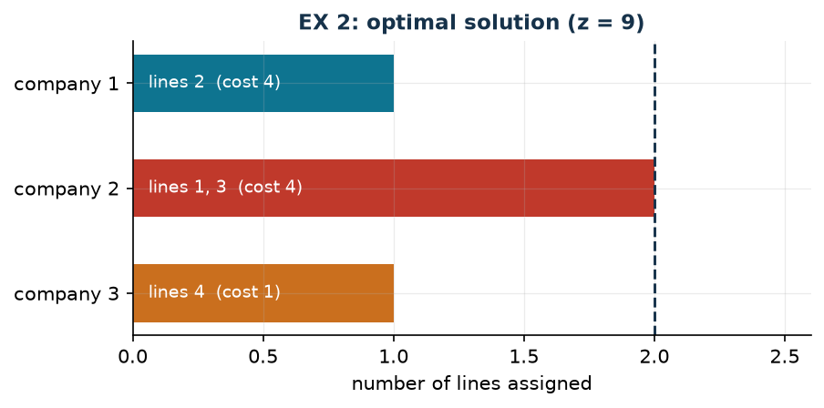

# EX 2 — Bus lines

**Class:** BIP · **Links:** none (a single family of variables) · **Script:** `python/ex02_buslines.py`

[](https://colab.research.google.com/github/fabiofurini/mip-modelling/blob/main/notebooks/ex02_buslines.ipynb)

Numerical model of the [assignment and scheduling](scheduling.md) family.

!!! abstract "EX 2"
    A city council is evaluating the offers of three bus companies for four bus
    lines. Each company has stated the cost at which it would operate each line:

    | Company | Line 1 | Line 2 | Line 3 | Line 4 |
    |---|---:|---:|---:|---:|
    | 1 | 10 | 4 | 9 | 7 |
    | 2 | 1 | 2 | 3 | 10 |
    | 3 | 8 | 9 | 10 | 1 |

    Every line must be assigned to exactly one company and every company may
    operate at most two lines. The total cost is minimised.

## Model

With $x_{ij} = 1$ if company $i$ operates line $j$ ($3 \cdot 4 = 12$ binary
variables):

$$
\begin{aligned}
\min ~~ \sum_{i=1}^{3} \sum_{j=1}^{4} c_{ij}\, x_{ij} & & \\
\text{subject to} \quad \sum_{i=1}^{3} x_{ij} &= 1, & \forall j \in \{1, \dots, 4\},\\
\sum_{j=1}^{4} x_{ij} &\le p, & \forall i \in \{1, 2, 3\},\\
x_{ij} &\in \{0,1\}. &
\end{aligned}
$$

Four **set partitioning** constraints (one per line) and three capacity
constraints (one per company), with $p = 2$. It is
[problem 7.1](scheduling-1.md) with the capacity counted in *number* of jobs
instead of time.

## Constructive heuristic: the primal bound

Constructive heuristic on the lines, in order: every line to the cheapest company among those
not yet full.

- **Line 1**: costs $10$, $1$, $8$ → company 2.
- **Line 2**: costs $4$, $2$, $9$ → company 2, now full.
- **Line 3**: companies 1 and 3 remain, costs $9$ and $10$ → company 1.
- **Line 4**: companies 1 and 3 remain, costs $7$ and $1$ → company 3.

Value $1 + 2 + 9 + 1 = 13$, so $\mathit{UB} = 13$.

## LP relaxation and dual: the dual bound

Relaxing $x_{ij} \in \{0,1\}$ to $x_{ij} \ge 0$, with $\alpha_j$ free for every
line constraint and $\pi_i \le 0$ for every capacity constraint:

$$
\begin{aligned}
\max ~~ \sum_{j=1}^{4} \alpha_j + p \sum_{i=1}^{3} \pi_i & & \\
\text{subject to} \quad \alpha_j + \pi_i &\le c_{ij}, & \forall i,\ \forall j,\\
\alpha_j \gtreqless 0, \qquad \pi_i &\le 0. &
\end{aligned}
$$

With the "zero out and saturate" recipe, $\bar\pi = 0$ and
$\bar\alpha_j = \min_i c_{ij} = (1, 2, 3, 1)$: feasible by construction,
$\mathit{LB} = 7$. Meaning: "every line costs at least the lowest offer it
received".

| $UB$ (constructive heuristic) | $LB$ (dual by hand) | $z(\mathrm{LP})$ | $z(\mathrm{MILP})$ | heuristic gap |
|---:|---:|---:|---:|---:|
| 13 | 7 | 9 | 9 | $44.4\%$ |



!!! tip "Exact relaxation, but not an exact dual recipe"
    $z(\mathrm{LP}) = z(\mathrm{MILP}) = 9$, yet the hand-built bound stops at
    $7$ and the heuristic is off by $44\%$. That the relaxation is exact says
    nothing about how good a particular dual solution is: they are two different
    things.

## Code

The complete script is
[`python/ex02_buslines.py`](https://github.com/fabiofurini/mip-modelling/blob/main/python/ex02_buslines.py);
the notebook is
[`notebooks/ex02_buslines.ipynb`](https://github.com/fabiofurini/mip-modelling/blob/main/notebooks/ex02_buslines.ipynb).

<!-- embedded-script: begin (regenerated by python/embed_code.py) -->

??? example "Show the complete script — `python/ex02_buslines.py` (105 lines)"

    ```python
    """EX 2 -- Bus lines: assignment with a capacity of two (family 7).

    Four lines, three companies, every line to one company, every company at most
    two lines. It is the generalised assignment of problem 7.1 with the capacity
    counted in number of jobs instead of time. Model, heuristic, dual of the pure
    relaxation with a hand-built solution, optimum and bound table.
    """
    import gurobipy as gp
    import pandas as pd
    from gurobipy import GRB

    from mip import (ammissibile, due_rilassamenti, frazione, nuovo_modello, registra_bound,
                     risolvi, stampa_soluzione, valuta)
    from stile import intestazione, plt, salva_dati, salva_figura

    R = range

    # ---------- 1. MODEL AND INSTANCE ----------
    intestazione("EX 2. Bus lines: four lines, three companies, at most two lines each")
    c = [[10, 4, 9, 7],      # cost of company 1 on the four lines
         [1, 2, 3, 10],
         [8, 9, 10, 1]]
    nc, nl, p = 3, 4, 2      # companies, lines, lines at most per company
    salva_dati(pd.DataFrame([{"company": i + 1, "line": j + 1, "c": c[i][j]}
                             for i in R(nc) for j in R(nl)]), "ex02_costi")


    def modello(c, p):
        nc, nl = len(c), len(c[0])
        m = nuovo_modello("bus_lines")
        x = m.addVars(nc, nl, vtype=GRB.BINARY, name="x")
        m.setObjective(gp.quicksum(c[i][j] * x[i, j] for i in R(nc) for j in R(nl)), GRB.MINIMIZE)
        m.addConstrs((x.sum("*", j) == 1 for j in R(nl)), name="line")
        m.addConstrs((x.sum(i, "*") <= p for i in R(nc)), name="capacity")
        return m, x


    def duale(c, p):
        """max sum_j alpha_j + p sum_i beta_i;  alpha_j + beta_i <= c_ij;  alpha free, beta <= 0."""
        nc, nl = len(c), len(c[0])
        d = nuovo_modello("dual_bus_lines")
        alpha = d.addVars(nl, lb=-GRB.INFINITY, name="alpha")
        beta = d.addVars(nc, lb=-GRB.INFINITY, ub=0.0, name="beta")
        d.setObjective(alpha.sum() + p * beta.sum(), GRB.MAXIMIZE)
        d.addConstrs((alpha[j] + beta[i] <= c[i][j] for i in R(nc) for j in R(nl)), name="rc")
        return d


    m, x = modello(c, p)

    # ---------- 2. CONSTRUCTIVE HEURISTIC (UPPER BOUND) ----------
    # constructive heuristic on the lines: every line to the cheapest company among those not yet full
    residuo = [p] * nc
    scelta = {}
    for j in R(nl):
        i = min((i for i in R(nc) if residuo[i] > 0), key=lambda i: (c[i][j], i))
        scelta[j] = i
        residuo[i] -= 1
        print(f"  Line {j + 1}: companies with free slots "
              + ", ".join(f"{k + 1} (cost {c[k][j]})" for k in R(nc) if residuo[k] > 0 or k == i)
              + f"; the cheapest is {i + 1}, so x[{i + 1}][{j + 1}] = 1")
    ub = sum(c[scelta[j]][j] for j in R(nl))
    sol_eur = {f"x[{scelta[j]},{j}]": 1 for j in R(nl)}
    assert ammissibile(m, sol_eur)
    print("  Heuristic solution: " + ", ".join(f"line {j + 1} -> company {scelta[j] + 1}"
                                               for j in R(nl))
          + f"   ub = {frazione(ub)}")

    # ---------- 3. LP RELAXATION AND DUAL (LOWER BOUND) ----------
    d = duale(c, p)
    mano = {f"alpha[{j}]": min(c[i][j] for i in R(nc)) for j in R(nl)}   # beta = 0
    lb, viol = valuta(d, mano)
    assert viol <= 1e-9, viol
    print("  Dual by hand (beta = 0): alpha_j = min_i c_ij = "
          + ", ".join(frazione(mano[f"alpha[{j}]"]) for j in R(nl)) + f"  ->  lb = {frazione(lb)}")
    zlp, zlpr, pi = due_rilassamenti(m, d)

    # ---------- 4. MILP OPTIMUM AND BOUND TABLE ----------
    z = risolvi(m)
    ott = [(i, j) for i in R(nc) for j in R(nl) if x[i, j].X > 0.5]
    print("  Optimal solution: " + ", ".join(f"line {j + 1} -> company {i + 1}"
                                             for i, j in sorted(ott, key=lambda t: t[1])))
    riga = registra_bound("EX 2 bus lines", ub, lb, zlp, zlpr, z)
    salva_dati(pd.DataFrame([riga]), "ex02_bound")
    assert lb <= zlp <= z <= ub + 1e-9

    # ---------- 5. FIGURE ----------
    fig, ax = plt.subplots(figsize=(6.4, 2.8))
    for i in R(nc):
        linee = [j for (ii, j) in ott if ii == i]
        ax.barh(i, len(linee), color=["#0E7490", "#C0392B", "#CA6F1E"][i], height=0.55)
        if linee:
            ax.annotate("lines " + ", ".join(str(j + 1) for j in linee) +
                        f"  (cost {sum(c[i][j] for j in linee)})",
                        (0.06, i), va="center", fontsize=9, color="white")
    ax.axvline(p, color="#16324A", ls="--", lw=1.4)
    ax.annotate(f"at most {p}", (p, -0.55), ha="center", fontsize=9, color="#16324A")
    ax.set_yticks(R(nc))
    ax.set_yticklabels([f"company {i + 1}" for i in R(nc)])
    ax.set_xlabel("number of lines assigned")
    ax.set_xlim(0, p + 0.6)
    ax.set_title(f"EX 2: optimal solution (z = {frazione(z)})")
    ax.invert_yaxis()
    salva_figura(fig, "ex02_ottimo")
    print("Done.")
    ```

<!-- embedded-script: end -->
