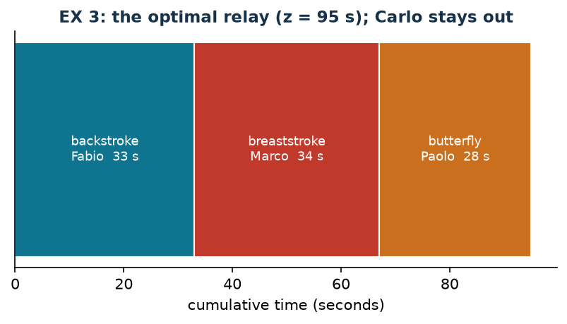

# EX 3 — Relay

**Class:** BIP · **Links:** none (a single family of variables) · **Script:** `python/ex03_relay.py`

[](https://colab.research.google.com/github/fabiofurini/mip-modelling/blob/main/notebooks/ex03_relay.ipynb)

One of the [fifteen numerical models](numerical.md), of the [assignment and scheduling](scheduling.md) family.

!!! abstract "EX 3"
    A coach must form a relay team by choosing three swimmers out of four. The
    race has three 50-metre legs: backstroke, breaststroke and butterfly. The
    recorded times (seconds) are:

    | Stroke | Carlo | Paolo | Fabio | Marco |
    |---|---:|---:|---:|---:|
    | Backstroke | 37 | 32 | 33 | 37 |
    | Breaststroke | 43 | 33 | 42 | 34 |
    | Butterfly | 33 | 28 | 38 | 30 |

    The total relay time is minimised.

## Model

With $x_{sn} = 1$ if stroke $s$ is swum by $n$ ($12$ binaries):
$\sum_n x_{sn} = 1$ for every stroke (3 constraints),
$\sum_s x_{sn} \le 1$ for every swimmer (4 constraints), objective
$\min \sum_{s,n} t_{sn} x_{sn}$. One swimmer stays out: it is an assignment with
**more resources than tasks**.

## Constructive heuristic: the primal bound

Constructive heuristic on the strokes in the given order: backstroke to Paolo ($32$),
breaststroke to Marco ($34$, the fastest of the three left), butterfly to Carlo
($33$). Total $\mathit{UB} = 99$ seconds.

## LP relaxation and dual: the dual bound

The same structure as [EX 2](ex-02.md) with $p = 1$: $\bar\pi = 0$ and
$\bar\alpha_s = \min_n t_{sn} = (32, 33, 28)$, so $\mathit{LB} = 93$. Meaning:
"every stroke costs at least the time of its best specialist".

The bound is weak exactly when two strokes share the same best specialist —
here Paolo is the fastest in both backstroke and butterfly, and indeed $93$ is
not attainable.

| $UB$ (constructive heuristic) | $LB$ (dual by hand) | $z(\mathit{LP})$ | $z(\mathit{MILP})$ | heuristic gap |
|---:|---:|---:|---:|---:|
| 99 | 93 | 95 | 95 | $4.2\%$ |

The optimum is $95$ seconds: backstroke to Fabio ($33$), breaststroke to Marco
($34$), butterfly to Paolo ($28$); Carlo stays out.



!!! note "Why the relaxation is exact here"
    The matrix of the model is that of the assignment problem: **totally
    unimodular**. All the vertices of the relaxation are integer, so
    $z(\mathit{LP}) = z(\mathit{MILP})$ and integrality costs nothing — the same
    phenomenon as [alldiff](links-12.md). This stops being true as soon as a
    capacity constraint with coefficients other than $0$ and $1$ is added.

## Code

The complete script is
[`python/ex03_relay.py`](https://github.com/fabiofurini/mip-modelling/blob/main/python/ex03_relay.py);
the notebook is
[`notebooks/ex03_relay.ipynb`](https://github.com/fabiofurini/mip-modelling/blob/main/notebooks/ex03_relay.ipynb).

<!-- embedded-script: begin (regenerated by python/embed_code.py) -->

??? example "Show the complete script — `python/ex03_relay.py` (109 lines)"

    ```python
    """EX 3 -- Relay: three strokes, four swimmers, one stays out (family 7).

    An assignment with more "machines" than "jobs": every stroke to exactly one
    swimmer, every swimmer at most one stroke. The capacity is unit, so the matrix
    is that of the assignment problem: totally unimodular, and the relaxation is
    exact.
    """
    import gurobipy as gp
    import pandas as pd
    from gurobipy import GRB

    from mip import (ammissibile, due_rilassamenti, frazione, nuovo_modello, registra_bound,
                     risolvi, valuta)
    from stile import intestazione, plt, salva_dati, salva_figura

    R = range

    # ---------- 1. MODEL AND INSTANCE ----------
    intestazione("EX 3. Relay: three strokes to be assigned to four swimmers")
    NUOTATORI = ["Carlo", "Paolo", "Fabio", "Marco"]
    STILI = ["backstroke", "breaststroke", "butterfly"]
    t = [[37, 32, 33, 37],
         [43, 33, 42, 34],
         [33, 28, 38, 30]]
    ns, nn = 3, 4
    salva_dati(pd.DataFrame([{"stroke": STILI[s], "swimmer": NUOTATORI[n], "t": t[s][n]}
                             for s in R(ns) for n in R(nn)]), "ex03_tempi")


    def modello(t):
        ns, nn = len(t), len(t[0])
        m = nuovo_modello("relay")
        x = m.addVars(ns, nn, vtype=GRB.BINARY, name="x")
        m.setObjective(gp.quicksum(t[s][n] * x[s, n] for s in R(ns) for n in R(nn)), GRB.MINIMIZE)
        m.addConstrs((x.sum(s, "*") == 1 for s in R(ns)), name="stroke")
        m.addConstrs((x.sum("*", n) <= 1 for n in R(nn)), name="swimmer")
        return m, x


    def duale(t):
        """max sum_s alpha_s + sum_n beta_n;  alpha_s + beta_n <= t_sn;  alpha free, beta <= 0."""
        ns, nn = len(t), len(t[0])
        d = nuovo_modello("dual_relay")
        alpha = d.addVars(ns, lb=-GRB.INFINITY, name="alpha")
        beta = d.addVars(nn, lb=-GRB.INFINITY, ub=0.0, name="beta")
        d.setObjective(alpha.sum() + beta.sum(), GRB.MAXIMIZE)
        d.addConstrs((alpha[s] + beta[n] <= t[s][n] for s in R(ns) for n in R(nn)), name="rc")
        return d


    m, x = modello(t)

    # ---------- 2. CONSTRUCTIVE HEURISTIC (UPPER BOUND) ----------
    liberi = set(R(nn))
    scelta = {}
    for s in R(ns):
        n = min(liberi, key=lambda n: (t[s][n], n))
        scelta[s] = n
        liberi.discard(n)
        print(f"  {STILI[s].capitalize()}: available swimmers "
              + ", ".join(f"{NUOTATORI[k]} ({t[s][k]} s)" for k in sorted(liberi | {n}))
              + f"; the fastest is {NUOTATORI[n]}")
    ub = sum(t[s][scelta[s]] for s in R(ns))
    sol_eur = {f"x[{s},{scelta[s]}]": 1 for s in R(ns)}
    assert ammissibile(m, sol_eur)
    print("  Heuristic solution: " + ", ".join(f"{STILI[s]} -> {NUOTATORI[scelta[s]]}" for s in R(ns))
          + f"   ub = {frazione(ub)} s")

    # ---------- 3. LP RELAXATION AND DUAL (LOWER BOUND) ----------
    d = duale(t)
    mano = {f"alpha[{s}]": min(t[s]) for s in R(ns)}       # beta = 0
    lb, viol = valuta(d, mano)
    assert viol <= 1e-9, viol
    print("  Dual by hand (beta = 0): alpha_s = min_n t_sn = "
          + ", ".join(frazione(mano[f"alpha[{s}]"]) for s in R(ns)) + f"  ->  lb = {frazione(lb)} s")
    print("  Meaning: 'every stroke costs at least the time of its best specialist';")
    print("  the bound is weak when two strokes share the same best specialist.")
    zlp, zlpr, pi = due_rilassamenti(m, d)

    # ---------- 4. MILP OPTIMUM AND BOUND TABLE ----------
    z = risolvi(m)
    ott = {s: n for s in R(ns) for n in R(nn) if x[s, n].X > 0.5}
    fuori = [NUOTATORI[n] for n in R(nn) if n not in ott.values()]
    print("  Optimal solution: " + ", ".join(f"{STILI[s]} -> {NUOTATORI[ott[s]]} ({t[s][ott[s]]} s)"
                                             for s in R(ns))
          + f"   total {frazione(z)} s; {', '.join(fuori)} stays out")
    riga = registra_bound("EX 3 relay", ub, lb, zlp, zlpr, z)
    salva_dati(pd.DataFrame([riga]), "ex03_bound")
    assert lb <= zlp <= z <= ub + 1e-9
    assert abs(zlp - z) < 1e-9, "the assignment matrix is TU: the relaxation is exact"
    print("  z(LP) = z(MILP): the matrix of the model is that of the assignment problem,")
    print("  totally unimodular, so the relaxation has integer vertices and integrality is free.")

    # ---------- 5. FIGURE ----------
    fig, ax = plt.subplots(figsize=(6.6, 2.9))
    colori = ["#0E7490", "#C0392B", "#CA6F1E"]
    inizio = 0
    for s in R(ns):
        ax.barh(0, t[s][ott[s]], left=inizio, color=colori[s], edgecolor="white")
        ax.annotate(f"{STILI[s]}\n{NUOTATORI[ott[s]]}  {t[s][ott[s]]} s",
                    (inizio + t[s][ott[s]] / 2, 0), ha="center", va="center",
                    fontsize=8.5, color="white")
        inizio += t[s][ott[s]]
    ax.set_yticks([])
    ax.set_xlabel("cumulative time (seconds)")
    ax.set_title(f"EX 3: the optimal relay (z = {frazione(z)} s); {fuori[0]} stays out")
    ax.grid(False)
    salva_figura(fig, "ex03_ottimo")
    print("Done.")
    ```

<!-- embedded-script: end -->
