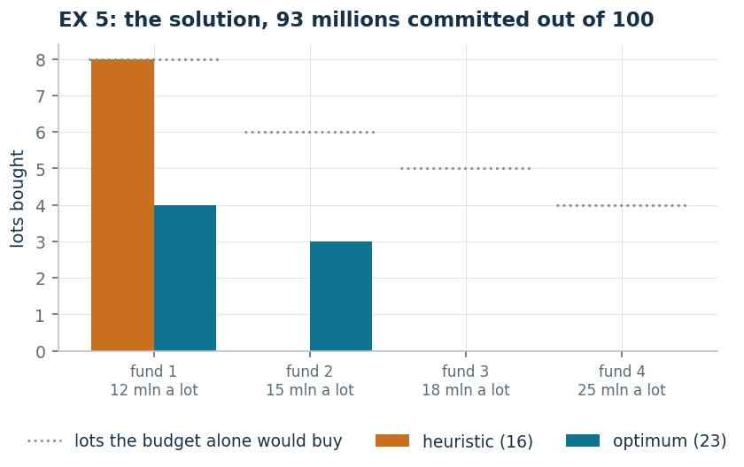

# EX 5 — Funds bought in lots

[:material-file-pdf-box: Lecture notes (PDF)](pdf/notes-2-numerical.pdf) · [:material-presentation: Slides (PDF)](pdf/slides-07-numerical-models-1.pdf)

**Class:** ILP · **Links:** [integer counts](links-04.md), proportion constraint · **Script:** `python/ex05_funds.py`<br>
**Difficulty:** ★☆☆☆☆ · **Time:** 30–45 min
{ .scheda }

[](https://colab.research.google.com/github/fabiofurini/mip-modelling/blob/main/notebooks/ex05_funds.ipynb)

One of the [fifteen numerical models](numerical.md): the right place to see how a
dual certificate is checked, and how a proportion constraint can defeat a greedy
heuristic.

!!! abstract "EX 5"
    After a win, an investor has to decide how to place $100$ million lire. A
    friend suggests four types of mutual fund. Units are bought only in
    **indivisible lots**, costing $12$, $15$, $18$ and $25$ million respectively.
    The estimated annual return is $1/6$ of the capital invested for the first
    fund, $1/3$ for the second, $1/9$ for the third and $16\%$ for the fourth.
    Moreover the number of lots of the second fund cannot exceed $50\%$ of the
    total number of lots bought. The expected annual return is to be maximised.

## Model

The return of a lot is $12 \cdot 1/6 = 2$ million for the first fund,
$15 \cdot 1/3 = 5$ for the second, $18 \cdot 1/9 = 2$ for the third and
$25 \cdot 0.16 = 4$ for the fourth. The share constraint
$x_2 \le \tfrac12 (x_1 + x_2 + x_3 + x_4)$, multiplied by $2$ and moved to the
left, becomes $-x_1 + x_2 - x_3 - x_4 \le 0$. With $x_j$ the number of lots of
fund $j$:

<!-- modello-esteso: ex05_primale -->

<div class="modello-esteso" markdown>

$$
\begin{array}{rrrrr c l}
\max & 2x_1 & +5x_2 & +2x_3 & +4x_4 &  & \\
\text{subject to} & 12x_1 & +15x_2 & +18x_3 & +25x_4 & \le & 100\\
 & -x_1 & +x_2 & -x_3 & -x_4 & \le & 0\\
 & x_1, & x_2, & x_3, & x_4 & \in & \Z_{\ge 0}
\end{array}
$$

</div>

<!-- modello-esteso: fine -->

An **integer knapsack**, not a binary one: the variables count lots, not choices.
The first row is the **budget**, the second the **share** of the second fund
written in linear form; the last declares the four variables integer and
non-negative.

## Constructive heuristic: the primal bound

This is a **maximisation**. The funds are scanned by decreasing return per
million invested: $1/3$ for the second, $1/6$ for the first, $4/25$ for the
fourth and $1/9$ for the third.

- **Fund 2**, the best one: **no lot** is bought. On its own it would break the
  share at once, which grants it at most half of the total lots.
- **Fund 1**: $8$ lots are bought, $96$ million.
- $4$ million are left: not enough for any other lot.

$$\mathit{LB} = 16.$$

The heuristic has tripped over the best fund itself. Buying a lot of it pays, but
only *together* with a lot of another fund, and a rule that looks at one element
at a time cannot see that.

## LP relaxation and dual: the dual bound

With $\alpha \ge 0$ on the budget and $\beta \ge 0$ on the share:

With $\alpha \ge 0$ on the budget and $\beta \ge 0$ on the share, one row per
fund.

!!! danger "An attempt that is not feasible"
    A choice that comes naturally is $\bar\alpha = 5/32$, $\bar\beta = 1/8$. Let
    us check the first constraint:

    $$12 \cdot \frac{5}{32} - \frac{1}{8} = \frac{60}{32} - \frac{4}{32} = \frac{56}{32} = \frac{7}{4} < 2.$$

    It is violated by $1/4$: that pair is **not** a feasible dual solution, and
    the value $100 \cdot 5/32$ is not a bound. A dual value can be read as a
    bound only after checking *all* the constraints, one by one.

**The correct recipe** is $\bar\beta = 0$ and

$$\bar\alpha = \max_j \frac{p_j}{c_j}
= \max\Bigl(\frac{2}{12}, \frac{5}{15}, \frac{2}{18}, \frac{4}{25}\Bigr)
= \frac{1}{3},$$

that is, "a million is worth what it returns in the better fund". Both
constraints become $c_j\, \bar\alpha \ge p_j$ and are satisfied, and

$$\mathit{UB} = 100 \cdot \frac{1}{3} = \frac{100}{3} \approx 33.33.$$

<!-- modello-esteso: ex05_duale -->

<div class="modello-esteso" markdown>

$$
\begin{array}{rrr c l}
\min & 100\alpha &  &  & \\
\text{subject to} & 12\alpha & -\beta & \ge & 2\\
 & 15\alpha & +\beta & \ge & 5\\
 & 18\alpha & -\beta & \ge & 2\\
 & 25\alpha & -\beta & \ge & 4\\
 & \alpha &  & \ge & 0\\
 &  & \beta & \ge & 0
\end{array}
$$

</div>

<!-- modello-esteso: fine -->

The variable $\alpha$ is the price of one million of budget, $\beta$ that of the
share. One row per fund: buying a lot of fund $j$ commits $c_j$ million and moves
the share by one unit — in the direction that helps it for fund 2, in the
opposite one for the others — and the total must cover the return of the lot. The
objective values the whole budget at that price.

## Optimum and comparison

| $\mathit{LB}$ | $\mathit{UB}$ | $z(\mathit{LP})$ | $z(\mathit{LP}^+)$ | $z(\mathit{MILP})$ |
|---:|---:|---:|---:|---:|
| 16 | $100/3$ | $700/27$ | $700/27$ | 23 |

The optimum buys $4$ lots of the first fund and $3$ of the second, $93$ million
for a return of $23$: the heuristic stops at $16$ and is $30\%$ off. The
difference $700/27 - 23 = 79/27$ is the **price of integrality**: the relaxation
would buy lots in pieces.

Note that the dual bound built by hand, $100/3$, stays far away: "a million is
worth what it returns in the best fund" ignores that the best fund cannot be
bought on its own. It is a valid recipe, not a good one.

!!! tip "What the share costs"
    Dropping the share constraint the optimum would rise from $23$ to $30$: six
    lots of the second fund and nothing else, $90$ million spent. The share
    therefore costs $7$ million of return a year, and this is how one measures
    what a constraint really does: remove it and see how much the optimum
    moves.



## Code

The full script is
[`python/ex05_funds.py`](https://github.com/fabiofurini/mip-modelling/blob/main/python/ex05_funds.py);
the notebook is
[`notebooks/ex05_funds.ipynb`](https://github.com/fabiofurini/mip-modelling/blob/main/notebooks/ex05_funds.ipynb).

<!-- embedded-script: begin (regenerated by python/embed_code.py) -->

??? example "Show the complete script — `python/ex05_funds.py` (175 lines)"

    ```python
    """EX 5 -- Mutual funds bought in lots (family 10).

    An integer (not binary) knapsack with only two lot types and a proportion
    constraint rewritten in linear form. It also shows how a dual solution is checked:
    an infeasible one is exhibited here first, as a
    counterexample before the correct one is built.
    """
    import gurobipy as gp
    import pandas as pd
    from gurobipy import GRB

    from mip import (ammissibile, due_rilassamenti, frazione, nuovo_modello, registra_bound,
                     risolvi, stampa_lp, valuta)
    from stile import ARANCIO, BLU, GRIGIO, TEAL, intestazione, plt, salva_dati, salva_figura
    from esteso import salva_modello

    R = range

    # ---------- 1. MODEL AND INSTANCE ----------
    intestazione("EX 5. Funds in lots: maximising the annual return within the budget")
    c12 = [12, 15, 18, 25]         # cost of one lot (millions)
    t12 = [1 / 6, 1 / 3, 1 / 9, 0.16]   # annual return, a fraction of the capital invested
    nf = len(c12)
    p12 = [c12[j] * t12[j] for j in R(nf)]  # return of one lot: 2, 5, 2 and 4 millions
    B12 = 100                      # budget available
    QUOTA = 0.5                    # fund 2 cannot exceed half of the total lots
    # in the share constraint fund 2 has coefficient +1 and the others -1
    QC = [1 if j == 1 else -1 for j in R(nf)]
    salva_dati(pd.DataFrame({"fund": list(R(1, nf + 1)), "lot_cost": c12, "return": t12,
                             "lot_return": p12}), "ex05_dati")
    print("  Return of one lot: "
          + ", ".join(f"fund {j + 1} = {c12[j]} * {frazione(t12[j])} = {frazione(p12[j])}"
                      for j in R(nf)) + " millions.")
    print(f"  The constraint x2 <= {QUOTA} (x1 + x2 + x3 + x4) becomes, multiplying by 2 and "
          "moving to the left, -x1 + x2 - x3 - x4 <= 0.")


    def modello(c, p, B):
        m = nuovo_modello("funds")
        x = m.addVars(nf, vtype=GRB.INTEGER, name="x")
        m.setObjective(gp.quicksum(p[j] * x[j] for j in R(nf)), GRB.MAXIMIZE)
        m.addConstr(gp.quicksum(c[j] * x[j] for j in R(nf)) <= B, name="budget")
        m.addConstr(gp.quicksum(QC[j] * x[j] for j in R(nf)) <= 0, name="share")
        return m, x


    def duale(c, p, B):
        """min B alpha  s.t.  c_j alpha + QC_j beta >= p_j for every fund,  alpha, beta >= 0."""
        d = nuovo_modello("dual_funds")
        alpha = d.addVar(name="alpha")     # budget
        beta = d.addVar(name="beta")       # share
        d.setObjective(B * alpha, GRB.MINIMIZE)
        d.addConstrs((c[j] * alpha + QC[j] * beta >= p[j] for j in R(nf)), name="rc")
        return d


    m12, x12 = modello(c12, p12, B12)
    salva_modello(m12, "ex05_primale")
    print("  The model of the instance:")
    stampa_lp(m12)

    # ---------- 2. CONSTRUCTIVE HEURISTIC (LOWER BOUND) ----------
    # constructive heuristic on the return per million invested, respecting the share at every purchase
    def euristica(c, p, B):
        x = [0] * nf
        ordine = sorted(R(nf), key=lambda j: (-p[j] / c[j], j))
        passi = ["return per million invested: "
                 + ", ".join(f"fund {j + 1} = {frazione(p[j])}/{c[j]} = {frazione(p[j] / c[j])}"
                             for j in R(nf))
                 + f"; we start from fund {ordine[0] + 1}"]
        for j in ordine:
            comprati = 0
            while True:
                prova = list(x)
                prova[j] += 1
                if (sum(c[k] * prova[k] for k in R(nf)) > B
                        or sum(QC[k] * prova[k] for k in R(nf)) > 0):
                    break
                x, comprati = prova, comprati + 1
            residuo = B - sum(c[k] * x[k] for k in R(nf))
            motivo = ("the remaining budget is not enough for another lot"
                      if residuo < c[j] else "another lot would violate the share")
            passi.append(f"fund {j + 1}: {comprati} lots are bought and we stop because "
                         f"{motivo} ({residuo} millions left)")
        return x, passi


    x_eur, passi = euristica(c12, p12, B12)
    for k, riga in enumerate(passi, 1):
        print(f"  Step {k}. {riga}")
    lb12 = sum(p12[j] * x_eur[j] for j in R(nf))
    sol_eur = {f"x[{j}]": x_eur[j] for j in R(nf)}
    assert ammissibile(m12, sol_eur), sol_eur
    print(f"  Heuristic solution: {x_eur[0]} lots of fund 1 and {x_eur[1]} of fund 2   "
          f"lb = {frazione(lb12)}")

    # ---------- 3. LP RELAXATION AND DUAL (UPPER BOUND) ----------
    d12 = duale(c12, p12, B12)
    salva_modello(d12, "ex05_duale")
    # counterexample: the choice alpha = 5/32, beta = 1/8 is not feasible
    tentativo = {"alpha": 5 / 32, "beta": 1 / 8}
    val_t, viol_t = valuta(d12, tentativo)
    print(f"  A NOT feasible attempt: alpha = 5/32, beta = 1/8 gives "
          f"{c12[0]} * 5/32 - 1/8 = {frazione(c12[0] * 5 / 32 - 1 / 8)} < {frazione(p12[0])}: "
          f"the first dual constraint is violated by {frazione(viol_t)}.")
    print("  A dual value may be read as a bound only after checking ALL the constraints.")
    assert viol_t > 1e-9
    # correct recipe: beta = 0 and alpha equal to the highest return per million
    alpha_min = max(p12[j] / c12[j] for j in R(nf))
    mano = {"alpha": alpha_min, "beta": 0.0}
    ub12, viol = valuta(d12, mano)
    assert viol <= 1e-9, viol
    print(f"  Hand-built dual: beta = 0 and alpha = max_j p_j / c_j = {frazione(alpha_min)} "
          "(a million is worth what it returns in the best fund),")
    print(f"  so every constraint c_j alpha >= p_j holds  ->  ub = {B12} * alpha = "
          f"{frazione(ub12)}")
    zlp12, zlp12r, _ = due_rilassamenti(m12, d12)

    # ---------- 4. OPTIMUM OF THE MILP ----------
    z12 = risolvi(m12)
    print(f"  Optimal solution: {int(x12[0].X)} lots of fund 1 and {int(x12[1].X)} of fund 2, "
          f"spending {int(sum(c12[j] * x12[j].X for j in R(nf)))} out of {B12}, return "
          f"{frazione(z12)}")
    riga = registra_bound("EX 5 funds", ub12, lb12, zlp12, zlp12r, z12, senso="max")
    salva_dati(pd.DataFrame([riga]), "ex05_bound")
    assert lb12 <= z12 <= zlp12 <= ub12 + 1e-9

    # ---------- 5. THE PRICE OF INTEGRALITY ----------
    intestazione("EX 5. The price of integrality and the role of the share")
    print(f"  z(LP) = {frazione(zlp12)} against z(MILP) = {frazione(z12)}: the relaxation buys")
    print(f"  {frazione(B12 / c12[0])} lots of fund 1, which cannot be bought in pieces.")
    print(f"  The difference {frazione(zlp12 - z12)} is the cost of the indivisibility of the lots.")
    print()
    print("  The share bites: fund 2 returns more than twice the others per million invested,")
    print("  and without the constraint one would buy that fund alone. With the share, every lot")
    print("  of fund 2 has to be matched by a lot of some other fund:")
    p_povero = [3.0 if j == 1 else p12[j] for j in R(nf)]   # fund 2 down to 20 per cent
    prove = []
    for nome, p_alt, quota in [("original data, with share", p12, True),
                               ("original data, without share", p12, False),
                               ("fund 2 less profitable, with share", p_povero, True),
                               ("fund 2 less profitable, without share", p_povero, False)]:
        m, x = modello(c12, p_alt, B12)
        if not quota:
            m.update()
            m.remove([c for c in m.getConstrs() if c.ConstrName == "share"][0])
            m.update()
        z = risolvi(m)
        print(f"  {nome:38s} z = {frazione(z):>4}   "
              f"x = ({', '.join(str(int(x[j].X)) for j in R(nf))})")
        prove.append({"variant": nome, "z": z}
                     | {f"x{j + 1}": int(x[j].X) for j in R(nf)})
    salva_dati(pd.DataFrame(prove), "ex05_quota")
    assert prove[2]["z"] < prove[3]["z"], "with a more profitable fund 2 the share must bite"

    # ---------- 6. FIGURE: THE SOLUTION ----------
    # same look as the other figures of the chapter: one group of bars per fund,
    # heuristic against optimum, and how much each solution commits
    fig, ax = plt.subplots(figsize=(6.4, 3.0))
    idx = list(R(nf))
    ax.bar([j - 0.2 for j in idx], [x_eur[j] for j in idx], 0.4, color=ARANCIO,
           label=f"heuristic ({frazione(lb12)})")
    ax.bar([j + 0.2 for j in idx], [x12[j].X for j in idx], 0.4, color=TEAL,
           label=f"optimum ({frazione(z12)})")
    for j in idx:
        massimo = B12 // c12[j]
        ax.plot([j - 0.42, j + 0.42], [massimo, massimo], color=GRIGIO, lw=1.3, ls=":")
    ax.plot([], [], color=GRIGIO, lw=1.3, ls=":", label="lots the budget alone would buy")
    ax.set_xticks(idx)
    ax.set_xticklabels([f"fund {j + 1}\n{c12[j]} mln a lot" for j in idx], fontsize=8)
    ax.set_ylabel("lots bought")
    ax.set_title(f"EX 5: the solution, {int(sum(c12[j] * x12[j].X for j in R(nf)))} millions "
                 f"committed out of {B12}")
    salva_figura(fig, "ex05_regione")
    print("Done.")
    ```

<!-- embedded-script: end -->
