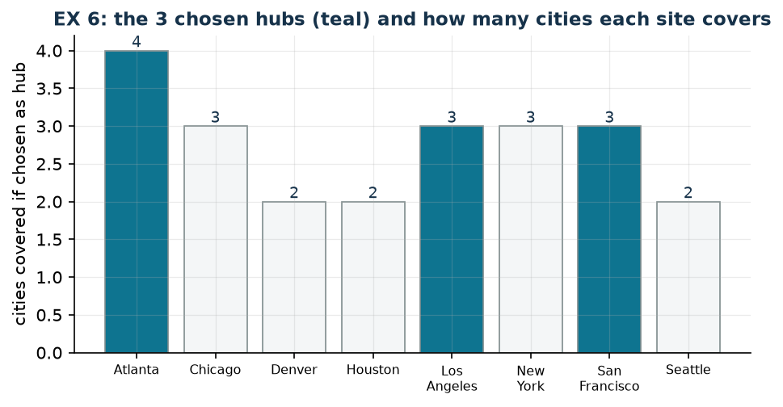

# EX 6 — Hub-and-spoke

**Class:** BIP · **Links:** covering · **Script:** `python/ex06_hub.py`

[](https://colab.research.google.com/github/fabiofurini/mip-modelling/blob/main/notebooks/ex06_hub.ipynb)

One of the [fifteen numerical models](numerical.md), of the [location and covering](location.md) family.

!!! abstract "EX 6"
    An airline organises its network with a *hub-and-spoke* system: a hub serves
    directly every city within $1000$ miles. The company operates on eight
    cities; for each of them, the cities within $1000$ miles are:

    | City | Cities within 1000 miles |
    |---|---|
    | Atlanta | Atlanta, Chicago, Houston, New York |
    | Chicago | Atlanta, Chicago, New York |
    | Denver | Denver, Los Angeles |
    | Houston | Atlanta, Houston |
    | Los Angeles | Denver, Los Angeles, San Francisco |
    | New York | Atlanta, Chicago, New York |
    | San Francisco | Los Angeles, San Francisco, Seattle |
    | Seattle | San Francisco, Seattle |

    The minimum number of hubs is wanted, such that every city is within $1000$
    miles of at least one hub.

## Model

With $y_j = 1$ if city $j$ becomes a hub ($8$ binaries) and $S_i$ the set of
cities covering city $i$:

$$
\begin{aligned}
\min ~~ \sum_{j=1}^{8} y_j & & \\
\text{subject to} \quad \sum_{j \in S_i} y_j &\ge 1, & \forall i \in \{1, \dots, 8\},\\
y_j &\in \{0,1\}. &
\end{aligned}
$$

A pure **set covering**: eight covering constraints, all costs equal to $1$. The
relation "within $1000$ miles" is symmetric, so $j \in S_i \iff i \in S_j$: the
matrix of the model is symmetric.

## Constructive heuristic: the primal bound

[Constructive covering heuristic](modelling-5.md), with the criterion "cost per newly covered
city".

- **Step 1.** Ratios $1/4$ for Atlanta, $1/3$ for Chicago, New York and San
  Francisco, $1/2$ for the others: **Atlanta** is chosen, covering Atlanta,
  Chicago, Houston and New York.
- **Step 2.** Denver, Los Angeles, San Francisco and Seattle remain; ratios
  $1/2$, $1/3$, $1/3$, $1/2$: **Los Angeles** is chosen, covering Denver, Los
  Angeles and San Francisco.
- **Step 3.** Seattle remains; ratio $1/1$ for San Francisco and for Seattle:
  **San Francisco** is chosen.

Three hubs, so $\mathit{UB} = 3$.

## LP relaxation and dual: the dual bound

Relaxing to $y_j \ge 0$, with $\pi_i \ge 0$ for every covering constraint:

$$
\begin{aligned}
\max ~~ \sum_{i=1}^{8} \pi_i & & \\
\text{subject to} \quad \sum_{i \,:\, j \in S_i} \pi_i &\le 1, & \forall j \in \{1, \dots, 8\},\\
\pi_i &\ge 0. &
\end{aligned}
$$

Dual constructive heuristic on the cities, in order: $\pi_i$ is raised until the first opposing
dual constraint becomes tight, and the residuals are updated.

- **Atlanta** is covered by four hubs, all with residual $1$: $\bar \pi_1 = 1$,
  and the residuals of Atlanta, Chicago, Houston and New York drop to zero.
- **Chicago**, **Houston** and **New York** have all their hubs at residual
  zero: $\bar\pi = 0$.
- **Denver** is covered by Denver and Los Angeles, both with residual $1$:
  $\bar \pi_3 = 1$.
- **Los Angeles** and **San Francisco** have one hub at residual zero:
  $\bar\pi = 0$.
- **Seattle** is covered by San Francisco and Seattle, both with residual $1$:
  $\bar \pi_8 = 1$.

$\mathit{LB} = 3$.

!!! tip "What this bound proves, in words"
    The three cities that received $\pi_i = 1$ — Atlanta, Denver, Seattle — are
    pairwise "far apart": no city can serve as a hub for two of them. Hence at
    least three hubs are needed. The dual has formalised an argument one could
    tell without writing it: that is the point of the constructive heuristic recipe.

| $UB$ (constructive heuristic) | $LB$ (dual by hand) | $z(\mathit{LP})$ | $z(\mathit{MILP})$ | heuristic gap |
|---:|---:|---:|---:|---:|
| 3 | 3 | 3 | 3 | $0.0\%$ |

The optimum is $3$ hubs in Atlanta, Los Angeles and San Francisco — the same
solution as the constructive heuristic. The two hand-built bounds coincide: optimality is proved
without the solver.



## Code

The complete script is
[`python/ex06_hub.py`](https://github.com/fabiofurini/mip-modelling/blob/main/python/ex06_hub.py);
the notebook is
[`notebooks/ex06_hub.ipynb`](https://github.com/fabiofurini/mip-modelling/blob/main/notebooks/ex06_hub.ipynb).

<!-- embedded-script: begin (regenerated by python/embed_code.py) -->

??? example "Show the complete script — `python/ex06_hub.py` (104 lines)"

    ```python
    """EX 6 -- Hub-and-spoke: the minimum number of hubs covering eight cities (family 8).

    A pure set covering with all costs equal to 1: the number of hubs is minimised.
    The dual is the fractional packing of the customers, and the dual constructive heuristic on the
    cities finds here a bound that coincides with the optimum.
    """
    import gurobipy as gp
    import pandas as pd
    from gurobipy import GRB

    from euristiche import euristica_copertura
    from mip import (ammissibile, due_rilassamenti, frazione, nuovo_modello, registra_bound,
                     risolvi, valuta)
    from stile import intestazione, plt, salva_dati, salva_figura

    R = range

    # ---------- 1. MODEL AND INSTANCE ----------
    intestazione("EX 6. Hub-and-spoke: the fewest hubs within 1000 miles of every city")
    CITTA = ["Atlanta", "Chicago", "Denver", "Houston", "Los Angeles", "New York",
             "San Francisco", "Seattle"]
    copre = [[0, 1, 3, 5], [0, 1, 5], [2, 4], [0, 3], [2, 4, 6], [0, 1, 5], [4, 6, 7], [6, 7]]
    n = len(CITTA)
    salva_dati(pd.DataFrame([{"city": CITTA[i], "covered_by": ", ".join(CITTA[j] for j in copre[i])}
                             for i in R(n)]), "ex06_copertura")


    def modello(copre):
        n = len(copre)
        m = nuovo_modello("hub_spoke")
        y = m.addVars(n, vtype=GRB.BINARY, name="y")
        m.setObjective(y.sum(), GRB.MINIMIZE)
        m.addConstrs((gp.quicksum(y[j] for j in copre[i]) >= 1 for i in R(n)), name="cover")
        return m, y


    def duale(copre):
        """max sum_i u_i;  sum_{i : j covers i} u_i <= 1 for every j;  u >= 0."""
        n = len(copre)
        d = nuovo_modello("dual_hub_spoke")
        u = d.addVars(n, name="u")
        d.setObjective(u.sum(), GRB.MAXIMIZE)
        d.addConstrs((gp.quicksum(u[i] for i in R(n) if j in copre[i]) <= 1 for j in R(n)),
                     name="rc")
        return d


    m, y = modello(copre)

    # ---------- 2. CONSTRUCTIVE HEURISTIC (UPPER BOUND) ----------
    e = euristica_copertura([1] * n, copre)
    e.traccia.stampa()
    ub = e.valore
    scelti = [j for j in R(n) if e.y[j]]
    assert ammissibile(m, {f"y[{j}]": e.y[j] for j in R(n)})
    print("  Heuristic solution: hubs in " + ", ".join(CITTA[j] for j in scelti)
          + f"   ub = {frazione(ub)}")

    # ---------- 3. LP RELAXATION AND DUAL (LOWER BOUND) ----------
    d = duale(copre)
    residuo = [1.0] * n
    mano = {}
    for i in R(n):
        incremento = min(residuo[j] for j in copre[i])
        mano[f"u[{i}]"] = incremento
        for j in copre[i]:
            residuo[j] -= incremento
        print(f"  City {i + 1} ({CITTA[i]}): residuals of the hubs covering it "
              + ", ".join(f"{CITTA[j]} = {frazione(residuo[j] + incremento)}" for j in copre[i])
              + f"; the smallest is {frazione(incremento)}, so u_{i + 1} = {frazione(incremento)}")
    lb, viol = valuta(d, mano)
    assert viol <= 1e-9, viol
    print(f"  Dual by hand (constructive heuristic on the cities): lb = {frazione(lb)}")
    zlp, zlpr, pi = due_rilassamenti(m, d)

    # ---------- 4. MILP OPTIMUM AND BOUND TABLE ----------
    z = risolvi(m)
    ott = [j for j in R(n) if y[j].X > 0.5]
    print(f"  Optimal solution: {len(ott)} hubs in " + ", ".join(CITTA[j] for j in ott))
    for i in R(n):
        assert [CITTA[j] for j in copre[i] if j in ott], CITTA[i]
    print("  Every city is covered by at least one chosen hub: checked for all eight.")
    riga = registra_bound("EX 6 hub-and-spoke", ub, lb, zlp, zlpr, z)
    salva_dati(pd.DataFrame([riga]), "ex06_bound")
    assert lb <= zlp <= z <= ub + 1e-9
    if abs(lb - z) < 1e-9:
        print("  Here the hand-built dual coincides with the integer optimum: the bound closes")
        print("  the problem without the solver (three pairwise 'distant' cities are enough to")
        print("  prove that two hubs cannot suffice).")

    # ---------- 5. FIGURE ----------
    fig, ax = plt.subplots(figsize=(7.2, 3.4))
    altezza = [len([i for i in R(n) if j in copre[i]]) for j in R(n)]
    colori = ["#0E7490" if j in ott else "#F4F6F7" for j in R(n)]
    ax.bar(R(n), altezza, color=colori, edgecolor="#7F8C8D", lw=0.8)
    for j in R(n):
        ax.annotate(str(altezza[j]), (j, altezza[j]), ha="center", va="bottom", fontsize=9,
                    color="#16324A")
    ax.set_xticks(R(n))
    ax.set_xticklabels([c.replace(" ", "\n") for c in CITTA], fontsize=7.5)
    ax.set_ylabel("cities covered if chosen as hub")
    ax.set_title(f"EX 6: the {len(ott)} chosen hubs (teal) and how many cities each site covers")
    salva_figura(fig, "ex06_ottimo")
    print("Done.")
    ```

<!-- embedded-script: end -->
