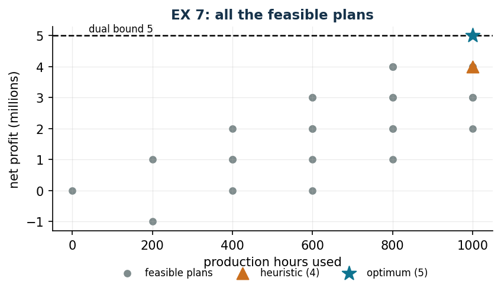

# EX 7 — Custom aircraft with a fixed cost

**Class:** MILP · **Links:** [fixed cost](links-02.md), [activation](links-01.md) · **Script:** `python/ex07_aircraft.py`<br>
**Difficulty:** ★★☆☆☆ · **Time:** 30–45 min
{ .scheda }

[](https://colab.research.google.com/github/fabiofurini/mip-modelling/blob/main/notebooks/ex07_aircraft.ipynb)

One of the [fifteen numerical models](numerical.md), of the
[production planning](production.md) family.

!!! abstract "EX 7"
    A company builds custom aircraft; before producing for a client a fixed setup
    cost must be paid. Three clients have ordered $3$, $2$ and $5$ aircraft
    respectively. The production capacity is $1000$ hours. The company decides
    which orders to accept and how many units to produce (possibly fewer than
    requested).

    | | client 1 | client 2 | client 3 |
    |---|---:|---:|---:|
    | setup (millions) | 3 | 2 | 0 |
    | unit profit (millions) | 2 | 3 | 1 |
    | hours per aircraft | 200 | 400 | 200 |

    The total profit net of the setup costs is to be maximised.

## Model

The data are $n = 3$ clients, with unit profit $p_j$, setup cost $f_j$, hours per
aircraft $h_j$ and maximum order $M_j$, plus the production capacity $H = 1000$
hours. With $x_j$ aircraft produced for client $j$ (integer) and $y_j$ the
indicator of an accepted order:

$$
\begin{aligned}
\max ~~ \sum_{j=1}^{n} \big(p_j\, x_j - f_j\, y_j\big) & &\\
\text{subject to} \quad \sum_{j=1}^{n} h_j\, x_j &\le H, &\\
x_j - M_j\, y_j &\le 0, & \forall j \in \{1, 2, \dots, n\},\\
x_j &\in \mathbb{Z}_{\ge 0}, & \forall j \in \{1, 2, \dots, n\},\\
y_j &\in \{0, 1\}, & \forall j \in \{1, 2, \dots, n\}.
\end{aligned}
$$

A single constraint per client does **two things at once**: it limits the
quantity to the number of aircraft ordered and it makes the setup be paid. Client
3 has zero setup, so $y_3$ does not appear in the objective and equals $1$ in
every optimal solution with $x_3 > 0$.

The model of the instance, written out in full:

<!-- modello-esteso: ex07_primale -->

<div class="modello-esteso" markdown>

$$
\begin{array}{rrrrrrr c l}
\max & 2x_1 & +3x_2 & +x_3 & -3y_1 & -2y_2 &  &  & \\
\text{subject to} & 200x_1 & +400x_2 & +200x_3 &  &  &  & \le & 1000\\
 & x_1 &  &  & -3y_1 &  &  & \le & 0\\
 &  & x_2 &  &  & -2y_2 &  & \le & 0\\
 &  &  & x_3 &  &  & -5y_3 & \le & 0\\
 & x_1, & x_2, & x_3 &  &  &  & \in & \Z_{\ge 0}\\
 &  &  &  & y_1, & y_2, & y_3 & \in & \{0, 1\}
\end{array}
$$

</div>

<!-- modello-esteso: fine -->

## Constructive heuristic: the primal bound

This is a **maximisation**. The clients are scanned by decreasing net profit per
hour, computed on the whole order: $3/600$, $4/800$ and $5/1000$, that is $1/200$
for all three. At equal ratios the natural order is followed: client 1 is
accepted with $3$ aircraft ($600$ hours, net profit $3$), then client 2 with a
single aircraft ($400$ hours, net profit $3 - 2 = 1$), and the hours run out.

$$\mathit{LB} = 4.$$

## LP relaxation and dual: the dual bound

With $\alpha \ge 0$ on the capacity and $\beta_j \ge 0$ on the links, the dual is

$$\min ~ H\, \alpha \quad\text{subject to}\quad h_j\, \alpha + \beta_j \ge p_j, \qquad M_j\, \beta_j \le f_j.$$

**The recipe:** $\bar\beta_j = f_j / M_j$, that is the setup spread over the
aircraft ordered ($1$, $1$ and $0$), whence $\alpha \ge (p_j - \bar\beta_j)/h_j$
for every $j$, that is $\alpha \ge 1/200$ in all three cases. With
$\bar\alpha = 1/200$,

$$\mathit{UB} = 1000 \cdot \frac{1}{200} = 5.$$

<!-- modello-esteso: ex07_duale -->

<div class="modello-esteso" markdown>

$$
\begin{array}{rrrrr c l}
\min & 1000\alpha &  &  &  &  & \\
\text{subject to} & 200\alpha & +\beta_1 &  &  & \ge & 2\\
 & 400\alpha &  & +\beta_2 &  & \ge & 3\\
 & 200\alpha &  &  & +\beta_3 & \ge & 1\\
 &  & -3\beta_1 &  &  & \ge & -3\\
 &  &  & -2\beta_2 &  & \ge & -2\\
 &  &  &  & -5\beta_3 & \ge & 0\\
 & \alpha &  &  &  & \ge & 0\\
 &  & \beta_1, & \beta_2, & \beta_3 & \ge & 0
\end{array}
$$

</div>

<!-- modello-esteso: fine -->

## Optimum and comparison

| $\mathit{LB}$ | $\mathit{UB}$ | $z(\mathit{LP})$ | $z(\mathit{LP}^+)$ | $z(\mathit{MILP})$ |
|---:|---:|---:|---:|---:|
| 4 | 5 | 5 | 5 | 5 |

The optimum is $5$ and is attained by **three** different plans: five aircraft to
client 3; two to client 2 and one to the third; three to client 1 and two to the
third. All three use exactly the $1000$ hours.

!!! tip "When the certificate closes the problem by itself"
    Here the dual bound is exact: $\mathit{UB} = z(\mathit{MILP}) = 5$. The
    certificate built by hand proves optimality without the solver having to do
    anything. Without setup costs the optimum would rise to $9$; with $1400$
    hours available, to $7$.



## Code

The full script is
[`python/ex07_aircraft.py`](https://github.com/fabiofurini/mip-modelling/blob/main/python/ex07_aircraft.py);
the notebook is
[`notebooks/ex07_aircraft.ipynb`](https://github.com/fabiofurini/mip-modelling/blob/main/notebooks/ex07_aircraft.ipynb).

<!-- embedded-script: begin (regenerated by python/embed_code.py) -->

??? example "Show the complete script — `python/ex07_aircraft.py` (182 lines)"

    ```python
    """EX 7 -- Custom aircraft with a fixed set-up cost (family 9).

    Three orders, each with a fixed set-up cost and a cap on the units. It is the
    fixed cost of technique 3.2 in pure form: the link x <= M y limits the quantity
    and charges the set-up at the same time. The dual of the relaxation is built by
    hand in two lines and coincides with the optimum of the MILP.
    """
    import gurobipy as gp
    import pandas as pd
    from gurobipy import GRB

    from mip import (ammissibile, due_rilassamenti, frazione, nuovo_modello, registra_bound,
                     risolvi, stampa_lp, valuta)
    from stile import ARANCIO, GRIGIO, TEAL, intestazione, plt, salva_dati, salva_figura
    from esteso import salva_modello

    R = range


    def aerei(n):
        return f"{int(n)} aircraft"


    # ---------- 1. MODEL AND INSTANCE ----------
    intestazione("EX 7. Custom aircraft: which orders to accept")
    p6 = [2, 3, 1]        # unit profit (millions)
    f6 = [3, 2, 0]        # fixed set-up cost (millions)
    h6 = [200, 400, 200]  # production hours per aircraft
    M6 = [3, 2, 5]        # aircraft ordered by the client
    H6 = 1000             # hours available
    nc = len(p6)
    salva_dati(pd.DataFrame({"client": R(1, nc + 1), "profit": p6, "setup": f6,
                             "hours": h6, "ordered": M6}), "ex07_dati")
    print("  Net profit if a client is accepted and all their aircraft are produced:")
    for j in R(nc):
        print(f"    client {j + 1}: {p6[j]} * {M6[j]} - {f6[j]} = {p6[j] * M6[j] - f6[j]} "
              f"millions, with {h6[j] * M6[j]} hours")


    def modello(p, f, h, M, H):
        nc = len(p)
        m = nuovo_modello("aircraft")
        x = m.addVars(nc, vtype=GRB.INTEGER, name="x")
        y = m.addVars(nc, vtype=GRB.BINARY, name="y")
        m.setObjective(gp.quicksum(p[j] * x[j] - f[j] * y[j] for j in R(nc)), GRB.MAXIMIZE)
        m.addConstr(gp.quicksum(h[j] * x[j] for j in R(nc)) <= H, name="hours")
        m.addConstrs((x[j] - M[j] * y[j] <= 0 for j in R(nc)), name="activate")
        return m, x, y


    def duale(p, f, h, M, H):
        """min H alpha  with alpha >= 0 and beta >= 0 (links x_j <= M_j y_j).

        Columns:  x_j: h_j alpha + beta_j >= p_j
                  y_j: -M_j beta_j >= -f_j, that is beta_j <= f_j / M_j
        """
        nc = len(p)
        d = nuovo_modello("dual_aircraft")
        alpha = d.addVar(name="alpha")
        beta = d.addVars(nc, name="beta")
        d.setObjective(H * alpha, GRB.MINIMIZE)
        d.addConstrs((h[j] * alpha + beta[j] >= p[j] for j in R(nc)), name="rcx")
        d.addConstrs((-M[j] * beta[j] >= -f[j] for j in R(nc)), name="rcy")
        return d


    m6, x6, y6 = modello(p6, f6, h6, M6, H6)
    salva_modello(m6, "ex07_primale")
    print("  The model of the instance:")
    stampa_lp(m6)

    # ---------- 2. CONSTRUCTIVE HEURISTIC (LOWER BOUND) ----------
    # constructive heuristic on the net profit per hour if the whole order is accepted
    def euristica(p, f, h, M, H):
        nc = len(p)
        res = H
        x = [0] * nc
        valore = [(p[j] * M[j] - f[j]) / (h[j] * M[j]) for j in R(nc)]
        passi = ["net profit per hour, on the whole order: "
                 + ", ".join(f"client {j + 1} {frazione(valore[j])}" for j in R(nc))]
        for j in sorted(R(nc), key=lambda j: (-valore[j], j)):
            n = min(M[j], res // h[j])
            if n == 0 or p[j] * n - f[j] <= 0:
                passi.append(f"client {j + 1}: with {res} hours left one could build "
                             f"{aerei(n)}, profit {p[j] * n - f[j]} <= 0, rejected")
                continue
            x[j] = n
            res -= h[j] * n
            passi.append(f"client {j + 1}: {aerei(n)}, net profit {p[j] * n - f[j]}; "
                         f"hours left {res}")
        return x, passi


    x_e, passi = euristica(p6, f6, h6, M6, H6)
    for k, riga in enumerate(passi, 1):
        print(f"  Step {k}. {riga}")
    lb6 = sum(p6[j] * x_e[j] - f6[j] * (1 if x_e[j] else 0) for j in R(nc))
    sol_eur = ({f"x[{j}]": x_e[j] for j in R(nc)}
               | {f"y[{j}]": 1 if x_e[j] else 0 for j in R(nc)})
    assert ammissibile(m6, sol_eur), sol_eur
    print(f"  Heuristic solution: " + ", ".join(f"{aerei(x_e[j])} to client {j + 1}"
                                                for j in R(nc) if x_e[j])
          + f"   lb = {frazione(lb6)}")

    # ---------- 3. LP RELAXATION AND DUAL (UPPER BOUND) ----------
    d6 = duale(p6, f6, h6, M6, H6)
    salva_modello(d6, "ex07_duale")
    # recipe: beta_j = f_j / M_j (the largest value allowed by the column of y_j, that is
    # the set-up spread over the aircraft ordered) and alpha the smallest value that makes
    # all the columns of x feasible
    beta_v = [f6[j] / M6[j] for j in R(nc)]
    alpha_v = max((p6[j] - beta_v[j]) / h6[j] for j in R(nc))
    mano = {"alpha": alpha_v} | {f"beta[{j}]": beta_v[j] for j in R(nc)}
    ub6, viol = valuta(d6, mano)
    assert viol <= 1e-9, viol
    print("  Hand-built dual: beta_j = f_j / M_j (the set-up spread over the ordered aircraft):")
    for j in R(nc):
        print(f"    client {j + 1}: {f6[j]} / {M6[j]} = {frazione(beta_v[j])}, hence "
              f"alpha >= ({p6[j]} - {frazione(beta_v[j])}) / {h6[j]} = "
              f"{frazione((p6[j] - beta_v[j]) / h6[j])}")
    print(f"  alpha = {frazione(alpha_v)} (an hour of production is worth {frazione(alpha_v)} "
          f"millions)")
    print(f"  ub = {H6} * alpha = {frazione(ub6)}")
    zlp6, zlp6r, _ = due_rilassamenti(m6, d6)

    # ---------- 4. OPTIMUM OF THE MILP ----------
    z6 = risolvi(m6)
    print("  Optimal solution: " + ", ".join(
        f"{aerei(x6[j].X)} to client {j + 1}" for j in R(nc) if x6[j].X > 0.5)
        + f"; hours used {int(sum(h6[j] * x6[j].X for j in R(nc)))} out of {H6}")
    riga = registra_bound("EX 7 aircraft", ub6, lb6, zlp6, zlp6r, z6, senso="max")
    salva_dati(pd.DataFrame([riga]), "ex07_bound")
    assert lb6 <= z6 <= zlp6 <= ub6 + 1e-9

    # ---------- 5. ALL THE FEASIBLE PLANS, ONE BY ONE ----------
    intestazione("EX 7. The feasible plans, one by one")
    righe = []
    for a in R(M6[0] + 1):
        for b in R(M6[1] + 1):
            for c in R(M6[2] + 1):
                ore = h6[0] * a + h6[1] * b + h6[2] * c
                if ore > H6:
                    continue
                val = (p6[0] * a + p6[1] * b + p6[2] * c
                       - sum(f6[j] for j, n in enumerate((a, b, c)) if n))
                righe.append({"client_1": a, "client_2": b, "client_3": c, "hours": ore,
                              "profit": val})
    df = pd.DataFrame(righe).sort_values("profit", ascending=False)
    print(df.head(6).to_string(index=False))
    print(f"  Feasible plans in total: {len(df)}; the best one is worth {df.profit.max()}, and")
    print(f"  coincides with the optimum found by the solver ({frazione(z6)}).")
    salva_dati(df, "ex07_piani")
    assert abs(df.profit.max() - z6) <= 1e-9

    # ---------- 6. VARIANTS ----------
    varianti = {}
    m, x, y = modello(p6, [0] * nc, h6, M6, H6)
    varianti["6a. without set-up costs"] = risolvi(m)
    print(f"  6a. Without set-up costs: z = "
          f"{frazione(varianti['6a. without set-up costs'])}")
    m, x, y = modello(p6, f6, h6, M6, 1400)
    varianti["6b. 1400 hours available"] = risolvi(m)
    print(f"  6b. With 1400 hours available: z = "
          f"{frazione(varianti['6b. 1400 hours available'])}")
    salva_dati(pd.DataFrame({"variant": list(varianti), "z": list(varianti.values())}),
               "ex07_varianti")

    # ---------- 7. FIGURE ----------
    fig, ax = plt.subplots(figsize=(6.4, 3.0))
    ax.scatter(df.hours, df.profit, s=26, color=GRIGIO, label="feasible plans")
    ax.scatter([sum(h6[j] * x_e[j] for j in R(nc))], [lb6], s=90, marker="^", color=ARANCIO,
               label=f"heuristic ({frazione(lb6)})", zorder=3)
    ax.scatter([sum(h6[j] * x6[j].X for j in R(nc))], [z6], s=140, marker="*", color=TEAL,
               label=f"optimum ({frazione(z6)})", zorder=3)
    ax.axhline(ub6, color="black", ls="--", lw=1.2)
    ax.annotate(f"dual bound {frazione(ub6)}", (40, ub6 + 0.12), fontsize=8)
    ax.set_xlabel("production hours used")
    ax.set_ylabel("net profit (millions)")
    ax.set_title("EX 7: all the feasible plans")
    ax.legend(fontsize=8, loc="lower left")
    salva_figura(fig, "ex07_piani")
    print("Done.")
    ```

<!-- embedded-script: end -->
