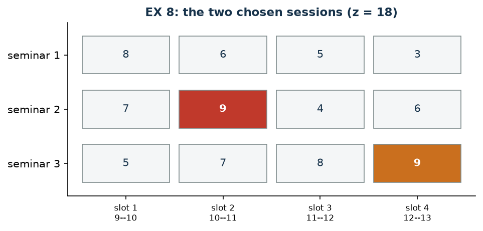

# EX 8 — Seminars

**Class:** BIP · **Links:** exact cardinality, non-adjacency · **Script:** `python/ex08_seminars.py`

[](https://colab.research.google.com/github/fabiofurini/mip-modelling/blob/main/notebooks/ex08_seminars.ipynb)

One of the [fifteen numerical models](numerical.md), of the [assignment and scheduling](scheduling.md) family.

!!! abstract "EX 8"
    A student must attend *exactly two* sessions of a summer school. There are
    three seminars, each offered in four time slots; every seminar is attended at
    most once and two sessions cannot occupy the same slot. The preference score
    of each session is:

    | | 9–10 | 10–11 | 11–12 | 12–13 |
    |---|---:|---:|---:|---:|
    | Seminar 1 | 8 | 6 | 5 | 3 |
    | Seminar 2 | 7 | 9 | 4 | 6 |
    | Seminar 3 | 5 | 7 | 8 | 9 |

    The student never wants **two consecutive hours** of class. The total
    preference is maximised.

## Model

With $x_{sk} = 1$ if seminar $s$ is attended in slot $k$ ($12$ binaries):

$$
\begin{aligned}
\max ~~ \sum_{s=1}^{3} \sum_{k=1}^{4} p_{sk}\, x_{sk} & & \\
\text{subject to} \quad \sum_{s=1}^{3} x_{sk} &\le 1, & \forall k \in \{1, \dots, 4\},\\
\sum_{k=1}^{4} x_{sk} &\le 1, & \forall s \in \{1, 2, 3\},\\
\sum_{s=1}^{3} \sum_{k=1}^{4} x_{sk} &= q, & \\
\sum_{s=1}^{3} \big(x_{sk} + x_{s,k+1}\big) &\le 1, & \forall k \in \{1, 2, 3\},\\
x_{sk} &\in \{0,1\}, &
\end{aligned}
$$

with $q = 2$: four slot constraints, three seminar constraints, one **exact**
cardinality constraint and three non-adjacency constraints.

## Constructive heuristic: the primal bound

It is a **maximisation**, so the value of a feasible solution is a *lower*
bound. Constructive heuristic: take the feasible session with the highest score, then the best
compatible one.

- **Step 1**: seminar 3 in slot 4 (score $9$).
- **Step 2**: among the sessions that do not use seminar 3, do not occupy slot 4
  and are not adjacent to it, the best is seminar 2 in slot 2 (score $9$).

$\mathit{LB} = 18$.

## LP relaxation and dual: the dual bound

With $\alpha_k \ge 0$ for the slots, $\beta_s \ge 0$ for the seminars, $\gamma$
**free** for the exact cardinality and $\delta_k \ge 0$ for non-adjacency:

$$
\begin{aligned}
\min ~~ \sum_{k=1}^{4}\alpha_k + \sum_{s=1}^{3}\beta_s + q\,\gamma + \sum_{k=1}^{3}\delta_k & &\\
\text{subject to} \quad \alpha_k + \beta_s + \gamma + \!\!\sum_{k' \,:\, k \in \{k',\,k'+1\}}\!\! \delta_{k'} &\ge p_{sk}, & \forall s,\ \forall k,\\
\alpha, \beta, \delta \ge 0, \qquad \gamma &\gtreqless 0. &
\end{aligned}
$$

The shortest recipe: everything at zero except
$\bar\gamma = \max_{s,k} p_{sk} = 9$. Every dual constraint becomes
$9 \ge p_{sk}$, true by construction, and the value is $q\,\bar\gamma = 18$. It
reads: "two sessions are attended, and none is worth more than the best one".

| Dual recipe | $UB$ |
|---|---:|
| everything at zero except $\gamma = \max_{s,k} p_{sk}$ | $18$ |
| $\gamma = 0$, $\alpha_k = \max_s p_{sk}$ | $34$ |

The first is optimal for the relaxation; the second, apparently more natural, is
almost twice as large. **The recipe matters.**

| $LB$ (constructive heuristic) | $z(\mathit{MILP})$ | $z(\mathit{LP})$ | $UB$ (dual by hand) | heuristic gap |
|---:|---:|---:|---:|---:|
| 18 | 18 | 18 | 18 | $0.0\%$ |

Here the two hand-built bounds **close** the problem:
$z(\mathit{MILP}) = 18$ is proved without the solver.



## Code

The complete script is
[`python/ex08_seminars.py`](https://github.com/fabiofurini/mip-modelling/blob/main/python/ex08_seminars.py);
the notebook is
[`notebooks/ex08_seminars.ipynb`](https://github.com/fabiofurini/mip-modelling/blob/main/notebooks/ex08_seminars.ipynb).

<!-- embedded-script: begin (regenerated by python/embed_code.py) -->

??? example "Show the complete script — `python/ex08_seminars.py` (134 lines)"

    ```python
    """EX 8 -- Seminars: exactly two sessions, never two consecutive hours (family 7).

    A set packing on two dimensions (slot and seminar) with an exact cardinality
    constraint and non-adjacency constraints between consecutive slots. The dual has
    a free variable for the equality, and its simplest recipe --- "two sessions are
    worth at most twice the best score" --- is in fact optimal for the relaxation.
    """
    import gurobipy as gp
    import pandas as pd
    from gurobipy import GRB

    from mip import (ammissibile, due_rilassamenti, frazione, nuovo_modello, registra_bound,
                     risolvi, valuta)
    from stile import intestazione, plt, salva_dati, salva_figura

    R = range

    # ---------- 1. MODEL AND INSTANCE ----------
    intestazione("EX 8. Seminars: exactly two sessions, never two consecutive hours")
    p = [[8, 6, 5, 3], [7, 9, 4, 6], [5, 7, 8, 9]]
    ns, nk, q = 3, 4, 2
    SLOT = ["9--10", "10--11", "11--12", "12--13"]
    salva_dati(pd.DataFrame([{"seminar": s + 1, "slot": k + 1, "time": SLOT[k], "p": p[s][k]}
                             for s in R(ns) for k in R(nk)]), "ex08_preferenze")


    def modello(p, q):
        ns, nk = len(p), len(p[0])
        m = nuovo_modello("seminars")
        x = m.addVars(ns, nk, vtype=GRB.BINARY, name="x")
        m.setObjective(gp.quicksum(p[s][k] * x[s, k] for s in R(ns) for k in R(nk)), GRB.MAXIMIZE)
        m.addConstrs((x.sum("*", k) <= 1 for k in R(nk)), name="slot")
        m.addConstrs((x.sum(s, "*") <= 1 for s in R(ns)), name="seminar")
        m.addConstr(gp.quicksum(x[s, k] for s in R(ns) for k in R(nk)) == q, name="how_many")
        m.addConstrs((gp.quicksum(x[s, k] + x[s, k + 1] for s in R(ns)) <= 1 for k in R(nk - 1)),
                     name="consecutive")
        return m, x


    def duale(p, q):
        """min sum_k alpha_k + sum_s beta_s + q gamma + sum_k delta_k
           s.t.  alpha_k + beta_s + gamma + sum_{k' : k in {k', k'+1}} delta_k' >= p_sk
           alpha, beta, delta >= 0;  gamma free."""
        ns, nk = len(p), len(p[0])
        d = nuovo_modello("dual_seminars")
        alpha = d.addVars(nk, name="alpha")
        beta = d.addVars(ns, name="beta")
        gamma = d.addVar(lb=-GRB.INFINITY, name="gamma")
        delta = d.addVars(nk - 1, name="delta")
        d.setObjective(alpha.sum() + beta.sum() + q * gamma + delta.sum(), GRB.MINIMIZE)
        for s in R(ns):
            for k in R(nk):
                vicini = [kk for kk in R(nk - 1) if k in (kk, kk + 1)]
                d.addConstr(alpha[k] + beta[s] + gamma + gp.quicksum(delta[kk] for kk in vicini)
                            >= p[s][k], name=f"rc{s}{k}")
        return d


    m, x = modello(p, q)

    # ---------- 2. CONSTRUCTIVE HEURISTIC (LOWER BOUND: IT IS A MAXIMISATION) ----------
    def ammesse(scelte):
        for s in R(ns):
            for k in R(nk):
                if any(ss == s or kk == k or abs(kk - k) <= 1 for ss, kk in scelte):
                    continue
                yield p[s][k], s, k


    scelte = []
    for passo in R(q):
        candidate = sorted(ammesse(scelte), reverse=True)
        if not candidate:
            break
        val, s, k = candidate[0]
        scelte.append((s, k))
        print(f"  Step {passo + 1}: the feasible session with the highest score is seminar "
              f"{s + 1} in slot {k + 1} ({SLOT[k]}), score {val}")
    lb = sum(p[s][k] for s, k in scelte)
    sol_eur = {f"x[{s},{k}]": 1 for s, k in scelte}
    assert ammissibile(m, sol_eur), "the constructive heuristic must produce a feasible solution"
    print("  Heuristic solution: " + ", ".join(f"seminar {s + 1} in slot {k + 1}" for s, k in scelte)
          + f"   lb = {frazione(lb)}")

    # ---------- 3. LP RELAXATION AND DUAL (UPPER BOUND) ----------
    d = duale(p, q)
    pmax = max(p[s][k] for s in R(ns) for k in R(nk))
    mano = {"gamma": pmax}
    ub, viol = valuta(d, mano)
    assert viol <= 1e-9, viol
    print(f"  Dual by hand: alpha = beta = delta = 0 and gamma = max_sk p_sk = {pmax}")
    print(f"  ->  ub = q gamma = {q} * {pmax} = {frazione(ub)}")
    print("  Meaning: 'two sessions are attended, and none is worth more than the best one'.")
    mano2 = {f"alpha[{k}]": max(p[s][k] for s in R(ns)) for k in R(nk)}
    ub2, viol2 = valuta(d, mano2)
    assert viol2 <= 1e-9
    print(f"  Alternative recipe (gamma = 0, alpha_k = max_s p_sk): ub = {frazione(ub2)}, weaker")
    zlp, zlpr, pi = due_rilassamenti(m, d)

    # ---------- 4. MILP OPTIMUM AND BOUND TABLE ----------
    z = risolvi(m)
    ott = [(s, k) for s in R(ns) for k in R(nk) if x[s, k].X > 0.5]
    print("  Optimal solution: " + ", ".join(f"seminar {s + 1} in slot {k + 1} ({SLOT[k]}, "
                                             f"score {p[s][k]})" for s, k in sorted(ott, key=lambda t: t[1])))
    riga = registra_bound("EX 8 seminars", ub, lb, zlp, zlpr, z, senso="max")
    salva_dati(pd.DataFrame([riga]), "ex08_bound")
    assert lb <= z <= zlp + 1e-9 <= ub + 1e-9
    if abs(ub - zlp) < 1e-9:
        print("  The hand-built dual coincides with z(LP): the recipe is optimal for the")
        print("  relaxation, and what gap remains belongs entirely to integrality.")

    # ---------- 5. FIGURE ----------
    fig, ax = plt.subplots(figsize=(7.0, 3.0))
    colori = ["#0E7490", "#C0392B", "#CA6F1E"]
    for s in R(ns):
        for k in R(nk):
            scelto = (s, k) in ott
            ax.add_patch(plt.Rectangle((k - 0.45, s - 0.35), 0.9, 0.7,
                                       facecolor=colori[s] if scelto else "#F4F6F7",
                                       edgecolor="#7F8C8D", lw=0.8))
            ax.annotate(str(p[s][k]), (k, s), ha="center", va="center", fontsize=10,
                        color="white" if scelto else "#16324A",
                        fontweight="bold" if scelto else "normal")
    ax.set_xlim(-0.6, nk - 0.4)
    ax.set_ylim(-0.6, ns - 0.4)
    ax.set_xticks(R(nk))
    ax.set_xticklabels([f"slot {k + 1}\n{SLOT[k]}" for k in R(nk)], fontsize=8)
    ax.set_yticks(R(ns))
    ax.set_yticklabels([f"seminar {s + 1}" for s in R(ns)])
    ax.set_title(f"EX 8: the two chosen sessions (z = {frazione(z)})")
    ax.invert_yaxis()
    ax.grid(False)
    salva_figura(fig, "ex08_ottimo")
    print("Done.")
    ```

<!-- embedded-script: end -->
