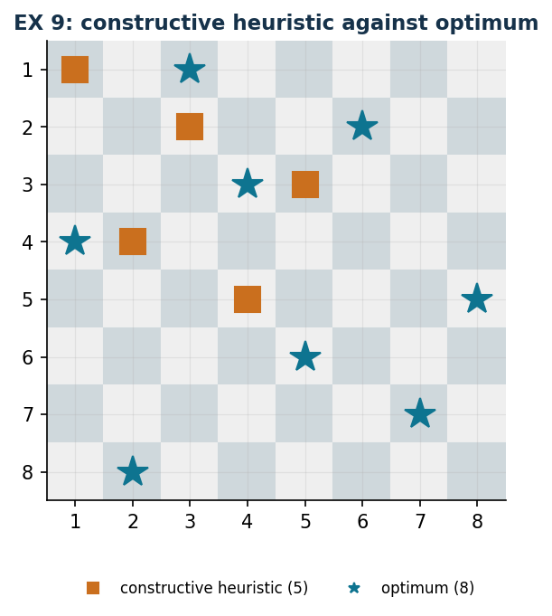

# EX 9 — The eight queens

**Class:** BIP · **Links:** set packing, [alldiff](links-12.md) · **Script:** `python/ex09_queens.py`<br>
**Difficulty:** ★★☆☆☆ · **Time:** 30–45 min
{ .scheda }

[](https://colab.research.google.com/github/fabiofurini/mip-modelling/blob/main/notebooks/ex09_queens.ipynb)

One of the [fifteen numerical models](numerical.md): the largest of the chapter,
and the one where the dual bound is written in a single line.

!!! abstract "EX 9"
    On an $8 \times 8$ chessboard the **maximum number of queens** is to be
    placed so that none can capture another in one move. In chess a queen moves
    any number of squares along the same row, the same column or either diagonal.

## Model

The board is $n \times n$, with $n = 8$. With $x_{ij} = 1$ if there is a queen on
square $(i,j)$ ($n^2 = 64$ binaries):

$$
\begin{aligned}
\max ~~ \sum_{i=1}^{n} \sum_{j=1}^{n} x_{ij} & &\\
\text{subject to} \quad \sum_{j=1}^{n} x_{ij} &\le 1, & \forall i \in \{1, 2, \dots, n\},\\
\sum_{i=1}^{n} x_{ij} &\le 1, & \forall j \in \{1, 2, \dots, n\},\\
\sum_{i-j=k} x_{ij} &\le 1, & \forall k \in \{-(n-1), -(n-2), \dots, n-1\},\\
\sum_{i+j=k} x_{ij} &\le 1, & \forall k \in \{2, 3, \dots, 2n\},\\
x_{ij} &\in \{0, 1\}, & \forall i \in \{1, 2, \dots, n\},\ \forall j \in \{1, 2, \dots, n\}.
\end{aligned}
$$

A **set packing** over four families of lines: $8$ rows, $8$ columns and
$15 + 15$ diagonals, $46$ constraints in all. The indexing trick is all here: the
"descending" diagonals are the sets with $i - j$ constant, the "ascending" ones
those with $i + j$ constant.

!!! note "Why the model is not written out in full here"
    With $n = 8$ there are $64$ variables and $46$ constraints: written in
    columns the model would take a whole page without saying anything more. It is
    the only case of the chapter, together with [EX 15](ex-15.md), where the
    symbolic form stays for the instance as well.

## Constructive heuristic: the primal bound

This is a **maximisation**. Row-by-row heuristic: in row $i$ the first free
column not attacked by the queens already placed is chosen; if there is none, the
row stays empty. There is no backtracking.

On the instance the heuristic places the queens at $(1,1)$, $(2,3)$, $(3,5)$,
$(4,2)$, $(5,4)$ and then gets stuck: rows $6$, $7$ and $8$ have no free squares
left.

$$\mathit{LB} = 5.$$

## LP relaxation and dual: the dual bound

The dual is a **set covering**: one variable per line, and every square must be
covered by at least one of the four lines crossing it.

$$
\begin{aligned}
\min ~~ \sum_{i=1}^{n} \alpha_i + \sum_{j=1}^{n} \beta_j + \sum_{k=-(n-1)}^{n-1} \gamma_k + \sum_{k=2}^{2n} \delta_k &\\
\text{subject to}\quad \alpha_i + \beta_j + \gamma_{i-j} + \delta_{i+j} &\ge 1,
  \qquad \forall i \in \{1, 2, \dots, n\},\ \forall j \in \{1, 2, \dots, n\}.
\end{aligned}
$$

**The recipe:** use a single family. With $\bar\alpha_i = 1$ for every row and
everything else zero, every square $(i,j)$ has $\alpha_i = 1 \ge 1$: the solution
is feasible and is worth $n$. It is the dual translation of the sentence "in each
row there is at most one queen".

$$\mathit{UB} = 8.$$

## Optimum and comparison

| $\mathit{LB}$ | $\mathit{UB}$ | $z(\mathit{LP})$ | $z(\mathit{LP}^+)$ | $z(\mathit{MILP})$ |
|---:|---:|---:|---:|---:|
| 5 | 8 | 8 | 8 | 8 |

The dual bound is attained: the solution found is optimal, and this is known
**without trusting the solver**. The heuristic instead stops at $5$: it is the
heuristic, not the bound, that leaves the $37.5\%$ gap.

!!! tip "Two variants"
    On $n \times n$ boards with $n = 4, 5, 6$ the optimum is always $n$, and the
    certificate $\bar\alpha_i = 1$ proves it. For $n = 2$ and $n = 3$ instead the
    optimum is $1$ and $2$: the bound $n$ stays valid but is not attainable, and
    it is the first case where this dual recipe does not close the problem.

    Dropping the diagonal constraints gives **rooks** instead of queens: the
    model becomes an assignment, the matrix is totally unimodular and the LP
    relaxation already gives an integer value.



## Code

The full script is
[`python/ex09_queens.py`](https://github.com/fabiofurini/mip-modelling/blob/main/python/ex09_queens.py);
the notebook is
[`notebooks/ex09_queens.ipynb`](https://github.com/fabiofurini/mip-modelling/blob/main/notebooks/ex09_queens.ipynb).

<!-- embedded-script: begin (regenerated by python/embed_code.py) -->

??? example "Show the complete script — `python/ex09_queens.py` (158 lines)"

    ```python
    """EX 9 -- Eight queens on the chessboard (family 11).

    Set packing on four families of lines: rows, columns and the two diagonals. The
    dual of the relaxation is built by hand in a single line (one pays 1 per row) and
    is worth exactly as much as the optimum: a case in which the certificate settles
    the problem. The constructive heuristic heuristic, on the other hand, stops below eight queens.
    """
    import gurobipy as gp
    import pandas as pd
    from gurobipy import GRB

    from mip import (ammissibile, due_rilassamenti, frazione, nuovo_modello, registra_bound,
                     risolvi, valuta)
    from stile import ARANCIO, BLU, GRIGIO, TEAL, intestazione, plt, salva_dati, salva_figura
    from esteso import salva_modello

    R = range

    # ---------- 1. MODEL AND INSTANCE ----------
    intestazione("EX 9. Eight queens: the largest number of non-attacking queens")
    N = 8


    def modello(n):
        m = nuovo_modello("queens")
        x = m.addVars(n, n, vtype=GRB.BINARY, name="x")
        m.setObjective(x.sum(), GRB.MAXIMIZE)
        m.addConstrs((x.sum(i, "*") <= 1 for i in R(n)), name="row")
        m.addConstrs((x.sum("*", j) <= 1 for j in R(n)), name="column")
        m.addConstrs((gp.quicksum(x[i, j] for i in R(n) for j in R(n) if i - j == k) <= 1
                      for k in R(-(n - 1), n)), name="diag1")
        m.addConstrs((gp.quicksum(x[i, j] for i in R(n) for j in R(n) if i + j == k) <= 1
                      for k in R(0, 2 * n - 1)), name="diag2")
        return m, x


    def duale(n):
        """min sum_i alpha_i + sum_j beta_j + sum_k gamma_k + sum_k delta_k
           s.t. alpha_i + beta_j + gamma_{i-j} + delta_{i+j} >= 1 for every square."""
        d = nuovo_modello("dual_queens")
        alpha = d.addVars(n, name="alpha")
        beta = d.addVars(n, name="beta")
        gamma = d.addVars(R(-(n - 1), n), name="gamma")
        delta = d.addVars(R(0, 2 * n - 1), name="delta")
        d.setObjective(alpha.sum() + beta.sum() + gamma.sum() + delta.sum(), GRB.MINIMIZE)
        d.addConstrs((alpha[i] + beta[j] + gamma[i - j] + delta[i + j] >= 1
                      for i in R(n) for j in R(n)), name="rc")
        return d


    m8, x8 = modello(N)
    salva_modello(m8, "ex09_primale")
    print(f"  A {N}x{N} board: {N * N} binary variables and {2 * N + (2 * N - 1) * 2} constraints")
    print("  (one row, one column and two diagonals for every line of the board).")

    # ---------- 2. CONSTRUCTIVE HEURISTIC (LOWER BOUND) ----------
    # constructive heuristic row by row: the first free column that is not attacked by the queens already
    # placed. It never backtracks: if a row has no free square, it is skipped.
    def euristica(n):
        pos = []
        passi = []
        for i in R(n):
            scelta = None
            for j in R(n):
                if all(j != jj and abs(i - ii) != abs(j - jj) for ii, jj in pos):
                    scelta = j
                    break
            if scelta is None:
                passi.append(f"row {i + 1}: no free square, the row stays empty")
            else:
                pos.append((i, scelta))
                passi.append(f"row {i + 1}: first free square in column {scelta + 1}")
        return pos, passi


    pos, passi = euristica(N)
    for k, riga in enumerate(passi, 1):
        print(f"  Step {k}. {riga}")
    lb8 = len(pos)
    sol_eur = {f"x[{i},{j}]": 1 for i, j in pos}
    assert ammissibile(m8, sol_eur), sol_eur
    print(f"  Queens placed by the constructive heuristic: {lb8}  ->  lb = {frazione(lb8)}")

    # ---------- 3. LP RELAXATION AND DUAL (UPPER BOUND) ----------
    d8 = duale(N)
    salva_modello(d8, "ex09_duale")
    mano = {f"alpha[{i}]": 1.0 for i in R(N)}       # beta = gamma = delta = 0
    ub8, viol = valuta(d8, mano)
    assert viol <= 1e-9, viol
    print("  Hand-built dual: alpha_i = 1 on every row, everything else zero. Every square (i, j)")
    print(f"  has alpha_i = 1 >= 1: the solution is feasible and worth {frazione(ub8)}.")
    print("  It is the dual translation of the sentence \"at most one queen sits in each row\".")
    zlp8, zlp8r, _ = due_rilassamenti(m8, d8)

    # ---------- 4. OPTIMUM OF THE MILP ----------
    z8 = risolvi(m8)
    ott = [(i, j) for i in R(N) for j in R(N) if x8[i, j].X > 0.5]
    print("  Optimal solution (one queen per row): "
          + ", ".join(f"row {i + 1} column {j + 1}" for i, j in sorted(ott)))
    riga = registra_bound("EX 9 queens", ub8, lb8, zlp8, zlp8r, z8, senso="max")
    salva_dati(pd.DataFrame([riga]), "ex09_bound")
    salva_dati(pd.DataFrame([{"row": i + 1, "column": j + 1} for i, j in sorted(ott)]),
               "ex09_ottimo")
    assert lb8 <= z8 <= zlp8 <= ub8 + 1e-9
    print(f"  The dual bound {frazione(ub8)} is attained: the solution found is optimal, and we")
    print("  know it without trusting the solver. The constructive heuristic stops earlier: it is the heuristic,")
    print("  not the bound, that leaves the gap.")

    # ---------- 5. TWO VARIANTS ----------
    intestazione("EX 9. Variants")
    varianti = {}
    for n in (4, 5, 6):
        m, x = modello(n)
        z = risolvi(m)
        varianti[f"n = {n}"] = z
        print(f"  {n}x{n} board: z = {frazione(z)} (= n)")
        assert abs(z - n) <= 1e-9
    for n in (2, 3):
        m, x = modello(n)
        z = risolvi(m)
        varianti[f"n = {n}"] = z
        print(f"  {n}x{n} board: z = {frazione(z)} < {n}: the dual bound n is not attainable")
        assert z < n - 0.5
    salva_dati(pd.DataFrame({"board": list(varianti), "z": list(varianti.values())}),
               "ex09_varianti")
    m, x = modello(N)
    m.update()
    for c in [c for c in m.getConstrs() if c.ConstrName.startswith("diag")]:
        m.remove(c)
    m.update()
    z_torri = risolvi(m)
    print(f"  Without the diagonal constraints (rooks instead of queens): z = {frazione(z_torri)},")
    print("  and the model becomes an assignment: the matrix is totally unimodular and the")
    print("  linear relaxation already gives an integer value.")

    # ---------- 6. FIGURE ----------
    fig, ax = plt.subplots(figsize=(4.4, 4.4))
    for i in R(N):
        for j in R(N):
            ax.add_patch(plt.Rectangle((j, N - 1 - i), 1, 1,
                                       color="#EFEFEF" if (i + j) % 2 else "#CFD8DC"))
    for i, j in pos:
        ax.plot(j + 0.5, N - 1 - i + 0.5, marker="s", color=ARANCIO, ms=13)
    for i, j in ott:
        ax.plot(j + 0.5, N - 1 - i + 0.5, marker="*", color=TEAL, ms=17)
    ax.plot([], [], marker="s", ls="", color=ARANCIO, label=f"constructive heuristic ({lb8})")
    ax.plot([], [], marker="*", ls="", color=TEAL, label=f"optimum ({int(z8)})")
    ax.set_xlim(0, N)
    ax.set_ylim(0, N)
    ax.set_xticks([j + 0.5 for j in R(N)])
    ax.set_xticklabels([str(j + 1) for j in R(N)])
    ax.set_yticks([i + 0.5 for i in R(N)])
    ax.set_yticklabels([str(N - i) for i in R(N)])
    ax.set_aspect("equal")
    ax.set_title("EX 9: constructive heuristic against optimum")
    ax.legend(fontsize=8, loc="upper center", bbox_to_anchor=(0.5, -0.06), ncol=2)
    salva_figura(fig, "ex09_scacchiera")
    print("Done.")
    ```

<!-- embedded-script: end -->
