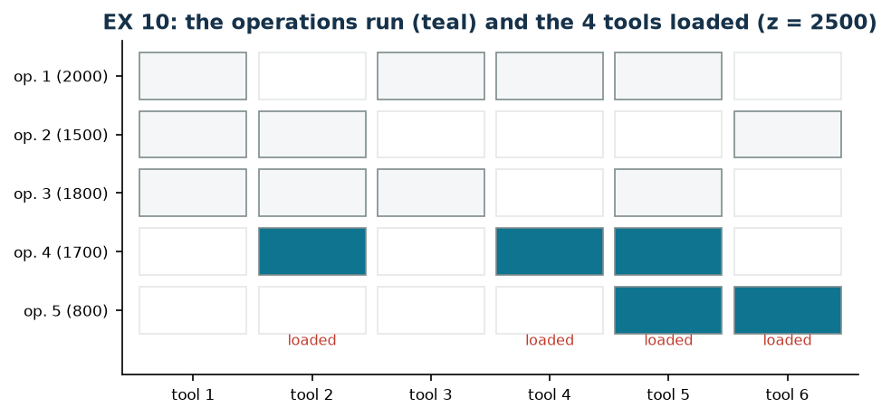

# EX 10 — Tools of a CNC machine

**Class:** BIP · **Links:** [disaggregated activation](links-01.md) · **Script:** `python/ex10_tools.py`

[](https://colab.research.google.com/github/fabiofurini/mip-modelling/blob/main/notebooks/ex10_tools.ipynb)

Numerical model of the [location and covering](location.md) family, with a
pointer to the selection family.

!!! abstract "EX 10"
    A CNC machine can perform five operations; each one requires a subset of six
    tools and, if performed, yields a profit:

    | Operation | Required tools | Profit (€) |
    |---|---|---:|
    | 1 | 1, 3, 4, 5 | 2000 |
    | 2 | 1, 2, 6 | 1500 |
    | 3 | 1, 2, 3, 5 | 1800 |
    | 4 | 2, 4, 5 | 1700 |
    | 5 | 5, 6 | 800 |

    The magazine holds at most $K = 4$ tools at a time. The configuration of
    maximum profit is wanted.

## Model

With $x_i = 1$ if operation $i$ is performed ($5$ binaries), $y_j = 1$ if tool
$j$ is loaded ($6$ binaries), and $T_i$ the set of tools required by operation
$i$:

$$
\begin{aligned}
\max ~~ \sum_{i=1}^{5} p_i\, x_i & & \\
\text{subject to} \quad \sum_{j=1}^{6} y_j &\le K, & \\
x_i - y_j &\le 0, & \forall i,\ \forall j \in T_i,\\
x_i,\ y_j &\in \{0,1\}. &
\end{aligned}
$$

One magazine constraint and $\sum_i |T_i| = 16$ link constraints. It is
[disaggregated activation](links-01.md) read the other way round: here the
operation is the object, the tools are the resources, and the operation needs
**all** of its tools — a conjunction in the consequent, which by the
[table of chapter 2](modelling-2.md) costs one constraint per tool.

## Constructive heuristic: the primal bound

It is a **maximisation**. Constructive heuristic by decreasing profit: the tool set of each
operation is loaded, if the magazine allows it.

- **Operation 1** ($2000$, tools $1, 3, 4, 5$): $4$ new tools are needed and the
  magazine reaches exactly $4$: it runs.
- **Operations 3, 4, 2, 5**: each would need at least one more tool, and the
  magazine is full: they are discarded.

$\mathit{LB} = 2000$.

## LP relaxation and dual: the dual bound

Relaxing to $x_i, y_j \ge 0$, with $\alpha \ge 0$ for the magazine constraint
and $\beta_{ij} \ge 0$ for each link constraint:

$$
\begin{aligned}
\min ~~ K\,\alpha & & \\
\text{subject to} \quad \sum_{j \in T_i} \beta_{ij} &\ge p_i, & \forall i \in \{1, \dots, 5\},\\
\sum_{i \,:\, j \in T_i} \beta_{ij} &\le \alpha, & \forall j \in \{1, \dots, 6\},\\
\alpha,\ \beta_{ij} &\ge 0. &
\end{aligned}
$$

It reads: $\beta_{ij}$ is the share of the profit of operation $i$ attributed to
tool $j$; the first group asks the shares to cover the whole profit, the second
that no tool receives more than $\alpha$; the objective pays $\alpha$ for each of
the $K$ magazine slots.

**The recipe.** The profit of each operation is spread in equal parts over the
tools it needs, $\bar\beta_{ij} = p_i / |T_i|$; then
$\bar\alpha = \max_j \sum_{i : j \in T_i} \bar\beta_{ij}$.

| $\bar\beta_{ij} = p_i/\|T_i\|$ | tool 1 | tool 2 | tool 3 | tool 4 | tool 5 | tool 6 |
|---|---:|---:|---:|---:|---:|---:|
| op. 1: $2000/4 = 500$ | 500 | | 500 | 500 | 500 | |
| op. 2: $1500/3 = 500$ | 500 | 500 | | | | 500 |
| op. 3: $1800/4 = 450$ | 450 | 450 | 450 | | 450 | |
| op. 4: $1700/3$ | | $1700/3$ | | $1700/3$ | $1700/3$ | |
| op. 5: $800/2 = 400$ | | | | | 400 | 400 |
| **total** | 1450 | $4550/3$ | 950 | $3200/3$ | **$5750/3$** | 900 |

The critical tool is number $5$, required by four operations out of five: hence
$\bar\alpha = 5750/3$ and
$\mathit{UB} = K\bar\alpha = 23000/3 \approx 7666.7$.

!!! danger "A dual solution is to be checked, not proposed"
    A choice that comes naturally is $\bar\alpha = 2000$ with all
    $\bar\beta_{ij} = 900$: the constraints on the operations are satisfied
    ($2 \cdot 900 = 1800 \ge 800$ is the tightest case) and the value would be
    $4 \cdot 2000 = 8000$. **But that solution is not feasible.** The second
    group asks $\sum_{i : j \in T_i} \beta_{ij} \le \alpha$, and tool $5$ serves
    *four* operations: it would receive $4 \cdot 900 = 3600 > 2000$. The
    violation is $1600$, and $8000$ is not a bound.

    This is why the course protocol does not ask to *propose* a dual solution
    but to *check* it: the script verifies every constraint, and an `assert`
    fails if the violation exceeds the tolerance. With the correct recipe the
    bound is $23000/3 \approx 7666.7$, that is, **better** than the one hoped
    for by getting it wrong.

| $LB$ (constructive heuristic) | $z(\mathrm{MILP})$ | $z(\mathrm{LP})$ | $z(\mathrm{LP}^+)$ | $UB$ (dual by hand) | heuristic gap |
|---:|---:|---:|---:|---:|---:|
| 2000 | 2500 | 5200 | 5200 | $23000/3$ | $20.0\%$ |

The optimum loads tools $2, 4, 5, 6$ and performs operations $4$ ($1700$) and
$5$ ($800$). No four-tool configuration yields more: with $\{1,3,4,5\}$ only
operation 1 runs ($2000$), with $\{1,2,3,5\}$ only operation 3 ($1800$).



!!! tip "Why the relaxation is so weak here"
    $z(\mathrm{LP}) = 5200$ against $z(\mathrm{MILP}) = 2500$: more than double.
    In the continuous problem one can load "a bit" of every tool — for instance
    $y_j = 2/3$ for six tools, which respects $\sum_j y_j \le 4$ — and run a
    fraction of *every* operation. The integrality of the magazine is
    everything: this is the case where hand-built bounds, however well
    constructed, are not enough and branch-and-bound is needed. One way to
    tighten is to add the valid inequalities
    $\sum_{j \in T_i} y_j \ge |T_i| x_i$ (the aggregated form of the links).

## Code

The complete script — which also checks the infeasibility of the draft's dual
recipe — is
[`python/ex10_tools.py`](https://github.com/fabiofurini/mip-modelling/blob/main/python/ex10_tools.py);
the notebook is
[`notebooks/ex10_tools.ipynb`](https://github.com/fabiofurini/mip-modelling/blob/main/notebooks/ex10_tools.ipynb).

<!-- embedded-script: begin (regenerated by python/embed_code.py) -->

??? example "Show the complete script — `python/ex10_tools.py` (141 lines)"

    ```python
    """EX 10 -- CNC tools: operation selection with a limited magazine (family 8).

    Disaggregated activation the other way round: an operation runs only if *all* of
    its tools are loaded, and the magazine holds at most four. It is a maximisation,
    so the heuristic gives the lower bound and the dual the upper one.

    The archive draft proposed alpha = 2000 with all multipliers at 900: that dual
    solution is *not feasible*, because some tools serve more than two operations.
    The recipe used here is different and it is checked.
    """
    import gurobipy as gp
    import pandas as pd
    from gurobipy import GRB

    from mip import (ammissibile, due_rilassamenti, frazione, nuovo_modello, registra_bound,
                     risolvi, valuta)
    from stile import intestazione, plt, salva_dati, salva_figura

    R = range

    # ---------- 1. MODEL AND INSTANCE ----------
    intestazione("EX 10. CNC tools: which operations to run with at most four tools")
    pr = [2000, 1500, 1800, 1700, 800]
    T = [[0, 2, 3, 4], [0, 1, 5], [0, 1, 2, 4], [1, 3, 4], [4, 5]]
    no, nu, K = 5, 6, 4
    salva_dati(pd.DataFrame([{"operation": i + 1,
                              "tools": ", ".join(str(j + 1) for j in T[i]),
                              "profit": pr[i]} for i in R(no)]), "ex10_operazioni")


    def modello(pr, T, K):
        no, nu = len(pr), max(max(t) for t in T) + 1
        m = nuovo_modello("cnc_tools")
        x = m.addVars(no, vtype=GRB.BINARY, name="x")
        y = m.addVars(nu, vtype=GRB.BINARY, name="y")
        m.setObjective(gp.quicksum(pr[i] * x[i] for i in R(no)), GRB.MAXIMIZE)
        m.addConstr(y.sum() <= K, name="magazine")
        for i in R(no):
            for j in T[i]:
                m.addConstr(x[i] - y[j] <= 0, name=f"link[{i},{j}]")
        return m, x, y


    def duale(pr, T, K):
        """min K alpha;  sum_{j in T_i} beta_ij >= p_i;  sum_{i : j in T_i} beta_ij <= alpha;
        alpha, beta >= 0."""
        no, nu = len(pr), max(max(t) for t in T) + 1
        d = nuovo_modello("dual_cnc_tools")
        alpha = d.addVar(name="alpha")
        beta = d.addVars([(i, j) for i in R(no) for j in T[i]], name="beta")
        d.setObjective(K * alpha, GRB.MINIMIZE)
        d.addConstrs((gp.quicksum(beta[i, j] for j in T[i]) >= pr[i] for i in R(no)), name="rc_x")
        d.addConstrs((gp.quicksum(beta[i, j] for i in R(no) if j in T[i]) <= alpha for j in R(nu)),
                     name="rc_y")
        return d


    m, x, y = modello(pr, T, K)

    # ---------- 2. CONSTRUCTIVE HEURISTIC (LOWER BOUND: IT IS A MAXIMISATION) ----------
    carichi, eseguite = set(), []
    for i in sorted(R(no), key=lambda i: -pr[i]):
        nuovi = set(T[i]) - carichi
        if len(carichi) + len(nuovi) <= K:
            carichi |= nuovi
            eseguite.append(i)
            print(f"  Operation {i + 1} (profit {pr[i]}, tools "
                  + ", ".join(str(j + 1) for j in T[i])
                  + f"): {len(nuovi)} new ones are needed, the magazine reaches {len(carichi)} <= {K}: it runs")
        else:
            print(f"  Operation {i + 1} (profit {pr[i]}): {len(nuovi)} new tools would be needed, "
                  f"the magazine would reach {len(carichi) + len(nuovi)} > {K}: discarded")
    lb = sum(pr[i] for i in eseguite)
    sol_eur = {f"x[{i}]": 1 for i in eseguite} | {f"y[{j}]": 1 for j in carichi}
    assert ammissibile(m, sol_eur)
    print("  Heuristic solution: operations " + ", ".join(str(i + 1) for i in sorted(eseguite))
          + " with tools " + ", ".join(str(j + 1) for j in sorted(carichi))
          + f"   lb = {frazione(lb)}")

    # ---------- 3. LP RELAXATION AND DUAL (UPPER BOUND) ----------
    d = duale(pr, T, K)
    mano = {f"beta[{i},{j}]": pr[i] / len(T[i]) for i in R(no) for j in T[i]}
    carico = {j: sum(mano[f"beta[{i},{j}]"] for i in R(no) if j in T[i]) for j in R(nu)}
    mano["alpha"] = max(carico.values())
    ub, viol = valuta(d, mano)
    assert viol <= 1e-9, viol
    print("  Dual by hand: beta_ij = p_i / |T_i| (the profit spread over the tools it needs)")
    for i in R(no):
        print(f"    operation {i + 1}: {pr[i]} / {len(T[i])} = "
              f"{frazione(pr[i] / len(T[i]))} on each of its tools")
    print("  Load of each tool: " + ", ".join(f"{j + 1}: {frazione(carico[j])}" for j in R(nu)))
    utensile_critico = max(carico, key=carico.get)
    print(f"  The largest is tool {utensile_critico + 1}, so alpha = "
          f"{frazione(mano['alpha'])} and ub = {K} alpha = {frazione(ub)}")
    bozza = {f"beta[{i},{j}]": 900 for i in R(no) for j in T[i]} | {"alpha": 2000}
    _, viol_bozza = valuta(d, bozza)
    assert viol_bozza > 1e-6
    peggiore = max(R(nu), key=lambda j: sum(900 for i in R(no) if j in T[i]))
    print("  Check of the draft's recipe (alpha = 2000, all beta = 900): NOT feasible,")
    print(f"  largest violation {frazione(viol_bozza)}. Tool {peggiore + 1} serves "
          f"{sum(1 for i in R(no) if peggiore in T[i])} operations, so it receives "
          f"{sum(900 for i in R(no) if peggiore in T[i])} > 2000.")
    zlp, zlpr, pi = due_rilassamenti(m, d)

    # ---------- 4. MILP OPTIMUM AND BOUND TABLE ----------
    z = risolvi(m)
    op_ott = [i for i in R(no) if x[i].X > 0.5]
    ut_ott = [j for j in R(nu) if y[j].X > 0.5]
    print("  Optimal solution: operations " + ", ".join(str(i + 1) for i in op_ott)
          + " with tools " + ", ".join(str(j + 1) for j in ut_ott)
          + f"   z(MILP) = {frazione(z)}")
    riga = registra_bound("EX 10 CNC tools", ub, lb, zlp, zlpr, z, senso="max")
    salva_dati(pd.DataFrame([riga]), "ex10_bound")
    assert lb <= z <= zlp + 1e-9 <= ub + 1e-9
    print(f"  The sandwich: {frazione(lb)} <= z(MILP) = {frazione(z)} <= z(LP) = {frazione(zlp)} "
          f"<= ub = {frazione(ub)}")
    print("  Here the relaxation is very weak: in the continuous problem one can load 'a bit'")
    print("  of every tool and run fractions of all the operations.")

    # ---------- 5. FIGURE ----------
    fig, ax = plt.subplots(figsize=(7.0, 3.2))
    for i in R(no):
        for j in R(nu):
            serve = j in T[i]
            colore = ("#0E7490" if i in op_ott else "#F4F6F7") if serve else "white"
            ax.add_patch(plt.Rectangle((j - 0.45, i - 0.4), 0.9, 0.8, facecolor=colore,
                                       edgecolor="#7F8C8D" if serve else "#E5E8E8", lw=0.8))
    for j in ut_ott:
        ax.annotate("loaded", (j, no - 0.35), ha="center", va="bottom", fontsize=7.5,
                    color="#C0392B")
    ax.set_xlim(-0.6, nu - 0.4)
    ax.set_ylim(-0.6, no + 0.1)
    ax.set_xticks(R(nu))
    ax.set_xticklabels([f"tool {j + 1}" for j in R(nu)], fontsize=8)
    ax.set_yticks(R(no))
    ax.set_yticklabels([f"op. {i + 1} ({pr[i]})" for i in R(no)], fontsize=8)
    ax.set_title(f"EX 10: the operations run (teal) and the {K} tools loaded (z = {frazione(z)})")
    ax.invert_yaxis()
    ax.grid(False)
    salva_figura(fig, "ex10_ottimo")
    print("Done.")
    ```

<!-- embedded-script: end -->
