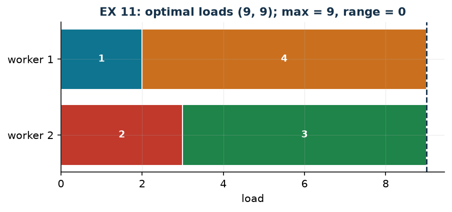

# EX 11 — Balancing between two workers

**Class:** MILP · **Links:** [min-max](links-06.md), [absolute value](links-07.md) · **Script:** `python/ex11_balancing.py`

[](https://colab.research.google.com/github/fabiofurini/mip-modelling/blob/main/notebooks/ex11_balancing.ipynb)

Numerical model of the [assignment and scheduling](scheduling.md) family, with a
pointer to the partitioning and balancing family.

!!! abstract "EX 11"
    Four indivisible jobs of duration $2$, $3$, $6$ and $7$ must be assigned to
    two workers so that their workloads are as balanced as possible.

!!! danger "«Balanced» must be translated, and the translation declared"
    "Balanced workloads" is not an objective: it is a word. The two linear
    translations are those of [technique 3.6](links-06.md): minimise the
    **maximum** of the loads, or minimise their **difference**. Since the total
    $D = 18$ is constant, the identity

    $$\max(W_1, W_2) = \frac{D}{2} + \frac{|W_1 - W_2|}{2}$$

    holds, so the two models have the *same* optimal solutions — but different
    optimal values: $9$ for the first, $0$ for the second. Reporting "$9$" as
    the "difference between the loads" is a mistake, and so is reporting "$0$"
    as the "maximum load".

## Model (min-max)

With $x_j = 1$ if job $j$ goes to worker 1 and $z \ge 0$ the maximum load:

$$
\begin{aligned}
\min ~~ z & & \\
\text{subject to} \quad \sum_{j=1}^{4} d_j x_j - z &\le 0, & \text{(load of worker 1)}\\
-\sum_{j=1}^{4} d_j x_j - z &\le -D, & \text{(load of worker 2)}\\
x_j \in \{0,1\}, \qquad z &\ge 0. &
\end{aligned}
$$

## Constructive heuristic: the primal bound

[LPT](modelling-5.md): the jobs in decreasing order of duration, each to the
least loaded worker. Job 4 ($7$) to worker 1; job 3 ($6$) to worker 2; job 2
($3$) to worker 2, which reaches $9$; job 1 ($2$) to worker 1, which reaches
$9$. Loads $(9, 9)$, so $\mathit{UB} = 9$.

## LP relaxation and dual: the dual bound

Relaxing to $x_j \ge 0$ and using the conversion table — a **minimisation**
primal with $\le$ constraints, hence dual variables $\pi_1, \pi_2 \le 0$:

$$
\begin{aligned}
\max ~~ -D\,\pi_2 & & \\
\text{subject to} \quad d_j\,(\pi_1 - \pi_2) &\le 0, & \forall j \in \{1, \dots, 4\},\\
-\pi_1 - \pi_2 &\le 1, & \text{(from the column of } z)\\
\pi_1,\ \pi_2 &\le 0. &
\end{aligned}
$$

Since $d_j > 0$, the first constraints say $\pi_1 \le \pi_2$. Setting
$\pi_1 = \pi_2 = t$, the constraint from $z$ gives $-2t \le 1$, that is
$t \ge -1/2$; the objective $-D t$ is largest at $t = -1/2$ and equals
$\mathit{LB} = D/2 = 9$. Meaning: "the two loads add up to $D$, so the larger
one is at least $D/2$".

!!! note "The same thing with non-negative dual variables"
    Many treatments prefer dual variables $\ge 0$. It suffices to set
    $\alpha = -\pi_1$ and $\beta = -\pi_2$: the dual becomes $\max D\beta$ with
    $\alpha \le \beta$ and $\alpha + \beta \le 1$, and $\alpha = \beta = 1/2$
    gives $9$ again. It is the *same* solution written with the other sign; what
    one cannot do is declare variables $\ge 0$ and then use one of them
    negative.

| $UB$ (LPT) | $LB$ (dual by hand) | $z(\mathit{LP})$ | $z(\mathit{MILP})$ | heuristic gap |
|---:|---:|---:|---:|---:|
| 9 | 9 | 9 | 9 | $0.0\%$ |

All the numbers coincide: the two hand-built bounds meet and optimality is
proved without solving the MILP. This happens because $D$ is even and the jobs
can be split exactly in half; with $D$ odd the bound would become
$\lceil D/2 \rceil$ and one more argument would be needed.



## Code

The complete script — which also solves the "minimum range" version and checks
the identity between the two objectives — is
[`python/ex11_balancing.py`](https://github.com/fabiofurini/mip-modelling/blob/main/python/ex11_balancing.py);
the notebook is
[`notebooks/ex11_balancing.ipynb`](https://github.com/fabiofurini/mip-modelling/blob/main/notebooks/ex11_balancing.ipynb).

<!-- embedded-script: begin (regenerated by python/embed_code.py) -->

??? example "Show the complete script — `python/ex11_balancing.py` (150 lines)"

    ```python
    """EX 11 -- Balancing between two workers (family 7, pointer to family 11).

    Four indivisible jobs of duration 2, 3, 6, 7 and two workers: the workloads must
    be as balanced as possible.

    Two warnings the archive draft conflated:
    1. "balanced workloads" can be written as a min-max or as the minimisation of
       the difference: the optimal solutions are the same (the total is constant) but
       the *values* of the objective are not. Both are reported here.
    2. the dual must be written with the signs of the conversion table: in a
       minimisation with <= constraints the dual variables are <= 0. The
       presentation with >= 0 variables is the same thing with flipped signs, and it
       is shown too.
    """
    import gurobipy as gp
    import pandas as pd
    from gurobipy import GRB

    from mip import (ammissibile, due_rilassamenti, frazione, nuovo_modello, registra_bound,
                     risolvi, valuta)
    from stile import intestazione, plt, salva_dati, salva_figura

    R = range

    # ---------- 1. MODEL AND INSTANCE ----------
    intestazione("EX 11. Balancing: four indivisible jobs on two workers")
    d = [2, 3, 6, 7]
    n, D = len(d), sum(d)
    print(f"  Durations {d}; total {D}; with perfectly equal loads each would do {frazione(D / 2)}")
    salva_dati(pd.DataFrame({"job": R(1, n + 1), "duration": d}), "ex11_lavori")


    def modello_minmax(d):
        """min z  with  sum_j d_j x_j <= z  and  D - sum_j d_j x_j <= z."""
        n, D = len(d), sum(d)
        m = nuovo_modello("balancing_minmax")
        x = m.addVars(n, vtype=GRB.BINARY, name="x")
        z = m.addVar(name="z")
        m.setObjective(z, GRB.MINIMIZE)
        m.addConstr(gp.quicksum(d[j] * x[j] for j in R(n)) - z <= 0, name="load1")
        m.addConstr(-gp.quicksum(d[j] * x[j] for j in R(n)) - z <= -D, name="load2")
        return m, x, z


    def modello_differenza(d):
        """min s  with  s >= W1 - W2  and  s >= W2 - W1: the same choice, another number."""
        n, D = len(d), sum(d)
        m = nuovo_modello("balancing_range")
        x = m.addVars(n, vtype=GRB.BINARY, name="x")
        s = m.addVar(name="s")
        m.setObjective(s, GRB.MINIMIZE)
        carico1 = gp.quicksum(d[j] * x[j] for j in R(n))
        m.addConstr(s >= 2 * carico1 - D, name="abs_plus")
        m.addConstr(s >= D - 2 * carico1, name="abs_minus")
        return m, x, s


    def duale_minmax(d):
        """Dual of the relaxation without the bounds, with the course convention (pi <= 0):
           max 0*pi1 - D*pi2   s.t.  d_j (pi1 - pi2) <= 0 for every j;  -pi1 - pi2 <= 1;  pi <= 0."""
        n, D = len(d), sum(d)
        dl = nuovo_modello("dual_balancing")
        pi1 = dl.addVar(lb=-GRB.INFINITY, ub=0.0, name="pi1")
        pi2 = dl.addVar(lb=-GRB.INFINITY, ub=0.0, name="pi2")
        dl.setObjective(-D * pi2, GRB.MAXIMIZE)
        dl.addConstrs((d[j] * (pi1 - pi2) <= 0 for j in R(n)), name="rc_x")
        dl.addConstr(-pi1 - pi2 <= 1, name="rc_z")
        return dl, pi1, pi2


    m, x, z = modello_minmax(d)

    # ---------- 2. CONSTRUCTIVE HEURISTIC (UPPER BOUND) ----------
    carico = [0, 0]
    assegn = {}
    for j in sorted(R(n), key=lambda j: -d[j]):
        k = 0 if carico[0] <= carico[1] else 1
        assegn[j] = k
        print(f"  Job {j + 1} (duration {d[j]}): loads {carico}; the smaller is worker "
              f"{k + 1}, which goes to {carico[k] + d[j]}")
        carico[k] += d[j]
    ub = max(carico)
    sol_eur = {f"x[{j}]": 1 for j in R(n) if assegn[j] == 0} | {"z": ub}
    assert ammissibile(m, sol_eur)
    print(f"  Heuristic solution: worker 1 = {[j + 1 for j in R(n) if assegn[j] == 0]}, "
          f"worker 2 = {[j + 1 for j in R(n) if assegn[j] == 1]}, loads {carico}")
    print(f"  ub = max of the loads = {frazione(ub)}")

    # ---------- 3. LP RELAXATION AND DUAL (LOWER BOUND) ----------
    dl, pi1, pi2 = duale_minmax(d)
    mano = {"pi1": -0.5, "pi2": -0.5}
    lb, viol = valuta(dl, mano)
    assert viol <= 1e-9, viol
    print("  Dual by hand: the constraints d_j (pi1 - pi2) <= 0 impose pi1 <= pi2; setting")
    print("  pi1 = pi2 = t, the constraint -pi1 - pi2 <= 1 gives t >= -1/2, and the objective")
    print(f"  -D t is largest at t = -1/2:  lb = -{D} * (-1/2) = {frazione(lb)}")
    print("  Equivalent presentation with flipped signs (alpha = -pi1, beta = -pi2, >= 0):")
    print("  max D beta with alpha <= beta and alpha + beta <= 1; alpha = beta = 1/2 gives 9 again.")
    print("  Meaning: 'the two loads add up to D, so the larger one is at least D/2'.")
    zlp, zlpr, pi = due_rilassamenti(m, dl)

    # ---------- 4. MILP OPTIMUM AND BOUND TABLE ----------
    zv = risolvi(m)
    op1 = [j + 1 for j in R(n) if x[j].X > 0.5]
    op2 = [j + 1 for j in R(n) if x[j].X <= 0.5]
    c1 = sum(d[j - 1] for j in op1)
    print(f"  Optimal solution (min-max): worker 1 = {op1} (load {c1}), worker 2 = {op2} "
          f"(load {D - c1});  z(MILP) = {frazione(zv)}")
    riga = registra_bound("EX 11 balancing", ub, lb, zlp, zlpr, zv)
    salva_dati(pd.DataFrame([riga]), "ex11_bound")
    assert lb <= zlp <= zv <= ub + 1e-9

    # ---------- 5. THE SAME PROBLEM WITH THE "RANGE" OBJECTIVE ----------
    intestazione("EX 11 (continued). The same problem written as the minimum difference")
    md, xd, sd = modello_differenza(d)
    zd = risolvi(md)
    op1d = [j + 1 for j in R(n) if xd[j].X > 0.5]
    c1d = sum(d[j - 1] for j in op1d)
    print(f"  Optimal solution (range): worker 1 = {op1d} (load {c1d}), loads "
          f"({c1d}, {D - c1d});  z = {frazione(zd)}")
    print(f"  The split is the same; the two objectives are worth {frazione(zv)} and "
          f"{frazione(zd)}.")
    print(f"  The link is exact: max = D/2 + range/2, that is {frazione(D / 2)} + "
          f"{frazione(zd / 2)} = {frazione(zv)}.")
    assert abs(zv - (D / 2 + zd / 2)) < 1e-9
    print("  So the two models have the same optimal solutions, but their values are not")
    print("  comparable: calling the min-max value a 'difference' is a mistake.")
    salva_dati(pd.DataFrame([{"objective": "min-max", "z": zv},
                             {"objective": "minimum range", "z": zd}]), "ex11_obiettivi")

    # ---------- 6. FIGURE ----------
    fig, ax = plt.subplots(figsize=(6.6, 2.6))
    colori = ["#0E7490", "#C0392B", "#1E8449", "#CA6F1E"]
    for k, lavori in enumerate([op1, op2]):
        inizio = 0
        for j in lavori:
            ax.barh(k, d[j - 1], left=inizio, color=colori[(j - 1) % 4], edgecolor="white")
            ax.annotate(f"{j}", (inizio + d[j - 1] / 2, k), ha="center", va="center",
                        color="white", fontsize=9, fontweight="bold")
            inizio += d[j - 1]
    ax.axvline(D / 2, color="#16324A", ls="--", lw=1.4)
    ax.annotate(f"D/2 = {frazione(D / 2)}", (D / 2, -0.62), ha="center", fontsize=9, color="#16324A")
    ax.set_yticks([0, 1])
    ax.set_yticklabels(["worker 1", "worker 2"])
    ax.set_xlabel("load")
    ax.set_title(f"EX 11: optimal loads ({c1}, {D - c1}); max = {frazione(zv)}, "
                 f"range = {frazione(zd)}")
    ax.invert_yaxis()
    salva_figura(fig, "ex11_ottimo")
    print("Done.")
    ```

<!-- embedded-script: end -->
