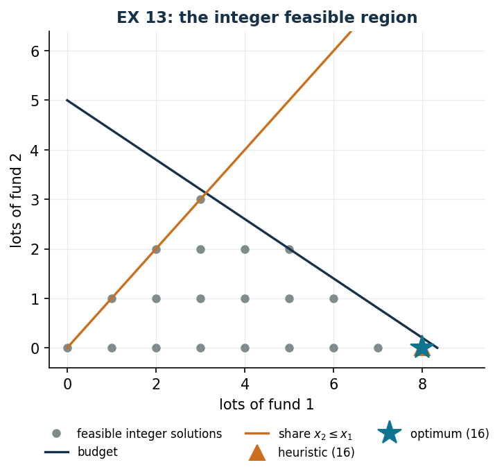

# EX 13 — Funds bought in lots

**Class:** ILP · **Links:** [integer counts](links-04.md), proportion constraint · **Script:** `python/ex13_funds.py`

[](https://colab.research.google.com/github/fabiofurini/mip-modelling/blob/main/notebooks/ex13_funds.ipynb)

One of the [fifteen numerical models](numerical.md): only two variables, and the
right place to see how a dual certificate is checked.

!!! abstract "EX 13"
    After a win, an investor has to decide how to place $100$ million lire. A
    friend suggests two types of mutual fund. Units are bought only in
    **indivisible lots**: a lot of the first type costs $12$ million, one of the
    second $20$ million. The estimated annual return is $1/6$ of the capital
    invested for the first type and $15\%$ for the second. Moreover the number of
    lots of the second type cannot exceed $50\%$ of the total number of lots
    bought. The expected annual return is to be maximised.

## Model

The return of a lot is $12 \cdot 1/6 = 2$ million for the first fund and
$20 \cdot 0.15 = 3$ for the second. The share constraint
$x_2 \le \tfrac12 (x_1 + x_2)$, multiplied by $2$ and moved to the left, becomes
$-x_1 + x_2 \le 0$. With $x_j$ the number of lots of fund $j$:

<!-- modello-esteso: ex13_primale -->

<div class="modello-esteso" markdown>

$$
\begin{array}{r@{\,}r@{\,}r c l}
\max & 2x_1 & +3x_2 &  & \\
\text{subject to} & 12x_1 & +20x_2 & \le & 100\\
 & -x_1 & +x_2 & \le & 0\\
 & x_1, & x_2 & \in & \Z_{\ge 0}
\end{array}
$$

</div>

<!-- modello-esteso: fine -->

An **integer knapsack**, not a binary one: the variables count lots, not choices.

## Constructive heuristic: the primal bound

This is a **maximisation**. The funds are scanned by decreasing return per
million invested: $2/12 = 1/6$ for the first and $3/20$ for the second. Starting
from the first, $8$ lots are bought ($96$ million) and $4$ million are left,
which are not enough for another lot of either type.

$$\mathit{LB} = 16.$$

## LP relaxation and dual: the dual bound

With $\alpha \ge 0$ on the budget and $\beta \ge 0$ on the share:

$$\min ~ 100 \alpha \quad\text{s.t.}\quad 12 \alpha - \beta \ge 2, \qquad 20 \alpha + \beta \ge 3.$$

!!! danger "An attempt that is not feasible"
    A draft of this exercise proposed $\bar\alpha = 5/32$, $\bar\beta = 1/8$. Let
    us check the first constraint:

    $$12 \cdot \frac{5}{32} - \frac{1}{8} = \frac{60}{32} - \frac{4}{32} = \frac{56}{32} = \frac{7}{4} < 2.$$

    It is violated by $1/4$: that pair is **not** a feasible dual solution, and
    the value $100 \cdot 5/32$ is not a bound. A dual value can be read as a
    bound only after checking *all* the constraints, one by one.

**The correct recipe** is $\bar\beta = 0$ and

$$\bar\alpha = \max_j \frac{p_j}{c_j} = \max\Bigl(\frac{2}{12}, \frac{3}{20}\Bigr) = \frac{1}{6},$$

that is, "a million is worth what it returns in the better fund". Both
constraints become $c_j\, \bar\alpha \ge p_j$ and are satisfied, and

$$\mathit{UB} = 100 \cdot \frac{1}{6} = \frac{50}{3} \approx 16.67.$$

<!-- modello-esteso: ex13_duale -->

<div class="modello-esteso" markdown>

$$
\begin{array}{r@{\,}r@{\,}r c l}
\min & 100\alpha &  &  & \\
\text{subject to} & 12\alpha & -\beta & \ge & 2\\
 & 20\alpha & +\beta & \ge & 3\\
 & \alpha &  & \ge & 0\\
 &  & \beta & \ge & 0
\end{array}
$$

</div>

<!-- modello-esteso: fine -->

## Optimum and comparison

| $\mathit{LB}$ | $\mathit{UB}$ | $z(\mathit{LP})$ | $z(\mathit{LP}^+)$ | $z(\mathit{MILP})$ |
|---:|---:|---:|---:|---:|
| 16 | $50/3$ | $50/3$ | $50/3$ | 16 |

The heuristic finds the optimum: $8$ lots of the first fund and none of the
second, for $16$ million of return. The difference $50/3 - 16 = 2/3$ is the
**price of integrality**: the relaxation would buy $25/3$ lots of the first fund,
which cannot be bought in pieces.

!!! tip "A constraint that does not bite, and how to make it bite"
    On the data of the instance the share constraint does not bite, because the
    first fund returns more per million invested and at the optimum the second is
    not bought at all. The share becomes active as soon as the second fund
    returns $20\%$, that is $4$ million per lot: then without the share the
    optimum would be $20$ (five lots of the second fund) and with the share it
    drops to $18$ (three and three). It is the only way to see what a constraint
    really does: change the data until it bites.



## Code

The full script is
[`python/ex13_funds.py`](https://github.com/fabiofurini/mip-modelling/blob/main/python/ex13_funds.py);
the notebook is
[`notebooks/ex13_funds.ipynb`](https://github.com/fabiofurini/mip-modelling/blob/main/notebooks/ex13_funds.ipynb).

<!-- embedded-script: begin (regenerated by python/embed_code.py) -->

??? example "Show the complete script — `python/ex13_funds.py` (169 lines)"

    ```python
    """EX 13 -- Mutual funds bought in lots (family 10).

    An integer (not binary) knapsack with only two lot types and a proportion
    constraint rewritten in linear form. It also shows how a dual solution is checked:
    the source draft proposed an infeasible one, which is exhibited here as a
    counterexample before the correct one is built.
    """
    import gurobipy as gp
    import pandas as pd
    from gurobipy import GRB

    from mip import (ammissibile, due_rilassamenti, frazione, nuovo_modello, registra_bound,
                     risolvi, stampa_lp, valuta)
    from stile import ARANCIO, BLU, GRIGIO, TEAL, intestazione, plt, salva_dati, salva_figura
    from esteso import salva_modello

    R = range

    # ---------- 1. MODEL AND INSTANCE ----------
    intestazione("EX 13. Funds in lots: maximising the annual return within the budget")
    c12 = [12, 20]                 # cost of one lot (millions)
    t12 = [1 / 6, 0.15]            # annual return, a fraction of the capital invested
    p12 = [c12[j] * t12[j] for j in R(2)]   # return of one lot: 2 and 3 millions
    B12 = 100                      # budget available
    QUOTA = 0.5                    # fund 2 cannot exceed half of the total lots
    salva_dati(pd.DataFrame({"fund": [1, 2], "lot_cost": c12, "return": t12,
                             "lot_return": p12}), "ex13_dati")
    print(f"  Return of one lot: fund 1 = 12 * 1/6 = {frazione(p12[0])}, "
          f"fund 2 = 20 * 0.15 = {frazione(p12[1])} millions.")
    print(f"  The constraint x2 <= {QUOTA} (x1 + x2) becomes, multiplying by 2 and moving to the "
          "left, -x1 + x2 <= 0.")


    def modello(c, p, B):
        m = nuovo_modello("funds")
        x = m.addVars(2, vtype=GRB.INTEGER, name="x")
        m.setObjective(gp.quicksum(p[j] * x[j] for j in R(2)), GRB.MAXIMIZE)
        m.addConstr(gp.quicksum(c[j] * x[j] for j in R(2)) <= B, name="budget")
        m.addConstr(-x[0] + x[1] <= 0, name="share")
        return m, x


    def duale(c, p, B):
        """min B alpha  s.t.  c_1 alpha - beta >= p_1,  c_2 alpha + beta >= p_2,  alpha, beta >= 0."""
        d = nuovo_modello("dual_funds")
        alpha = d.addVar(name="alpha")     # budget
        beta = d.addVar(name="beta")       # share
        d.setObjective(B * alpha, GRB.MINIMIZE)
        d.addConstr(c[0] * alpha - beta >= p[0], name="rc[0]")
        d.addConstr(c[1] * alpha + beta >= p[1], name="rc[1]")
        return d


    m12, x12 = modello(c12, p12, B12)
    salva_modello(m12, "ex13_primale")
    print("  The model of the instance:")
    stampa_lp(m12)

    # ---------- 2. CONSTRUCTIVE HEURISTIC (LOWER BOUND) ----------
    # constructive heuristic on the return per million invested, respecting the share at every purchase
    def euristica(c, p, B):
        x = [0, 0]
        ordine = sorted(R(2), key=lambda j: (-p[j] / c[j], j))
        passi = ["return per million invested: "
                 + ", ".join(f"fund {j + 1} = {frazione(p[j])}/{c[j]} = {frazione(p[j] / c[j])}"
                             for j in R(2))
                 + f"; we start from fund {ordine[0] + 1}"]
        for j in ordine:
            comprati = 0
            while True:
                prova = list(x)
                prova[j] += 1
                if sum(c[k] * prova[k] for k in R(2)) > B or -prova[0] + prova[1] > 0:
                    break
                x, comprati = prova, comprati + 1
            residuo = B - sum(c[k] * x[k] for k in R(2))
            motivo = ("the remaining budget is not enough for another lot"
                      if residuo < c[j] else "another lot would violate the share")
            passi.append(f"fund {j + 1}: {comprati} lots are bought and we stop because "
                         f"{motivo} ({residuo} millions left)")
        return x, passi


    x_eur, passi = euristica(c12, p12, B12)
    for k, riga in enumerate(passi, 1):
        print(f"  Step {k}. {riga}")
    lb12 = sum(p12[j] * x_eur[j] for j in R(2))
    sol_eur = {f"x[{j}]": x_eur[j] for j in R(2)}
    assert ammissibile(m12, sol_eur), sol_eur
    print(f"  Heuristic solution: {x_eur[0]} lots of fund 1 and {x_eur[1]} of fund 2   "
          f"lb = {frazione(lb12)}")

    # ---------- 3. LP RELAXATION AND DUAL (UPPER BOUND) ----------
    d12 = duale(c12, p12, B12)
    salva_modello(d12, "ex13_duale")
    # counterexample: the choice alpha = 5/32, beta = 1/8 is not feasible
    tentativo = {"alpha": 5 / 32, "beta": 1 / 8}
    val_t, viol_t = valuta(d12, tentativo)
    print(f"  A NOT feasible attempt: alpha = 5/32, beta = 1/8 gives "
          f"{c12[0]} * 5/32 - 1/8 = {frazione(c12[0] * 5 / 32 - 1 / 8)} < {frazione(p12[0])}: "
          f"the first dual constraint is violated by {frazione(viol_t)}.")
    print("  A dual value may be read as a bound only after checking ALL the constraints.")
    assert viol_t > 1e-9
    # correct recipe: beta = 0 and alpha equal to the highest return per million
    alpha_min = max(p12[j] / c12[j] for j in R(2))
    mano = {"alpha": alpha_min, "beta": 0.0}
    ub12, viol = valuta(d12, mano)
    assert viol <= 1e-9, viol
    print(f"  Hand-built dual: beta = 0 and alpha = max_j p_j / c_j = {frazione(alpha_min)} "
          "(a million is worth what it returns in the best fund),")
    print(f"  so every constraint c_j alpha >= p_j holds  ->  ub = {B12} * alpha = "
          f"{frazione(ub12)}")
    zlp12, zlp12r, _ = due_rilassamenti(m12, d12)

    # ---------- 4. OPTIMUM OF THE MILP ----------
    z12 = risolvi(m12)
    print(f"  Optimal solution: {int(x12[0].X)} lots of fund 1 and {int(x12[1].X)} of fund 2, "
          f"spending {int(sum(c12[j] * x12[j].X for j in R(2)))} out of {B12}, return "
          f"{frazione(z12)}")
    riga = registra_bound("EX 13 funds", ub12, lb12, zlp12, zlp12r, z12, senso="max")
    salva_dati(pd.DataFrame([riga]), "ex13_bound")
    assert lb12 <= z12 <= zlp12 <= ub12 + 1e-9

    # ---------- 5. THE PRICE OF INTEGRALITY ----------
    intestazione("EX 13. The price of integrality and the role of the share")
    print(f"  z(LP) = {frazione(zlp12)} against z(MILP) = {frazione(z12)}: the relaxation buys")
    print(f"  {frazione(B12 / c12[0])} lots of fund 1, which cannot be bought in pieces.")
    print(f"  The difference {frazione(zlp12 - z12)} is the cost of the indivisibility of the lots.")
    print()
    print("  On the data of the instance the share does not bite: fund 1 returns more per million")
    print("  invested and the optimal solution buys no fund 2 at all. The share becomes active as")
    print("  soon as fund 2 returns 20 per cent, that is 4 millions a lot:")
    prove = []
    for nome, p_alt, quota in [("original data, with share", p12, True),
                               ("original data, without share", p12, False),
                               ("fund 2 at 20 per cent, with share", [p12[0], 4.0], True),
                               ("fund 2 at 20 per cent, without share", [p12[0], 4.0], False)]:
        m, x = modello(c12, p_alt, B12)
        if not quota:
            m.update()
            m.remove([c for c in m.getConstrs() if c.ConstrName == "share"][0])
            m.update()
        z = risolvi(m)
        print(f"  {nome:38s} z = {frazione(z):>4}   x = ({int(x[0].X)}, {int(x[1].X)})")
        prove.append({"variant": nome, "z": z, "x1": int(x[0].X), "x2": int(x[1].X)})
    salva_dati(pd.DataFrame(prove), "ex13_quota")
    assert prove[2]["z"] < prove[3]["z"], "with a more profitable fund 2 the share must bite"

    # ---------- 6. FIGURE: THE FEASIBLE REGION ----------
    fig, ax = plt.subplots(figsize=(5.4, 4.2))
    punti = [(i, j) for i in R(10) for j in R(10)
             if c12[0] * i + c12[1] * j <= B12 and -i + j <= 0]
    ax.plot([q[0] for q in punti], [q[1] for q in punti], "o", color=GRIGIO, ms=5,
            label="feasible integer solutions")
    xs = [0, B12 / c12[0]]
    ax.plot(xs, [(B12 - c12[0] * v) / c12[1] for v in xs], color=BLU, lw=1.6, label="budget")
    ax.plot([0, 9], [0, 9], color=ARANCIO, lw=1.6, label="share $x_2 \\leq x_1$")
    ax.plot(x_eur[0], x_eur[1], marker="^", color=ARANCIO, ms=11, ls="",
            label=f"heuristic ({frazione(lb12)})")
    ax.plot(x12[0].X, x12[1].X, marker="*", color=TEAL, ms=17, ls="",
            label=f"optimum ({frazione(z12)})")
    ax.set_xlim(-0.4, 9.4)
    ax.set_ylim(-0.4, 6.4)
    ax.set_xlabel("lots of fund 1")
    ax.set_ylabel("lots of fund 2")
    ax.set_title("EX 13: the integer feasible region")
    ax.legend(fontsize=8, loc="upper right")
    salva_figura(fig, "ex13_regione")
    print("Done.")
    ```

<!-- embedded-script: end -->
