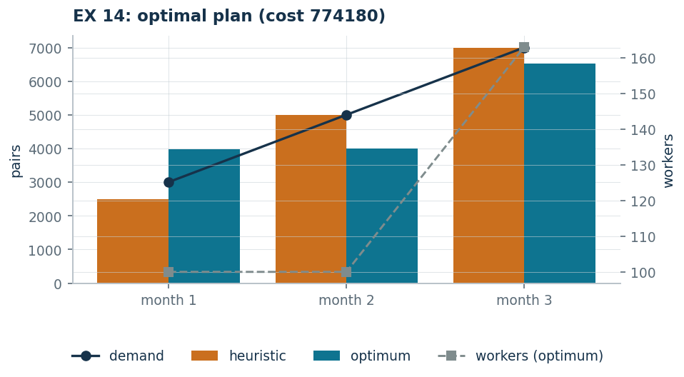

# EX 14 — Shoes: production, inventory and hiring

**Class:** MILP · **Links:** inventory balance, [integer counts](links-04.md) · **Script:** `python/ex14_shoes.py`<br>
**Difficulty:** ★★★★☆ · **Time:** 45–60 min
{ .scheda }

[](https://colab.research.google.com/github/fabiofurini/mip-modelling/blob/main/notebooks/ex14_shoes.ipynb)

One of the [fifteen numerical models](numerical.md), of the
[production planning](production.md) family.

!!! abstract "EX 14"
    Over the next three months a shoe factory must meet monthly demands of
    $3000$, $5000$ and $7000$ pairs of shoes. At the beginning of the first month
    it has $500$ pairs in stock and employs $100$ workers. Each worker is paid
    $1500$ euros a month and works $160$ hours; producing a pair takes $4$ hours
    of labour and $15$ euros of raw materials. At the beginning of every month
    workers can be hired, at a training cost of $100$ euros each. Keeping an
    unsold pair in stock at the end of a month costs $3$ euros. The plan of
    production and workforce of minimum total cost is wanted.

## Model

There are three months. Four families of variables are needed, one per decision:

- $x_t$ — pairs produced in month $t$, for $t \in \{1, 2, 3\}$;
- $s_t$ — pairs in stock at the end of month $t$, for $t \in \{1, 2\}$;
- $y_t$ — workers on duty in month $t$, for $t \in \{1, 2, 3\}$;
- $z_t$ — workers hired at the beginning of month $t$, for $t \in \{1, 2, 3\}$.

The first two are quantities of product, the other two are **counts of people**:
this is why $y_t$ and $z_t$ are declared integer.

Eleven columns: three for production, two for inventory, three for the workforce
and three for hiring. The demand of the first month is $3000 - 500 = 2500$ net
pairs; in all $14\,500$ pairs must be produced.

<!-- modello-esteso: ex14_primale -->

<div class="modello-esteso largo" markdown>

$$
\begin{array}{rrrrrrrrrrrr c l}
\min & 15x_1 & +15x_2 & +15x_3 & +3s_1 & +3s_2 & +1500y_1 & +1500y_2 & +1500y_3 & +100z_1 & +100z_2 & +100z_3 &  & \\
\text{subject to} & x_1 &  &  & -s_1 &  &  &  &  &  &  &  & = & 2500\\
 &  & x_2 &  & +s_1 & -s_2 &  &  &  &  &  &  & = & 5000\\
 &  &  & x_3 &  & +s_2 &  &  &  &  &  &  & = & 7000\\
 & -4x_1 &  &  &  &  & +160y_1 &  &  &  &  &  & \ge & 0\\
 &  & -4x_2 &  &  &  &  & +160y_2 &  &  &  &  & \ge & 0\\
 &  &  & -4x_3 &  &  &  &  & +160y_3 &  &  &  & \ge & 0\\
 &  &  &  &  &  & y_1 &  &  & -z_1 &  &  & = & 100\\
 &  &  &  &  &  & -y_1 & +y_2 &  &  & -z_2 &  & = & 0\\
 &  &  &  &  &  &  & -y_2 & +y_3 &  &  & -z_3 & = & 0\\
 & x_1, & x_2, & x_3 &  &  &  &  &  &  &  &  & \ge & 0\\
 &  &  &  & s_1, & s_2 &  &  &  &  &  &  & \ge & 0\\
 &  &  &  &  &  & y_1, & y_2, & y_3 &  &  &  & \in & \Z_{\ge 0}\\
 &  &  &  &  &  &  &  &  & z_1, & z_2, & z_3 & \in & \Z_{\ge 0}
\end{array}
$$

</div>

<!-- modello-esteso: fine -->

The first three constraints are the **inventory balances**, one per month: what
is produced plus what was there, minus what is left, covers the demand. The next
three are the **hours available**: $160$ hours per worker on duty must cover the
$4$ hours per pair. The last three are the **workforce balances**: this month's
workers are last month's plus those hired.

## Constructive heuristic: the primal bound

"Just in time" production: every month the net demand is produced, with no stock,
hiring as many workers as needed.

- **Month 1**: $10\,000$ hours, $63$ workers needed — the $100$ already on duty
  are enough.
- **Month 2**: $20\,000$ hours, $125$ workers needed — $25$ are hired.
- **Month 3**: $28\,000$ hours, $175$ workers needed — another $50$ are hired.

The cost of this plan is $\mathit{UB} = 825\,000$.

## LP relaxation and dual: the dual bound

The LP relaxation replaces the integrality of $y_t$ and $z_t$ with non-negativity
alone. The dual has a **free** variable $\alpha_t$ for each inventory balance, a
**non-negative** variable $\beta_t$ for each hours constraint and a **free**
variable $\gamma_t$ for each workforce balance; the eleven columns of the primal
give eleven dual constraints:

<!-- modello-esteso: ex14_duale -->

<div class="modello-esteso largo" markdown>

$$
\begin{array}{rrrrrrrrrr c l}
\max & 2500\alpha_1 & +5000\alpha_2 & +7000\alpha_3 &  &  &  & +100\gamma_1 &  &  &  & \\
\text{subject to} & \alpha_1 &  &  & -4\beta_1 &  &  &  &  &  & \le & 15\\
 &  & \alpha_2 &  &  & -4\beta_2 &  &  &  &  & \le & 15\\
 &  &  & \alpha_3 &  &  & -4\beta_3 &  &  &  & \le & 15\\
 & -\alpha_1 & +\alpha_2 &  &  &  &  &  &  &  & \le & 3\\
 &  & -\alpha_2 & +\alpha_3 &  &  &  &  &  &  & \le & 3\\
 &  &  &  & 160\beta_1 &  &  & +\gamma_1 & -\gamma_2 &  & \le & 1500\\
 &  &  &  &  & 160\beta_2 &  &  & +\gamma_2 & -\gamma_3 & \le & 1500\\
 &  &  &  &  &  & 160\beta_3 &  &  & +\gamma_3 & \le & 1500\\
 &  &  &  &  &  &  & -\gamma_1 &  &  & \le & 100\\
 &  &  &  &  &  &  &  & -\gamma_2 &  & \le & 100\\
 &  &  &  &  &  &  &  &  & -\gamma_3 & \le & 100\\
 & \alpha_1, & \alpha_2, & \alpha_3 &  &  &  &  &  &  & \gtreqless & 0\\
 &  &  &  & \beta_1, & \beta_2, & \beta_3 &  &  &  & \ge & 0\\
 &  &  &  &  &  &  & \gamma_1, & \gamma_2, & \gamma_3 & \gtreqless & 0
\end{array}
$$

</div>

<!-- modello-esteso: fine -->

**A dual solution by hand.** Set $\gamma = 0$ and let an hour of labour be worth
what it actually costs,

$$\bar\beta_t = \frac{1500}{160} = \frac{75}{8},$$

so that a pair is worth at most

$$\bar\alpha_t = 15 + 4 \cdot \frac{75}{8} = \frac{105}{2} = 52.5.$$

All the dual columns are satisfied, and the bound is

$$\mathit{LB} = \frac{105}{2} \cdot 14\,500 = 761\,250.$$

## Optimum and comparison

| $\mathit{UB}$ | $\mathit{LB}$ | $z(\mathit{LP})$ | $z(\mathit{LP}^+)$ | $z(\mathit{MILP})$ |
|---:|---:|---:|---:|---:|
| 825 000 | 761 250 | 773 500 | 773 500 | 774 180 |

The optimal plan produces $3980$, $4000$ and $6520$ pairs with $100$, $100$ and
$163$ workers: $1480$ pairs are kept in stock at the end of the first month and
$480$ at the end of the second, and $63$ workers are hired **once only**, in the
third month.

!!! tip "Why building stock pays off"
    Producing early costs $3$ euros a pair and saves wages: it is the trade-off
    the model settles by itself. Raising the holding cost to $20$ euros brings
    the stocks down to $1000$ and $0$ (optimum $807\,500$); at $60$ euros they
    disappear altogether and the plan falls back on the heuristic's "just in
    time".



## Code

The full script is
[`python/ex14_shoes.py`](https://github.com/fabiofurini/mip-modelling/blob/main/python/ex14_shoes.py);
the notebook is
[`notebooks/ex14_shoes.ipynb`](https://github.com/fabiofurini/mip-modelling/blob/main/notebooks/ex14_shoes.ipynb).

<!-- embedded-script: begin (regenerated by python/embed_code.py) -->

??? example "Show the complete script — `python/ex14_shoes.py` (176 lines)"

    ```python
    """EX 14 -- Shoe production and workforce over three months (family 9).

    Inventory balance, working hours proportional to production and workforce dynamics
    with hirings only. It is the numerical version of problem 9.2, with the same
    structure: one balance constraint per period and one conservation constraint for
    the workforce.
    """
    import gurobipy as gp
    import pandas as pd
    from gurobipy import GRB

    from mip import (ammissibile, due_rilassamenti, frazione, nuovo_modello, registra_bound,
                     risolvi, valuta)
    from stile import ARANCIO, BLU, GRIGIO, TEAL, intestazione, plt, salva_dati, salva_figura
    from esteso import salva_modello

    R = range

    # ---------- 1. MODEL AND INSTANCE ----------
    intestazione("EX 14. Shoes: production, inventory and hirings over three months")
    d3 = [3000, 5000, 7000]      # monthly demand in pairs
    s0 = 500                     # initial inventory
    y0 = 100                     # workers on duty at the start
    w3 = 1500                    # monthly wage of a worker
    ore3 = 160                   # hours worked a month by one worker
    ore_paio = 4                 # labour hours per pair
    mat3 = 15                    # raw materials per pair
    ass3 = 100                   # cost of hiring a worker
    mag3 = 3                     # storage cost per pair at the end of the month
    T = len(d3)
    salva_dati(pd.DataFrame({"month": R(1, T + 1), "demand": d3}), "ex14_domanda")
    netta = [d3[0] - s0] + d3[1:]
    print(f"  Net demand of the first month: {d3[0]} - {s0} = {netta[0]} pairs; total to produce "
          f"{sum(netta)} pairs.")


    def modello(d, s0, y0, mag=None):
        mag = mag3 if mag is None else mag
        T = len(d)
        m = nuovo_modello("shoes")
        x = m.addVars(T, name="x")                       # pairs produced
        s = m.addVars(T - 1, name="s")                   # inventory at the end of the month
        y = m.addVars(T, vtype=GRB.INTEGER, name="y")    # workers on duty
        z = m.addVars(T, vtype=GRB.INTEGER, name="z")    # workers hired
        m.setObjective(mat3 * x.sum() + mag * s.sum() + w3 * y.sum() + ass3 * z.sum(),
                       GRB.MINIMIZE)
        m.addConstr(x[0] - s[0] == d[0] - s0, name="balance[0]")
        for t in R(1, T - 1):
            m.addConstr(x[t] + s[t - 1] - s[t] == d[t], name=f"balance[{t}]")
        m.addConstr(x[T - 1] + s[T - 2] == d[T - 1], name=f"balance[{T - 1}]")
        m.addConstrs((ore3 * y[t] - ore_paio * x[t] >= 0 for t in R(T)), name="hours")
        m.addConstr(y[0] - z[0] == y0, name="workforce[0]")
        m.addConstrs((y[t] - y[t - 1] - z[t] == 0 for t in R(1, T)), name="workforce")
        return m, x, s, y, z


    def duale(d, s0, y0):
        """max sum_t b_t alpha_t + y0 gamma_1  with alpha, gamma free and beta >= 0.

        Columns:  x_t: alpha_t - ore_paio beta_t <= mat
                  s_t: -alpha_t + alpha_{t+1} <= mag
                  y_t: hours beta_t + gamma_t - gamma_{t+1} <= w   (gamma_{T+1} = 0)
                  z_t: -gamma_t <= hire
        """
        T = len(d)
        dl = nuovo_modello("dual_shoes")
        alpha = dl.addVars(T, lb=-GRB.INFINITY, name="alpha")
        beta = dl.addVars(T, name="beta")
        gamma = dl.addVars(T, lb=-GRB.INFINITY, name="gamma")
        b = [d[0] - s0] + list(d[1:])
        dl.setObjective(gp.quicksum(b[t] * alpha[t] for t in R(T)) + y0 * gamma[0], GRB.MAXIMIZE)
        dl.addConstrs((alpha[t] - ore_paio * beta[t] <= mat3 for t in R(T)), name="rcx")
        dl.addConstrs((-alpha[t] + alpha[t + 1] <= mag3 for t in R(T - 1)), name="rcs")
        for t in R(T):
            succ = gamma[t + 1] if t + 1 < T else 0
            dl.addConstr(ore3 * beta[t] + gamma[t] - succ <= w3, name=f"rcy[{t}]")
        dl.addConstrs((-gamma[t] <= ass3 for t in R(T)), name="rcz")
        return dl


    m3, x3, s3, y3, z3 = modello(d3, s0, y0)
    salva_modello(m3, "ex14_primale")

    # ---------- 2. CONSTRUCTIVE HEURISTIC (UPPER BOUND) ----------
    # "just in time" production: every month exactly the net demand is produced, with no
    # inventory, hiring as many workers as needed
    def euristica(d, s0, y0):
        T = len(d)
        b = [d[0] - s0] + list(d[1:])
        x = [float(v) for v in b]
        s = [0.0] * (T - 1)
        y, z, passi = [], [], []
        organico = y0
        for t in R(T):
            serve = -(-int(ore_paio * x[t]) // ore3)     # ceil
            nuovi = max(0, serve - organico)
            organico = max(organico, serve)
            y.append(organico)
            z.append(nuovi)
            passi.append(f"month {t + 1}: {int(x[t])} pairs are produced, "
                         f"{int(ore_paio * x[t])} hours are needed, that is {serve} workers; "
                         f"{nuovi} are hired and the workforce rises to {organico}")
        return x, s, y, z, passi


    x_e, s_e, y_e, z_e, passi = euristica(d3, s0, y0)
    for k, riga in enumerate(passi, 1):
        print(f"  Step {k}. {riga}")
    ub3 = (mat3 * sum(x_e) + mag3 * sum(s_e) + w3 * sum(y_e) + ass3 * sum(z_e))
    sol_eur = ({f"x[{t}]": x_e[t] for t in R(T)} | {f"s[{t}]": s_e[t] for t in R(T - 1)}
               | {f"y[{t}]": y_e[t] for t in R(T)} | {f"z[{t}]": z_e[t] for t in R(T)})
    assert ammissibile(m3, sol_eur), sol_eur
    print(f"  Cost of the heuristic solution: ub = {frazione(ub3)}")

    # ---------- 3. LP RELAXATION AND DUAL (LOWER BOUND) ----------
    dl3 = duale(d3, s0, y0)
    salva_modello(dl3, "ex14_duale")
    # recipe: an hour of work is worth beta = w / hours (what it really costs), so a pair
    # is worth at most alpha = mat + ore_paio * beta; gamma = 0
    beta_v = w3 / ore3
    alpha_v = mat3 + ore_paio * beta_v
    mano = {f"beta[{t}]": beta_v for t in R(T)} | {f"alpha[{t}]": alpha_v for t in R(T)}
    lb3, viol = valuta(dl3, mano)
    assert viol <= 1e-9, viol
    print(f"  Hand-built dual: gamma = 0, beta_t = {w3}/{ore3} = {frazione(beta_v)} euros an hour")
    print(f"  (the true cost of an hour of work) and alpha_t = {mat3} + {ore_paio} * "
          f"{frazione(beta_v)} = {frazione(alpha_v)} euros a pair.")
    print(f"  lb = {frazione(alpha_v)} * {sum(netta)} = {frazione(lb3)}")
    zlp3, zlp3r, _ = due_rilassamenti(m3, dl3)

    # ---------- 4. OPTIMUM OF THE MILP ----------
    z3v = risolvi(m3)
    print("  Optimal solution:")
    for t in R(T):
        scorta = s3[t].X if t < T - 1 else 0.0
        print(f"    month {t + 1}: {frazione(x3[t].X)} pairs, {int(y3[t].X)} workers "
              f"({int(z3[t].X)} hired), inventory at the end of the month {frazione(scorta)}")
    riga = registra_bound("EX 14 shoes", ub3, lb3, zlp3, zlp3r, z3v)
    salva_dati(pd.DataFrame([riga]), "ex14_bound")
    assert lb3 <= zlp3 <= z3v <= ub3 + 1e-9

    # ---------- 5. WHY PRODUCING EARLY PAYS OFF ----------
    intestazione("EX 14. Storage against hiring")
    print(f"  Keeping a pair in stock for one month costs {mag3} euros; hiring a worker costs")
    print(f"  {ass3} euros once plus {w3} euros a month. The optimum produces early exactly to")
    print("  avoid hiring at the last moment.")
    prove = []
    for nome, mag in [("storage at 3 euros", 3), ("storage at 20 euros", 20),
                      ("storage at 60 euros", 60)]:
        m, x, s, y, z = modello(d3, s0, y0, mag=mag)
        val = risolvi(m)
        scorte = [s[t].X for t in R(T - 1)]
        print(f"  {nome:24s} z = {frazione(val):>10}   inventories "
              + ", ".join(frazione(v) for v in scorte))
        prove.append({"variant": nome, "z": val,
                      "inventories": " ".join(str(int(v)) for v in scorte)})
    salva_dati(pd.DataFrame(prove), "ex14_varianti")

    # ---------- 6. FIGURE ----------
    fig, ax = plt.subplots(figsize=(6.6, 3.0))
    idx = list(R(T))
    ax.bar([t - 0.2 for t in idx], [x_e[t] for t in idx], 0.4, color=ARANCIO, label="heuristic")
    ax.bar([t + 0.2 for t in idx], [x3[t].X for t in idx], 0.4, color=TEAL, label="optimum")
    ax.plot(idx, d3, marker="o", color=BLU, lw=1.6, label="demand")
    ax2 = ax.twinx()
    ax2.plot(idx, [y3[t].X for t in idx], marker="s", color=GRIGIO, ls="--", lw=1.4,
             label="workers (optimum)")
    ax2.set_ylabel("workers")
    ax.set_xticks(idx)
    ax.set_xticklabels([f"month {t + 1}" for t in idx])
    ax.set_ylabel("pairs")
    ax.set_title(f"EX 14: optimal plan (cost {frazione(z3v)})")
    ax.legend(fontsize=8, loc="upper left")
    ax2.legend(fontsize=8, loc="lower right")
    salva_figura(fig, "ex14_piano")
    print("Done.")
    ```

<!-- embedded-script: end -->
