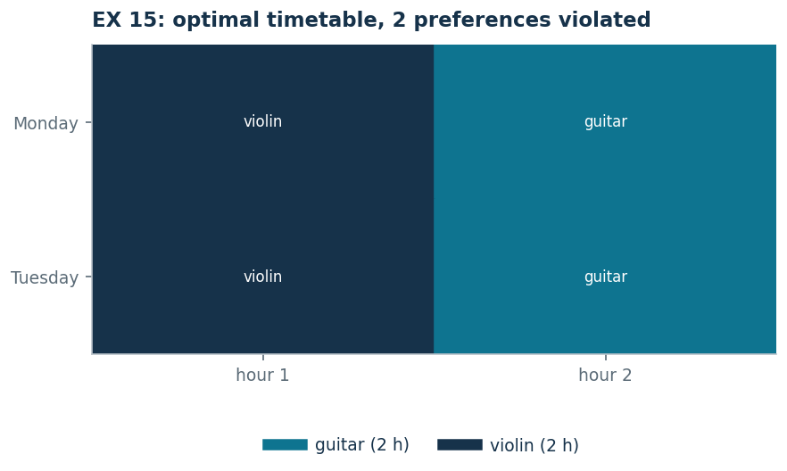

# EX 15 — The music school timetable

**Class:** BIP · **Links:** [if and only if](links-10.md), counts · **Script:** `python/ex15_timetable.py`<br>
**Difficulty:** ★★★★☆ · **Time:** 45–60 min
{ .scheda }

[](https://colab.research.google.com/github/fabiofurini/mip-modelling/blob/main/notebooks/ex15_timetable.ipynb)

One of the [fifteen numerical models](numerical.md), of the
[assignment and scheduling](scheduling.md) family. It is the model where it is
clearest what happens when a link is written **one way only**.

!!! abstract "EX 15"
    A music school has to build its weekly timetable. There are two afternoons
    (Monday and Tuesday), each of two hours. $2$ hours of guitar and $2$ of
    violin must be placed. Every day must include lessons of **at least two
    different instruments**.

    Each of the two teachers has one preference, to be respected if possible: the
    guitar teacher would rather not come on Tuesday, the violin teacher would
    rather not come on Monday. The number of hours violating a preference is to
    be minimised.

## Model

Two families of binary variables:

- $x_{dti} = 1$ if instrument $i$ is taught at hour $t$ of day $d$;
- $y_{di} = 1$ if instrument $i$ appears on day $d$.

They are eight columns for the lessons — one per triple day, hour, instrument —
and four for the indicators.

<!-- modello-esteso: ex15_primale -->

<div class="modello-esteso largo" markdown>

$$
\begin{array}{rrrrrrrrrrrrr c l}
\min &  & x_{112} &  & +x_{122} & +x_{211} &  & +x_{221} &  &  &  &  &  &  & \\
\text{subject to} & x_{111} &  & +x_{121} &  & +x_{211} &  & +x_{221} &  &  &  &  &  & = & 2\\
 &  & x_{112} &  & +x_{122} &  & +x_{212} &  & +x_{222} &  &  &  &  & = & 2\\
 & x_{111} & +x_{112} &  &  &  &  &  &  &  &  &  &  & \le & 1\\
 &  &  & x_{121} & +x_{122} &  &  &  &  &  &  &  &  & \le & 1\\
 &  &  &  &  & x_{211} & +x_{212} &  &  &  &  &  &  & \le & 1\\
 &  &  &  &  &  &  & x_{221} & +x_{222} &  &  &  &  & \le & 1\\
 &  &  &  &  &  &  &  &  & y_{11} & +y_{12} &  &  & \ge & 2\\
 &  &  &  &  &  &  &  &  &  &  & y_{21} & +y_{22} & \ge & 2\\
 & x_{111} &  &  &  &  &  &  &  & -y_{11} &  &  &  & \le & 0\\
 &  & x_{112} &  &  &  &  &  &  &  & -y_{12} &  &  & \le & 0\\
 &  &  & x_{121} &  &  &  &  &  & -y_{11} &  &  &  & \le & 0\\
 &  &  &  & x_{122} &  &  &  &  &  & -y_{12} &  &  & \le & 0\\
 &  &  &  &  & x_{211} &  &  &  &  &  & -y_{21} &  & \le & 0\\
 &  &  &  &  &  & x_{212} &  &  &  &  &  & -y_{22} & \le & 0\\
 &  &  &  &  &  &  & x_{221} &  &  &  & -y_{21} &  & \le & 0\\
 &  &  &  &  &  &  &  & x_{222} &  &  &  & -y_{22} & \le & 0\\
 & -x_{111} &  & -x_{121} &  &  &  &  &  & +y_{11} &  &  &  & \le & 0\\
 &  & -x_{112} &  & -x_{122} &  &  &  &  &  & +y_{12} &  &  & \le & 0\\
 &  &  &  &  & -x_{211} &  & -x_{221} &  &  &  & +y_{21} &  & \le & 0\\
 &  &  &  &  &  & -x_{212} &  & -x_{222} &  &  &  & +y_{22} & \le & 0\\
 & x_{111}, & x_{112}, & x_{121}, & x_{122}, & x_{211}, & x_{212}, & x_{221}, & x_{222} &  &  &  &  & \in & \{0, 1\}\\
 &  &  &  &  &  &  &  &  & y_{11}, & y_{12}, & y_{21}, & y_{22} & \in & \{0, 1\}
\end{array}
$$

</div>

<!-- modello-esteso: fine -->

The first two rows count the hours of each instrument. The next four say that at
most one lesson happens in each slot. The two after that are the **variety**: at
least two instruments a day. Then come the two directions of the link between
lesson and indicator — eight rows for "if there is a lesson the indicator is on"
and four for the converse — and at the bottom the two domain rows.

The hours to place are $2+2 = 4$ and the slots are $2 \cdot 2 = 4$: the two
figures coincide, so every slot holds exactly one lesson.

!!! danger "The variety constraint written one way only is vacuous"
    It comes naturally to write only the link $x_{dti} \le y_{di}$, and not its
    converse. With that direction alone the constraint $\sum_i y_{di} \ge 2$ is
    **always** satisfied: it is enough to set $y_{di} = 1$ without teaching.
    Solving the model as written, the solver puts all the guitar on Monday and
    all the violin on Tuesday — **two** days with a single instrument each — and
    declares $0$ violated preferences, while the true optimum violates $2$. The
    wrong model does not merely allow a bad timetable: it also announces a cost
    that does not exist.

    The link $x_{dti} \le y_{di}$ says "if there is a lesson then the indicator
    is on", not the converse. What is also needed is

    $$y_{di} \;\le\; \sum_{t \in T} x_{dti},$$

    that is the [if and only if](links-10.md) technique. It is the same mistake,
    and the same correction, as in [problem 10.3](mixed-3.md): when a constraint
    *counts* indicators, the link must hold in both directions.

## A feasible solution: the primal bound

With the corrected model this timetable is built by hand (the asterisk marks a
violated preference):

| | hour 1 | hour 2 |
|---|---|---|
| Monday | guitar | violin\* |
| Tuesday | guitar\* | violin |

Check: $2$ hours of guitar and $2$ of violin, two instruments on each day. The
variety forces every day to hold both instruments, and every day disappoints one
of them: two violated preferences, and one cannot do better.

$$\mathit{UB} = 2.$$

## The lower bound

All the costs $c_{dti}$ are $0$ or $1$, so the objective is a sum of non-negative
terms and $z(\mathit{MILP}) \ge 0$ **with no dual needed**. The dual of the
relaxation confirms that one cannot do better: one variable per family of primal
constraints — $\alpha_i$ free on the hours of each instrument,
$\beta_{dt} \le 0$ on the slots, $\gamma_d \ge 0$ on the variety,
$\delta_{dti} \le 0$ and $\varepsilon_{di} \le 0$ on the two directions of the
link — and its optimum is $0$.

<!-- modello-esteso: ex15_duale -->

<div class="modello-esteso largo" markdown>

$$
\begin{array}{rrrrrrrrrrrrrrrrrrrrr c l}
\max & 2\alpha_1 & +2\alpha_2 & +\beta_{11} & +\beta_{12} & +\beta_{21} & +\beta_{22} & +2\gamma_1 & +2\gamma_2 &  &  &  &  &  &  &  &  &  &  &  &  &  & \\
\text{subject to} & \alpha_1 &  & +\beta_{11} &  &  &  &  &  & +\delta_{111} &  &  &  &  &  &  &  & -\epsilon_{11} &  &  &  & \le & 0\\
 &  & \alpha_2 & +\beta_{11} &  &  &  &  &  &  & +\delta_{112} &  &  &  &  &  &  &  & -\epsilon_{12} &  &  & \le & 1\\
 & \alpha_1 &  &  & +\beta_{12} &  &  &  &  &  &  & +\delta_{121} &  &  &  &  &  & -\epsilon_{11} &  &  &  & \le & 0\\
 &  & \alpha_2 &  & +\beta_{12} &  &  &  &  &  &  &  & +\delta_{122} &  &  &  &  &  & -\epsilon_{12} &  &  & \le & 1\\
 & \alpha_1 &  &  &  & +\beta_{21} &  &  &  &  &  &  &  & +\delta_{211} &  &  &  &  &  & -\epsilon_{21} &  & \le & 1\\
 &  & \alpha_2 &  &  & +\beta_{21} &  &  &  &  &  &  &  &  & +\delta_{212} &  &  &  &  &  & -\epsilon_{22} & \le & 0\\
 & \alpha_1 &  &  &  &  & +\beta_{22} &  &  &  &  &  &  &  &  & +\delta_{221} &  &  &  & -\epsilon_{21} &  & \le & 1\\
 &  & \alpha_2 &  &  &  & +\beta_{22} &  &  &  &  &  &  &  &  &  & +\delta_{222} &  &  &  & -\epsilon_{22} & \le & 0\\
 &  &  &  &  &  &  & \gamma_1 &  & -\delta_{111} &  & -\delta_{121} &  &  &  &  &  & +\epsilon_{11} &  &  &  & \le & 0\\
 &  &  &  &  &  &  & \gamma_1 &  &  & -\delta_{112} &  & -\delta_{122} &  &  &  &  &  & +\epsilon_{12} &  &  & \le & 0\\
 &  &  &  &  &  &  &  & \gamma_2 &  &  &  &  & -\delta_{211} &  & -\delta_{221} &  &  &  & +\epsilon_{21} &  & \le & 0\\
 &  &  &  &  &  &  &  & \gamma_2 &  &  &  &  &  & -\delta_{212} &  & -\delta_{222} &  &  &  & +\epsilon_{22} & \le & 0\\
 & \alpha_1, & \alpha_2 &  &  &  &  &  &  &  &  &  &  &  &  &  &  &  &  &  &  & \gtreqless & 0\\
 &  &  & \beta_{11}, & \beta_{12}, & \beta_{21}, & \beta_{22} &  &  &  &  &  &  &  &  &  &  &  &  &  &  & \gtreqless & 0\\
 &  &  &  &  &  &  & \gamma_1, & \gamma_2 &  &  &  &  &  &  &  &  &  &  &  &  & \ge & 0\\
 &  &  &  &  &  &  &  &  & \delta_{111}, & \delta_{112}, & \delta_{121}, & \delta_{122}, & \delta_{211}, & \delta_{212}, & \delta_{221}, & \delta_{222} &  &  &  &  & \gtreqless & 0\\
 &  &  &  &  &  &  &  &  &  &  &  &  &  &  &  &  & \epsilon_{11}, & \epsilon_{12}, & \epsilon_{21}, & \epsilon_{22} & \gtreqless & 0
\end{array}
$$

</div>

<!-- modello-esteso: fine -->

Every row is a column of the primal: the first eight are the $x_{dti}$, where the
price of the instrument's hour plus that of the slot, corrected by the two
directions of the link, cannot exceed the cost of the slot; the last four are the
$y_{di}$, where switching the indicator on costs the variety and is refunded by
the link.

$$\mathit{LB} = 0, \qquad z(\mathit{LP}) = 0, \qquad z(\mathit{LP}^+) = 2,
\qquad z(\mathit{MILP}) = 2.$$

The timetable built by hand was already optimal, but the dual bound does not
prove it: between $0$ and $2$ a gap is left that only branch and bound closes.

!!! warning "A count that is not a bound on the relaxation"
    Counting says more: every day holds both instruments, and on each day one of
    the two teachers would rather not be there; the violations are therefore at
    least two, and $z(\mathit{MILP}) \ge 2$. That count, however, uses the
    integrality of the variables: on the relaxation it does not hold, and indeed
    $z(\mathit{LP}) = 0$. It cannot take the place of $\mathit{LB}$ in the chain
    of bounds, where every term must hold for the LP as well.



## Code

The full script is
[`python/ex15_timetable.py`](https://github.com/fabiofurini/mip-modelling/blob/main/python/ex15_timetable.py);
the notebook is
[`notebooks/ex15_timetable.ipynb`](https://github.com/fabiofurini/mip-modelling/blob/main/notebooks/ex15_timetable.ipynb).

<!-- embedded-script: begin (regenerated by python/embed_code.py) -->

??? example "Show the complete script — `python/ex15_timetable.py` (241 lines)"

    ```python
    """EX 15 -- Timetable of a music school (family 11).

    Four afternoons of three hours each, twelve lesson hours to place: the timetable
    is a partition of the twelve slots. The model uses the count of the instruments
    per day (technique 3.11), the precedences between consecutive hours (3.9) and the
    soft constraints with penalties (3.13).

    The starting model contains an instructive mistake: the link between the lesson
    and the instrument indicator is written in one direction only, and the variety
    constraint becomes empty. We expose it by solving the wrong model, then fix it.

    On the data of the exercise, with the corrected model, there is a timetable that
    violates no preference: the optimum is zero and the certificate is immediate,
    because the costs are all non-negative. The two variants show what happens as soon
    as the preferences get tighter: in the first one, counting the available slots
    gives a positive lower bound; in the second, the model becomes infeasible.
    """
    import gurobipy as gp
    import pandas as pd
    from gurobipy import GRB

    from mip import (ammissibile, due_rilassamenti, frazione, nuovo_modello, risolvi,
                     valuta)
    from stile import ARANCIO, BLU, GRIGIO, TEAL, intestazione, plt, salva_dati, salva_figura
    from esteso import salva_modello

    R = range

    # ---------- 1. MODEL AND INSTANCE ----------
    intestazione("EX 15. Music school timetable: minimising the violated preferences")
    GIORNI = ["Monday", "Tuesday"]
    ORE = [1, 2]
    STRUM = ["guitar", "violin"]
    h14 = [2, 2]                    # hours to place per instrument
    nd, nt, ni = len(GIORNI), len(ORE), len(STRUM)
    print(f"  Hours to place: {sum(h14)}; slots available: {nd} * {nt} = {nd * nt}.")
    print("  The two figures coincide: every slot of the timetable holds exactly one lesson.")


    def costi(extra_chitarra=()):
        """c[d][t][i] = 1 if the slot violates a preference of the teacher of i."""
        c = [[[0] * ni for _ in R(nt)] for _ in R(nd)]
        for d in R(nd):
            for t in R(nt):
                if d == 1:
                    c[d][t][0] = 1                      # guitar: the teacher does not come on Tuesday
                if t in extra_chitarra:
                    c[d][t][0] = 1                      # extra preferences of the guitar
                if d == 0:
                    c[d][t][1] = 1                      # violin: the teacher does not come on Monday
        return c


    c14 = costi()
    salva_dati(pd.DataFrame([{"day": GIORNI[d], "hour": ORE[t], "instrument": STRUM[i],
                              "cost": c14[d][t][i]}
                             for d in R(nd) for t in R(nt) for i in R(ni)]), "ex15_costi")


    def modello(h, c, minimo_strumenti=2, legame_doppio=True):
        """With `legame_doppio=False` one gets the model written one way only."""
        mod = nuovo_modello("timetable")
        x = mod.addVars(nd, nt, ni, vtype=GRB.BINARY, name="x")
        y = mod.addVars(nd, ni, vtype=GRB.BINARY, name="y")
        mod.setObjective(gp.quicksum(c[d][t][i] * x[d, t, i]
                                     for d in R(nd) for t in R(nt) for i in R(ni)), GRB.MINIMIZE)
        mod.addConstrs((x.sum("*", "*", i) == h[i] for i in R(ni)), name="hours")
        mod.addConstrs((x.sum(d, t, "*") <= 1 for d in R(nd) for t in R(nt)), name="slot")
        mod.addConstrs((y.sum(d, "*") >= minimo_strumenti for d in R(nd)), name="variety")
        mod.addConstrs((x[d, t, i] - y[d, i] <= 0 for d in R(nd) for t in R(nt) for i in R(ni)),
                       name="activate")
        if legame_doppio:
            # without this direction y_di may be 1 even if instrument i does not appear
            mod.addConstrs((y[d, i] - x.sum(d, "*", i) <= 0 for d in R(nd) for i in R(ni)),
                           name="activate_reverse")
        return mod, x, y


    m14, x14, y14 = modello(h14, c14)
    salva_modello(m14, "ex15_primale")


    def duale(h, c, minimo_strumenti=2):
        """Dual of the LP relaxation (with x, y >= 0 only).

        One variable per family of primal constraints: alpha_i free on the hours of
        each instrument (an equality), beta_dt <= 0 on the slots, gamma_d >= 0 on the
        variety, delta_dti <= 0 and epsilon_di <= 0 on the two directions of the link
        between lesson and indicator.
        """
        d = nuovo_modello("dual_timetable")
        alpha = d.addVars(ni, lb=-GRB.INFINITY, name="alpha")
        beta = d.addVars(nd, nt, lb=-GRB.INFINITY, ub=0.0, name="beta")
        gamma = d.addVars(nd, name="gamma")
        delta = d.addVars(nd, nt, ni, lb=-GRB.INFINITY, ub=0.0, name="delta")
        epsilon = d.addVars(nd, ni, lb=-GRB.INFINITY, ub=0.0, name="epsilon")
        d.setObjective(gp.quicksum(h[i] * alpha[i] for i in R(ni))
                       + gp.quicksum(beta[dd, tt] for dd in R(nd) for tt in R(nt))
                       + minimo_strumenti * gamma.sum(), GRB.MAXIMIZE)
        d.addConstrs((alpha[i] + beta[dd, tt] + delta[dd, tt, i] - epsilon[dd, i] <= c[dd][tt][i]
                      for dd in R(nd) for tt in R(nt) for i in R(ni)), name="rc_x")
        d.addConstrs((gamma[dd] - gp.quicksum(delta[dd, tt, i] for tt in R(nt)) + epsilon[dd, i] <= 0
                      for dd in R(nd) for i in R(ni)), name="rc_y")
        return d


    d14 = duale(h14, c14)
    salva_modello(d14, "ex15_duale")


    def stampa_orario(valore):
        for d in R(nd):
            riga = []
            for t in R(nt):
                chi = [STRUM[i] for i in R(ni) if valore(d, t, i) > 0.5]
                pen = [i for i in R(ni) if valore(d, t, i) > 0.5 and c14[d][t][i]]
                riga.append((chi[0] if chi else "-") + ("*" if pen else ""))
            print(f"    {GIORNI[d]:11s} " + " | ".join(f"{s:10s}" for s in riga))


    # ---------- 2. A ONE-WAY VARIETY CONSTRAINT IS EMPTY ----------
    intestazione("EX 15. Why the variety constraint needs both directions")
    m_err, x_err, y_err = modello(h14, c14, legame_doppio=False)
    z_err = risolvi(m_err)
    print("  With the link x_dti <= y_di alone the solver returns this timetable:")
    stampa_orario(lambda d, t, i: x_err[d, t, i].X)
    strumenti_giorno = [sum(1 for i in R(ni) if any(x_err[d, t, i].X > 0.5 for t in R(nt)))
                        for d in R(nd)]
    print("  Instruments actually present: "
          + ", ".join(f"{GIORNI[d]} {strumenti_giorno[d]}" for d in R(nd)))
    poveri = [GIORNI[d] for d in R(nd) if strumenti_giorno[d] < 2]
    print(f"  There are days with a single instrument ({', '.join(poveri)}), and yet the")
    print("  constraint sum_i y_di >= 2 is satisfied: it is enough to set y_di = 1 without")
    print("  teaching. The link x_dti <= y_di says \"if there is a lesson then the indicator is")
    print("  on\", not the converse. One also needs y_di <= sum_t x_dti, that is technique 3.10")
    print("  (if and only if).")
    assert poveri, "the model without the second direction must allow single-instrument days"
    salva_dati(pd.DataFrame({"day": GIORNI, "instruments_wrong_model": strumenti_giorno}),
               "ex15_varieta")

    # ---------- 3. A FEASIBLE SOLUTION BUILT BY HAND ----------
    # Rule: the guitar fills hours 2 and 3 of the first three days, avoiding hour 1 of
    # Monday and Tuesday; the piano goes at hour 1 (never at hour 3); the harp on
    # Thursday (never on Tuesday); the violin takes the remaining slots, avoiding hour 2
    # of Wednesday and Thursday.
    piano_orario = {
        (0, 0): 0, (0, 1): 1,
        (1, 0): 0, (1, 1): 1,
    }
    sol_eur = {f"x[{d},{t},{i}]": 1 for (d, t), i in piano_orario.items()}
    for (d, t), i in piano_orario.items():
        sol_eur[f"y[{d},{i}]"] = 1
    assert ammissibile(m14, sol_eur), sol_eur
    ub14 = sum(c14[d][t][i] for (d, t), i in piano_orario.items())
    print("  Timetable built by hand (the asterisk marks a violated preference):")
    stampa_orario(lambda d, t, i: 1 if piano_orario.get((d, t)) == i else 0)
    for i in R(ni):
        assert sum(1 for v in piano_orario.values() if v == i) == h14[i]
    print(f"  Preferences violated: {ub14}  ->  ub = {frazione(ub14)}")

    # ---------- 4. THE LOWER BOUND ----------
    lb14 = 0.0
    conteggio = nd       # one violated preference per day
    print("  All the costs c_dti are 0 or 1, so the objective is a sum of non-negative terms:")
    print("  lb = 0 with no dual needed.")
    print("  Counting says more: every day holds both instruments, and on each day one of the")
    print("  two teachers would rather not be there; the violations are therefore at least")
    print(f"  {conteggio}. Careful: that count uses the integrality of the variables, not the")
    print("  relaxation --- indeed z(LP) = 0 --- so it cannot take the place of lb in the chain")
    print("  of bounds.")
    zlp14, zlp14r, _ = due_rilassamenti(m14, d14)
    print(f"    lb = {frazione(lb14)}   z(LP) = {frazione(zlp14)}   z(LP+) = {frazione(zlp14r)}")
    assert lb14 <= zlp14 + 1e-9 <= zlp14r + 1e-9

    # ---------- 5. OPTIMUM OF THE MILP ----------
    z14 = risolvi(m14)
    print("  Optimal timetable found by the solver:")
    stampa_orario(lambda d, t, i: x14[d, t, i].X)
    print(f"  ub = {frazione(ub14)}   lb = {frazione(lb14)}   z(LP) = {frazione(zlp14)}   "
          f"z(LP+) = {frazione(zlp14r)}   z(MILP) = {frazione(z14)}")
    salva_dati(pd.DataFrame([{"problem": "EX 15 timetable", "ub": ub14, "lb": lb14,
                              "z_lp": zlp14, "z_lp_rafforzato": zlp14r, "z_milp": z14}]),
               "ex15_bound")
    salva_dati(pd.DataFrame([{"day": GIORNI[d], "hour": ORE[t], "instrument": STRUM[i]}
                             for d in R(nd) for t in R(nt) for i in R(ni)
                             if x14[d, t, i].X > 0.5]), "ex15_ottimo")
    assert lb14 <= z14 and abs(z14 - ub14) <= 1e-9, (lb14, z14, ub14)
    assert conteggio <= z14
    print("  The hand-built timetable was already optimal, but neither bound proves it:")
    print(f"  between {frazione(lb14)} and {frazione(ub14)} a gap is left that only branch and")
    print("  bound closes.")

    # ---------- 6. VARIANTS ----------
    intestazione("EX 15. What happens if the preferences get tighter")
    # 14a: the guitar teacher would rather not teach at hours 1 and 2 of any day
    c_a = costi(extra_chitarra=(1,))
    libere = sum(1 for d in R(nd) for t in R(nt) if c_a[d][t][0] == 0)
    print("  14a. The guitar teacher would rather not teach at hour 2 of any day either.")
    print(f"       Only {libere} slots stay penalty-free for the guitar, but the hours to place")
    print(f"       are {h14[0]}: at least {h14[0] - libere} lessons will violate the preference.")
    print("       It is a lower bound read off the data alone.")
    m, x, y = modello(h14, c_a)
    z_a = risolvi(m)
    print(f"       z = {frazione(z_a)}, which matches the bound: the count is exact.")
    assert z_a >= h14[0] - libere - 1e-9
    # 14b: every day must have at least three different instruments
    print("  14b. Every day must have at least three different instruments.")
    print("       With three hours a day and three different instruments the guitar can take at")
    print(f"       most one slot a day, that is {nd} in total, but the guitar hours are {h14[0]}.")
    print("       The model is infeasible, and one proves it by counting.")
    m, x, y = modello(h14, c14, minimo_strumenti=3)
    m.optimize()
    stato = {GRB.INFEASIBLE: "INFEASIBLE", GRB.OPTIMAL: "OPTIMAL"}.get(m.Status, str(m.Status))
    print(f"       Gurobi returns the status {stato}, as expected.")
    assert m.Status == GRB.INFEASIBLE
    salva_dati(pd.DataFrame([{"variant": "14a. guitar free only at hour 3", "z": z_a},
                             {"variant": "14b. three instruments a day", "z": float("nan")}]),
               "ex15_varianti")

    # ---------- 7. FIGURE ----------
    fig, ax = plt.subplots(figsize=(6.6, 3.0))
    colori = {0: TEAL, 1: BLU, 2: ARANCIO, 3: GRIGIO}
    for d in R(nd):
        for t in R(nt):
            for i in R(ni):
                if x14[d, t, i].X > 0.5:
                    ax.add_patch(plt.Rectangle((t, nd - 1 - d), 1, 1, color=colori[i]))
                    ax.annotate(STRUM[i], (t + 0.5, nd - 1 - d + 0.5), ha="center", va="center",
                                fontsize=8, color="white")
    for i in R(ni):
        ax.plot([], [], color=colori[i], lw=6, label=f"{STRUM[i]} ({h14[i]} h)")
    ax.set_xlim(0, nt)
    ax.set_ylim(0, nd)
    ax.set_xticks([t + 0.5 for t in R(nt)])
    ax.set_xticklabels([f"hour {o}" for o in ORE])
    ax.set_yticks([nd - 1 - d + 0.5 for d in R(nd)])
    ax.set_yticklabels(GIORNI)
    ax.set_title(f"EX 15: optimal timetable, {frazione(z14)} preferences violated")
    ax.legend(fontsize=7, loc="upper center", bbox_to_anchor=(0.5, -0.12), ncol=4)
    salva_figura(fig, "ex15_orario")
    print("Done.")
    ```

<!-- embedded-script: end -->
