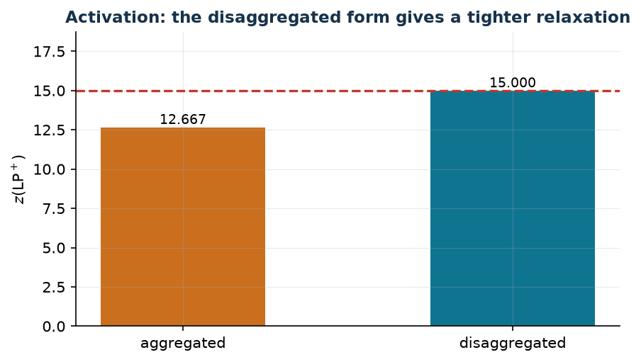

# 3.1 Activation: aggregated and disaggregated form

**Technique:** binary with binary · **Script:** `python/cap03_links.py` · [All the techniques](links.md)

## The link in words

A resource (a machine, a site, a plant) must be **activated** before being used.
The binaries $x_{ij}$ say "object $i$ uses resource $j$", the binaries $y_j$ say
"resource $j$ is activated". We want: if anyone uses $j$, then $j$ is activated.

## The constraints

$$
\begin{aligned}
\text{disaggregated:}\quad x_{ij} &\le y_j, & \forall i,\ \forall j &\qquad (n\,m \text{ constraints}),\\
\text{aggregated:}\quad \sum_{i=1}^{n} x_{ij} &\le n\, y_j, & \forall j &\qquad (m \text{ constraints}).
\end{aligned}
$$

When the resource has a capacity $k_j$ (at most $k_j$ objects), the aggregated
form is written with that coefficient, $\sum_i x_{ij} \le k_j y_j$, and then it
imposes the capacity **as well**: two conditions in one constraint.

## The proof

On binary points the two forms are **equivalent**.

- *Disaggregated $\Rightarrow$ aggregated*: summing $x_{ij} \le y_j$ over $i$
  gives $\sum_i x_{ij} \le n y_j$.
- *Aggregated $\Rightarrow$ disaggregated, on binary points*: if $y_j = 0$, the
  aggregated constraint gives $\sum_i x_{ij} \le 0$ and hence
  $x_{ij} = 0 \le y_j$ for every $i$; if $y_j = 1$, then $x_{ij} \le 1 = y_j$
  because the $x$ are binary.

The second direction uses binarity: **outside** the binary points it does not
hold, and that is exactly what makes the two forms differ in the relaxation.

!!! warning "The converse is not imposed"
    "If $j$ is activated then somebody uses it", that is
    $y_j = 1 \Rightarrow \sum_i x_{ij} \ge 1$, does **not** follow from the
    constraints: $y_j = 1$ with all $x_{ij} = 0$ is feasible in both forms. It
    follows from optimality when activating costs something: if the activation
    cost $f_j$ is **strictly** positive, given an optimal solution with
    $y_j = 1$ and no $x_{ij} = 1$, setting $y_j = 0$ leaves all constraints
    satisfied and reduces the cost by $f_j > 0$ — a contradiction. Hence "in
    every optimum". If instead $f_j = 0$ is allowed, the correct conclusion is
    the weaker "there exists an optimum with $y_j = 0$".

## The strength of the relaxation

Instance: $n = 3$ customers, $m = 2$ sites, activation costs $f = (8, 6)$,
service costs

$$c = \begin{pmatrix} 2 & 5 \\ 4 & 1 \\ 3 & 3\end{pmatrix}.$$

| Formulation | link constraints | $z(\mathrm{LP}^+)$ |
|---|---:|---:|
| aggregated | $m = 2$ | $38/3 \approx 12.67$ |
| disaggregated | $n\,m = 6$ | $15$ |

The integer optimum is $z(\mathrm{MILP}) = 15$: the disaggregated form already
reaches it in the relaxation, the aggregated one stops at $38/3$. More rows,
tighter relaxation: the typical trade-off of this technique.



## In gurobipy, and where it is seen again

```python
m.addConstrs((x[i, j] <= y[j] for i in range(n) for j in range(mm)), name="link")   # disaggregated
m.addConstrs((x.sum("*", j) <= n * y[j] for j in range(mm)), name="link")           # aggregated
```

Seen again in problems [7.2](scheduling-2.md), [7.3](scheduling-3.md),
[7.5](scheduling-5.md) and [8.4](location-4.md), where comparing the two forms
is a modelling question.
