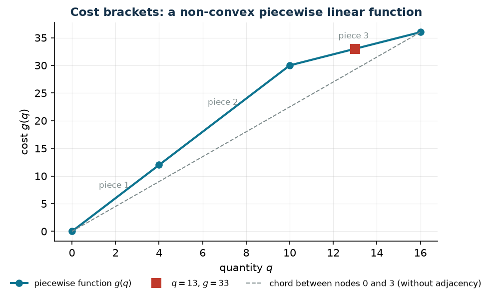

# 3.14 Piecewise linear functions

**Technique:** continuous with piece binaries · **Script:** `python/cap03_links.py` · [All the techniques](links.md)

## The link in words

The cost is not proportional to the quantity: it changes in brackets —
discounts above a threshold, surcharges beyond a capacity, banded tariffs. The
function $g(q)$ is continuous and piecewise linear, with breakpoints
$q_0 < q_1 < \dots < q_p$ and values $g_0, \dots, g_p$.

## The constraints

With $\lambda_k \ge 0$ the weights of the convex combination and
$w_t \in \{0,1\}$ the indicator of piece $t$ (between $q_{t-1}$ and $q_t$):

$$
\begin{aligned}
\sum_{k=0}^{p} \lambda_k &= 1 &&\qquad (1 \text{ constraint}),\\
q = \sum_{k=0}^{p} q_k \lambda_k, \qquad g(q) &= \sum_{k=0}^{p} g_k \lambda_k &&\qquad (2 \text{ constraints}),\\
\sum_{t=1}^{p} w_t &= 1 &&\qquad (1 \text{ constraint}),\\
\lambda_k &\le \!\!\sum_{t \,:\, k \in \{t-1,\,t\}}\!\! w_t, \quad \forall k &&\qquad (p + 1 \text{ constraints}).
\end{aligned}
$$

## The proof

The last group is **adjacency**: $\lambda_k$ can be positive only if the chosen
piece has $q_k$ as an endpoint. Together with $\sum_t w_t = 1$ the piece is
unique, so at most two consecutive $\lambda$ are positive, and then $(q, g(q))$
is a point of the segment between $(q_{t-1}, g_{t-1})$ and $(q_t, g_t)$: that
is, a point **of the graph**. Without adjacency one could mix non-consecutive
nodes, and $(q, g)$ would land in the **lower convex envelope** of the graph —
below the function.

!!! danger "If the function is convex adjacency is superfluous, otherwise it is not"
    When $g$ is convex and one *minimises*, the lower convex envelope coincides
    with the function and the optimal $\lambda$ turn out adjacent automatically:
    the model without binaries is already correct. When $g$ is not convex — the
    case of quantity discounts, where marginal cost *falls* — the difference
    shows immediately. With breakpoints $(0, 4, 10, 16)$, values
    $(0, 12, 30, 36)$ and demand $q \ge 13$:

    | Formulation | optimal value |
    |---|---:|
    | without adjacency (free convex combination) | $117/4 = 29.25$ |
    | with adjacency | $33$ |

    The first mixes nodes $0$ and $3$ (the only nonzero $\lambda$) and returns a
    cost the function **attains nowhere**: it is the value of the envelope, not
    of the graph. The second mixes nodes $2$ and $3$, adjacent, and gives the
    exact value $g(13) = 30 + 6 \cdot \tfrac{3}{6} = 33$.



## The strength of the relaxation

Two things must not be confused: adjacency changes the **integer set** (the two
models have different optima, $29.25$ and $33$), but **not** the strength of the
relaxation — with $w_t$ fractional the adjacency constraint does not bite and
the two models share the same $z(\mathit{LP}^+) = 117/4$.

## In gurobipy, and where it is seen again

```python
m.addConstr(lam.sum() == 1, name="convex")
m.addConstr(q == gp.quicksum(nodes[k] * lam[k] for k in range(K + 1)), name="abscissa")
m.addConstr(w.sum() == 1, name="one_piece")
for k in range(K + 1):                       # adjacency: lambda_k only on the pieces touching k
    m.addConstr(lam[k] <= gp.quicksum(w[t] for t in (k - 1, k) if 0 <= t < K),
                name=f"adjacency{k}")
```

Gurobi also offers `addGenConstrPWL` and SOS2 types, which do the same job
internally; here the manual formulation remains the main material, because it is
the one whose correctness must be provable. Seen again in exercise 10.1 (prizes
with two modes).
