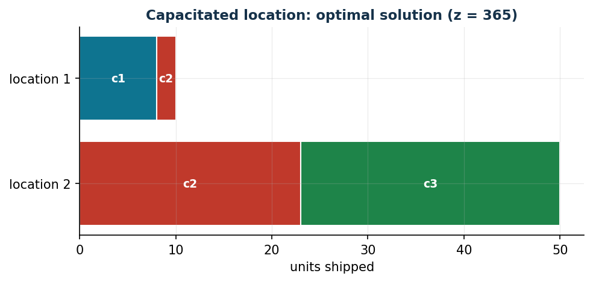

# Capacitated facility location

**Class:** MILP · **Links:** aggregated activation (also the capacity constraint) · **Script:** `python/fam08_1_capacitated.py`

[](https://colab.research.google.com/github/fabiofurini/mip-modelling/blob/main/notebooks/fam08_1_capacitated.ipynb)

!!! abstract "Problem 8.1"
    A company must serve $n \in \mathbb{Z}_{\ge 1}$ clients and has
    identified $m \in \mathbb{Z}_{\ge 1}$ candidate locations. For each
    client $c$, $d_c \in \mathbb{Q}_{>0}$ is the demand in liters. For each
    location $l$ and client $c$, $t_{lc} \in \mathbb{Q}_{>0}$ is the
    transport cost per liter. For each location $l$, $u_l \in
    \mathbb{Q}_{>0}$ is the capacity and $i_l \in \mathbb{Q}_{>0}$ the
    installation cost. We want to decide where to install and how to serve
    clients, at minimum cost.

**The problem in words.** *We decide* where to install facilities and how
much to ship from each location to each client. *The objective*: minimum
total cost (installation plus transport). *The constraints*: an
uninstalled location ships nothing, and an installed one does not exceed
its capacity; demand must be satisfied exactly. The **capacitated facility
location** problem.

## Model

**Data.**

| Symbol | Type | Meaning |
|---|---|---|
| $m$ | $\in \mathbb{Z}_{\ge 1}$ | number of locations, $l \in \{1, 2, \dots, m\}$ |
| $n$ | $\in \mathbb{Z}_{\ge 1}$ | number of clients, $c \in \{1, 2, \dots, n\}$ |
| $t_{lc}$ | $\in \mathbb{Q}_{>0}$ | transport cost from location $l$ to client $c$ |
| $u_l$ | $\in \mathbb{Q}_{>0}$ | capacity of location $l$ |
| $i_l$ | $\in \mathbb{Q}_{>0}$ | installation cost of location $l$ |
| $d_c$ | $\in \mathbb{Q}_{>0}$ | demand of client $c$ |

**Decision variables.** $m$ binaries $x_l$ (location $l$ installed) and
$m\,n$ non-negative continuous $y_{lc}$ (liters shipped from $l$ to $c$):

$$
x_l = \begin{cases} 1 & \text{if location } l \text{ is installed,}\\ 0 & \text{otherwise,}\end{cases}
\qquad y_{lc} = \text{liters shipped from } l \text{ to } c.
$$

MILP model:

$$
\begin{aligned}
\min ~~ \sum_{l=1}^{m} i_l\, x_l + \sum_{l=1}^{m}\sum_{c=1}^{n} t_{lc}\, y_{lc} & & \\
\text{subject to} \quad u_l\, x_l - \sum_{c=1}^{n} y_{lc} &\ge 0, & \forall l \in \{1, 2, \dots, m\}, \\
\sum_{l=1}^{m} y_{lc} &= d_c, & \forall c \in \{1, 2, \dots, n\}, \\
x_l &\in \{0, 1\}, & \forall l \in \{1, 2, \dots, m\}, \\
y_{lc} &\ge 0, & \forall l, c.
\end{aligned}
$$

- the objective minimizes total cost (installation plus transport);
- the first constraint links transport and installation **and** imposes
  capacity ($m$ linear constraints);
- the second satisfies every client's demand ($n$ linear constraints);
- the remaining constraints define the variables.

**The link.** If a positive quantity ships from location $l$, the location
must be installed; from the contrapositive, a closed location ships
nothing. Both directions are imposed directly by the first constraint. The
opposite direction — an installed location ships something — is not
imposed but follows from the objective: since $i_l > 0$, an optimum never
leaves an open location unused. A single family of constraints thus acts
as both the activation link and the capacity constraint.

## The model in gurobipy

```python
mod = gp.Model("capacitated_location")
x = mod.addVars(m, vtype=GRB.BINARY, name="x")
y = mod.addVars(m, n, name="y")
mod.setObjective(gp.quicksum(i[l] * x[l] for l in range(m))
                 + gp.quicksum(t[l][c] * y[l, c] for l in range(m) for c in range(n)), GRB.MINIMIZE)
mod.addConstrs((u[l] * x[l] - gp.quicksum(y[l, c] for c in range(n)) >= 0
                for l in range(m)), name="capacity")
mod.addConstrs((gp.quicksum(y[l, c] for l in range(m)) == d[c] for c in range(n)), name="demand")
```

## The instance

$m = 2$ locations, $n = 3$ clients:

| $t_{lc}$ | $c=1$ | $c=2$ | $c=3$ |
|---|---:|---:|---:|
| $l=1$ | 4 | 5 | 6 |
| $l=2$ | 6 | 4 | 3 |

| | $l=1$ | $l=2$ |
|---|---:|---:|
| $u_l$ | 50 | 50 |
| $i_l$ | 60 | 90 |

| | $c=1$ | $c=2$ | $c=3$ |
|---|---:|---:|---:|
| $d_c$ | 8 | 25 | 27 |

## Constructive heuristic: the primal bound

Locations are scanned in order; for each, clients are shipped the minimum
of residual capacity and residual demand.

Execution: location 1 ships $8$ to client 1, $25$ to client 2, $17$ to
client 3 (capacity exhausted); location 2 ships the remaining $10$ to
client 3. Value: $60+90 + (4{\cdot}8+5{\cdot}25+6{\cdot}17+3{\cdot}10) =
150+289 = 439$. Hence $z(\mathit{MILP}) \le \mathit{UB} = 439$.

## LP relaxation and dual: the dual bound

With $\bar\mu_l = i_l/u_l$ (spreading the fixed cost over capacity) and
$\bar\pi_c = \min_l(t_{lc}+\bar\mu_l)$:

$$
\bar\mu_1 = 6/5,\quad \bar\mu_2 = 9/5,\qquad
\bar\pi_1 = 26/5,\quad \bar\pi_2 = 29/5,\quad \bar\pi_3 = 24/5,
$$

of value $8{\cdot}26/5 + 25{\cdot}29/5 + 27{\cdot}24/5 = 1581/5$. By weak
duality, $\mathit{LB} = 1581/5 \le z(\mathit{LP}) \le z(\mathit{MILP}) \le
\mathit{UB} = 439$.

**What the solver says.** $z(\mathit{LP}) = 1581/5$ exactly: the hand-built
dual solution is already optimal. Strengthening with $x_l \le 1$,
$z(\mathit{LP}^+) = 317$. $z(\mathit{MILP}) = 365$, with both locations
open: location 1 serves client 1 and part of client 2, location 2 the rest
of client 2 and all of client 3. Heuristic gap $20.3\%$.

| $UB$ | $LB$ (dual) | $z(\mathit{LP})$ | $z(\mathit{LP}^+)$ | $z(\mathit{MILP})$ | gap |
|---:|---:|---:|---:|---:|---:|
| 439 | $1581/5$ | $1581/5$ | 317 | 365 | $20.3\%$ |



## Additional considerations

- If $u_l < d_c$ no single location can satisfy client $c$'s demand alone:
  not the case here, but worth checking.
- $y_{lc} \le d_c\, x_l$ is valid but implied jointly by the two
  constraints.

## Additional modelling questions

??? question "8.1.1 — Minimum lot for every open location"
    Every open location must ship at least $5$ liters. How does the model
    change? What is the new optimum?

    !!! tip "Solution"
        The solution is in the solutions document, reserved for instructors.
??? question "8.1.2 — Conditional opening"
    Location 2 can only be installed if location 1 is also installed. How
    is this modelled? What is the new optimum?

    !!! tip "Solution"
        The solution is in the solutions document, reserved for instructors.
## Code

Full script —
[`python/fam08_1_capacitated.py`](https://github.com/fabiofurini/mip-modelling/blob/main/python/fam08_1_capacitated.py)
(reproducible with `python3 python/fam08_1_capacitated.py` from the
`python/` folder). Notebook —
[`notebooks/fam08_1_capacitated.ipynb`](https://github.com/fabiofurini/mip-modelling/blob/main/notebooks/fam08_1_capacitated.ipynb)
— opens in Colab from the badge at the top of the page.

<!-- embedded-script: begin (regenerated by python/embed_code.py) -->

??? example "Show the complete script — `python/fam08_1_capacitated.py` (160 lines)"

    ```python
    """Problem 8.1 -- Capacitated facility location (minimum cost).

    Aggregated activation link between the binary variable x_l (open location l)
    and the continuous flow variables y_lc: the link is proved in both
    directions exactly as in problem 7.2, but here the link constraint is also a
    capacity constraint (one single family of constraints does both jobs).
    """
    import gurobipy as gp
    import pandas as pd
    from gurobipy import GRB

    from mip import (ammissibile, due_rilassamenti, frazione, nuovo_modello,
                     registra_bound, risolvi, stampa_soluzione, valuta)
    from stile import CICLO, intestazione, plt, salva_dati, salva_figura

    R = range

    # ---------- 1. MODEL AND INSTANCE ----------

    intestazione("1. Capacitated facility location: where to open, how much to ship")
    t1 = [[4, 5, 6], [6, 4, 3]]      # transport cost location l -> client c
    u1 = [50, 50]                    # capacity of each location
    i1 = [60, 90]                    # opening cost
    d1 = [8, 25, 27]                 # client demand
    m, n = 2, 3
    salva_dati(pd.DataFrame([{"location": l + 1, "client": c + 1, "t": t1[l][c]}
                             for l in R(m) for c in R(n)]), "loc1_costi")
    salva_dati(pd.DataFrame({"location": R(1, m + 1), "u": u1, "i": i1}), "loc1_sedi")
    salva_dati(pd.DataFrame({"client": R(1, n + 1), "d": d1}), "loc1_clienti")


    def modello_1(t, u, i, d):
        m, n = len(u), len(d)
        mod = nuovo_modello("capacitated_location")
        x = mod.addVars(m, vtype=GRB.BINARY, name="x")
        y = mod.addVars(m, n, name="y")
        mod.setObjective(gp.quicksum(i[l] * x[l] for l in R(m))
                          + gp.quicksum(t[l][c] * y[l, c] for l in R(m) for c in R(n)), GRB.MINIMIZE)
        mod.addConstrs((u[l] * x[l] - gp.quicksum(y[l, c] for c in R(n)) >= 0 for l in R(m)),
                       name="capacity")
        mod.addConstrs((gp.quicksum(y[l, c] for l in R(m)) == d[c] for c in R(n)), name="demand")
        return mod, x, y


    def duale_1(t, u, i, d):
        """min sum d_c pi_c;  u_l mu_l <= i_l;  -mu_l + pi_c <= t_lc;  mu >= 0, pi free."""
        m, n = len(u), len(d)
        dl = nuovo_modello("duale_location")
        mu = dl.addVars(m, name="mu")
        pi = dl.addVars(n, lb=-GRB.INFINITY, name="pi")
        dl.setObjective(gp.quicksum(d[c] * pi[c] for c in R(n)), GRB.MAXIMIZE)
        dl.addConstrs((u[l] * mu[l] <= i[l] for l in R(m)), name="rc_x")
        dl.addConstrs((-mu[l] + pi[c] <= t[l][c] for l in R(m) for c in R(n)), name="rc_y")
        return dl


    m1, x1, y1 = modello_1(t1, u1, i1, d1)

    # ---------- 2. CONSTRUCTIVE HEURISTIC (UPPER BOUND) ----------

    print("Heuristic: locations are scanned in order, filling each client's residual demand")
    print("with each location's residual capacity, without exceeding either one.")


    def euristica_1(t, u, i, d):
        m, n = len(u), len(d)
        y, x, rc, rd, passi = {}, [0] * m, list(u), list(d), []
        for l in R(m):
            for c in R(n):
                if rd[c] > 0 and rc[l] > 0:
                    q = min(rd[c], rc[l])
                    y[(l, c)] = q
                    rd[c] -= q
                    rc[l] -= q
                    passi.append(f"Location {l + 1}, client {c + 1}: ship min(rd={rd[c] + q}, rc={rc[l] + q}) = {q}; "
                                 f"rd[{c + 1}] = {rd[c]}, rc[{l + 1}] = {rc[l]}.")
            if rc[l] < u[l]:
                x[l] = 1
                passi.append(f"Location {l + 1} shipped something (rc = {rc[l]} < u = {u[l]}): it opens, x[{l + 1}] = 1.")
        ok = all(v == 0 for v in rd)
        return x, y, passi, ok


    xe, ye, passi, ok = euristica_1(t1, u1, i1, d1)
    for i, s in enumerate(passi, 1):
        print(f"  Step {i}. {s}")
    assert ok, "heuristic infeasible: demand not satisfied"
    ub1 = sum(i1[l] * xe[l] for l in R(m)) + sum(t1[l][c] * ye.get((l, c), 0) for l in R(m) for c in R(n))
    sol_eur = {f"x[{l}]": xe[l] for l in R(m)}
    sol_eur.update({f"y[{l},{c}]": v for (l, c), v in ye.items()})
    assert ammissibile(m1, sol_eur)
    print(f"  ub = {ub1}")

    # ---------- 3. LP RELAXATION AND DUAL (LOWER BOUND) ----------

    d1_ = duale_1(t1, u1, i1, d1)
    mano = {f"mu[{l}]": i1[l] / u1[l] for l in R(m)}
    mano.update({f"pi[{c}]": min(t1[l][c] + mano[f"mu[{l}]"] for l in R(m)) for c in R(n)})
    lb1, viol = valuta(d1_, mano)
    assert viol <= 1e-9, viol
    print("Hand-built dual solution: mu_l = i_l/u_l = " + ", ".join(frazione(i1[l] / u1[l]) for l in R(m))
          + ";  pi_c = min_l (t_lc + mu_l) = " + ", ".join(frazione(mano[f"pi[{c}]"]) for c in R(n))
          + f"  ->  lb = {frazione(lb1)}")
    zlp1, zlp1r, _ = due_rilassamenti(m1, d1_)

    # ---------- 4. OPTIMAL SOLUTION OF THE MILP ----------

    z1 = risolvi(m1)
    print("Optimal solution of the MILP:")
    stampa_soluzione(m1, solo_non_nulle=True)
    riga = registra_bound("1 capacitated location", ub1, lb1, zlp1, zlp1r, z1)
    salva_dati(pd.DataFrame([riga]), "loc1_bound")

    # ---------- 5. ADDITIONAL MODELLING QUESTIONS ----------

    varianti = {}


    def variante(nome, mod):
        z = risolvi(mod)
        print(f"  {nome:70s} z = {frazione(z)}")
        return z


    # 1a: every open location must ship at least 5 units (minimum lot / semi-continuous)
    mod, x, y = modello_1(t1, u1, i1, d1)
    mod.addConstrs((gp.quicksum(y[l, c] for c in R(n)) >= 5 * x[l] for l in R(m)), name="minimum_lot")
    varianti["1a"] = variante("1a. Every open location ships at least 5 units (sum_c y_lc >= 5 x_l)", mod)
    # 1b: location 2 opens only if location 1 opens
    mod, x, y = modello_1(t1, u1, i1, d1)
    mod.addConstr(x[1] <= x[0], name="2_only_if_1")
    varianti["1b"] = variante("1b. Location 2 opens only if location 1 opens (x_2 <= x_1)", mod)
    salva_dati(pd.DataFrame({"variant": list(varianti), "z": list(varianti.values())}), "loc1_varianti")

    # ---------- 6. FIGURES ----------


    def barre_flusso(y, m, n, titolo, nome):
        """For each location, a stacked bar of the units shipped to each client."""
        fig, ax = plt.subplots(figsize=(7.2, 3.0))
        for l in R(m):
            inizio = 0
            for c in R(n):
                q = y.get((l, c), 0)
                if q > 0:
                    ax.barh(l, q, left=inizio, color=CICLO[c % len(CICLO)], edgecolor="white")
                    ax.text(inizio + q / 2, l, f"c{c + 1}", ha="center", va="center", color="white",
                            fontsize=9, fontweight="bold")
                    inizio += q
        ax.set_yticks(R(m))
        ax.set_yticklabels([f"location {l + 1}" for l in R(m)])
        ax.set_xlabel("units shipped")
        ax.set_title(titolo)
        ax.invert_yaxis()
        salva_figura(fig, nome)


    ott_y = {(l, c): y1[l, c].X for l in R(m) for c in R(n) if y1[l, c].X > 1e-6}
    barre_flusso(ott_y, m, n, f"Capacitated location: optimal solution (z = {frazione(z1)})", "cap08_capacitata_ottimo")
    print("Fine.")
    ```

<!-- embedded-script: end -->
