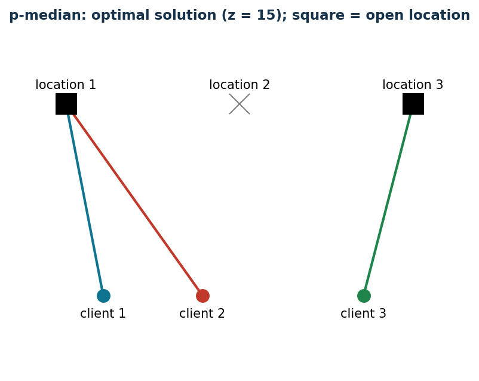

# p-median: at most $k$ locations

**Class:** BIP · **Links:** disaggregated activation · **Script:** `python/fam08_2_pmedian.py`

[](https://colab.research.google.com/github/fabiofurini/mip-modelling/blob/main/notebooks/fam08_2_pmedian.ipynb)

!!! abstract "Problem 8.2"
    A company must choose at most $k \in \mathbb{Z}_{\ge 1}$ locations,
    among $m \in \mathbb{Z}_{\ge 1}$ candidates, and assign each of the
    $n \in \mathbb{Z}_{\ge 1}$ clients to the most convenient open
    location. For each location $l$ and client $c$, $d_{lc} \in
    \mathbb{Q}_{>0}$ is the distance. We want to minimize the sum of
    client-location distances.

**The problem in words.** *We decide* which locations to open (at most
$k$) and which open location to assign each client to. *The objective*:
minimum sum of distances. *The constraints*: every client to exactly one
open location; at most $k$ open locations. The classic **p-median**
problem.

## Model

**Data.**

| Symbol | Type | Meaning |
|---|---|---|
| $m$ | $\in \mathbb{Z}_{\ge 1}$ | number of locations, $l \in \{1, 2, \dots, m\}$ |
| $n$ | $\in \mathbb{Z}_{\ge 1}$ | number of clients, $c \in \{1, 2, \dots, n\}$ |
| $d_{lc}$ | $\in \mathbb{Q}_{>0}$ | distance between location $l$ and client $c$ |
| $k$ | $\in \mathbb{Z}_{\ge 1}$ | maximum number of open locations |

**Decision variables.** $m$ binaries $x_l$ (location open) and $m\,n$
binaries $y_{lc}$ (client $c$ served by $l$).

$$
\begin{aligned}
\min ~~ \sum_{l=1}^{m}\sum_{c=1}^{n} d_{lc}\, y_{lc} & & \\
\text{subject to} \quad \sum_{l=1}^{m} y_{lc} &= 1, & \forall c, \\
\sum_{l=1}^{m} x_l &\le k, & \\
x_l - y_{lc} &\ge 0, & \forall l, c, \\
x_l, y_{lc} &\in \{0, 1\}. & &
\end{aligned}
$$

- the objective minimizes the sum of client-location distances;
- the first constraint assigns every client to one location ($n$ constraints);
- the second caps open locations at $k$ (one constraint);
- the third links assignment and opening, in **disaggregated** form
  ($m\,n$ constraints).

**The link.** If $y_{lc}=1$ then $x_l=1$: from the CNF of $y_{lc}
\Rightarrow x_l$, i.e. $\neg y_{lc} \lor x_l$, we get $x_l \ge y_{lc}$,
imposed directly. Unlike problem 8.1, there is no opening cost that would
discourage open-but-unused locations: the opposite direction is neither
imposed nor guaranteed by optimality.

## The model in gurobipy

```python
mod = gp.Model("p_median")
x = mod.addVars(m, vtype=GRB.BINARY, name="x")
y = mod.addVars(m, n, vtype=GRB.BINARY, name="y")
mod.setObjective(gp.quicksum(dist[l][c] * y[l, c] for l in range(m) for c in range(n)), GRB.MINIMIZE)
mod.addConstrs((y.sum("*", c) == 1 for c in range(n)), name="assign")
mod.addConstr(x.sum() <= k, name="number_of_locations")
mod.addConstrs((x[l] - y[l, c] >= 0 for l in range(m) for c in range(n)), name="link")
```

## The instance

$m = 3$ locations, $n = 3$ clients, $k = 2$:

| $d_{lc}$ | $c=1$ | $c=2$ | $c=3$ |
|---|---:|---:|---:|
| $l=1$ | 5 | 6 | 10 |
| $l=2$ | 3 | 12 | 9 |
| $l=3$ | 10 | 9 | 4 |

## Constructive heuristic: upper bound

The first $k$ locations open; every client goes to the nearest open
location. Opening locations 1 and 2: client 1 → location 2 (dist. 3),
client 2 → location 1 (dist. 6), client 3 → location 2 (dist. 9). Value
$3+6+9=18$: $z(\mathrm{MILP}) \le \mathrm{ub} = 18$.

## LP relaxation and dual: lower bound

With $\bar\varrho=0$, $\bar\pi_{lc}=0$ and $\bar\mu_c = \min_l d_{lc}$
(the distance to the nearest location overall):

$$
\bar\mu_1 = 3,\quad \bar\mu_2 = 6,\quad \bar\mu_3 = 4,
$$

of value $13$. By weak duality, $\mathrm{lb}=13 \le z(\mathrm{LP}) \le
z(\mathrm{MILP}) \le \mathrm{ub}=18$.

**What the solver says.** $z(\mathrm{LP}) = z(\mathrm{LP}^+) = 15$: the
relaxation is already integral on this instance. $z(\mathrm{MILP}) = 15$,
with locations 1 and 3 open (not 1 and 2 as in the heuristic): heuristic
gap $20.0\%$.

| $\mathrm{ub}$ | $\mathrm{lb}$ (dual) | $z(\mathrm{LP})$ | $z(\mathrm{LP}^+)$ | $z(\mathrm{MILP})$ | gap |
|---:|---:|---:|---:|---:|---:|
| 18 | 13 | 15 | 15 | 15 | $20.0\%$ |



## Additional considerations

- The constraint is "at most $k$", not "exactly $k$": question 8.2.1
  checks that the optimum does not change when equality is imposed.
- $\sum_c y_{lc} \le n\, x_l$ is an aggregated valid inequality, weaker
  than the disaggregated one used in the model.

## Additional modelling questions

??? question "8.2.1 — Exactly $k$ open locations"
    Exactly $k$ locations must be open. How does the model change? What
    is the new optimum?

    ??? success "Solution"
        $\sum_l x_l \ge k$, which together with the existing constraint
        imposes equality. The optimum already opens $2=k$ locations: it
        stays $15$.

??? question "8.2.2 — Proximity coverage for one client"
    Client 1 must be served within distance $4$. How is this modelled?
    What is the new optimum?

    ??? success "Solution"
        $y_{l1} = 0$ for every location with $d_{l1} > 4$ (here only
        location 3). New optimum $16$: it becomes convenient to open
        location 2 (dist. 3) instead of location 1, with location 3 also
        absorbing client 2: $\tilde x_2 = \tilde x_3 = 1$, value
        $3+9+4=16$.

## Code

Full script —
[`python/fam08_2_pmedian.py`](https://github.com/fabiofurini/mip-modelling/blob/main/python/fam08_2_pmedian.py)
(reproducible with `python3 python/fam08_2_pmedian.py` from the `python/`
folder). Notebook —
[`notebooks/fam08_2_pmedian.ipynb`](https://github.com/fabiofurini/mip-modelling/blob/main/notebooks/fam08_2_pmedian.ipynb)
— opens in Colab from the badge at the top of the page.
