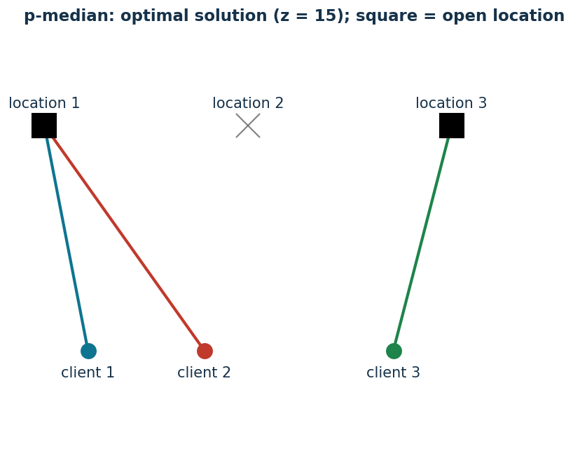

# p-median: at most $k$ locations

**Class:** BIP · **Links:** disaggregated activation · **Script:** `python/fam08_2_pmedian.py`<br>
**Difficulty:** ★★☆☆☆ · **Time:** 30–45 min
{ .scheda }

[](https://colab.research.google.com/github/fabiofurini/mip-modelling/blob/main/notebooks/fam08_2_pmedian.ipynb)

!!! abstract "Problem 8.2"
    A company must choose at most $k \in \mathbb{Z}_{\ge 1}$ locations,
    among $m \in \mathbb{Z}_{\ge 1}$ candidates, and assign each of the
    $n \in \mathbb{Z}_{\ge 1}$ clients to the most convenient open
    location. For each location $l$ and client $c$, $d_{lc} \in
    \mathbb{Q}_{>0}$ is the distance. We want to minimize the sum of
    client-location distances.

**The problem in words.** *We decide* which locations to open (at most
$k$) and which open location to assign each client to. *The objective*:
minimum sum of distances. *The constraints*: every client to exactly one
open location; at most $k$ open locations. The classic **p-median**
problem.

## Model

**Data.**

| Symbol | Type | Meaning |
|---|---|---|
| $m$ | $\in \mathbb{Z}_{\ge 1}$ | number of locations, $l \in \{1, 2, \dots, m\}$ |
| $n$ | $\in \mathbb{Z}_{\ge 1}$ | number of clients, $c \in \{1, 2, \dots, n\}$ |
| $d_{lc}$ | $\in \mathbb{Q}_{>0}$ | distance between location $l$ and client $c$ |
| $k$ | $\in \mathbb{Z}_{\ge 1}$ | maximum number of open locations |

**Decision variables.** $m$ binaries $x_l$ (location open) and $m\,n$
binaries $y_{lc}$ (client $c$ served by $l$).

<!-- model: 8.2 -->

$$
\begin{aligned}
\min ~~ \sum_{l=1}^{m}\sum_{c=1}^{n} d_{lc}\, y_{lc} & & \\
\text{subject to} \quad \sum_{l=1}^{m} y_{lc} &= 1, & \forall c \in \{1, 2, \dots, n\}, \\
\sum_{l=1}^{m} x_l &\le k, & & \\
x_l - y_{lc} &\ge 0, & \forall l \in \{1, 2, \dots, m\},\ \forall c \in \{1, 2, \dots, n\}, \\
x_l &\in \{0, 1\}, & \forall l \in \{1, 2, \dots, m\}, \\
y_{lc} &\in \{0, 1\}, & \forall l \in \{1, 2, \dots, m\},\ \forall c \in \{1, 2, \dots, n\}.
\end{aligned}
$$

<!-- model: end -->

- the objective minimizes the sum of client-location distances;
- the first constraint assigns every client to one location ($n$ constraints);
- the second caps open locations at $k$ (one constraint);
- the third links assignment and opening, in **disaggregated** form
  ($m\,n$ constraints).

**The link.** If $y_{lc}=1$ then $x_l=1$: from the CNF of $y_{lc}
\Rightarrow x_l$, i.e. $\neg y_{lc} \lor x_l$, we get $x_l \ge y_{lc}$,
imposed directly. Unlike problem 8.1, there is no opening cost that would
discourage open-but-unused locations: the opposite direction is neither
imposed nor guaranteed by optimality.

## The model in gurobipy

```python
mod = gp.Model("p_median")
x = mod.addVars(m, vtype=GRB.BINARY, name="x")
y = mod.addVars(m, n, vtype=GRB.BINARY, name="y")
mod.setObjective(gp.quicksum(dist[l][c] * y[l, c] for l in range(m) for c in range(n)), GRB.MINIMIZE)
mod.addConstrs((y.sum("*", c) == 1 for c in range(n)), name="assign")
mod.addConstr(x.sum() <= k, name="number_of_locations")
mod.addConstrs((x[l] - y[l, c] >= 0 for l in range(m) for c in range(n)), name="link")
```

## The instance

$m = 3$ locations, $n = 3$ clients, $k = 2$:

| $d_{lc}$ | $c=1$ | $c=2$ | $c=3$ |
|---|---:|---:|---:|
| $l=1$ | 5 | 6 | 10 |
| $l=2$ | 3 | 12 | 9 |
| $l=3$ | 10 | 9 | 4 |

The model written on the data of the instance:

<!-- modello-esteso: fam08_2_primale -->

<div class="modello-esteso largo" markdown>

$$
\begin{array}{rrrrrrrrrrrrr c l}
\min &  &  &  & 5y_{11} & +6y_{12} & +10y_{13} & +3y_{21} & +12y_{22} & +9y_{23} & +10y_{31} & +9y_{32} & +4y_{33} &  & \\
\text{subject to} &  &  &  & y_{11} &  &  & +y_{21} &  &  & +y_{31} &  &  & = & 1\\
 &  &  &  &  & y_{12} &  &  & +y_{22} &  &  & +y_{32} &  & = & 1\\
 &  &  &  &  &  & y_{13} &  &  & +y_{23} &  &  & +y_{33} & = & 1\\
 & x_1 & +x_2 & +x_3 &  &  &  &  &  &  &  &  &  & \le & 2\\
 & x_1 &  &  & -y_{11} &  &  &  &  &  &  &  &  & \ge & 0\\
 & x_1 &  &  &  & -y_{12} &  &  &  &  &  &  &  & \ge & 0\\
 & x_1 &  &  &  &  & -y_{13} &  &  &  &  &  &  & \ge & 0\\
 &  & x_2 &  &  &  &  & -y_{21} &  &  &  &  &  & \ge & 0\\
 &  & x_2 &  &  &  &  &  & -y_{22} &  &  &  &  & \ge & 0\\
 &  & x_2 &  &  &  &  &  &  & -y_{23} &  &  &  & \ge & 0\\
 &  &  & x_3 &  &  &  &  &  &  & -y_{31} &  &  & \ge & 0\\
 &  &  & x_3 &  &  &  &  &  &  &  & -y_{32} &  & \ge & 0\\
 &  &  & x_3 &  &  &  &  &  &  &  &  & -y_{33} & \ge & 0\\
 & x_1, & x_2, & x_3 &  &  &  &  &  &  &  &  &  & \in & \{0, 1\}\\
 &  &  &  & y_{11}, & y_{12}, & y_{13}, & y_{21}, & y_{22}, & y_{23}, & y_{31}, & y_{32}, & y_{33} & \in & \{0, 1\}
\end{array}
$$

</div>

<!-- modello-esteso: fine -->

## Constructive heuristic: the primal bound

The first $k$ locations open; every client goes to the nearest open
location. Opening locations 1 and 2: client 1 → location 2 (dist. 3),
client 2 → location 1 (dist. 6), client 3 → location 2 (dist. 9). Value
$3+6+9=18$: $z(\mathit{MILP}) \le \mathit{UB} = 18$.

## LP relaxation and dual: the dual bound

The dual of the linear relaxation, one variable per constraint of the primal:

<!-- model: 8.2-dual -->

$$
\begin{aligned}
\max ~~ \sum_{c=1}^{n} \mu_c + k\, \varrho & & \\
\text{subject to} \quad \varrho + \sum_{c=1}^{n} \pi_{lc} &\le 0, & \forall l \in \{1, 2, \dots, m\}, \\
\mu_c - \pi_{lc} &\le d_{lc}, & \forall l \in \{1, 2, \dots, m\},\ \forall c \in \{1, 2, \dots, n\}, \\
\mu_c &\gtreqless 0, & \forall c \in \{1, 2, \dots, n\}, \\
\varrho &\le 0, & & \\
\pi_{lc} &\ge 0, & \forall l \in \{1, 2, \dots, m\},\ \forall c \in \{1, 2, \dots, n\}.
\end{aligned}
$$

<!-- model: end -->

The same dual, written on the data of the instance:

<!-- modello-esteso: fam08_2_duale -->

<div class="modello-esteso largo" markdown>

$$
\begin{array}{rrrrrrrrrrrrrr c l}
\max & \mu_1 & +\mu_2 & +\mu_3 & +2\varrho &  &  &  &  &  &  &  &  &  &  & \\
\text{subject to} &  &  &  & \varrho & +\pi_{11} & +\pi_{12} & +\pi_{13} &  &  &  &  &  &  & \le & 0\\
 &  &  &  & \varrho &  &  &  & +\pi_{21} & +\pi_{22} & +\pi_{23} &  &  &  & \le & 0\\
 &  &  &  & \varrho &  &  &  &  &  &  & +\pi_{31} & +\pi_{32} & +\pi_{33} & \le & 0\\
 & \mu_1 &  &  &  & -\pi_{11} &  &  &  &  &  &  &  &  & \le & 5\\
 &  & \mu_2 &  &  &  & -\pi_{12} &  &  &  &  &  &  &  & \le & 6\\
 &  &  & \mu_3 &  &  &  & -\pi_{13} &  &  &  &  &  &  & \le & 10\\
 & \mu_1 &  &  &  &  &  &  & -\pi_{21} &  &  &  &  &  & \le & 3\\
 &  & \mu_2 &  &  &  &  &  &  & -\pi_{22} &  &  &  &  & \le & 12\\
 &  &  & \mu_3 &  &  &  &  &  &  & -\pi_{23} &  &  &  & \le & 9\\
 & \mu_1 &  &  &  &  &  &  &  &  &  & -\pi_{31} &  &  & \le & 10\\
 &  & \mu_2 &  &  &  &  &  &  &  &  &  & -\pi_{32} &  & \le & 9\\
 &  &  & \mu_3 &  &  &  &  &  &  &  &  &  & -\pi_{33} & \le & 4\\
 & \mu_1, & \mu_2, & \mu_3 &  &  &  &  &  &  &  &  &  &  & \gtreqless & 0\\
 &  &  &  & \varrho &  &  &  &  &  &  &  &  &  & \le & 0\\
 &  &  &  &  & \pi_{11}, & \pi_{12}, & \pi_{13}, & \pi_{21}, & \pi_{22}, & \pi_{23}, & \pi_{31}, & \pi_{32}, & \pi_{33} & \ge & 0
\end{array}
$$

</div>

<!-- modello-esteso: fine -->


With $\bar\varrho=0$, $\bar\pi_{lc}=0$ and $\bar\mu_c = \min_l d_{lc}$
(the distance to the nearest location overall):

$$
\bar\mu_1 = 3,\quad \bar\mu_2 = 6,\quad \bar\mu_3 = 4,
$$

of value $13$. By weak duality, $\mathit{LB}=13 \le z(\mathit{LP}) \le
z(\mathit{MILP}) \le \mathit{UB}=18$.

**What the solver says.** $z(\mathit{LP}) = z(\mathit{LP}^+) = 15$: the
relaxation is already integral on this instance. $z(\mathit{MILP}) = 15$,
with locations 1 and 3 open (not 1 and 2 as in the heuristic): heuristic
gap $20.0\%$.

| $UB$ | $LB$ (dual) | $z(\mathit{LP})$ | $z(\mathit{LP}^+)$ | $z(\mathit{MILP})$ | heuristic gap |
|---:|---:|---:|---:|---:|---:|
| 18 | 13 | 15 | 15 | 15 | $20.0\%$ |



## Additional considerations

- The constraint is "at most $k$", not "exactly $k$": question 8.2.1
  checks that the optimum does not change when equality is imposed.
- $\sum_c y_{lc} \le n\, x_l$ is an aggregated valid inequality, weaker
  than the disaggregated one used in the model.

## Additional modelling questions

??? question "8.2.1 — Exactly $k$ open locations"
    Exactly $k$ locations must be open. How does the model change? What
    is the new optimum?

??? question "8.2.2 — Proximity coverage for one client"
    Client 1 must be served within distance $4$. How is this modelled?
    What is the new optimum?

## The sandwich on variant 2a

The algebra settles it in one line: the column of the $x_l$ imposes
$\varrho + \sigma \le 0$, and the objective contains $k(\varrho + \sigma)$, never
positive. Imposing **exactly** $k$ sites instead of **at most** $k$ does not move
the relaxation --- and here it does not move the integer optimum either, which
stays $15$. That is not an accident of the instance: with no opening cost one
more site cannot worsen the assignment, so from a solution with fewer than $k$
sites one always gets an equally good one with exactly $k$. The equality
constraint is redundant; it bites only when opening costs something.

<!-- tabella-variante: fam08_2a_bound -->

|  | value | what it is |
|---|---:|---|
| $\mathit{UB}$ | $18$ | heuristic solution |
| $\mathit{LB}$ | $13$ | dual certificate built by hand |
| $z(\mathit{LP})$ | $15$ | relaxation without the bounds |
| $z(\mathit{LP}^+)$ | $15$ | relaxation with the bounds |
| $z(\mathit{MILP})$ | $15$ | optimum of the MILP |

<!-- tabella-variante: fine -->

## Code

Full script —
[`python/fam08_2_pmedian.py`](https://github.com/fabiofurini/mip-modelling/blob/main/python/fam08_2_pmedian.py)
(reproducible with `python3 python/fam08_2_pmedian.py` from the `python/`
folder). Notebook —
[`notebooks/fam08_2_pmedian.ipynb`](https://github.com/fabiofurini/mip-modelling/blob/main/notebooks/fam08_2_pmedian.ipynb)
— opens in Colab from the badge at the top of the page.

<!-- embedded-script: begin (regenerated by python/embed_code.py) -->

??? example "Show the complete script — `python/fam08_2_pmedian.py` (211 lines)"

    ```python
    """Problem 8.2 -- Location with a maximum number of facilities (p-median).

    Disaggregated activation link between x_l (location open) and y_lc (client c
    served by l), derived from the CNF of a Boolean implication as in problem
    7.5, but here the number of open locations is bounded by k rather than by a
    time budget.
    """
    import gurobipy as gp
    import pandas as pd
    from gurobipy import GRB

    from mip import (ammissibile, dualita_forte, due_rilassamenti, frazione,
                     nuovo_modello, registra_bound, rilassamenti, risolvi,
                     stampa_soluzione, valuta)
    from stile import CICLO, intestazione, plt, salva_dati, salva_figura
    from esteso import salva_modello

    R = range

    # ---------- 1. MODEL AND INSTANCE ----------

    intestazione("2. p-median: at most k locations, every client served by the nearest open one")
    dist2 = [[5, 6, 10], [3, 12, 9], [10, 9, 4]]   # distance location l -> client c
    k2 = 2
    m, n = 3, 3
    salva_dati(pd.DataFrame([{"location": l + 1, "client": c + 1, "d": dist2[l][c]}
                             for l in R(m) for c in R(n)]), "fam08_2_distanze")


    def modello_2(dist, k):
        m, n = len(dist), len(dist[0])
        mod = nuovo_modello("p_median")
        x = mod.addVars(m, vtype=GRB.BINARY, name="x")
        y = mod.addVars(m, n, vtype=GRB.BINARY, name="y")
        mod.setObjective(gp.quicksum(dist[l][c] * y[l, c] for l in R(m) for c in R(n)), GRB.MINIMIZE)
        mod.addConstrs((y.sum("*", c) == 1 for c in R(n)), name="assign")
        mod.addConstr(x.sum() <= k, name="number_of_locations")
        mod.addConstrs((x[l] - y[l, c] >= 0 for l in R(m) for c in R(n)), name="link")
        return mod, x, y


    def duale_2(dist, k):
        """max sum mu_c + k varrho;  varrho + sum_c pi_lc <= 0;  mu_c - pi_lc <= d_lc;
        mu free, varrho <= 0, pi >= 0."""
        m, n = len(dist), len(dist[0])
        dl = nuovo_modello("duale_p_median")
        mu = dl.addVars(n, lb=-GRB.INFINITY, name="mu")
        varrho = dl.addVar(lb=-GRB.INFINITY, ub=0.0, name="varrho")
        pi = dl.addVars(m, n, name="pi")
        dl.setObjective(mu.sum() + k * varrho, GRB.MAXIMIZE)
        dl.addConstrs((varrho + gp.quicksum(pi[l, c] for c in R(n)) <= 0 for l in R(m)), name="rc_x")
        dl.addConstrs((mu[c] - pi[l, c] <= dist[l][c] for l in R(m) for c in R(n)), name="rc_y")
        return dl


    m2, x2, y2 = modello_2(dist2, k2)
    salva_modello(m2, "fam08_2_primale")

    # ---------- 2. THE LP RELAXATION ----------
    zlp2, zlp2r, _ = rilassamenti(m2)

    # ---------- 3. THE DUAL OF THE RELAXATION (LOWER BOUND) ----------

    d2 = duale_2(dist2, k2)
    salva_modello(d2, "fam08_2_duale")
    mano = {"varrho": 0.0}
    mano.update({f"mu[{c}]": min(dist2[l][c] for l in R(m)) for c in R(n)})
    lb2, viol = valuta(d2, mano)
    assert viol <= 1e-9, viol
    print("Hand-built dual solution: pi = 0, varrho = 0, mu_c = min_l d_lc = "
          + ", ".join(frazione(mano[f"mu[{c}]"]) for c in R(n)) + f"  ->  lb = {frazione(lb2)}")
    dualita_forte(d2, zlp2)

    # ---------- 4. CONSTRUCTIVE HEURISTIC (UPPER BOUND) ----------

    print("Heuristic: the first k locations are opened in natural order, then every client")
    print("is served by the nearest open location.")


    def euristica_2(dist, k):
        m, n = len(dist), len(dist[0])
        x = [1 if l < k else 0 for l in R(m)]
        y, passi = {}, []
        for c in R(n):
            md, sl = float("inf"), None
            for l in R(k):
                if dist[l][c] < md:
                    md, sl = dist[l][c], l
            y[(sl, c)] = 1
            passi.append(f"Client {c + 1}: the nearest open location is {sl + 1} (distance {md}); "
                         f"y[{sl + 1}][{c + 1}] = 1.")
        return x, y, passi


    xe, ye, passi = euristica_2(dist2, k2)
    print(f"  The first k = {k2} locations are opened: x = {xe}.")
    for i, s in enumerate(passi, 1):
        print(f"  Step {i}. {s}")
    ub2 = sum(dist2[l][c] for (l, c) in ye)
    print(f"  ub = {ub2}")

    # ---------- 5. OPTIMAL SOLUTION OF THE MILP ----------

    z2 = risolvi(m2)
    print("Optimal solution of the MILP:")
    stampa_soluzione(m2, solo_non_nulle=True)
    riga = registra_bound("2 p-median", ub2, lb2, zlp2, zlp2r, z2)
    salva_dati(pd.DataFrame([riga]), "fam08_2_bound")

    # ---------- 6. ADDITIONAL MODELLING QUESTIONS ----------

    varianti = {}


    def variante(nome, mod):
        z = risolvi(mod)
        print(f"  {nome:70s} z = {frazione(z)}")
        return z


    # 2a: exactly k locations must be open (not at most k)
    mod, x, y = modello_2(dist2, k2)
    mod.addConstr(x.sum() >= k2, name="number_of_locations_exact")   # with "<= k" already in the model, together they impose "= k"
    varianti["2a"] = variante("2a. Exactly k open locations (sum x_l = k)", mod)
    # 2b: client 1 must be served within distance 4 (additional coverage)
    mod, x, y = modello_2(dist2, k2)
    mod.addConstrs((y[l, 0] == 0 for l in R(3) if dist2[l][0] > 4), name="max_distance_client1")
    varianti["2b"] = variante("2b. Client 1 served within distance 4 (y_l1 = 0 if d_l1 > 4)", mod)
    salva_dati(pd.DataFrame({"variant": list(varianti), "z": list(varianti.values())}), "fam08_2_varianti")

    # ---------- 7. THE SANDWICH ON THE VARIANT 2a ----------
    intestazione("2a. The sandwich on the variant: exactly k sites open")


    def modello_2a(dist, k):
        mod_, xx, yy = modello_2(dist, k)
        mod_.addConstr(xx.sum() >= k, name="numero_sedi_esatto")
        return mod_, xx, yy


    def duale_2a(dist, k):
        """To the dual of 8.2 one adds sigma >= 0 for the constraint sum_l x_l >= k
        (a >= direction in a minimisation). The right-hand side is k, so sigma
        enters the objective next to varrho, and the column of the x_l next to it."""
        mm, nn = len(dist), len(dist[0])
        dl = nuovo_modello("duale_p_mediana_2a")
        mu = dl.addVars(nn, lb=-GRB.INFINITY, name="mu")
        varrho = dl.addVar(lb=-GRB.INFINITY, ub=0.0, name="varrho")
        sg = dl.addVar(name="sigma")
        pi = dl.addVars(mm, nn, name="pi")
        dl.setObjective(mu.sum() + k * varrho + k * sg, GRB.MAXIMIZE)
        dl.addConstrs((varrho + sg + gp.quicksum(pi[l, c] for c in R(nn)) <= 0 for l in R(mm)),
                      name="rc_x")
        dl.addConstrs((mu[c] - pi[l, c] <= dist[l][c] for l in R(mm) for c in R(nn)), name="rc_y")
        return dl


    m2a, x2a, y2a = modello_2a(dist2, k2)
    salva_modello(m2a, "fam08_2a_primale")

    # -- feasible heuristic: the same one, which already opens exactly k sites --
    print("Constructive heuristic: the same as the base problem, opening the first k sites and")
    print("sending every client to the nearest open one. Opening exactly k, it is already")
    print("feasible for the variant.")
    ub2a = sum(dist2[l][c] for (l, c) in ye)
    sol_2a = ({f"x[{l}]": xe[l] for l in R(m)}
              | {f"y[{l},{c}]": (1 if (l, c) in ye else 0) for l in R(m) for c in R(n)})
    assert ammissibile(m2a, sol_2a), "the heuristic solution of the variant must be feasible"
    print(f"  ub = {frazione(ub2a)}")

    # -- dual certificate: sigma cannot move --
    d2a = duale_2a(dist2, k2)
    salva_modello(d2a, "fam08_2a_duale")
    mano_2a = {"varrho": 0.0, "sigma": 0.0}
    mano_2a.update({f"mu[{c}]": min(dist2[l][c] for l in R(m)) for c in R(n)})
    lb2a, viol_2a = valuta(d2a, mano_2a)
    assert viol_2a <= 1e-9, viol_2a
    print("Dual solution by hand: pi = 0 and mu_c = min_l d_lc as in the base problem. The new")
    print("  sigma does not help, and the algebra says so in one line: the column of the x_l")
    print("  forces varrho + sigma <= 0, and the objective contains k(varrho + sigma), which is")
    print("  therefore never positive. The maximum is at varrho + sigma = 0, and the value is sum_c mu_c again.")
    print(f"  ->  lb = {frazione(lb2a)}")
    print("  Moral: imposing *exactly* k sites instead of *at most* k does not move the")
    print("  relaxation, and on this instance not the integer optimum either: with no")
    print("  opening cost one more site cannot worsen the assignment, so the equality")
    print("  constraint is redundant.")
    zlp2a, zlp2ar, _ = due_rilassamenti(m2a, d2a)
    z2a = risolvi(m2a)
    riga_2a = registra_bound("2a exactly k sites", ub2a, lb2a, zlp2a, zlp2ar, z2a)
    salva_dati(pd.DataFrame([riga_2a]), "fam08_2a_bound")
    assert lb2a <= zlp2a <= z2a <= ub2a + 1e-9

    # ---------- 8. FIGURES ----------

    fig, ax = plt.subplots(figsize=(5.5, 5))
    xs = {"location": [0, 1.4, 2.8], "client": [0.3, 1.1, 2.4]}
    for c in R(3):
        l = next(l for l in R(3) if y2[l, c].X > 0.5)
        ax.plot([xs["location"][l], xs["client"][c]], [1, 0], color=CICLO[c], lw=2, marker="o")
    for l in R(3):
        marker = "s" if x2[l].X > 0.5 else "x"
        ax.plot(xs["location"][l], 1, marker=marker, ms=16, color="black" if x2[l].X > 0.5 else "gray")
        ax.annotate(f"location {l + 1}", (xs["location"][l], 1), textcoords="offset points", xytext=(0, 12), ha="center")
    for c in R(3):
        ax.plot(xs["client"][c], 0, marker="o", ms=10, color=CICLO[c])
        ax.annotate(f"client {c + 1}", (xs["client"][c], 0), textcoords="offset points", xytext=(0, -18), ha="center")
    ax.set_ylim(-0.4, 1.4)
    ax.axis("off")
    ax.set_title(f"p-median: optimal solution (z = {frazione(z2)}); square = open location")
    salva_figura(fig, "cap08_pmediana_ottimo")
    print("Fine.")
    ```

<!-- embedded-script: end -->
