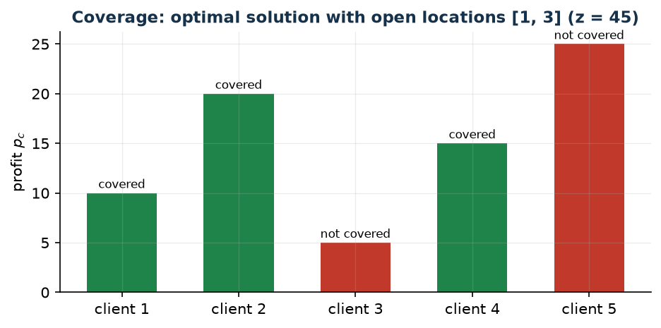

# Signal coverage with interference

**Class:** BIP · **Links:** if and only if (threshold + interference) · **Script:** `python/fam08_3_coverage.py`

[](https://colab.research.google.com/github/fabiofurini/mip-modelling/blob/main/notebooks/fam08_3_coverage.ipynb)

!!! abstract "Problem 8.3"
    An operator chooses at most $k \in \mathbb{Z}_{\ge 1}$ locations,
    among $m \in \mathbb{Z}_{\ge 1}$ candidates, to serve $n \in
    \mathbb{Z}_{\ge 1}$ clients. $s_{lc} \in \mathbb{Q}_{\ge 0}$ is the
    signal received by client $c$ if $l$ is installed. A client is
    **covered** if and only if the total signal is at least $t \in
    \mathbb{Q}_{>0}$ *and* at most one location generates for it a signal
    $\ge b \in \mathbb{Q}_{>0}$. $p_c \in \mathbb{Q}_{>0}$ is the profit if
    covered. We want to maximize the total profit.

**The problem in words.** *We decide* which locations to install (at most
$k$). *The objective*: maximum total profit. *The constraints*: a client
is covered if and only if it receives enough signal and not too much
interference; at most $k$ installed locations.

## Model

**Data.** $m$, $n$, $s_{lc} \in \mathbb{Q}_{\ge 0}$, $p_c \in
\mathbb{Q}_{>0}$, threshold $t$, interference limit $b$, budget $k$. For
every client $c$: $\mathscr{L}_c = \{l : s_{lc} \ge b\}$.

**Decision variables.** $m$ binaries $x_l$ (location installed), $n$
binaries $y_c$ (client covered).

$$
\begin{aligned}
\max ~~ \sum_{c=1}^{n} p_c\, y_c & & \\
\text{subject to} \quad -\sum_{l=1}^{m} s_{lc}\, x_l + t\, y_c &\le 0, & \forall c, \\
\sum_{l \in \mathscr{L}_c} x_l + (m-1)\, y_c &\le m, & \forall c, \\
\sum_{l=1}^{m} x_l &\le k, & \\
x_l, y_c &\in \{0, 1\}. & &
\end{aligned}
$$

- the objective maximizes total profit;
- the first constraint links coverage and received signal ($n$ constraints);
- the second links coverage and interference ($n$ constraints);
- the third caps installed locations at $k$ (one constraint).

**The link: an if and only if.** One direction — $y_c=1 \Rightarrow$
signal $\ge t$ **and** at most one strong location — is imposed directly
by the two constraints. The other direction — if both conditions hold,
the client is covered — is not imposed by the constraints (which also
allow $y_c=0$), but follows from optimality: since $p_c>0$ and $y_c$
appears only in these two constraints, raising it to $1$ remains feasible
and raises the objective. The same pattern as problem 7.6.

## The model in gurobipy

```python
mod = gp.Model("coverage_interference")
x = mod.addVars(m, vtype=GRB.BINARY, name="x")
y = mod.addVars(n, vtype=GRB.BINARY, name="y")
mod.setObjective(gp.quicksum(p[c] * y[c] for c in range(n)), GRB.MAXIMIZE)
mod.addConstrs((-gp.quicksum(s[l][c] * x[l] for l in range(m)) + t * y[c] <= 0
                for c in range(n)), name="threshold")
mod.addConstrs((gp.quicksum(x[l] for l in L[c]) + (m - 1) * y[c] <= m
                for c in range(n)), name="interference")
mod.addConstr(x.sum() <= k, name="budget")
```

## The instance

$m=3$, $n=5$, $t=5$, $b=4$, $k=2$:

| $s_{lc}$ | $c=1$ | $c=2$ | $c=3$ | $c=4$ | $c=5$ |
|---|---:|---:|---:|---:|---:|
| $l=1$ | 6 | 0 | 5 | 3 | 1 |
| $l=2$ | 4 | 5 | 2 | 0 | 0 |
| $l=3$ | 0 | 7 | 5 | 4 | 2 |

| | $c=1$ | $c=2$ | $c=3$ | $c=4$ | $c=5$ |
|---|---:|---:|---:|---:|---:|
| $p_c$ | 10 | 20 | 5 | 15 | 25 |

With $b=4$: $\mathscr{L}_1=\{1,2\}$, $\mathscr{L}_2=\{3\}$,
$\mathscr{L}_3=\{1,3\}$, $\mathscr{L}_4=\{3\}$, $\mathscr{L}_5=\emptyset$.

## Constructive heuristic: the primal bound

The first $k$ locations open. Client 1: signal $10\ge5$ but 2 strong
locations ($>1$): **not covered**. Client 2: signal $5\ge5$, 0 strong
locations: **covered**. Client 3: signal $7\ge5$, 1 strong location:
**covered**. Clients 4 and 5: insufficient signal: **not covered**. Value
$20+5=25$: $z(\mathit{MILP}) \ge \mathit{LB} = 25$.

## LP relaxation and dual: the dual bound

With $\bar\pi_c=0$, $\bar\mu=0$ and $\bar\lambda_c = p_c/(m-1) = p_c/2$:

$$
\bar\lambda_1=5,\ \bar\lambda_2=10,\ \bar\lambda_3=5/2,\ \bar\lambda_4=15/2,\ \bar\lambda_5=25/2,
$$

of value $m\sum_c\bar\lambda_c = 3\cdot75/2=225/2$. By weak duality (a
maximisation problem: the heuristic gives the lower bound, the dual the
upper bound), $\mathit{LB}=25 \le z(\mathit{MILP}) \le z(\mathit{LP}) \le
\mathit{UB}=225/2$.

**What the solver says.** $z(\mathit{LP}) = 41925/646 \approx 64.9$,
$z(\mathit{LP}^+) = 125/2 = 62.5$. $z(\mathit{MILP}) = 45$, with locations
1 and 3 installed and clients 1, 2, 4 covered (not 3 or 5): different from
what the heuristic found. Heuristic gap $44.4\%$.

| $LB$ | $UB$ (dual) | $z(\mathit{LP})$ | $z(\mathit{LP}^+)$ | $z(\mathit{MILP})$ | gap |
|---:|---:|---:|---:|---:|---:|
| 25 | $225/2$ | $41925/646$ | $125/2$ | 45 | $44.4\%$ |



## Additional considerations

- Client 5 can never be covered: maximum signal $1+0+2=3<5$ even opening
  all locations.
- For clients with $|\mathscr{L}_c|\le1$ (2, 4, 5) the interference
  constraint is redundant.

## Additional modelling questions

??? question "8.3.1 — Guaranteed minimum coverage"
    At least 3 clients must be covered. How does the model change? What
    is the new optimum?

    !!! tip "Solution"
        The solution is in the solutions document, reserved for instructors.
??? question "8.3.2 — Conditional installation"
    Location 1 can only be installed if location 3 is also installed. How
    is this modelled? What is the new optimum?

    !!! tip "Solution"
        The solution is in the solutions document, reserved for instructors.
## Code

Full script —
[`python/fam08_3_coverage.py`](https://github.com/fabiofurini/mip-modelling/blob/main/python/fam08_3_coverage.py)
(reproducible with `python3 python/fam08_3_coverage.py` from the
`python/` folder). Notebook —
[`notebooks/fam08_3_coverage.ipynb`](https://github.com/fabiofurini/mip-modelling/blob/main/notebooks/fam08_3_coverage.ipynb)
— opens in Colab from the badge at the top of the page.

<!-- embedded-script: begin (regenerated by python/embed_code.py) -->

??? example "Show the complete script — `python/fam08_3_coverage.py` (145 lines)"

    ```python
    """Problem 8.3 -- Signal coverage with interference (maximum profit).

    An "if and only if" as in scheduling problem 7.6: one direction (threshold +
    interference => covered) is imposed by two families of link constraints; the
    other direction (covered => conditions satisfied) follows from the objective.
    """
    import gurobipy as gp
    import pandas as pd
    from gurobipy import GRB

    from mip import (due_rilassamenti, frazione, nuovo_modello, registra_bound,
                     risolvi, stampa_soluzione, valuta)
    from stile import intestazione, plt, salva_dati, salva_figura

    R = range

    # ---------- 1. MODEL AND INSTANCE ----------

    intestazione("3. Coverage with interference: signal threshold and at most one strong location")
    s3 = [[6, 0, 5, 3, 1], [4, 5, 2, 0, 0], [0, 7, 5, 4, 2]]   # signal location l -> client c
    p3 = [10, 20, 5, 15, 25]     # profit if client c is covered
    t3, b3, k3 = 5, 4, 2         # signal threshold, interference limit, budget of locations
    m, n = 3, 5
    L3 = [[l for l in R(m) if s3[l][c] >= b3] for c in R(n)]   # L_c: "strong" locations for client c
    salva_dati(pd.DataFrame([{"location": l + 1, "client": c + 1, "s": s3[l][c]}
                             for l in R(m) for c in R(n)]), "loc3_segnale")
    salva_dati(pd.DataFrame({"client": R(1, n + 1), "p": p3}), "loc3_clienti")


    def modello_3(s, p, t, b, k):
        m, n = len(s), len(p)
        L = [[l for l in R(m) if s[l][c] >= b] for c in R(n)]
        mod = nuovo_modello("coverage_interference")
        x = mod.addVars(m, vtype=GRB.BINARY, name="x")
        y = mod.addVars(n, vtype=GRB.BINARY, name="y")
        mod.setObjective(gp.quicksum(p[c] * y[c] for c in R(n)), GRB.MAXIMIZE)
        mod.addConstrs((-gp.quicksum(s[l][c] * x[l] for l in R(m)) + t * y[c] <= 0 for c in R(n)),
                       name="threshold")
        mod.addConstrs((gp.quicksum(x[l] for l in L[c]) + (m - 1) * y[c] <= m for c in R(n)),
                       name="interference")
        mod.addConstr(x.sum() <= k, name="budget")
        return mod, x, y, L


    def duale_3(s, p, t, b, k):
        """min sum m lam_c + k mu;  -sum_c s_lc pi_c + sum_{c in C_l} lam_c + mu >= 0;
        t pi_c + (m-1) lam_c >= p_c;  pi,lam,mu >= 0."""
        m, n = len(s), len(p)
        L = [[l for l in R(m) if s[l][c] >= b] for c in R(n)]
        C = [[c for c in R(n) if l in L[c]] for l in R(m)]
        dl = nuovo_modello("duale_coverage")
        pi = dl.addVars(n, name="pi")
        lam = dl.addVars(n, name="lam")
        mu = dl.addVar(name="mu")
        dl.setObjective(m * lam.sum() + k * mu, GRB.MINIMIZE)
        dl.addConstrs((-gp.quicksum(s[l][c] * pi[c] for c in R(n)) + gp.quicksum(lam[c] for c in C[l]) + mu >= 0
                      for l in R(m)), name="rc_x")
        dl.addConstrs((t * pi[c] + (m - 1) * lam[c] >= p[c] for c in R(n)), name="rc_y")
        return dl


    m3, x3, y3, L3m = modello_3(s3, p3, t3, b3, k3)

    # ---------- 2. CONSTRUCTIVE HEURISTIC (LOWER BOUND) ----------

    print("Heuristic: the first k locations are opened; a client is covered if the total")
    print("signal reaches the threshold and at most one strong location reaches it.")


    def euristica_3(s, p, t, b, k):
        m, n = len(s), len(p)
        x = [1 if l < k else 0 for l in R(m)]
        y, passi = [0] * n, []
        for c in R(n):
            ts = sum(s[l][c] for l in R(k))
            ni = sum(1 for l in R(k) if s[l][c] >= b)
            y[c] = 1 if (ts >= t and ni <= 1) else 0
            passi.append(f"Client {c + 1}: total signal = {ts}, strong locations = {ni}; "
                         f"{'covered' if y[c] else 'not covered'}.")
        return x, y, passi


    xe, ye, passi = euristica_3(s3, p3, t3, b3, k3)
    print(f"  The first k = {k3} locations are opened: x = {xe}.")
    for i, s in enumerate(passi, 1):
        print(f"  Step {i}. {s}")
    lb3 = sum(p3[c] * ye[c] for c in R(n))
    print(f"  lb = {lb3}")

    # ---------- 3. LP RELAXATION AND DUAL (UPPER BOUND) ----------

    d3 = duale_3(s3, p3, t3, b3, k3)
    mano = {"mu": 0.0}
    mano.update({f"pi[{c}]": 0.0 for c in R(n)})
    mano.update({f"lam[{c}]": p3[c] / 2 for c in R(n)})
    ub3, viol = valuta(d3, mano)
    assert viol <= 1e-9, viol
    print("Hand-built dual solution: pi = 0, mu = 0, lam_c = p_c/2 = "
          + ", ".join(frazione(p3[c] / 2) for c in R(n)) + f"  ->  ub = {frazione(ub3)}")
    zlp3, zlp3r, _ = due_rilassamenti(m3, d3)

    # ---------- 4. OPTIMAL SOLUTION OF THE MILP ----------

    z3 = risolvi(m3)
    print("Optimal solution of the MILP:")
    stampa_soluzione(m3, solo_non_nulle=True)
    riga = registra_bound("3 coverage", ub3, lb3, zlp3, zlp3r, z3, senso="max")
    salva_dati(pd.DataFrame([riga]), "loc3_bound")

    # ---------- 5. ADDITIONAL MODELLING QUESTIONS ----------

    varianti = {}


    def variante(nome, mod):
        z = risolvi(mod)
        print(f"  {nome:70s} z = {frazione(z)}")
        return z


    # 3a: at least 3 clients must be covered
    mod, x, y, L = modello_3(s3, p3, t3, b3, k3)
    mod.addConstr(y.sum() >= 3, name="minimum_coverage")
    varianti["3a"] = variante("3a. At least 3 clients covered (sum y_c >= 3)", mod)
    # 3b: if location 1 is opened, location 3 must also be opened
    mod, x, y, L = modello_3(s3, p3, t3, b3, k3)
    mod.addConstr(x[0] <= x[2], name="1_implies_3")
    varianti["3b"] = variante("3b. If location 1 opens, location 3 also opens (x_1 <= x_3)", mod)
    salva_dati(pd.DataFrame({"variant": list(varianti), "z": list(varianti.values())}), "loc3_varianti")

    # ---------- 6. FIGURES ----------

    fig, ax = plt.subplots(figsize=(7.2, 3.2))
    ott_x = [l for l in R(m) if x3[l].X > 0.5]
    larghezza = 0.6
    for c in R(n):
        colore = "#1E8449" if y3[c].X > 0.5 else "#C0392B"
        ax.bar(c, p3[c], color=colore, width=larghezza)
        ax.text(c, p3[c] + 0.5, "covered" if y3[c].X > 0.5 else "not covered", ha="center", fontsize=8)
    ax.set_xticks(R(n))
    ax.set_xticklabels([f"client {c + 1}" for c in R(n)])
    ax.set_ylabel("profit $p_c$")
    ax.set_title(f"Coverage: optimal solution with open locations {[l + 1 for l in ott_x]} (z = {frazione(z3)})")
    salva_figura(fig, "cap08_copertura_ottimo")
    print("Fine.")
    ```

<!-- embedded-script: end -->
