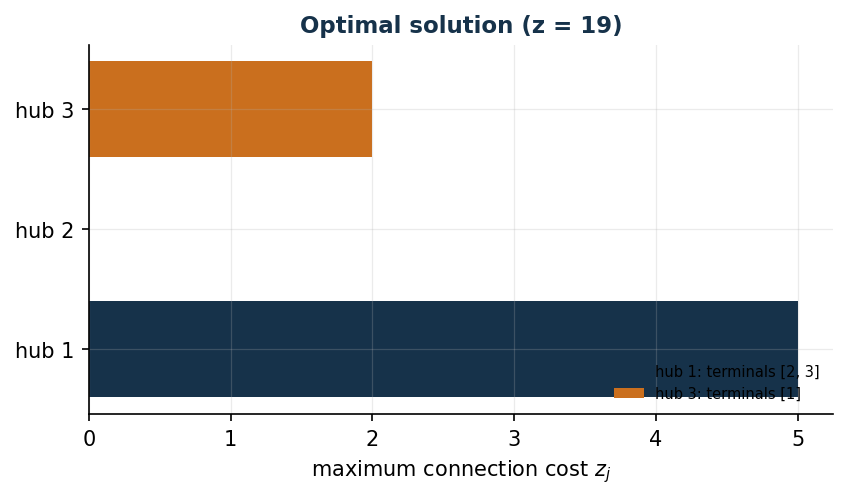

# Hub location with maximum cost

**Class:** MILP · **Links:** aggregated activation, maximum variable · **Script:** `python/fam08_4_hub.py`

[](https://colab.research.google.com/github/fabiofurini/mip-modelling/blob/main/notebooks/fam08_4_hub.ipynb)

!!! abstract "Problem 8.4"
    $n \in \mathbb{Z}_{\ge 1}$ terminals, each to be connected to exactly
    one hub; $m \in \mathbb{Z}_{\ge 1}$ hubs, each with capacity $k \in
    \mathbb{Z}_{\ge 1}$ terminals and activation cost $f_j \in
    \mathbb{Q}_{\ge 0}$. $c_{ij} \in \mathbb{Q}_{\ge 0}$ is the cost of
    connecting terminal $i$ to hub $j$. We minimize the sum of activation
    costs and the maximum connection cost of each hub.

**The problem in words.** *We decide* which hubs to activate and which
hub to connect each terminal to. *The objective*: activation plus, for
each hub, the highest connection cost (not the sum). *The constraints*:
every terminal to exactly one hub; an inactive hub serves no one, an
active one serves at most $k$.

## Model

**Decision variables.** $n\,m$ binaries $x_{ij}$, $m$ binaries $y_j$ (hub
activated), $m$ non-negative continuous $z_j$ (maximum cost of hub $j$).

$$
\begin{aligned}
\min ~~ \sum_{j=1}^{m} f_j\, y_j + \sum_{j=1}^{m} z_j & & \\
\text{subject to} \quad \sum_{j=1}^{m} x_{ij} &= 1, & \forall i, \\
-\sum_{i=1}^{n} x_{ij} + k\, y_j &\ge 0, & \forall j, \\
-c_{ij}\, x_{ij} + z_j &\ge 0, & \forall i, j, \\
x_{ij}, y_j &\in \{0, 1\},\ z_j \ge 0. & &
\end{aligned}
$$

- the objective minimizes activation costs plus the maximum cost per hub;
- the first constraint assigns every terminal to one hub ($n$ constraints);
- the second links assignment and activation, in **aggregated** form, and
  imposes capacity ($m$ constraints);
- the third links assignment and the maximum variable ($n\,m$ constraints).

**First link: aggregated activation.** If a terminal is connected to hub
$j$, $j$ must be activated; from the contrapositive, an inactive hub
serves no one. Both imposed directly by the second constraint. The
opposite direction — an activated hub serves at least one terminal — is **not**
imposed by the constraints: $y_j = 1$ with all $x_{ij} = 0$ is feasible. It
follows from optimality, with a strength that depends on the sign of $f_j$: if
$f_j > 0$, switching off an empty hub strictly reduces the cost, so **in every
optimum** no activated hub is left empty; if $f_j = 0$ — which the statement
allows, having declared $f_j \in \mathbb{Q}_{\ge 0}$ — the exchange does not
improve anything and the correct conclusion is the weaker "**there exists an
optimum** in which the empty hubs are switched off". On the instance
$f = (5,6,7)$ the strong version holds. As in
[problem 7.2](scheduling-2.md).

**Second link: maximum variable.** If terminal $i$ is connected to $j$,
$z_j \ge c_{ij}$: imposed directly. At the optimum, $z_j =
\max_{i:x_{ij}=1} c_{ij}$ exactly, because the objective minimizes $z_j$
and no other constraint involves it. As in problem 7.7.

## The model in gurobipy

```python
mod = gp.Model("hub_max")
x = mod.addVars(n, m, vtype=GRB.BINARY, name="x")
y = mod.addVars(m, vtype=GRB.BINARY, name="y")
z = mod.addVars(m, name="z")
mod.setObjective(gp.quicksum(f[j] * y[j] for j in range(m)) + z.sum(), GRB.MINIMIZE)
mod.addConstrs((gp.quicksum(x[i, j] for j in range(m)) == 1 for i in range(n)), name="assignment")
mod.addConstrs((-gp.quicksum(x[i, j] for i in range(n)) + k * y[j] >= 0 for j in range(m)), name="activation")
mod.addConstrs((-c[i][j] * x[i, j] + z[j] >= 0 for i in range(n) for j in range(m)), name="maximum")
```

## The instance

$n=3$ terminals, $m=3$ hubs, $k=2$:

| $c_{ij}$ | $j=1$ | $j=2$ | $j=3$ |
|---|---:|---:|---:|
| $i=1$ | 5 | 10 | 2 |
| $i=2$ | 5 | 4 | 6 |
| $i=3$ | 5 | 4 | 6 |

| | $j=1$ | $j=2$ | $j=3$ |
|---|---:|---:|---:|
| $f_j$ | 5 | 6 | 7 |

## Constructive heuristic: the primal bound

A **next-fit** heuristic (bin packing): one hub at a time, up to $k$
terminals — the same generic heuristic as scheduling, reused from
`euristiche.py`. Terminals 1 and 2 on hub 1 (full), terminal 3 on hub 2.
Maximum costs: $z_1=\max(5,5)=5$, $z_2=4$. Value $5+6+5+4=20$:
$z(\mathit{MILP}) \le \mathit{UB} = 20$.

## LP relaxation and dual: the dual bound

With $\bar\gamma_{ij}=0$ and $\bar\beta_j = f_j/k$ (the largest value
allowed), the constraint on $\alpha_i$ holds for **every** hub $j$, not
only the most convenient one: $\bar\alpha_i = \min_j \bar\beta_j$.

$$
\bar\beta = (5/2,\ 3,\ 7/2),\qquad \bar\alpha_i = 5/2\ \ \forall i,
$$

of value $3\cdot5/2=15/2$. By weak duality, $\mathit{LB}=15/2 \le
z(\mathit{LP}) \le z(\mathit{MILP}) \le \mathit{UB}=20$.

!!! warning "A common trap"
    The constraint on $\alpha_i$ holds for every hub $j$: setting
    $\bar\gamma_{ij}=0$ only for the "inconvenient" hubs is not enough to
    free $\alpha_i$ from that constraint. $\alpha_i$ stays bounded by the
    minimum over all hubs, not by a single one.

**What the solver says.** $z(\mathit{LP})=25/2$,
$z(\mathit{LP}^+)=1015/78\approx13.0$. $z(\mathit{MILP})=19$, with hubs 1
and 3 activated (not 1 and 2): terminal 1 alone on hub 3 (the cheapest for
it), terminals 2 and 3 on hub 1. Heuristic gap $5.3\%$.

| $UB$ | $LB$ (dual) | $z(\mathit{LP})$ | $z(\mathit{LP}^+)$ | $z(\mathit{MILP})$ | gap |
|---:|---:|---:|---:|---:|---:|
| 20 | $15/2$ | $25/2$ | $1015/78$ | 19 | $5.3\%$ |



## Additional considerations

- $x_{ij} \le y_j$ (disaggregated) is implied by the aggregated activation
  constraint **on integer points**, not in the relaxation: adding it does not
  change $z(\mathit{MILP})$ and raises $z(\mathit{LP}^+)$ from $1015/78$ to
  $79/6$ (question 8.4.1).
- With $M_j=\max_i c_{ij}$, $z_j \le M_j y_j$ is not a valid inequality
  (the model allows $z_j>0$ with $y_j=0$), but it is an
  **optimality-preserving constraint**: minimizing $z_j$, the optimum
  zeroes it anyway when $y_j=0$.

## Additional modelling questions

??? question "8.4.1 — Disaggregated activation link"
    *Add* the disaggregated links $x_{ij} \le y_j$ to the model. Does the
    optimum change? Does the relaxation change? And what happens if, instead of
    adding them, one *replaces* the aggregated constraint by them?

    !!! tip "Solution"
        The solution is in the solutions document, reserved for instructors.
??? question "8.4.2 — Forbidden connection"
    Terminal 1 cannot connect to hub 2. How is this modelled? What is the
    new optimum?

    !!! tip "Solution"
        The solution is in the solutions document, reserved for instructors.
## Code

Full script —
[`python/fam08_4_hub.py`](https://github.com/fabiofurini/mip-modelling/blob/main/python/fam08_4_hub.py)
(reproducible with `python3 python/fam08_4_hub.py` from the `python/`
folder, calls `next_fit` from `euristiche.py`). Notebook —
[`notebooks/fam08_4_hub.ipynb`](https://github.com/fabiofurini/mip-modelling/blob/main/notebooks/fam08_4_hub.ipynb)
— opens in Colab from the badge at the top of the page.

<!-- embedded-script: begin (regenerated by python/embed_code.py) -->

??? example "Show the complete script — `python/fam08_4_hub.py` (162 lines)"

    ```python
    """Problem 8.4 -- Hub location with maximum connection cost.

    Two links: activation (aggregated, as in scheduling 7.2) and a maximum
    variable z_j = max_i {c_ij : x_ij = 1} (same pattern as tardiness 7.7). The
    next-fit heuristic is the generic one from euristiche.py: hubs are the
    "machines" (capacity k) and terminals the "jobs" (unit time, independent of
    the machine).
    """
    import gurobipy as gp
    import pandas as pd
    from gurobipy import GRB

    from euristiche import matrice, next_fit
    from mip import (due_rilassamenti, frazione, nuovo_modello, registra_bound,
                     rilassamento, risolvi, stampa_soluzione, valuta)
    from stile import intestazione, plt, salva_dati, salva_figura

    R = range

    # ---------- 1. MODEL AND INSTANCE ----------

    intestazione("4. Hub location: activation and maximum connection cost")
    c4 = [[5, 10, 2], [5, 4, 6], [5, 4, 6]]   # connection cost terminal i -> hub j
    f4 = [5, 6, 7]                             # activation cost of hub j
    k4 = 2                                     # capacity of each hub
    n, m = 3, 3
    salva_dati(pd.DataFrame([{"terminal": i + 1, "hub": j + 1, "c": c4[i][j]}
                             for i in R(n) for j in R(m)]), "hub4_costi")
    salva_dati(pd.DataFrame({"hub": R(1, m + 1), "f": f4}), "hub4_attivazione")


    def modello_4(c, f, k):
        n, m = len(c), len(f)
        mod = nuovo_modello("hub_max")
        x = mod.addVars(n, m, vtype=GRB.BINARY, name="x")
        y = mod.addVars(m, vtype=GRB.BINARY, name="y")
        z = mod.addVars(m, name="z")
        mod.setObjective(gp.quicksum(f[j] * y[j] for j in R(m)) + z.sum(), GRB.MINIMIZE)
        mod.addConstrs((gp.quicksum(x[i, j] for j in R(m)) == 1 for i in R(n)), name="assignment")
        mod.addConstrs((-gp.quicksum(x[i, j] for i in R(n)) + k * y[j] >= 0 for j in R(m)), name="activation")
        mod.addConstrs((-c[i][j] * x[i, j] + z[j] >= 0 for i in R(n) for j in R(m)), name="maximum")
        return mod, x, y, z


    def duale_4(c, f, k):
        """max sum_i alpha_i;  alpha_i - beta_j - c_ij gamma_ij <= 0;  k beta_j <= f_j;
        sum_i gamma_ij <= 1;  alpha free, beta,gamma >= 0."""
        n, m = len(c), len(f)
        dl = nuovo_modello("duale_hub")
        alpha = dl.addVars(n, lb=-GRB.INFINITY, name="alpha")
        beta = dl.addVars(m, name="beta")
        gamma = dl.addVars(n, m, name="gamma")
        dl.setObjective(alpha.sum(), GRB.MAXIMIZE)
        dl.addConstrs((alpha[i] - beta[j] - c[i][j] * gamma[i, j] <= 0 for i in R(n) for j in R(m)), name="rc_x")
        dl.addConstrs((k * beta[j] <= f[j] for j in R(m)), name="rc_y")
        dl.addConstrs((gp.quicksum(gamma[i, j] for i in R(n)) <= 1 for j in R(m)), name="rc_z")
        return dl


    m4, x4, y4, z4 = modello_4(c4, f4, k4)

    # ---------- 2. CONSTRUCTIVE HEURISTIC (UPPER BOUND) ----------

    print("Next-fit heuristic: hubs are filled one at a time up to k terminals,")
    print("then the algorithm moves to the next one (the same generic heuristic as scheduling).")
    t4 = matrice([1] * n, m)   # unit time for every terminal, independent of the hub
    a4 = [k4] * m               # residual capacity of each hub
    esito4 = next_fit(t4, a4)
    esito4.traccia.stampa()
    assert esito4.ok
    ye = esito4.y
    ze = [0.0] * m
    for j in R(m):
        if ye[j]:
            ze[j] = max(c4[i][j] for i in R(n) if esito4.x.get((i, j)) == 1)
    ub4 = sum(f4[j] * ye[j] for j in R(m)) + sum(ze)
    print(f"  y = {ye}, z = {ze}  ->  ub = {frazione(ub4)}")

    # ---------- 3. LP RELAXATION AND DUAL (LOWER BOUND) ----------

    d4 = duale_4(c4, f4, k4)
    beta_mano = [f4[j] / k4 for j in R(m)]     # the largest value allowed by k*beta_j <= f_j
    alpha_mano = min(beta_mano)                # must hold for EVERY hub j, not only the most convenient one
    mano = {f"gamma[{i},{j}]": 0.0 for i in R(n) for j in R(m)}
    mano.update({f"beta[{j}]": beta_mano[j] for j in R(m)})
    mano.update({f"alpha[{i}]": alpha_mano for i in R(n)})
    lb4, viol = valuta(d4, mano)
    assert viol <= 1e-9, viol
    print(f"Hand-built dual solution: gamma = 0, beta_j = f_j/k = {[frazione(b) for b in beta_mano]}, "
          f"alpha_i = min_j beta_j = {frazione(alpha_mano)}  ->  lb = {frazione(lb4)}")
    zlp4, zlp4r, _ = due_rilassamenti(m4, d4)

    # ---------- 4. OPTIMAL SOLUTION OF THE MILP ----------

    z4v = risolvi(m4)
    print("Optimal solution of the MILP:")
    stampa_soluzione(m4, solo_non_nulle=True)
    riga = registra_bound("4 hub", ub4, lb4, zlp4, zlp4r, z4v, senso="min")
    salva_dati(pd.DataFrame([riga]), "hub4_bound")

    # ---------- 5. ADDITIONAL MODELLING QUESTIONS ----------

    varianti = {}


    def variante(nome, mod):
        z = risolvi(mod)
        print(f"  {nome:70s} z = {frazione(z)}")
        return z


    # 4a: the disaggregated links x_ij <= y_j are ADDED to the aggregated constraint
    mod, x, y, z = modello_4(c4, f4, k4)
    mod.addConstrs((x[i, j] <= y[j] for i in R(n) for j in R(m)), name="disaggregated_activation")
    varianti["4a"] = variante("4a. Disaggregated links ADDED to the aggregated one (x_ij <= y_j)", mod)
    zlp_4a, _, _ = rilassamento(mod, rafforzato=True)
    zlp_base, _, _ = rilassamento(modello_4(c4, f4, k4)[0], rafforzato=True)
    print(f"      relaxation: z(LP+) goes from {frazione(zlp_base)} to {frazione(zlp_4a)}: the")
    print("      disaggregated links are valid inequalities implied by the aggregated one on")
    print("      integer points, but not by the relaxation, and they tighten it.")

    # 4a-bis: the trap. REPLACING the aggregated constraint by the disaggregated links
    # alone also loses the capacity k: the model is no longer the one of the problem.
    # The capacity must be kept explicitly, or one speaks of addition, not replacement.
    mod, x, y, z = modello_4(c4, f4, k4)
    mod.update()
    mod.remove([cc for cc in mod.getConstrs() if cc.ConstrName.startswith("activation")])
    mod.update()
    mod.addConstrs((x[i, j] <= y[j] for i in R(n) for j in R(m)), name="disaggregated_only")
    varianti["4a_without_capacity"] = variante(
        "4a'. REPLACING the aggregated one by the disaggregated links (capacity lost)", mod)
    mod, x, y, z = modello_4(c4, f4, k4)
    mod.update()
    mod.remove([cc for cc in mod.getConstrs() if cc.ConstrName.startswith("activation")])
    mod.update()
    mod.addConstrs((x[i, j] <= y[j] for i in R(n) for j in R(m)), name="disaggregated_only")
    mod.addConstrs((gp.quicksum(x[i, j] for i in R(n)) <= k4 for j in R(m)), name="capacity")
    varianti["4a_with_capacity"] = variante(
        "4a\'\'. Correct replacement: disaggregated links + separate capacity", mod)
    assert varianti["4a_without_capacity"] < varianti["4a"], "without the capacity the optimum drops"
    assert varianti["4a_with_capacity"] == varianti["4a"], "with the capacity the optimum is unchanged"
    # 4b: terminal 1 cannot be connected to hub 2
    mod, x, y, z = modello_4(c4, f4, k4)
    mod.addConstr(x[0, 1] == 0, name="terminal1_not_hub2")
    varianti["4b"] = variante("4b. Terminal 1 cannot connect to hub 2 (x_12 = 0)", mod)
    salva_dati(pd.DataFrame({"variant": list(varianti), "z": list(varianti.values())}), "hub4_varianti")

    # ---------- 6. FIGURES ----------

    fig, ax = plt.subplots(figsize=(6.4, 3.2))
    colori = ["#16324A", "#0E7490", "#CA6F1E"]
    for j in R(m):
        if y4[j].X > 0.5:
            assegnati = [i + 1 for i in R(n) if x4[i, j].X > 0.5]
            ax.barh(j, z4[j].X, color=colori[j % 3], label=f"hub {j + 1}: terminals {assegnati}")
    ax.set_yticks(R(m))
    ax.set_yticklabels([f"hub {j + 1}" for j in R(m)])
    ax.set_xlabel("maximum connection cost $z_j$")
    ax.set_title(f"Optimal solution (z = {frazione(z4v)})")
    ax.legend(fontsize=7, loc="lower right")
    salva_figura(fig, "cap08_hub_ottimo")
    print("Fine.")
    ```

<!-- embedded-script: end -->
