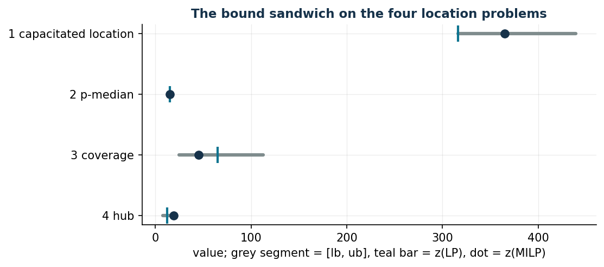

# Location and coverage

**Class:** BIP / MILP · **Script:** one script and one notebook per problem
(`python/fam08_1_capacitated.py` … `fam08_4_hub.py`), plus
`fam08_5_summary.py` which collects the bounds of all four.

Four problems in which we decide **where** to open a facility — a location,
a hub — and how this constrains the variables that depend on that decision:
where to ship goods, which clients to serve, which clients to cover, which
hub each terminal connects to. What changes from problem to problem is the
nature of the link between the opening variable and the variables that
depend on it, and how the budget on openings enters the model.

!!! note "The links revisited here"
    **Aggregated activation** (8.1): a single family of constraints acts as
    both the link and the capacity constraint, $\sum_c y_{lc} \le u_l x_l$.
    **Disaggregated activation** (8.2): $x_l \ge y_{lc}$, derived from the
    CNF of a Boolean implication as in problem 7.5, with a budget $k$ on the
    number of open locations. **If and only if** (8.3): one direction
    imposed by two families of constraints (signal threshold and
    interference), the other following from the objective. **Aggregated
    activation and a maximum variable** (8.4): the same activation as 8.1
    together with the maximum link $z_j \ge c_{ij} x_{ij}$ already seen in
    problem 7.7.

## Family notation

| Symbol | Type | Meaning |
|---|---|---|
| $m$ | $\in \mathbb{Z}_{\ge 1}$ | number of candidate locations/hubs, $l \in \{1, 2, \dots, m\}$ |
| $n$ | $\in \mathbb{Z}_{\ge 1}$ | number of clients/terminals, $c \in \{1, 2, \dots, n\}$ |
| $t_{lc}$ | $\in \mathbb{Q}_{>0}$ | transport/connection cost from location/hub $l$ to client/terminal $c$ |
| $i_l,\ f_l$ | $\in \mathbb{Q}_{\ge 0}$ | opening/activation cost of location/hub $l$ |
| $u_l$ | $\in \mathbb{Q}_{>0}$ | capacity of location $l$ |
| $d_c$ | $\in \mathbb{Q}_{>0}$ | demand of client $c$ |
| $k$ | $\in \mathbb{Z}_{\ge 1}$ | maximum number of open locations / capacity of each hub |
| $s_{lc}$ | $\in \mathbb{Q}_{\ge 0}$ | signal strength from location $l$ to client $c$ |
| $p_c$ | $\in \mathbb{Q}_{>0}$ | profit if client $c$ is covered |
| $t,\ b$ | $\in \mathbb{Q}_{>0}$ | signal threshold and interference limit |

## The four problems

-   **8.1 Capacitated location**

    ---

    Where to open locations and how much to ship from each: the capacity
    constraint is also the activation link. Minimum cost.

    [:octicons-arrow-right-24: MILP · activation](location-1.md)

-   **8.2 p-median**

    ---

    At most $k$ open locations, every client served by the nearest open
    one: disaggregated activation, derived from the CNF.

    [:octicons-arrow-right-24: BIP · activation](location-2.md)

-   **8.3 Coverage with interference**

    ---

    A client is covered if and only if it receives enough signal and not
    too much interference: a maximisation problem with two link
    constraints.

    [:octicons-arrow-right-24: BIP · if and only if](location-3.md)

-   **8.4 Hub with maximum cost**

    ---

    Hub activation plus the highest connection cost per hub: the same
    maximum variable as problem 7.7, heuristic reused from bin packing.

    [:octicons-arrow-right-24: MILP · activation, maximum](location-4.md)

## The overview of bounds

| Problem | heuristic | hand dual | $z(\mathrm{LP})$ | $z(\mathrm{LP}^+)$ | $z(\mathrm{MILP})$ |
|---|---:|---:|---:|---:|---:|
| 8.1 capacitated location | 439 | $1581/5$ | $1581/5$ | 317 | 365 |
| 8.2 p-median | 18 | 13 | 15 | 15 | 15 |
| 8.3 coverage with interference (max) | 25 | $225/2$ | $41925/646$ | $125/2$ | 45 |
| 8.4 hub with maximum cost | 20 | $15/2$ | $25/2$ | $1015/78$ | 19 |

$z(\mathrm{LP})$ is the "pure" relaxation, where the binary variables become
$\ge 0$: it is the one whose dual is written in the exercises, and its
optimum matches the dual's optimum (strong duality). $z(\mathrm{LP}^+)$ is
the strengthened relaxation with $x \le 1$, the one the solver solves at
the root. In problem 8.1 the hand-built dual solution is *optimal* for the
pure relaxation; in problem 8.2 the relaxation is already integral.

