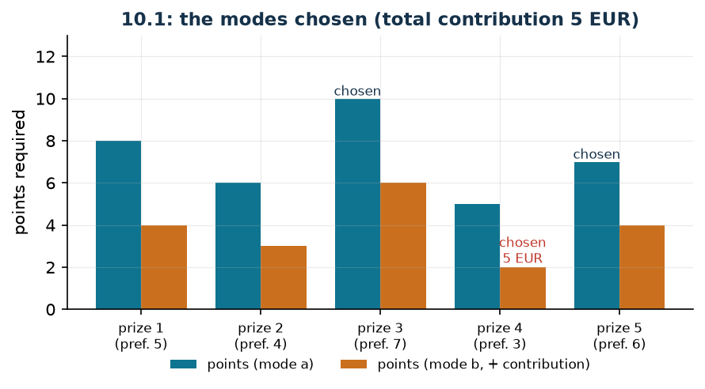

# Prizes obtainable in two ways

**Class:** BIP · **Links:** mutual exclusion (set packing), a sum as an indicator · **Script:** `python/fam10_1_prizes.py`

[](https://colab.research.google.com/github/fabiofurini/mip-modelling/blob/main/notebooks/fam10_1_prizes.ipynb)

!!! abstract "Problem 10.1"
    A loyalty programme offers $s \in \mathbb{Z}_{\ge 1}$ prizes and a customer
    has $p \in \mathbb{Q}_{>0}$ points. Every prize $i \in \{1, \dots, s\}$ can
    be obtained in two alternative ways: with points only, spending
    $a_i \in \mathbb{Q}_{>0}$ of them; or spending only
    $b_i \in \mathbb{Q}_{>0}$ points (with $b_i < a_i$) and adding a money
    contribution of $c_i \in \mathbb{Q}_{\ge 0}$ euros. Every prize can be
    obtained at most once, and in only one of the two ways. Each prize carries a
    preference value $d_i \in \mathbb{Q}_{>0}$, and the customer wants to reach a
    total preference of at least $\ell \in \mathbb{Q}_{>0}$. The customer wants
    to minimise the money spent.

**The problem in words.** We *decide* which prizes to take and, for each of
them, in which of the two ways. *The objective*: minimum money contribution.
*The constraints*: the points are not enough for everything; the total
preference must reach the threshold; and the same prize is not taken twice.

## Model

**Variables.** *Two* families of binaries are needed, one per option:
$x_i \in \{0,1\}$ equals $1$ if prize $i$ is taken with points only;
$y_i \in \{0,1\}$ equals $1$ if it is taken with points and a contribution. In
all $2s$ binary variables.

$$
\begin{aligned}
\min ~~ & \sum_{i=1}^{s} c_i\, y_i\\
\text{s.t.} \quad & x_i + y_i \le 1, && \forall i \in \{1, \dots, s\},\\
& \sum_{i=1}^{s} \bigl(a_i\, x_i + b_i\, y_i\bigr) \le p,\\
& \sum_{i=1}^{s} d_i\,(x_i + y_i) \ge \ell,\\
& x_i \in \{0, 1\}, \quad y_i \in \{0, 1\}, && \forall i \in \{1, \dots, s\}.
\end{aligned}
$$

**Description.** The objective counts money only: the points-only option does
not appear, because it costs no euros. The **mutual exclusion** constraints, one
per prize ($s$ linear constraints), forbid taking the same prize twice. The
**point budget** constraint, a single one, says that the points spent do not
exceed those available. The **preference** constraint, a single one, imposes the
threshold.

!!! note "What mutual exclusion says and what it does not"
    The constraint $x_i + y_i \le 1$ allows **three** configurations: $(0,0)$,
    $(1,0)$ and $(0,1)$. It forbids only $(1,1)$. In particular:

    - it does not say "prize $i$ must be taken": the configuration $(0,0)$ is
      legitimate and means that prize is given up;
    - it does not say "if I do not take it with points then I take it with a
      contribution": the converse

      $$x_i = 0 \quad\Longrightarrow\quad y_i = 1$$

      is false, and the counterexample is exactly $(0,0)$;
    - if one wanted every prize to be taken, the constraint would have to be an
      equality, $x_i + y_i = 1$: that is a set *partitioning* instead of a set
      *packing*, and the problem changes.

    | $x_i$ | $y_i$ | allowed? | meaning |
    |---:|---:|---|---|
    | 0 | 0 | yes | prize $i$ is given up |
    | 1 | 0 | yes | taken with points only |
    | 0 | 1 | yes | taken with points and a contribution |
    | 1 | 1 | no | taken twice |

    The quantity $x_i + y_i$ is therefore the indicator "prize $i$ has been
    taken, one way or the other", and it is exactly this sum that appears in the
    preference constraint.

## The model in gurobipy

```python
m = gp.Model("prizes")
x = m.addVars(s, vtype=GRB.BINARY, name="x")
y = m.addVars(s, vtype=GRB.BINARY, name="y")
m.setObjective(gp.quicksum(c[i] * y[i] for i in range(s)), GRB.MINIMIZE)
m.addConstrs((x[i] + y[i] <= 1 for i in range(s)), name="one_option")
m.addConstr(gp.quicksum(a[i] * x[i] + b[i] * y[i] for i in range(s)) <= p, name="points")
m.addConstr(gp.quicksum(d[i] * (x[i] + y[i]) for i in range(s)) >= ell, name="preference")
```

## The instance

$s = 5$ prizes, $p = 20$ points, $\ell = 16$.

| | $i=1$ | $i=2$ | $i=3$ | $i=4$ | $i=5$ |
|---|---:|---:|---:|---:|---:|
| $a_i$ | 8 | 6 | 10 | 5 | 7 |
| $b_i$ | 4 | 3 | 6 | 2 | 4 |
| $c_i$ | 10 | 8 | 15 | 5 | 9 |
| $d_i$ | 5 | 4 | 7 | 3 | 6 |

## Constructive heuristic: the primal bound

The prizes are scanned by decreasing preference. Each is taken with points only
if they suffice, otherwise with the contribution if the reduced points suffice,
otherwise it is skipped; one stops as soon as the required preference is
reached.

On the instance the order by preference is $3, 5, 1, 2, 4$.

- prize 3 (preference 7): points only suffice ($10 \le 20$), taken; $10$ points
  left, preference $7$;
- prize 5 (preference 6): points only suffice ($7 \le 10$), taken; $3$ points
  left, preference $13$;
- prize 1 (preference 5): the points suffice neither for option a ($8 > 3$) nor
  for option b ($4 > 3$): skipped;
- prize 2 (preference 4): the points do not suffice for a ($6 > 3$) but do for b
  ($3 \le 3$): taken with a contribution of $8$ euros; the preference reaches
  $17 \ge 16$ and one stops.

The total contribution is $z(\mathrm{MILP}) \le \mathit{UB} = 8$.

## LP relaxation and dual: the dual bound

Associate $\sigma_i \ge 0$ with the mutual-exclusion constraints, $\pi \ge 0$
with the point budget and $\rho \ge 0$ with the preference threshold. The primal
is a minimisation, so $\le$ constraints give duals of negative sign.

$$
\begin{aligned}
\max ~~ & -\sum_{i=1}^{s} \sigma_i - p\, \pi + \ell\, \rho\\
\text{s.t.} \quad & -\sigma_i - a_i\, \pi + d_i\, \rho \le 0, && \forall i \in \{1, \dots, s\},\\
& -\sigma_i - b_i\, \pi + d_i\, \rho \le c_i, && \forall i \in \{1, \dots, s\},\\
& \sigma_i \ge 0, \quad \pi \ge 0, \quad \rho \ge 0.
\end{aligned}
$$

**Description.** $\pi$ is the price of one point, $\rho$ the value of one unit of
preference and $\sigma_i$ the price of the mutual exclusion of prize $i$. The
objective collects the threshold $\ell$ priced at $\rho$ and pays the point
budget $p$ priced at $\pi$ together with the multipliers $\sigma_i$. The first
group of constraints are the columns of the $x_i$: taking prize $i$ with points
only yields $d_i\, \rho$ of preference, consumes $a_i\, \pi$ of points and
$\sigma_i$ of mutual exclusion, and the balance cannot exceed the money cost of
that option, which is zero. The second group says the same for the second
option, which consumes only $b_i$ points: there the balance may reach $c_i$.

**Recipe.** Here the free parameters are *two*, not one: the price $\pi$ of a
point and the price $\rho$ of one unit of preference. Once they are fixed, the
mutual-exclusion multipliers follow by taking the smallest feasible value,

$$\bar\sigma_i = \max\bigl(0,\ d_i\, \rho - a_i\, \pi\bigr) ,$$

and only the constraints on the second option remain to be checked. The function

$$V(\pi, \rho) = -\sum_{i=1}^{s} \bar\sigma_i(\pi, \rho) - p\, \pi + \ell\, \rho$$

is concave and piecewise linear: it can be explored on a grid. On the instance
the maximum is at $\bar\pi = 2$, $\bar\rho = 3$,
$\bar\sigma = (0,\ 0,\ 1,\ 0,\ 4)$, with value

$$\mathit{LB} = -(0+0+1+0+4) - 20 \cdot 2 + 16 \cdot 3 = 3 .$$

This solution is **optimal** for the relaxation without the bounds: indeed
$z(\mathrm{LP}) = z(\mathrm{LP}^+) = 3$.

!!! warning "An honest bound can be very far away"
    Here $\mathit{LB} = 3$ and $z(\mathrm{MILP}) = 5$: the gap between the dual
    bound and the integer optimum is $40\%$, and the certified gap between
    heuristic and dual is $100\%$. Nothing is wrong: the LP relaxation may take
    "half a prize" at half preference, and that freedom is worth a lot. It is
    the most extreme case in the course, and it serves as a reminder that a
    valid bound is not automatically a useful bound.

## Optimal solution

| | $i=1$ | $i=2$ | $i=3$ | $i=4$ | $i=5$ |
|---|---:|---:|---:|---:|---:|
| points only $x_i$ | 0 | 0 | 1 | 0 | 1 |
| with contribution $y_i$ | 0 | 0 | 0 | 1 | 0 |

Prizes $3$ and $5$ are taken with points only ($10 + 7 = 17$) and prize $4$ with
the contribution ($2$ points and $5$ euros): $19$ of the $20$ points are used,
the preference is $7 + 6 + 3 = 16$, exactly the threshold.

| $UB$ | $LB$ (dual) | $z(\mathrm{LP})$ | $z(\mathrm{LP}^+)$ | $z(\mathrm{MILP})$ | gap |
|---:|---:|---:|---:|---:|---:|
| 8 | 3 | 3 | 3 | 5 | $60.0\%$ |



The heuristic goes wrong because it looks only at preference: it takes prize $5$
with points only (correct) but then finds itself with $3$ points and has to buy
prize $2$ for $8$ euros, whereas the optimum keeps the points for prize $4$,
which costs only $5$ euros of contribution.

## Additional considerations

- The valid inequalities $x_i \le 1$ and $y_i \le 1$ are implied by the
  mutual-exclusion constraints: indeed $z(\mathrm{LP}) = z(\mathrm{LP}^+)$.
- If for some prize $c_i = 0$, the second option would dominate the first (fewer
  points, same cost) and the variable $x_i$ could be removed. It is a check on
  the data worth doing.
- The model extends to $k$ options without effort: $k$ families of binaries and
  the constraint $\sum_{m=1}^{k} x_i^{(m)} \le 1$. The structure stays a set
  packing by rows.

## Additional modelling questions

??? question "10.1.1 — Alternative prizes"
    Prizes $3$ and $5$ come from the same supplier and are alternatives: at most
    one of them may be taken, in either option. How does the model change? What
    is the new optimum?

    !!! tip "Solution"
        The solution is in the solutions document, reserved for teachers.

??? question "10.1.2 — At least four prizes"
    Besides the preference threshold, the customer wants at least four different
    prizes. How does the model change? What is the new optimum?

    !!! tip "Solution"
        The solution is in the solutions document, reserved for teachers.

## Code

Complete script —
[`python/fam10_1_prizes.py`](https://github.com/fabiofurini/mip-modelling/blob/main/python/fam10_1_prizes.py)
(reproducible with `python3 python/fam10_1_prizes.py` from the `python/`
folder). Notebook —
[`notebooks/fam10_1_prizes.ipynb`](https://github.com/fabiofurini/mip-modelling/blob/main/notebooks/fam10_1_prizes.ipynb)
— which opens in Colab from the badge at the top of the page.

<!-- embedded-script: begin (regenerated by python/embed_code.py) -->

??? example "Show the complete script — `python/fam10_1_prizes.py` (177 lines)"

    ```python
    """Problem 10.1 -- Prizes obtainable in two ways.

    Every prize is obtained either with points only, or with fewer points plus a
    contribution in euros: two binary variables per prize and a mutual-exclusion
    constraint. The link is the one of chapter 2: x_i + y_i <= 1 is a set packing, and
    the converses must be refuted explicitly with x_i = y_i = 0.
    """
    import gurobipy as gp
    import pandas as pd
    from gurobipy import GRB

    from mip import (ammissibile, due_rilassamenti, frazione, nuovo_modello, registra_bound,
                     risolvi, valuta)
    from stile import ARANCIO, BLU, ROSSO, TEAL, intestazione, plt, salva_dati, salva_figura

    R = range

    # ---------- 1. MODEL AND INSTANCE ----------
    intestazione("10.1 Prizes: points only, or fewer points plus a contribution in euros")
    a1 = [8, 6, 10, 5, 7]        # points if the points-only mode is used
    b1 = [4, 3, 6, 2, 4]         # points if the contribution is added
    c1 = [10, 8, 15, 5, 9]       # contribution in euros
    d1 = [5, 4, 7, 3, 6]         # preference value
    p1, ell1 = 20, 16            # points available and minimum preference required
    s1 = len(a1)
    salva_dati(pd.DataFrame({"prize": R(1, s1 + 1), "a": a1, "b": b1, "c": c1, "d": d1}),
               "premi1_dati")
    print(f"  {s1} prizes, {p1} points available, minimum preference required {ell1}")


    def modello_1(a, b, c, d, p, ell):
        s = len(a)
        m = nuovo_modello("prizes")
        x = m.addVars(s, vtype=GRB.BINARY, name="x")     # prize with points only
        y = m.addVars(s, vtype=GRB.BINARY, name="y")     # prize with points + contribution
        m.setObjective(gp.quicksum(c[i] * y[i] for i in R(s)), GRB.MINIMIZE)
        m.addConstrs((x[i] + y[i] <= 1 for i in R(s)), name="one_mode")
        m.addConstr(gp.quicksum(a[i] * x[i] + b[i] * y[i] for i in R(s)) <= p, name="points")
        m.addConstr(gp.quicksum(d[i] * (x[i] + y[i]) for i in R(s)) >= ell, name="preference")
        return m, x, y


    def duale_1(a, b, c, d, p, ell):
        """max -sum_i sigma_i - p pi + ell rho;  -sigma_i - a_i pi + d_i rho <= 0;
        -sigma_i - b_i pi + d_i rho <= c_i;  sigma, pi >= 0, rho >= 0.
        (sigma are the duals of x_i + y_i <= 1, pi that of the points, rho that of the
        preference; in a minimisation the <= constraints give duals <= 0: here we write
        -sigma with sigma >= 0.)"""
        s = len(a)
        dl = nuovo_modello("dual_prizes")
        sigma = dl.addVars(s, name="sigma")
        pi = dl.addVar(name="pi")
        rho = dl.addVar(name="rho")
        dl.setObjective(-gp.quicksum(sigma[i] for i in R(s)) - p * pi + ell * rho, GRB.MAXIMIZE)
        dl.addConstrs((-sigma[i] - a[i] * pi + d[i] * rho <= 0 for i in R(s)), name="rc_x")
        dl.addConstrs((-sigma[i] - b[i] * pi + d[i] * rho <= c[i] for i in R(s)), name="rc_y")
        return dl


    m1, x1, y1 = modello_1(a1, b1, c1, d1, p1, ell1)

    # ---------- 2. CONSTRUCTIVE HEURISTIC (UPPER BOUND) ----------
    # constructive heuristic: the prizes are scanned by decreasing preference; each one is taken with points
    # only if they suffice, otherwise with the contribution if the reduced points suffice,
    # and we stop as soon as the required preference is reached
    punti, pref = p1, 0
    scelta = {}
    for i in sorted(R(s1), key=lambda i: (-d1[i], i)):
        if pref >= ell1:
            break
        if punti >= a1[i]:
            scelta[i], punti, pref = "points", punti - a1[i], pref + d1[i]
            print(f"  Prize {i + 1} (preference {d1[i]}): the points alone are enough ({a1[i]} <= "
                  f"{punti + a1[i]}): it is taken; preference {pref}, points left {punti}")
        elif punti >= b1[i]:
            scelta[i], punti, pref = "contribution", punti - b1[i], pref + d1[i]
            print(f"  Prize {i + 1} (preference {d1[i]}): the points are not enough for mode a "
                  f"({a1[i]} > {punti + b1[i]}), mode b is used: {b1[i]} points and {c1[i]} euros; "
                  f"preference {pref}, points left {punti}")
        else:
            print(f"  Prize {i + 1} (preference {d1[i]}): the {punti} points left are not enough "
                  f"for either mode: it is skipped")
    assert pref >= ell1, "the constructive heuristic does not reach the required preference"
    ub1 = sum(c1[i] for i, mod in scelta.items() if mod == "contribution")
    sol_eur = {f"x[{i}]": 1 for i, mod in scelta.items() if mod == "points"} \
        | {f"y[{i}]": 1 for i, mod in scelta.items() if mod == "contribution"}
    assert ammissibile(m1, sol_eur)
    print(f"  Heuristic solution: preference {pref} >= {ell1}, total contribution "
          f"ub = {frazione(ub1)}")

    # ---------- 3. LP RELAXATION AND DUAL (LOWER BOUND) ----------
    dl1 = duale_1(a1, b1, c1, d1, p1, ell1)
    # recipe: one chooses the price pi of a point and the price rho of one unit of
    # preference; the duals of the mutual exclusion follow from these by setting
    # sigma_i = max(0, d_i rho - a_i pi), the smallest value that makes the constraint on
    # mode a feasible. What is left to check are the constraints on mode b. The pair
    # (pi, rho) is chosen on a grid: the objective is concave and piecewise linear.
    def duale_da(pi_v, rho_v):
        sig = [max(0.0, d1[i] * rho_v - a1[i] * pi_v) for i in R(s1)]
        ok = all(-sig[i] - b1[i] * pi_v + d1[i] * rho_v <= c1[i] + 1e-9 for i in R(s1))
        val = -sum(sig) - p1 * pi_v + ell1 * rho_v
        return (val if ok else float("-inf")), sig


    griglia = [k / 100 for k in R(0, 301)]
    coppie = [(pi_v, rho_v) for pi_v in griglia for rho_v in griglia]
    pi_star, rho_star = max(coppie, key=lambda c: duale_da(*c)[0])
    _, sigma_star = duale_da(pi_star, rho_star)
    mano = {"pi": pi_star, "rho": rho_star} | {f"sigma[{i}]": sigma_star[i] for i in R(s1)}
    lb1, viol = valuta(dl1, mano)
    assert viol <= 1e-9, (viol, mano)
    print("  Hand-built dual: one chooses the price pi of a point and the price rho of one unit")
    print("  of preference; the duals of the mutual exclusion follow by setting")
    print("  sigma_i = max(0, d_i rho - a_i pi), the smallest value that makes the constraint on")
    print("  mode a feasible. What is left to check are the constraints on mode b.")
    print(f"    pi = {frazione(pi_star)} euros per point, rho = {frazione(rho_star)} euros per")
    print(f"    unit of preference, sigma = " + ", ".join(frazione(v) for v in sigma_star))
    print(f"  ->  lb = -sum(sigma) - p pi + l rho = {frazione(lb1)}")
    zlp1, zlp1r, _ = due_rilassamenti(m1, dl1)

    # ---------- 4. OPTIMUM OF THE MILP ----------
    z1 = risolvi(m1)
    soli_punti = [i + 1 for i in R(s1) if x1[i].X > 0.5]
    con_contributo = [i + 1 for i in R(s1) if y1[i].X > 0.5]
    print(f"  Optimal solution: with points only {soli_punti}, with a contribution "
          f"{con_contributo}; total contribution {frazione(z1)}")
    print(f"  Points used: "
          f"{sum(a1[i - 1] for i in soli_punti) + sum(b1[i - 1] for i in con_contributo)}"
          f" out of {p1}; preference "
          f"{sum(d1[i - 1] for i in soli_punti + con_contributo)} >= {ell1}")
    riga = registra_bound("1 prizes", ub1, lb1, zlp1, zlp1r, z1)
    salva_dati(pd.DataFrame([riga]), "premi1_bound")
    assert lb1 <= zlp1 <= z1 <= ub1 + 1e-9

    # ---------- 5. ADDITIONAL MODELLING QUESTIONS ----------
    varianti = {}


    def variante(nome, m):
        z = risolvi(m)
        print(f"  {nome:70s} z = {frazione(z)}")
        return z


    # 1a: prizes 3 and 5 are alternatives (at most one of the two, in either mode)
    m, x, y = modello_1(a1, b1, c1, d1, p1, ell1)
    m.addConstr(x[2] + y[2] + x[4] + y[4] <= 1, name="alternatives")
    varianti["1a"] = variante("1a. Prizes 3 and 5 are alternatives (x3+y3+x5+y5 <= 1)", m)
    # 1b: at least four prizes are wanted, on top of the preference threshold
    m, x, y = modello_1(a1, b1, c1, d1, p1, ell1)
    m.addConstr(gp.quicksum(x[i] + y[i] for i in R(s1)) >= 4, name="at_least_four")
    varianti["1b"] = variante("1b. At least four prizes are wanted (sum_i (x_i+y_i) >= 4)", m)
    salva_dati(pd.DataFrame({"variant": list(varianti), "z": list(varianti.values())}),
               "premi1_varianti")

    # ---------- 6. FIGURE ----------
    fig, ax = plt.subplots(figsize=(6.8, 3.0))
    premi = list(R(1, s1 + 1))
    larghezza = 0.38
    ax.bar([i - larghezza / 2 for i in premi], a1, larghezza, color=TEAL, label="points (mode a)")
    ax.bar([i + larghezza / 2 for i in premi], b1, larghezza, color=ARANCIO,
           label="points (mode b, + contribution)")
    for i in R(s1):
        if x1[i].X > 0.5:
            ax.annotate("chosen", (i + 1 - larghezza / 2, a1[i]), ha="center", va="bottom",
                        fontsize=8, color=BLU)
        if y1[i].X > 0.5:
            ax.annotate(f"chosen\n{c1[i]} EUR", (i + 1 + larghezza / 2, b1[i]), ha="center",
                        va="bottom", fontsize=8, color=ROSSO)
    ax.set_xticks(premi)
    ax.set_xticklabels([f"prize {i}\n(pref. {d1[i - 1]})" for i in premi], fontsize=8)
    ax.set_ylabel("points required")
    ax.set_ylim(0, max(a1) + 3)
    ax.set_title(f"10.1: the modes chosen (total contribution {frazione(z1)} EUR)")
    ax.legend(fontsize=8)
    salva_figura(fig, "cap10_premi_ottimo")
    print("Done.")
    ```

<!-- embedded-script: end -->
