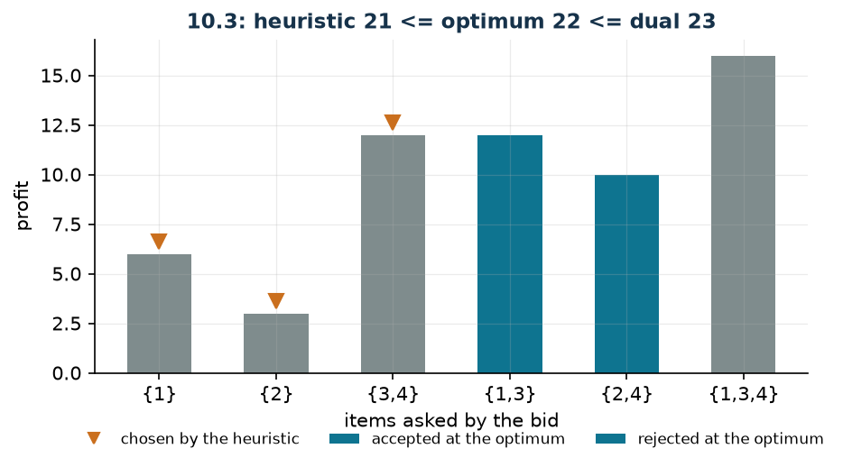

# Combinatorial auction

**Class:** BIP · **Links:** set packing by rows · **Script:** `python/fam10_2_auction.py`

[](https://colab.research.google.com/github/fabiofurini/mip-modelling/blob/main/notebooks/fam10_2_auction.ipynb)

!!! abstract "Problem 10.2"
    An auctioneer has a set $S = \{1, 2, \dots, n\}$ of $n \in \mathbb{Z}_{\ge 1}$
    items to sell and has received $r \in \mathbb{Z}_{\ge 1}$ bids. For every bid
    $j \in \{1, \dots, r\}$, the set $B_j \subseteq S$ is the subset of items
    requested and $p_j \in \mathbb{Q}_{>0}$ the profit in euros if the bid is
    accepted. Every item can be sold at most once, and a bid can be accepted only
    if all its items are available. The auctioneer wants to choose a set of bids
    of maximum total profit.

**The problem in words.** We *decide* which bids to accept. *The objective*:
maximum profit. *The constraint*: two accepted bids cannot ask for the same
item. A bid is all-or-nothing: no part of it is accepted.

## Model

**Variables.** A single family of $r$ binaries: $x_j \in \{0,1\}$ equals $1$ if
bid $j$ is accepted.

$$
\begin{aligned}
\max ~~ & \sum_{j=1}^{r} p_j\, x_j\\
\text{s.t.} \quad & \sum_{j :\, i \in B_j} x_j \le 1, && \forall i \in S,\\
& x_j \in \{0,1\}, && \forall j \in \{1, \dots, r\}.
\end{aligned}
$$

**Description.** The objective adds up the profits of the accepted bids. It is a
pure **set packing**: one constraint per item ($n$ linear constraints) and one
variable per bid. The constraint of item $i$ says that the item is sold at most
once, and hence that two bids competing for it cannot both be accepted.

!!! tip "By rows, not by pairs"
    An alternative, and worse, way of writing the same constraint is to list all
    the *pairs* of conflicting bids: $x_j + x_{j'} \le 1$ for every $j \ne j'$
    with $B_j \cap B_{j'} \ne \emptyset$. On the instance that would be nine
    constraints instead of four, and on real instances the number of pairs grows
    like $r^2$ while the per-item constraints stay $n$. The row form is also
    tighter: if three bids all ask for item $i$, the row constraint says
    $x_1 + x_2 + x_3 \le 1$, whereas the three pairwise inequalities admit
    $x_1 = x_2 = x_3 = 1/2$.

## The model in gurobipy

```python
m = gp.Model("auction")
x = m.addVars(r, vtype=GRB.BINARY, name="x")
m.setObjective(gp.quicksum(p[j] * x[j] for j in range(r)), GRB.MAXIMIZE)
m.addConstrs((gp.quicksum(x[j] for j in range(r) if i in B[j]) <= 1
              for i in range(n)), name="item")
```

## The instance

$n = 4$ items, $r = 6$ bids.

| | $j=1$ | $j=2$ | $j=3$ | $j=4$ | $j=5$ | $j=6$ |
|---|---:|---:|---:|---:|---:|---:|
| $B_j$ | $\{1\}$ | $\{2\}$ | $\{3,4\}$ | $\{1,3\}$ | $\{2,4\}$ | $\{1,3,4\}$ |
| $p_j$ | 6 | 3 | 12 | 12 | 10 | 16 |

Written out, the model of the instance is

$$\max ~ 6 x_1 + 3 x_2 + 12 x_3 + 12 x_4 + 10 x_5 + 16 x_6$$

subject to

$$
\begin{aligned}
x_1 + x_4 + x_6 &\le 1 && \text{(item 1)},\\
x_2 + x_5 &\le 1 && \text{(item 2)},\\
x_3 + x_4 + x_6 &\le 1 && \text{(item 3)},\\
x_3 + x_5 + x_6 &\le 1 && \text{(item 4)},
\end{aligned}
$$

with $x_j \in \{0,1\}$.

## Constructive heuristic: the primal bound

The problem is a maximisation, so the heuristic gives the **primal** bound,
which sits below the optimum. The bids are sorted by decreasing profit *per
item* and those whose items are still free are accepted. The running time is
$O(r \log r + r\, n)$.

On the instance the ratios are $6$, $3$, $6$, $6$, $5$ and
$16/3 \approx 5.33$, so the order is $1, 3, 4, 6, 5, 2$:

- bid 1 $\{1\}$: accepted (profit 6);
- bid 3 $\{3,4\}$: accepted (profit 12);
- bid 4 $\{1,3\}$: rejected, items $1$ and $3$ are already sold;
- bid 6 $\{1,3,4\}$: rejected;
- bid 5 $\{2,4\}$: rejected, item $4$ is already sold;
- bid 2 $\{2\}$: accepted (profit 3).

Bids $1, 2, 3$ are accepted: $z(\mathrm{MILP}) \ge \mathit{LB} = 21$.

## LP relaxation and dual: the dual bound

Associate a non-negative dual variable $\lambda_i$ with each item constraint.

$$
\begin{aligned}
\min ~~ & \sum_{i \in S} \lambda_i\\
\text{s.t.} \quad & \sum_{i \in B_j} \lambda_i \ge p_j, && \forall j \in \{1, \dots, r\},\\
& \lambda_i \ge 0, && \forall i \in S.
\end{aligned}
$$

**Description.** $\lambda_i$ is the price the auctioneer puts on item $i$. The
objective is the total value of the lots at those prices. The constraints are
the columns of the $x_j$, one per bid: the items bid $j$ asks for, priced at
those values, must be worth at least what the bid pays. In short, no bid may
turn out to be a bargain.

**Recipe.** Spread the profit of every bid over its items and take, for each
item, the maximum over the bids that ask for it,

$$\bar\lambda_i = \max_{j :\, i \in B_j} \frac{p_j}{|B_j|} .$$

Feasibility is immediate: for every bid $j$,

$$\sum_{i \in B_j} \bar\lambda_i \;\ge\; |B_j| \cdot \frac{p_j}{|B_j|} = p_j .$$

On the instance $\bar\lambda = (6, 5, 6, 6)$ and
$z(\mathrm{MILP}) \le \mathit{UB} = 23$.

!!! warning "A coarse recipe costs a lot"
    The "obvious" recipe $\bar\lambda_i = \max_{j :\, i \in B_j} p_j$ (without
    dividing by $|B_j|$) is feasible too, but gives $16 + 10 + 16 + 16 = 58$:
    more than twice as much. Dividing by the cardinality of the requested set is
    what makes the bound useful. It is worth trying several recipes and keeping
    the best: they are all valid, not all informative.

## Optimal solution

At the optimum bids $4$ ($\{1,3\}$, profit $12$) and $5$ ($\{2,4\}$, profit
$10$) are accepted: all four items are sold.

| $LB$ (heuristic) | $z(\mathrm{MILP})$ | $z(\mathrm{LP})$ | $z(\mathrm{LP}^+)$ | $UB$ (dual) | gap |
|---:|---:|---:|---:|---:|---:|
| 21 | 22 | 22 | 22 | 23 | $4.5\%$ |



The auctioneer sells everything, but not because a constraint forces it: the
constraints are $\le$, not $=$. With other bids the optimal solution might leave
items on the shelf.

## Additional considerations

- The valid inequalities $x_j \le 1$ are implied by the item constraints
  whenever $B_j \ne \emptyset$: indeed $z(\mathrm{LP}) = z(\mathrm{LP}^+) = 22$.
- On this instance one also has $z(\mathrm{LP}) = z(\mathrm{MILP})$: the
  relaxation lands on an integer vertex. That is luck, not a property of set
  packing. The minimal counterexample is the **triangle**: three items and three
  bids asking for two each, all of profit $1$. There
  $z(\mathrm{LP}) = 3/2$ (with $x = 1/2$ on all three) against
  $z(\mathrm{MILP}) = 1$.
- Set packing is NP-hard in general, but becomes easy when the incidence matrix
  is *perfect* or *balanced*. The triangle is the smallest non-perfect graph in
  this sense, and it is why *clique inequalities* are the classical cuts for this
  family.

## Additional modelling questions

??? question "10.2.1 — Bids from the same participant"
    Bids $4$ and $5$ come from the same participant, who may win at most one of
    them. How does the model change? What is the new optimum?

    !!! tip "Solution"
        The solution is in the solutions document, reserved for teachers.

??? question "10.2.2 — Limited deliveries"
    In this round the auctioneer can deliver at most two items in total. How
    does the model change? What is the new optimum?

    !!! tip "Solution"
        The solution is in the solutions document, reserved for teachers.

## Code

Complete script —
[`python/fam10_2_auction.py`](https://github.com/fabiofurini/mip-modelling/blob/main/python/fam10_2_auction.py)
(reproducible with `python3 python/fam10_2_auction.py` from the `python/`
folder). Notebook —
[`notebooks/fam10_2_auction.ipynb`](https://github.com/fabiofurini/mip-modelling/blob/main/notebooks/fam10_2_auction.ipynb)
— which opens in Colab from the badge at the top of the page.

<!-- embedded-script: begin (regenerated by python/embed_code.py) -->

??? example "Show the complete script — `python/fam10_2_auction.py` (187 lines)"

    ```python
    """Problem 10.3 -- Combinatorial auction (set packing).

    An auctioneer has n items and receives r bids: bid j asks for the subset B_j and
    pays p_j, and it is all or nothing. This is pure set packing: one constraint per
    item, one variable per bid. Since it is a maximisation, the heuristic gives the
    lower bound and the hand-built dual the upper one: the roles swap with respect to
    10.1 and 10.2.
    """
    import gurobipy as gp
    import pandas as pd
    from gurobipy import GRB

    from mip import (ammissibile, due_rilassamenti, frazione, nuovo_modello, registra_bound,
                     risolvi, stampa_lp, valuta)
    from stile import ARANCIO, GRIGIO, TEAL, intestazione, plt, salva_dati, salva_figura

    R = range

    # ---------- 1. MODEL AND INSTANCE ----------
    intestazione("10.3 Combinatorial auction: choosing the bids of maximum profit")
    n3 = 4                                                     # items for sale
    B3 = [[0], [1], [2, 3], [0, 2], [1, 3], [0, 2, 3]]         # items asked by each bid
    p3 = [6, 3, 12, 12, 10, 16]                                # profit of the bid
    r3 = len(p3)
    salva_dati(pd.DataFrame({"bid": [j + 1 for j in R(r3)],
                             "items": ["{" + ",".join(str(i + 1) for i in B3[j]) + "}"
                                       for j in R(r3)],
                             "profit": p3}), "asta3_dati")


    def modello_3(n, B, p, extra=None):
        r = len(p)
        m = nuovo_modello("auction")
        x = m.addVars(r, vtype=GRB.BINARY, name="x")           # 1 if the bid is accepted
        m.setObjective(gp.quicksum(p[j] * x[j] for j in R(r)), GRB.MAXIMIZE)
        m.addConstrs((gp.quicksum(x[j] for j in R(r) if i in B[j]) <= 1 for i in R(n)),
                     name="item")
        return m, x


    def duale_3(n, B, p):
        """min sum_i lam_i  s.t.  sum_{i in B_j} lam_i >= p_j for every bid j, lam >= 0.

        The dual has one variable per item: lam_i is the price the auctioneer puts on
        item i, and every bid must cost at least what it pays.
        """
        r = len(p)
        dl = nuovo_modello("dual_auction")
        lam = dl.addVars(n, name="lam")
        dl.setObjective(gp.quicksum(lam[i] for i in R(n)), GRB.MINIMIZE)
        dl.addConstrs((gp.quicksum(lam[i] for i in B[j]) >= p[j] for j in R(r)), name="bid")
        return dl, lam


    m3, x3 = modello_3(n3, B3, p3)
    print("  The model of the instance:")
    stampa_lp(m3)

    # ---------- 2. CONSTRUCTIVE HEURISTIC (LOWER BOUND) ----------
    # constructive heuristic on the profit per item: the most profitable bids are accepted among those
    # whose items are still free. Cost O(r log r + r n).
    def euristica(n, B, p):
        r = len(p)
        x = [0] * r
        libero = [True] * n
        passi = []
        for j in sorted(R(r), key=lambda j: (-p[j] / len(B[j]), j)):
            oggetti = "{" + ",".join(str(i + 1) for i in B[j]) + "}"
            occupati = [i + 1 for i in B[j] if not libero[i]]
            if occupati:
                passi.append(f"bid {j + 1} {oggetti}, {p[j] / len(B[j]):.4g} per item: "
                             f"rejected, items {occupati} are already sold")
                continue
            x[j] = 1
            for i in B[j]:
                libero[i] = False
            passi.append(f"bid {j + 1} {oggetti}, {p[j] / len(B[j]):.4g} per item: "
                         f"accepted (profit {p[j]})")
        return x, passi


    x_eur, passi = euristica(n3, B3, p3)
    for k, riga in enumerate(passi, 1):
        print(f"  Step {k}. {riga}")
    lb3 = sum(p3[j] * x_eur[j] for j in R(r3))
    sol_eur = {f"x[{j}]": x_eur[j] for j in R(r3)}
    assert ammissibile(m3, sol_eur), sol_eur
    accettate = [j + 1 for j in R(r3) if x_eur[j]]
    print(f"  Heuristic solution: bids {accettate}   lb = {frazione(lb3)}")

    # ---------- 3. LP RELAXATION AND DUAL (UPPER BOUND) ----------
    dl3, lam3 = duale_3(n3, B3, p3)
    # Hand recipe: spread every bid over its items and take the maximum,
    # lam_i = max_{j : i in B_j} p_j / |B_j|. It is always feasible because for every
    # bid j we have sum_{i in B_j} lam_i >= |B_j| * p_j / |B_j| = p_j.
    mano = {f"lam[{i}]": max(p3[j] / len(B3[j]) for j in R(r3) if i in B3[j]) for i in R(n3)}
    ub3, viol = valuta(dl3, mano)
    assert viol <= 1e-9, viol
    print("  Hand-built dual: lam_i = max_{j : i in B_j} p_j / |B_j| (the profit of every bid")
    print("  spread over its items; the sum over B_j is then at least p_j):")
    for i in R(n3):
        quote = ", ".join(f"{p3[j]}/{len(B3[j])}" for j in R(r3) if i in B3[j])
        print(f"    item {i + 1}: max({quote}) = {frazione(mano[f'lam[{i}]'])}")
    print(f"  ub = sum of the prices = {frazione(ub3)}")
    # for comparison: the recipe of the source notes, lam_i = max p_j over the bids
    grezza = {f"lam[{i}]": max(p3[j] for j in R(r3) if i in B3[j]) for i in R(n3)}
    ub_grezzo, viol_g = valuta(dl3, grezza)
    assert viol_g <= 1e-9
    print(f"  (with the cruder recipe lam_i = max_j p_j one would only get "
          f"{frazione(ub_grezzo)})")
    zlp3, zlp3r, _ = due_rilassamenti(m3, dl3)

    # ---------- 4. OPTIMUM OF THE MILP ----------
    z3 = risolvi(m3)
    ottime = [j + 1 for j in R(r3) if x3[j].X > 0.5]
    venduti = sorted({i + 1 for j in R(r3) if x3[j].X > 0.5 for i in B3[j]})
    print(f"  Optimal solution: bids {ottime}, items sold {venduti}, profit {frazione(z3)}")
    invenduti = [i + 1 for i in R(n3) if i + 1 not in venduti]
    print(f"  Unsold items: {invenduti if invenduti else 'none'}. The auctioneer sells everything,")
    print("  but not because a constraint forces it: the constraints are <=, not =. With other")
    print("  bids the optimal solution could leave items on the shelf.")
    riga = registra_bound("3 auction", ub3, lb3, zlp3, zlp3r, z3, senso="max")
    salva_dati(pd.DataFrame([riga]), "asta3_bound")
    assert lb3 <= z3 <= zlp3r <= zlp3 <= ub3 + 1e-9

    # ---------- 5. THE TWO RELAXATIONS AND INTEGRALITY ----------
    intestazione("10.3 The two relaxations and the integrality of the relaxation")
    print(f"  z(LP) = {frazione(zlp3)} and z(LP+) = {frazione(zlp3r)} coincide: the constraints")
    print("  sum_{j : i in B_j} x_j <= 1 already imply x_j <= 1 for every bid with a non-empty")
    print("  B_j. The valid inequalities x_j <= 1 are therefore redundant and do not strengthen.")
    assert abs(zlp3 - zlp3r) <= 1e-9
    print(f"  On this instance we also have z(LP) = z(MILP) = {frazione(z3)}: the relaxation")
    print("  lands on an integer vertex. That is a lucky feature of the instance, not a property")
    print("  of set packing. The minimal counterexample is the triangle: three items and three")
    print("  bids asking for two of them each, all with profit 1.")
    m_tri, _ = modello_3(3, [[0, 1], [1, 2], [0, 2]], [1, 1, 1])
    dl_tri, _ = duale_3(3, [[0, 1], [1, 2], [0, 2]], [1, 1, 1])
    z_tri = risolvi(m_tri)
    zlp_tri, zlp_tri_r, _ = due_rilassamenti(m_tri, dl_tri)
    print(f"  Triangle: z(LP) = {frazione(zlp_tri)} (x = 1/2 on all three) against "
          f"z(MILP) = {frazione(z_tri)}.")
    assert zlp_tri > z_tri + 1e-9
    salva_dati(pd.DataFrame([{"instance": "auction 10.3", "z_lp": zlp3, "z_milp": z3},
                             {"instance": "triangle", "z_lp": zlp_tri, "z_milp": z_tri}]),
               "asta3_triangolo")

    # ---------- 6. ADDITIONAL MODELLING QUESTIONS ----------
    varianti = {}


    def variante(nome, m):
        z = risolvi(m)
        print(f"  {nome:70s} z = {frazione(z)}")
        return z


    # 3a: bids 4 and 5 come from the same bidder, who can win at most one
    m, x = modello_3(n3, B3, p3)
    m.addConstr(x[3] + x[4] <= 1, name="same_bidder")
    varianti["3a"] = variante("3a. Bids 4 and 5 are from the same bidder (x4+x5 <= 1)", m)
    # 3b: the auctioneer delivers at most two items in this round
    m, x = modello_3(n3, B3, p3)
    m.addConstr(gp.quicksum(len(B3[j]) * x[j] for j in R(r3)) <= 2, name="deliveries")
    varianti["3b"] = variante("3b. At most two items are delivered (sum_j |B_j| x_j <= 2)", m)
    salva_dati(pd.DataFrame({"variant": list(varianti), "z": list(varianti.values())}),
               "asta3_varianti")

    # ---------- 7. FIGURE ----------
    fig, ax = plt.subplots(figsize=(6.8, 3.2))
    idx = list(R(r3))
    colori = [TEAL if x3[j].X > 0.5 else GRIGIO for j in idx]
    ax.bar(idx, p3, 0.55, color=colori)
    for j in idx:
        if x_eur[j]:
            ax.plot(j, p3[j] + 0.6, marker="v", color=ARANCIO, ms=8)
    ax.plot([], [], marker="v", ls="", color=ARANCIO, label="chosen by the heuristic")
    ax.bar([], [], color=TEAL, label="accepted at the optimum")
    ax.bar([], [], color=GRIGIO, label="rejected at the optimum")
    ax.set_xticks(idx)
    ax.set_xticklabels(["{" + ",".join(str(i + 1) for i in B3[j]) + "}" for j in idx])
    ax.set_xlabel("items asked by the bid")
    ax.set_ylabel("profit")
    ax.set_title(f"10.3: heuristic {frazione(lb3)} <= optimum {frazione(z3)} <= dual "
                 f"{frazione(ub3)}")
    ax.legend(fontsize=8, loc="upper left")
    salva_figura(fig, "cap10_asta_offerte")
    print("Done.")
    ```

<!-- embedded-script: end -->
