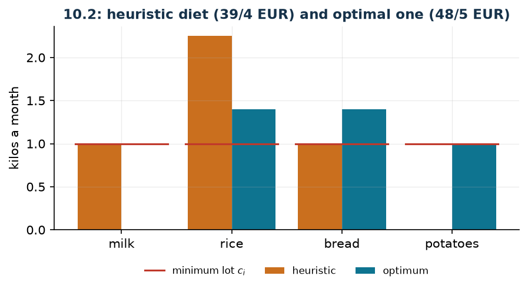

# Diet with a count of the foods and a minimum lot

**Class:** MILP · **Links:** minimum lot (semicontinuous), counting the types · **Script:** `python/fam10_3_diet.py`

[](https://colab.research.google.com/github/fabiofurini/mip-modelling/blob/main/notebooks/fam10_3_diet.ipynb)

!!! abstract "Problem 10.3"
    A nutritionist has to compose a monthly diet choosing among
    $s \in \mathbb{Z}_{\ge 1}$ foods and controlling $r \in \mathbb{Z}_{\ge 1}$
    nutrients. For every food $i \in \{1, \dots, s\}$, the value
    $w_i \in \mathbb{Q}_{>0}$ is the cost of one kilo; for every food $i$ and
    every nutrient $j \in \{1, \dots, r\}$, the value
    $g_{ij} \in \mathbb{Q}_{\ge 0}$ is the amount of nutrient $j$ contained in one
    kilo of food $i$. For every nutrient $j$, the monthly intake must lie between
    $a_j \in \mathbb{Q}_{>0}$ and $b_j \in \mathbb{Q}_{>0}$. If a food enters the
    diet, at least $c_i \in \mathbb{Q}_{>0}$ kilos and at most
    $d_i \in \mathbb{Q}_{>0}$ must be consumed. The diet must include at least
    $t \in \mathbb{Z}_{\ge 1}$ different foods. The cheapest diet is wanted.

**The problem in words.** We *decide* which foods to use and in what amounts.
*The objective*: minimum cost. *The constraints*: every nutrient within its
window; every chosen food in an amount between the minimum lot and the cap; at
least $t$ different foods.

## Model

**Variables.** $x_i \ge 0$ kilos of food $i$ consumed in the month;
$y_i \in \{0,1\}$ equals $1$ if food $i$ enters the diet.

$$
\begin{aligned}
\min ~~ & \sum_{i=1}^{s} w_i\, x_i\\
\text{s.t.} \quad & \sum_{i=1}^{s} g_{ij}\, x_i \ge a_j, && \forall j \in \{1, \dots, r\},\\
& \sum_{i=1}^{s} g_{ij}\, x_i \le b_j, && \forall j \in \{1, \dots, r\},\\
& x_i - c_i\, y_i \ge 0, && \forall i \in \{1, \dots, s\},\\
& x_i - d_i\, y_i \le 0, && \forall i \in \{1, \dots, s\},\\
& \sum_{i=1}^{s} y_i \ge t,\\
& x_i \ge 0, \quad y_i \in \{0,1\}, && \forall i \in \{1, \dots, s\}.
\end{aligned}
$$

**Description.** The objective is the total cost. The **minimum requirement**
constraints, one per nutrient, impose the lower threshold; the **cap**
constraints, again one per nutrient, the upper one. The **minimum lot** and
**activation** constraints, one per food each, make $x_i$ semicontinuous: either
zero, or between $c_i$ and $d_i$. The **variety** constraint, a single one,
requires at least $t$ foods actually bought.

!!! note "Why the minimum lot is needed for the count"
    The variety constraint counts the indicators $y_i$, not the quantities. If
    only the activation constraint were there, the indicator could be $1$ with
    $x_i = 0$: foods would be "switched on" without a gram being consumed, and
    the variety constraint would be satisfied by empty indicators. It is the
    one-way link of the [if and only if](links-10.md) technique, and here it
    produces a model that does not describe the problem.

    The minimum lot closes the circle: with $y_i = 1$ one has $x_i \ge c_i > 0$,
    so every switched-on indicator corresponds to a food actually consumed. On
    the instance, setting $c_i = 0$ drops the optimum from $48/5$ to $46/5$ and
    the solution "switches on" four foods, two of them with zero quantity: the
    count no longer says anything.

## The model in gurobipy

```python
m = gp.Model("diet")
x = m.addVars(s, name="x")
y = m.addVars(s, vtype=GRB.BINARY, name="y")
m.setObjective(gp.quicksum(w[i] * x[i] for i in range(s)), GRB.MINIMIZE)
m.addConstrs((gp.quicksum(g[i][j] * x[i] for i in range(s)) >= a[j] for j in range(r)),
             name="minimum")
m.addConstrs((gp.quicksum(g[i][j] * x[i] for i in range(s)) <= b[j] for j in range(r)),
             name="maximum")
m.addConstrs((x[i] - c[i] * y[i] >= 0 for i in range(s)), name="minimum_lot")
m.addConstrs((x[i] - d[i] * y[i] <= 0 for i in range(s)), name="activate")
m.addConstr(gp.quicksum(y[i] for i in range(s)) >= t, name="variety")
```

## The instance

$s = 4$ foods, $r = 2$ nutrients, $c_i = 1$, $d_i = 8$, $t = 3$.

| | milk | rice | bread | potatoes |
|---|---:|---:|---:|---:|
| $w_i$ (euro/kg) | 2 | 3 | 1 | 4 |
| iron (g/kg) | 10 | 20 | 5 | 25 |
| calcium (g/kg) | 5 | 10 | 15 | 5 |

| | iron | calcium |
|---|---:|---:|
| $a_j$ | 60 | 40 |
| $b_j$ | 200 | 150 |

## Constructive heuristic: the primal bound

The $t$ cheapest foods are switched on at their minimum lot, then the residual
requirement of each nutrient is covered by adding the already-switched-on food
with the lowest cost per gram.

On the instance the three cheapest foods are bread ($1$), milk ($2$) and rice
($3$): they are switched on at the minimum lot, that is $1$ kg each. With these
amounts one has $35$ grams of iron (60 are needed) and $30$ of calcium (40 are
needed).

- **Iron:** $25$ grams are missing. Among the switched-on foods the lowest cost
  per gram of iron is rice, $3/20 = 0.15$; $1.25$ kg more are needed, and rice
  reaches $2.25$ kg.
- **Calcium:** after the addition one has $42.5$ grams, already above the
  minimum of $40$: nothing else is needed.

The final diet is milk $1$ kg, rice $2.25$ kg, bread $1$ kg, for a cost of
$z(\mathrm{MILP}) \le \mathit{UB} = 39/4 = 9.75$.

## LP relaxation and dual: the dual bound

Associate $\alpha_j \ge 0$ with the minima, $\beta_j \ge 0$ with the maxima,
$\lambda_i \ge 0$ with the minimum lots, $\mu_i \ge 0$ with the caps and
$\tau \ge 0$ with variety.

$$
\begin{aligned}
\max ~~ & \sum_{j=1}^{r} a_j\, \alpha_j - \sum_{j=1}^{r} b_j\, \beta_j + t\, \tau\\
\text{s.t.} \quad & \sum_{j=1}^{r} g_{ij}\,(\alpha_j - \beta_j) + \lambda_i - \mu_i \le w_i, && \forall i \in \{1, \dots, s\},\\
& -c_i\, \lambda_i + d_i\, \mu_i + \tau \le 0, && \forall i \in \{1, \dots, s\},\\
& \alpha_j \ge 0, \quad \beta_j \ge 0, \quad \lambda_i \ge 0, \quad \mu_i \ge 0, \quad \tau \ge 0.
\end{aligned}
$$

**Description.** $\alpha_j$ is the price of one unit of nutrient $j$ when it
serves to reach the minimum requirement, $\beta_j$ what is paid not to exceed
the cap, $\lambda_i$ and $\mu_i$ the prices of the two semicontinuity
constraints of food $i$, and $\tau$ the price of variety. The objective collects
the requirements priced at $\alpha$, pays the caps priced at $\beta$ and
collects the threshold $t$ priced at $\tau$. The first group of constraints are
the columns of the $x_i$: the nutritional content of one kilo of food $i$,
priced at $\alpha_j - \beta_j$ and corrected by the two semicontinuity
constraints, cannot exceed the price $w_i$ of that food. The second are the
columns of the $y_i$: switching on food $i$ grants $c_i$ units of minimum lot at
price $\lambda_i$, forces at most $d_i$ at price $\mu_i$, and must cover the
price $\tau$ of variety.

**Recipe.** Set $\beta = \mu = \tau = 0$: caps and variety are not priced, and
the constraints on the $y_i$ become $-c_i\, \lambda_i \le 0$, satisfied with
$\lambda = 0$. What remains is $\sum_j g_{ij}\, \alpha_j \le w_i$ for every
food: price *one* nutrient only, at the lowest cost per gram among the foods,

$$\bar\alpha_j = \min_{i :\, g_{ij} > 0} \frac{w_i}{g_{ij}},
\qquad \text{bound} = a_j\, \bar\alpha_j ,$$

and keep the nutrient that gives the larger bound. On the instance iron gives
$60 \cdot 3/20 = 9$ and calcium $40 \cdot 1/15 = 8/3$: iron wins, and
$z(\mathrm{MILP}) \ge \mathit{LB} = 9$.

## Optimal solution

The optimal diet is rice $1.4$ kg, bread $1.4$ kg, potatoes $1$ kg: three
different foods, as required, with $60$ grams of iron (exactly the minimum) and
$40$ of calcium (again exactly the minimum).

| $LB$ (dual) | $z(\mathrm{LP})$ | $z(\mathrm{LP}^+)$ | $z(\mathrm{MILP})$ | $UB$ (heuristic) | gap |
|---:|---:|---:|---:|---:|---:|
| 9 | $46/5$ | $48/5$ | $48/5$ | $39/4$ | $1.6\%$ |



It is the tightest sandwich in the chapter. Here the relaxation with the bounds
coincides with the integer optimum, while the one without them sits below:
adding $y_i \le 1$ matters, because the caps $d_i = 8$ are far wider than the
quantities at play and without that limit the relaxation would use fractional
indicators greater than one.

## Additional considerations

- The maximum constraints are not active at the optimum ($60 \le 200$ and
  $40 \le 150$): on this instance they could be dropped without changing
  anything. They stay in the model because the problem requires them, and
  because on other instances they would bite.
- The classical form of the diet problem (Stigler, 1945) has neither minimum
  lots nor counts: it is a pure LP. It is exactly the two integer additions that
  make it a MILP, and that is why the problem belongs to this chapter.
- The variety constraint could also be written as a **covering** one: at least
  one food from each food group, that is $\sum_{i \in G_k} y_i \ge 1$ for every
  group $k$. It is a nutritionally more informative formulation, and no harder.

## Additional modelling questions

??? question "10.3.1 — A higher minimum lot"
    The minimum lot rises from $1$ to $2$ kilos for every chosen food. How does
    the model change? What is the new optimum?

    !!! tip "Solution"
        The solution is in the solutions document, reserved for teachers.

??? question "10.3.2 — More variety"
    At least four different foods are wanted instead of three. How does the
    model change? What is the new optimum?

    !!! tip "Solution"
        The solution is in the solutions document, reserved for teachers.

## Code

Complete script —
[`python/fam10_3_diet.py`](https://github.com/fabiofurini/mip-modelling/blob/main/python/fam10_3_diet.py)
(reproducible with `python3 python/fam10_3_diet.py` from the `python/` folder).
Notebook —
[`notebooks/fam10_3_diet.ipynb`](https://github.com/fabiofurini/mip-modelling/blob/main/notebooks/fam10_3_diet.ipynb)
— which opens in Colab from the badge at the top of the page.

<!-- embedded-script: begin (regenerated by python/embed_code.py) -->

??? example "Show the complete script — `python/fam10_3_diet.py` (189 lines)"

    ```python
    """Problem 10.2 -- Diet with a count of the foods and a minimum lot.

    A classic diet (continuous quantities, two-sided nutritional constraints) with
    three integer techniques on top: activation (3.2), minimum lot (3.3) and counting
    of the types (3.11). Without the minimum lot the count "at least t different
    foods" would be empty: indicators would switch on with zero quantity.
    """
    import gurobipy as gp
    import pandas as pd
    from gurobipy import GRB

    from mip import (ammissibile, due_rilassamenti, frazione, nuovo_modello, registra_bound,
                     rilassamento, risolvi, valuta)
    from stile import ARANCIO, BLU, ROSSO, TEAL, VERDE, intestazione, plt, salva_dati, salva_figura

    R = range

    # ---------- 1. MODEL AND INSTANCE ----------
    intestazione("10.2 Diet: minimum cost with at least t different foods and a minimum lot")
    CIBI = ["milk", "rice", "bread", "potatoes"]
    NUTRIENTI = ["iron", "calcium"]
    w2 = [2, 3, 1, 4]                      # cost per kilo
    g2 = [[10, 5], [20, 10], [5, 15], [25, 5]]   # grams of nutrient j per kilo of food i
    a2 = [60, 40]                          # monthly minimum of each nutrient
    b2 = [200, 150]                        # monthly maximum
    c2 = [1, 1, 1, 1]                      # minimum quantity if the food is chosen
    d2 = [8, 8, 8, 8]                      # maximum quantity
    t2 = 3                                 # at least three different foods
    s2, r2 = len(w2), len(a2)
    salva_dati(pd.DataFrame({"food": CIBI, "cost": w2,
                             "iron": [g[0] for g in g2], "calcium": [g[1] for g in g2],
                             "min": c2, "max": d2}), "dieta2_dati")


    def modello_2(w, g, a, b, c, d, t):
        s, r = len(w), len(a)
        m = nuovo_modello("diet")
        x = m.addVars(s, name="x")                        # kilos of each food
        y = m.addVars(s, vtype=GRB.BINARY, name="y")      # food present in the diet
        m.setObjective(gp.quicksum(w[i] * x[i] for i in R(s)), GRB.MINIMIZE)
        m.addConstrs((gp.quicksum(g[i][j] * x[i] for i in R(s)) >= a[j] for j in R(r)),
                     name="minimum")
        m.addConstrs((gp.quicksum(g[i][j] * x[i] for i in R(s)) <= b[j] for j in R(r)),
                     name="maximum")
        m.addConstrs((x[i] - c[i] * y[i] >= 0 for i in R(s)), name="minimum_lot")
        m.addConstrs((x[i] - d[i] * y[i] <= 0 for i in R(s)), name="activate")
        m.addConstr(gp.quicksum(y[i] for i in R(s)) >= t, name="variety")
        return m, x, y


    def duale_2(w, g, a, b, c, d, t):
        """max sum_j a_j alpha_j - sum_j b_j beta_j + t tau
           s.t.  sum_j g_ij (alpha_j - beta_j) + lam_i - mu_i <= w_i        (column x_i)
                 -c_i lam_i + d_i mu_i + tau <= 0                            (column y_i)
                 alpha, beta, lam, mu, tau >= 0."""
        s, r = len(w), len(a)
        dl = nuovo_modello("dual_diet")
        alpha = dl.addVars(r, name="alpha")
        beta = dl.addVars(r, name="beta")
        lam = dl.addVars(s, name="lam")
        mu = dl.addVars(s, name="mu")
        tau = dl.addVar(name="tau")
        dl.setObjective(gp.quicksum(a[j] * alpha[j] for j in R(r))
                        - gp.quicksum(b[j] * beta[j] for j in R(r)) + t * tau, GRB.MAXIMIZE)
        dl.addConstrs((gp.quicksum(g[i][j] * (alpha[j] - beta[j]) for j in R(r))
                       + lam[i] - mu[i] <= w[i] for i in R(s)), name="rc_x")
        dl.addConstrs((-c[i] * lam[i] + d[i] * mu[i] + tau <= 0 for i in R(s)), name="rc_y")
        return dl


    m2, x2, y2 = modello_2(w2, g2, a2, b2, c2, d2, t2)

    # ---------- 2. CONSTRUCTIVE HEURISTIC (UPPER BOUND) ----------
    # constructive heuristic: start from the minimum lot of the t cheapest foods, then cover the residual
    # requirement with the food that has the lowest cost per gram
    def euristica(w, g, a, b, c, d, t):
        s, r = len(w), len(a)
        x = [0.0] * s
        scelti = sorted(R(s), key=lambda i: (w[i], i))[:t]
        for i in scelti:
            x[i] = c[i]
        passi = [f"the {t} cheapest foods are switched on at their minimum lot: "
                 + ", ".join(f"{CIBI[i]} ({c[i]} kg)" for i in scelti)]
        for j in R(r):
            while sum(g[i][j] * x[i] for i in R(s)) < a[j] - 1e-9:
                # the food, already switched on, with the lowest cost per gram of nutrient j
                cand = [i for i in scelti if g[i][j] > 0 and x[i] < d[i] - 1e-9]
                if not cand:
                    return None, passi + [f"no active food can cover the {NUTRIENTI[j]}"]
                i = min(cand, key=lambda i: w[i] / g[i][j])
                manca = a[j] - sum(g[k][j] * x[k] for k in R(s))
                aggiunta = min(manca / g[i][j], d[i] - x[i])
                x[i] += aggiunta
                passi.append(f"{NUTRIENTI[j]}: {manca:.4g} g are missing; {aggiunta:.4g} kg of "
                             f"{CIBI[i]} are added (cost per gram {w[i] / g[i][j]:.4g})")
        return x, passi


    x_eur, passi = euristica(w2, g2, a2, b2, c2, d2, t2)
    for k, riga in enumerate(passi, 1):
        print(f"  Step {k}. {riga}")
    ub2 = sum(w2[i] * x_eur[i] for i in R(s2))
    sol_eur = {f"x[{i}]": x_eur[i] for i in R(s2)} | {f"y[{i}]": 1 if x_eur[i] > 1e-9 else 0
                                                     for i in R(s2)}
    assert ammissibile(m2, sol_eur), sol_eur
    print("  Heuristic solution: " + ", ".join(f"{CIBI[i]} {x_eur[i]:.4g} kg" for i in R(s2)
                                               if x_eur[i] > 1e-9)
          + f"   ub = {frazione(ub2)}")

    # ---------- 3. LP RELAXATION AND DUAL (LOWER BOUND) ----------
    dl2 = duale_2(w2, g2, a2, b2, c2, d2, t2)
    # recipe: beta = mu = tau = 0 (maxima, caps and variety are not priced);
    # a single nutrient is priced, at the lowest cost per gram among the foods
    mano, migliore, scelto = {}, -1.0, None
    for j in R(r2):
        prova = {f"alpha[{jj}]": (min(w2[i] / g2[i][jj] for i in R(s2) if g2[i][jj] > 0)
                                  if jj == j else 0.0) for jj in R(r2)}
        val, viol = valuta(dl2, prova)
        if viol <= 1e-9 and val > migliore:
            migliore, scelto, mano = val, j, prova
    lb2, viol = valuta(dl2, mano)
    assert viol <= 1e-9, viol
    print("  Hand-built dual: beta = mu = tau = 0 (maxima, caps and variety are not priced) and")
    print("  a single positive alpha_j, equal to the lowest cost per gram among the foods:")
    for j in R(r2):
        prezzo = min(w2[i] / g2[i][j] for i in R(s2) if g2[i][j] > 0)
        print(f"    {NUTRIENTI[j]}: price {frazione(prezzo)} EUR/g  ->  a_j * price = "
              f"{frazione(a2[j] * prezzo)}")
    print(f"  The best one is {NUTRIENTI[scelto]}:  lb = {frazione(lb2)}")
    zlp2, zlp2r, _ = due_rilassamenti(m2, dl2)

    # ---------- 4. OPTIMUM OF THE MILP ----------
    z2 = risolvi(m2)
    print("  Optimal solution: " + ", ".join(f"{CIBI[i]} {x2[i].X:.4g} kg" for i in R(s2)
                                             if x2[i].X > 1e-9)
          + f"   ({int(sum(y2[i].X for i in R(s2)))} different foods, {t2} required)")
    for j in R(r2):
        print(f"    {NUTRIENTI[j]}: {sum(g2[i][j] * x2[i].X for i in R(s2)):.4g} g "
              f"(between {a2[j]} and {b2[j]})")
    riga = registra_bound("2 diet", ub2, lb2, zlp2, zlp2r, z2)
    salva_dati(pd.DataFrame([riga]), "dieta2_bound")
    assert lb2 <= zlp2 <= z2 <= ub2 + 1e-9

    # ---------- 5. WITHOUT THE MINIMUM LOT THE COUNT IS EMPTY ----------
    intestazione("10.2 Why the count needs the minimum lot")
    m, x, y = modello_2(w2, g2, a2, b2, [0] * s2, d2, t2)   # c_i = 0: no minimum lot
    z_senza = risolvi(m)
    accesi = [CIBI[i] for i in R(s2) if y[i].X > 0.5]
    vuoti = [CIBI[i] for i in R(s2) if y[i].X > 0.5 and x[i].X < 1e-9]
    print(f"  With c_i = 0 the optimum drops to {frazione(z_senza)} and the 'active' foods are "
          f"{accesi},")
    print(f"  but of these the following have zero quantity: {vuoti}. The variety constraint is")
    print("  satisfied by empty indicators: without a minimum lot the count says nothing.")
    assert vuoti, "with c = 0 empty indicators must appear"

    # ---------- 6. ADDITIONAL MODELLING QUESTIONS ----------
    varianti = {}


    def variante(nome, m):
        z = risolvi(m)
        print(f"  {nome:70s} z = {frazione(z)}")
        return z


    # 2a: the minimum lot rises to 2 kg for every chosen food
    m, x, y = modello_2(w2, g2, a2, b2, [2] * s2, d2, t2)
    varianti["2a"] = variante("2a. The minimum lot rises to 2 kg per food (c_i = 2)", m)
    # 2b: at least four different foods are wanted
    m, x, y = modello_2(w2, g2, a2, b2, c2, d2, 4)
    varianti["2b"] = variante("2b. At least four different foods are wanted (t = 4)", m)
    salva_dati(pd.DataFrame({"variant": list(varianti), "z": list(varianti.values())}),
               "dieta2_varianti")

    # ---------- 7. FIGURE ----------
    fig, ax = plt.subplots(figsize=(6.8, 3.0))
    idx = list(R(s2))
    ax.bar([i - 0.2 for i in idx], [x_eur[i] for i in idx], 0.4, color=ARANCIO, label="heuristic")
    ax.bar([i + 0.2 for i in idx], [x2[i].X for i in idx], 0.4, color=TEAL, label="optimum")
    for i in idx:
        ax.plot([i - 0.42, i + 0.42], [c2[i], c2[i]], color=ROSSO, lw=1.5)
    ax.plot([], [], color=ROSSO, lw=1.5, label="minimum lot $c_i$")
    ax.set_xticks(idx)
    ax.set_xticklabels(CIBI)
    ax.set_ylabel("kilos a month")
    ax.set_title(f"10.2: heuristic diet ({frazione(ub2)} EUR) and optimal one ({frazione(z2)} EUR)")
    ax.legend(fontsize=8)
    salva_figura(fig, "cap10_dieta_ottimo")
    print("Done.")
    ```

<!-- embedded-script: end -->
