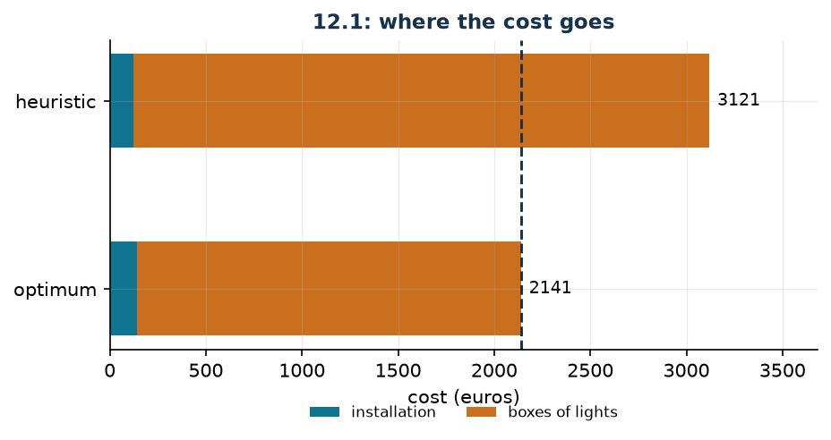

# Christmas trees and boxes of lights

**Class:** MILP · **Links:** availability across two levels, counting with an indicator · **Script:** `python/fam10_4_lights.py`

[](https://colab.research.google.com/github/fabiofurini/mip-modelling/blob/main/notebooks/fam10_4_lights.ipynb)

!!! abstract "Problem 10.4"
    The city council wants to decorate $q \in \mathbb{Z}_{\ge 1}$ trees for the
    holidays. Every tree can be decorated according to one of
    $n \in \mathbb{Z}_{\ge 1}$ possible configurations, each characterised by
    lights of $m \in \mathbb{Z}_{\ge 1}$ different colours. For every
    configuration $c \in \{1, \dots, n\}$ and every colour $l \in \{1, \dots, m\}$,
    the value $u_{cl} \in \mathbb{Z}_{\ge 0}$ is the number of lights of colour
    $l$ required by configuration $c$, and $i_c \in \mathbb{Q}_{>0}$ is the
    installation cost of a tree decorated that way. All the lights must be bought
    on the market, where they are sold in boxes of $k \in \mathbb{Z}_{\ge 1}$
    types: for every type $b \in \{1, \dots, k\}$ and every colour $l$, the value
    $v_{bl} \in \mathbb{Z}_{\ge 0}$ is the number of lights of colour $l$ in a box
    of type $b$, and $p_b \in \mathbb{Q}_{\ge 0}$ is its cost. To guarantee a
    pleasant visual variety, at least $f \in \mathbb{Z}_{\ge 1}$ different
    configurations must be used. The trees are to be decorated at minimum total
    cost.

**The problem in words.** We *decide* how many trees to decorate with each
configuration and how many boxes to buy of each type. *The objective*: minimum
total cost (installation plus boxes). *The constraints*: all the trees must be
decorated; the lights bought must cover those needed, colour by colour; at least
$f$ different configurations.

## Model

**Variables.** $x_c \in \mathbb{Z}_{\ge 0}$ trees decorated with configuration
$c$; $y_b \in \mathbb{Z}_{\ge 0}$ boxes bought of type $b$; $z_c \in \{0,1\}$
equals $1$ if configuration $c$ is used.

$$
\begin{aligned}
\min ~~ & \sum_{c=1}^{n} i_c\, x_c + \sum_{b=1}^{k} p_b\, y_b\\
\text{s.t.} \quad & \sum_{c=1}^{n} x_c = q,\\
& \sum_{b=1}^{k} v_{bl}\, y_b - \sum_{c=1}^{n} u_{cl}\, x_c \ge 0, && \forall l \in \{1, \dots, m\},\\
& \sum_{c=1}^{n} z_c \ge f,\\
& x_c - z_c \ge 0, && \forall c \in \{1, \dots, n\},\\
& x_c \in \mathbb{Z}_{\ge 0}, \quad y_b \in \mathbb{Z}_{\ge 0}, \quad z_c \in \{0,1\}.
\end{aligned}
$$

**Description.** The objective adds up the cost of the installations and that of
the boxes. The **trees** constraint, a single one, says that exactly $q$ trees
are decorated. The **lights** constraints, one per colour, say that the lights
bought cover those used. The **variety** constraint, a single one, imposes at
least $f$ different configurations. The **configuration used** constraints, one
per configuration, tie the indicator $z_c$ to the actual use of the
configuration.

!!! note "The link between the two levels"
    The lights constraint is an **availability**: for every colour, the lights
    bought must be at least those required. There is no big-M, because both
    sides are sums of real quantities. The count of the boxes comes from here:
    if the lights of colour $l$ required are $u_l$ and a box contains $v_{bl}$,
    buying only boxes of type $b$ would require $\lceil u_l / v_{bl} \rceil$
    boxes. The model never writes the ceiling: integrality produces it.

!!! note "The 'configuration used' link"
    The constraint reads $z_c \le x_c$. If $z_c = 1$ then $x_c \ge 1$: the
    configuration really is used on at least one tree. The converse is not
    imposed, and it is not needed: a minimisation objective has no interest in
    raising $z_c$, and the variety constraint forces it to do so exactly $f$
    times. No big-M is needed here because $x_c$ and $z_c$ are directly
    comparable: $x_c$ is a count, not a continuous quantity.

    A frequent mistake is writing $x_c \le M\, z_c$ thinking of activation: that
    would be the link in the *other* direction, and would impose that an unused
    configuration has $x_c = 0$ — true but useless, since it is already
    guaranteed by $\sum_c x_c = q$ and $x_c \ge 0$.

## The model in gurobipy

```python
m = gp.Model("lights")
x = m.addVars(nc, vtype=GRB.INTEGER, name="x")
y = m.addVars(nb, vtype=GRB.INTEGER, name="y")
z = m.addVars(nc, vtype=GRB.BINARY, name="z")
m.setObjective(gp.quicksum(i[c] * x[c] for c in range(nc))
               + gp.quicksum(p[b] * y[b] for b in range(nb)), GRB.MINIMIZE)
m.addConstr(x.sum() == q, name="trees")
m.addConstrs((gp.quicksum(v[b][l] * y[b] for b in range(nb))
              - gp.quicksum(u[c][l] * x[c] for c in range(nc)) >= 0
              for l in range(nl)), name="lights")
m.addConstr(z.sum() >= f, name="variety")
m.addConstrs((x[c] - z[c] >= 0 for c in range(nc)), name="used")
```

## The instance

$q = 20$ trees, $n = 3$ configurations, $m = 2$ colours, $k = 2$ box types,
$f = 2$.

| $u_{cl}$ | colour 1 | colour 2 | $i_c$ |
|---|---:|---:|---:|
| $c=1$ | 4 | 2 | 7 |
| $c=2$ | 2 | 3 | 6 |
| $c=3$ | 2 | 2 | 8 |

| $v_{bl}$ | colour 1 | colour 2 | $p_b$ |
|---|---:|---:|---:|
| $b=1$ | 10 | 2 | 100 |
| $b=2$ | 15 | 4 | 200 |

The price of one light depends on the colour and on the box type: colour 1 at
$10$ in box 1 and at $40/3$ in box 2; colour 2 at $50$ in both. Colour 2 is far
more expensive, and that is what drives the solution.

## Constructive heuristic: the primal bound

Two phases. First the configurations: $q - f + 1$ trees with the cheapest one to
install and one tree for each of the other $f - 1$, so that variety is satisfied
at minimum installation cost. Then the boxes: while some light is missing, buy
the box with the lowest price per missing light.

On the instance the cheapest configuration to install is $2$ (cost $6$), the
second is $1$ (cost $7$): $19$ trees are decorated with $2$ and one with $1$.
Then $42$ lights of colour 1 and $59$ of colour 2 are needed, and the heuristic
buys $30$ boxes of type 1. The total cost is
$z(\mathit{MILP}) \le \mathit{UB} = 3121$.

The heuristic picks the configuration that is cheapest to install, $2$, which is
however the greediest in lights of the expensive colour: the boxes pay the bill.
It is the typical mistake of a constructive heuristic that looks at one cost
item only.

## LP relaxation and dual: the dual bound

Associate $\alpha$ free with the trees constraint (an equality), $\beta_l \ge 0$
with the colours, $\gamma \ge 0$ with variety and $\delta_c \ge 0$ with the link.

$$
\begin{aligned}
\max ~~ & q\, \alpha + f\, \gamma\\
\text{s.t.} \quad & \alpha - \sum_{l=1}^{m} u_{cl}\, \beta_l + \delta_c \le i_c, && \forall c \in \{1, \dots, n\},\\
& \sum_{l=1}^{m} v_{bl}\, \beta_l \le p_b, && \forall b \in \{1, \dots, k\},\\
& \gamma - \delta_c \le 0, && \forall c \in \{1, \dots, n\},\\
& \alpha \gtreqless 0, \quad \beta_l \ge 0, \quad \gamma \ge 0, \quad \delta_c \ge 0.
\end{aligned}
$$

**Description.** $\alpha$ is the value of one decorated tree, $\beta_l$ the
price of one light of colour $l$, $\gamma$ the price of variety and $\delta_c$
that of the link between configuration $c$ and its indicator. The objective
prices the $q$ trees at $\alpha$ and the threshold $f$ at $\gamma$. The first
group of constraints are the columns of the $x_c$: using configuration $c$ on a
tree is worth $\alpha$, consumes $u_{cl}$ lights of each colour and releases
$\delta_c$, and the balance cannot exceed the installation cost $i_c$. The
second are the columns of the $y_b$: a box of type $b$ supplies $v_{bl}$ lights
of each colour, and their value cannot exceed the price $p_b$. The third are the
columns of the $z_c$: the price of variety cannot exceed that of the link which
makes it claimable.

**Recipe.** Set $\gamma = 0$ and $\delta_c = 0$: variety is not priced. The
constraints on the boxes bound $\beta$, those on the configurations bound
$\alpha$. Price *one* colour only, at the price per light no box can beat,

$$\bar\beta_l = \min_{b :\, v_{bl} > 0} \frac{p_b}{v_{bl}} ,
\qquad
\bar\alpha = \min_c \bigl( i_c + u_{cl}\, \bar\beta_l \bigr) :$$

every tree costs at least the installation of the most convenient
configuration, lights included. On the instance the best colour is $2$, where
both box types give the same price per light, $\bar\beta_2 = 50$:

$$i_1 + 2 \cdot 50 = 107, \qquad i_2 + 3 \cdot 50 = 156, \qquad i_3 + 2 \cdot 50 = 108 ,$$

so $\bar\alpha = 107$ and
$z(\mathit{MILP}) \ge \mathit{LB} = 20 \cdot 107 = 2140$.

## Optimal solution

$19$ trees are decorated with configuration 1 and one with 3, and $20$ boxes of
type 1 are bought. Of the lights, $78$ of colour 1 are needed ($200$ are bought:
many are left over) and $40$ of colour 2 (exactly $40$ are bought).

| $LB$ (dual) | $z(\mathit{LP})$ | $z(\mathit{LP}^+)$ | $z(\mathit{MILP})$ | $UB$ (heuristic) | gap |
|---:|---:|---:|---:|---:|---:|
| 2140 | 2140 | 2141 | 2141 | 3121 | $45.8\%$ |



The dual bound is off by **one** unit out of $2141$, and the relaxation with the
bounds is exact.

## Additional considerations

- Colour 1 is left over in abundance: the boxes are bought for colour 2, and
  colour 1 comes "for free". That is why the dual bound that prices colour 2
  only is almost exact.
- The trees constraint is an equality: all the trees must be decorated. If it
  were $\le q$ the problem would become trivial ($x = 0$ and zero cost); if it
  were $\ge q$ nothing would change, because decorating more trees costs more.
- The structure "two levels tied by an availability" reappears identically in
  *cutting stock* problems: below the pieces to cut, above the bars to buy.

## Additional modelling questions

??? question "10.4.1 — All the configurations"
    All three configurations are to appear. How does the model change? What is
    the new optimum?

    !!! tip "Solution"
        The solution is in the solutions document, reserved for teachers.

??? question "10.4.2 — A minimum lot per configuration"
    Every configuration used must decorate at least three trees (below that
    threshold it is not worth equipping the crew). How does the model change?
    What is the new optimum?

    !!! tip "Solution"
        The solution is in the solutions document, reserved for teachers.

## Code

Complete script —
[`python/fam10_4_lights.py`](https://github.com/fabiofurini/mip-modelling/blob/main/python/fam10_4_lights.py)
(reproducible with `python3 python/fam10_4_lights.py` from the `python/`
folder). Notebook —
[`notebooks/fam10_4_lights.ipynb`](https://github.com/fabiofurini/mip-modelling/blob/main/notebooks/fam10_4_lights.ipynb)
— which opens in Colab from the badge at the top of the page.

<!-- embedded-script: begin (regenerated by python/embed_code.py) -->

??? example "Show the complete script — `python/fam10_4_lights.py` (213 lines)"

    ```python
    """Problem 12.1 -- Christmas trees: configurations and boxes of lights.

    Two integer decisions tied by an availability constraint: how many lights are
    needed (from the chosen configurations) and how many are bought (from the boxes).
    On top of that, the variety constraint "at least f different configurations",
    which needs an indicator per configuration and the link with the count
    (technique 3.11).
    """
    import gurobipy as gp
    import pandas as pd
    from gurobipy import GRB

    from mip import (ammissibile, due_rilassamenti, frazione, nuovo_modello, registra_bound,
                     risolvi, valuta)
    from stile import ARANCIO, BLU, GRIGIO, TEAL, intestazione, plt, salva_dati, salva_figura

    R = range

    # ---------- 1. MODEL AND INSTANCE ----------
    intestazione("12.1 Christmas trees: configurations, lights and boxes")
    q1 = 20                          # trees to decorate
    i1 = [7, 6, 8]                   # installation cost of a configuration
    u1 = [[4, 2], [2, 3], [2, 2]]    # lights of colour l required by configuration c
    p1 = [100, 200]                  # cost of a box
    v1 = [[10, 2], [15, 4]]          # lights of colour l contained in a box of type b
    f1 = 2                           # different configurations required
    nc, nl, nb = len(i1), len(u1[0]), len(p1)
    salva_dati(pd.DataFrame({"configuration": R(1, nc + 1), "cost": i1,
                             "colour_1": [u[0] for u in u1], "colour_2": [u[1] for u in u1]}),
               "luci1_configurazioni")
    salva_dati(pd.DataFrame({"box": R(1, nb + 1), "cost": p1,
                             "colour_1": [v[0] for v in v1], "colour_2": [v[1] for v in v1]}),
               "luci1_scatole")


    def modello_1(q, i, u, p, v, f):
        nc, nl, nb = len(i), len(u[0]), len(p)
        m = nuovo_modello("lights")
        x = m.addVars(nc, vtype=GRB.INTEGER, name="x")        # trees with configuration c
        y = m.addVars(nb, vtype=GRB.INTEGER, name="y")        # boxes bought of type b
        z = m.addVars(nc, vtype=GRB.BINARY, name="z")         # configuration c used
        m.setObjective(gp.quicksum(i[c] * x[c] for c in R(nc))
                       + gp.quicksum(p[b] * y[b] for b in R(nb)), GRB.MINIMIZE)
        m.addConstr(x.sum() == q, name="trees")
        m.addConstrs((gp.quicksum(v[b][l] * y[b] for b in R(nb))
                      - gp.quicksum(u[c][l] * x[c] for c in R(nc)) >= 0 for l in R(nl)),
                     name="lights")
        m.addConstr(z.sum() >= f, name="variety")
        m.addConstrs((x[c] - z[c] >= 0 for c in R(nc)), name="used")
        return m, x, y, z


    def duale_1(q, i, u, p, v, f):
        """max q alpha + f gamma

        alpha free (equality on the trees), beta_l >= 0 (availability of the lights),
        gamma >= 0 (variety), delta_c >= 0 (link x_c >= z_c). Columns:
          x_c:  alpha - sum_l u_cl beta_l + delta_c <= i_c
          y_b:  sum_l v_bl beta_l <= p_b
          z_c:  gamma - delta_c <= 0
        """
        nc, nl, nb = len(i), len(u[0]), len(p)
        dl = nuovo_modello("dual_lights")
        alpha = dl.addVar(lb=-GRB.INFINITY, name="alpha")
        beta = dl.addVars(nl, name="beta")
        gamma = dl.addVar(name="gamma")
        delta = dl.addVars(nc, name="delta")
        dl.setObjective(q * alpha + f * gamma, GRB.MAXIMIZE)
        dl.addConstrs((alpha - gp.quicksum(u[c][l] * beta[l] for l in R(nl)) + delta[c] <= i[c]
                       for c in R(nc)), name="rcx")
        dl.addConstrs((gp.quicksum(v[b][l] * beta[l] for l in R(nl)) <= p[b] for b in R(nb)),
                      name="rcy")
        dl.addConstrs((gamma - delta[c] <= 0 for c in R(nc)), name="rcz")
        return dl


    m1, x1, y1, z1 = modello_1(q1, i1, u1, p1, v1, f1)
    print("  Price of one light, colour by colour, in each type of box:")
    for b in R(nb):
        print(f"    box {b + 1}: " + ", ".join(
            f"colour {l + 1} at {frazione(p1[b] / v1[b][l])}" for l in R(nl) if v1[b][l] > 0))

    # ---------- 2. CONSTRUCTIVE HEURISTIC (UPPER BOUND) ----------
    # Two phases. First the configurations: q - f + 1 trees with the cheapest one to
    # install and one tree for each of the other f - 1, so that variety is met at the
    # lowest installation cost. Then the boxes: while some light is missing, buy the box
    # with the lowest price per missing light.
    def euristica(q, i, u, p, v, f):
        nc, nl, nb = len(i), len(u[0]), len(p)
        ordine = sorted(R(nc), key=lambda c: (i[c], c))
        x = [0] * nc
        for c in ordine[1:f]:
            x[c] = 1
        x[ordine[0]] = q - (f - 1)
        altre = ", ".join(str(c + 1) for c in ordine[1:f])
        passi = [f"configurations: {x[ordine[0]]} trees with number {ordine[0] + 1} "
                 f"(installation {i[ordine[0]]} each) and one tree with configuration "
                 f"{altre}, the second cheapest to install"]
        serve = [sum(u[c][l] * x[c] for c in R(nc)) for l in R(nl)]
        passi.append("lights needed: " + ", ".join(f"colour {l + 1} -> {serve[l]}"
                                                   for l in R(nl)))
        y = [0] * nb
        while True:
            manca = [max(0, serve[l] - sum(v[b][l] * y[b] for b in R(nb))) for l in R(nl)]
            if max(manca) == 0:
                break
            # price per still-missing light: only the useful lights are counted
            b = min(R(nb), key=lambda b: (p[b] / max(1e-9, sum(min(v[b][l], manca[l])
                                                               for l in R(nl))), b))
            y[b] += 1
            passi.append(f"{manca} are missing: a box {b + 1} is bought (cost {p[b]}); "
                         f"boxes {y}")
        return x, y, passi


    x_eur, y_eur, passi = euristica(q1, i1, u1, p1, v1, f1)
    for k, riga in enumerate(passi[:4], 1):
        print(f"  Step {k}. {riga}")
    print(f"  ... ({len(passi) - 4} further purchases of the same kind)")
    print(f"  Step {len(passi)}. {passi[-1]}")
    ub1 = sum(i1[c] * x_eur[c] for c in R(nc)) + sum(p1[b] * y_eur[b] for b in R(nb))
    sol_eur = ({f"x[{c}]": x_eur[c] for c in R(nc)} | {f"y[{b}]": y_eur[b] for b in R(nb)}
               | {f"z[{c}]": 1 if x_eur[c] > 0 else 0 for c in R(nc)})
    assert ammissibile(m1, sol_eur), sol_eur
    print(f"  Heuristic solution: trees {x_eur}, boxes {y_eur}   ub = {frazione(ub1)}")
    print("  The heuristic picks the configuration that is cheapest to install, number 2, which")
    print("  is however the greediest for the expensive colour: the boxes pay the bill. It is the")
    print("  typical mistake of a constructive heuristic that looks at a single cost item.")

    # ---------- 3. LP RELAXATION AND DUAL (LOWER BOUND) ----------
    dl1 = duale_1(q1, i1, u1, p1, v1, f1)
    # recipe: gamma = delta = 0; a single colour is priced, at the highest price per light
    # that no box can beat; then every tree costs at least alpha = min_c (i_c + its lights)
    migliore, mano, scelto = float("-inf"), None, None
    for l in R(nl):
        prezzo = min(p1[b] / v1[b][l] for b in R(nb) if v1[b][l] > 0)
        prova = {f"beta[{l}]": prezzo}
        prova["alpha"] = min(i1[c] + u1[c][l] * prezzo for c in R(nc))
        val, viol = valuta(dl1, prova)
        if viol <= 1e-9 and val > migliore:
            migliore, mano, scelto = val, prova, l
    lb1, viol = valuta(dl1, mano)
    assert viol <= 1e-9, viol
    prezzo = mano[f"beta[{scelto}]"]
    print(f"  Hand-built dual: gamma = delta = 0 and a single colour priced. On colour "
          f"{scelto + 1}")
    print(f"  both types of box give the same price per light, {frazione(prezzo)}: it is the")
    print("  largest value of beta compatible with sum_l v_bl beta_l <= p_b.")
    print("  Then every tree costs at least alpha = min_c (i_c + u_c" + str(scelto + 1)
          + " * beta) = " + ", ".join(f"{i1[c]} + {u1[c][scelto]} * {frazione(prezzo)} = "
                                      f"{frazione(i1[c] + u1[c][scelto] * prezzo)}"
                                      for c in R(nc)))
    print(f"  alpha = {frazione(mano['alpha'])}  ->  lb = {q1} * alpha = {frazione(lb1)}")
    zlp1, zlp1r, _ = due_rilassamenti(m1, dl1)

    # ---------- 4. OPTIMUM OF THE MILP ----------
    z1v = risolvi(m1)
    print("  Optimal solution: "
          + ", ".join(f"{int(x1[c].X)} trees with configuration {c + 1}" for c in R(nc)
                      if x1[c].X > 0.5)
          + "; boxes "
          + ", ".join(f"{int(y1[b].X)} of type {b + 1}" for b in R(nb) if y1[b].X > 0.5))
    for l in R(nl):
        serve = sum(u1[c][l] * x1[c].X for c in R(nc))
        compra = sum(v1[b][l] * y1[b].X for b in R(nb))
        print(f"    colour {l + 1}: {int(serve)} lights needed, {int(compra)} bought")
    riga = registra_bound("1 lights", ub1, lb1, zlp1, zlp1r, z1v)
    salva_dati(pd.DataFrame([riga]), "luci1_bound")
    assert lb1 <= zlp1 <= z1v <= ub1 + 1e-9

    # ---------- 5. ADDITIONAL MODELLING QUESTIONS ----------
    varianti = {}


    def variante(nome, m):
        z = risolvi(m)
        print(f"  {nome:70s} z = {frazione(z)}")
        return z


    # 1a: all three configurations are wanted
    m, x, y, z = modello_1(q1, i1, u1, p1, v1, 3)
    varianti["1a"] = variante("1a. All three configurations must appear (f = 3)", m)
    # 1b: every configuration used must decorate at least three trees (minimum lot)
    m, x, y, z = modello_1(q1, i1, u1, p1, v1, f1)
    m.addConstrs((x[c] - 3 * z[c] >= 0 for c in R(nc)), name="minimum_lot")
    varianti["1b"] = variante("1b. Every configuration used decorates at least three trees", m)
    salva_dati(pd.DataFrame({"variant": list(varianti), "z": list(varianti.values())}),
               "luci1_varianti")

    # ---------- 6. FIGURE ----------
    fig, ax = plt.subplots(figsize=(6.8, 3.0))
    etichette = ["heuristic", "optimum"]
    inst = [sum(i1[c] * x_eur[c] for c in R(nc)),
            sum(i1[c] * x1[c].X for c in R(nc))]
    scat = [sum(p1[b] * y_eur[b] for b in R(nb)),
            sum(p1[b] * y1[b].X for b in R(nb))]
    ax.barh(R(2), inst, 0.5, color=TEAL, label="installation")
    ax.barh(R(2), scat, 0.5, left=inst, color=ARANCIO, label="boxes of lights")
    for k in R(2):
        ax.annotate(f"{frazione(inst[k] + scat[k])}", (inst[k] + scat[k] + 40, k), va="center",
                    fontsize=9)
    ax.axvline(lb1, color=BLU, ls="--", lw=1.4)
    ax.annotate(f"dual bound {frazione(lb1)}", (lb1, 1.55), ha="center", fontsize=8, color=BLU)
    ax.set_yticks(R(2))
    ax.set_yticklabels(etichette)
    ax.set_xlim(0, max(inst[k] + scat[k] for k in R(2)) * 1.18)
    ax.set_xlabel("cost (euros)")
    ax.set_title("12.1: where the cost goes")
    ax.legend(fontsize=8, loc="lower right")
    ax.invert_yaxis()
    salva_figura(fig, "cap10_luci_ottimo")
    print("Done.")
    ```

<!-- embedded-script: end -->
