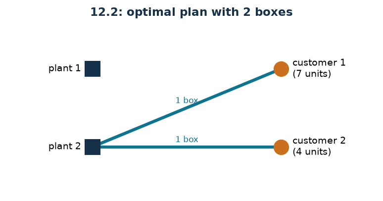

# Shipments in boxes

**Class:** MILP · **Links:** capacity with rounding up · **Script:** `python/fam10_5_shipments.py`

[](https://colab.research.google.com/github/fabiofurini/mip-modelling/blob/main/notebooks/fam10_5_shipments.ipynb)

!!! abstract "Problem 10.5"
    A company has to organise the shipments from its $n \in \mathbb{Z}_{\ge 1}$
    plants to its $m \in \mathbb{Z}_{\ge 1}$ customers. The company makes
    $k \in \mathbb{Z}_{\ge 1}$ types of product. Products are shipped in boxes:
    every box travels directly from one plant to one customer and has a maximum
    capacity $w \in \mathbb{Z}_{\ge 1}$, expressed as the maximum number of
    product units it can carry. For every product $p$ and every customer $c$, the
    value $d_{pc} \in \mathbb{Z}_{\ge 0}$ is the number of units ordered. For
    every product $p$ and every plant $s$, the value
    $a_{ps} \in \mathbb{Z}_{\ge 0}$ is the number of units available. The company
    wants a shipping plan that minimises the total number of boxes used.

**The problem in words.** We *decide* how many units of each product to ship
from each plant to each customer, and how many boxes are needed on each leg.
*The objective*: minimum number of boxes. *The constraints*: every order met
exactly, no plant beyond its stock, and enough boxes on every leg for the units
loaded.

## Model

For brevity $P = \{1, \dots, k\}$ is the set of products, $S = \{1, \dots, n\}$
the set of plants and $C = \{1, \dots, m\}$ the set of customers.

**Variables.** $x_{psc} \in \mathbb{Z}_{\ge 0}$ units of product $p$ shipped
from $s$ to $c$; $y_{sc} \in \mathbb{Z}_{\ge 0}$ boxes shipped from $s$ to $c$.

$$
\begin{aligned}
\min ~~ & \sum_{s=1}^{n} \sum_{c=1}^{m} y_{sc}\\
\text{s.t.} \quad & \sum_{s=1}^{n} x_{psc} = d_{pc}, && \forall p \in P,\ \forall c \in C,\\
& \sum_{c=1}^{m} x_{psc} \le a_{ps}, && \forall p \in P,\ \forall s \in S,\\
& -\sum_{p=1}^{k} x_{psc} + w\, y_{sc} \ge 0, && \forall s \in S,\ \forall c \in C,\\
& x_{psc} \in \mathbb{Z}_{\ge 0}, \quad y_{sc} \in \mathbb{Z}_{\ge 0}.
\end{aligned}
$$

**Description.** The objective counts the boxes used on all the legs. The
**demand** constraints, one per product–customer pair, say that every order is
met exactly. The **availability** constraints, one per product–plant pair, do
not allow shipping more than the plant has. The **capacity** constraints, one
per leg, say that the boxes shipped from $s$ to $c$ are enough to hold the units
loaded.

!!! note "The link is a rounding up"
    The capacity constraint reads

    $$\sum_{p=1}^{k} x_{psc} \;\le\; w\, y_{sc}
    \qquad\Longleftrightarrow\qquad
    y_{sc} \;\ge\; \frac{\sum_{p} x_{psc}}{w} ,$$

    and since $y_{sc}$ is integer and non-negative this is equivalent to

    $$y_{sc} \;\ge\; \Bigl\lceil \frac{\sum_{p} x_{psc}}{w} \Bigr\rceil .$$

    The ceiling never appears in the model: integrality produces it. The same
    constraint also imposes the implication

    $$\sum_{p=1}^{k} x_{psc} > 0 \;\Longrightarrow\; y_{sc} \ge 1 ,$$

    that is: if even a single unit leaves a plant towards a customer, then at
    least one box must travel on that leg. The contrapositive is more readable:
    if $y_{sc} = 0$ then $\sum_p x_{psc} = 0$. The converse — if nothing is
    shipped then no box — is not imposed by the constraint but follows from
    optimality, because every box costs $1$.

## The model in gurobipy

```python
m = gp.Model("shipments")
x = m.addVars(nk, nn, nm, vtype=GRB.INTEGER, name="x")
y = m.addVars(nn, nm, vtype=GRB.INTEGER, name="y")
m.setObjective(y.sum(), GRB.MINIMIZE)
m.addConstrs((x.sum(p, "*", c) == d[p][c] for p in range(nk) for c in range(nm)),
             name="demand")
m.addConstrs((x.sum(p, s, "*") <= a[p][s] for p in range(nk) for s in range(nn)),
             name="availability")
m.addConstrs((w * y[s, c] - x.sum("*", s, c) >= 0 for s in range(nn) for c in range(nm)),
             name="capacity")
```

## The instance

$n = 2$ plants, $m = 2$ customers, $k = 2$ products, $w = 10$.

| $d_{pc}$ | $c=1$ | $c=2$ |
|---|---:|---:|
| $p=1$ | 5 | 0 |
| $p=2$ | 2 | 4 |

| $a_{ps}$ | $s=1$ | $s=2$ |
|---|---:|---:|
| $p=1$ | 8 | 6 |
| $p=2$ | 5 | 7 |

The units to ship are $5 + 0 + 2 + 4 = 11$ in all.

## Constructive heuristic: the primal bound

Customer by customer: one tries to serve them from a single plant, the one that
has everything needed; if none suffices, the order is split among several
plants. At the end $\lceil \cdot / w \rceil$ boxes are counted per leg.

On the instance customer 1 asks for $5$ units of product 1 and $2$ of product 2:
plant 1 has $8$ and $5$, so it suffices alone. Customer 2 asks for $4$ units of
product 2: after the first shipment plant 1 has $3$ left, plant 2 has $7$, so
the shipment leaves from there. There are two legs, with $7$ and $4$ units: one
box each.

$$z(\mathrm{MILP}) \le \mathit{UB} = 2 .$$

## LP relaxation and dual: the dual bound

Associate $\alpha_{pc}$ free with demand, $\beta_{ps} \le 0$ with availability
and $\gamma_{sc} \ge 0$ with capacity.

$$
\begin{aligned}
\max ~~ & \sum_{p=1}^{k}\sum_{c=1}^{m} d_{pc}\, \alpha_{pc} + \sum_{p=1}^{k}\sum_{s=1}^{n} a_{ps}\, \beta_{ps}\\
\text{s.t.} \quad & \alpha_{pc} + \beta_{ps} - \gamma_{sc} \le 0, && \forall p \in P,\ \forall s \in S,\ \forall c \in C,\\
& w\, \gamma_{sc} \le 1, && \forall s \in S,\ \forall c \in C,\\
& \alpha_{pc} \gtreqless 0, \quad \beta_{ps} \le 0, \quad \gamma_{sc} \ge 0.
\end{aligned}
$$

**Description.** $\alpha_{pc}$ is the value of one unit of product $p$ delivered
to customer $c$, $\beta_{ps}$ the (non-positive) price of availability, and
$\gamma_{sc}$ the price of one unit of space on the leg from $s$ to $c$. The
objective prices orders and availabilities at those values. The first group of
constraints are the columns of the $x_{psc}$: shipping one unit is worth
$\alpha_{pc} + \beta_{ps}$ and takes up one unit of space at price
$\gamma_{sc}$; the balance cannot be positive, because those variables do not
appear in the objective. The second are the columns of the $y_{sc}$: one box
offers $w$ units of space, and their value cannot exceed $1$.

**Recipe.** The box constraint bounds $\gamma_{sc} \le 1/w$: take the maximum,
$\bar\gamma_{sc} = 1/w$. With $\bar\beta = 0$ what remains is
$\alpha_{pc} \le 1/w$: take $\bar\alpha_{pc} = 1/w$. The value is

$$\mathit{LB} = \frac{1}{w} \sum_{p}\sum_{c} d_{pc} = \frac{11}{10} .$$

Every unit ordered takes up $1/w$ of a box: it is the "volumetric" bound, and it
coincides with $z(\mathrm{LP})$.

## A stronger integer bound

The volumetric bound ignores that a box is not split between two customers.
Every customer $c$ with at least one unit ordered receives at least
$\lceil \sum_p d_{pc} / w \rceil$ boxes, and these boxes are different from those
of the other customers.

| Customer | units ordered | minimum boxes |
|---|---:|---:|
| 1 | 7 | 1 |
| 2 | 4 | 1 |
| **total** | **11** | **2** |

$$z(\mathrm{MILP}) \ge \mathit{LB} = 2 ,$$

almost twice the volumetric bound $11/10$.

## Optimal solution

Plant 2 serves both customers: customer 1 with one box holding $5$ units of
product 1 and $2$ of product 2, customer 2 with one box holding $4$ units of
product 2.

| $LB$ (combinatorial) | $z(\mathrm{LP})$ | $z(\mathrm{LP}^+)$ | $z(\mathrm{MILP})$ | $UB$ (heuristic) | gap |
|---:|---:|---:|---:|---:|---:|
| 2 | $11/10$ | $11/10$ | 2 | 2 | $0\%$ |



The heuristic gap is zero, and the integer bound certifies optimality. The
difference $2 - 11/10 = 9/10$ is entirely due to integrality: $45\%$ of the
optimal value.

## Additional considerations

- The model is a multicommodity flow with costs only on the containers. If the
  costs were on the flow (per unit transported) and there were no boxes, the
  problem would be a pure transportation one, solvable in polynomial time and
  with an integral relaxation.
- The variables $x_{psc}$ could be continuous without changing the optimum,
  because the data are integer and the transportation matrix is totally
  unimodular *for fixed $y$*. They stay integer because the problem speaks of
  product units.
- The capacity constraint uses the same capacity $w$ on every leg. With boxes of
  different sizes one would need several families $y^{(t)}_{sc}$, one per type,
  as in [problem 10.4](mixed-4.md).

## Additional modelling questions

??? question "10.5.1 — Smaller boxes"
    The boxes hold $4$ units instead of $10$. What is the new optimum?

    !!! tip "Solution"
        The solution is in the solutions document, reserved for teachers.

??? question "10.5.2 — Products kept apart"
    Different products cannot travel in the same box. How does the model change?
    What is the new optimum?

    !!! tip "Solution"
        The solution is in the solutions document, reserved for teachers.

## Code

Complete script —
[`python/fam10_5_shipments.py`](https://github.com/fabiofurini/mip-modelling/blob/main/python/fam10_5_shipments.py)
(reproducible with `python3 python/fam10_5_shipments.py` from the `python/`
folder). Notebook —
[`notebooks/fam10_5_shipments.ipynb`](https://github.com/fabiofurini/mip-modelling/blob/main/notebooks/fam10_5_shipments.ipynb)
— which opens in Colab from the badge at the top of the page.

<!-- embedded-script: begin (regenerated by python/embed_code.py) -->

??? example "Show the complete script — `python/fam10_5_shipments.py` (215 lines)"

    ```python
    """Problem 12.2 -- Shipments in boxes: multi-product flow and counting of containers.

    The quantities shipped are a multi-product flow between plants and customers; on
    top of them there are the boxes, an integer count tied to the flow by the capacity
    (technique 3.4: y >= ceil(sum / w)). The linear relaxation only sees the ratio
    between units and capacity, and completely misses the fact that a box cannot be
    split between two customers.
    """
    import gurobipy as gp
    import pandas as pd
    from gurobipy import GRB

    from mip import (ammissibile, due_rilassamenti, frazione, nuovo_modello, registra_bound,
                     risolvi, valuta)
    from stile import ARANCIO, BLU, GRIGIO, TEAL, intestazione, plt, salva_dati, salva_figura

    R = range


    def scatole(n):
        """"1 box" or "3 boxes"."""
        return f"{int(n)} box" if int(n) == 1 else f"{int(n)} boxes"


    # ---------- 1. MODEL AND INSTANCE ----------
    intestazione("12.2 Shipments in boxes: minimising the number of boxes")
    d2 = [[5, 0],       # units of product p ordered by customer c
          [2, 4]]
    a2 = [[8, 6],       # units of product p available at plant s
          [5, 7]]
    w2 = 10             # capacity of a box, in units of product
    nk, nm, nn = len(d2), len(d2[0]), len(a2[0])   # products, customers, plants
    D2 = sum(d2[p][c] for p in R(nk) for c in R(nm))
    salva_dati(pd.DataFrame([{"product": p + 1, "customer": c + 1, "demand": d2[p][c]}
                             for p in R(nk) for c in R(nm)]), "spedizioni2_domanda")
    salva_dati(pd.DataFrame([{"product": p + 1, "plant": s + 1, "availability": a2[p][s]}
                             for p in R(nk) for s in R(nn)]), "spedizioni2_disponibilita")
    print(f"  Units to ship in total: {D2}; capacity of a box: {w2}.")


    def modello_2(d, a, w):
        nk, nm, nn = len(d), len(d[0]), len(a[0])
        m = nuovo_modello("shipments")
        x = m.addVars(nk, nn, nm, vtype=GRB.INTEGER, name="x")   # units of p from s to c
        y = m.addVars(nn, nm, vtype=GRB.INTEGER, name="y")       # boxes from s to c
        m.setObjective(y.sum(), GRB.MINIMIZE)
        m.addConstrs((x.sum(p, "*", c) == d[p][c] for p in R(nk) for c in R(nm)), name="demand")
        m.addConstrs((x.sum(p, s, "*") <= a[p][s] for p in R(nk) for s in R(nn)),
                     name="availability")
        m.addConstrs((w * y[s, c] - x.sum("*", s, c) >= 0 for s in R(nn) for c in R(nm)),
                     name="capacity")
        return m, x, y


    def duale_2(d, a, w):
        """max sum_pc d_pc alpha_pc + sum_ps a_ps beta_ps

        alpha free (demand with =), beta <= 0 (availability with <=), gamma >= 0 (link with
        the boxes). Columns:
          x_psc:  alpha_pc + beta_ps - gamma_sc <= 0
          y_sc:   w gamma_sc <= 1
        """
        nk, nm, nn = len(d), len(d[0]), len(a[0])
        dl = nuovo_modello("dual_shipments")
        alpha = dl.addVars(nk, nm, lb=-GRB.INFINITY, name="alpha")
        beta = dl.addVars(nk, nn, lb=-GRB.INFINITY, ub=0.0, name="beta")
        gamma = dl.addVars(nn, nm, name="gamma")
        dl.setObjective(gp.quicksum(d[p][c] * alpha[p, c] for p in R(nk) for c in R(nm))
                        + gp.quicksum(a[p][s] * beta[p, s] for p in R(nk) for s in R(nn)),
                        GRB.MAXIMIZE)
        dl.addConstrs((alpha[p, c] + beta[p, s] - gamma[s, c] <= 0
                       for p in R(nk) for s in R(nn) for c in R(nm)), name="rcx")
        dl.addConstrs((w * gamma[s, c] <= 1 for s in R(nn) for c in R(nm)), name="rcy")
        return dl


    m2, x2, y2 = modello_2(d2, a2, w2)

    # ---------- 2. CONSTRUCTIVE HEURISTIC (UPPER BOUND) ----------
    # customer by customer: we try to serve them from a single plant, the one that has
    # everything they need; if no plant is enough, the order is split.
    def euristica(d, a, w):
        nk, nm, nn = len(d), len(d[0]), len(a[0])
        res = [[a[p][s] for s in R(nn)] for p in R(nk)]
        x = {(p, s, c): 0 for p in R(nk) for s in R(nn) for c in R(nm)}
        passi = []
        for c in R(nm):
            completi = [s for s in R(nn) if all(res[p][s] >= d[p][c] for p in R(nk))]
            if completi:
                s = completi[0]
                for p in R(nk):
                    x[p, s, c] = d[p][c]
                    res[p][s] -= d[p][c]
                passi.append(f"customer {c + 1}: plant {s + 1} has the whole order, we ship "
                             f"from there")
            else:
                for p in R(nk):
                    manca = d[p][c]
                    for s in R(nn):
                        preso = min(manca, res[p][s])
                        x[p, s, c] += preso
                        res[p][s] -= preso
                        manca -= preso
                    assert manca == 0, "order cannot be satisfied"
                passi.append(f"customer {c + 1}: no plant is enough on its own, the order is "
                             f"split")
        y = {(s, c): -(-sum(x[p, s, c] for p in R(nk)) // w) for s in R(nn) for c in R(nm)}
        for s in R(nn):
            for c in R(nm):
                if y[s, c]:
                    passi.append(f"plant {s + 1} -> customer {c + 1}: "
                                 f"{sum(x[p, s, c] for p in R(nk))} units -> {scatole(y[s, c])}")
        return x, y, passi


    x_eur, y_eur, passi = euristica(d2, a2, w2)
    for k, riga in enumerate(passi, 1):
        print(f"  Step {k}. {riga}")
    ub2 = sum(y_eur.values())
    sol_eur = ({f"x[{p},{s},{c}]": x_eur[p, s, c] for p in R(nk) for s in R(nn) for c in R(nm)}
               | {f"y[{s},{c}]": y_eur[s, c] for s in R(nn) for c in R(nm)})
    assert ammissibile(m2, sol_eur), sol_eur
    print(f"  Boxes used by the heuristic: {ub2}  ->  ub = {frazione(ub2)}")

    # ---------- 3. LP RELAXATION AND DUAL (LOWER BOUND) ----------
    dl2 = duale_2(d2, a2, w2)
    # recipe: beta = 0, gamma_sc = 1/w (the largest value allowed by w gamma <= 1) and
    # alpha_pc = 1/w: every unit ordered takes 1/w of a box
    mano = ({f"gamma[{s},{c}]": 1 / w2 for s in R(nn) for c in R(nm)}
            | {f"alpha[{p},{c}]": 1 / w2 for p in R(nk) for c in R(nm)})
    lb_lp, viol = valuta(dl2, mano)
    assert viol <= 1e-9, viol
    print(f"  Hand-built dual: beta = 0, gamma_sc = alpha_pc = 1/{w2}. The dual constraints")
    print(f"  become 1/{w2} + 0 - 1/{w2} = 0 <= 0 and {w2} * 1/{w2} = 1 <= 1: all verified.")
    print(f"  lb = (units ordered) / {w2} = {D2} / {w2} = {frazione(lb_lp)}")
    zlp2, zlp2r, _ = due_rilassamenti(m2, dl2)

    # ---------- 4. A STRONGER INTEGER BOUND ----------
    intestazione("12.2 Counting the boxes customer by customer")
    clienti_attivi = [c for c in R(nm) if any(d2[p][c] > 0 for p in R(nk))]
    print("  Every customer with at least one unit ordered receives at least one box, and boxes")
    print(f"  are not shared between customers. The customers with orders are "
          f"{len(clienti_attivi)}:")
    print(f"  lb = {len(clienti_attivi)}, against {frazione(lb_lp)} from the linear relaxation.")
    print(f"  More precisely every customer c receives at least ceil(sum_p d_pc / {w2}) boxes:")
    per_cliente = [-(-sum(d2[p][c] for p in R(nk)) // w2) for c in R(nm)]
    for c in R(nm):
        print(f"    customer {c + 1}: {sum(d2[p][c] for p in R(nk))} units -> at least "
              f"{scatole(per_cliente[c])}")
    lb2 = float(sum(per_cliente))
    print(f"  Summing up: lb = {frazione(lb2)}.")
    salva_dati(pd.DataFrame([{"argument": "dual of the LP relaxation", "bound": lb_lp},
                             {"argument": "boxes per customer", "bound": lb2}]),
               "spedizioni2_argomento")

    # ---------- 5. OPTIMUM OF THE MILP ----------
    z2 = risolvi(m2)
    for s in R(nn):
        for c in R(nm):
            if y2[s, c].X > 0.5:
                carico = ", ".join(f"{int(x2[p, s, c].X)} of product {p + 1}" for p in R(nk)
                                   if x2[p, s, c].X > 0.5)
                print(f"  Plant {s + 1} -> customer {c + 1}: {scatole(y2[s, c].X)} with {carico}")
    riga = registra_bound("2 shipments", ub2, lb2, zlp2, zlp2r, z2)
    salva_dati(pd.DataFrame([riga]), "spedizioni2_bound")
    assert lb2 <= z2 <= ub2 + 1e-9

    # ---------- 6. ADDITIONAL MODELLING QUESTIONS ----------
    varianti = {}


    def variante(nome, m):
        z = risolvi(m)
        print(f"  {nome:70s} z = {frazione(z)}")
        return z


    # 2a: smaller boxes
    m, x, y = modello_2(d2, a2, 4)
    varianti["2a"] = variante("2a. The boxes hold 4 units instead of 10", m)
    # 2b: different products cannot travel in the same box
    m = nuovo_modello("shipments_separate")
    x = m.addVars(nk, nn, nm, vtype=GRB.INTEGER, name="x")
    y = m.addVars(nk, nn, nm, vtype=GRB.INTEGER, name="y")
    m.setObjective(y.sum(), GRB.MINIMIZE)
    m.addConstrs((x.sum(p, "*", c) == d2[p][c] for p in R(nk) for c in R(nm)), name="demand")
    m.addConstrs((x.sum(p, s, "*") <= a2[p][s] for p in R(nk) for s in R(nn)), name="availability")
    m.addConstrs((w2 * y[p, s, c] - x[p, s, c] >= 0 for p in R(nk) for s in R(nn) for c in R(nm)),
                 name="capacity")
    varianti["2b"] = variante("2b. Different products cannot travel in the same box", m)
    salva_dati(pd.DataFrame({"variant": list(varianti), "z": list(varianti.values())}),
               "spedizioni2_varianti")

    # ---------- 7. FIGURE ----------
    fig, ax = plt.subplots(figsize=(6.4, 3.0))
    for s in R(nn):
        for c in R(nm):
            n = int(y2[s, c].X)
            if n:
                ax.plot([0, 1], [nn - 1 - s, nm - 1 - c], color=TEAL, lw=1 + 2 * n)
                ax.annotate(scatole(n), (0.5, (nn - 1 - s + nm - 1 - c) / 2 + 0.06),
                            ha="center", fontsize=8, color=TEAL)
    for s in R(nn):
        ax.plot(0, nn - 1 - s, marker="s", color=BLU, ms=14)
        ax.annotate(f"plant {s + 1}", (-0.06, nn - 1 - s), ha="right", va="center", fontsize=9)
    for c in R(nm):
        ax.plot(1, nm - 1 - c, marker="o", color=ARANCIO, ms=14)
        ax.annotate(f"customer {c + 1}\n({sum(d2[p][c] for p in R(nk))} units)",
                    (1.06, nm - 1 - c), ha="left", va="center", fontsize=9)
    ax.set_xlim(-0.45, 1.5)
    ax.set_ylim(-0.6, max(nn, nm) - 0.4)
    ax.axis("off")
    ax.set_title(f"12.2: optimal plan with {frazione(z2)} boxes")
    salva_figura(fig, "cap10_spedizioni_ottimo")
    print("Done.")
    ```

<!-- embedded-script: end -->
