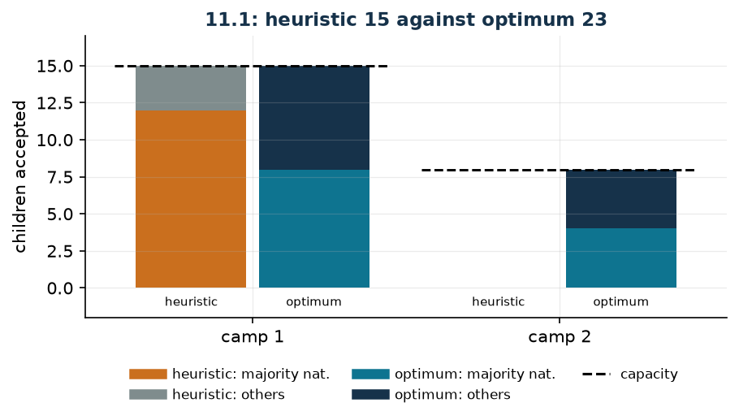

# Children across summer camps

**Class:** ILP · **Links:** integer counts, composition constraints · **Script:** `python/fam10_6_camps.py`

[](https://colab.research.google.com/github/fabiofurini/mip-modelling/blob/main/notebooks/fam10_6_camps.ipynb)

!!! abstract "Problem 10.6"
    A company runs $r \in \mathbb{Z}_{\ge 1}$ summer camps to host children
    during the holidays. For every camp $j \in \{1, \dots, r\}$, the value
    $d_j \in \mathbb{Z}_{\ge 1}$ is the maximum number of children it can host.
    The company has received applications from children of
    $s \in \mathbb{Z}_{\ge 1}$ different nationalities: for every nationality
    $i \in \{1, \dots, s\}$ there are $f_i \in \mathbb{Z}_{\ge 0}$ girls and
    $g_i \in \mathbb{Z}_{\ge 0}$ boys. In every camp the number of girls must be
    greater than or equal to the number of boys, and the number of children of
    nationality $c \in \{1, \dots, s\}$ must be greater than or equal to that of
    every other nationality. The company wants to maximise the total number of
    children accepted.

**The problem in words.** We *decide* how many children of each nationality and
each sex to send to each camp. *The objective*: maximum number of children
accepted. *The constraints*: neither the availabilities nor the capacities are
exceeded; and in every camp the two composition rules hold.

## Model

**Variables.** They are not binary but **counts**: $2\,r\,s$ non-negative
integer variables. $x_{ij}$ are the girls of nationality $i$ in camp $j$,
$y_{ij}$ the boys.

$$
\begin{aligned}
\max ~~ & \sum_{i=1}^{s} \sum_{j=1}^{r} \bigl(x_{ij} + y_{ij}\bigr)\\
\text{s.t.} \quad & \sum_{j=1}^{r} x_{ij} \le f_i, && \forall i \in \{1, \dots, s\},\\
& \sum_{j=1}^{r} y_{ij} \le g_i, && \forall i \in \{1, \dots, s\},\\
& \sum_{i=1}^{s} \bigl(x_{ij} + y_{ij}\bigr) \le d_j, && \forall j \in \{1, \dots, r\},\\
& \sum_{i=1}^{s} \bigl(x_{ij} - y_{ij}\bigr) \ge 0, && \forall j \in \{1, \dots, r\},\\
& x_{cj} + y_{cj} - \sum_{i \ne c} \bigl(x_{ij} + y_{ij}\bigr) \ge 0, && \forall j \in \{1, \dots, r\},\\
& x_{ij} \in \mathbb{Z}_{\ge 0}, \quad y_{ij} \in \mathbb{Z}_{\ge 0}.
\end{aligned}
$$

**Description.** The objective counts the children accepted. The two groups of
**availability** constraints, one per nationality each, do not allow accepting
more girls or boys than have applied ($2s$ constraints). The **capacity**
constraints, one per camp, are the available places. The **balance**
constraints, one per camp, impose "girls $\ge$ boys". The **majority**
constraints, again one per camp, impose that nationality $c$ is not in the
minority.

!!! note "The majority constraint with more than two nationalities"
    With $s = 2$ nationalities the constraint "nationality $c$ is no fewer than
    every other" is written once: there is only one "other" nationality. With
    $s > 2$ the statement of the problem asks for

    $$x_{cj} + y_{cj} \;\ge\; x_{ij} + y_{ij}
    \qquad \forall i \in \{1, \dots, s\},\ i \ne c,\ \forall j \in \{1, \dots, r\} ,$$

    that is $(s-1)\,r$ inequalities. The aggregated form written above is
    *stronger*: it imposes that nationality $c$ is no fewer than *all the others
    together*, that is, that it takes at least half the places of every camp.
    The two readings coincide for $s = 2$ and diverge for $s > 2$; the choice
    must be made explicitly, by reading the statement, not out of writing
    convenience.

## The model in gurobipy

```python
m = gp.Model("camps")
x = m.addVars(s, r, vtype=GRB.INTEGER, name="x")
y = m.addVars(s, r, vtype=GRB.INTEGER, name="y")
m.setObjective(gp.quicksum(x[i, j] + y[i, j] for i in range(s) for j in range(r)),
               GRB.MAXIMIZE)
m.addConstrs((x.sum(i, "*") <= f[i] for i in range(s)), name="girls")
m.addConstrs((y.sum(i, "*") <= g[i] for i in range(s)), name="boys")
m.addConstrs((gp.quicksum(x[i, j] + y[i, j] for i in range(s)) <= d[j]
              for j in range(r)), name="capacity")
m.addConstrs((gp.quicksum(x[i, j] - y[i, j] for i in range(s)) >= 0
              for j in range(r)), name="balance")
m.addConstrs((x[c, j] + y[c, j] - gp.quicksum(x[i, j] + y[i, j]
              for i in range(s) if i != c) >= 0 for j in range(r)), name="majority")
```

## The instance

$s = 2$ nationalities, $r = 2$ camps, $c = 1$.

| | $i=1$ | $i=2$ |
|---|---:|---:|
| $f_i$ (girls) | 8 | 10 |
| $g_i$ (boys) | 4 | 12 |

| | $j=1$ | $j=2$ |
|---|---:|---:|
| $d_j$ | 15 | 8 |

In all there are $34$ children available and $23$ places.

## Constructive heuristic: the primal bound

The problem is a maximisation. One camp is filled at a time, taking first the
majority nationality (girls and then boys) and then the others, stopping as soon
as one of the three constraints would break.

- **Camp 1** (capacity 15): all $8$ girls and all $4$ boys of nationality 1 are
  taken, then $3$ girls of nationality 2. The camp is full: $12$ of nationality
  1 against $3$ of nationality 2 (majority respected), $11$ girls against $4$
  boys (balance respected).
- **Camp 2** (capacity 8): nationality 1 is exhausted, so any child of
  nationality 2 would violate the majority. The camp stays empty.

$$z(\mathit{MILP}) \ge \mathit{LB} = 15 .$$

## LP relaxation and dual: the dual bound

Associate $\alpha_i, \beta_i, \gamma_j \ge 0$ with the three groups of $\le$
constraints and $\delta_j, \varepsilon_j \ge 0$ with the two composition groups,
with $\sigma_i = -1$ for $i = c$ and $\sigma_i = +1$ otherwise.

$$
\begin{aligned}
\min ~~ & \sum_{i=1}^{s} f_i\, \alpha_i + \sum_{i=1}^{s} g_i\, \beta_i
      + \sum_{j=1}^{r} d_j\, \gamma_j\\
\text{s.t.} \quad & \alpha_i + \gamma_j - \delta_j + \sigma_i\, \varepsilon_j \ge 1, && \forall i \in \{1, \dots, s\},\ \forall j \in \{1, \dots, r\},\\
& \beta_i + \gamma_j + \delta_j + \sigma_i\, \varepsilon_j \ge 1, && \forall i \in \{1, \dots, s\},\ \forall j \in \{1, \dots, r\},\\
& \alpha_i \ge 0, \quad \beta_i \ge 0, \quad \gamma_j \ge 0, \quad \delta_j \ge 0, \quad \varepsilon_j \ge 0.
\end{aligned}
$$

**Description.** $\alpha_i$ and $\beta_i$ are the prices of a place for the
girls and for the boys of nationality $i$; $\gamma_j$ is the price of a place in
camp $j$, $\delta_j$ that of the balance constraint and $\varepsilon_j$ that of
the majority constraint. The objective prices the availabilities and the
capacities. The first group of constraints are the columns of the $x_{ij}$:
accepting one girl of nationality $i$ in camp $j$ uses one place of her
nationality and one of the camp, raises the balance by one unit and moves the
majority by $\sigma_i$; the total value must cover the unit that girl
contributes to the primal objective. The second says the same for the boys, with
the sign of the balance reversed.

**Recipe.** The simplest one prices capacity only:
$\alpha = \beta = \delta = \varepsilon = 0$ and $\gamma_j = 1$ for every camp.
All dual constraints become $\gamma_j \ge 1$ and are satisfied, and

$$\mathit{UB} = \sum_{j=1}^{r} d_j = 15 + 8 = 23 .$$

Every child accepted takes one place, so no more children can be accepted than
there are places. And it is also **optimal**: on the relaxation without the
bounds $z(\mathit{LP}) = 23$.

## Two more combinatorial arguments

The bound $23$ is not the only one that can be read off the data. The majority
constraint says that in every camp nationality $c$ takes at least half the
places; since there are $f_c + g_c = 12$ children of that nationality in all, at
most $2 \cdot 12 = 24$ can be accepted. Likewise the balance constraint says
that in every camp the girls are at least half, and there are $18$ girls: at
most $2 \cdot 18 = 36$ can be accepted.

| Argument | upper bound |
|---|---:|
| capacity of the camps | 23 |
| majority nationality | 24 |
| girls available | 36 |

On this instance capacity wins, but that is no rule: question 10.6.1 enlarges
camp 1 and hands command to the majority nationality.

## Optimal solution

| | camp 1 · girls | camp 1 · boys | camp 2 · girls | camp 2 · boys |
|---|---:|---:|---:|---:|
| nationality 1 | 8 | 0 | 0 | 4 |
| nationality 2 | 1 | 6 | 4 | 0 |
| **total** | **15 of 15** | | **8 of 8** | |

Both camps are full.

| $LB$ (heuristic) | $z(\mathit{MILP})$ | $z(\mathit{LP})$ | $UB$ (dual) | gap |
|---:|---:|---:|---:|---:|
| 15 | 23 | 23 | 23 | $34.8\%$ |



The dual bound closes the problem: all the gap was on the solution side, not on
the certificate side. The heuristic's mistake is clear: it exhausts the majority
nationality in the first camp, and in the second nobody is left who can act as
the majority.

## Additional considerations

- The variables are integer but not binary: it is the first family in the course
  where the counts take large values, and the relaxation stays tight anyway
  because all the constraints are sums.
- The balance constraint and the majority one are *independent*: one can have
  camps with many girls and few of nationality $c$, and vice versa. On the
  instance it is the second that bites.
- If a nationality had zero children available, the majority constraint would
  automatically exclude it from every camp in which anybody else appears: a
  limit case worth checking on the data.

## Additional modelling questions

??? question "10.6.1 — A larger camp"
    Camp 1 is enlarged and reaches $20$ places. What is the new optimum?

    !!! tip "Solution"
        The solution is in the solutions document, reserved for teachers.

??? question "10.6.2 — An indivisible nationality"
    For organisational reasons the children of nationality 1 must all stay in
    the same camp. How does the model change? What is the new optimum?

    !!! tip "Solution"
        The solution is in the solutions document, reserved for teachers.

## Code

Complete script —
[`python/fam10_6_camps.py`](https://github.com/fabiofurini/mip-modelling/blob/main/python/fam10_6_camps.py)
(reproducible with `python3 python/fam10_6_camps.py` from the `python/`
folder). Notebook —
[`notebooks/fam10_6_camps.ipynb`](https://github.com/fabiofurini/mip-modelling/blob/main/notebooks/fam10_6_camps.ipynb)
— which opens in Colab from the badge at the top of the page.

<!-- embedded-script: begin (regenerated by python/embed_code.py) -->

??? example "Show the complete script — `python/fam10_6_camps.py` (218 lines)"

    ```python
    """Problem 11.1 -- Summer camps: children of several nationalities in several camps.

    Counting variables (not binary), a capacity per camp and two composition
    constraints: in every camp the girls must not be fewer than the boys, and
    nationality c must not be fewer than any other. The second is written once only
    because there are two nationalities; with s > 2 one needs s - 1 inequalities.
    """
    import gurobipy as gp
    import pandas as pd
    from gurobipy import GRB

    from mip import (ammissibile, due_rilassamenti, frazione, nuovo_modello, registra_bound,
                     risolvi, valuta)
    from stile import ARANCIO, BLU, GRIGIO, TEAL, intestazione, plt, salva_dati, salva_figura

    R = range

    # ---------- 1. MODEL AND INSTANCE ----------
    intestazione("11.1 Summer camps: accepting the largest number of children")
    f1 = [8, 10]        # girls available per nationality
    g1 = [4, 12]        # boys available per nationality
    d1 = [15, 8]        # capacity of the camps
    c1 = 0              # nationality that must be the majority (index 0 = nationality 1)
    s1, r1 = len(f1), len(d1)
    salva_dati(pd.DataFrame({"nationality": R(1, s1 + 1), "girls": f1, "boys": g1}),
               "campi1_dati")
    salva_dati(pd.DataFrame({"camp": R(1, r1 + 1), "capacity": d1}), "campi1_capacita")


    def modello_1(f, g, d, c):
        s, r = len(f), len(d)
        m = nuovo_modello("camps")
        x = m.addVars(s, r, vtype=GRB.INTEGER, name="x")    # girls of nationality i in camp j
        y = m.addVars(s, r, vtype=GRB.INTEGER, name="y")    # boys of nationality i in camp j
        m.setObjective(gp.quicksum(x[i, j] + y[i, j] for i in R(s) for j in R(r)), GRB.MAXIMIZE)
        m.addConstrs((x.sum(i, "*") <= f[i] for i in R(s)), name="girls")
        m.addConstrs((y.sum(i, "*") <= g[i] for i in R(s)), name="boys")
        m.addConstrs((gp.quicksum(x[i, j] + y[i, j] for i in R(s)) <= d[j] for j in R(r)),
                     name="capacity")
        m.addConstrs((gp.quicksum(x[i, j] - y[i, j] for i in R(s)) >= 0 for j in R(r)),
                     name="balance")
        m.addConstrs((x[c, j] + y[c, j]
                      - gp.quicksum(x[i, j] + y[i, j] for i in R(s) if i != c) >= 0 for j in R(r)),
                     name="majority")
        return m, x, y


    def duale_1(f, g, d, c):
        """min sum_i f_i alpha_i + sum_i g_i beta_i + sum_j d_j gamma_j

        with alpha, beta, gamma >= 0 for the three <= constraints, and delta_j, eps_j >= 0
        for the two composition constraints (written as >= 0, so they enter the dual
        constraints with a minus sign). The sign multiplying eps_j depends on i: it is -1
        for the majority nationality c and +1 for all the others.
        """
        s, r = len(f), len(d)
        dl = nuovo_modello("dual_camps")
        alpha = dl.addVars(s, name="alpha")
        beta = dl.addVars(s, name="beta")
        gamma = dl.addVars(r, name="gamma")
        delta = dl.addVars(r, name="delta")
        eps = dl.addVars(r, name="eps")
        dl.setObjective(gp.quicksum(f[i] * alpha[i] for i in R(s))
                        + gp.quicksum(g[i] * beta[i] for i in R(s))
                        + gp.quicksum(d[j] * gamma[j] for j in R(r)), GRB.MINIMIZE)
        for i in R(s):
            segno = -1 if i == c else 1
            for j in R(r):
                dl.addConstr(alpha[i] + gamma[j] - delta[j] + segno * eps[j] >= 1,
                             name=f"rcx[{i},{j}]")
                dl.addConstr(beta[i] + gamma[j] + delta[j] + segno * eps[j] >= 1,
                             name=f"rcy[{i},{j}]")
        return dl


    m1, x1, y1 = modello_1(f1, g1, d1, c1)

    # ---------- 2. CONSTRUCTIVE HEURISTIC (LOWER BOUND) ----------
    # constructive heuristic camp by camp: the current camp is filled taking first the majority
    # nationality (girls and boys) and then the others, never violating capacity,
    # balance and majority.
    def euristica(f, g, d, c):
        s, r = len(f), len(d)
        x = {(i, j): 0 for i in R(s) for j in R(r)}
        y = {(i, j): 0 for i in R(s) for j in R(r)}
        rf, rg = list(f), list(g)
        passi = []
        ordine = [c] + [i for i in R(s) if i != c]
        for j in R(r):
            for i in ordine:
                for quale, res, var in (("girls", rf, x), ("boys", rg, y)):
                    while res[i] > 0:
                        var[i, j] += 1
                        tot = sum(x[k, j] + y[k, j] for k in R(s))
                        par = sum(x[k, j] - y[k, j] for k in R(s))
                        magg = (x[c, j] + y[c, j]
                                - sum(x[k, j] + y[k, j] for k in R(s) if k != c))
                        if tot > d[j] or par < 0 or magg < 0:
                            var[i, j] -= 1
                            break
                        res[i] -= 1
            occupati = sum(x[k, j] + y[k, j] for k in R(s))
            passi.append(f"camp {j + 1} (capacity {d[j]}): "
                         + ", ".join(f"nat. {i + 1} -> {x[i, j]} girls and {y[i, j]} boys"
                                     for i in R(s))
                         + f"; {occupati} places used")
        return x, y, passi


    x_eur, y_eur, passi = euristica(f1, g1, d1, c1)
    for k, riga in enumerate(passi, 1):
        print(f"  Step {k}. {riga}")
    lb1 = sum(x_eur[i, j] + y_eur[i, j] for i in R(s1) for j in R(r1))
    sol_eur = ({f"x[{i},{j}]": x_eur[i, j] for i in R(s1) for j in R(r1)}
               | {f"y[{i},{j}]": y_eur[i, j] for i in R(s1) for j in R(r1)})
    assert ammissibile(m1, sol_eur), sol_eur
    print(f"  Children accepted by the heuristic: lb = {frazione(lb1)}")
    print("  The heuristic uses up the majority nationality in the first camp: in the second one")
    print("  nobody is left who can form the majority, and the camp stays empty.")

    # ---------- 3. LP RELAXATION AND DUAL (UPPER BOUND) ----------
    dl1 = duale_1(f1, g1, d1, c1)
    # recipe: alpha = beta = delta = eps = 0 and gamma_j = 1, that is only the capacity is
    # priced: every accepted child takes one place, so no more than sum_j d_j can be accepted
    mano = {f"gamma[{j}]": 1.0 for j in R(r1)}
    ub1, viol = valuta(dl1, mano)
    assert viol <= 1e-9, viol
    print("  Hand-built dual: alpha = beta = delta = eps = 0 and gamma_j = 1 (every child takes")
    print("  one place). All the dual constraints become gamma_j >= 1 and are satisfied:")
    print(f"  ub = sum_j d_j = {' + '.join(map(str, d1))} = {frazione(ub1)}")
    zlp1, zlp1r, _ = due_rilassamenti(m1, dl1)

    # ---------- 4. OPTIMUM OF THE MILP ----------
    z1 = risolvi(m1)
    print("  Optimal solution:")
    for j in R(r1):
        tot = sum(x1[i, j].X + y1[i, j].X for i in R(s1))
        print(f"    camp {j + 1}: " + ", ".join(
            f"nat. {i + 1} -> {int(x1[i, j].X)} girls and {int(y1[i, j].X)} boys" for i in R(s1))
            + f"; {int(tot)} places out of {d1[j]}")
    riga = registra_bound("1 camps", ub1, lb1, zlp1, zlp1r, z1, senso="max")
    salva_dati(pd.DataFrame([riga]), "campi1_bound")
    assert lb1 <= z1 <= zlp1 <= ub1 + 1e-9
    print(f"  The dual bound {frazione(ub1)} coincides with the optimum: the capacity is")
    print("  saturated and the certificate closes the gap. The whole gap was on the heuristic side.")

    # ---------- 5. THE REAL LIMIT IS THE MAJORITY NATIONALITY ----------
    intestazione("11.1 Two combinatorial arguments on the bounds")
    tot_c = f1[c1] + g1[c1]
    print(f"  In every camp nationality {c1 + 1} is not fewer than all the others together, so in")
    print(f"  every camp it takes at least half of the places. It has {tot_c} children in total:")
    print(f"  at most 2 * {tot_c} = {2 * tot_c} children can be accepted. This is a second upper")
    print(f"  bound, worse than the capacity one ({frazione(ub1)}) on this instance but not in")
    print("  general.")
    print(f"  Likewise the girls are {sum(f1)}: with girls >= boys in every camp, the accepted")
    print(f"  children are at most 2 * {sum(f1)} = {2 * sum(f1)}.")
    salva_dati(pd.DataFrame([{"argument": "capacity of the camps", "bound": ub1},
                             {"argument": "majority nationality", "bound": 2 * tot_c},
                             {"argument": "girls available", "bound": 2 * sum(f1)}]),
               "campi1_argomenti")

    # ---------- 6. ADDITIONAL MODELLING QUESTIONS ----------
    varianti = {}


    def variante(nome, m):
        z = risolvi(m)
        print(f"  {nome:70s} z = {frazione(z)}")
        return z


    # 1a: camp 1 grows; the limit moves from the capacity to nationality 1
    m, x, y = modello_1(f1, g1, [20, d1[1]], c1)
    varianti["1a"] = variante("1a. Camp 1 grows to 20 places (d1 = 20)", m)
    print(f"       the total capacity is now 28 but the optimum stops at 2 * {f1[c1] + g1[c1]} = "
          f"{2 * (f1[c1] + g1[c1])}: the majority nationality is in charge.")
    # 1b: the majority nationality cannot be split between several camps
    m, x, y = modello_1(f1, g1, d1, c1)
    M1 = f1[c1] + g1[c1]
    w = m.addVars(r1, vtype=GRB.BINARY, name="w")
    m.addConstrs((x[c1, j] + y[c1, j] - M1 * w[j] <= 0 for j in R(r1)), name="single_camp")
    m.addConstr(w.sum() <= 1, name="at_most_one_camp")
    varianti["1b"] = variante("1b. Nationality 1 cannot be split between several camps", m)
    print("       this is exactly what the heuristic does: the second camp stays empty and we")
    print(f"       are back to the value {frazione(lb1)}.")
    salva_dati(pd.DataFrame({"variant": list(varianti), "z": list(varianti.values())}),
               "campi1_varianti")

    # ---------- 7. FIGURE ----------
    fig, ax = plt.subplots(figsize=(6.8, 3.0))
    etichette = [f"camp {j + 1}" for j in R(r1)]
    for k, (nome, sol) in enumerate([("heuristic", (x_eur, y_eur)),
                                     ("optimum", ({(i, j): x1[i, j].X for i in R(s1) for j in R(r1)},
                                                  {(i, j): y1[i, j].X for i in R(s1)
                                                   for j in R(r1)}))]):
        xs, ys = sol
        off = -0.2 + 0.4 * k
        for j in R(r1):
            naz1 = xs[c1, j] + ys[c1, j]
            altre = sum(xs[i, j] + ys[i, j] for i in R(s1) if i != c1)
            ax.bar(j + off, naz1, 0.36, color=TEAL if k else ARANCIO)
            ax.bar(j + off, altre, 0.36, bottom=naz1, color=BLU if k else GRIGIO)
            ax.annotate(nome, (j + off, -1.2), ha="center", fontsize=7)
    for j in R(r1):
        ax.plot([j - 0.45, j + 0.45], [d1[j], d1[j]], color="black", lw=1.4, ls="--")
    ax.plot([], [], color=ARANCIO, lw=6, label="heuristic: majority nat.")
    ax.plot([], [], color=GRIGIO, lw=6, label="heuristic: others")
    ax.plot([], [], color=TEAL, lw=6, label="optimum: majority nat.")
    ax.plot([], [], color=BLU, lw=6, label="optimum: others")
    ax.plot([], [], color="black", ls="--", label="capacity")
    ax.set_xticks(R(r1))
    ax.set_xticklabels(etichette)
    ax.set_ylim(-2, max(d1) + 2)
    ax.set_ylabel("children accepted")
    ax.set_title(f"11.1: heuristic {frazione(lb1)} against optimum {frazione(z1)}")
    ax.legend(fontsize=7, ncol=2)
    salva_figura(fig, "cap10_campi_ottimo")
    print("Done.")
    ```

<!-- embedded-script: end -->
