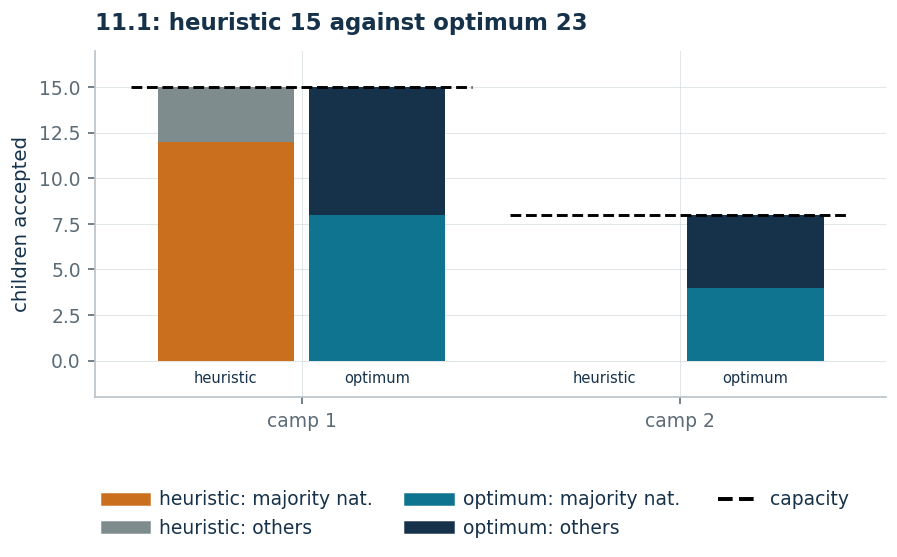

# Children across summer camps

**Class:** ILP · **Links:** integer counts, composition constraints · **Script:** `python/fam10_6_camps.py`<br>
**Difficulty:** ★★★☆☆ · **Time:** 30–45 min
{ .scheda }

[](https://colab.research.google.com/github/fabiofurini/mip-modelling/blob/main/notebooks/fam10_6_camps.ipynb)

!!! abstract "Problem 10.6"
    A company runs $r \in \mathbb{Z}_{\ge 1}$ summer camps to host children
    during the holidays. For every camp $j \in \{1, 2, \dots, r\}$, the value
    $d_j \in \mathbb{Z}_{\ge 1}$ is the maximum number of children it can host.
    The company has received applications from children of
    $s \in \mathbb{Z}_{\ge 1}$ different nationalities: for every nationality
    $i \in \{1, 2, \dots, s\}$ there are $f_i \in \mathbb{Z}_{\ge 0}$ girls and
    $g_i \in \mathbb{Z}_{\ge 0}$ boys. In every camp the number of girls must be
    greater than or equal to the number of boys, and the number of children of
    nationality $c \in \{1, 2, \dots, s\}$ must be greater than or equal to that of
    every other nationality. The company wants to maximise the total number of
    children accepted.

**The problem in words.** We *decide* how many children of each nationality and
each sex to send to each camp. *The objective*: maximum number of children
accepted. *The constraints*: neither the availabilities nor the capacities are
exceeded; and in every camp the two composition rules hold.

## Model

**Variables.** They are not binary but **counts**: $2\,r\,s$ non-negative
integer variables. $x_{ij}$ are the girls of nationality $i$ in camp $j$,
$y_{ij}$ the boys.

<!-- model: 10.6 -->

$$
\begin{aligned}
\max ~~ \sum_{i=1}^{s} \sum_{j=1}^{r} \bigl(x_{ij} + y_{ij}\bigr) & & \\
\text{subject to} \quad \sum_{j=1}^{r} x_{ij} &\le f_i, & \forall i \in \{1, 2, \dots, s\}, \\
\sum_{j=1}^{r} y_{ij} &\le g_i, & \forall i \in \{1, 2, \dots, s\}, \\
\sum_{i=1}^{s} \bigl(x_{ij} + y_{ij}\bigr) &\le d_j, & \forall j \in \{1, 2, \dots, r\}, \\
\sum_{i=1}^{s} \bigl(x_{ij} - y_{ij}\bigr) &\ge 0, & \forall j \in \{1, 2, \dots, r\}, \\
x_{cj} + y_{cj} - x_{ij} - y_{ij} &\ge 0, & \forall i \in \{1, 2, \dots, s\},\ i \ne c,\ \forall j \in \{1, 2, \dots, r\}, \\
x_{ij} &\in \Z_{\ge 0}, & \forall i \in \{1, 2, \dots, s\},\ \forall j \in \{1, 2, \dots, r\}, \\
y_{ij} &\in \Z_{\ge 0}, & \forall i \in \{1, 2, \dots, s\},\ \forall j \in \{1, 2, \dots, r\}.
\end{aligned}
$$

<!-- model: end -->

**Description.** The objective counts the children accepted. The two groups of
**availability** constraints, one per nationality each, do not allow accepting
more girls or boys than have applied ($2s$ constraints). The **capacity**
constraints, one per camp, are the available places. The **balance**
constraints, one per camp, impose "girls $\ge$ boys". The **majority**
constraints, one per nationality-camp pair, impose that nationality $c$ is no
fewer than each of the others ($(s-1)\,r$ constraints).

!!! note "The majority constraint with more than two nationalities"
    The majority constraint translates the statement literally: nationality $c$
    is no fewer than *each* of the others, one inequality per pair, $(s-1)\,r$
    in all. There is however a second, shorter writing that is easy to mistake
    for this one:

    $$x_{cj} + y_{cj} \;\ge\; \sum_{i \ne c} \bigl(x_{ij} + y_{ij}\bigr)
    \qquad \forall j \in \{1, 2, \dots, r\} ,$$

    that is $r$ inequalities instead of $(s-1)\,r$. It says something else, and
    it is *stronger*: that nationality $c$ is no fewer than *all the others
    together*, that is, that it takes at least half the places of every camp.
    The two readings coincide for $s = 2$ --- with a single "other" nationality
    the sum has one term --- and diverge for $s > 2$, where the aggregated form
    cuts off solutions the statement allows. The choice is made by reading the
    text, not for convenience of writing: fewer constraints does not mean a
    better model if they are not the constraints of the problem.

    On this instance $s = 2$, so the two forms give the same numbers; and it is
    precisely because $s = 2$ that the combinatorial argument below can read the
    majority as "half the places".

## The model in gurobipy

```python
m = gp.Model("camps")
x = m.addVars(s, r, vtype=GRB.INTEGER, name="x")
y = m.addVars(s, r, vtype=GRB.INTEGER, name="y")
m.setObjective(gp.quicksum(x[i, j] + y[i, j] for i in range(s) for j in range(r)),
               GRB.MAXIMIZE)
m.addConstrs((x.sum(i, "*") <= f[i] for i in range(s)), name="girls")
m.addConstrs((y.sum(i, "*") <= g[i] for i in range(s)), name="boys")
m.addConstrs((gp.quicksum(x[i, j] + y[i, j] for i in range(s)) <= d[j]
              for j in range(r)), name="capacity")
m.addConstrs((gp.quicksum(x[i, j] - y[i, j] for i in range(s)) >= 0
              for j in range(r)), name="balance")
m.addConstrs((x[c, j] + y[c, j] - x[i, j] - y[i, j] >= 0
              for i in range(s) if i != c for j in range(r)), name="majority")
```

## The instance

$s = 2$ nationalities, $r = 2$ camps, $c = 1$.

| | $i=1$ | $i=2$ |
|---|---:|---:|
| $f_i$ (girls) | 8 | 10 |
| $g_i$ (boys) | 4 | 12 |

| | $j=1$ | $j=2$ |
|---|---:|---:|
| $d_j$ | 15 | 8 |

In all there are $34$ children available and $23$ places.

The model written on the data of the instance:

<!-- modello-esteso: fam10_6_primale -->

<div class="modello-esteso largo" markdown>

$$
\begin{array}{rrrrrrrrr c l}
\max & x_{11} & +x_{12} & +x_{21} & +x_{22} & +y_{11} & +y_{12} & +y_{21} & +y_{22} &  & \\
\text{subject to} & x_{11} & +x_{12} &  &  &  &  &  &  & \le & 8\\
 &  &  & x_{21} & +x_{22} &  &  &  &  & \le & 10\\
 &  &  &  &  & y_{11} & +y_{12} &  &  & \le & 4\\
 &  &  &  &  &  &  & y_{21} & +y_{22} & \le & 12\\
 & x_{11} &  & +x_{21} &  & +y_{11} &  & +y_{21} &  & \le & 15\\
 &  & x_{12} &  & +x_{22} &  & +y_{12} &  & +y_{22} & \le & 8\\
 & x_{11} &  & +x_{21} &  & -y_{11} &  & -y_{21} &  & \ge & 0\\
 &  & x_{12} &  & +x_{22} &  & -y_{12} &  & -y_{22} & \ge & 0\\
 & x_{11} &  & -x_{21} &  & +y_{11} &  & -y_{21} &  & \ge & 0\\
 &  & x_{12} &  & -x_{22} &  & +y_{12} &  & -y_{22} & \ge & 0\\
 & x_{11}, & x_{12}, & x_{21}, & x_{22} &  &  &  &  & \in & \Z_{\ge 0}\\
 &  &  &  &  & y_{11}, & y_{12}, & y_{21}, & y_{22} & \in & \Z_{\ge 0}
\end{array}
$$

</div>

<!-- modello-esteso: fine -->

## Constructive heuristic: the primal bound

The problem is a maximisation. One camp is filled at a time, taking first the
majority nationality (girls and then boys) and then the others, stopping as soon
as one of the three constraints would break.

- **Camp 1** (capacity 15): all $8$ girls and all $4$ boys of nationality 1 are
  taken, then $3$ girls of nationality 2. The camp is full: $12$ of nationality
  1 against $3$ of nationality 2 (majority respected), $11$ girls against $4$
  boys (balance respected).
- **Camp 2** (capacity 8): nationality 1 is exhausted, so any child of
  nationality 2 would violate the majority. The camp stays empty.

$$z(\mathit{MILP}) \ge \mathit{LB} = 15 .$$

## LP relaxation and dual: the dual bound

Associate $\alpha_i, \beta_i, \gamma_j \ge 0$ with the three groups of $\le$
constraints, $\delta_j \ge 0$ with the balance and $\varepsilon_{ij} \ge 0$ with
the majority, one per pair (nationality $i \ne c$, camp $j$).

<!-- model: 10.6-dual -->

$$
\begin{aligned}
\min ~~ \sum_{i=1}^{s} f_i\, \alpha_i + \sum_{i=1}^{s} g_i\, \beta_i
      + \sum_{j=1}^{r} d_j\, \gamma_j & & \\
\text{subject to} \quad \alpha_c + \gamma_j - \delta_j - \sum_{k \ne c} \varepsilon_{kj} &\ge 1, & \forall j \in \{1, 2, \dots, r\}, \\
\beta_c + \gamma_j + \delta_j - \sum_{k \ne c} \varepsilon_{kj} &\ge 1, & \forall j \in \{1, 2, \dots, r\}, \\
\alpha_i + \gamma_j - \delta_j + \varepsilon_{ij} &\ge 1, & \forall i \ne c,\ \forall j \in \{1, 2, \dots, r\}, \\
\beta_i + \gamma_j + \delta_j + \varepsilon_{ij} &\ge 1, & \forall i \ne c,\ \forall j \in \{1, 2, \dots, r\}, \\
\alpha_i &\ge 0, & \forall i \in \{1, 2, \dots, s\}, \\
\beta_i &\ge 0, & \forall i \in \{1, 2, \dots, s\}, \\
\gamma_j &\ge 0, & \forall j \in \{1, 2, \dots, r\}, \\
\delta_j &\ge 0, & \forall j \in \{1, 2, \dots, r\}, \\
\varepsilon_{ij} &\ge 0, & \forall i \ne c,\ \forall j \in \{1, 2, \dots, r\},
\end{aligned}
$$

<!-- model: end -->

The same dual, written on the data of the instance:

<!-- modello-esteso: fam10_6_duale -->

<div class="modello-esteso largo" markdown>

$$
\begin{array}{rrrrrrrrrrr c l}
\min & 8\alpha_1 & +10\alpha_2 & +4\beta_1 & +12\beta_2 & +15\gamma_1 & +8\gamma_2 &  &  &  &  &  & \\
\text{subject to} & \alpha_1 &  &  &  & +\gamma_1 &  & -\delta_1 &  & -\varepsilon_{21} &  & \ge & 1\\
 &  &  & \beta_1 &  & +\gamma_1 &  & +\delta_1 &  & -\varepsilon_{21} &  & \ge & 1\\
 & \alpha_1 &  &  &  &  & +\gamma_2 &  & -\delta_2 &  & -\varepsilon_{22} & \ge & 1\\
 &  &  & \beta_1 &  &  & +\gamma_2 &  & +\delta_2 &  & -\varepsilon_{22} & \ge & 1\\
 &  & \alpha_2 &  &  & +\gamma_1 &  & -\delta_1 &  & +\varepsilon_{21} &  & \ge & 1\\
 &  &  &  & \beta_2 & +\gamma_1 &  & +\delta_1 &  & +\varepsilon_{21} &  & \ge & 1\\
 &  & \alpha_2 &  &  &  & +\gamma_2 &  & -\delta_2 &  & +\varepsilon_{22} & \ge & 1\\
 &  &  &  & \beta_2 &  & +\gamma_2 &  & +\delta_2 &  & +\varepsilon_{22} & \ge & 1\\
 & \alpha_1, & \alpha_2 &  &  &  &  &  &  &  &  & \ge & 0\\
 &  &  & \beta_1, & \beta_2 &  &  &  &  &  &  & \ge & 0\\
 &  &  &  &  & \gamma_1, & \gamma_2 &  &  &  &  & \ge & 0\\
 &  &  &  &  &  &  & \delta_1, & \delta_2 &  &  & \ge & 0\\
 &  &  &  &  &  &  &  &  & \varepsilon_{21}, & \varepsilon_{22} & \ge & 0
\end{array}
$$

</div>

<!-- modello-esteso: fine -->


**Description.** $\alpha_i$ and $\beta_i$ are the prices of a place for the
girls and for the boys of nationality $i$; $\gamma_j$ is the price of a place in
camp $j$, $\delta_j$ that of the balance constraint and $\varepsilon_{ij}$ that
of the comparison between nationality $i$ and the majority one in camp $j$. The
objective prices the availabilities and the capacities.

The dual constraints are the columns of the primal, and they split into two
blocks because nationality $c$ appears in the comparisons differently from the
others. The first is the column of the $x_{cj}$: accepting one girl of the
majority nationality uses one place of her nationality and one of the camp,
raises the balance by one unit and *loosens* every comparison of that camp, one
per other nationality --- hence the sum with the minus sign. The third is the
column of the $x_{ij}$ with $i \ne c$: that girl tightens one comparison only,
her own. The second and the fourth say the same for the boys, with the sign of
the balance reversed.

**Recipe.** The simplest one prices capacity only:
$\alpha = \beta = \delta = \varepsilon = 0$ and $\gamma_j = 1$ for every camp.
All dual constraints become $\gamma_j \ge 1$ and are satisfied, and

$$\mathit{UB} = \sum_{j=1}^{r} d_j = 15 + 8 = 23 .$$

Every child accepted takes one place, so no more children can be accepted than
there are places. And it is also **optimal**: on the relaxation without the
bounds $z(\mathit{LP}) = 23$.

## Two more combinatorial arguments

The bound $23$ is not the only one that can be read off the data. With $s = 2$
the majority constraint says that in every camp nationality $c$ takes at least
half the places; since there are $f_c + g_c = 12$ children of that nationality in all, at
most $2 \cdot 12 = 24$ can be accepted. Likewise the balance constraint says
that in every camp the girls are at least half, and there are $18$ girls: at
most $2 \cdot 18 = 36$ can be accepted.

| Argument | upper bound |
|---|---:|
| capacity of the camps | 23 |
| majority nationality | 24 |
| girls available | 36 |

On this instance capacity wins, but that is no rule: question 10.6.1 enlarges
camp 1 and hands command to the majority nationality.

## Optimal solution

| | camp 1 · girls | camp 1 · boys | camp 2 · girls | camp 2 · boys |
|---|---:|---:|---:|---:|
| nationality 1 | 8 | 0 | 0 | 4 |
| nationality 2 | 1 | 6 | 4 | 0 |
| **total** | **15 of 15** | | **8 of 8** | |

Both camps are full.

| $LB$ (heuristic) | $z(\mathit{MILP})$ | $z(\mathit{LP})$ | $UB$ (dual) | heuristic gap |
|---:|---:|---:|---:|---:|
| 15 | 23 | 23 | 23 | $34.8\%$ |



The dual bound closes the problem: all the gap was on the solution side, not on
the certificate side. The heuristic's mistake is clear: it exhausts the majority
nationality in the first camp, and in the second nobody is left who can act as
the majority.

## Additional considerations

- The variables are integer but not binary: it is the first family in the course
  where the counts take large values, and the relaxation stays tight anyway
  because all the constraints are sums.
- The balance constraint and the majority one are *independent*: one can have
  camps with many girls and few of nationality $c$, and vice versa. On the
  instance it is the second that bites.
- If a nationality had zero children available, the majority constraint would
  automatically exclude it from every camp in which anybody else appears: a
  limit case worth checking on the data.

## Additional modelling questions

??? question "10.6.1 — A larger camp"
    Camp 1 is enlarged and reaches $20$ places. What is the new optimum?

??? question "10.6.2 — An indivisible nationality"
    For organisational reasons the children of nationality 1 must all stay in
    the same camp. How does the model change? What is the new optimum?

## The sandwich on variant 6a

Camp 1 goes from $15$ to $20$ places: a datum changes, not the structure. The
recipe stays $\gamma_j = 1$ with all the other dual variables at zero, because
every child accepted takes a place, and it returns $\sum_j d_j = 28$ instead of
$23$. The certificate does not change shape: the datum it adds up does.

<!-- tabella-variante: fam10_6a_bound -->

|  | value | what it is |
|---|---:|---|
| $\mathit{UB}$ | $28$ | dual certificate built by hand |
| $\mathit{LB}$ | $20$ | heuristic solution |
| $z(\mathit{LP})$ | $24$ | relaxation without the bounds |
| $z(\mathit{LP}^+)$ | $24$ | relaxation with the bounds |
| $z(\mathit{MILP})$ | $24$ | optimum of the MILP |

<!-- tabella-variante: fine -->

## Code

Complete script —
[`python/fam10_6_camps.py`](https://github.com/fabiofurini/mip-modelling/blob/main/python/fam10_6_camps.py)
(reproducible with `python3 python/fam10_6_camps.py` from the `python/`
folder). Notebook —
[`notebooks/fam10_6_camps.ipynb`](https://github.com/fabiofurini/mip-modelling/blob/main/notebooks/fam10_6_camps.ipynb)
— which opens in Colab from the badge at the top of the page.

<!-- embedded-script: begin (regenerated by python/embed_code.py) -->

??? example "Show the complete script — `python/fam10_6_camps.py` (263 lines)"

    ```python
    """Problem 10.6 -- Summer camps: children of several nationalities in several camps.

    Counting variables (not binary), a capacity per camp and two composition
    constraints: in every camp the girls must not be fewer than the boys, and
    nationality c must not be fewer than any other. The second is written once only
    because there are two nationalities; with s > 2 one needs s - 1 inequalities.
    """
    import gurobipy as gp
    import pandas as pd
    from gurobipy import GRB

    from mip import (ammissibile, dualita_forte, due_rilassamenti, frazione,
                     nuovo_modello, registra_bound, rilassamenti, risolvi, valuta)
    from stile import ARANCIO, BLU, GRIGIO, TEAL, intestazione, plt, salva_dati, salva_figura
    from esteso import salva_modello

    R = range

    # ---------- 1. MODEL AND INSTANCE ----------
    intestazione("10.6 Summer camps: accepting the largest number of children")
    f1 = [8, 10]        # girls available per nationality
    g1 = [4, 12]        # boys available per nationality
    d1 = [15, 8]        # capacity of the camps
    c1 = 0              # nationality that must be the majority (index 0 = nationality 1)
    s1, r1 = len(f1), len(d1)
    salva_dati(pd.DataFrame({"nationality": R(1, s1 + 1), "girls": f1, "boys": g1}),
               "fam10_6_dati")
    salva_dati(pd.DataFrame({"camp": R(1, r1 + 1), "capacity": d1}), "fam10_6_capacita")


    def modello_1(f, g, d, c):
        s, r = len(f), len(d)
        m = nuovo_modello("camps")
        x = m.addVars(s, r, vtype=GRB.INTEGER, name="x")    # girls of nationality i in camp j
        y = m.addVars(s, r, vtype=GRB.INTEGER, name="y")    # boys of nationality i in camp j
        m.setObjective(gp.quicksum(x[i, j] + y[i, j] for i in R(s) for j in R(r)), GRB.MAXIMIZE)
        m.addConstrs((x.sum(i, "*") <= f[i] for i in R(s)), name="girls")
        m.addConstrs((y.sum(i, "*") <= g[i] for i in R(s)), name="boys")
        m.addConstrs((gp.quicksum(x[i, j] + y[i, j] for i in R(s)) <= d[j] for j in R(r)),
                     name="capacity")
        m.addConstrs((gp.quicksum(x[i, j] - y[i, j] for i in R(s)) >= 0 for j in R(r)),
                     name="balance")
        # the statement asks that nationality c be no fewer than *each* other one:
        # one inequality per pair (i, j), not a single aggregated sum
        m.addConstrs((x[c, j] + y[c, j] - x[i, j] - y[i, j] >= 0
                      for i in R(s) if i != c for j in R(r)),
                     name="majority")
        return m, x, y


    def duale_1(f, g, d, c):
        """min sum_i f_i alpha_i + sum_i g_i beta_i + sum_j d_j gamma_j

        with alpha, beta, gamma >= 0 for the three <= constraints, delta_j >= 0 for the
        balance and eps_{ij} >= 0, one per pair (nationality i != c, camp j), for the
        majority. In the dual constraint of a variable of nationality c all the
        eps_{kj} appear with a minus sign; in that of a nationality i != c only
        eps_{ij} appears, with a plus sign.
        """
        s, r = len(f), len(d)
        dl = nuovo_modello("dual_camps")
        alpha = dl.addVars(s, name="alpha")
        beta = dl.addVars(s, name="beta")
        gamma = dl.addVars(r, name="gamma")
        delta = dl.addVars(r, name="delta")
        eps = dl.addVars([(i, j) for i in R(s) if i != c for j in R(r)], name="eps")
        dl.setObjective(gp.quicksum(f[i] * alpha[i] for i in R(s))
                        + gp.quicksum(g[i] * beta[i] for i in R(s))
                        + gp.quicksum(d[j] * gamma[j] for j in R(r)), GRB.MINIMIZE)
        for i in R(s):
            for j in R(r):
                magg = (-gp.quicksum(eps[k, j] for k in R(s) if k != c) if i == c
                        else eps[i, j])
                dl.addConstr(alpha[i] + gamma[j] - delta[j] + magg >= 1,
                             name=f"rcx[{i},{j}]")
                dl.addConstr(beta[i] + gamma[j] + delta[j] + magg >= 1,
                             name=f"rcy[{i},{j}]")
        return dl


    m1, x1, y1 = modello_1(f1, g1, d1, c1)
    salva_modello(m1, "fam10_6_primale")

    # ---------- 2. THE LP RELAXATION ----------
    zlp1, zlp1r, _ = rilassamenti(m1)

    # ---------- 3. THE DUAL OF THE RELAXATION (LOWER BOUND) ----------
    dl1 = duale_1(f1, g1, d1, c1)
    salva_modello(dl1, "fam10_6_duale")
    # recipe: alpha = beta = delta = eps = 0 and gamma_j = 1, that is only the capacity is
    # priced: every accepted child takes one place, so no more than sum_j d_j can be accepted
    mano = {f"gamma[{j}]": 1.0 for j in R(r1)}
    ub1, viol = valuta(dl1, mano)
    assert viol <= 1e-9, viol
    print("  Hand-built dual: alpha = beta = delta = eps = 0 and gamma_j = 1 (every child takes")
    print("  one place). All the dual constraints become gamma_j >= 1 and are satisfied:")
    print(f"  ub = sum_j d_j = {' + '.join(map(str, d1))} = {frazione(ub1)}")
    dualita_forte(dl1, zlp1)

    # ---------- 4. CONSTRUCTIVE HEURISTIC (UPPER BOUND) ----------
    # constructive heuristic camp by camp: the current camp is filled taking first the majority
    # nationality (girls and boys) and then the others, never violating capacity,
    # balance and majority.
    def euristica(f, g, d, c):
        s, r = len(f), len(d)
        x = {(i, j): 0 for i in R(s) for j in R(r)}
        y = {(i, j): 0 for i in R(s) for j in R(r)}
        rf, rg = list(f), list(g)
        passi = []
        ordine = [c] + [i for i in R(s) if i != c]
        for j in R(r):
            for i in ordine:
                for quale, res, var in (("girls", rf, x), ("boys", rg, y)):
                    while res[i] > 0:
                        var[i, j] += 1
                        tot = sum(x[k, j] + y[k, j] for k in R(s))
                        par = sum(x[k, j] - y[k, j] for k in R(s))
                        magg = (x[c, j] + y[c, j]
                                - sum(x[k, j] + y[k, j] for k in R(s) if k != c))
                        if tot > d[j] or par < 0 or magg < 0:
                            var[i, j] -= 1
                            break
                        res[i] -= 1
            occupati = sum(x[k, j] + y[k, j] for k in R(s))
            passi.append(f"camp {j + 1} (capacity {d[j]}): "
                         + ", ".join(f"nat. {i + 1} -> {x[i, j]} girls and {y[i, j]} boys"
                                     for i in R(s))
                         + f"; {occupati} places used")
        return x, y, passi


    x_eur, y_eur, passi = euristica(f1, g1, d1, c1)
    for k, riga in enumerate(passi, 1):
        print(f"  Step {k}. {riga}")
    lb1 = sum(x_eur[i, j] + y_eur[i, j] for i in R(s1) for j in R(r1))
    sol_eur = ({f"x[{i},{j}]": x_eur[i, j] for i in R(s1) for j in R(r1)}
               | {f"y[{i},{j}]": y_eur[i, j] for i in R(s1) for j in R(r1)})
    assert ammissibile(m1, sol_eur), sol_eur
    print(f"  Children accepted by the heuristic: lb = {frazione(lb1)}")
    print("  The heuristic uses up the majority nationality in the first camp: in the second one")
    print("  nobody is left who can form the majority, and the camp stays empty.")

    # ---------- 5. THE REAL LIMIT IS THE MAJORITY NATIONALITY ----------
    intestazione("10.6 Two combinatorial arguments on the bounds")
    tot_c = f1[c1] + g1[c1]
    print(f"  In every camp nationality {c1 + 1} is not fewer than all the others together, so in")
    print(f"  every camp it takes at least half of the places. It has {tot_c} children in total:")
    print(f"  at most 2 * {tot_c} = {2 * tot_c} children can be accepted. This is a second upper")
    print(f"  bound, worse than the capacity one ({frazione(ub1)}) on this instance but not in")
    print("  general.")
    print(f"  Likewise the girls are {sum(f1)}: with girls >= boys in every camp, the accepted")
    print(f"  children are at most 2 * {sum(f1)} = {2 * sum(f1)}.")
    salva_dati(pd.DataFrame([{"argument": "capacity of the camps", "bound": ub1},
                             {"argument": "majority nationality", "bound": 2 * tot_c},
                             {"argument": "girls available", "bound": 2 * sum(f1)}]),
               "fam10_6_argomenti")

    # ---------- 6. OPTIMUM OF THE MILP ----------
    z1 = risolvi(m1)
    print("  Optimal solution:")
    for j in R(r1):
        tot = sum(x1[i, j].X + y1[i, j].X for i in R(s1))
        print(f"    camp {j + 1}: " + ", ".join(
            f"nat. {i + 1} -> {int(x1[i, j].X)} girls and {int(y1[i, j].X)} boys" for i in R(s1))
            + f"; {int(tot)} places out of {d1[j]}")
    riga = registra_bound("1 camps", ub1, lb1, zlp1, zlp1r, z1, senso="max")
    salva_dati(pd.DataFrame([riga]), "fam10_6_bound")
    assert lb1 <= z1 <= zlp1 <= ub1 + 1e-9
    print(f"  The dual bound {frazione(ub1)} coincides with the optimum: the capacity is")
    print("  saturated and the certificate closes the gap. The whole gap was on the heuristic side.")

    # ---------- 7. ADDITIONAL MODELLING QUESTIONS ----------
    varianti = {}


    def variante(nome, m):
        z = risolvi(m)
        print(f"  {nome:70s} z = {frazione(z)}")
        return z


    # 1a: camp 1 grows; the limit moves from the capacity to nationality 1
    m, x, y = modello_1(f1, g1, [20, d1[1]], c1)
    varianti["1a"] = variante("1a. Camp 1 grows to 20 places (d1 = 20)", m)
    print(f"       the total capacity is now 28 but the optimum stops at 2 * {f1[c1] + g1[c1]} = "
          f"{2 * (f1[c1] + g1[c1])}: the majority nationality is in charge.")
    # 1b: the majority nationality cannot be split between several camps
    m, x, y = modello_1(f1, g1, d1, c1)
    M1 = f1[c1] + g1[c1]
    w = m.addVars(r1, vtype=GRB.BINARY, name="w")
    m.addConstrs((x[c1, j] + y[c1, j] - M1 * w[j] <= 0 for j in R(r1)), name="single_camp")
    m.addConstr(w.sum() <= 1, name="at_most_one_camp")
    varianti["1b"] = variante("1b. Nationality 1 cannot be split between several camps", m)
    print("       this is exactly what the heuristic does: the second camp stays empty and we")
    print(f"       are back to the value {frazione(lb1)}.")
    salva_dati(pd.DataFrame({"variant": list(varianti), "z": list(varianti.values())}),
               "fam10_6_varianti")

    # ---------- 8. THE SANDWICH ON THE VARIANT 1a ----------
    intestazione("10.6a The sandwich on the variant: camp 1 goes up to 20 places")
    d1a = [20] + list(d1[1:])

    # A capacity changes, not the structure: same model, same dual, same recipe.
    # The bound 'every child takes a place' follows the places available.
    m1a, x1a, y1a = modello_1(f1, g1, d1a, c1)
    salva_modello(m1a, "fam10_6a_primale")
    dl1a = duale_1(f1, g1, d1a, c1)
    salva_modello(dl1a, "fam10_6a_duale")

    # -- feasible heuristic: the same rule, with the new places --
    x_1a, y_1a, passi_1a = euristica(f1, g1, d1a, c1)
    for k, s in enumerate(passi_1a, 1):
        print(f"  Step {k}. {s}")
    lb1a = sum(x_1a[i, j] + y_1a[i, j] for i in R(s1) for j in R(r1))
    sol_1a = ({f"x[{i},{j}]": x_1a[i, j] for i in R(s1) for j in R(r1)}
              | {f"y[{i},{j}]": y_1a[i, j] for i in R(s1) for j in R(r1)})
    assert ammissibile(m1a, sol_1a), "the heuristic solution of the variant must be feasible"
    print(f"  lb = {frazione(lb1a)}")

    # -- dual certificate: the same recipe, on the new places --
    mano_1a = {f"gamma[{j}]": 1.0 for j in R(r1)}
    ub1a, viol_1a = valuta(dl1a, mano_1a)
    assert viol_1a <= 1e-9, viol_1a
    print("Dual solution by hand: alpha = beta = delta = eps = 0 and gamma_j = 1, as in the")
    print("  base problem: every child accepted takes a place, so no more than sum_j d_j can")
    print(f"  be accepted = {' + '.join(map(str, d1a))} = {frazione(ub1a)}.")
    print("  The certificate does not change shape: the datum it adds up does.")
    zlp1a, zlp1ar, _ = due_rilassamenti(m1a, dl1a)
    z1a_val = risolvi(m1a)
    riga_1a = registra_bound("1a camp 1 at 20 places", ub1a, lb1a, zlp1a, zlp1ar, z1a_val, senso="max")
    salva_dati(pd.DataFrame([riga_1a]), "fam10_6a_bound")
    assert lb1a <= z1a_val <= zlp1a + 1e-9 <= ub1a + 1e-9

    # ---------- 9. FIGURE ----------
    fig, ax = plt.subplots(figsize=(6.8, 3.0))
    etichette = [f"camp {j + 1}" for j in R(r1)]
    for k, (nome, sol) in enumerate([("heuristic", (x_eur, y_eur)),
                                     ("optimum", ({(i, j): x1[i, j].X for i in R(s1) for j in R(r1)},
                                                  {(i, j): y1[i, j].X for i in R(s1)
                                                   for j in R(r1)}))]):
        xs, ys = sol
        off = -0.2 + 0.4 * k
        for j in R(r1):
            naz1 = xs[c1, j] + ys[c1, j]
            altre = sum(xs[i, j] + ys[i, j] for i in R(s1) if i != c1)
            ax.bar(j + off, naz1, 0.36, color=TEAL if k else ARANCIO)
            ax.bar(j + off, altre, 0.36, bottom=naz1, color=BLU if k else GRIGIO)
            ax.annotate(nome, (j + off, -1.2), ha="center", fontsize=7)
    for j in R(r1):
        ax.plot([j - 0.45, j + 0.45], [d1[j], d1[j]], color="black", lw=1.4, ls="--")
    ax.plot([], [], color=ARANCIO, lw=6, label="heuristic: majority nat.")
    ax.plot([], [], color=GRIGIO, lw=6, label="heuristic: others")
    ax.plot([], [], color=TEAL, lw=6, label="optimum: majority nat.")
    ax.plot([], [], color=BLU, lw=6, label="optimum: others")
    ax.plot([], [], color="black", ls="--", label="capacity")
    ax.set_xticks(R(r1))
    ax.set_xticklabels(etichette)
    ax.set_ylim(-2, max(d1) + 2)
    ax.set_ylabel("children accepted")
    ax.set_title(f"10.6: heuristic {frazione(lb1)} against optimum {frazione(z1)}")
    ax.legend(fontsize=7, ncol=2)
    salva_figura(fig, "cap10_campi_ottimo")
    print("Done.")
    ```

<!-- embedded-script: end -->
