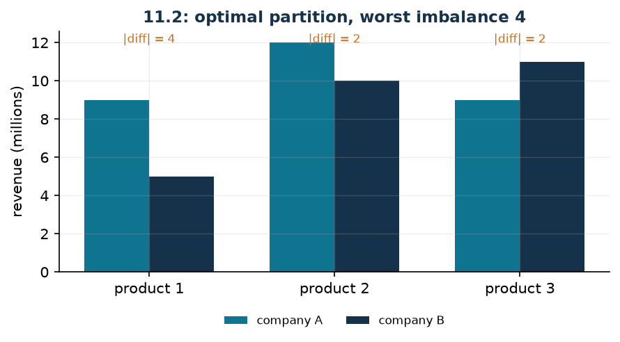

# Branches across two companies

**Class:** BIP · **Links:** absolute value, min-max · **Script:** `python/fam10_7_antitrust.py`

[](https://colab.research.google.com/github/fabiofurini/mip-modelling/blob/main/notebooks/fam10_7_antitrust.ipynb)

!!! abstract "Problem 10.7"
    A company has $s \in \mathbb{Z}_{\ge 1}$ branches and sells
    $r \in \mathbb{Z}_{\ge 1}$ products. For every branch $i \in \{1, \dots, s\}$
    and every product $j \in \{1, \dots, r\}$, the value
    $v_{ij} \in \mathbb{Q}_{\ge 0}$ is the turnover in millions of euros that
    branch generates with that product. Because of a new antitrust rule the
    company must split into two smaller companies; every branch is indivisible
    and must be assigned to exactly one of them. The company wants to partition
    the branches so as to minimise the largest difference, over all products,
    between the turnovers of the two new companies.

**The problem in words.** We *decide* which of the two companies each branch
goes to. *The objective*: make the two companies as similar as possible,
measuring similarity on the product where they do worst. *The constraint*: every
branch to one company only.

## Model

**Variables.** *One* family of $s$ binaries suffices: $x_i \in \{0,1\}$ equals
$1$ if branch $i$ goes to company $A$ and $0$ if it goes to $B$; plus one free
variable $z$ for the min-max.

With $T_j = \sum_{i=1}^{s} v_{ij}$ the total turnover on product $j$, the
turnover of $A$ is $\sum_i v_{ij}\, x_i$ and that of $B$ is
$T_j - \sum_i v_{ij}\, x_i$: their difference is $2 \sum_i v_{ij}\, x_i - T_j$.

$$
\begin{aligned}
\min ~~ & z\\
\text{s.t.} \quad & z - 2 \sum_{i=1}^{s} v_{ij}\, x_i + T_j \ge 0, && \forall j \in \{1, \dots, r\},\\
& z + 2 \sum_{i=1}^{s} v_{ij}\, x_i - T_j \ge 0, && \forall j \in \{1, \dots, r\},\\
& x_i \in \{0,1\}, && \forall i \in \{1, \dots, s\},\\
& z \gtreqless 0.
\end{aligned}
$$

**Description.** The objective is the worst imbalance. The two groups of
constraints, one per product each, say that $z$ is no smaller than the imbalance
of product $j$ nor than its opposite: together they impose
$z \ge \bigl|2\sum_i v_{ij}\, x_i - T_j\bigr|$, and the minimisation turns them
into an equality on the worst product.

!!! tip "One family or two?"
    The classical statement introduces *two* families, $x_i$ and $y_i$, with the
    constraint $x_i + y_i = 1$. The two writings are equivalent, because
    $y_i = 1 - x_i$: substituting gives exactly the model above, with $s$ fewer
    variables and $s$ fewer constraints. The aggregated form is preferable as
    long as the companies are *two*; with three or more companies the
    disaggregated form $\sum_k x_{ik} = 1$ is the only possible one, and it is
    the one that extends.

## The model in gurobipy

```python
m = gp.Model("antitrust")
x = m.addVars(s, vtype=GRB.BINARY, name="x")
z = m.addVar(lb=-GRB.INFINITY, name="z")
m.setObjective(z, GRB.MINIMIZE)
for j in range(r):
    tot = sum(v[i][j] for i in range(s))
    m.addConstr(z - 2 * gp.quicksum(v[i][j] * x[i] for i in range(s)) + tot >= 0)
    m.addConstr(z + 2 * gp.quicksum(v[i][j] * x[i] for i in range(s)) - tot >= 0)
```

## The instance

$s = 4$ branches, $r = 3$ products.

| $v_{ij}$ | $j=1$ | $j=2$ | $j=3$ | branch total |
|---|---:|---:|---:|---:|
| $i=1$ | 3 | 3 | 2 | 8 |
| $i=2$ | 6 | 8 | 5 | 19 |
| $i=3$ | 3 | 4 | 4 | 11 |
| $i=4$ | 2 | 7 | 9 | 18 |
| $T_j$ | 14 | 22 | 20 | |

## Constructive heuristic: the primal bound

The branches are assigned in order of decreasing total turnover, each to the
company that currently has the lower total. It is the analogue of LPT for
scheduling.

On the instance the totals are $8, 19, 11, 18$, so the order is $2, 4, 3, 1$:
branch 2 to $A$ ($A = 19$), branch 4 to $B$ ($B = 18$), branch 3 to $B$
($B = 29$), branch 1 to $A$ ($A = 27$). One gets $A = \{1, 2\}$,
$B = \{3, 4\}$, with differences $4$, $0$ and $6$ on the three products:

$$z(\mathit{MILP}) \le \mathit{UB} = 6 .$$

## LP relaxation and dual: the bound is zero

Associate $\lambda_j \ge 0$ with the "from above" constraints and
$\mu_j \ge 0$ with the "from below" ones. The column of $z$, a free variable,
gives an equality constraint.

$$
\begin{aligned}
\max ~~ & \sum_{j=1}^{r} T_j\,(\mu_j - \lambda_j)\\
\text{s.t.} \quad & \sum_{j=1}^{r} (\lambda_j + \mu_j) = 1,\\
& 2 \sum_{j=1}^{r} v_{ij}\,(\mu_j - \lambda_j) \le 0, && \forall i \in \{1, \dots, s\},\\
& \lambda_j \ge 0, \quad \mu_j \ge 0.
\end{aligned}
$$

**Description.** $\lambda_j$ and $\mu_j$ are the prices of the two constraints
that squeeze the imbalance of product $j$, one from above and one from below.
The objective prices the total $T_j$ of each product at those values. The first
constraint is the column of $z$: the variable appears in every constraint with
coefficient $1$ and in the primal objective with cost $1$, so the prices of the
$2r$ constraints must sum to exactly one — the dual distributes a single unit of
weight among the products. The second group are the columns of the $x_i$: moving
branch $i$ from one company to the other changes the imbalance of product $j$ by
$2 v_{ij}$, and the weighted sum of these moves cannot be positive.

**Recipe.** $\bar\lambda_1 = \bar\mu_1 = 1/2$ and everything else zero: the
first constraint is satisfied, $\mu_j - \lambda_j = 0$ for every $j$ and hence
so are the others. The value is $\mathit{LB} = 0$.

!!! warning "Here the dual cannot do better"
    No feasible dual solution is worth more than zero. Indeed, setting
    $\theta_j = \mu_j - \lambda_j$, the objective is $\sum_j T_j\, \theta_j$ and
    the constraints on the $x_i$ impose $\sum_j v_{ij}\, \theta_j \le 0$ for
    every branch; summing over all branches gives
    $\sum_j T_j\, \theta_j \le 0$. The dual is therefore worth at most $0$, and
    by strong duality $z(\mathit{LP}) = 0$.

    The primal certificate is even simpler: the fractional solution
    $x_i = 1/2$ for every branch with $z = 0$ is feasible for the relaxation and
    balances every product exactly. Half a branch to each company: legitimate
    for the LP, meaningless for the problem.

## A combinatorial bound, product by product

If the relaxation says nothing, one has to look elsewhere. For every product $j$
one can compute, looking at *that product alone*, the minimum achievable
imbalance:

$$g_j = \min_{S \subseteq \{1,\dots,s\}}
      \Bigl| 2 \sum_{i \in S} v_{ij} - T_j \Bigr| .$$

It is the classical partition problem on a single column, and with small $s$ it
is solved by enumeration ($2^s$ subsets). Every feasible partition of the whole
problem is in particular a partition for product $j$, so
$z(\mathit{MILP}) \ge \max_j g_j$.

| Product | total $T_j$ | $g_j$ |
|---|---:|---:|
| 1 | 14 | 2 |
| 2 | 22 | 0 |
| 3 | 20 | 2 |

On product 1 the values are $3, 6, 3, 2$: the sum $7$ is not reachable by any
subset, and the best is $6$ against $8$, that is $g_1 = 2$. Hence
$z(\mathit{MILP}) \ge \mathit{LB} = 2$, a bound the LP relaxation cannot see,
because it comes from integrality and not from the constraints.

## Optimal solution

The optimal partition is $A = \{2, 3\}$ and $B = \{1, 4\}$, with differences
$4$, $2$ and $2$ on the three products.

| $LB$ (combinatorial) | $z(\mathit{LP})$ | $z(\mathit{LP}^+)$ | $z(\mathit{MILP})$ | $UB$ (heuristic) | gap |
|---:|---:|---:|---:|---:|---:|
| 2 | 0 | 0 | 4 | 6 | $50.0\%$ |



$\mathit{LB}$ is not the value of the dual ($0$) but the combinatorial bound:
that is why the column is called "certified bound".

## Additional considerations

- The problem with a single product is *number partitioning*, one of Karp's
  twenty-one NP-complete problems. With several products it is its vector
  version, and it stays NP-hard.
- The combinatorial bound can be strengthened: instead of the maximum of the
  $g_j$ one can look, for every pair of products, for the minimum of the maximum
  of the two imbalances. The cost grows but the bound improves, and it is the
  same idea as *surrogate relaxation*.
- The min-max objective is not the only possible one: minimising the sum of the
  differences is another legitimate choice and gives a model with $r$ auxiliary
  variables instead of one.

## Additional modelling questions

??? question "10.7.1 — Two inseparable branches"
    Branches $1$ and $2$ share premises and must stay in the same company. How
    does the model change? What is the new optimum?

    !!! tip "Solution"
        The solution is in the solutions document, reserved for teachers.

??? question "10.7.2 — Min-sum instead of min-max"
    One wants to minimise the *sum* of the differences over all products instead
    of the worst difference. How does the model change? Is the optimal partition
    the same?

    !!! tip "Solution"
        The solution is in the solutions document, reserved for teachers.

## Code

Complete script —
[`python/fam10_7_antitrust.py`](https://github.com/fabiofurini/mip-modelling/blob/main/python/fam10_7_antitrust.py)
(reproducible with `python3 python/fam10_7_antitrust.py` from the `python/`
folder). Notebook —
[`notebooks/fam10_7_antitrust.ipynb`](https://github.com/fabiofurini/mip-modelling/blob/main/notebooks/fam10_7_antitrust.ipynb)
— which opens in Colab from the badge at the top of the page.

<!-- embedded-script: begin (regenerated by python/embed_code.py) -->

??? example "Show the complete script — `python/fam10_7_antitrust.py` (218 lines)"

    ```python
    """Problem 11.2 -- Antitrust split: two companies as similar as possible.

    The branches must be divided into two groups minimising, over the worst product,
    the revenue difference between the two groups. It is technique 3.6 (min-max)
    applied to an absolute value (3.7): two inequalities per product around the same
    variable z.

    The point of the problem is that the linear relaxation is worth zero: half a
    branch to each company balances every product. The useful lower bound does not
    come from the dual but from a combinatorial argument, product by product.
    """
    import itertools

    import gurobipy as gp
    import pandas as pd
    from gurobipy import GRB

    from mip import (ammissibile, due_rilassamenti, frazione, nuovo_modello, registra_bound,
                     risolvi, valuta)
    from stile import ARANCIO, BLU, TEAL, intestazione, plt, salva_dati, salva_figura

    R = range

    # ---------- 1. MODEL AND INSTANCE ----------
    intestazione("11.2 Antitrust: splitting the branches minimising the worst imbalance")
    v2 = [[3, 3, 2],      # revenue of branch i on product j (millions)
          [6, 8, 5],
          [3, 4, 4],
          [2, 7, 9]]
    s2, r2 = len(v2), len(v2[0])
    salva_dati(pd.DataFrame(v2, columns=[f"product_{j + 1}" for j in R(r2)],
                            index=[f"branch_{i + 1}" for i in R(s2)]).reset_index(),
               "antitrust2_dati")


    def modello_2(v):
        """A single family of binaries: x_i = 1 if branch i goes to company A.

        The source uses two families x_i and y_i with x_i + y_i = 1. They are
        equivalent: y_i = 1 - x_i. Here we keep the aggregated form, which is more
        compact; the disaggregated one follows by substitution, and it is the one
        needed when the companies become more than two.
        """
        s, r = len(v), len(v[0])
        m = nuovo_modello("antitrust")
        x = m.addVars(s, vtype=GRB.BINARY, name="x")
        z = m.addVar(lb=-GRB.INFINITY, name="z")
        m.setObjective(z, GRB.MINIMIZE)
        for j in R(r):
            tot = sum(v[i][j] for i in R(s))
            # difference between A and B on product j: 2 * sum_i v_ij x_i - tot
            m.addConstr(z - 2 * gp.quicksum(v[i][j] * x[i] for i in R(s)) + tot >= 0,
                        name=f"above[{j}]")
            m.addConstr(z + 2 * gp.quicksum(v[i][j] * x[i] for i in R(s)) - tot >= 0,
                        name=f"below[{j}]")
        return m, x, z


    def duale_2(v):
        """max sum_j T_j (mu_j - lam_j)  with  sum_j (lam_j + mu_j) = 1  (column of z, free)
           and  2 sum_j v_ij (mu_j - lam_j) <= 0 for every branch i (column of x_i >= 0)."""
        s, r = len(v), len(v[0])
        dl = nuovo_modello("dual_antitrust")
        lam = dl.addVars(r, name="lam")     # "above" constraints
        mu = dl.addVars(r, name="mu")       # "below" constraints
        tot = [sum(v[i][j] for i in R(s)) for j in R(r)]
        dl.setObjective(gp.quicksum(tot[j] * (mu[j] - lam[j]) for j in R(r)), GRB.MAXIMIZE)
        dl.addConstr(gp.quicksum(lam[j] + mu[j] for j in R(r)) == 1, name="rcz")
        dl.addConstrs((2 * gp.quicksum(v[i][j] * (mu[j] - lam[j]) for j in R(r)) <= 0
                       for i in R(s)), name="rcx")
        return dl


    m2, x2, z2v = modello_2(v2)
    tot2 = [sum(v2[i][j] for i in R(s2)) for j in R(r2)]
    print("  Total revenue per product: "
          + ", ".join(f"product {j + 1} = {tot2[j]}" for j in R(r2)))

    # ---------- 2. CONSTRUCTIVE HEURISTIC (UPPER BOUND) ----------
    # constructive heuristic: the branches in decreasing order of total revenue, each one to the company
    # that currently has the smaller total
    def euristica(v):
        s, r = len(v), len(v[0])
        tot_i = [sum(v[i]) for i in R(s)]
        gruppo = {}
        somme = [0, 0]
        passi = [f"total revenue of the branches: "
                 + ", ".join(f"{i + 1} -> {tot_i[i]}" for i in R(s))]
        for i in sorted(R(s), key=lambda i: (-tot_i[i], i)):
            k = 0 if somme[0] <= somme[1] else 1
            gruppo[i] = k
            somme[k] += tot_i[i]
            passi.append(f"branch {i + 1} ({tot_i[i]}) to company "
                         f"{'AB'[k]}; now A = {somme[0]}, B = {somme[1]}")
        diff = [abs(sum(v[i][j] for i in R(s) if gruppo[i] == 0)
                    - sum(v[i][j] for i in R(s) if gruppo[i] == 1)) for j in R(r)]
        passi.append("differences per product: "
                     + ", ".join(f"product {j + 1} -> {diff[j]}" for j in R(r)))
        return gruppo, max(diff), passi


    gruppo, ub2, passi = euristica(v2)
    for k, riga in enumerate(passi, 1):
        print(f"  Step {k}. {riga}")
    sol_eur = {f"x[{i}]": 1 - gruppo[i] for i in R(s2)} | {"z": ub2}
    assert ammissibile(m2, sol_eur), sol_eur
    print("  Company A = " + str([i + 1 for i in R(s2) if gruppo[i] == 0])
          + ", company B = " + str([i + 1 for i in R(s2) if gruppo[i] == 1])
          + f"   ub = {frazione(ub2)}")

    # ---------- 3. THE LP RELAXATION SAYS NOTHING ----------
    dl2 = duale_2(v2)
    mano = {"lam[0]": 0.5, "mu[0]": 0.5}      # lam_1 = mu_1 = 1/2, everything else zero
    lb_lp, viol = valuta(dl2, mano)
    assert viol <= 1e-9, viol
    print(f"  Hand-built dual: lam_1 = mu_1 = 1/2 and everything else zero -> value "
          f"{frazione(lb_lp)}.")
    print("  Every feasible dual solution here is worth at most zero: the objective contains the")
    print("  difference mu_j - lam_j, and the constraints on the columns x_i force it to be")
    print("  non-positive on every branch.")
    zlp2, zlp2r, _ = due_rilassamenti(m2, dl2)
    meta = {f"x[{i}]": 0.5 for i in R(s2)} | {"z": 0.0}
    val_meta, viol_meta = valuta(m2, meta)
    assert viol_meta <= 1e-9 and abs(val_meta) <= 1e-9
    print(f"  And indeed z(LP) = {frazione(zlp2)}: it is enough to put half of every branch in")
    print("  each company (x_i = 1/2, z = 0) and every product is balanced exactly. It is")
    print("  feasible for the relaxation and useless for the real problem: branches are indivisible.")
    assert abs(zlp2) <= 1e-9

    # ---------- 4. A COMBINATORIAL BOUND, PRODUCT BY PRODUCT ----------
    intestazione("11.2 The lower bound comes from a combinatorial argument")
    # for every product, the smallest imbalance obtainable looking at that product alone
    def minimo_squilibrio(colonna, tot):
        s = len(colonna)
        return min(abs(2 * sum(colonna[i] for i in sotto) - tot)
                   for k in R(s + 1) for sotto in itertools.combinations(R(s), k))


    gj = [minimo_squilibrio([v2[i][j] for i in R(s2)], tot2[j]) for j in R(r2)]
    for j in R(r2):
        print(f"  Product {j + 1}: total {tot2[j]}, best imbalance achievable looking at this")
        print(f"    product alone = {gj[j]}")
    lb2 = max(gj)
    print(f"  Every partition must respect all the products at once, so z >= max_j g_j = "
          f"{frazione(lb2)}.")
    print("  It is a valid bound that the linear relaxation cannot see: it comes from")
    print("  integrality, not from the constraints.")
    salva_dati(pd.DataFrame({"product": R(1, r2 + 1), "total": tot2, "g_j": gj}),
               "antitrust2_argomento")

    # ---------- 5. OPTIMUM OF THE MILP ----------
    z2 = risolvi(m2)
    A = [i + 1 for i in R(s2) if x2[i].X > 0.5]
    B = [i + 1 for i in R(s2) if x2[i].X <= 0.5]
    diff_ott = [abs(sum(v2[i - 1][j] for i in A) - sum(v2[i - 1][j] for i in B)) for j in R(r2)]
    print(f"  Optimal solution: company A = {A}, company B = {B}")
    print("  differences per product: "
          + ", ".join(f"product {j + 1} -> {diff_ott[j]}" for j in R(r2))
          + f"   z = {frazione(z2)}")
    riga = registra_bound("2 antitrust", ub2, lb2, zlp2, zlp2r, z2)
    salva_dati(pd.DataFrame([riga]), "antitrust2_bound")
    assert lb2 <= z2 <= ub2 + 1e-9
    print(f"  Sandwich: {frazione(lb2)} <= z(MILP) = {frazione(z2)} <= {frazione(ub2)}. Careful:")
    print(f"  here lb is not the value of the dual ({frazione(lb_lp)}) but the combinatorial bound.")

    # ---------- 6. ADDITIONAL MODELLING QUESTIONS ----------
    varianti = {}


    def variante(nome, m):
        z = risolvi(m)
        print(f"  {nome:70s} z = {frazione(z)}")
        return z


    # 2a: branches 1 and 2 must stay in the same company
    m, x, zz = modello_2(v2)
    m.addConstr(x[0] - x[1] == 0, name="together")
    varianti["2a"] = variante("2a. Branches 1 and 2 must stay together (x1 = x2)", m)
    # 2b: minimise the sum of the differences instead of the worst one
    m = nuovo_modello("antitrust_sum")
    x = m.addVars(s2, vtype=GRB.BINARY, name="x")
    zj = m.addVars(r2, name="z")
    m.setObjective(zj.sum(), GRB.MINIMIZE)
    for j in R(r2):
        m.addConstr(zj[j] - 2 * gp.quicksum(v2[i][j] * x[i] for i in R(s2)) + tot2[j] >= 0,
                    name=f"above[{j}]")
        m.addConstr(zj[j] + 2 * gp.quicksum(v2[i][j] * x[i] for i in R(s2)) - tot2[j] >= 0,
                    name=f"below[{j}]")
    varianti["2b"] = variante("2b. Minimise the sum of the differences (min-sum, not min-max)", m)
    A_somma = sorted(min(([i + 1 for i in R(s2) if x[i].X > 0.5],
                          [i + 1 for i in R(s2) if x[i].X <= 0.5])))
    A_max = sorted(min((A, B)))
    print(f"       min-sum partition: {A_somma} against the rest; min-max partition: {A_max}.")
    print("       The two objectives are not comparable in value: the function changes, not")
    print("       the feasible set.")
    assert A_somma == A_max, (A_somma, A_max)
    salva_dati(pd.DataFrame({"variant": list(varianti), "z": list(varianti.values())}),
               "antitrust2_varianti")

    # ---------- 7. FIGURE ----------
    fig, ax = plt.subplots(figsize=(6.8, 3.0))
    larg = 0.35
    idx = list(R(r2))
    ax.bar([j - larg / 2 for j in idx], [sum(v2[i - 1][j] for i in A) for j in idx], larg,
           color=TEAL, label="company A")
    ax.bar([j + larg / 2 for j in idx], [sum(v2[i - 1][j] for i in B) for j in idx], larg,
           color=BLU, label="company B")
    for j in idx:
        ax.annotate(f"|diff| = {diff_ott[j]}", (j, max(tot2) / 2 + 1), ha="center", fontsize=8,
                    color=ARANCIO)
    ax.set_xticks(idx)
    ax.set_xticklabels([f"product {j + 1}" for j in idx])
    ax.set_ylabel("revenue (millions)")
    ax.set_title(f"11.2: optimal partition, worst imbalance {frazione(z2)}")
    ax.legend(fontsize=8)
    salva_figura(fig, "cap10_antitrust_ottimo")
    print("Done.")
    ```

<!-- embedded-script: end -->
