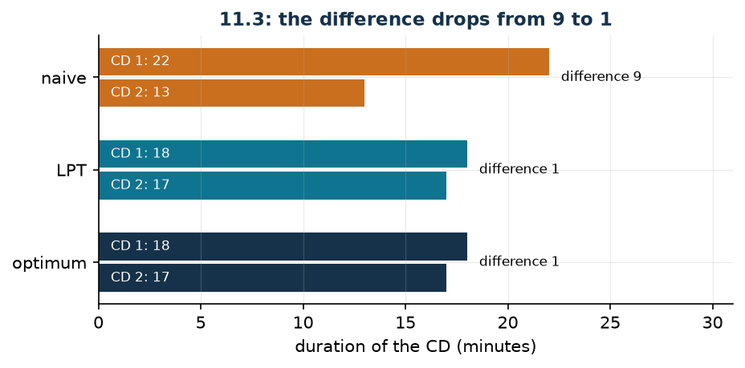

# Songs across CDs

**Class:** MILP · **Links:** maximum and minimum variables · **Script:** `python/fam10_8_cds.py`

[](https://colab.research.google.com/github/fabiofurini/mip-modelling/blob/main/notebooks/fam10_8_cds.ipynb)

!!! abstract "Problem 10.8"
    A record company publishes a collection of $n \in \mathbb{Z}_{\ge 1}$ songs.
    For every song $i \in \{1, \dots, n\}$, the value
    $d_i \in \mathbb{Q}_{\ge 1}$ is its duration in minutes. The collection must
    be distributed over $m \in \mathbb{Z}_{\ge 1}$ compact discs; every song must
    be assigned to exactly one CD, and every CD $j \in \{1, \dots, m\}$ must
    contain at least $w_j \in \mathbb{Z}_{\ge 1}$ songs. The record company wants
    to minimise the difference between the total duration of the longest CD and
    that of the shortest.

**The problem in words.** We *decide* which CD every song ends up on. *The
objective*: CDs as homogeneous in duration as possible. *The constraints*: every
song on one CD only, and no CD too thin.

## Model

**Variables.** $x_{ij} \in \{0,1\}$ equals $1$ if song $i$ goes on CD $j$;
$y \ge 0$ is the duration of the longest CD and $z \ge 0$ that of the shortest.

$$
\begin{aligned}
\min ~~ & y - z\\
\text{s.t.} \quad & \sum_{j=1}^{m} x_{ij} = 1, && \forall i \in \{1, \dots, n\},\\
& \sum_{i=1}^{n} x_{ij} \ge w_j, && \forall j \in \{1, \dots, m\},\\
& -\sum_{i=1}^{n} d_i\, x_{ij} + y \ge 0, && \forall j \in \{1, \dots, m\},\\
& \sum_{i=1}^{n} d_i\, x_{ij} - z \ge 0, && \forall j \in \{1, \dots, m\},\\
& x_{ij} \in \{0,1\}, \quad y \ge 0, \quad z \ge 0.
\end{aligned}
$$

**Description.** The objective is the difference between the longest and the
shortest duration. The **assignment** constraints, one per song, say that every
song ends up on exactly one CD. The **minimum number** constraints, one per CD,
impose at least $w_j$ songs. The **maximum** constraints, one per CD, push $y$
above every duration; the **minimum** ones, again one per CD, push $z$ below
every duration: at the optimum the first becomes the maximum of the durations
and the second the minimum.

!!! note "Two auxiliary variables, two opposite directions"
    The maximum constraints say $y \ge \sum_i d_i x_{ij}$ for every CD: $y$ is
    *at least* the maximum. The minimum ones say $z \le \sum_i d_i x_{ij}$: $z$
    is *at most* the minimum. Neither imposes equality; the objective does,
    pushing $y$ down and $z$ up. It is the [maximum variable](links-05.md)
    technique applied twice, in the two opposite directions.

## The model in gurobipy

```python
m = gp.Model("cds")
x = m.addVars(n, mm, vtype=GRB.BINARY, name="x")
y = m.addVar(name="y")
z = m.addVar(name="z")
m.setObjective(y - z, GRB.MINIMIZE)
m.addConstrs((x.sum(i, "*") == 1 for i in range(n)), name="song")
m.addConstrs((x.sum("*", j) >= w[j] for j in range(mm)), name="minimum_songs")
m.addConstrs((-gp.quicksum(d[i] * x[i, j] for i in range(n)) + y >= 0
              for j in range(mm)), name="maximum")
m.addConstrs((gp.quicksum(d[i] * x[i, j] for i in range(n)) - z >= 0
              for j in range(mm)), name="minimum")
```

## The instance

$n = 6$ songs, $m = 2$ CDs, $w_j = 1$.

| song | 1 | 2 | 3 | 4 | 5 | 6 |
|---|---:|---:|---:|---:|---:|---:|
| $d_i$ (minutes) | 5 | 6 | 7 | 3 | 4 | 10 |

The total duration is $35$ minutes.

## Constructive heuristic: the primal bound

The songs are scanned and each is put on the currently shortest CD. The same
rule, with two different orders, gives two results.

- **(a) Natural order.** $5 \to$ CD1, $6 \to$ CD2, $7 \to$ CD1, $3 \to$ CD2,
  $4 \to$ CD2, $10 \to$ CD1. Final durations $22$ and $13$: difference $9$.
- **(b) Decreasing-duration order (LPT).** $10 \to$ CD1, $7 \to$ CD2,
  $6 \to$ CD2, $5 \to$ CD1, $4 \to$ CD2, $3 \to$ CD1. Final durations $18$ and
  $17$: difference $1$.

The better one is kept: $z(\mathit{MILP}) \le \mathit{UB} = 1$.

## LP relaxation and dual: zero again

Associate $\alpha_i$ free with the assignment, $\beta_j \ge 0$ with the minimum
number, $\gamma_j \ge 0$ with the maximum and $\delta_j \ge 0$ with the minimum.

$$
\begin{aligned}
\max ~~ & \sum_{i=1}^{n} \alpha_i + \sum_{j=1}^{m} w_j\, \beta_j\\
\text{s.t.} \quad & \sum_{j=1}^{m} \gamma_j = 1,\\
& \sum_{j=1}^{m} \delta_j = 1,\\
& \alpha_i + \beta_j - d_i\, \gamma_j + d_i\, \delta_j \le 0, && \forall i \in \{1, \dots, n\},\ \forall j \in \{1, \dots, m\},\\
& \alpha_i \gtreqless 0, \quad \beta_j \ge 0, \quad \gamma_j \ge 0, \quad \delta_j \ge 0.
\end{aligned}
$$

**Description.** $\alpha_i$ is the value of song $i$, $\beta_j$ the price of the
minimum number of songs on CD $j$, while $\gamma_j$ and $\delta_j$ are the
weights with which CD $j$ enters the maximum and the minimum duration. The
objective prices the songs and the thresholds $w_j$. The two equality
constraints are the columns of $y$ and $z$: each of the two variables appears in
one constraint per CD and in the primal objective with coefficient $\pm 1$, so
the respective weights sum to one. The last group are the columns of the
$x_{ij}$: putting song $i$ on CD $j$ satisfies its assignment constraint,
contributes to the minimum number of songs and moves both durations by $d_i$;
the balance cannot be positive.

**Recipe.** With $\bar\gamma_j = \bar\delta_j = 1/m$ and $\alpha = \beta = 0$
the two equality constraints are satisfied and the others become
$-d_i/m + d_i/m = 0 \le 0$. The value is $\mathit{LB} = 0$.

!!! warning "Here too the relaxation is mute"
    That the relaxation is worth zero is clearer from the primal side: setting
    $x_{ij} = 1/m$ for every song and every CD, every CD "lasts"
    $35/2 = 17.5$ minutes and the difference is nil. It is feasible for the
    relaxation and meaningless for the problem, because a song does not split.
    The LP relaxation of balancing models is almost always like this: it
    balances everything and is worth zero.

## A parity argument that closes the problem

The durations are integers and there are two CDs: their durations $D_1$ and
$D_2$ are integers summing to $D = 35$, which is **odd**. Two integers summing
to an odd number cannot be equal, and their difference $|D_1 - D_2|$ has the
same parity as $D$, that is, it is odd. An odd, non-negative difference is at
least $1$:

$$z(\mathit{MILP}) \ge \mathit{LB} = 1 .$$

The LPT heuristic reaches exactly $1$: the two bounds coincide, and the
heuristic solution is optimal. This is known *before* calling the solver, and it
is the sharpest case in the course where a two-line combinatorial argument does
the job the LP relaxation cannot do.

## Optimal solution

| | songs | duration |
|---|---|---:|
| CD 1 | 1, 2, 3 | 18 |
| CD 2 | 4, 5, 6 | 17 |

| $LB$ (parity) | $z(\mathit{LP})$ | $z(\mathit{LP}^+)$ | $z(\mathit{MILP})$ | $UB$ (heuristic) | gap |
|---:|---:|---:|---:|---:|---:|
| 1 | 0 | 0 | 1 | 1 | $0\%$ |



The solution found by the solver is not the LPT one (which put songs $6, 1, 4$
on one CD and $3, 2, 5$ on the other), but it has the same value: the problem
has several optima.

## Additional considerations

- The parity argument holds as it stands for $m = 2$. With $m = 3$ it must be
  redone: $35$ is not divisible by $3$, so the three durations cannot all be
  equal, but the minimum spread is no longer immediate. On the instance with
  three CDs the optimum is $2$ (durations $13, 11, 11$).
- The constraint $\sum_i x_{ij} \ge w_j$ with $w_j = 1$ never bites at the
  optimum: a solution leaving a CD empty would have $z = 0$ and hence a
  difference equal to the total duration. It is needed in the model, though,
  because without it the relaxation would have degenerate solutions.
- Minimising $y - z$ is not equivalent to minimising $y$ (the makespan): the
  latter is the classical formulation of scheduling on parallel machines, and it
  has different optima. It is the same difference as between "balancing" and
  "finishing early".

## Additional modelling questions

??? question "10.8.1 — A smaller medium"
    CD 1 is a reduced medium and cannot exceed $15$ minutes. How does the model
    change? What is the new optimum?

    !!! tip "Solution"
        The solution is in the solutions document, reserved for teachers.

??? question "10.8.2 — Three CDs"
    The collection is distributed over three CDs instead of two. How does the
    model change? What is the new optimum?

    !!! tip "Solution"
        The solution is in the solutions document, reserved for teachers.

## Code

Complete script —
[`python/fam10_8_cds.py`](https://github.com/fabiofurini/mip-modelling/blob/main/python/fam10_8_cds.py)
(reproducible with `python3 python/fam10_8_cds.py` from the `python/` folder).
Notebook —
[`notebooks/fam10_8_cds.ipynb`](https://github.com/fabiofurini/mip-modelling/blob/main/notebooks/fam10_8_cds.ipynb)
— which opens in Colab from the badge at the top of the page.

<!-- embedded-script: begin (regenerated by python/embed_code.py) -->

??? example "Show the complete script — `python/fam10_8_cds.py` (181 lines)"

    ```python
    """Problem 11.3 -- Songs on several CDs: minimising the difference between the
    longest and the shortest.

    Two auxiliary variables: y for the maximum (technique 3.5) and z for the minimum,
    with objective y - z. As in 11.2 the linear relaxation is worth zero, and the
    useful lower bound comes from a parity argument that settles optimality by itself.
    """
    import gurobipy as gp
    import pandas as pd
    from gurobipy import GRB

    from mip import (ammissibile, due_rilassamenti, frazione, nuovo_modello, registra_bound,
                     risolvi, valuta)
    from stile import ARANCIO, BLU, TEAL, intestazione, plt, salva_dati, salva_figura

    R = range

    # ---------- 1. MODEL AND INSTANCE ----------
    intestazione("11.3 Songs on CDs: levelling the longest and the shortest CD")
    d3 = [5, 6, 7, 3, 4, 10]     # duration of the songs, in minutes
    w3 = [1, 1]                  # minimum number of songs per CD
    n3, m3 = len(d3), len(w3)
    D3 = sum(d3)
    salva_dati(pd.DataFrame({"song": R(1, n3 + 1), "duration": d3}), "cd3_dati")
    print(f"  Total duration of the collection: {D3} minutes on {m3} CDs.")


    def modello_3(d, w):
        n, m = len(d), len(w)
        mod = nuovo_modello("cds")
        x = mod.addVars(n, m, vtype=GRB.BINARY, name="x")
        y = mod.addVar(name="y")     # duration of the longest CD
        z = mod.addVar(name="z")     # duration of the shortest CD
        mod.setObjective(y - z, GRB.MINIMIZE)
        mod.addConstrs((x.sum(i, "*") == 1 for i in R(n)), name="song")
        mod.addConstrs((x.sum("*", j) >= w[j] for j in R(m)), name="minimum")
        mod.addConstrs((y - gp.quicksum(d[i] * x[i, j] for i in R(n)) >= 0 for j in R(m)),
                       name="maximum")
        mod.addConstrs((gp.quicksum(d[i] * x[i, j] for i in R(n)) - z >= 0 for j in R(m)),
                       name="minimum_duration")
        return mod, x, y, z


    def duale_3(d, w):
        """max sum_i alpha_i + sum_j w_j beta_j

        alpha_i free (equality constraint), beta_j >= 0 (>= w_j), gamma_j >= 0 (column of
        y: sum_j gamma_j = 1) and delta_j >= 0 (column of z: sum_j delta_j = 1). Column of
        x_ij: alpha_i + beta_j - d_i gamma_j + d_i delta_j <= 0.
        """
        n, m = len(d), len(w)
        dl = nuovo_modello("dual_cds")
        alpha = dl.addVars(n, lb=-GRB.INFINITY, name="alpha")
        beta = dl.addVars(m, name="beta")
        gamma = dl.addVars(m, name="gamma")
        delta = dl.addVars(m, name="delta")
        dl.setObjective(alpha.sum() + gp.quicksum(w[j] * beta[j] for j in R(m)), GRB.MAXIMIZE)
        dl.addConstr(gamma.sum() == 1, name="rcy")
        dl.addConstr(delta.sum() == 1, name="rcz")
        dl.addConstrs((alpha[i] + beta[j] - d[i] * gamma[j] + d[i] * delta[j] <= 0
                       for i in R(n) for j in R(m)), name="rcx")
        return dl


    m3mod, x3, y3, z3v = modello_3(d3, w3)

    # ---------- 2. TWO HEURISTICS COMPARED (UPPER BOUND) ----------
    def riempi(d, m, ordine, etichetta):
        """The songs are scanned in the given order and each one goes on the shortest CD."""
        carichi = [0] * m
        dove = {}
        passi = []
        for i in ordine:
            j = min(R(m), key=lambda j: (carichi[j], j))
            dove[i] = j
            carichi[j] += d[i]
            passi.append(f"song {i + 1} ({d[i]} min) on CD {j + 1}; durations {carichi}")
        diff = max(carichi) - min(carichi)
        print(f"  {etichetta}")
        for k, riga in enumerate(passi, 1):
            print(f"    Step {k}. {riga}")
        print(f"    final durations {carichi}, difference {diff}")
        return dove, carichi, diff


    ordine_lpt = sorted(R(n3), key=lambda i: (-d3[i], i))
    dove, carichi, ub3 = riempi(d3, m3, ordine_lpt,
                                "LPT heuristic: songs in decreasing order of duration.")
    dove_nat, carichi_nat, diff_nat = riempi(d3, m3, list(R(n3)),
                                             "Naive heuristic: songs in the given order.")
    sol_eur = ({f"x[{i},{dove[i]}]": 1 for i in R(n3)}
               | {"y": max(carichi), "z": min(carichi)})
    assert ammissibile(m3mod, sol_eur), sol_eur
    print(f"  The decreasing order gives {frazione(ub3)}, the natural order {frazione(diff_nat)}:")
    print("  the same insertion rule changes a lot depending on the order of the songs.")
    print(f"  The better of the two is kept:  ub = {frazione(ub3)}")
    assert diff_nat >= ub3

    # ---------- 3. THE LP RELAXATION SAYS NOTHING ----------
    dl3 = duale_3(d3, w3)
    mano = {f"gamma[{j}]": 1 / m3 for j in R(m3)} | {f"delta[{j}]": 1 / m3 for j in R(m3)}
    lb_lp, viol = valuta(dl3, mano)
    assert viol <= 1e-9, viol
    print(f"  Hand-built dual: gamma_j = delta_j = 1/{m3}, alpha = beta = 0 -> value "
          f"{frazione(lb_lp)}.")
    zlp3, zlp3r, _ = due_rilassamenti(m3mod, dl3)
    meta = ({f"x[{i},{j}]": 1 / m3 for i in R(n3) for j in R(m3)}
            | {"y": D3 / m3, "z": D3 / m3})
    val_meta, viol_meta = valuta(m3mod, meta)
    assert viol_meta <= 1e-9 and abs(val_meta) <= 1e-9
    print(f"  And indeed z(LP) = {frazione(zlp3)}: putting 1/{m3} of every song on every CD, all")
    print(f"  the CDs last {frazione(D3 / m3)} minutes and the difference is zero. A song, though,")
    print("  cannot be split.")
    assert abs(zlp3) <= 1e-9

    # ---------- 4. THE PARITY BOUND ----------
    intestazione("11.3 A parity argument that settles the problem")
    print(f"  The durations are integers and there are {m3} CDs: the two durations add up to")
    print(f"  {D3}, which is {'odd' if D3 % 2 else 'even'}. Two integers adding up to an odd")
    print("  number cannot be equal, and their difference is itself odd: so it is at least 1.")
    lb3 = 1 if D3 % 2 else 0
    assert m3 == 2, "the parity argument holds as written for two CDs only"
    print(f"  lb = {frazione(lb3)}, and the LPT heuristic reaches {frazione(ub3)}: the two bounds")
    print("  coincide and the heuristic solution is already optimal, with no need for the solver.")
    salva_dati(pd.DataFrame([{"argument": "parity of the total duration", "bound": lb3},
                             {"argument": "dual of the LP relaxation", "bound": lb_lp}]),
               "cd3_argomento")

    # ---------- 5. OPTIMUM OF THE MILP ----------
    z3 = risolvi(m3mod)
    carichi_ott = [sum(d3[i] * x3[i, j].X for i in R(n3)) for j in R(m3)]
    for j in R(m3):
        brani = [i + 1 for i in R(n3) if x3[i, j].X > 0.5]
        print(f"  CD {j + 1}: songs {brani}, duration {frazione(carichi_ott[j])} minutes")
    riga = registra_bound("3 cds", ub3, lb3, zlp3, zlp3r, z3)
    salva_dati(pd.DataFrame([riga]), "cd3_bound")
    assert lb3 <= z3 <= ub3 + 1e-9 and abs(z3 - lb3) <= 1e-9

    # ---------- 6. ADDITIONAL MODELLING QUESTIONS ----------
    varianti = {}


    def variante(nome, m):
        z = risolvi(m)
        print(f"  {nome:70s} z = {frazione(z)}")
        return z


    # 3a: CD 1 is a smaller medium and cannot exceed 15 minutes
    m, x, y, z = modello_3(d3, w3)
    m.addConstr(gp.quicksum(d3[i] * x[i, 0] for i in R(n3)) <= 15, name="capacity_cd1")
    varianti["3a"] = variante("3a. CD 1 cannot exceed 15 minutes", m)
    print(f"       CD 2 must then hold at least {D3} - 15 = {D3 - 15} minutes and the difference")
    print(f"       cannot go below {D3 - 2 * 15}: the bound is read off the data.")
    # 3b: three CDs instead of two
    m, x, y, z = modello_3(d3, [1, 1, 1])
    varianti["3b"] = variante("3b. The collection is spread over three CDs", m)
    print(f"       with three CDs the total duration {D3} is no longer divisible into equal")
    print("       parts: the parity argument has to be redone and no longer proves optimality.")
    salva_dati(pd.DataFrame({"variant": list(varianti), "z": list(varianti.values())}),
               "cd3_varianti")

    # ---------- 7. FIGURE ----------
    fig, ax = plt.subplots(figsize=(6.8, 2.9))
    for k, (nome, car, colore) in enumerate([("naive heuristic", carichi_nat, ARANCIO),
                                             ("LPT heuristic", carichi, TEAL),
                                             ("optimum", carichi_ott, BLU)]):
        for j in R(m3):
            ax.barh(k + (j - 0.5) * 0.34, car[j], 0.3, color=colore)
            ax.annotate(f"CD {j + 1}: {frazione(car[j])}", (0.6, k + (j - 0.5) * 0.34),
                        va="center", fontsize=8, color="white")
        ax.annotate(f"difference {frazione(max(car) - min(car))}", (max(car) + 0.6, k),
                    va="center", fontsize=8)
    ax.set_yticks(R(3))
    ax.set_yticklabels(["naive", "LPT", "optimum"])
    ax.set_xlim(0, max(carichi_nat) + 9)
    ax.set_xlabel("duration of the CD (minutes)")
    ax.set_title(f"11.3: the difference drops from {frazione(diff_nat)} to {frazione(z3)}")
    ax.invert_yaxis()
    salva_figura(fig, "cap10_cd_ottimo")
    print("Done.")
    ```

<!-- embedded-script: end -->
