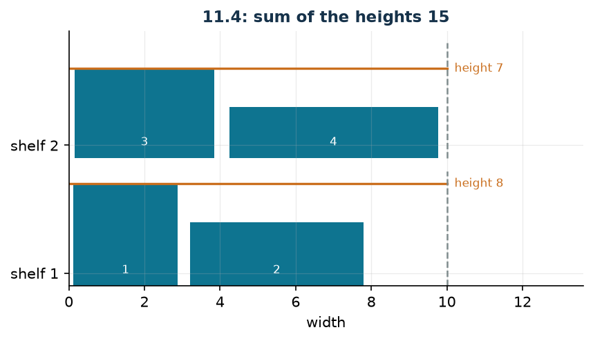

# Books across shelves

**Class:** MILP · **Links:** maximum variable (disaggregated form) · **Script:** `python/fam10_9_shelves.py`

[](https://colab.research.google.com/github/fabiofurini/mip-modelling/blob/main/notebooks/fam10_9_shelves.ipynb)

!!! abstract "Problem 10.9"
    A library has to arrange $n \in \mathbb{Z}_{\ge 1}$ books on shelves. Every
    book $b \in \{1, \dots, n\}$ has width $w_b \in \mathbb{Z}_{\ge 1}$ and
    height $h_b \in \mathbb{Z}_{\ge 1}$. There are $m \in \mathbb{Z}_{\ge 1}$
    shelves available, each of maximum width $c \in \mathbb{Q}_{>0}$. Every book
    must be assigned to exactly one shelf, and the total width of the books on a
    shelf cannot exceed $c$. The height of a shelf is that of the tallest book on
    it. The library wants to minimise the sum of the heights of the shelves.

**The problem in words.** We *decide* which shelf every book goes on. *The
objective*: minimum total height (it is the timber that is saved). *The
constraints*: every book on one shelf only, and no shelf wider than $c$.

## Model

**Variables.** $x_{bs} \in \{0,1\}$ equals $1$ if book $b$ goes on shelf $s$;
$y_s \ge 0$ is the height of shelf $s$.

$$
\begin{aligned}
\min ~~ & \sum_{s=1}^{m} y_s\\
\text{s.t.} \quad & \sum_{s=1}^{m} x_{bs} = 1, && \forall b \in \{1, \dots, n\},\\
& \sum_{b=1}^{n} w_b\, x_{bs} \le c, && \forall s \in \{1, \dots, m\},\\
& -h_b\, x_{bs} + y_s \ge 0, && \forall b \in \{1, \dots, n\},\ \forall s \in \{1, \dots, m\},\\
& x_{bs} \in \{0,1\}, \quad y_s \ge 0.
\end{aligned}
$$

**Description.** The objective is the total height of the shelves. The
**assignment** constraints, one per book, say that every book sits on exactly
one shelf. The **width** constraints, one per shelf, are the capacity. The
**height** constraints, one per book–shelf pair, push $y_s$ above that of every
book placed on that shelf.

!!! note "The link between the variables"
    The height constraints say $y_s \ge h_b\, x_{bs}$: if book $b$ is on shelf
    $s$ then $y_s \ge h_b$, otherwise they say nothing ($y_s \ge 0$). None of
    them imposes equality; the minimisation objective does, pushing every $y_s$
    to the smallest allowed value, that is the height of the tallest book
    present. It is the [maximum variable](links-05.md) technique in
    disaggregated form.

## The model in gurobipy

```python
m = gp.Model("shelves")
x = m.addVars(n, ms, vtype=GRB.BINARY, name="x")
y = m.addVars(ms, name="y")
m.setObjective(y.sum(), GRB.MINIMIZE)
m.addConstrs((x.sum(b, "*") == 1 for b in range(n)), name="book")
m.addConstrs((gp.quicksum(w[b] * x[b, s] for b in range(n)) <= c
              for s in range(ms)), name="width")
m.addConstrs((-h[b] * x[b, s] + y[s] >= 0 for b in range(n) for s in range(ms)),
             name="height")
```

## The instance

$n = 4$ books, $m = 2$ shelves, $c = 10$.

| | $b=1$ | $b=2$ | $b=3$ | $b=4$ |
|---|---:|---:|---:|---:|
| $w_b$ | 3 | 5 | 4 | 6 |
| $h_b$ | 8 | 5 | 7 | 4 |

The total width of the books is $18$, the total capacity $2 \cdot 10 = 20$.

## Constructive heuristic: two orders, two outcomes

The rule is first-fit: every book on the first shelf it fits on. As in
[problem 10.8](mixed-8.md) the order changes everything — but here, in one
order, the heuristic *fails*.

- **(a) Decreasing-height order ($1, 3, 2, 4$).** Book 1 (width 3) on shelf 1;
  book 3 (width 4) on shelf 1, which reaches $7$; book 2 (width 5) on shelf 2.
  Book 4 is left, width $6$: shelf 1 has $3$ of residue, shelf 2 has $5$.
  **The heuristic fails.**
- **(b) Decreasing-width order ($4, 2, 3, 1$).** Book 4 on shelf 1; book 2 on
  shelf 2; book 3 on shelf 1, which reaches $10$; book 1 on shelf 2, which
  reaches $8$. Heights $\max(4, 7) = 7$ and $\max(5, 8) = 8$, sum $15$.

$$z(\mathrm{MILP}) \le \mathit{UB} = 15 .$$

!!! warning "The right order depends on the constraint, not on the objective"
    The decreasing-height order is the one suggested by the *objective*, but the
    constraint that can make an insertion infeasible is the *width*: that is
    what one must sort on. It is the same logic as first-fit decreasing for bin
    packing, where one sorts by size and not by value. A constructive heuristic
    that may fail is not wrong in itself — one just has to foresee the case and
    change the order — but it must be said explicitly, because a heuristic "that
    sometimes returns nothing" provides no bound at all.

## LP relaxation and dual: the dual bound

Associate $\alpha_b$ free with the assignment, $\beta_s \le 0$ with the width
($\le$ in a minimisation) and $\gamma_{bs} \ge 0$ with the height.

$$
\begin{aligned}
\max ~~ & \sum_{b=1}^{n} \alpha_b + c \sum_{s=1}^{m} \beta_s\\
\text{s.t.} \quad & \sum_{b=1}^{n} \gamma_{bs} \le 1, && \forall s \in \{1, \dots, m\},\\
& \alpha_b + w_b\, \beta_s - h_b\, \gamma_{bs} \le 0, && \forall b \in \{1, \dots, n\},\ \forall s \in \{1, \dots, m\},\\
& \alpha_b \gtreqless 0, \quad \beta_s \le 0, \quad \gamma_{bs} \ge 0.
\end{aligned}
$$

**Description.** $\alpha_b$ is the value of book $b$, $\beta_s$ the
(non-positive) price of the width of shelf $s$, and $\gamma_{bs}$ the price of
the link "the height of shelf $s$ covers book $b$". The objective prices the
books and the width available. The first group of constraints are the columns of
the $y_s$: the height of shelf $s$ costs $1$ in the primal objective, and the
prices of the links that push it up cannot be worth more. The second are the
columns of the $x_{bs}$: putting book $b$ on shelf $s$ satisfies its assignment
constraint, takes up $w_b$ of width and forces the height up to $h_b$; the
balance cannot be positive.

**Recipe.** Set $\beta = 0$ (width is not priced) and concentrate all the weight
$\gamma$ on the tallest book, number $1$ with $h_1 = 8$: $\bar\gamma_{1s} = 1$
for every $s$ and $\bar\gamma_{bs} = 0$ elsewhere. The first group becomes
$1 \le 1$; the second gives $\alpha_1 \le 8$ and $\alpha_b \le 0$ for
$b \ne 1$. With $\bar\alpha_1 = 8$ the value is $\mathit{LB} = 8$: the shelf
hosting the tallest book is at least as tall as it is.

## A stronger combinatorial bound

The total width of the books is $18$ and every shelf holds $10$: at least
$\lceil 18/10 \rceil = 2$ non-empty shelves are needed. One of them hosts the
tallest book and measures at least $8$; the other contains at least one book, so
it measures at least $\min_{b \ne 1} h_b = 4$. Summing,

$$z(\mathrm{MILP}) \ge \mathit{LB} = 8 + 4 = 12 ,$$

better than the dual bound $8$. Here too the jump comes from integrality: the
relaxation can put half a book on each shelf and pay half the height twice, that
is, still $8$ in total.

## Optimal solution

| | books | width | height |
|---|---|---:|---:|
| shelf 1 | 1, 2 | 8 of 10 | 8 |
| shelf 2 | 3, 4 | 10 of 10 | 7 |

| $LB$ (combinatorial) | $z(\mathrm{LP})$ | $z(\mathrm{LP}^+)$ | $z(\mathrm{MILP})$ | $UB$ (heuristic) | gap |
|---:|---:|---:|---:|---:|---:|
| 12 | 8 | 8 | 15 | 15 | $0\%$ |



The heuristic gap is zero: first-fit by decreasing width finds the optimum. The
certified gap, before solving the MILP, is $(15-12)/15 = 20\%$.

## Additional considerations

- The problem is a variant of bin packing in which the cost of a container is
  not fixed but depends on its contents. It is known as *bin packing with item
  fragmentation* or, in the warehouse literature, as *shelf space allocation*.
- The model has an annoying symmetry: swapping the two shelves gives the same
  solution with the same value. On larger instances it is worth breaking it, for
  example by imposing $y_1 \ge y_2 \ge \dots \ge y_m$.
- The disaggregated form uses $n\,m$ constraints. The aggregated form with a
  big-M, $y_s \ge h_b - M(1 - x_{bs})$, would use just as many and is weaker:
  here the disaggregated one costs nothing and is preferable.

## Additional modelling questions

??? question "10.9.1 — A third shelf"
    The library buys a third shelf, as wide as the others. What is the new
    optimum?

    !!! tip "Solution"
        The solution is in the solutions document, reserved for teachers.

??? question "10.9.2 — Wider shelves"
    The shelves are $12$ wide instead of $10$. What is the new optimum?

    !!! tip "Solution"
        The solution is in the solutions document, reserved for teachers.

## Code

Complete script —
[`python/fam10_9_shelves.py`](https://github.com/fabiofurini/mip-modelling/blob/main/python/fam10_9_shelves.py)
(reproducible with `python3 python/fam10_9_shelves.py` from the `python/`
folder). Notebook —
[`notebooks/fam10_9_shelves.ipynb`](https://github.com/fabiofurini/mip-modelling/blob/main/notebooks/fam10_9_shelves.ipynb)
— which opens in Colab from the badge at the top of the page.

<!-- embedded-script: begin (regenerated by python/embed_code.py) -->

??? example "Show the complete script — `python/fam10_9_shelves.py` (185 lines)"

    ```python
    """Problem 11.4 -- Books on shelves: minimising the sum of the heights.

    Assignment with a capacity (the width of the shelf) and a maximum variable per
    shelf (technique 3.5): the height of a shelf is that of the tallest book on it.
    It also shows that the order in which the heuristic looks at the objects can lead
    it into a dead end.
    """
    import gurobipy as gp
    import pandas as pd
    from gurobipy import GRB

    from mip import (ammissibile, due_rilassamenti, frazione, nuovo_modello, registra_bound,
                     risolvi, valuta)
    from stile import ARANCIO, BLU, GRIGIO, TEAL, intestazione, plt, salva_dati, salva_figura

    R = range

    # ---------- 1. MODEL AND INSTANCE ----------
    intestazione("11.4 Books on shelves: minimising the sum of the heights")
    w4 = [3, 5, 4, 6]      # width of the books
    h4 = [8, 5, 7, 4]      # height of the books
    c4 = 10                # width of every shelf
    n4, m4 = len(w4), 2    # books and shelves
    salva_dati(pd.DataFrame({"book": R(1, n4 + 1), "width": w4, "height": h4}),
               "scaffali4_dati")
    print(f"  Total width of the books: {sum(w4)}; overall capacity: {m4} * {c4} = {m4 * c4}.")


    def modello_4(w, h, c, m):
        n = len(w)
        mod = nuovo_modello("shelves")
        x = mod.addVars(n, m, vtype=GRB.BINARY, name="x")
        y = mod.addVars(m, name="y")            # height of the shelf
        mod.setObjective(y.sum(), GRB.MINIMIZE)
        mod.addConstrs((x.sum(b, "*") == 1 for b in R(n)), name="book")
        mod.addConstrs((gp.quicksum(w[b] * x[b, s] for b in R(n)) <= c for s in R(m)),
                       name="width")
        mod.addConstrs((y[s] - h[b] * x[b, s] >= 0 for b in R(n) for s in R(m)), name="height")
        return mod, x, y


    def duale_4(w, h, c, m):
        """max sum_b alpha_b + c sum_s beta_s   with  beta_s <= 0  and  gamma >= 0,
           column of x_bs: alpha_b + w_b beta_s - h_b gamma_bs <= 0,
           column of y_s:  sum_b gamma_bs <= 1."""
        n = len(w)
        dl = nuovo_modello("dual_shelves")
        alpha = dl.addVars(n, lb=-GRB.INFINITY, name="alpha")
        beta = dl.addVars(m, lb=-GRB.INFINITY, ub=0.0, name="beta")
        gamma = dl.addVars(n, m, name="gamma")
        dl.setObjective(alpha.sum() + c * beta.sum(), GRB.MAXIMIZE)
        dl.addConstrs((gamma.sum("*", s) <= 1 for s in R(m)), name="rcy")
        dl.addConstrs((alpha[b] + w[b] * beta[s] - h[b] * gamma[b, s] <= 0
                       for b in R(n) for s in R(m)), name="rcx")
        return dl


    m4mod, x4, y4 = modello_4(w4, h4, c4, m4)

    # ---------- 2. TWO ORDERS FOR THE SAME HEURISTIC ----------
    def first_fit(w, h, c, m, ordine, etichetta):
        """Every book on the first shelf where it fits; if it fits nowhere the heuristic
        fails and returns None."""
        n = len(w)
        dove, residuo, passi = {}, [c] * m, []
        for b in ordine:
            posti = [s for s in R(m) if residuo[s] >= w[b]]
            if not posti:
                passi.append(f"book {b + 1} (width {w[b]}): it fits on no shelf "
                             f"(residuals {residuo}) -> the heuristic fails")
                print(f"  {etichetta}")
                for k, riga in enumerate(passi, 1):
                    print(f"    Step {k}. {riga}")
                return None, None, passi
            s = posti[0]
            dove[b] = s
            residuo[s] -= w[b]
            passi.append(f"book {b + 1} (width {w[b]}, height {h[b]}) on shelf {s + 1}; "
                         f"residuals {residuo}")
        altezze = [max((h[b] for b in R(n) if dove[b] == s), default=0) for s in R(m)]
        print(f"  {etichetta}")
        for k, riga in enumerate(passi, 1):
            print(f"    Step {k}. {riga}")
        print(f"    shelf heights {altezze}, sum {sum(altezze)}")
        return dove, altezze, passi


    ordine_h = sorted(R(n4), key=lambda b: (-h4[b], b))
    dove_h, alt_h, _ = first_fit(w4, h4, c4, m4, ordine_h,
                                 "Order by decreasing height (books 1, 3, 2, 4):")
    assert dove_h is None, "on this instance the height order must get stuck"
    print("  The height order ignores the widths and gets stuck. The right criterion for a")
    print("  capacity constraint is the width.")
    ordine_w = sorted(R(n4), key=lambda b: (-w4[b], b))
    dove_w, alt_w, _ = first_fit(w4, h4, c4, m4, ordine_w,
                                 "Order by decreasing width (books 4, 2, 3, 1):")
    ub4 = sum(alt_w)
    sol_eur = {f"x[{b},{dove_w[b]}]": 1 for b in R(n4)} | {f"y[{s}]": alt_w[s] for s in R(m4)}
    assert ammissibile(m4mod, sol_eur), sol_eur
    print(f"  ub = {frazione(ub4)}")

    # ---------- 3. LP RELAXATION AND DUAL (LOWER BOUND) ----------
    dl4 = duale_4(w4, h4, c4, m4)
    # recipe: beta = 0, and all the gamma "weight" is concentrated on the tallest book
    alto = max(R(n4), key=lambda b: h4[b])
    mano = ({f"gamma[{alto},{s}]": 1.0 for s in R(m4)}
            | {f"alpha[{alto}]": float(h4[alto])})
    lb_lp, viol = valuta(dl4, mano)
    assert viol <= 1e-9, viol
    print(f"  Hand-built dual: beta = 0, gamma_bs = 1 only for the tallest book (number")
    print(f"  {alto + 1}, height {h4[alto]}) and alpha equal to {h4[alto]} on that book, zero on")
    print(f"  the others. The dual constraints become {h4[alto]} <= {h4[alto]} and 0 <= 0  ->  "
          f"lb = {frazione(lb_lp)}.")
    print("  It is the obvious remark: the shelf holding the tallest book is at least as tall as")
    print(f"  that book, so the sum of the heights is at least {h4[alto]}.")
    zlp4, zlp4r, _ = due_rilassamenti(m4mod, dl4)

    # ---------- 4. A STRONGER COMBINATORIAL BOUND ----------
    intestazione("11.4 The combinatorial bound: at least two shelves are used")
    usati = -(-sum(w4) // c4)     # integer division rounding up
    print(f"  The total width is {sum(w4)} and every shelf holds {c4}: at least")
    print(f"  ceil({sum(w4)} / {c4}) = {usati} shelves must be non-empty.")
    altre = sorted(h4[b] for b in R(n4) if b != alto)
    lb4 = h4[alto] + min(altre)
    print(f"  One of them holds the tallest book and measures at least {h4[alto]}; the other one")
    print(f"  holds at least one book, so it measures at least {min(altre)}, the smallest")
    print("  remaining height.")
    print(f"  lb = {h4[alto]} + {min(altre)} = {frazione(lb4)}, better than the dual bound "
          f"{frazione(lb_lp)}.")
    salva_dati(pd.DataFrame([{"argument": "dual of the LP relaxation", "bound": lb_lp},
                             {"argument": "shelves used and minimum heights", "bound": lb4}]),
               "scaffali4_argomento")

    # ---------- 5. OPTIMUM OF THE MILP ----------
    z4 = risolvi(m4mod)
    for s in R(m4):
        libri = [b + 1 for b in R(n4) if x4[b, s].X > 0.5]
        largh = sum(w4[b] for b in R(n4) if x4[b, s].X > 0.5)
        print(f"  Shelf {s + 1}: books {libri}, width {largh}/{c4}, height {frazione(y4[s].X)}")
    riga = registra_bound("4 shelves", ub4, lb4, zlp4, zlp4r, z4)
    salva_dati(pd.DataFrame([riga]), "scaffali4_bound")
    assert lb4 <= z4 <= ub4 + 1e-9

    # ---------- 6. ADDITIONAL MODELLING QUESTIONS ----------
    varianti = {}


    def variante(nome, m):
        z = risolvi(m)
        print(f"  {nome:70s} z = {frazione(z)}")
        return z


    # 4a: one more shelf
    m, x, y = modello_4(w4, h4, c4, 3)
    varianti["4a"] = variante("4a. The library buys a third shelf (m = 3)", m)
    print("       the optimum does not change: an empty shelf has height zero and costs nothing,")
    print("       but splitting the books over three shelves means paying three heights, not two.")
    # 4b: wider shelves
    m, x, y = modello_4(w4, h4, 12, m4)
    varianti["4b"] = variante("4b. The shelves are 12 wide instead of 10", m)
    salva_dati(pd.DataFrame({"variant": list(varianti), "z": list(varianti.values())}),
               "scaffali4_varianti")

    # ---------- 7. FIGURE ----------
    fig, ax = plt.subplots(figsize=(6.4, 3.2))
    for s in R(m4):
        sx = 0.0
        for b in R(n4):
            if x4[b, s].X > 0.5:
                ax.bar(sx + w4[b] / 2, h4[b], w4[b] * 0.92, bottom=s * 10, color=TEAL)
                ax.annotate(str(b + 1), (sx + w4[b] / 2, s * 10 + 1), ha="center", fontsize=8,
                            color="white")
                sx += w4[b]
        ax.plot([0, c4], [s * 10 + y4[s].X, s * 10 + y4[s].X], color=ARANCIO, lw=1.6)
        ax.annotate(f"height {frazione(y4[s].X)}", (c4 + 0.2, s * 10 + y4[s].X), fontsize=8,
                    va="center", color=ARANCIO)
        ax.plot([c4, c4], [s * 10, s * 10 + 9], color=GRIGIO, ls="--", lw=1.2)
    ax.set_xlim(0, c4 + 3.6)
    ax.set_yticks([1, 11])
    ax.set_yticklabels(["shelf 1", "shelf 2"])
    ax.set_xlabel("width")
    ax.set_title(f"11.4: sum of the heights {frazione(z4)}")
    salva_figura(fig, "cap10_scaffali_ottimo")
    print("Done.")
    ```

<!-- embedded-script: end -->
