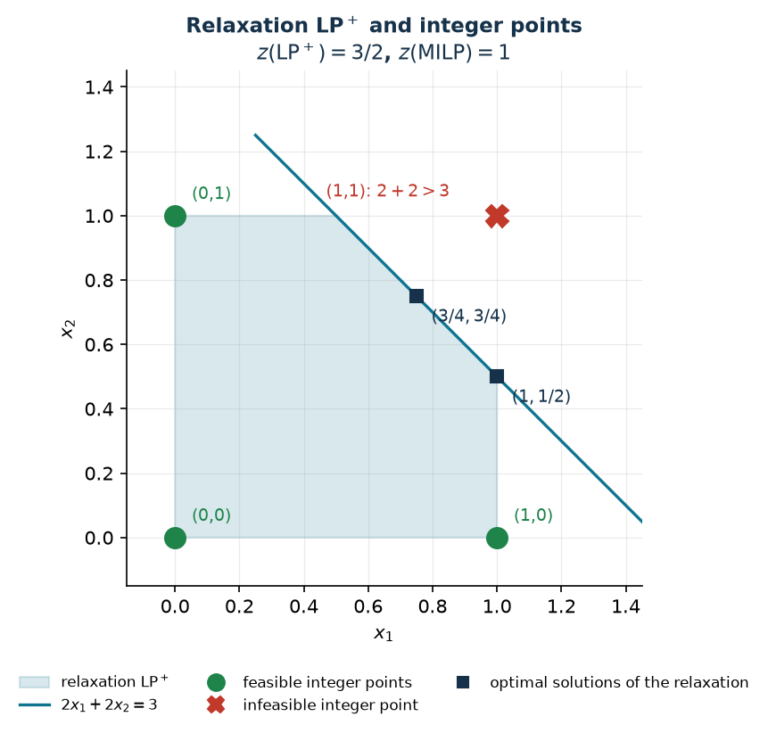

# What is a MIP model

**Class:** LP · ILP · BIP · MILP · **Script:** `python/cap01_models.py`

[](https://colab.research.google.com/github/fabiofurini/mip-modelling/blob/main/notebooks/cap01_models.ipynb)

## Data, variables, objective, constraints

A *mathematical programming* model translates a decision into four ingredients,
always in the same order: the **data** (the numbers known before deciding), the
**variables** (what the decision maker controls), the **objective** (a function
of the variables to minimise or maximise) and the **constraints** (the equations
and inequalities that make a solution feasible).

!!! note "Notation for optimal values"
    $X$ is the **feasible set** (the points satisfying all constraints, domains
    included); $z(\mathit{MILP})$, $z(\mathit{LP})$, $z(\mathit{D})$ are the
    optimal values of the MILP, of its relaxation and of the dual of the
    relaxation. **Feasible** solutions carry a bar ($\bar x$), **optimal**
    ones a tilde ($\tilde x$). The bounds are called $\mathit{LB}$ and
    $\mathit{UB}$, whatever the direction of the objective; when the solution
    they come from matters we write $\mathit{LB}(\bar x)$, $\mathit{UB}(\bar x)$
    for a feasible solution of the model and $\mathit{LB}(\bar\pi)$,
    $\mathit{UB}(\bar\pi)$ for a feasible solution of the dual. We always write
    $z(\mathit{MILP})$ and never $z^\star$: which model is being optimised must
    be explicit.

**Classes of models.** Upright LP is the *class* of problems, italic
$\mathit{LP}$ is *one* problem of that class; the same for ILP, BIP and MILP. In
every class objective and constraints are linear: only the domain of the
variables changes, that is, the last row of the model. A model has $n$
variables, with $j \in \{1, 2, \dots, n\}$, and $m$ constraints, with
$i \in \{1, 2, \dots, m\}$; the data are the costs $c_j$, the coefficients
$a_{ij}$ and the right-hand sides $b_i$. Here the constraints are $\ge$, the
variables non-negative and the objective a minimisation; with $\max$ only the
direction of the optimisation changes.

**A model of LP type** — all variables continuous:

$$
\begin{aligned}
\min ~~ \sum_{j=1}^{n} c_j\, x_j & & \\
\text{subject to} \quad \sum_{j=1}^{n} a_{ij}\, x_j &\ge b_i, & \forall i \in \{1, 2, \dots, m\},\\
x_j &\ge 0, & \forall j \in \{1, 2, \dots, n\}.
\end{aligned}
$$

**A model of ILP type** — all variables integer:

$$
\begin{aligned}
\min ~~ \sum_{j=1}^{n} c_j\, x_j & & \\
\text{subject to} \quad \sum_{j=1}^{n} a_{ij}\, x_j &\ge b_i, & \forall i \in \{1, 2, \dots, m\},\\
x_j &\in \mathbb{Z}_{\ge 0}, & \forall j \in \{1, 2, \dots, n\}.
\end{aligned}
$$

**A model of BIP type** — all variables binary:

$$
\begin{aligned}
\min ~~ \sum_{j=1}^{n} c_j\, x_j & & \\
\text{subject to} \quad \sum_{j=1}^{n} a_{ij}\, x_j &\ge b_i, & \forall i \in \{1, 2, \dots, m\},\\
x_j &\in \{0, 1\}, & \forall j \in \{1, 2, \dots, n\}.
\end{aligned}
$$

**A model of MILP type** — with $J \subseteq \{1, 2, \dots, n\}$ the set of indices of the integer variables:

$$
\begin{aligned}
\min ~~ \sum_{j=1}^{n} c_j\, x_j & & \\
\text{subject to} \quad \sum_{j=1}^{n} a_{ij}\, x_j &\ge b_i, & \forall i \in \{1, 2, \dots, m\},\\
x_j &\in \mathbb{Z}_{\ge 0}, & \forall j \in J,\\
x_j &\ge 0, & \forall j \in \{1, 2, \dots, n\} \setminus J.
\end{aligned}
$$

These are the models in their simplest form: a model can also contain $\le$
constraints and equality constraints — and the ones in the following chapters
use all three — as well as several different families of variables.

The objective adds up the costs of the decisions taken; each constraint $i$ ties
the variables to the right-hand side $b_i$; the last row declares the domain and
is the only thing that tells the four classes apart. Every datum and every
symbol is defined before it is used: in every model the variables are introduced
before the formulation, the domain constraints close the model, and a list
explains objective and constraints family by family. This course works almost
exclusively with MILPs.

## Why integrality matters

$$
\begin{aligned}
\max ~~ x_1 + x_2 & & \\
\text{subject to} \quad 2x_1 + 2x_2 &\le 3, & \\
x_1,\ x_2 &\in \{0,1\}. &
\end{aligned}
$$

The LP relaxation replaces $x_1, x_2 \in \{0,1\}$ by $0 \le x_1, x_2 \le 1$ and
is worth $z(\mathit{LP}^+) = 3/2$. That value is attained by **infinitely many**
optimal solutions — every point of the segment $x_1 + x_2 = 3/2$ inside the
square — among them $(3/4, 3/4)$, $(1, 1/2)$ and $(1/2, 1)$. Which one the
solver returns depends on the algorithm: on our installation Gurobi gives
$(1/2, 1)$.

The outcome of rounding depends on the starting point **and** on the direction.
From $(3/4, 3/4)$: upwards it gives $(1,1)$, which violates the constraint
($2+2 = 4 > 3$); downwards it gives $(0,0)$, feasible but of value $0$. From
this point **neither** direction finds the optimum. From $(1, 1/2)$: upwards it
gives $(1,1)$ again, infeasible; downwards it gives $(1, 0)$, feasible with
value $1$ — which is exactly the integer optimum, $z(\mathit{MILP}) = 1$. There
is no "right" direction.



Two distinct lessons: rounding can produce **infeasible** points, and when it
produces feasible ones there is no guarantee on their value; and the difference
$3/2 - 1 = 1/2$ is not the fault of rounding — no feasible integer point is
worth more than $1$.

## The two relaxations, and which side they are on

!!! note "Two versions not to be confused"
    - **relaxation without the bounds** $z(\mathit{LP})$: $x \in \{0,1\}$ becomes $x \ge 0$
      alone. This is the one whose dual the exercises write by hand.
    - **relaxation with the bounds** $z(\mathit{LP}^+)$: $x \in \{0,1\}$
      becomes $0 \le x \le 1$. This is Gurobi's `relax()` and the root
      relaxation of branch-and-bound.

    In a maximisation
    $z(\mathit{LP}) \ge z(\mathit{LP}^+) \ge z(\mathit{MILP})$; in a
    minimisation the directions are reversed. The two coincide when the other
    constraints already imply $x \le 1$ — for instance with an assignment
    constraint $\sum_m x_{jm} = 1$.

The relaxation **removes** constraints, hence

$$X_{\mathit{MILP}} \subseteq X_{\mathit{LP}^+} \subseteq X_{\mathit{LP}},$$

and optimising over a larger set cannot give a worse value. In a maximisation
the relaxation is an *upper* bound, in a minimisation a *lower* bound: in both
cases it is an **optimistic** bound.

!!! warning "Which side each bound comes from"
    The dual of the relaxation does **not** give a bound "from the other side".
    By weak duality, in a minimisation every feasible dual solution is worth at
    most $z(\mathit{LP})$, hence at most $z(\mathit{MILP})$: it sits on the
    *same* side as the relaxation. The bound from the other side — the
    *pessimistic* one — comes only from a feasible solution of the MILP, that
    is, from a heuristic or from the solver. Let
    $(\bar x_1, \bar x_2, \dots, \bar x_n)$ be a feasible solution of the MILP,
    of value $\sum_{j=1}^{n} c_j\, \bar x_j$, and
    $(\bar\pi_1, \bar\pi_2, \dots, \bar\pi_m)$ a feasible solution of the dual
    of the relaxation, of value $\sum_{i=1}^{m} b_i\, \bar\pi_i$. In a
    **minimisation** the first gives $\mathit{UB}(\bar x)$ and the second
    $\mathit{LB}(\bar\pi)$:

    $$\mathit{LB}(\bar\pi) \le z(\mathit{D}(\mathit{LP})) = z(\mathit{LP}) \le z(\mathit{LP}^+) \le z(\mathit{MILP}) \le \mathit{UB}(\bar x)$$

    in a **maximisation** the roles are swapped, the first gives
    $\mathit{LB}(\bar x)$ and the second $\mathit{UB}(\bar\pi)$:

    $$\mathit{LB}(\bar x) \le z(\mathit{MILP}) \le z(\mathit{LP}^+) \le z(\mathit{LP}) = z(\mathit{D}(\mathit{LP})) \le \mathit{UB}(\bar\pi)$$

## Three "gaps" not to be confused

1. **Heuristic gap.** If $\bar x$ is the solution built by the heuristic, its
   value $\sum_{j=1}^{n} c_j\, \bar x_j$ is the bound $\mathit{UB}(\bar x)$ in a
   minimisation (and $\mathit{LB}(\bar x)$ in a maximisation), and the gap is
   $\bigl|\mathit{UB}(\bar x) - z(\mathit{MILP})\bigr| / |z(\mathit{MILP})|$
   when the optimum is known — it is the one reported in the exercise tables.
   When the optimum is not known it is computed against a dual bound, which
   takes its place.
2. **Certified gap** between two known bounds, without knowing the optimum:
   $(\mathit{UB} - \mathit{LB})/|\mathit{UB}|$ for a minimisation with
   $\mathit{UB} > 0$. It guarantees the optimum lies in the interval, not that
   it is close to either end.
3. **The solver's `MIPGap`**: the same idea, computed by Gurobi from its own
   `ObjVal` and `ObjBound` and with its tolerances.

The numerator is always taken in absolute value; if the denominator is zero the
relative gap is not written and the absolute difference is reported.

## Three patterns that keep coming back

| Name | Constraint | Meaning |
|---|---|---|
| **set partitioning** | $\sum_{i \in I} x_i = 1$ | exactly one element of $I$ |
| **set packing** | $\sum_{i \in I} x_i \le 1$ | at most one element of $I$ |
| **set covering** | $\sum_{i \in I} x_i \ge 1$ | at least one element of $I$ |

Problem [7.1](scheduling-1.md) uses a *partitioning* for every job,
[7.3](scheduling-3.md) a *packing*, and [chapter 2](modelling-2.md) shows
*covering* as the direct translation of an OR clause.

## What the solver does with the two bounds

A MILP with a bounded feasible set is solved with dedicated algorithms. How they
work — how the solution space is explored, how cuts are separated, what to
branch on — is not a topic of this course: solution techniques are the subject
of a separate course. Only one thing matters here: the two bounds this course
teaches how to build by hand are exactly the ones the solver works with.

- The **primal bound** is a feasible solution, and it gives a value to beat: any
  part of the space that cannot do better is discarded without being explored.
- The **dual bound** comes from the relaxation, and says how much one may hope
  for at most: the closer it is to the integer optimum — that is, the tighter
  the formulation, see [chapter 3](links.md) — the less work is left.

The gap between the two is what the solver reports as `MIPGap`, and it is also
the only thing one can claim with certainty when the optimum is not reached.

## What this chapter leaves open

| Question | Where it is answered |
|---|---|
| How are logical conditions translated into linear constraints? | [Chapter 2](modelling-2.md) |
| How are different families of variables linked to each other? | [Chapter 3](links.md) |
| How is an optimistic bound built by hand? | [Chapter 4](modelling-4.md) |
| How is a feasible solution built quickly? | [Chapter 5](modelling-5.md) |
| How is all of this written in Python/Gurobi, and how are the results read? | [Chapter 6](modelling-6.md) |

## Code

The complete script — the two relaxations, the rounding
trace and the figure — is
[`python/cap01_models.py`](https://github.com/fabiofurini/mip-modelling/blob/main/python/cap01_models.py)
(reproducible with `python3 python/cap01_models.py` from the `python/` folder).
The same code is available as a notebook —
[`notebooks/cap01_models.ipynb`](https://github.com/fabiofurini/mip-modelling/blob/main/notebooks/cap01_models.ipynb)
— which opens in Colab from the badge at the top of the page.

<!-- embedded-script: begin (regenerated by python/embed_code.py) -->

??? example "Show the complete script — `python/cap01_models.py` (116 lines)"

    ```python
    """Chapter 1 -- What is a MIP model: relaxation, rounding, bounds.

    Numerical check of the chapter's examples: the rounding counterexample, the two
    relaxations (pure and with the bounds kept), the integer optimum and the trace
    and the two bounds of the sandwich. Every number quoted in
    the notes and on the website comes from here.
    """
    import gurobipy as gp
    import numpy as np
    import pandas as pd
    from gurobipy import GRB

    from mip import (ammissibile, frazione, nuovo_modello, rilassamento, risolvi,
                     stampa_soluzione, valuta, viola_interezza)
    from stile import BLU, CICLO, GRIGIO, ROSSO, TEAL, VERDE, intestazione, plt, salva_dati, salva_figura

    R = range

    # ---------- 1. THE MODEL OF THE EXAMPLE ----------
    intestazione("1. max x1 + x2  s.t.  2x1 + 2x2 <= 3,  x1, x2 binary")


    def modello_esempio(binarie=True, superiore=True):
        """Model (1.1) of the chapter.

        binarie=True   -> MILP;  binarie=False -> continuous relaxation
        superiore=True -> the bound x <= 1 is kept (relaxation LP+); False -> only x >= 0
        """
        m = nuovo_modello("rounding")
        tipo = GRB.BINARY if binarie else GRB.CONTINUOUS
        ub = 1.0 if superiore else GRB.INFINITY
        x = m.addVars(2, vtype=tipo, lb=0.0, ub=ub, name="x")
        m.setObjective(x[0] + x[1], GRB.MAXIMIZE)
        m.addConstr(2 * x[0] + 2 * x[1] <= 3, name="resource")
        return m, x


    # ---------- 2. THE TWO RELAXATIONS ----------
    intestazione("2. The two relaxations: pure (x >= 0) and with the bounds kept (x <= 1)")
    m_lp, x_lp = modello_esempio(binarie=False, superiore=False)
    zlp = risolvi(m_lp)
    print(f"Relaxation without the bounds   z(LP)  = {frazione(zlp)}   solution returned by the solver:")
    stampa_soluzione(m_lp)
    m_lpp, x_lpp = modello_esempio(binarie=False, superiore=True)
    zlpp = risolvi(m_lpp)
    vertice = (x_lpp[0].X, x_lpp[1].X)
    print(f"Relaxation LP+    z(LP+) = {frazione(zlpp)}   solution returned by the solver: "
          f"({frazione(vertice[0])}, {frazione(vertice[1])})")
    print("Both are worth 3/2: the resource constraint already gives x1 + x2 <= 3/2, and")
    print("the bound x <= 1 cuts off no point of that segment.")

    # every optimal solution of LP+ lies on the segment x1 + x2 = 3/2 inside [0,1]^2
    for punto in [(0.75, 0.75), (1.0, 0.5), (0.5, 1.0)]:
        z, viol = valuta(m_lpp, {"x[0]": punto[0], "x[1]": punto[1]})
        assert viol <= 1e-9 and abs(z - 1.5) <= 1e-9
        print(f"  ({frazione(punto[0])}, {frazione(punto[1])}) is feasible for LP+ and is worth "
              f"{frazione(z)}: one of infinitely many optimal solutions.")

    # ---------- 3. WHY ROUNDING FAILS ----------
    intestazione("3. Rounding the fractional solutions")
    m_mip, x_mip = modello_esempio(binarie=True)
    for base in [(0.75, 0.75), (1.0, 0.5)]:
        for verso, arr in [("to nearest", lambda v: round(v)), ("downwards", int)]:
            cand = {"x[0]": float(arr(base[0])), "x[1]": float(arr(base[1]))}
            z, viol = valuta(m_mip, cand)
            ok = ammissibile(m_mip, cand)
            print(f"  from ({frazione(base[0])}, {frazione(base[1])}) rounding {verso:11s} -> "
                  f"({frazione(cand['x[0]'])}, {frazione(cand['x[1]'])})  "
                  f"{'feasible, value ' + frazione(z) if ok else f'INFEASIBLE (violation {viol:g})'}")
    assert not ammissibile(m_mip, {"x[0]": 1.0, "x[1]": 1.0})
    assert ammissibile(m_mip, {"x[0]": 1.0, "x[1]": 0.0})
    # the integrality check really is needed: (1, 1/2) satisfies the linear constraints
    assert valuta(m_mip, {"x[0]": 1.0, "x[1]": 0.5})[1] <= 1e-9
    assert viola_interezza(m_mip, {"x[0]": 1.0, "x[1]": 0.5}) == 0.5
    assert not ammissibile(m_mip, {"x[0]": 1.0, "x[1]": 0.5})
    print("  (1, 1/2) satisfies the linear constraints but violates integrality by 1/2:")
    print("  continuous feasibility alone does not certify an integer primal bound.")

    # ---------- 4. THE INTEGER OPTIMUM ----------
    intestazione("4. The integer optimum")
    zmilp = risolvi(m_mip)
    print(f"z(MILP) = {frazione(zmilp)}   optimal solution:")
    stampa_soluzione(m_mip)
    print(f"Difference between relaxation and integer optimum: {frazione(zlpp)} - {frazione(zmilp)} = "
          f"{frazione(zlpp - zmilp)}")
    salva_dati(pd.DataFrame([{"model": "example 1.1", "z_lp": zlp, "z_lp_rafforzato": zlpp,
                              "z_milp": zmilp}]), "cap01_bound")


    # ---------- 6. FIGURE: THE FEASIBLE REGION AND THE INTEGER POINTS ----------
    fig, ax = plt.subplots(figsize=(5.4, 5.0))
    poligono = [(0, 0), (1, 0), (1, 0.5), (0.5, 1), (0, 1)]
    ax.fill(*zip(*poligono), color=TEAL, alpha=0.16, zorder=1, label="relaxation LP$^+$")
    ax.plot([0.25, 1.5], [1.25, 0.0], color=TEAL, lw=1.6, zorder=2, label="$2x_1 + 2x_2 = 3$")
    for (p, q) in [(0, 0), (1, 0), (0, 1)]:
        ax.plot(p, q, "o", color=VERDE, ms=11, zorder=4)
        ax.annotate(f"({p},{q})", (p, q), textcoords="offset points", xytext=(9, 9),
                    fontsize=9, color=VERDE)
    ax.plot(1, 1, "X", color=ROSSO, ms=12, zorder=4)
    ax.annotate("(1,1): $2+2 > 3$", (1, 1), textcoords="offset points", xytext=(-92, 10),
                fontsize=9, color=ROSSO)
    for (p, q), testo in [((0.75, 0.75), "$(3/4,3/4)$"), ((1.0, 0.5), "$(1,1/2)$")]:
        ax.plot(p, q, "s", color=BLU, ms=7, zorder=4)
        ax.annotate(testo, (p, q), textcoords="offset points", xytext=(8, -14), fontsize=9, color=BLU)
    ax.plot([], [], "o", color=VERDE, ms=9, label="feasible integer points")
    ax.plot([], [], "X", color=ROSSO, ms=9, label="infeasible integer point")
    ax.plot([], [], "s", color=BLU, ms=6, label="optimal solutions of the relaxation")
    ax.set_xlim(-0.15, 1.45)
    ax.set_ylim(-0.15, 1.45)
    ax.set_xlabel("$x_1$")
    ax.set_ylabel("$x_2$")
    ax.set_title("Relaxation LP$^+$ and integer points\n$z(\\mathrm{LP}^+) = 3/2$, $z(\\mathrm{MILP}) = 1$")
    ax.legend(loc="upper right", fontsize=8)
    ax.set_aspect("equal")
    salva_figura(fig, "cap01_rilassamento")
    print("Done.")
    ```

<!-- embedded-script: end -->
