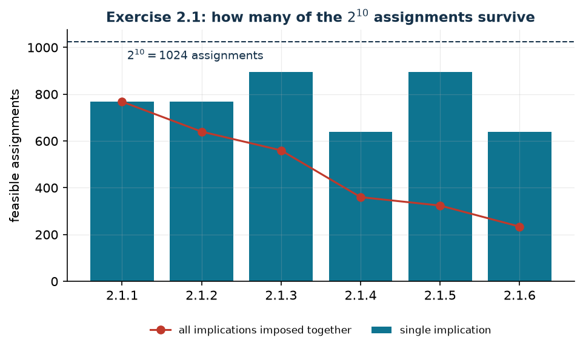

# Logic and binary variables

**Class:** BIP · **Links:** clauses and implications · **Script:** `python/cap02_logic.py`

[](https://colab.research.google.com/github/fabiofurini/mip-modelling/blob/main/notebooks/cap02_logic.ipynb)

A binary variable is a "yes/no" answer. This chapter translates logical
conditions between those answers into **linear constraints** and — above all —
shows how to *prove* that the translation is exact.

## Propositions, expressions, satisfiability

A boolean function returns `TRUE` or `FALSE` and is represented by
$x \in \{0,1\}$: $x = 1$ if and only if the proposition is true. A **boolean
expression** is built from binary variables, the three operators `AND`
($\land$), `OR` ($\lor$), `NOT` ($\lnot$) and parentheses. The **satisfiability
problem** asks whether an assignment exists that makes the expression true.

!!! example "Satisfiable and not"
    - `NOT` $x_a$ `OR` $\big((x_b$ `OR` $x_c)$ `AND` $(x_d$ `OR` $x_e)\big)$ is
      satisfied by $x_a = 0$.
    - $(x_a$ `OR` $x_b)$ `AND` $(x_c$ `OR` $x_d)$ `AND` `NOT` $x_e$ is
      satisfied by $x_a = x_c = 1$, $x_b = x_d = x_e = 0$.
    - $(x_a \lor x_b) \land (\lnot x_a \lor x_b) \land (x_a \lor \lnot x_b) \land (\lnot x_a \lor \lnot x_b)$
      is **unsatisfiable**: each of the four assignments of $(x_a, x_b)$
      falsifies one clause.

## Literals, clauses, conjunctive normal form

A **literal** is a variable or its negation; a **clause** is a disjunction of
literals; an expression is in **conjunctive normal form** (CNF) if it is a
conjunction of clauses.

The equivalences needed, for every $x_a, x_b, x_c \in \{0,1\}$:

$$
\begin{aligned}
x_a \land (x_b \lor x_c) &\iff (x_a \land x_b) \lor (x_a \land x_c) &&\text{(distributive C)}\\
x_a \lor (x_b \land x_c) &\iff (x_a \lor x_b) \land (x_a \lor x_c) &&\text{(distributive D)}\\
\lnot(x_a \lor x_b) &\iff \lnot x_a \land \lnot x_b &&\text{(De Morgan A)}\\
\lnot(x_a \land x_b) &\iff \lnot x_a \lor \lnot x_b &&\text{(De Morgan B)}\\
x_a \lor (x_a \land x_b) &\iff x_a &&\text{(absorption E)}\\
x_a \land (x_a \lor x_b) &\iff x_a &&\text{(absorption F)}\\
\lnot(\lnot x_a) &\iff x_a &&\text{(double negation)}
\end{aligned}
$$

Each is proved by cases: with two variables there are $4$ assignments, with
three there are $8$. The script runs the check on all seven.

!!! tip "Collecting: distributive (C) read backwards"
    $(x_a \land x_b) \lor (x_a \land x_c) \iff x_a \land (x_b \lor x_c)$. It is
    useful when putting into CNF a disjunction of several conjunctions sharing
    literals. For instance "at least two of $a, b, c$", that is
    $(x_a \land x_b) \lor (x_a \land x_c) \lor (x_b \land x_c)$, becomes

    $$(x_a \lor x_b) \land (x_a \lor x_c) \land (x_b \lor x_c).$$

## From CNF to linear constraints

!!! note "The translation, in three rules"
    1. every **clause** becomes an inequality constraint $\ge 1$;
    2. every `OR` inside the clause becomes a $+$;
    3. every negative literal `NOT` $x$ becomes $1 - x$.

A clause with positive literals $P$ and negative literals $N$ becomes

$$\sum_{i \in P} x_i + \sum_{i \in N} (1 - x_i) \ge 1
\iff \sum_{i \in P} x_i - \sum_{i \in N} x_i \ge 1 - |N|.$$

The left-hand side counts **how many literals of the clause are true**: asking
it to be $\ge 1$ is asking the clause to be true.

!!! warning "The form in which the constraint is written"
    With two or more negative literals the equivalent form obtained by
    multiplying by $-1$ reads better: $1 - x_1 + 1 - x_6 + x_7 \ge 1$ is written
    $x_1 + x_6 - x_7 \le 1$. It is the same constraint. What never changes is
    the number of constraints: **one per clause**, counted after removing
    tautologies and absorbed clauses.

## Logical implications

$x_a \Rightarrow x_b$ is equivalent to `NOT` $x_a$ `OR` $x_b$, already in CNF,
that is to $x_b - x_a \ge 0$. The **contrapositive**
$\lnot x_b \Rightarrow \lnot x_a$ is not a second constraint: by double negation
its expression is the same one.

| Implication | Expression in CNF | Constraints | # |
|---|---|---|---|
| $x_a \land x_b \Rightarrow x_c$ | $\lnot x_a \lor \lnot x_b \lor x_c$ | $x_a + x_b - x_c \le 1$ | 1 |
| $x_a \lor x_b \Rightarrow x_c$ | $(\lnot x_a \lor x_c) \land (\lnot x_b \lor x_c)$ | $x_c - x_a \ge 0$, $x_c - x_b \ge 0$ | 2 |
| $x_a \Rightarrow x_b \land x_c$ | $(\lnot x_a \lor x_b) \land (\lnot x_a \lor x_c)$ | $x_b - x_a \ge 0$, $x_c - x_a \ge 0$ | 2 |
| $x_a \Rightarrow x_b \lor x_c$ | $\lnot x_a \lor x_b \lor x_c$ | $x_b + x_c - x_a \ge 0$ | 1 |

A **disjunction in the antecedent** and a **conjunction in the consequent** cost
two constraints; the opposite costs one.

## Splitting an implication: when it is allowed

$$(x_a \lor x_b) \Rightarrow x_c \iff (x_a \Rightarrow x_c) \land (x_b \Rightarrow x_c)$$
$$x_a \Rightarrow (x_b \land x_c) \iff (x_a \Rightarrow x_b) \land (x_a \Rightarrow x_c)$$

!!! danger "The split with a conjunctive antecedent is **not** valid"
    $(x_a \land x_b) \Rightarrow x_c$ is **not** equivalent to
    $(x_a \Rightarrow x_c) \land (x_b \Rightarrow x_c)$. With $x_a = 1$,
    $x_b = 0$, $x_c = 0$ the original implication is *true* (false antecedent)
    but $x_a \Rightarrow x_c$ is *false*: the conjunction of the two splits is
    **strictly stronger** and cuts off solutions the problem allows.

## Counting: at most one, at least one, exactly one

| Condition | Constraint | Note |
|---|---|---|
| at least one | $\sum_{i \in I} x_i \ge 1$ | it is the clause: *set covering* |
| at most one | $\sum_{i \in I} x_i \le 1$ | *set packing*; equivalent to $\binom{|I|}{2}$ clauses, but in one constraint and tighter |
| exactly one | $\sum_{i \in I} x_i = 1$ | *set partitioning* |
| at least $p$ | $\sum_{i \in I} x_i \ge p$ | in CNF it would take $\binom{|I|}{|I|-p+1}$ clauses |
| at most $p$ | $\sum_{i \in I} x_i \le p$ | in CNF it would take $\binom{|I|}{p+1}$ clauses |

!!! tip "One cardinality constraint beats many clauses"
    "At most one out of three" is written as three clauses ($x_1+x_2 \le 1$,
    $x_1+x_3 \le 1$, $x_2+x_3 \le 1$) or as $x_1+x_2+x_3 \le 1$. Same binary
    solutions, different relaxations: $x = (1/2,1/2,1/2)$ satisfies the three
    clauses and violates the aggregated constraint. When counting is possible,
    count.

## Checking the translation, not trusting it

A translation is correct when, for **every** binary assignment, the expression
is true if and only if all constraints are satisfied. With few variables this is
an enumeration of $2^n$ cases: it is the proof, by cases, of the result. The
module
[`python/booleane.py`](https://github.com/fabiofurini/mip-modelling/blob/main/python/booleane.py)
performs it, and every translation below is checked this way.

## Five solved exercises

In all of them, $x_p = 1$ if project $p$ is chosen.

??? question "2.1 — Direct implications (ten projects)"
    (1) if 2 is chosen then 3 is chosen; (2) if 2 is chosen then 4 is not
    chosen; (3) if 1 and 6 are chosen then 7 is chosen; (4) if 1 or 6 is chosen
    then 8 is chosen; (5) if 2 and 3 are chosen then 9 is not chosen; (6) if 2
    or 3 is chosen then 10 is not chosen.

    !!! tip "Solution"
        The solution is in the solutions document, reserved for instructors.
??? question "2.2 — Negated antecedents and consequents (ten projects)"
    (1) $\lnot x_3 \Rightarrow x_2$; (2) $\lnot x_4 \Rightarrow \lnot x_2$;
    (3) $x_7 \Rightarrow x_1 \land x_6$; (4) $x_8 \Rightarrow x_1 \lor x_6$;
    (5) $\lnot x_9 \Rightarrow x_2 \land x_3$;
    (6) $\lnot x_{10} \Rightarrow x_2 \lor x_3$.

    !!! tip "Solution"
        The solution is in the solutions document, reserved for instructors.
??? question "2.3 — Compound antecedents and consequents (eight projects)"
    (1) $x_7 \lor x_3 \Rightarrow x_1 \land x_2$;
    (2) $x_1 \land x_6 \land x_7 \Rightarrow x_8$;
    (3) $x_5 \land x_2 \land \lnot x_4 \Rightarrow \lnot x_3$;
    (4) $(x_1 \lor x_4) \land x_6 \Rightarrow x_2 \land (x_5 \lor x_7)$;
    (5) $(x_2 \lor x_5) \land \lnot x_8 \Rightarrow x_3 \lor \lnot x_6$;
    (6) $(x_1 \lor x_4) \land (x_2 \lor x_5) \land \lnot x_8 \Rightarrow x_3 \land (\lnot x_6 \lor x_7)$.

    !!! tip "Solution"
        The solution is in the solutions document, reserved for instructors.
??? question "2.4 — "At least two of" (nine projects)"
    (1) $x_4 \Rightarrow$ at least two of 1, 2, 3; (2) at least two of 6, 7, 8
    $\Rightarrow x_5$; (3) $\lnot x_4 \Rightarrow$ at least two of 1, 2, 3, 9;
    (4) $x_8 \Rightarrow (x_1 \land x_6) \lor (x_1 \land x_7) \lor (x_2 \land x_6)$;
    (5) at least two of 1, 3, 5 $\Rightarrow \lnot x_9$;
    (6) $(x_1 \land x_2) \lor (x_3 \land x_4) \Rightarrow x_5$.

    !!! tip "Solution"
        The solution is in the solutions document, reserved for instructors.
    !!! warning "«At least two» can also be written by counting"
        As the consequent of the implication governed by $x_4$, the condition is
        also $x_1 + x_2 + x_3 \ge 2 x_4$: one constraint instead of three, with
        the same $16$ binary solutions but **stronger** in the relaxation. On
        $\max x_1+x_2+x_3+3x_4$ with $x_1+x_2+x_3+2x_4 \le 3$ and
        $z(\mathit{MILP}) = 3$, the three clauses give
        $z(\mathit{LP}^+) = 27/7 \approx 3.86$ and the counted constraint
        $15/4 = 3.75$.

??? question "2.5 — Splits (ten projects)"
    (1) $x_1 \lor x_2 \Rightarrow x_3$; (2) $x_4 \Rightarrow x_5 \land x_6$;
    (3) $x_1 \lor x_2 \Rightarrow x_3 \land x_4$;
    (4) $x_1 \land x_2 \Rightarrow x_3$; (5) $x_5 \lor x_6 \Rightarrow \lnot x_7$;
    (6) $\lnot x_8 \lor \lnot x_9 \Rightarrow x_{10}$.

    !!! tip "Solution"
        The solution is in the solutions document, reserved for instructors.
## Logical constraints inside an optimisation model

With the ten projects of exercise 2.1, revenues and costs

| project $p$ | 1 | 2 | 3 | 4 | 5 | 6 | 7 | 8 | 9 | 10 |
|---|---:|---:|---:|---:|---:|---:|---:|---:|---:|---:|
| revenue $r_p$ | 9 | 7 | 4 | 8 | 3 | 6 | 2 | 5 | 7 | 6 |
| cost $b_p$ | 4 | 3 | 2 | 4 | 2 | 3 | 1 | 3 | 4 | 3 |

and budget $B = 14$:

$$
\begin{aligned}
\max ~~ \sum_{p=1}^{10} r_p x_p & &\\
\text{subject to}\quad \sum_{p=1}^{10} b_p x_p &\le B, &\\
\text{the 8 constraints} &\text{ of exercise 2.1}, &\\
x_p &\in \{0,1\}. &
\end{aligned}
$$

Without the logical constraints the optimum is $30$. With them it drops to
$z(\mathit{MILP}) = 28$, with projects $1, 2, 3, 5, 8$ of total cost $14$: the
budget is tight. The relaxation $z(\mathit{LP}^+)$ is $29$.

!!! tip "How much six implications cut"
    The $2^{10} = 1024$ assignments drop to $234$ once all six implications are
    imposed: less than a quarter. None of them, on its own, cuts more than half
    the space.



```python
from booleane import cnf, vincolo, IMP, AND, OR, NOT, V

x = {p: V(f"x{p}") for p in range(1, 11)}
implications = [IMP(x[2], x[3]), IMP(x[2], NOT(x[4])),
                IMP(AND(x[1], x[6]), x[7]), IMP(OR(x[1], x[6]), x[8]),
                IMP(AND(x[2], x[3]), NOT(x[9])), IMP(OR(x[2], x[3]), NOT(x[10]))]

m = gp.Model("project_selection");  m.Params.OutputFlag = 0
xv = m.addVars(range(1, 11), vtype=GRB.BINARY, name="x")
m.setObjective(gp.quicksum(r[p] * xv[p] for p in range(1, 11)), GRB.MAXIMIZE)
m.addConstr(gp.quicksum(b[p] * xv[p] for p in range(1, 11)) <= budget, name="budget")
for i, formula in enumerate(implications, 1):          # one clause, one constraint
    for j, clause in enumerate(cnf(formula), 1):
        coef, sense, rhs = vincolo(clause)
        lhs = gp.quicksum(k * xv[int(n[1:])] for n, k in coef.items())
        m.addConstr(lhs <= rhs if sense == "<=" else lhs >= rhs, name=f"logic{i}_{j}")
m.optimize()
```

## What is left to the next chapter

Here the links are between variables that are **all binary**. When one of the
families is continuous or integer — "if the machine is not on it produces
nothing", "this variable equals the maximum of those" — CNF is no longer enough:
the coefficients, the big-Ms and the optimality arguments of
[chapter 3](links.md) are needed.

## Code

The complete script is
[`python/cap02_logic.py`](https://github.com/fabiofurini/mip-modelling/blob/main/python/cap02_logic.py),
which uses the module
[`python/booleane.py`](https://github.com/fabiofurini/mip-modelling/blob/main/python/booleane.py).
The notebook is
[`notebooks/cap02_logic.ipynb`](https://github.com/fabiofurini/mip-modelling/blob/main/notebooks/cap02_logic.ipynb).

<!-- embedded-script: begin (regenerated by python/embed_code.py) -->

??? example "Show the complete script — `python/cap02_logic.py` (218 lines)"

    ```python
    """Chapter 2 -- Logic and binary variables: from CNF to linear constraints.

    Turns the implications of the chapter's five exercises into conjunctive normal
    form and then into linear constraints, and *proves by enumeration* that the
    translation is exact: for every binary assignment, the formula is true if and
    only if the linear system is satisfied. It ends with a project-selection model
    that uses those constraints.
    """
    import gurobipy as gp
    import pandas as pd
    from gurobipy import GRB

    from booleane import (AND, IMP, NOT, OR, V, cnf, equivalenti, scrivi, testo_cnf,
                          valuta, variabili, verifica, vincolo)
    from mip import ammissibile, frazione, nuovo_modello, rilassamento, risolvi, stampa_soluzione
    from stile import BLU, CICLO, ROSSO, TEAL, VERDE, intestazione, plt, salva_dati, salva_figura

    R = range
    x = {p: V(f"x{p}") for p in R(1, 11)}

    # ---------- 1. THE PROPERTIES OF BOOLEAN ALGEBRA ----------
    intestazione("1. De Morgan, distributivity, absorption: checked by enumeration")
    a, b, c = V("xa"), V("xb"), V("xc")
    PROPRIETA = [
        ("distributivity (C)", AND(a, OR(b, c)), OR(AND(a, b), AND(a, c))),
        ("distributivity (D)", OR(a, AND(b, c)), AND(OR(a, b), OR(a, c))),
        ("De Morgan (A)", NOT(OR(a, b)), AND(NOT(a), NOT(b))),
        ("De Morgan (B)", NOT(AND(a, b)), OR(NOT(a), NOT(b))),
        ("absorption (E)", OR(a, AND(a, b)), a),
        ("absorption (F)", AND(a, OR(a, b)), a),
        ("double negation", NOT(NOT(a)), a),
    ]
    for nome, sinistra, destra in PROPRIETA:
        assert equivalenti(sinistra, destra), nome
        print(f"  {nome:22s} checked on all {2 ** len(variabili(sinistra) | variabili(destra))} assignments")

    # ---------- 2. THE VALID SPLITS AND THE INVALID ONE ----------
    intestazione("2. Splitting an implication: when it is allowed and when it is not")
    scissioni = [
        ("disjunctive antecedent", IMP(OR(a, b), c), AND(IMP(a, c), IMP(b, c)), True),
        ("conjunctive consequent", IMP(a, AND(b, c)), AND(IMP(a, b), IMP(a, c)), True),
        ("conjunctive antecedent", IMP(AND(a, b), c), AND(IMP(a, c), IMP(b, c)), False),
    ]
    for nome, sinistra, destra, attesa in scissioni:
        ok = equivalenti(sinistra, destra)
        assert ok == attesa, nome
        print(f"  {nome:24s} split {'valid' if ok else 'NOT valid'}")
    contro = {"xa": 1, "xb": 0, "xc": 0}
    assert valuta(IMP(AND(a, b), c), contro) and not valuta(AND(IMP(a, c), IMP(b, c)), contro)
    print("  counterexample to the third: xa = 1, xb = 0, xc = 0 makes the original")
    print("  implication true (false antecedent) but the conjunction of the splits false.")

    # ---------- 3. THE FIVE EXERCISES: CNF AND LINEAR CONSTRAINTS ----------
    intestazione("3. Exercises 2.1-2.5: conjunctive normal form and linear constraints")
    ESERCIZI = {
        "2.1": [("if 2 is chosen, then 3 is chosen", IMP(x[2], x[3])),
                ("if 2 is chosen, then 4 is not chosen", IMP(x[2], NOT(x[4]))),
                ("if 1 and 6 are chosen, then 7 is chosen", IMP(AND(x[1], x[6]), x[7])),
                ("if 1 or 6 is chosen, then 8 is chosen", IMP(OR(x[1], x[6]), x[8])),
                ("if 2 and 3 are chosen, then 9 is not chosen", IMP(AND(x[2], x[3]), NOT(x[9]))),
                ("if 2 or 3 is chosen, then 10 is not chosen", IMP(OR(x[2], x[3]), NOT(x[10])))],
        "2.2": [("if 3 is not chosen, then 2 is chosen", IMP(NOT(x[3]), x[2])),
                ("if 4 is not chosen, then 2 is not chosen", IMP(NOT(x[4]), NOT(x[2]))),
                ("if 7 is chosen, then 1 and 6 are chosen", IMP(x[7], AND(x[1], x[6]))),
                ("if 8 is chosen, then 1 or 6 is chosen", IMP(x[8], OR(x[1], x[6]))),
                ("if 9 is not chosen, then 2 and 3 are chosen", IMP(NOT(x[9]), AND(x[2], x[3]))),
                ("if 10 is not chosen, then 2 or 3 is chosen", IMP(NOT(x[10]), OR(x[2], x[3])))],
        "2.3": [("if 7 or 3 is chosen, then 1 and 2 are chosen", IMP(OR(x[7], x[3]), AND(x[1], x[2]))),
                ("if 1, 6 and 7 are chosen, then 8 is chosen", IMP(AND(x[1], x[6], x[7]), x[8])),
                ("if 5 and 2 are chosen and 4 is not, then 3 is not chosen",
                 IMP(AND(x[5], x[2], NOT(x[4])), NOT(x[3]))),
                ("if 6 and (1 or 4) are chosen, then 2 and (5 or 7) are chosen",
                 IMP(AND(OR(x[1], x[4]), x[6]), AND(x[2], OR(x[5], x[7])))),
                ("if (2 or 5) is chosen and 8 is not, then 3 is chosen or 6 is not",
                 IMP(AND(OR(x[2], x[5]), NOT(x[8])), OR(x[3], NOT(x[6])))),
                ("if (1 or 4) and (2 or 5) and not 8, then 3 and (not 6 or 7)",
                 IMP(AND(OR(x[1], x[4]), OR(x[2], x[5]), NOT(x[8])),
                     AND(x[3], OR(NOT(x[6]), x[7]))))],
        "2.4": [("if 4 is chosen, at least two of 1, 2, 3",
                 IMP(x[4], OR(AND(x[1], x[2]), AND(x[1], x[3]), AND(x[2], x[3])))),
                ("if at least two of 6, 7, 8, then 5",
                 IMP(OR(AND(x[6], x[7]), AND(x[6], x[8]), AND(x[7], x[8])), x[5])),
                ("if 4 is not chosen, at least two of 1, 2, 3, 9",
                 IMP(NOT(x[4]), OR(AND(x[1], x[2]), AND(x[1], x[3]), AND(x[1], x[9]),
                                   AND(x[2], x[3]), AND(x[2], x[9]), AND(x[3], x[9])))),
                ("if 8 is chosen, then (1 and 6) or (1 and 7) or (2 and 6)",
                 IMP(x[8], OR(AND(x[1], x[6]), AND(x[1], x[7]), AND(x[2], x[6])))),
                ("if at least two of 1, 3, 5, then 9 is not chosen",
                 IMP(OR(AND(x[1], x[3]), AND(x[1], x[5]), AND(x[3], x[5])), NOT(x[9]))),
                ("if (1 and 2) or (3 and 4), then 5",
                 IMP(OR(AND(x[1], x[2]), AND(x[3], x[4])), x[5]))],
        "2.5": [("if 1 or 2 is chosen, then 3 is chosen", IMP(OR(x[1], x[2]), x[3])),
                ("if 4 is chosen, then 5 and 6 are chosen", IMP(x[4], AND(x[5], x[6]))),
                ("if 1 or 2 is chosen, then 3 and 4 are chosen",
                 IMP(OR(x[1], x[2]), AND(x[3], x[4]))),
                ("if 1 and 2 are chosen, then 3 is chosen", IMP(AND(x[1], x[2]), x[3])),
                ("if 5 or 6 is chosen, then 7 is not chosen", IMP(OR(x[5], x[6]), NOT(x[7]))),
                ("if 8 is not chosen or 9 is not chosen, then 10 is chosen",
                 IMP(OR(NOT(x[8]), NOT(x[9])), x[10]))],
    }
    righe = []
    for es, voci in ESERCIZI.items():
        print(f"\nExercise {es}")
        for i, (testo, formula) in enumerate(voci, 1):
            clausole = cnf(formula)
            vincoli = [vincolo(c) for c in clausole]
            totali, vere = verifica(formula, vincoli)
            print(f"  {es}.{i}  {testo}")
            print(f"        CNF ({len(clausole)} clauses) -> "
                  + " ;  ".join(scrivi(v, mat=False) for v in vincoli))
            print(f"        equivalence checked on {totali} assignments "
                  f"({vere} make the formula true)")
            righe.append({"exercise": es, "item": i, "description": testo,
                          "clauses": len(clausole),
                          "constraints": " ; ".join(scrivi(v, mat=False) for v in vincoli),
                          "assignments": totali, "true": vere})
    salva_dati(pd.DataFrame(righe), "cap02_implicazioni")

    # ---------- 4. CLAUSES OR COUNTING: TWO FORMULATIONS OF THE SAME SET ----------
    intestazione("4. 'At least two of 1, 2, 3 if 4 is chosen': clauses versus counting")


    def confronta(clausole=True):
        """max x1+x2+x3+3 x4 with the implication x4 => at least two of 1,2,3."""
        m = nuovo_modello("at_least_two")
        v = m.addVars(R(1, 5), vtype=GRB.BINARY, name="x")
        m.setObjective(v[1] + v[2] + v[3] + 3 * v[4], GRB.MAXIMIZE)
        m.addConstr(v[1] + v[2] + v[3] + 2 * v[4] <= 3, name="budget")
        if clausole:                       # three clauses: x_i + x_j >= x4 for every pair
            for i, j in [(1, 2), (1, 3), (2, 3)]:
                m.addConstr(v[i] + v[j] - v[4] >= 0, name=f"pair{i}{j}")
        else:                              # counted form: x1 + x2 + x3 >= 2 x4
            m.addConstr(v[1] + v[2] + v[3] - 2 * v[4] >= 0, name="counting")
        return m, v


    for nome, cl in [("three clauses", True), ("one counted constraint", False)]:
        m, v = confronta(cl)
        z = risolvi(m)
        zr, sol, _ = rilassamento(m, rafforzato=True)
        print(f"  {nome:24s} z(MILP) = {frazione(z)}   z(LP+) = {frazione(zr)}   "
              + "  ".join(f"x{p}={frazione(sol[f'x[{p}]'])}" for p in R(1, 5)))
    from itertools import product as _p
    for valori in _p((0, 1), repeat=4):
        a4 = dict(zip(R(1, 5), valori))
        cl3 = all(a4[i] + a4[j] - a4[4] >= 0 for i, j in [(1, 2), (1, 3), (2, 3)])
        cnt = a4[1] + a4[2] + a4[3] - 2 * a4[4] >= 0
        assert cl3 == cnt, a4
    print("  The two formulations have the same 16 binary solutions (checked by")
    print("  enumeration) but different relaxations: the counted constraint is stronger.")

    # ---------- 5. A SELECTION MODEL WITH THE LOGICAL CONSTRAINTS ----------
    intestazione("5. Project selection subject to the implications of exercise 2.1")
    r = {1: 9, 2: 7, 3: 4, 4: 8, 5: 3, 6: 6, 7: 2, 8: 5, 9: 7, 10: 6}   # revenues
    b = {1: 4, 2: 3, 3: 2, 4: 4, 5: 2, 6: 3, 7: 1, 8: 3, 9: 4, 10: 3}   # costs
    budget = 14
    salva_dati(pd.DataFrame({"project": list(r), "revenue": list(r.values()),
                             "cost": list(b.values())}), "cap02_progetti")


    def modello_selezione(con_logica=True):
        m = nuovo_modello("project_selection")
        xv = m.addVars(R(1, 11), vtype=GRB.BINARY, name="x")
        m.setObjective(gp.quicksum(r[p] * xv[p] for p in R(1, 11)), GRB.MAXIMIZE)
        m.addConstr(gp.quicksum(b[p] * xv[p] for p in R(1, 11)) <= budget, name="budget")
        if con_logica:
            for i, (_, formula) in enumerate(ESERCIZI["2.1"], 1):
                for j, cl in enumerate(cnf(formula), 1):
                    coef, verso, rhs = vincolo(cl)
                    lhs = gp.quicksum(k * xv[int(n[1:])] for n, k in coef.items())
                    m.addConstr(lhs <= rhs if verso == "<=" else lhs >= rhs, name=f"logic{i}_{j}")
        return m, xv


    m_libero, _ = modello_selezione(con_logica=False)
    z_libero = risolvi(m_libero)
    m_log, x_log = modello_selezione(con_logica=True)
    z_log = risolvi(m_log)
    zlp_log, _, _ = rilassamento(m_log, rafforzato=True)
    scelti = sorted(p for p in R(1, 11) if x_log[p].X > 0.5)
    print(f"Without the logical constraints:  z = {frazione(z_libero)}")
    print(f"With the logical constraints:     z = {frazione(z_log)}   projects chosen: {scelti}")
    print(f"                                  cost {sum(b[p] for p in scelti)} out of a budget of {budget}")
    print(f"LP+ relaxation of the model with the logical constraints: {frazione(zlp_log)}")
    for _, formula in ESERCIZI["2.1"]:
        assert valuta(formula, {f"x{p}": int(p in scelti) for p in R(1, 11)})
    print("All six implications are satisfied by the optimal solution.")
    salva_dati(pd.DataFrame([{"model": "without logical constraints", "z": z_libero, "z_lp": None},
                             {"model": "with logical constraints", "z": z_log, "z_lp": zlp_log}]),
               "cap02_selezione")

    # ---------- 6. FIGURE: HOW MANY ASSIGNMENTS SURVIVE EACH IMPLICATION ----------
    sopravvivono = []
    etichette = []
    for i, (testo, formula) in enumerate(ESERCIZI["2.1"], 1):
        totali, vere = verifica(formula, nomi=[f"x{p}" for p in R(1, 11)])
        sopravvivono.append(vere)
        etichette.append(f"2.1.{i}")
    tutte = [dict(zip([f"x{p}" for p in R(1, 11)], v)) for v in _p((0, 1), repeat=10)]
    cumulate = []
    vive = tutte
    for testo, formula in ESERCIZI["2.1"]:
        vive = [ass for ass in vive if valuta(formula, ass)]
        cumulate.append(len(vive))
    print(f"Assignments of the 10 binaries: {len(tutte)}; after the six implications: {cumulate[-1]}")
    fig, ax = plt.subplots(figsize=(7.2, 3.6))
    ax.bar(etichette, sopravvivono, color=TEAL, label="single implication")
    ax.plot(etichette, cumulate, "o-", color=ROSSO, label="all implications imposed together")
    ax.axhline(len(tutte), color=BLU, lw=1, ls="--")
    ax.annotate(f"$2^{{10}} = {len(tutte)}$ assignments", (0, len(tutte)),
                textcoords="offset points", xytext=(4, -14), fontsize=9, color=BLU)
    ax.set_ylabel("feasible assignments")
    ax.set_title("Exercise 2.1: how many of the $2^{10}$ assignments survive")
    ax.legend(loc="lower left", fontsize=9)
    salva_figura(fig, "cap02_implicazioni")
    salva_dati(pd.DataFrame({"implication": etichette, "single": sopravvivono,
                             "cumulative": cumulate}), "cap02_ammissibili")
    print("Done.")
    ```

<!-- embedded-script: end -->
