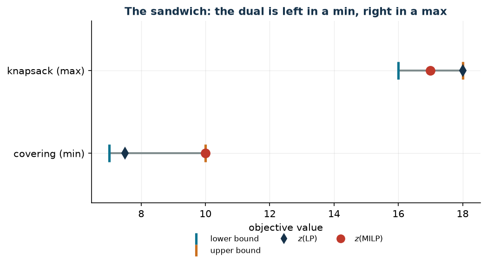

# Relaxations, duality and bounds

**Class:** LP · MILP · **Script:** `python/cap04_bounds.py`

[](https://colab.research.google.com/github/fabiofurini/mip-modelling/blob/main/notebooks/cap04_bounds.ipynb)

This chapter teaches how to produce, **by hand**, a number that certainly lies
on one side of the integer optimum. It serves three purposes: understanding how
good a model is, how good a heuristic is, and how to read the numbers a solver
reports when it has not finished.

## What a relaxation is

A **relaxation** of $\min\{c'x : x \in X\}$ is a problem
$\min\{c'x : x \in \hat X\}$ with $X \subseteq \hat X$: the minimum over a
larger set cannot be higher. In a maximisation the inequality is reversed.

| Name | What is dropped | Note |
|---|---|---|
| $z(\mathit{LP})$, pure | $x \in \{0,1\}$ becomes $x \ge 0$ | this is the one whose dual is written by hand: fewer constraints, hence a dual with fewer variables |
| $z(\mathit{LP}^+)$, bounds kept | $x \in \{0,1\}$ becomes $0 \le x \le 1$ | this is Gurobi's `relax()` and the root relaxation |
| $z(\mathit{LP}^{++})$, strengthened | as above, plus valid inequalities | see below |

In a minimisation
$z(\mathit{LP}) \le z(\mathit{LP}^+) \le z(\mathit{LP}^{++}) \le z(\mathit{MILP})$.

!!! note "The two relaxations coincide more often than one thinks"
    If the model contains an assignment constraint $\sum_m x_{jm} = 1$ with
    $x \ge 0$, then $x_{jm} \le 1$ is already implied and the two relaxations
    are **equal**. In the bound table of [chapter 7](scheduling.md) this happens
    in problems 1, 4, 6 and 7.

## The primal/dual conversion table

Minimisation primal, constraints indexed by $i$, variables by $j$:

| In the primal (min) | In the dual (max) |
|---|---|
| constraint $i$ of type $\ge$ | variable $\pi_i \ge 0$ |
| constraint $i$ of type $\le$ | variable $\pi_i \le 0$ |
| equality constraint $i$ | free variable $\pi_i$ |
| variable $x_j \ge 0$ | constraint $j$ of type $\le c_j$ |
| free variable $x_j$ | equality constraint $j$, $= c_j$ |

The dual objective is $\max \sum_i b_i \pi_i$. If the primal is a **maximisation**,
every direction is reversed and the dual is a minimisation.

Dual constraint $j$ says: "the value I attach to the resources consumed by
activity $j$ cannot exceed its cost". With this reading, every recipe for
building a dual solution has an economic meaning.

## Weak duality, strong duality

- **Weak duality**: $\sum_i b_i \bar\pi_i \le \sum_j c_j \bar x_j$ for every pair of feasible
  solutions. *Always*, with no assumptions. This is the one we need: it gives a
  lower bound from **any** feasible dual solution, even one built by hand.
- **Strong duality**: if the relaxation has a finite optimum, $z(\mathit{D}(\mathit{LP})) = z(\mathit{LP})$. It
  serves as a **check**: the optimum of the dual written by hand must coincide
  with $z(\mathit{LP})$. The course scripts verify it with an `assert`.

And then: since every feasible solution of the MILP is feasible for the
relaxation too,

$$\textstyle\sum_i b_i \bar\pi_i ~\le~ z(\mathit{LP}) ~\le~ z(\mathit{MILP}).$$

!!! danger "There is no such thing as «the dual of the MILP»"
    The dual one writes is that of the **relaxation**. A MILP has no linear
    dual, and strong duality between a MILP and any linear program does not hold
    in general: the jump $z(\mathit{MILP}) - z(\mathit{LP})$ is precisely what
    is missing.

## Three recipes for building a dual solution by hand

1. **Zero out and saturate.** Set all dual variables to zero except one family,
   and push those to the largest feasible value. In problem
   [7.1](scheduling-1.md): $\bar\pi = 0$ and $\bar\mu_j = \min_m c_{jm}$, that
   is "every job costs at least its cheapest option".
2. **Constructive heuristic on the constraints.** Scan the primal constraints one at a time,
   raise the corresponding dual variable until the first dual constraint that
   opposes it becomes tight, and update the residuals.
3. **The best ratio.** With a single capacity constraint in a maximisation,
   $\bar v = \max_j p_j / w_j$ is feasible and gives the bound $b \bar v$.

Whichever recipe is used, the solution must be **checked feasible** for the dual
— that is the only thing that makes the bound valid — and its value compared
with $z(\mathit{LP})$.

## A minimisation problem, in full

!!! abstract "Minimum-cost zone covering"
    A town has $4$ districts; activating the team of district $j$ costs $c_j$.
    There are $6$ sensitive zones, each on the border between two districts:
    zone $i$ is covered if at least one of the two neighbouring teams is active.
    All zones must be covered at minimum cost.

Data $c = (4, 3, 5, 3)$; the six zones are the six pairs of districts, in the
order $\{1,2\}$, $\{2,3\}$, $\{1,3\}$, $\{1,4\}$, $\{2,4\}$, $\{3,4\}$.

$$
\begin{aligned}
\min ~~ \sum_{j=1}^{4} c_j\, x_j & &\\
\text{subject to}\quad \sum_{j \in S_i} x_j &\ge 1, & \forall i \in \{1, \dots, 6\},\\
x_j &\in \{0,1\}, & \forall j \in \{1, \dots, 4\}.
\end{aligned}
$$

**The dual of the relaxation without the bounds**, with $\pi_i \ge 0$ for every covering
constraint:

$$
\begin{aligned}
\max ~~ \sum_{i=1}^{6} \pi_i & &\\
\text{subject to}\quad \sum_{i \,:\, j \in S_i} \pi_i &\le c_j, & \forall j,\\
\pi_i &\ge 0, & \forall i.
\end{aligned}
$$

For the instance, every team covers three zones:
$\pi_1 + \pi_3 + \pi_4 \le 4$, $\pi_1 + \pi_2 + \pi_5 \le 3$, $\pi_2 + \pi_3 + \pi_6 \le 5$,
$\pi_4 + \pi_5 + \pi_6 \le 3$.

**A dual solution by hand (recipe 2).**

- **Zone 1** ($\{1,2\}$): residuals $(4,3,5,3)$, the smallest among teams 1 and
  2 is $3$. $\bar \pi_1 = 3$; residuals $(1,0,5,3)$.
- **Zone 2** ($\{2,3\}$): the residual of team 2 is $0$, so $\bar \pi_2 = 0$.
- **Zone 3** ($\{1,3\}$): the smallest of $1$ and $5$ is $1$. $\bar \pi_3 = 1$;
  residuals $(0,0,4,3)$.
- **Zones 4 and 5**: teams 1 and 2 have zero residual, so
  $\bar \pi_4 = \bar \pi_5 = 0$.
- **Zone 6** ($\{3,4\}$): the smallest of $4$ and $3$ is $3$. $\bar \pi_6 = 3$.

$$\mathit{LB} = 3 + 0 + 1 + 0 + 0 + 3 = 7.$$

**A primal upper bound.** The [covering constructive heuristic](modelling-5.md) takes teams $1$,
$2$, $4$, of cost $4+3+3 = 10$: a feasible and **integer** solution, so
$\mathit{UB} = 10$.

| $UB$ (constructive heuristic) | $LB$ (dual by hand) | $z(\mathit{LP})$ | $z(\mathit{MILP})$ | heuristic gap |
|---:|---:|---:|---:|---:|
| 10 | 7 | $15/2$ | 10 | $0.0\%$ |

The certified gap between the two hand-built bounds is $(10-7)/10 = 30\%$:
without solving the MILP we would know only that the optimum lies between $7$
and $10$. The heuristic was already optimal, but the bounds cannot tell us that.

## A maximisation problem: the roles swap

!!! abstract "Knapsack"
    Four items of value $p = (10, 7, 6, 4)$ and weight $w = (5, 4, 3, 3)$;
    capacity $b = 9$.

The dual of the relaxation without the bounds has a single variable $v \ge 0$: $\min\ b v$
with $w_j v \ge p_j$ for every $j$.

- **Heuristic** (ratio constructive heuristic): ratios $2$, $7/4$, $2$, $4/3$; items 1 and 3 are
  taken (weight $8$), value $16$. In a **maximisation** the heuristic gives a
  **lower** bound: $\mathit{LB} = 16$.
- **Dual by hand** (recipe 3): $\bar v = \max_j p_j/w_j = 2$, value
  $b \bar v = 18$. In a **maximisation** the dual gives an **upper** bound:
  $\mathit{UB} = 18$.

$$16 ~\le~ z(\mathit{MILP}) = 17 ~\le~ z(\mathit{LP}^+) = \tfrac{71}{4} ~\le~ z(\mathit{LP}) = 18.$$

Here the dual by hand is **optimal** for the relaxation without the bounds, and the relaxation
with the bounds kept is strictly better ($71/4 < 18$): the constraint
$x_j \le 1$ bites, because without it the LP takes $9/5$ units of item 1.



!!! note "The sandwich, written once and for all"
    $$\text{minimisation:}\quad \mathit{LB}(\bar\pi) \le z(\mathit{D}(\mathit{LP})) = z(\mathit{LP}) \le z(\mathit{LP}^+) \le z(\mathit{MILP}) \le \mathit{UB}(\bar x)$$
    $$\text{maximisation:}\quad \mathit{LB}(\bar x) \le z(\mathit{MILP}) \le z(\mathit{LP}^+) \le z(\mathit{LP}) = z(\mathit{D}(\mathit{LP})) \le \mathit{UB}(\bar\pi)$$

    where $(\bar\pi_1, \bar\pi_2, \dots, \bar\pi_m)$ is a feasible dual
    solution of the relaxation, of value $\sum_{i=1}^{m} b_i\, \bar\pi_i$, and
    $(\bar x_1, \bar x_2, \dots, \bar x_n)$ a feasible solution of the MILP, of
    value $\sum_{j=1}^{n} c_j\, \bar x_j$.

    The *relaxation side* is optimistic and holds all the dual bounds; the
    *heuristic side* is pessimistic and holds all the feasible solutions. The
    name ($\mathit{LB}$ or $\mathit{UB}$) depends on the direction of the
    objective, the role does not.

## Valid inequalities and constraints that preserve optimality

- A **valid inequality** is satisfied by *all* feasible integer solutions:
  adding it does not change $z(\mathit{MILP})$; if it reduces
  $z(\mathit{LP}^+)$ it is called a **cut**.
- A **constraint that preserves optimality** cuts off some feasible solutions
  but not all the optimal ones. It is not a valid inequality, and must be
  declared as such (example: $z_j \le M_j y_j$ in
  [problem 8.4](location-4.md)).

**The cover cut.** A set $S$ is a *cover* if $\sum_{j \in S} w_j > b$; then
$\sum_{j \in S} x_j \le |S| - 1$ is valid. On the knapsack ($w = (5,4,3,3)$,
$b = 9$) the minimal covers are the four triples. The optimal solution of the
relaxation is $\tilde x = (1,\ 1/4,\ 1,\ 0)$:

| Cover $S$ | $\sum_{j \in S} \tilde x_j$ | $\|S\|-1$ | |
|---|---:|---:|---|
| $\{1,2,3\}$ | $9/4$ | 2 | **violated**: the cut is needed |
| $\{1,2,4\}$ | $5/4$ | 2 | satisfied |
| $\{1,3,4\}$ | $2$ | 2 | satisfied (with equality) |
| $\{2,3,4\}$ | $5/4$ | 2 | satisfied |

Adding the four cuts, $z(\mathit{LP}^+)$ drops from $71/4 = 17.75$ to
$69/4 = 17.25$ and $z(\mathit{MILP})$ stays $17$.

## Stronger formulations

Two formulations $A$ and $B$ are compared in **two steps**: (1) same integer
set, that is the two formulations must admit exactly the same points with
integer coordinates — without this nothing is
being compared; (2) $B$ is *stronger* if $X_B \subseteq X_A$ as polyhedra. The
reference case is [activation](links-01.md).

!!! warning "Stronger does not mean faster"
    A stronger formulation has fewer nodes but more rows, and every node costs
    more. What can be **proved** is the strength of the relaxation; speed is
    **measured**.

## What the solver says

!!! danger "`ObjBound` is not the root relaxation"
    On the covering instance, the relaxation of the model *as we wrote it* is
    $15/2$ and the integer optimum $10$. Yet Gurobi reports `ObjBound = 10` and
    `NodeCount = 0`: it closed the gap at the root, with presolve, its own cuts
    and heuristics, without ever branching. Switching those off
    (`Presolve = Cuts = Heuristics = 0`) the same model gives the same optimum
    but with $5$ nodes.

    Two consequences: "how hard a model is" is not a property of the model
    alone; and the relaxation we speak of in the hand-built bounds is that of
    the model as written, obtained with `relax()`.

## LP duals are not the marginal prices of the MILP

| $b$ | $z(\mathit{MILP})$ | $z(\mathit{LP}^+)$ | LP dual | true change |
|---:|---:|---:|---:|---:|
| 8 | 16 | 16 | $2$ | — |
| 9 | 17 | $71/4$ | $7/4$ | $+1$ |
| 10 | 17 | $39/2$ | $7/4$ | **0** |
| 11 | 20 | $85/4$ | $7/4$ | $+3$ |
| 12 | 23 | 23 | $7/4$ | $+3$ |

The LP dual is the ratio $p_j/w_j$ of the "critical" item. The true change of
the integer optimum comes in jumps: from $b = 9$ to $b = 10$ it does not change
*at all*, while the dual promises $7/4$.

!!! note "What can be said, then"
    Of the LP dual, the only use this course makes of it remains true: it is a
    **bound**. As managerial advice ("is it worth buying one more unit?") it must
    be checked by solving the MILP again: the difference
    $z(\mathit{MILP})(b_i + 1) - z(\mathit{MILP})(b_i)$ is the only correct
    answer, and there is no closed formula for it.

## The bound protocol of the course

Every exercise of [Part II](problems.md) produces: (1) a feasible **and
integer** solution from a heuristic, checked on constraints, bounds and
integrality; (2) the dual of the relaxation without the bounds, in general form and for the
instance; (3) a feasible dual solution built by hand, with the recipe declared;
(4) the two relaxations from the solver; (5) the optimum and the table
$\mathit{UB} \cdot \mathit{LB} \cdot z(\mathit{LP}) \cdot z(\mathit{LP}^+) \cdot z(\mathit{MILP}) \cdot$ gap;
(6) the additional considerations.

Every number in the table exists in a CSV produced by the problem's script, and
an `assert` in `check_numbers.py` compares it with the value quoted in the text.

## Code

The complete script is
[`python/cap04_bounds.py`](https://github.com/fabiofurini/mip-modelling/blob/main/python/cap04_bounds.py);
the notebook is
[`notebooks/cap04_bounds.ipynb`](https://github.com/fabiofurini/mip-modelling/blob/main/notebooks/cap04_bounds.ipynb).

<!-- embedded-script: begin (regenerated by python/embed_code.py) -->

??? example "Show the complete script — `python/cap04_bounds.py` (252 lines)"

    ```python
    """Chapter 4 -- Relaxations, duality and bounds: the checked examples.

    A minimisation and a maximisation problem, written with their duals; a dual
    solution built by hand and the check of weak duality; the comparison between the
    relaxation without the bounds and the one with the bounds kept; a cover cut; the
    bound read from Gurobi at the end of the solve; and the counterexample showing why the
    LP duals are not the marginal prices of the MILP.
    """
    import gurobipy as gp
    import pandas as pd
    from gurobipy import GRB

    from mip import (ammissibile, due_rilassamenti, frazione, nuovo_modello, registra_bound,
                     rilassamento, risolvi, stampa_soluzione, valuta, viola_interezza)
    from stile import (ARANCIO, BLU, CICLO, GRIGIO, ROSSO, TEAL, VERDE, intestazione,
                       plt, salva_dati, salva_figura)

    R = range

    # ---------- 1. A MINIMISATION, ITS DUAL, A DUAL SOLUTION BUILT BY HAND ----------
    intestazione("4.1  Minimum-cost covering: primal, dual and a bound built by hand")
    # min sum c_j x_j   s.t.  sum_{j in S_i} x_j >= 1 for every i,  x binary
    c41 = [4, 3, 5, 3]                       # cost of the four teams
    # six zones, each on the border between two districts: zone i is covered by the
    # two teams of the districts it borders
    S41 = [[0, 1], [1, 2], [0, 2], [0, 3], [1, 3], [2, 3]]
    n41, m41 = len(c41), len(S41)


    def primale_41():
        m = nuovo_modello("covering")
        x = m.addVars(n41, vtype=GRB.BINARY, name="x")
        m.setObjective(gp.quicksum(c41[j] * x[j] for j in R(n41)), GRB.MINIMIZE)
        m.addConstrs((gp.quicksum(x[j] for j in S41[i]) >= 1 for i in R(m41)), name="cover")
        return m, x


    def duale_41():
        """max sum u_i  s.t.  sum_{i : j in S_i} u_i <= c_j,  u >= 0."""
        d = nuovo_modello("dual_covering")
        u = d.addVars(m41, name="u")
        d.setObjective(u.sum(), GRB.MAXIMIZE)
        d.addConstrs((gp.quicksum(u[i] for i in R(m41) if j in S41[i]) <= c41[j] for j in R(n41)),
                     name="rc")
        return d, u


    m41p, x41 = primale_41()
    z41 = risolvi(m41p)
    scelte41 = [j + 1 for j in R(n41) if x41[j].X > 0.5]
    print(f"  Integer optimum: z(MILP) = {frazione(z41)}, teams chosen {scelte41}")

    # dual solution built by hand: each zone gets the smallest unit cost still
    # available, respecting the dual constraints one column at a time (dual constructive heuristic)
    u_mano = {i: 0.0 for i in R(m41)}
    residuo = {j: c41[j] for j in R(n41)}
    for i in R(m41):
        incremento = min(residuo[j] for j in S41[i])
        u_mano[i] = incremento
        for j in S41[i]:
            residuo[j] -= incremento
    d41, u41 = duale_41()
    lb41, viol = valuta(d41, {f"u[{i}]": u_mano[i] for i in R(m41)})
    assert viol <= 1e-9, viol
    print("  Dual solution by hand (constructive heuristic on the zones): u = "
          + ", ".join(f"u_{i+1} = {frazione(u_mano[i])}" for i in R(m41))
          + f"   ->  lb = {frazione(lb41)}")
    zlp41, zlp41r, pi41 = due_rilassamenti(m41p, d41)
    print(f"  Weak duality checked: {frazione(lb41)} <= {frazione(zlp41)} <= "
          f"{frazione(z41)}")
    assert lb41 <= zlp41 + 1e-9 <= z41 + 1e-9
    # primal upper bound: the covering constructive heuristic (one uncovered zone at a time)
    scoperte = set(R(m41))
    presi41 = []
    while scoperte:
        j = min(R(n41), key=lambda j: c41[j] / max(1, len({i for i in scoperte if j in S41[i]}))
                if any(j in S41[i] for i in scoperte) else float("inf"))
        presi41.append(j)
        scoperte -= {i for i in scoperte if j in S41[i]}
    ub41_primale = sum(c41[j] for j in presi41)
    assert ammissibile(m41p, {f"x[{j}]": 1 for j in presi41})
    print(f"  Constructive covering heuristic heuristic: teams {sorted(j + 1 for j in presi41)}, "
          f"ub = {frazione(ub41_primale)}")
    riga41 = registra_bound("minimum-cost covering", ub41_primale, lb41, zlp41, zlp41r, z41)
    salva_dati(pd.DataFrame([riga41]), "cap04_copertura")

    # ---------- 2. A MAXIMISATION: THE ROLES SWAP ----------
    intestazione("4.2  A knapsack: the heuristic gives the lower bound, the dual the upper")
    p42 = [10, 7, 6, 4]                      # values
    w42 = [5, 4, 3, 3]                       # weights
    C42 = 9


    def primale_42():
        m = nuovo_modello("knapsack")
        x = m.addVars(4, vtype=GRB.BINARY, name="x")
        m.setObjective(gp.quicksum(p42[j] * x[j] for j in R(4)), GRB.MAXIMIZE)
        m.addConstr(gp.quicksum(w42[j] * x[j] for j in R(4)) <= C42, name="capacity")
        return m, x


    def duale_42():
        """Dual of the relaxation without the bounds (x >= 0): min C v  s.t.  w_j v >= p_j, v >= 0."""
        d = nuovo_modello("dual_knapsack")
        v = d.addVar(name="v")
        d.setObjective(C42 * v, GRB.MINIMIZE)
        d.addConstrs((w42[j] * v >= p42[j] for j in R(4)), name="rc")
        return d, v


    m42, x42 = primale_42()
    z42 = risolvi(m42)
    scelte42 = [j + 1 for j in R(4) if x42[j].X > 0.5]
    print(f"  Integer optimum: z(MILP) = {frazione(z42)}, items {scelte42}, "
          f"weight {sum(w42[j] for j in R(4) if x42[j].X > 0.5)} out of {C42}")
    # constructive heuristic heuristic by value/weight ratio: gives a LOWER bound
    ordine = sorted(R(4), key=lambda j: -p42[j] / w42[j])
    carico, presi = 0, []
    for j in ordine:
        if carico + w42[j] <= C42:
            presi.append(j)
            carico += w42[j]
    lb42 = sum(p42[j] for j in presi)
    assert ammissibile(m42, {f"x[{j}]": 1 for j in presi})
    print(f"  Constructive heuristic by ratio p_j/w_j: takes {sorted(j + 1 for j in presi)}, "
          f"lb = {frazione(lb42)}")
    # dual by hand: v = max_j p_j / w_j  (the best ratio) is feasible
    v_mano = max(p42[j] / w42[j] for j in R(4))
    d42, v42 = duale_42()
    ub42, viol = valuta(d42, {"v": v_mano})
    assert viol <= 1e-9, viol
    print(f"  Dual solution by hand: v = max_j p_j/w_j = {frazione(v_mano)}  ->  "
          f"ub = C v = {frazione(ub42)}")
    zlp42, zlp42r, _ = due_rilassamenti(m42, d42)
    print(f"  The maximisation sandwich: {frazione(lb42)} <= z(MILP) = {frazione(z42)} <= "
          f"z(LP) = {frazione(zlp42)} <= ub = {frazione(ub42)}")
    assert lb42 <= z42 <= zlp42 + 1e-9 <= ub42 + 1e-9
    riga42 = registra_bound("knapsack", ub42, lb42, zlp42, zlp42r, z42, senso="max")
    salva_dati(pd.DataFrame([riga42]), "cap04_zaino")

    # ---------- 3. A COVER CUT ----------
    intestazione("4.3  A valid inequality: the cover cut")
    from itertools import combinations
    tutte = [s for k in R(2, 5) for s in combinations(R(4), k) if sum(w42[j] for j in s) > C42]
    coperture = [s for s in tutte                                   # only the minimal ones
                 if all(sum(w42[j] for j in t) <= C42
                        for t in combinations(s, len(s) - 1))]
    print("  Minimal covers found: "
          + "; ".join("{" + ", ".join(str(j + 1) for j in s) + "}" for s in coperture))
    m43, x43 = primale_42()
    zlp43_prima, sol43, _ = rilassamento(m43, rafforzato=True)
    print("  Optimal solution of the relaxation without cuts: "
          + ", ".join(f"x_{j+1} = {frazione(sol43[f'x[{j}]'])}" for j in R(4)))
    for s in coperture:
        somma = sum(sol43[f"x[{j}]"] for j in s)
        stato = "VIOLATED" if somma > len(s) - 1 + 1e-9 else "satisfied"
        print(f"    cut on {{{', '.join(str(j + 1) for j in s)}}}: "
              f"sum = {frazione(somma)} against {len(s) - 1}  ->  {stato}")
    for s in coperture:
        m43.addConstr(gp.quicksum(x43[j] for j in s) <= len(s) - 1, name="cover" + "".join(map(str, s)))
    z43 = risolvi(m43)
    zlp43_dopo, _, _ = rilassamento(m43, rafforzato=True)
    print(f"  z(LP+) without cuts = {frazione(zlp43_prima)}   with the cover cuts = "
          f"{frazione(zlp43_dopo)}   z(MILP) = {frazione(z43)}")
    assert z43 == z42, "the cuts must not change the integer optimum"
    assert zlp43_dopo <= zlp43_prima + 1e-9
    salva_dati(pd.DataFrame([{"model": "knapsack", "z_lp_without_cuts": zlp43_prima,
                              "z_lp_with_cuts": zlp43_dopo, "z_milp": z43}]), "cap04_tagli")

    # ---------- 4. WHAT THE SOLVER DOES: relax() AND ObjBound ----------
    intestazione("4.4  The first relaxation and the solver's final bound")
    m44, x44 = primale_41()          # the covering: here the solver has work to do
    m44.Params.OutputFlag = 0
    m44.optimize()
    print(f"  Status = {m44.Status} (2 = OPTIMAL), SolCount = {m44.SolCount}")
    print(f"  ObjVal   = {frazione(m44.ObjVal)}   (the best integer solution found)")
    print(f"  ObjBound = {frazione(m44.ObjBound)} (the best bound proved)")
    print(f"  MIPGap   = {m44.MIPGap:.4f}          NodeCount = {int(m44.NodeCount)}")
    zrad, _, _ = rilassamento(m44, rafforzato=True)
    print(f"  Relaxation of the model as we wrote it, with relax(): {frazione(zrad)}")
    assert abs(m44.ObjBound - m44.ObjVal) <= 1e-6
    assert zrad <= m44.ObjVal + 1e-9         # minimisation: the relaxation lies below the optimum
    print(f"  The relaxation is {frazione(zrad)} and the integer optimum {frazione(m44.ObjVal)}:")
    print("  the gap is there, but NodeCount = 0. Gurobi closes it *at the root*, with")
    print("  presolve, its own cuts and heuristics, without ever splitting the problem.")
    # to see the solver at work, switch off presolve, cuts and heuristics
    m45, x45 = primale_41()
    m45.Params.Presolve = 0
    m45.Params.Cuts = 0
    m45.Params.Heuristics = 0
    m45.optimize()
    print(f"  With Presolve = Cuts = Heuristics = 0: z = {frazione(m45.ObjVal)}, "
          f"NodeCount = {int(m45.NodeCount)}")
    print("  Same optimum, but now the nodes count: 'how hard a model is' is not a")
    print("  property of the model alone, it also depends on what the solver brings.")
    assert m45.ObjVal == m44.ObjVal
    salva_dati(pd.DataFrame([{"configuration": "default settings", "z": m44.ObjVal,
                              "z_lp_written": zrad, "nodes": int(m44.NodeCount)},
                             {"configuration": "no presolve, cuts or heuristics",
                              "z": m45.ObjVal, "z_lp_written": zrad,
                              "nodes": int(m45.NodeCount)}]), "cap04_solver")

    # ---------- 5. LP DUALS ARE NOT THE MARGINAL PRICES OF THE MILP ----------
    intestazione("4.5  Why the LP duals are not the marginal prices of the MILP")
    righe = []
    for C in (8, 9, 10, 11, 12):
        m = nuovo_modello("knapsack_C")
        x = m.addVars(4, vtype=GRB.BINARY, name="x")
        m.setObjective(gp.quicksum(p42[j] * x[j] for j in R(4)), GRB.MAXIMIZE)
        con = m.addConstr(gp.quicksum(w42[j] * x[j] for j in R(4)) <= C, name="capacity")
        z = risolvi(m)
        zr, _, pi = rilassamento(m, rafforzato=True)
        righe.append({"capacity": C, "z_milp": z, "z_lp": zr, "lp_dual": pi["capacity"]})
    print("   C   z(MILP)   z(LP+)   LP dual   true change in z(MILP)")
    for k, r in enumerate(righe):
        delta = "" if k == 0 else frazione(r["z_milp"] - righe[k - 1]["z_milp"])
        print(f"  {r['capacity']:2d}    {frazione(r['z_milp']):>5}   {frazione(r['z_lp']):>6}   "
              f"{r['lp_dual']:>10.4f}      {delta:>6}")
    salva_dati(pd.DataFrame(righe), "cap04_prezzi")
    print("  The LP dual is the p_j/w_j ratio of the 'critical' item: 2 when the capacity")
    print("  runs out on item 1, 7/4 when there is room left for item 2. It says how much an")
    print("  extra unit of capacity is worth *in the continuous problem*. On the integer")
    print("  problem the true change is in jumps (1, 0, 3, 3) and never matches that value:")
    print("  going from C = 9 to C = 10 the integer optimum does not change at all, while")
    print("  the dual keeps promising 7/4. The LP dual is not the marginal price of the")
    print("  MILP, and using it as such is a mistake, not an approximation.")

    # ---------- 6. FIGURE: THE SANDWICH OF THE TWO PROBLEMS ----------
    fig, ax = plt.subplots(figsize=(7.2, 3.4))
    etichette = ["covering (min)", "knapsack (max)"]
    lb = [lb41, lb42]
    ub = [ub41_primale, ub42]
    zl = [zlp41, zlp42]
    zm = [z41, z42]
    for i in R(2):
        ax.plot([lb[i], ub[i]], [i, i], color=GRIGIO, lw=2, solid_capstyle="round")
        ax.plot(lb[i], i, "|", color=TEAL, ms=18, mew=2.5)
        ax.plot(ub[i], i, "|", color=ARANCIO, ms=18, mew=2.5)
        ax.plot(zl[i], i, "d", color=BLU, ms=8)
        ax.plot(zm[i], i, "o", color=ROSSO, ms=9)
    ax.plot([], [], "|", color=TEAL, ms=12, mew=2.5, label="lower bound")
    ax.plot([], [], "|", color=ARANCIO, ms=12, mew=2.5, label="upper bound")
    ax.plot([], [], "d", color=BLU, ms=7, label="$z(\\mathrm{LP})$")
    ax.plot([], [], "o", color=ROSSO, ms=8, label="$z(\\mathrm{MILP})$")
    ax.set_yticks(R(2))
    ax.set_yticklabels(etichette)
    ax.set_xlabel("objective value")
    ax.set_title("The sandwich: the dual is left in a min, right in a max")
    ax.legend(fontsize=8, ncols=4, loc="lower center", bbox_to_anchor=(0.5, -0.42))
    ax.set_ylim(-0.6, 1.6)
    salva_figura(fig, "cap04_sandwich")
    print("Done.")
    ```

<!-- embedded-script: end -->
