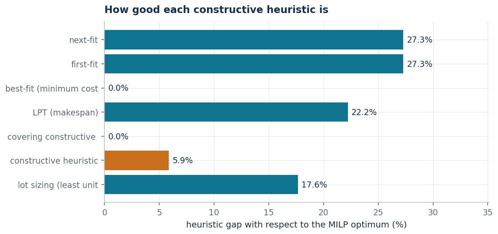

# 4. Constructive heuristics

[:material-file-pdf-box: Lecture notes (PDF)](pdf/notes-1-modelling.pdf) · [:material-presentation: Slides (PDF)](pdf/slides-04-heuristics.pdf)

**Class:** algorithms · **Script:** `python/cap05_heuristics.py`, `python/euristiche.py`
{ .scheda }

[](https://colab.research.google.com/github/fabiofurini/mip-modelling/blob/main/notebooks/cap05_heuristics.ipynb)

A constructive heuristic builds **one** solution quickly, adding one element at a
time and never backtracking. It proves nothing about the quality of that
solution, and it is not even guaranteed to reach a feasible one: it can get stuck
part-way, with an element that fits nowhere. When it does end with a feasible
solution, that solution is the other half of the sandwich of
[chapter 2](modelling-2.md): the pessimistic side, the one guaranteed by a
solution that really exists; when it fails, there is no primal bound.

!!! note "What a heuristic must produce in this course"
    1. a readable **pseudocode**, with the scanning order, the choice criterion,
       the tie-breaking rule and the failure case stated;
    2. the corresponding **Python function**, line by line;
    3. the **trace** of the execution on an instance;
    4. the **feasibility check**: constraints, bounds *and* integrality;
    5. the resulting **bound**, with the right name.

    Point 4 is not a formality: a solution satisfying the linear constraints but
    with a fractional component is feasible for the *relaxation*, not for the
    MILP, and its value is not a primal bound.

!!! danger "The side of the bound depends on the objective, not on the heuristic"
    In a **minimisation** the value of a feasible solution is an *upper* bound:
    $z(\mathit{MILP}) \le \mathit{UB}$. In a **maximisation** it is a *lower*
    bound: $\mathit{LB} \le z(\mathit{MILP})$. Calling $UB$ the result
    of a constructive heuristic on a maximisation is the commonest sign error in the course.

## Bin packing: the insertion rules

The classical problem is **bin packing**, whose model is in the
[solver chapter](gurobipy-4.md): items must be put into identical bins of
limited capacity, using as few of them as possible. Here it is not solved: it is
*built*, one choice at a time.

```text
Build(n, w, C, gamma):
  no bin open
  for j = 1..n:
      # next-fit:  the current bin only, then a new one is opened
      # first-fit: the first open bin the item fits into
      # best-fit:  among the bins it fits into, the smallest gamma(j,b,res)
      choose b* by the rule
      if no open bin will do: open a new one
      put j into b*;  res[b*] <- res[b*] - w[j]
  return the bins used
```

All three scan the items **in the given order**: changing the order changes the
result, and this must be said when a value is reported. Ties are broken on the
smallest index, so the run is reproducible.

**The instance.** Six items of weight $w = (4, 4, 5, 3, 2, 3)$, bins of capacity
$C = 7$: the same bins as the [model of §3.4](gurobipy-4.md), with two more
items. The instance there is for writing the model and is deliberately small —
but for that very reason all three rules answer "three bins" on it, and cannot
be told apart.

| Heuristic | how it fills | $UB$ | $z(\mathit{MILP})$ | heuristic gap |
|---|---|---:|---:|---:|
| next-fit | `[4] [4] [5] [3+2] [3]` | 5 | 3 | $66.7\%$ |
| first-fit | `[4+3] [4+2] [5] [3]` | 4 | 3 | $33.3\%$ |
| best-fit on the fill | `[4+3] [4+3] [5+2]` | 3 | 3 | $0.0\%$ |

**The elementary bound settles it without the solver.** The total weight is
$4 + 4 + 5 + 3 + 2 + 3 = 21$ and one bin carries $7$: at least
$\lceil 21/7 \rceil = 3$ bins are needed. Best-fit uses three, filling all three
exactly, so $\mathit{LB} = \mathit{UB} = 3$ and the optimum is **proved** — the
sandwich of the course, on an instance that closes by hand.

!!! tip "Where the three rules part company"
    **Next-fit** closes a bin as soon as an item does not fit, and never looks
    back: the last item, of weight $3$, would fit exactly into the first bin,
    which still has $3$ of room, but that bin is no longer looked at. Five bins
    instead of three.

    Between **first-fit** and **best-fit** the difference is entirely about the
    item of weight $2$. First-fit puts it in the *first* bin that takes it, the
    second, which is left with $1$ of room now useless; best-fit puts it where
    it fits *exactly*, the third, which had $2$. So the final $3$ still finds
    room in the second, and the bins stay three.

## $P||C_{\max}$: the least loaded rule

The second classic is **scheduling on identical machines**, written
$P||C_{\max}$, whose model is also in the [solver chapter](gurobipy-4.md): $n$
jobs of duration $t_j$ over $k$ identical machines, minimising the instant the
last one finishes. The natural rule is **list scheduling** — the
current job goes to the least loaded machine — and the order in which the jobs
are looked at decides the result. The best order is by decreasing duration, and
the rule it gives is called **LPT**.

```text
LPT(n, k, t):
  L[m] <- 0 for every m                       # current loads
  for j in order of DECREASING t[j]:
      m* <- argmin_m L[m]                     # ties: the smallest index
      x[j][m*] <- 1;  L[m*] <- L[m*] + t[j]
  return x, max_m L[m]
```

The decreasing order is essential: leaving the long jobs for last makes them
impossible to place.

!!! example "Seven jobs on three machines"
    $t = (5, 5, 4, 4, 3, 3, 3)$, $k = 3$, total $27$.

    - **Steps 1–3.** The jobs $5$, $5$, $4$ go to the three empty machines:
      $L = (5, 5, 4)$.
    - **Step 4.** Job $4$: the smallest load is machine 3, which goes to $8$.
      $L = (5, 5, 8)$.
    - **Steps 5–6.** The two jobs of length $3$ go to machines 1 and 2:
      $L = (8, 8, 8)$.
    - **Step 7.** The last job of length $3$ finds all loads equal to $8$; by
      the tie rule it goes to machine 1, which reaches $11$.

    LPT makespan: $\mathit{UB} = 11$, with loads $(11, 8, 8)$.

    **The elementary bound.** The makespan is at least
    $\max(\max_j t_j,\ \sum_j t_j / k) = \max(5, 9) = 9$. The optimum is exactly
    $z(\mathit{MILP}) = 9$ — attained with $\{5,4\}$, $\{5,4\}$, $\{3,3,3\}$ —
    and LPT is off by $22.2\%$.

!!! tip "Two free bounds, to be compared"
    $\max_j t_j$ and $\sum_j t_j / k$ are computable without solving anything,
    and the better of the two is often already close to the optimum. An
    "obvious" bound nobody writes down is a wasted bound: the dual of
    [chapter 2](modelling-2.md) is for when the obvious ones are not enough, not
    instead of them.

## Set covering: the cheapest completion rule

```text
CoveringHeuristic(c, S):
  uncovered <- {1..m};   y[j] <- 0 for every j
  while uncovered is not empty:
      for every j not yet chosen: new(j) <- |{i in uncovered : j in S_i}|
      if new(j) = 0 for every j: return "no solution found"
      j* <- argmin_{j : new(j) > 0} c[j] / new(j)
      y[j*] <- 1;   uncovered <- uncovered \ {i : j* in S_i}
  return y
```

The criterion is the **cost per newly covered zone**, not the absolute cost.

On the four teams of [chapter 2](modelling-2.md), $c = (4,3,5,3)$: step 1 ratios
$4/3$, $1$, $5/3$, $1$ → element 2 (covers zones 1, 2, 5); step 2 ratios $2$,
$5/2$, $3/2$ → element 4 (zones 4 and 6); step 3 ratios $4$ and $5$ → element 1.
Solution $\{1,2,4\}$, cost $\mathit{UB} = 10$, which here is the optimum.

## Knapsack: the best ratio rule

The **knapsack** is the model the solver chapter opens with: the items have a
value as well as a weight, and there is a single resource. The constructive rule
looks at the ratio between the two, and what it produces is a feasible solution,
hence a primal bound.

```text
KnapsackHeuristic(p, w, C):
  residual <- C;   y[j] <- 0 for every j
  for j in order of DECREASING p[j]/w[j]:
      if w[j] <= residual:  y[j] <- 1;  residual <- residual - w[j]
  return y
```

On $p = (10,7,6,4)$, $w = (5,4,3,3)$, $C = 9$: ratios $2$, $7/4$, $2$, $4/3$;
items 1 and 3 are taken (weight $8$), value $16$. Since the problem is a
**maximisation**, $\mathit{LB} = 16 \le z(\mathit{MILP}) = 17$, gap $5.9\%$: the
optimum takes items 1 and 2, filling the knapsack exactly. The constructive heuristic goes wrong
because item 3 leaves an unusable residual.

## TSP: the nearest neighbour

The fourth classic is the **travelling salesman problem** (TSP), the third and
last model written in the [solver chapter](gurobipy-4.md): given $n$ cities and
the distances $d_{ij}$ between every pair, find the shortest tour that visits
them all once and returns to the start. It is the problem where
step-by-step construction shows best, because the solution *is* a sequence: the
order is the solution.

The classical constructive rule is the **nearest neighbour**: start from a city
and each time go to the nearest among those not yet visited; when none are left,
return to the start. It is feasible by construction and fast, because at each
step it looks only at the distances from the current city.

!!! example "Five cities, five starting points"
    The distances, symmetric:

    |  | 1 | 2 | 3 | 4 | 5 |
    |---|---:|---:|---:|---:|---:|
    | 1 | — | 5 | 2 | 2 | 9 |
    | 2 | 5 | — | 4 | 3 | 4 |
    | 3 | 2 | 4 | — | 4 | 7 |
    | 4 | 2 | 3 | 4 | — | 7 |
    | 5 | 9 | 4 | 7 | 7 | — |

    Starting from city 1: the nearest is 3 (distance 2); from there 2 (4); then
    4 (3); 5 is left (7); and the return to 1 costs 9. The tour
    $1 \to 3 \to 2 \to 4 \to 5 \to 1$ has length 25.

    The last arc is the one that is paid for: the rule chooses well while it has a
    choice, and at the last step it has none. Changing the starting city changes
    the tour:

    | start | tour | length |
    |---|---|---:|
    | 1 | $1 \to 3 \to 2 \to 4 \to 5 \to 1$ | 25 |
    | 2 | $2 \to 4 \to 1 \to 3 \to 5 \to 2$ | 18 |
    | 3 | $3 \to 1 \to 4 \to 2 \to 5 \to 3$ | 18 |
    | 4 | $4 \to 1 \to 3 \to 2 \to 5 \to 4$ | 19 |
    | 5 | $5 \to 2 \to 4 \to 1 \to 3 \to 5$ | 18 |

    With five cities the distinct tours are $(5-1)!/2 = 12$ and they can all be
    enumerated: the optimum is $1 \to 3 \to 5 \to 2 \to 4 \to 1$, of length 18.
    Three starting points out of five find it, one stops at 19 and the one we
    started from at 25, that is 38.9 % above the optimum.

    Two things to take away. The heuristic gives *one* feasible solution, hence an
    upper bound — here $z(\mathit{MILP}) \le 25$ — and nothing else; that 18 is
    the optimum is known by enumeration. And running the same rule from every
    start, keeping the best tour, costs $n$ times as much and gives a better
    bound: it is the simplest form of *multi-start*, and it is still a bound from
    one side only.

## Lot sizing: least unit cost period covering

```text
LeastUnitCost(d, f, h):
  t <- 1
  while t <= T:
      skip the periods with d[t] = 0
      for k = 1..T-t+1:
          Q_k <- sum of d[t..t+k-1]
          c_k <- (f + h * sum of (s-t)*d[s] for s = t..t+k-1) / Q_k
      k* <- argmin_k c_k                      # the lowest average cost per unit
      produce Q_{k*} in period t;   t <- t + k*
```

!!! danger "This is not the Wagner–Whitin procedure"
    Wagner–Whitin is an **exact** dynamic-programming algorithm for the
    *uncapacitated* lot-sizing model: it solves that model to optimality in
    polynomial time. The procedure above is a heuristic, and its value is only a
    bound. Calling it "the Wagner–Whitin constructive heuristic" confuses two different things.

On $d = (20, 10, 30, 40, 10)$, setup $f = 50$, holding $h = 1$: from period 1 it
pays to cover 2 periods (unit cost $2$); from period 3 another 2 (unit cost
$\approx 1.286$); from period 5 only that one (unit cost $5$). Cost
$\mathit{UB} = 200$ against $z(\mathit{MILP}) = 170$, gap $17.6\%$ — which is
also the value Wagner–Whitin would give, being exact on this model.

## Local search, and what it does not give

A **local search** starts from a feasible solution and tries elementary moves,
accepting those that improve; it stops at a **local optimum**.

On the LPT solution ($L = (11, 8, 8)$, makespan $11$), the move "move one job to
another machine" improves nothing: moving one of the two jobs of length $3$ off
machine 1 brings its load to $8$ but raises the receiving machine to $11$. The
local search stops at $11$, while the optimum is $9$: to get there a **swap**
between two machines is needed.

!!! warning "A local optimum is not a better bound"
    Local search returns a feasible solution, hence a bound on the pessimistic
    side, and nothing else. The fact that it stopped does not mean it has
    arrived.

## When the constructive heuristic fails

!!! danger "«No solution found» is not «no solution exists»"
    Three jobs of duration $(3, 3, 2)$ on two machines with availability
    $(5, 3)$. Next-fit: job 1 goes to machine 1 (residual $2$); job 2 does not
    fit and moves to machine 2 (residual $0$); job 3 does not fit and there are
    no more machines: **failure**. But the problem is feasible: jobs 2 and 3 fit
    together on machine 1 ($3 + 2 = 5$) and job 1 on machine 2 ($3 \le 3$).

    A constructive heuristic is *myopic*: it decides one thing at a time and
    never backtracks. Its failure is information about the heuristic, not about
    the problem. To prove a model infeasible one needs the solver
    (`Status = INFEASIBLE`) or a proof.

## The overview of the heuristics

| Heuristic | Direction | value | $z(\mathit{MILP})$ | heuristic gap |
|---|---|---:|---:|---:|
| next-fit (bin packing) | min ($UB$) | 5 | 3 | $66.7\%$ |
| first-fit (bin packing) | min ($UB$) | 4 | 3 | $33.3\%$ |
| best-fit on the fill (bin packing) | min ($UB$) | 3 | 3 | $0.0\%$ |
| LPT (makespan) | min ($UB$) | 11 | 9 | $22.2\%$ |
| covering constructive heuristic | min ($UB$) | 10 | 10 | $0.0\%$ |
| ratio constructive heuristic (knapsack) | max ($LB$) | 16 | 17 | $5.9\%$ |
| nearest neighbour (TSP) | min ($UB$) | 25 | 18 | $38.9\%$ |
| least unit cost (lot sizing) | min ($UB$) | 200 | 170 | $17.6\%$ |



!!! tip "What this table teaches"
    Two heuristics find the optimum and six do not, and **before** solving the
    MILP there is no way of knowing which. A $0\%$ gap and a $67\%$ gap are told
    apart only *afterwards*. This is why the course always asks for two bounds:
    a heuristic on its own says how much a solution one can actually implement
    costs, not how much is being lost.

## Code

The heuristics live in
[`python/euristiche.py`](https://github.com/fabiofurini/mip-modelling/blob/main/python/euristiche.py),
the examples in
[`python/cap05_heuristics.py`](https://github.com/fabiofurini/mip-modelling/blob/main/python/cap05_heuristics.py);
the notebook is
[`notebooks/cap05_heuristics.ipynb`](https://github.com/fabiofurini/mip-modelling/blob/main/notebooks/cap05_heuristics.ipynb).

<!-- embedded-script: begin (regenerated by python/embed_code.py) -->

??? example "Show the complete script — `python/cap05_heuristics.py` (271 lines)"

    ```python
    """Chapter 4 -- Constructive heuristics on the classical problems, with trace and bound.

    Every heuristic of the course on a minimal instance: the step-by-step trace (the
    same text that ends up in the notes), the feasibility check of the solution
    produced --- constraints, bounds *and* integrality --- and the comparison with
    the optimum of the corresponding MILP. It ends with a local-search step and with
    the case where the constructive heuristic fails although the problem is feasible.
    """
    import gurobipy as gp
    import pandas as pd
    from gurobipy import GRB

    from euristiche import (vicino_piu_vicino, best_fit, first_fit, euristica_copertura, euristica_lotti, euristica_zaino,
                            lpt, matrice, next_fit)
    from mip import (ammissibile, frazione, nuovo_modello, rilassamento, risolvi,
                     stampa_soluzione, valuta, viola_interezza)
    from stile import (ARANCIO, BLU, CICLO, GRIGIO, ROSSO, TEAL, VERDE, intestazione,
                       plt, salva_dati, salva_figura)

    R = range
    CONFRONTO = []


    def confronta(nome, senso, valore_eur, zmilp, note=""):
        gap = abs(valore_eur - zmilp) / abs(zmilp) if abs(zmilp) > 1e-9 else 0.0
        ruolo = "ub" if senso == "min" else "lb"
        print(f"  {nome:34s} heuristic = {frazione(valore_eur):>6} ({ruolo})   "
              f"z(MILP) = {frazione(zmilp):>6}   gap = {100 * gap:.1f}%  {note}")
        CONFRONTO.append({"heuristic": nome, "sense": senso, "heuristic_value": valore_eur,
                          "role": ruolo, "z_milp": zmilp, "gap": gap})


    # ---------- 1. BIN PACKING: NEXT-FIT, FIRST-FIT, BEST-FIT ----------
    intestazione("5.1  The three insertion rules on bin packing")
    # The same containers as the model of section 3.4 (capacity 7) with two more
    # items. The instance there is for writing the model and must stay small; here a
    # slightly larger one is needed, because on that one all three rules answer
    # "three containers" and cannot be told apart.
    w51, C51 = [4, 4, 5, 3, 2, 3], 7
    k51 = len(w51)                      # one container per item: the trivial bound
    t51, a51 = matrice(w51, k51), [C51] * k51     # an item weighs the same in every container


    def modello_bpp(w, c, k):
        n = len(w)
        m = nuovo_modello("bin_packing")
        x = m.addVars(n, k, vtype=GRB.BINARY, name="x")
        y = m.addVars(k, vtype=GRB.BINARY, name="y")
        m.setObjective(y.sum(), GRB.MINIMIZE)
        m.addConstrs((x.sum(j, "*") == 1 for j in R(n)), name="item")
        m.addConstrs((gp.quicksum(w[j] * x[j, b] for j in R(n)) <= c * y[b] for b in R(k)),
                     name="capacity")
        return m, x, y


    def riempimenti(e, w):
        """The containers used, with the weights inside: [4+3] [4+3] [5+2]."""
        dentro = {}
        for (j, b) in sorted(e.x):
            dentro.setdefault(b, []).append(w[j])
        return " ".join("[" + "+".join(str(v) for v in pesi) + "]" for _, pesi in sorted(dentro.items()))


    m51, x51, y51 = modello_bpp(w51, C51, k51)
    z51 = risolvi(m51)
    for nome, e in [("next-fit", next_fit(t51, a51)),
                    ("first-fit", first_fit(t51, a51, solo_aperte=True)),
                    ("best-fit (tightest fit)",
                     best_fit(t51, a51, lambda j, b, ra: ra[b] - w51[j], "residual", solo_aperte=True))]:
        usati = sorted({b for (_, b) in e.x})
        sol = {f"x[{j},{b}]": 1 for (j, b) in e.x} | {f"y[{b}]": 1 for b in usati}
        assert ammissibile(m51, sol), nome           # constraints, bounds AND integrality
        confronta(f"5.1 {nome}", "min", len(usati), z51, riempimenti(e, w51))
    lb51 = -(-sum(w51) // C51)
    print(f"  Elementary bound: the total weight is {sum(w51)} and one container carries {C51}, "
          f"so at least ceil({sum(w51)}/{C51}) = {lb51} containers are needed.")
    print(f"  Best-fit reaches {lb51}: bound and value meet, and the optimum is proved without")
    print("  the solver. Next-fit uses two more, and no bound contradicts it.")
    assert z51 == lb51

    # ---------- 2. LPT: BALANCING OVER IDENTICAL MACHINES ----------
    intestazione("5.2  LPT: the makespan on identical machines")
    t52 = [5, 5, 4, 4, 3, 3, 3]
    k52 = 3
    e52 = lpt(t52, k52)
    e52.traccia.stampa()
    m52 = nuovo_modello("makespan")
    x52 = m52.addVars(len(t52), k52, vtype=GRB.BINARY, name="x")
    T52 = m52.addVar(name="T")
    m52.setObjective(T52, GRB.MINIMIZE)
    m52.addConstrs((x52.sum(j, "*") == 1 for j in R(len(t52))), name="assign")
    m52.addConstrs((T52 >= gp.quicksum(t52[j] * x52[j, mm] for j in R(len(t52))) for mm in R(k52)),
                   name="max")
    z52 = risolvi(m52)
    sol52 = {f"x[{j},{mm}]": 1 for (j, mm) in e52.x} | {"T": e52.makespan}
    assert ammissibile(m52, sol52)
    confronta("5.2 LPT (makespan)", "min", e52.makespan, z52,
              f"loads {[int(c) for c in e52.carichi]}, total {sum(t52)}")
    print(f"  Elementary bound: the makespan is at least max(max_j t_j, total/k) = "
          f"max({max(t52)}, {frazione(sum(t52) / k52)}) = {frazione(max(max(t52), sum(t52) / k52))}")

    # ---------- 3. COVERING GREEDY ----------
    intestazione("5.3  Constructive covering heuristic")
    c53 = [4, 3, 5, 3]
    S53 = [[0, 1], [1, 2], [0, 2], [0, 3], [1, 3], [2, 3]]
    e53 = euristica_copertura(c53, S53)
    e53.traccia.stampa()
    m53 = nuovo_modello("covering")
    x53 = m53.addVars(len(c53), vtype=GRB.BINARY, name="x")
    m53.setObjective(gp.quicksum(c53[j] * x53[j] for j in R(len(c53))), GRB.MINIMIZE)
    m53.addConstrs((gp.quicksum(x53[j] for j in S53[i]) >= 1 for i in R(len(S53))), name="cover")
    z53 = risolvi(m53)
    assert ammissibile(m53, {f"x[{j}]": e53.y[j] for j in R(len(c53))})
    confronta("5.3 covering constructive heuristic", "min", e53.valore, z53,
              f"chosen {[j + 1 for j in R(len(c53)) if e53.y[j]]}")

    # ---------- 4. KNAPSACK GREEDY: A LOWER BOUND ----------
    intestazione("5.4  Knapsack constructive heuristic: in a maximisation the heuristic gives a lower bound")
    p54, w54, C54 = [10, 7, 6, 4], [5, 4, 3, 3], 9
    e54 = euristica_zaino(p54, w54, C54)
    e54.traccia.stampa()
    m54 = nuovo_modello("knapsack")
    x54 = m54.addVars(4, vtype=GRB.BINARY, name="x")
    m54.setObjective(gp.quicksum(p54[j] * x54[j] for j in R(4)), GRB.MAXIMIZE)
    m54.addConstr(gp.quicksum(w54[j] * x54[j] for j in R(4)) <= C54, name="capacity")
    z54 = risolvi(m54)
    assert ammissibile(m54, {f"x[{j}]": e54.y[j] for j in R(4)})
    confronta("5.4 constructive heuristic by ratio p/w", "max", e54.valore, z54,
              f"taken {[j + 1 for j in R(4) if e54.y[j]]}, residual {e54.residuo:g}")

    # ---------- 5. NEAREST NEIGHBOUR FOR THE TSP ----------
    intestazione("5.5  Nearest neighbour for the TSP: the tour depends on the starting node")
    # five cities, symmetric distances satisfying the triangle inequality
    D55 = [[0, 5, 2, 2, 9],
           [5, 0, 4, 3, 4],
           [2, 4, 0, 4, 7],
           [2, 3, 4, 0, 7],
           [9, 4, 7, 7, 0]]
    n55 = len(D55)
    e55t = vicino_piu_vicino(D55, partenza=0)
    e55t.traccia.stampa()
    print(f"  Tour from node 1: {' -> '.join(str(v + 1) for v in e55t.tour)}, length {e55t.valore:g}")
    tour_da = {}
    for s in R(n55):
        e = vicino_piu_vicino(D55, partenza=s)
        tour_da[s] = (e.tour, e.valore)
        if s:
            print(f"  Tour from node {s + 1}: {' -> '.join(str(v + 1) for v in e.tour)}, "
                  f"length {e.valore:g}")
    from itertools import permutations
    ottimo, tour_ottimo = None, None
    for perm in permutations(R(1, n55)):
        if perm[0] > perm[-1]:
            continue
        giro = (0,) + perm + (0,)
        lung = sum(D55[giro[i]][giro[i + 1]] for i in R(n55))
        if ottimo is None or lung < ottimo:
            ottimo, tour_ottimo = lung, giro
    print(f"  Optimum by enumeration: {' -> '.join(str(v + 1) for v in tour_ottimo)}, "
          f"length {ottimo:g}")
    salva_dati(pd.DataFrame({"start": [s + 1 for s in R(n55)],
                             "tour": [" - ".join(str(v + 1) for v in tour_da[s][0]) for s in R(n55)],
                             "length": [tour_da[s][1] for s in R(n55)]}),
               "cap05_tsp")
    confronta("5.5 nearest neighbour (TSP)", "min", e55t.valore, ottimo,
              f"tour {' - '.join(str(v + 1) for v in e55t.tour)}")

    # ---------- 5. LOT SIZING GREEDY ----------
    intestazione("5.6  Lot sizing: least unit cost period covering")
    d55 = [20, 10, 30, 40, 10]
    setup55, hold55 = 50, 1
    e55 = euristica_lotti(d55, setup55, hold55)
    e55.traccia.stampa()
    T55 = len(d55)
    m55 = nuovo_modello("lot_sizing")
    q55 = m55.addVars(T55, name="q")
    I55 = m55.addVars(T55, name="I")
    y55 = m55.addVars(T55, vtype=GRB.BINARY, name="y")
    Mtot = sum(d55)
    m55.setObjective(gp.quicksum(setup55 * y55[t] + hold55 * I55[t] for t in R(T55)), GRB.MINIMIZE)
    for t in R(T55):
        m55.addConstr((I55[t - 1] if t else 0) + q55[t] - I55[t] == d55[t], name=f"bilancio{t}")
        m55.addConstr(q55[t] <= Mtot * y55[t], name=f"link{t}")
    z55 = risolvi(m55)
    sol55 = {}
    for t in R(T55):
        sol55[f"q[{t}]"] = e55.lanci.get(t, 0)
        sol55[f"y[{t}]"] = 1 if t in e55.lanci else 0
    scorta = 0
    for t in R(T55):
        scorta += sol55[f"q[{t}]"] - d55[t]
        sol55[f"I[{t}]"] = scorta
    assert ammissibile(m55, sol55)
    confronta("5.5 lot sizing (least unit cost)", "min", e55.valore, z55,
              f"runs in periods {[t + 1 for t in sorted(e55.lanci)]}")
    print("  Wagner-Whitin solves this very model *to optimality* by dynamic programming:")
    print(f"  its value is {frazione(z55)}, not the heuristic one.")

    # ---------- 6. A LOCAL SEARCH STEP ----------
    intestazione("5.7  A local-search step on the LPT solution")
    carichi = list(e52.carichi)
    assegn = {j: mm for (j, mm) in e52.x}
    migliorato = True
    passi = 0
    while migliorato:
        migliorato = False
        for j, mm in list(assegn.items()):
            for nuovo in R(k52):
                if nuovo == mm:
                    continue
                prova = list(carichi)
                prova[mm] -= t52[j]
                prova[nuovo] += t52[j]
                if max(prova) < max(carichi) - 1e-9:
                    print(f"  Moving job {j + 1} from machine {mm + 1} to {nuovo + 1}: "
                          f"makespan {max(carichi):g} -> {max(prova):g}")
                    carichi, assegn[j], migliorato, passi = prova, nuovo, True, passi + 1
                    break
            if migliorato:
                break
    if passi == 0:
        print(f"  No single move improves the makespan {max(carichi):g}: the LPT solution")
        print(f"  is a local optimum for this move. The global optimum is {frazione(z52)}.")
    print("  A local optimum is not a global optimum, and local search produces no bound")
    print("  better than that of the solution it returns.")

    # ---------- 7. WHEN THE GREEDY FAILS ----------
    intestazione("5.8  A failure of the constructive heuristic does not prove infeasibility")
    t57 = matrice([3, 3, 2], 2)
    a57 = [5, 3]


    def modello_assegnamento(t, c, a):
        n, k = len(t), len(a)
        m = nuovo_modello("assignment")
        x = m.addVars(n, k, vtype=GRB.BINARY, name="x")
        m.setObjective(gp.quicksum(c[j][mm] * x[j, mm] for j in R(n) for mm in R(k)), GRB.MINIMIZE)
        m.addConstrs((x.sum(j, "*") == 1 for j in R(n)), name="assign")
        m.addConstrs((gp.quicksum(t[j][mm] * x[j, mm] for j in R(n)) <= a[mm] for mm in R(k)),
                     name="availability")
        return m, x


    e57 = next_fit(t57, a57)
    e57.traccia.stampa()
    print(f"  next-fit: ok = {e57.ok}")
    m57, x57 = modello_assegnamento(t57, [[1, 1], [1, 1], [1, 1]], a57)
    z57 = risolvi(m57)
    print(f"  The MILP, however, is feasible, with optimum {frazione(z57)}: solution "
          + ", ".join(f"x[{j+1}][{mm+1}]" for j in R(3) for mm in R(2) if x57[j, mm].X > 0.5))
    print("  The constructive heuristic fails because it is myopic, not because the problem has no")
    print("  solution: 'no solution found' is not 'no solution exists'.")
    assert not e57.ok

    # ---------- 8. THE OVERVIEW ----------
    intestazione("5.9  The overview")
    tab = pd.DataFrame(CONFRONTO)
    salva_dati(tab, "cap05_euristiche")
    fig, ax = plt.subplots(figsize=(7.6, 3.6))
    etichette = [r["heuristic"].split(" ", 1)[1][:22] for r in CONFRONTO]
    gap = [100 * r["gap"] for r in CONFRONTO]
    colori = [TEAL if r["sense"] == "min" else ARANCIO for r in CONFRONTO]
    ax.barh(etichette, gap, color=colori)
    for i, g in enumerate(gap):
        ax.annotate(f"{g:.1f}%", (g, i), textcoords="offset points", xytext=(4, -3), fontsize=9)
    ax.set_xlabel("heuristic gap with respect to the MILP optimum (%)")
    ax.set_title("How good each constructive heuristic is")
    ax.invert_yaxis()
    ax.set_xlim(0, max(gap) * 1.25 + 1)
    salva_figura(fig, "cap05_gap")
    print("Done.")
    ```

??? example "Show the complete script — `python/euristiche.py` (359 lines)"

    ```python
    """Constructive heuristics of the course: line-by-line transcription of the pseudocodes.

    The three families inspired by bin packing — next-fit, first-fit, best-fit — for
    "jobs on machines with availability" problems: every function returns an `Esito`
    with the solution, the machines used and the step-by-step trace of the run (the
    same text that appears in the lecture notes).

    Conventions: 0-based indices in the code, 1-based in the messages; `t[j][m]` is
    the time of job j on machine m (for machine-independent times pass the matrix
    with constant rows), `a[m]` the availability of machine m.
    (Function names are shared with the Italian version, so the two scripts stay parallel.)
    """
    from dataclasses import dataclass, field

    INF = float("inf")


    class Traccia(list):
        """List of the steps of the heuristic, one per job."""

        def passo(self, testo: str) -> None:
            self.append(testo)

        def stampa(self) -> None:
            for i, r in enumerate(self, 1):
                print(f"  Step {i}. {r}")


    @dataclass
    class Esito:
        x: dict                      # {(j, m): 1} job j assigned to machine m
        y: list                      # y[m] = 1 if machine m is used
        traccia: Traccia = field(default_factory=Traccia)
        ok: bool = True              # False = "no feasible solution found"
        saltati: list = field(default_factory=list)   # jobs not executed (when allowed)
        # fields used by the chapter 5 heuristics (left at None when not needed)
        carichi: list = None         # final load of each machine (LPT)
        makespan: float = None       # maximum of the loads (LPT)
        valore: float = None         # value of the constructed solution
        residuo: float = None        # residual capacity (knapsack)
        lanci: dict = None           # {period: quantity produced} (lot sizing)

        def assegnazione(self, j: int):
            """Machine (0-based) job j is assigned to, or None."""
            for (jj, m), v in self.x.items():
                if jj == j and v == 1:
                    return m
            return None


    def _ra_testo(ra) -> str:
        return ", ".join(f"ra[{m + 1}] = {r:g}" for m, r in enumerate(ra))


    def next_fit(t, a, salta: bool = False) -> Esito:
        """Next-fit: one machine is loaded at a time.

        Job j goes on the current machine if it fits; otherwise the next machine is
        opened (if the job fits there) or the algorithm fails — or, with `salta=True`,
        the job is skipped (selection problems).
        """
        n, k = len(t), len(a)
        e = Esito(x={}, y=[0] * k)
        cm, ra = 0, a[0]
        for j in range(n):
            if t[j][cm] > ra:
                if cm < k - 1 and t[j][cm + 1] <= a[cm + 1]:
                    e.traccia.passo(
                        f"Job {j + 1}: t[{j + 1}][{cm + 1}] = {t[j][cm]:g} > ra = {ra:g}, machine "
                        f"{cm + 1} is not enough; move to machine {cm + 2} (ra = {a[cm + 1]:g}), "
                        f"where t[{j + 1}][{cm + 2}] = {t[j][cm + 1]:g} fits: x[{j + 1}][{cm + 2}] = 1, "
                        f"ra = {a[cm + 1]:g} - {t[j][cm + 1]:g} = {a[cm + 1] - t[j][cm + 1]:g}.")
                    cm, ra = cm + 1, a[cm + 1]
                elif salta:
                    e.traccia.passo(
                        f"Job {j + 1}: t[{j + 1}][{cm + 1}] = {t[j][cm]:g} > ra = {ra:g} and there is "
                        f"no further machine to move to: the job is skipped.")
                    e.saltati.append(j)
                    continue
                else:
                    e.traccia.passo(
                        f"Job {j + 1}: t[{j + 1}][{cm + 1}] = {t[j][cm]:g} > ra = {ra:g} and there is "
                        f"no further machine to move to: no feasible solution found.")
                    e.ok = False
                    return e
            else:
                e.traccia.passo(
                    f"Job {j + 1}: current machine {cm + 1}, ra = {ra:g}; t[{j + 1}][{cm + 1}] = "
                    f"{t[j][cm]:g} <= {ra:g}, hence x[{j + 1}][{cm + 1}] = 1 and ra = {ra:g} - {t[j][cm]:g} "
                    f"= {ra - t[j][cm]:g}.")
            e.x[(j, cm)] = 1
            e.y[cm] = 1
            ra -= t[j][cm]
        return e


    def first_fit(t, a, salta: bool = False, solo_aperte: bool = False) -> Esito:
        """First-fit: the job goes on the first machine with enough residual availability.

        With `solo_aperte=True` the already-opened machines are scanned first (in index
        order) and, if none is enough, the next one is opened.
        """
        n, k = len(t), len(a)
        e = Esito(x={}, y=[0] * k)
        ra = list(a)
        aperte = 0
        for j in range(n):
            sm = None
            limite = aperte if solo_aperte else k
            for m in range(limite):
                if t[j][m] <= ra[m]:
                    sm = m
                    break
            if sm is None and solo_aperte and aperte < k and t[j][aperte] <= a[aperte]:
                sm = aperte
                aperte += 1
                apre = f" (machine {sm + 1} is opened)"
            else:
                apre = ""
            if sm is None:
                if salta:
                    e.traccia.passo(f"Job {j + 1}: no machine has enough availability "
                                    f"({_ra_testo(ra)}); the job is skipped.")
                    e.saltati.append(j)
                    continue
                e.traccia.passo(f"Job {j + 1}: no machine has enough availability "
                                f"({_ra_testo(ra)}): no feasible solution found.")
                e.ok = False
                return e
            scartate = [f"t[{j + 1}][{m + 1}] = {t[j][m]:g} > ra[{m + 1}] = {ra[m]:g}"
                        for m in range(sm) if t[j][m] > ra[m]]
            motivo = ("; ".join(scartate) + "; " if scartate else "")
            e.traccia.passo(
                f"Job {j + 1}: residual availabilities {_ra_testo(ra)}. {motivo}machine {sm + 1} "
                f"is the first with enough availability (t[{j + 1}][{sm + 1}] = {t[j][sm]:g} <= "
                f"{ra[sm]:g}){apre}: x[{j + 1}][{sm + 1}] = 1, ra[{sm + 1}] = {ra[sm]:g} - {t[j][sm]:g} "
                f"= {ra[sm] - t[j][sm]:g}.")
            e.x[(j, sm)] = 1
            e.y[sm] = 1
            ra[sm] -= t[j][sm]
            if not solo_aperte:
                aperte = max(aperte, sm + 1)
        return e


    def best_fit(t, a, criterio, nome_criterio: str, salta: bool = False,
                 solo_aperte: bool = False) -> Esito:
        """Best-fit: among the machines with enough availability, pick the one that
        minimises `criterio(j, m, ra)`.

        Criteria used in the course: the cost c[j][m] (minimum cost), the time t[j][m]
        (minimum time), the residual availability ra[m] (fullest machine) and the
        availability after the assignment ra[m] - t[j][m] (tightest fit).
        """
        n, k = len(t), len(a)
        e = Esito(x={}, y=[0] * k)
        ra = list(a)
        aperte = 0
        for j in range(n):
            limite = aperte if solo_aperte else k
            candidate = [(criterio(j, m, ra), m) for m in range(limite) if t[j][m] <= ra[m]]
            apre = ""
            if candidate:
                val, sm = min(candidate)
                dettagli = "; ".join(f"machine {m + 1}: {nome_criterio} = {v:g}" for v, m in
                                     sorted(candidate, key=lambda c: c[1]))
                motivo = f"feasible machines — {dettagli}; the minimum is machine {sm + 1}"
            elif solo_aperte and aperte < k and t[j][aperte] <= a[aperte]:
                sm = aperte
                aperte += 1
                motivo = f"no opened machine is enough, machine {sm + 1} is opened"
            else:
                if salta:
                    e.traccia.passo(f"Job {j + 1}: no machine has enough availability "
                                    f"({_ra_testo(ra)}); the job is skipped.")
                    e.saltati.append(j)
                    continue
                e.traccia.passo(f"Job {j + 1}: no machine has enough availability "
                                f"({_ra_testo(ra)}): no feasible solution found.")
                e.ok = False
                return e
            e.traccia.passo(
                f"Job {j + 1}: residual availabilities {_ra_testo(ra)}; {motivo}: "
                f"x[{j + 1}][{sm + 1}] = 1, ra[{sm + 1}] = {ra[sm]:g} - {t[j][sm]:g} = {ra[sm] - t[j][sm]:g}.")
            e.x[(j, sm)] = 1
            e.y[sm] = 1
            ra[sm] -= t[j][sm]
            if not solo_aperte:
                aperte = max(aperte, sm + 1)
        return e


    def matrice(vettore, k: int):
        """Machine-independent times: the vector t_j becomes an n x k matrix."""
        return [[v] * k for v in vettore]


    # ============================================================
    # Chapter 5 extensions: the families the six problem families need.
    # All of them return an Esito with the trace of the steps.
    # ============================================================

    def lpt(t, k: int) -> Esito:
        """LPT (longest processing time): balancing over k identical machines.

        Jobs are sorted by decreasing duration and each one goes to the machine with
        the smallest current load. It is the classical makespan heuristic; here the
        machines have no capacity, so it never fails.
        """
        n = len(t)
        e = Esito(x={}, y=[0] * k)
        carico = [0.0] * k
        for j in sorted(range(n), key=lambda j: -t[j]):
            m = min(range(k), key=lambda m: (carico[m], m))
            e.traccia.passo(
                f"Job {j + 1} (duration {t[j]:g}, the longest of those left): loads "
                + ", ".join(f"L[{i + 1}] = {carico[i]:g}" for i in range(k))
                + f"; the smallest is machine {m + 1}, so x[{j + 1}][{m + 1}] = 1 and "
                  f"L[{m + 1}] = {carico[m]:g} + {t[j]:g} = {carico[m] + t[j]:g}.")
            e.x[(j, m)] = 1
            e.y[m] = 1
            carico[m] += t[j]
        e.carichi = carico
        e.makespan = max(carico)
        return e


    def euristica_copertura(costo, insiemi) -> Esito:
        """Constructive covering heuristic: at each step the element with the best cost per new zone.

        `costo[j]` is the cost of element j, `insiemi[i]` the list of elements
        covering zone i. Returns the chosen set and the trace.
        """
        n, m = len(costo), len(insiemi)
        e = Esito(x={}, y=[0] * n)
        scoperte = set(range(m))
        while scoperte:
            candidati = []
            for j in range(n):
                nuove = {i for i in scoperte if j in insiemi[i]}
                if nuove and not e.y[j]:
                    candidati.append((costo[j] / len(nuove), j, len(nuove)))
            if not candidati:
                e.traccia.passo("No element covers any zone still uncovered: "
                                "no feasible solution found.")
                e.ok = False
                return e
            rapporto, j, quante = min(candidati)
            dettagli = "; ".join(f"element {jj + 1}: {costo[jj]:g}/{q} = {r:g}"
                                 for r, jj, q in sorted(candidati, key=lambda c: c[1]))
            e.traccia.passo(
                f"Zones still uncovered {sorted(i + 1 for i in scoperte)}; cost per new "
                f"zone --- {dettagli}; the smallest is element {j + 1}: it is chosen, and "
                f"covers {quante} new zone." if quante == 1 else
                f"Zones still uncovered {sorted(i + 1 for i in scoperte)}; cost per new "
                f"zone --- {dettagli}; the smallest is element {j + 1}: it is chosen, and "
                f"covers {quante} new zones.")
            e.y[j] = 1
            e.x[(j, 0)] = 1
            scoperte -= {i for i in scoperte if j in insiemi[i]}
        e.valore = sum(costo[j] for j in range(n) if e.y[j])
        return e


    def euristica_zaino(p, w, C) -> Esito:
        """Constructive heuristic by value/weight ratio: gives a LOWER bound in a maximisation."""
        n = len(p)
        e = Esito(x={}, y=[0] * n)
        residuo = C
        for j in sorted(range(n), key=lambda j: (-p[j] / w[j], j)):
            if w[j] <= residuo:
                e.traccia.passo(f"Item {j + 1}: ratio p/w = {p[j] / w[j]:g}, weight {w[j]:g} "
                                f"<= residual capacity {residuo:g}: it is taken, residual "
                                f"{residuo:g} - {w[j]:g} = {residuo - w[j]:g}.")
                e.x[(j, 0)] = 1
                e.y[j] = 1
                residuo -= w[j]
            else:
                e.traccia.passo(f"Item {j + 1}: weight {w[j]:g} > residual capacity "
                                f"{residuo:g}: it is discarded.")
        e.valore = sum(p[j] for j in range(n) if e.y[j])
        e.residuo = residuo
        return e


    def euristica_lotti(domanda, setup, magazzino) -> Esito:
        """Least unit cost period covering for lot sizing.

        At every production launch one covers the number of consecutive periods that
        minimises the average cost per unit produced, then restarts from the first
        uncovered period. This is NOT the Wagner-Whitin algorithm: that is an exact
        dynamic-programming method for the uncapacitated lot-sizing model, and on
        these data it can give a better value. This is a heuristic, and its value is
        only a bound.
        """
        T = len(domanda)
        e = Esito(x={}, y=[0] * T)
        lanci = {}
        t = 0
        while t < T:
            while t < T and domanda[t] == 0:
                t += 1
            if t >= T:
                break
            migliore, quanti = None, 1
            for k in range(1, T - t + 1):
                quantita = sum(domanda[t:t + k])
                if quantita == 0:
                    continue
                costo = setup + sum(magazzino * (s - t) * domanda[s] for s in range(t, t + k))
                unitario = costo / quantita
                if migliore is None or unitario < migliore - 1e-12:
                    migliore, quanti = unitario, k
            quantita = sum(domanda[t:t + quanti])
            e.traccia.passo(
                f"Period {t + 1}: a production run is launched covering "
                f"{'period ' + str(t + 1) + ' alone' if quanti == 1 else str(quanti) + ' periods (' + str(t + 1) + '-' + str(t + quanti) + ')'}"
                f", quantity {quantita:g}, unit cost {migliore:.4g} "
                f"(the smallest among the possible coverings).")
            lanci[t] = quantita
            e.y[t] = 1
            t += quanti
        e.lanci = lanci
        e.valore = sum(setup for t in lanci) + sum(
            magazzino * max(0, sum(lanci[s] for s in lanci if s <= t) - sum(domanda[:t + 1]))
            for t in range(T))
        return e


    def vicino_piu_vicino(d, partenza: int = 0) -> Esito:
        """Nearest neighbour for the TSP: from the current node one always goes to the
        nearest among those not yet visited, and at the end returns to the start.

        `d` is the distance matrix, symmetric, with zeros on the diagonal. It is a
        constructive heuristic: it builds one solution, one node at a time, never
        backtracking. The tour it produces depends on the starting node.
        """
        n = len(d)
        e = Esito(x={}, y=[0] * n)
        visitati = [partenza]
        e.y[partenza] = 1
        costo = 0
        while len(visitati) < n:
            corrente = visitati[-1]
            candidati = [j for j in range(n) if j not in visitati]
            prossimo = min(candidati, key=lambda j: (d[corrente][j], j))
            altri = ", ".join(f"{j + 1}: {d[corrente][j]:g}" for j in sorted(candidati))
            e.traccia.passo(f"From node {corrente + 1} the distances to unvisited nodes are {altri}; "
                            f"the smallest is {d[corrente][prossimo]:g}, so node {prossimo + 1}.")
            costo += d[corrente][prossimo]
            visitati.append(prossimo)
            e.y[prossimo] = 1
        ritorno = d[visitati[-1]][partenza]
        e.traccia.passo(f"All nodes visited: back from {visitati[-1] + 1} to "
                        f"{partenza + 1}, which costs {ritorno:g}.")
        costo += ritorno
        e.tour = visitati + [partenza]
        e.valore = costo
        return e
    ```

<!-- embedded-script: end -->
