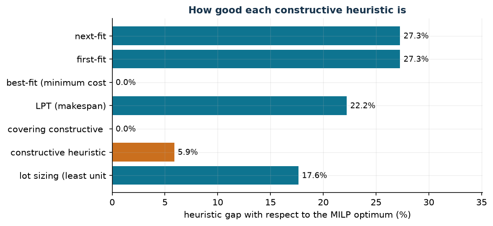

# Constructive heuristics

**Class:** algorithms · **Script:** `python/cap05_heuristics.py`, `python/euristiche.py`

[](https://colab.research.google.com/github/fabiofurini/mip-modelling/blob/main/notebooks/cap05_heuristics.ipynb)

A constructive heuristic builds **one** solution quickly, adding one element at a
time and never backtracking. It proves nothing about the quality of that
solution, and it is not even guaranteed to reach a feasible one: it can get stuck
part-way, with an element that fits nowhere. When it does end with a feasible
solution, that solution is the other half of the sandwich of
[chapter 4](modelling-4.md): the pessimistic side, the one guaranteed by a
solution that really exists; when it fails, there is no primal bound.

!!! note "What a heuristic must produce in this course"
    1. a readable **pseudocode**, with the scanning order, the choice criterion,
       the tie-breaking rule and the failure case stated;
    2. the corresponding **Python function**, line by line;
    3. the **trace** of the execution on an instance;
    4. the **feasibility check**: constraints, bounds *and* integrality;
    5. the resulting **bound**, with the right name.

    Point 4 is not a formality: a solution satisfying the linear constraints but
    with a fractional component is feasible for the *relaxation*, not for the
    MILP, and its value is not a primal bound.

!!! danger "The side of the bound depends on the objective, not on the heuristic"
    In a **minimisation** the value of a feasible solution is an *upper* bound:
    $z(\mathit{MILP}) \le \mathit{UB}$. In a **maximisation** it is a *lower*
    bound: $\mathit{LB} \le z(\mathit{MILP})$. Calling $UB$ the result
    of a constructive heuristic on a maximisation is the commonest sign error in the course.

## The three bin-packing heuristics

```text
Build(n, k, t, a, gamma):
  x[j][m] <- 0 for every j, m;   ra[m] <- a[m] for every m
  for j = 1..n:
      # next-fit:  the current machine only, then the next one
      # first-fit: the first m with t[j][m] <= ra[m]
      # best-fit:  among the feasible m, the one with smallest gamma(j,m,ra)
      choose m* by the rule
      if no m is feasible: return "no solution found"
      x[j][m*] <- 1;  ra[m*] <- ra[m*] - t[j][m*]
  return x
```

All three scan the jobs **in the given order**: changing the order changes the
result, and this must be said when a value is reported. Ties are broken on the
smallest index, so the run is reproducible.

On the instance of [problem 7.1](scheduling-1.md) (a **minimisation**):

| Heuristic | $UB$ | $z(\mathit{MILP})$ | gap |
|---|---:|---:|---:|
| next-fit | 14 | 11 | $27.3\%$ |
| first-fit | 14 | 11 | $27.3\%$ |
| best-fit on cost | 11 | 11 | $0.0\%$ |

The best-fit on cost finds the optimum; but no bound certifies it — that takes
the solver, or a dual bound reaching $11$, and in problem 7.1 the hand-built
dual stops at $10$.

## LPT: balancing over identical machines

```text
LPT(n, k, t):
  L[m] <- 0 for every m                       # current loads
  for j in order of DECREASING t[j]:
      m* <- argmin_m L[m]                     # ties: the smallest index
      x[j][m*] <- 1;  L[m*] <- L[m*] + t[j]
  return x, max_m L[m]
```

The decreasing order is essential: leaving the long jobs for last makes them
impossible to place.

!!! example "Seven jobs on three machines"
    $t = (5, 5, 4, 4, 3, 3, 3)$, $k = 3$, total $27$.

    - **Steps 1–3.** The jobs $5$, $5$, $4$ go to the three empty machines:
      $L = (5, 5, 4)$.
    - **Step 4.** Job $4$: the smallest load is machine 3, which goes to $8$.
      $L = (5, 5, 8)$.
    - **Steps 5–6.** The two jobs of length $3$ go to machines 1 and 2:
      $L = (8, 8, 8)$.
    - **Step 7.** The last job of length $3$ finds all loads equal to $8$; by
      the tie rule it goes to machine 1, which reaches $11$.

    LPT makespan: $\mathit{UB} = 11$, with loads $(11, 8, 8)$.

    **The elementary bound.** The makespan is at least
    $\max(\max_j t_j,\ \sum_j t_j / k) = \max(5, 9) = 9$. The optimum is exactly
    $z(\mathit{MILP}) = 9$ — attained with $\{5,4\}$, $\{5,4\}$, $\{3,3,3\}$ —
    and LPT is off by $22.2\%$.

!!! tip "Two free bounds, to be compared"
    $\max_j t_j$ and $\sum_j t_j / k$ are computable without solving anything,
    and the better of the two is often already close to the optimum. An
    "obvious" bound nobody writes down is a wasted bound: the dual of
    [chapter 4](modelling-4.md) is for when the obvious ones are not enough, not
    instead of them.

## Constructive covering heuristic

```text
CoveringConstructive heuristic(c, S):
  uncovered <- {1..m};   y[j] <- 0 for every j
  while uncovered is not empty:
      for every j not yet chosen: new(j) <- |{i in uncovered : j in S_i}|
      if new(j) = 0 for every j: return "no solution found"
      j* <- argmin_{j : new(j) > 0} c[j] / new(j)
      y[j*] <- 1;   uncovered <- uncovered \ {i : j* in S_i}
  return y
```

The criterion is the **cost per newly covered zone**, not the absolute cost.

On the four teams of [chapter 4](modelling-4.md), $c = (4,3,5,3)$: step 1 ratios
$4/3$, $1$, $5/3$, $1$ → element 2 (covers zones 1, 2, 5); step 2 ratios $2$,
$5/2$, $3/2$ → element 4 (zones 4 and 6); step 3 ratios $4$ and $5$ → element 1.
Solution $\{1,2,4\}$, cost $\mathit{UB} = 10$, which here is the optimum.

## Knapsack constructive heuristic: a lower bound

```text
KnapsackConstructive heuristic(p, w, C):
  residual <- C;   y[j] <- 0 for every j
  for j in order of DECREASING p[j]/w[j]:
      if w[j] <= residual:  y[j] <- 1;  residual <- residual - w[j]
  return y
```

On $p = (10,7,6,4)$, $w = (5,4,3,3)$, $C = 9$: ratios $2$, $7/4$, $2$, $4/3$;
items 1 and 3 are taken (weight $8$), value $16$. Since the problem is a
**maximisation**, $\mathit{LB} = 16 \le z(\mathit{MILP}) = 17$, gap $5.9\%$: the
optimum takes items 1 and 2, filling the knapsack exactly. The constructive heuristic goes wrong
because item 3 leaves an unusable residual.

## Lot sizing: least unit cost period covering

```text
LeastUnitCost(d, f, h):
  t <- 1
  while t <= T:
      skip the periods with d[t] = 0
      for k = 1..T-t+1:
          Q_k <- sum of d[t..t+k-1]
          c_k <- (f + h * sum of (s-t)*d[s] for s = t..t+k-1) / Q_k
      k* <- argmin_k c_k                      # the lowest average cost per unit
      produce Q_{k*} in period t;   t <- t + k*
```

!!! danger "This is not the Wagner–Whitin procedure"
    Wagner–Whitin is an **exact** dynamic-programming algorithm for the
    *uncapacitated* lot-sizing model: it solves that model to optimality in
    polynomial time. The procedure above is a heuristic, and its value is only a
    bound. Calling it "the Wagner–Whitin constructive heuristic" confuses two different things.

On $d = (20, 10, 30, 40, 10)$, setup $f = 50$, holding $h = 1$: from period 1 it
pays to cover 2 periods (unit cost $2$); from period 3 another 2 (unit cost
$\approx 1.286$); from period 5 only that one (unit cost $5$). Cost
$\mathit{UB} = 200$ against $z(\mathit{MILP}) = 170$, gap $17.6\%$ — which is
also the value Wagner–Whitin would give, being exact on this model.

## Local search, and what it does not give

A **local search** starts from a feasible solution and tries elementary moves,
accepting those that improve; it stops at a **local optimum**.

On the LPT solution ($L = (11, 8, 8)$, makespan $11$), the move "move one job to
another machine" improves nothing: moving one of the two jobs of length $3$ off
machine 1 brings its load to $8$ but raises the receiving machine to $11$. The
local search stops at $11$, while the optimum is $9$: to get there a **swap**
between two machines is needed.

!!! warning "A local optimum is not a better bound"
    Local search returns a feasible solution, hence a bound on the pessimistic
    side, and nothing else. The fact that it stopped does not mean it has
    arrived.

## When the constructive heuristic fails

!!! danger "«No solution found» is not «no solution exists»"
    Three jobs of duration $(3, 3, 2)$ on two machines with availability
    $(5, 3)$. Next-fit: job 1 goes to machine 1 (residual $2$); job 2 does not
    fit and moves to machine 2 (residual $0$); job 3 does not fit and there are
    no more machines: **failure**. But the problem is feasible: jobs 2 and 3 fit
    together on machine 1 ($3 + 2 = 5$) and job 1 on machine 2 ($3 \le 3$).

    A constructive heuristic is *myopic*: it decides one thing at a time and
    never backtracks. Its failure is information about the heuristic, not about
    the problem. To prove a model infeasible one needs the solver
    (`Status = INFEASIBLE`) or a proof.

## The overview of the heuristics

| Heuristic | Direction | value | $z(\mathit{MILP})$ | gap |
|---|---|---:|---:|---:|
| next-fit / first-fit (assignment) | min ($UB$) | 14 | 11 | $27.3\%$ |
| best-fit on cost (assignment) | min ($UB$) | 11 | 11 | $0.0\%$ |
| LPT (makespan) | min ($UB$) | 11 | 9 | $22.2\%$ |
| covering constructive heuristic | min ($UB$) | 10 | 10 | $0.0\%$ |
| ratio constructive heuristic (knapsack) | max ($LB$) | 16 | 17 | $5.9\%$ |
| least unit cost (lot sizing) | min ($UB$) | 200 | 170 | $17.6\%$ |



!!! tip "What this table teaches"
    Two heuristics find the optimum and four do not, and **before** solving the
    MILP there is no way of knowing which. A $0\%$ gap and a $27\%$ gap are told
    apart only *afterwards*. This is why the course always asks for two bounds:
    a heuristic on its own says how much a solution one can actually implement
    costs, not how much is being lost.

## Code

The heuristics live in
[`python/euristiche.py`](https://github.com/fabiofurini/mip-modelling/blob/main/python/euristiche.py),
the examples in
[`python/cap05_heuristics.py`](https://github.com/fabiofurini/mip-modelling/blob/main/python/cap05_heuristics.py);
the notebook is
[`notebooks/cap05_heuristics.ipynb`](https://github.com/fabiofurini/mip-modelling/blob/main/notebooks/cap05_heuristics.ipynb).

<!-- embedded-script: begin (regenerated by python/embed_code.py) -->

??? example "Show the complete script — `python/cap05_heuristics.py` (203 lines)"

    ```python
    """Chapter 5 -- Constructive heuristics: the six families, with trace and bound.

    Every heuristic of the course on a minimal instance: the step-by-step trace (the
    same text that ends up in the notes), the feasibility check of the solution
    produced --- constraints, bounds *and* integrality --- and the comparison with
    the optimum of the corresponding MILP. It ends with a local-search step and with
    the case where the constructive heuristic fails although the problem is feasible.
    """
    import gurobipy as gp
    import pandas as pd
    from gurobipy import GRB

    from euristiche import (best_fit, first_fit, euristica_copertura, euristica_lotti, euristica_zaino,
                            lpt, matrice, next_fit)
    from mip import (ammissibile, frazione, nuovo_modello, rilassamento, risolvi,
                     stampa_soluzione, valuta, viola_interezza)
    from stile import (ARANCIO, BLU, CICLO, GRIGIO, ROSSO, TEAL, VERDE, intestazione,
                       plt, salva_dati, salva_figura)

    R = range
    CONFRONTO = []


    def confronta(nome, senso, valore_eur, zmilp, note=""):
        gap = abs(valore_eur - zmilp) / abs(zmilp) if abs(zmilp) > 1e-9 else 0.0
        ruolo = "ub" if senso == "min" else "lb"
        print(f"  {nome:34s} heuristic = {frazione(valore_eur):>6} ({ruolo})   "
              f"z(MILP) = {frazione(zmilp):>6}   gap = {100 * gap:.1f}%  {note}")
        CONFRONTO.append({"heuristic": nome, "sense": senso, "heuristic_value": valore_eur,
                          "role": ruolo, "z_milp": zmilp, "gap": gap})


    # ---------- 1. BIN PACKING: NEXT-FIT, FIRST-FIT, BEST-FIT ----------
    intestazione("5.1  The three bin-packing heuristics on jobs and machines")
    t51 = [[2, 1, 3], [3, 4, 2], [4, 5, 3]]
    c51 = [[5, 10, 2], [5, 4, 6], [5, 4, 6]]
    a51 = [5, 6, 7]


    def modello_assegnamento(t, c, a):
        n, k = len(t), len(a)
        m = nuovo_modello("assignment")
        x = m.addVars(n, k, vtype=GRB.BINARY, name="x")
        m.setObjective(gp.quicksum(c[j][mm] * x[j, mm] for j in R(n) for mm in R(k)), GRB.MINIMIZE)
        m.addConstrs((x.sum(j, "*") == 1 for j in R(n)), name="assign")
        m.addConstrs((gp.quicksum(t[j][mm] * x[j, mm] for j in R(n)) <= a[mm] for mm in R(k)),
                     name="availability")
        return m, x


    m51, x51 = modello_assegnamento(t51, c51, a51)
    z51 = risolvi(m51)
    for nome, e in [("next-fit", next_fit(t51, a51)),
                    ("first-fit", first_fit(t51, a51)),
                    ("best-fit (minimum cost)", best_fit(t51, a51, lambda j, mm, ra: c51[j][mm], "cost"))]:
        valore = sum(c51[j][mm] for (j, mm) in e.x)
        sol = {f"x[{j},{mm}]": 1 for (j, mm) in e.x}
        assert ammissibile(m51, sol), nome           # constraints, bounds AND integrality
        confronta(f"5.1 {nome}", "min", valore, z51)
    print("  Trace of the best-fit (the text that appears in the notes):")
    best_fit(t51, a51, lambda j, mm, ra: c51[j][mm], "cost").traccia.stampa()

    # ---------- 2. LPT: BALANCING OVER IDENTICAL MACHINES ----------
    intestazione("5.2  LPT: the makespan on identical machines")
    t52 = [5, 5, 4, 4, 3, 3, 3]
    k52 = 3
    e52 = lpt(t52, k52)
    e52.traccia.stampa()
    m52 = nuovo_modello("makespan")
    x52 = m52.addVars(len(t52), k52, vtype=GRB.BINARY, name="x")
    T52 = m52.addVar(name="T")
    m52.setObjective(T52, GRB.MINIMIZE)
    m52.addConstrs((x52.sum(j, "*") == 1 for j in R(len(t52))), name="assign")
    m52.addConstrs((T52 >= gp.quicksum(t52[j] * x52[j, mm] for j in R(len(t52))) for mm in R(k52)),
                   name="max")
    z52 = risolvi(m52)
    sol52 = {f"x[{j},{mm}]": 1 for (j, mm) in e52.x} | {"T": e52.makespan}
    assert ammissibile(m52, sol52)
    confronta("5.2 LPT (makespan)", "min", e52.makespan, z52,
              f"loads {[int(c) for c in e52.carichi]}, total {sum(t52)}")
    print(f"  Elementary bound: the makespan is at least max(max_j t_j, total/k) = "
          f"max({max(t52)}, {frazione(sum(t52) / k52)}) = {frazione(max(max(t52), sum(t52) / k52))}")

    # ---------- 3. COVERING GREEDY ----------
    intestazione("5.3  Constructive covering heuristic")
    c53 = [4, 3, 5, 3]
    S53 = [[0, 1], [1, 2], [0, 2], [0, 3], [1, 3], [2, 3]]
    e53 = euristica_copertura(c53, S53)
    e53.traccia.stampa()
    m53 = nuovo_modello("covering")
    x53 = m53.addVars(len(c53), vtype=GRB.BINARY, name="x")
    m53.setObjective(gp.quicksum(c53[j] * x53[j] for j in R(len(c53))), GRB.MINIMIZE)
    m53.addConstrs((gp.quicksum(x53[j] for j in S53[i]) >= 1 for i in R(len(S53))), name="cover")
    z53 = risolvi(m53)
    assert ammissibile(m53, {f"x[{j}]": e53.y[j] for j in R(len(c53))})
    confronta("5.3 covering constructive heuristic", "min", e53.valore, z53,
              f"chosen {[j + 1 for j in R(len(c53)) if e53.y[j]]}")

    # ---------- 4. KNAPSACK GREEDY: A LOWER BOUND ----------
    intestazione("5.4  Knapsack constructive heuristic: in a maximisation the heuristic gives a lower bound")
    p54, w54, C54 = [10, 7, 6, 4], [5, 4, 3, 3], 9
    e54 = euristica_zaino(p54, w54, C54)
    e54.traccia.stampa()
    m54 = nuovo_modello("knapsack")
    x54 = m54.addVars(4, vtype=GRB.BINARY, name="x")
    m54.setObjective(gp.quicksum(p54[j] * x54[j] for j in R(4)), GRB.MAXIMIZE)
    m54.addConstr(gp.quicksum(w54[j] * x54[j] for j in R(4)) <= C54, name="capacity")
    z54 = risolvi(m54)
    assert ammissibile(m54, {f"x[{j}]": e54.y[j] for j in R(4)})
    confronta("5.4 constructive heuristic by ratio p/w", "max", e54.valore, z54,
              f"taken {[j + 1 for j in R(4) if e54.y[j]]}, residual {e54.residuo:g}")

    # ---------- 5. LOT SIZING GREEDY ----------
    intestazione("5.5  Lot sizing: least unit cost period covering")
    d55 = [20, 10, 30, 40, 10]
    setup55, hold55 = 50, 1
    e55 = euristica_lotti(d55, setup55, hold55)
    e55.traccia.stampa()
    T55 = len(d55)
    m55 = nuovo_modello("lot_sizing")
    q55 = m55.addVars(T55, name="q")
    I55 = m55.addVars(T55, name="I")
    y55 = m55.addVars(T55, vtype=GRB.BINARY, name="y")
    Mtot = sum(d55)
    m55.setObjective(gp.quicksum(setup55 * y55[t] + hold55 * I55[t] for t in R(T55)), GRB.MINIMIZE)
    for t in R(T55):
        m55.addConstr((I55[t - 1] if t else 0) + q55[t] - I55[t] == d55[t], name=f"bilancio{t}")
        m55.addConstr(q55[t] <= Mtot * y55[t], name=f"link{t}")
    z55 = risolvi(m55)
    sol55 = {}
    for t in R(T55):
        sol55[f"q[{t}]"] = e55.lanci.get(t, 0)
        sol55[f"y[{t}]"] = 1 if t in e55.lanci else 0
    scorta = 0
    for t in R(T55):
        scorta += sol55[f"q[{t}]"] - d55[t]
        sol55[f"I[{t}]"] = scorta
    assert ammissibile(m55, sol55)
    confronta("5.5 lot sizing (least unit cost)", "min", e55.valore, z55,
              f"runs in periods {[t + 1 for t in sorted(e55.lanci)]}")
    print("  Wagner-Whitin solves this very model *to optimality* by dynamic programming:")
    print(f"  its value is {frazione(z55)}, not the heuristic one.")

    # ---------- 6. A LOCAL SEARCH STEP ----------
    intestazione("5.6  A local-search step on the LPT solution")
    carichi = list(e52.carichi)
    assegn = {j: mm for (j, mm) in e52.x}
    migliorato = True
    passi = 0
    while migliorato:
        migliorato = False
        for j, mm in list(assegn.items()):
            for nuovo in R(k52):
                if nuovo == mm:
                    continue
                prova = list(carichi)
                prova[mm] -= t52[j]
                prova[nuovo] += t52[j]
                if max(prova) < max(carichi) - 1e-9:
                    print(f"  Moving job {j + 1} from machine {mm + 1} to {nuovo + 1}: "
                          f"makespan {max(carichi):g} -> {max(prova):g}")
                    carichi, assegn[j], migliorato, passi = prova, nuovo, True, passi + 1
                    break
            if migliorato:
                break
    if passi == 0:
        print(f"  No single move improves the makespan {max(carichi):g}: the LPT solution")
        print(f"  is a local optimum for this move. The global optimum is {frazione(z52)}.")
    print("  A local optimum is not a global optimum, and local search produces no bound")
    print("  better than that of the solution it returns.")

    # ---------- 7. WHEN THE GREEDY FAILS ----------
    intestazione("5.7  A failure of the constructive heuristic does not prove infeasibility")
    t57 = matrice([3, 3, 2], 2)
    a57 = [5, 3]
    e57 = next_fit(t57, a57)
    e57.traccia.stampa()
    print(f"  next-fit: ok = {e57.ok}")
    m57, x57 = modello_assegnamento(t57, [[1, 1], [1, 1], [1, 1]], a57)
    z57 = risolvi(m57)
    print(f"  The MILP, however, is feasible, with optimum {frazione(z57)}: solution "
          + ", ".join(f"x[{j+1}][{mm+1}]" for j in R(3) for mm in R(2) if x57[j, mm].X > 0.5))
    print("  The constructive heuristic fails because it is myopic, not because the problem has no")
    print("  solution: 'no solution found' is not 'no solution exists'.")
    assert not e57.ok

    # ---------- 8. THE OVERVIEW ----------
    intestazione("5.8  The overview")
    tab = pd.DataFrame(CONFRONTO)
    salva_dati(tab, "cap05_euristiche")
    fig, ax = plt.subplots(figsize=(7.6, 3.6))
    etichette = [r["heuristic"].split(" ", 1)[1][:22] for r in CONFRONTO]
    gap = [100 * r["gap"] for r in CONFRONTO]
    colori = [TEAL if r["sense"] == "min" else ARANCIO for r in CONFRONTO]
    ax.barh(etichette, gap, color=colori)
    for i, g in enumerate(gap):
        ax.annotate(f"{g:.1f}%", (g, i), textcoords="offset points", xytext=(4, -3), fontsize=9)
    ax.set_xlabel("heuristic gap with respect to the MILP optimum (%)")
    ax.set_title("How good each constructive heuristic is")
    ax.invert_yaxis()
    ax.set_xlim(0, max(gap) * 1.25 + 1)
    salva_figura(fig, "cap05_gap")
    print("Done.")
    ```

<!-- embedded-script: end -->
