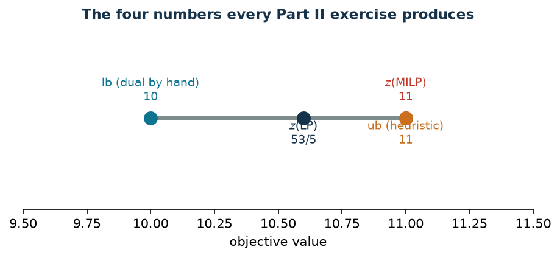

# From the model to Python/Gurobi

**Class:** implementation · **Script:** `python/cap06_gurobi.py`

[](https://colab.research.google.com/github/fabiofurini/mip-modelling/blob/main/notebooks/cap06_gurobi.ipynb)

The course uses **one solver only**, Gurobi from Python. This page shows how a
model is written — one family of constraints per block, with the names of the
mathematical model — and above all how the results are **read**, including the
case where the solver has not finished.

## The four classes of variables

| What | `vtype` | Domain | Typical use |
|---|---|---|---|
| yes/no decision | `GRB.BINARY` | $\{0,1\}$ | selection, activation, assignment |
| count | `GRB.INTEGER` | $\mathbb{Z}$ between `lb` and `ub` | boxes, shifts, workers |
| measurable quantity | (default) | $[\mathit{LB}, \mathit{UB}] \subseteq \mathbb{R}$ | time, money, flow |
| free variable | (default) with `lb=-GRB.INFINITY` | $\mathbb{R}$ | duals of equalities |

!!! warning "The two defaults people forget"
    `GRB.BINARY` already implies `lb = 0` and `ub = 1`: there is no need to
    repeat them. A continuous variable has `lb = 0` by default: a variable that
    must be allowed to go negative — typically the dual of an equality, or a
    signed deviation — must be declared with `lb=-GRB.INFINITY`, otherwise the
    model is silently wrong.

## The model, one family per block

```python
def model(t, c, a):
    """Problem 7.1: one addConstrs per family, with the label as its name."""
    m = gp.Model("assignment");  m.Params.OutputFlag = 0
    x = m.addVars(n, k, vtype=GRB.BINARY, name="x")           # data -> variables
    m.setObjective(gp.quicksum(c[j][h] * x[j, h] for j in range(n)
                               for h in range(k)), GRB.MINIMIZE)
    m.addConstrs((x.sum(j, "*") == 1 for j in range(n)), name="assign")
    m.addConstrs((gp.quicksum(t[j][h] * x[j, h] for j in range(n)) <= a[h]
                  for h in range(k)), name="availability")
    return m, x
```

The three writing rules of the course: **one `addConstrs` per family**, in the
order of the mathematical model, with the `name` equal to the label; **variables
are declared all at once** with `addVars` and the indices of the model
(`x.sum(j, "*")` is the writing of the dummy index); **data come in as
arguments**, not as globals, so the same function serves the base instance and
all the variants.

The model has $9$ variables, $6$ constraints and $18$ nonzero coefficients. To
check that it is what was written on paper, `m.write("model.lp")`:

```text
Minimize
  5 x[0,0] + 10 x[0,1] + 2 x[0,2] + 5 x[1,0] + 4 x[1,1] + 6 x[1,2]
   + 5 x[2,0] + 4 x[2,1] + 6 x[2,2]
Subject To
 assign[0]: x[0,0] + x[0,1] + x[0,2] = 1
 ...
```

It is the quickest way to spot a wrong coefficient: the instance table and this
output must agree line by line.

## Reading the results

The reading order never changes: `Status`, then `SolCount`, then `ObjVal` and
`ObjBound`, then `MIPGap`, `NodeCount`, `Runtime`.

| `Status` | value | `SolCount` | What can be said |
|---|---:|---:|---|
| `OPTIMAL` | 2 | $\ge 1$ | $z(\mathrm{MILP}) = $ `ObjVal`, proved |
| `INFEASIBLE` | 3 | 0 | the model has no feasible solution |
| `UNBOUNDED` | 5 | 0 | a constraint, or a bound on a variable, is missing |
| `TIME_LIMIT` | 9 | 0 | nothing: neither a solution nor, in general, a useful bound |
| `TIME_LIMIT` | 9 | $\ge 1$ | `ObjBound` $\le z(\mathrm{MILP}) \le$ `ObjVal` |
| `SOLUTION_LIMIT` | 10 | $\ge 1$ | as above |

!!! example "The four cases on the instance of problem 7.1"
    - **Normal solve.** `Status = 2`, `SolCount = 2`, `ObjVal = ObjBound = 11`,
      `MIPGap = 0`, `NodeCount = 0`.
    - **Infeasible.** With availability $(1,1,1)$: `Status = 3`, `SolCount = 0`.
    - **Stopped immediately.** With `TimeLimit = 0`: `Status = 9`,
      `SolCount = 0`, `ObjBound` $= -\infty$. There is nothing to report.
    - **Stopped at the first solution.** With `SolutionLimit = 1`:
      `Status = 10`, `SolCount = 1`, `ObjVal = 12`, `ObjBound = 10`,
      `MIPGap = 0.1667`. This is the case where an **interval** is reported: the
      optimum lies between $10$ and $12$. Saying "the optimum is $12$" would be
      false.

!!! danger "What is *not* reported"
    One does not write "the optimum is `ObjVal`" if `Status` is not `OPTIMAL`.
    One does not write a gap if `SolCount` is $0$. One does not compare the
    `Runtime` of two models solved with different settings. And one does not
    read `ObjBound` at the end of the solve thinking it is the root relaxation:
    for that, `relax()` is needed.

## Tolerances

| Parameter | Default | Meaning |
|---|---:|---|
| `IntFeasTol` | $10^{-5}$ | how far an integer variable may be from an integer |
| `FeasibilityTol` | $10^{-6}$ | violation allowed on a linear constraint |
| `OptimalityTol` | $10^{-6}$ | tolerance on the reduced costs |
| `MIPGap` | $10^{-4}$ | relative gap below which the solver stops |

!!! warning "«Integer» means «integer within a tolerance»"
    A binary may come back as $0.9999999997$. In the text one writes $1$: values
    are rounded *when they are reported*, and comparisons always use a tolerance
    — in this course $10^{-6}$, the constant `TOL` of `python/mip.py`. Writing
    `if x.X == 1` is a mistake; one writes `if x.X > 0.5`.

    The default `MIPGap` $= 10^{-4}$ also means the solver may stop *before* the
    exact optimum while declaring `OPTIMAL`: on instances with large values it
    is worth lowering it.

## The relaxation with `relax()`

```python
m.update()            # relax() copies the model: pending changes must be applied first
r = m.relax()         # binaries become 0 <= x <= 1, integers x >= lb
r.Params.OutputFlag = 0
r.optimize()
zlp = r.ObjVal
duals = {c.ConstrName: c.Pi for c in r.getConstrs()}
```

On the instance of problem 7.1, $z(\mathrm{LP}^+) = z(\mathrm{LP}) = 53/5$ — the
two relaxations coincide because the assignment constraints already imply
$x_{jm} \le 1$ — and the nonzero duals are $\tilde\mu = (2,\ 4.8,\ 5)$ and
$\tilde\pi_2 = -0.2$: machine 2 is the only tight resource.

## The course protocol, from start to finish

$$\text{data} \to \text{model} \to \text{heuristic and check} \to \text{LP and dual} \to \text{MIP} \to \text{table} \to \text{figures and notebook}$$

```python
m, x = model(t, c, a)                                    # (1) data, (2) model

e = best_fit(t, a, lambda j, h, ra: c[j][h], "cost")     # (3) heuristic
ub = sum(c[j][h] for (j, h) in e.x)
assert ammissibile(m, {f"x[{j},{h}]": 1 for (j, h) in e.x})   # constraints, bounds AND integrality

d = dual(t, c, a)                                        # (4) the dual written by hand
by_hand = {f"mu[{j}]": min(c[j]) for j in range(n)}
lb, viol = valuta(d, by_hand);  assert viol <= 1e-9
zlp, zlp_str, pi = due_rilassamenti(m, d)                #     checks strong duality

z = risolvi(m)                                           # (5) the MIP
row = registra_bound("7.1 assignment", ub, lb, zlp, zlp_str, z)   # (6) the table
salva_dati(pd.DataFrame([row]), "sched1_bound")          #     -> data/sched1_bound.csv
```

On the instance of problem 7.1 the protocol produces $\mathit{LB} = 10$,
$z(\mathrm{LP}) = 53/5$, $z(\mathrm{MILP}) = 11$, $\mathit{UB} = 11$, and the
row ends up in `data/sched1_bound.csv`. That is where the notes, the website
page and `check_numbers.py` read it from: **one single place where the number
exists**.



## Running the code

From the `python/` folder:

```bash
python3 -m venv .venv && source .venv/bin/activate
pip install gurobipy pandas matplotlib
python3 fam07_1_assignment.py       # one chapter
python3 run_all.py                  # all of them, plus the notebooks
python3 check_numbers.py            # the asserts on every quoted number
```

On Colab every chapter has a notebook that opens from the badge at the top of
the page: the first cell installs `gurobipy` and downloads the three shared
modules.

!!! tip "The licence bundled with `gurobipy` is enough, and why"
    The *size-limited* licence of the pip package allows models of up to **2000
    variables and 2000 constraints**. The instances of this course are tiny —
    the largest model of Part II has a few dozen variables — and all fit with an
    enormous margin. For larger instances the free academic licence is activated
    from [portal.gurobi.com](https://portal.gurobi.com). If a model exceeds the
    limit, Gurobi reports it with an explicit error at `optimize()`: it does not
    silently produce a wrong result.

## Code

The complete script is
[`python/cap06_gurobi.py`](https://github.com/fabiofurini/mip-modelling/blob/main/python/cap06_gurobi.py);
the notebook is
[`notebooks/cap06_gurobi.ipynb`](https://github.com/fabiofurini/mip-modelling/blob/main/notebooks/cap06_gurobi.ipynb).

<!-- embedded-script: begin (regenerated by python/embed_code.py) -->

??? example "Show the complete script — `python/cap06_gurobi.py` (197 lines)"

    ```python
    """Chapter 6 -- From the model to Python/Gurobi: how it is written and read.

    The four classes of variables, one addConstrs per family of constraints, and
    above all how to read the results: Status, SolCount, ObjVal, ObjBound, MIPGap,
    NodeCount, the time limit, the tolerances and relax(). It closes with the full
    protocol of the course on a minimal instance.
    """
    import gurobipy as gp
    import pandas as pd
    from gurobipy import GRB

    from euristiche import best_fit
    from mip import (ammissibile, due_rilassamenti, frazione, nuovo_modello, registra_bound,
                     rilassamento, risolvi, stampa_lp, stampa_soluzione, valuta, viola_interezza)
    from stile import (ARANCIO, BLU, CICLO, GRIGIO, ROSSO, TEAL, VERDE, intestazione,
                       plt, salva_dati, salva_figura)

    R = range

    # ---------- 1. THE FOUR CLASSES OF VARIABLES ----------
    intestazione("1. The four classes of variables and their domains")
    m = nuovo_modello("variable_types")
    b = m.addVar(vtype=GRB.BINARY, name="binary")
    i = m.addVar(vtype=GRB.INTEGER, lb=0, ub=10, name="integer")
    c = m.addVar(lb=0.0, ub=GRB.INFINITY, name="continuous")
    l = m.addVar(lb=-GRB.INFINITY, ub=GRB.INFINITY, name="free")
    m.update()
    for v in m.getVars():
        print(f"  {v.VarName:9s} VType = {v.VType}   lb = {v.LB:>6.1f}   ub = "
              f"{'+inf' if v.UB >= GRB.INFINITY else f'{v.UB:.1f}':>6s}")
    print("  GRB.BINARY already implies lb = 0 and ub = 1: there is no need to state them.")
    print("  A continuous variable has lb = 0 by default: free variables must be declared")
    print("  explicitly with lb = -GRB.INFINITY (the duals of an equality constraint).")

    # ---------- 2. A MODEL, ONE FAMILY OF CONSTRAINTS AT A TIME ----------
    intestazione("2. The model is written one family of constraints per block")
    t = [[2, 1, 3], [3, 4, 2], [4, 5, 3]]
    co = [[5, 10, 2], [5, 4, 6], [5, 4, 6]]
    a = [5, 6, 7]
    n, k = 3, 3


    def modello(t, co, a):
        """Problem 7.1: one addConstrs per family, with the label as its name."""
        mm = nuovo_modello("assignment")
        x = mm.addVars(n, k, vtype=GRB.BINARY, name="x")          # data -> variables
        mm.setObjective(gp.quicksum(co[j][h] * x[j, h] for j in R(n) for h in R(k)), GRB.MINIMIZE)
        mm.addConstrs((x.sum(j, "*") == 1 for j in R(n)), name="assign")
        mm.addConstrs((gp.quicksum(t[j][h] * x[j, h] for j in R(n)) <= a[h] for h in R(k)),
                      name="availability")
        return mm, x


    m2, x2 = modello(t, co, a)
    m2.update()
    print(f"  Variables: {m2.NumVars}   constraints: {m2.NumConstrs}   nonzeros: {m2.NumNZs}")
    print("  Constraint names (the same labels as the mathematical model):")
    print("   " + ", ".join(cc.ConstrName for cc in m2.getConstrs()))
    print("  The instance model in LP format, to check the tables in the notes:")
    import io
    import os
    import tempfile
    with tempfile.TemporaryDirectory() as d:
        percorso = os.path.join(d, "modello.lp")
        m2.write(percorso)
        testo_lp = open(percorso).read()
    for riga in [r for r in testo_lp.splitlines() if r.strip()][:8]:
        print("    " + riga)
    print("    ...")

    # ---------- 3. READING THE RESULTS: THE NORMAL CASE ----------
    intestazione("3. Reading the results when everything goes well")
    m2.optimize()
    print(f"  Status   = {m2.Status}   (2 = OPTIMAL)")
    print(f"  SolCount = {m2.SolCount}   (how many integer solutions were found)")
    print(f"  ObjVal   = {frazione(m2.ObjVal)}   ObjBound = {frazione(m2.ObjBound)}   "
          f"MIPGap = {m2.MIPGap:.6f}")
    print(f"  NodeCount = {int(m2.NodeCount)}   Runtime = {m2.Runtime:.3f} s")
    print("  Optimal solution (nonzero variables only):")
    stampa_soluzione(m2, solo_non_nulle=True)
    z_ott = m2.ObjVal

    # ---------- 4. READING THE RESULTS WHEN THINGS GO WRONG ----------
    intestazione("4. The three cases in which ObjVal cannot be read")
    # (a) infeasible
    m3, x3 = modello(t, co, [1, 1, 1])          # insufficient availability
    m3.optimize()
    print(f"  (a) availability (1,1,1): Status = {m3.Status} (3 = INFEASIBLE), "
          f"SolCount = {m3.SolCount}")
    print("      ObjVal does not exist: reading it raises an error. Read Status first, always.")
    assert m3.Status == GRB.INFEASIBLE
    # (b) time limit with no solution found
    m4, x4 = modello(t, co, a)
    m4.Params.TimeLimit = 0.0
    m4.optimize()
    print(f"  (b) TimeLimit = 0: Status = {m4.Status} (9 = TIME_LIMIT), SolCount = {m4.SolCount}")
    print(f"      ObjBound = {m4.ObjBound if m4.ObjBound > -GRB.INFINITY else '-inf'}: "
          f"not even the bound has been computed.")
    # (c) stopped with one solution found: the useful case
    m5, x5 = modello(t, co, a)
    m5.Params.SolutionLimit = 1                 # stops at the first integer solution
    m5.optimize()
    print(f"  (c) SolutionLimit = 1: Status = {m5.Status} (10 = SOLUTION_LIMIT), "
          f"SolCount = {m5.SolCount}")
    if m5.SolCount > 0:
        print(f"      ObjVal = {frazione(m5.ObjVal)}  ObjBound = {frazione(m5.ObjBound)}  "
              f"MIPGap = {m5.MIPGap:.4f}")
        print("      This is the only case in which an interval is reported: the optimum")
        print("      lies between ObjBound and ObjVal, and MIPGap measures its width.")
    salva_dati(pd.DataFrame([
        {"case": "optimal", "status": m2.Status, "sol_count": m2.SolCount, "obj_val": m2.ObjVal,
         "obj_bound": m2.ObjBound, "mip_gap": m2.MIPGap},
        {"case": "infeasible", "status": m3.Status, "sol_count": m3.SolCount,
         "obj_val": None, "obj_bound": None, "mip_gap": None},
        {"case": "time limit, no solution", "status": m4.Status,
         "sol_count": m4.SolCount, "obj_val": None, "obj_bound": None, "mip_gap": None},
        {"case": "first solution", "status": m5.Status, "sol_count": m5.SolCount,
         "obj_val": m5.ObjVal if m5.SolCount else None,
         "obj_bound": m5.ObjBound, "mip_gap": m5.MIPGap if m5.SolCount else None},
    ]), "cap06_stati")

    # ---------- 5. TOLERANCES ----------
    intestazione("5. Tolerances: 'integer' means 'integer within IntFeasTol'")
    m6, x6 = modello(t, co, a)
    print(f"  IntFeasTol  = {m6.Params.IntFeasTol:g}  (how far a binary may be from 0 or 1)")
    print(f"  FeasibilityTol = {m6.Params.FeasibilityTol:g}  (violation allowed on the constraints)")
    print(f"  OptimalityTol  = {m6.Params.OptimalityTol:g}  (tolerance on the reduced costs)")
    print(f"  MIPGap (target) = {m6.Params.MIPGap:g}  (it stops when the gap falls below)")
    m6.optimize()
    peggiore = max(min(abs(v.X - round(v.X)), 1) for v in m6.getVars())
    print(f"  On the returned solution, the largest distance from an integer is {peggiore:.2e}")
    print("  In the text one writes 1, not 0.9999999997: values are rounded when they are")
    print("  reported, and comparisons use a tolerance (1e-6 in this course).")

    # ---------- 6. THE RELAXATION WITH relax() ----------
    intestazione("6. relax(): the relaxation of the model we wrote")
    zlp_r, sol_r, pi_r = rilassamento(m6, rafforzato=True)
    zlp_p, _, _ = rilassamento(m6, rafforzato=False)
    print(f"  z(LP+) = {frazione(zlp_r)}   (relax(): the binaries become 0 <= x <= 1)")
    print(f"  z(LP)  = {frazione(zlp_p)}   (relaxation without the bounds: x <= 1 is dropped too)")
    print("  Relaxation duals read from Gurobi:")
    for nome, valore in pi_r.items():
        if abs(valore) > 1e-9:
            print(f"    {nome}: {valore:.4f}")
    print("  relax() copies the model: pending changes must be applied first with")
    print("  m.update(), otherwise an old version is relaxed.")

    # ---------- 7. THE COURSE PROTOCOL, FROM START TO FINISH ----------
    intestazione("7. The protocol: data -> model -> heuristic -> LP and dual -> MIP -> table")
    # (1) data  ->  (2) model
    m7, x7 = modello(t, co, a)
    # (3) heuristic and its check
    e = best_fit(t, a, lambda j, h, ra: co[j][h], "cost")
    ub = sum(co[j][h] for (j, h) in e.x)
    sol_eur = {f"x[{j},{h}]": 1 for (j, h) in e.x}
    assert ammissibile(m7, sol_eur), "the heuristic solution must be feasible AND integer"
    print(f"  (3) best-fit heuristic: ub = {frazione(ub)}, feasibility checked "
          f"(constraints, bounds and integrality)")
    # (4) LP and the dual written by hand
    d = nuovo_modello("dual")
    mu = d.addVars(n, lb=-GRB.INFINITY, name="mu")
    pi = d.addVars(k, lb=-GRB.INFINITY, ub=0.0, name="pi")
    d.setObjective(mu.sum() + gp.quicksum(a[h] * pi[h] for h in R(k)), GRB.MAXIMIZE)
    d.addConstrs((mu[j] + t[j][h] * pi[h] <= co[j][h] for j in R(n) for h in R(k)), name="rc")
    mano = {f"mu[{j}]": min(co[j]) for j in R(n)}
    lb, viol = valuta(d, mano)
    assert viol <= 1e-9
    print(f"  (4) dual solution by hand: lb = {frazione(lb)}, feasible for the dual")
    zlp, zlp_raff, _ = due_rilassamenti(m7, d)
    # (5) the MIP
    z = risolvi(m7)
    # (6) the table
    riga = registra_bound("7.1 assignment", ub, lb, zlp, zlp_raff, z)
    salva_dati(pd.DataFrame([riga]), "cap06_protocollo")
    assert lb <= zlp <= z <= ub + 1e-9
    print("  (7) the table row is the one above, and it is saved to CSV: that is where")
    print("      the notes, the website and check_numbers.py read it from.")

    # ---------- 8. FIGURE: THE FOUR NUMBERS OF THE PROTOCOL ----------
    fig, ax = plt.subplots(figsize=(7.2, 2.6))
    ax.plot([lb, ub], [0, 0], color=GRIGIO, lw=3, solid_capstyle="round")
    for valore, colore, testo, dy in [(lb, TEAL, "$\\mathrm{lb}$ (dual by hand)", 14),
                                      (zlp, BLU, "$z(\\mathrm{LP})$", -20),
                                      (z, ROSSO, "$z(\\mathrm{MILP})$", 14),
                                      (ub, ARANCIO, "$\\mathrm{ub}$ (heuristic)", -20)]:
        ax.plot(valore, 0, "o", color=colore, ms=10)
        ax.annotate(f"{testo}\n{frazione(valore)}", (valore, 0), textcoords="offset points",
                    xytext=(0, dy), ha="center", fontsize=9, color=colore)
    ax.set_yticks([])
    ax.set_ylim(-0.8, 0.8)
    ax.set_xlim(lb - 0.5, ub + 0.5)
    ax.set_xlabel("objective value")
    ax.set_title("The four numbers every Part II exercise produces")
    ax.spines["left"].set_visible(False)
    ax.grid(False)
    salva_figura(fig, "cap06_protocollo")
    print("Done.")
    ```

<!-- embedded-script: end -->
