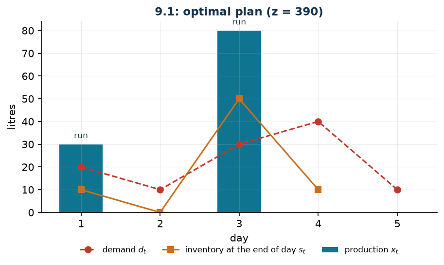

# Lot sizing with a fixed setup cost

**Class:** MILP · **Links:** fixed cost (big-M read off the data) · **Script:** `python/fam09_1_lotsizing.py`

[](https://colab.research.google.com/github/fabiofurini/mip-modelling/blob/main/notebooks/fam09_1_lotsizing.ipynb)

!!! abstract "Problem 9.1"
    A company has to plan the production of a single product over
    $n \in \mathbb{Z}_{\ge 1}$ periods. For every period $t$, $d_t$ is the demand,
    $p_t$ the cost of producing one unit and $q_t$ the fixed cost to be paid if
    production is set up in that period. For every $t \le n-1$, $h_t$ is the cost
    of keeping one unit in the warehouse at the end of the period. The initial
    stock is $r_0$, the required final stock is $r_n$. All the demand must be met
    at minimum total cost.

**The problem in words.** We *decide* how much to produce in each period, and
consequently how much is left in the warehouse. *The objective*: minimum total
cost (production, setups and warehouse). *The constraints*: the demand of every
period must be met exactly, and one cannot produce without paying the fixed
cost. This is the **lot sizing** problem with setup.

## Model

**Variables.** $x_t \ge 0$ units produced, $s_t \ge 0$ stock at the end of
period $t$ ($t \le n-1$), $y_t \in \{0,1\}$ production setup.

$$
\begin{aligned}
\min ~~ & \sum_{t=1}^{n} p_t\, x_t + \sum_{t=1}^{n} q_t\, y_t + \sum_{t=1}^{n-1} h_t\, s_t \\
\text{s.t.} \quad & x_1 - s_1 = d_1 - r_0, \\
& x_t + s_{t-1} - s_t = d_t, && t = 2, \dots, n-1, \\
& x_n + s_{n-1} = d_n + r_n, \\
& -x_t + M_t\, y_t \ge 0, && t = 1, \dots, n, \\
& x_t,\ s_t \ge 0, \qquad y_t \in \{0,1\}.
\end{aligned}
$$

**The link.** The constraint $x_t \le M_t\, y_t$ says: if $y_t = 0$ then
$x_t = 0$ (no production without a setup); if $y_t = 1$ the constraint is not
restrictive. The opposite direction — if $x_t = 0$ then $y_t = 0$ — is imposed
by no constraint but follows from **optimality**, because setting $y_t = 0$
stays feasible and saves $q_t \ge 0$.

!!! warning "The big-M is read off the data"
    A valid $M_t$ must be at least the largest quantity it is worth producing in
    period $t$. In an optimal solution one never produces more than the demand
    that is left to cover:

    $$M_t = \sum_{\tau = t}^{n} d_\tau + r_n .$$

    Any larger value is still valid but **weakens** the LP relaxation; any
    smaller value may cut off optimal solutions. On the instance
    $M = (110, 90, 80, 50, 10)$: the big-M of the last period is $10$, not $110$.

## The model in gurobipy

```python
m = gp.Model("lotsizing")
x = m.addVars(n, name="x")
s = m.addVars(n - 1, name="s")
y = m.addVars(n, vtype=GRB.BINARY, name="y")
m.setObjective(gp.quicksum(p[t] * x[t] for t in range(n))
               + gp.quicksum(q[t] * y[t] for t in range(n))
               + gp.quicksum(h[t] * s[t] for t in range(n - 1)), GRB.MINIMIZE)
m.addConstr(x[0] - s[0] == d[0] - r0, name="balance[0]")
m.addConstrs((x[t] + s[t - 1] - s[t] == d[t] for t in range(1, n - 1)), name="balance")
m.addConstr(x[n - 1] + s[n - 2] == d[n - 1] + rn, name=f"balance[{n - 1}]")
m.addConstrs((-x[t] + M[t] * y[t] >= 0 for t in range(n)), name="setup")
```

## The instance

$n = 5$ days, $r_0 = r_n = 0$, total demand $110$ units.

| | $t=1$ | $t=2$ | $t=3$ | $t=4$ | $t=5$ |
|---|---:|---:|---:|---:|---:|
| $d_t$ | 20 | 10 | 30 | 40 | 10 |
| $p_t$ | 2 | 3 | 2 | 3 | 2 |
| $q_t$ | 50 | 50 | 50 | 50 | 50 |
| $M_t$ | 110 | 90 | 80 | 50 | 10 |
| $h_t$ | 1 | 1 | 1 | 1 | — |

## Constructive heuristics: the primal bound

**(a) Lot-for-lot.** One produces every day exactly the demand: no stock, but a
setup every day. Cost $270 + 250 = 520$.

**(b) Least unit cost.** One starts from the first uncovered period and covers
with a single setup the number of periods that minimises the average cost per
unit, then starts again. Cost $O(n^2)$.

- period 1: covers up to 2, quantity $30$, average cost $2$;
- period 3: covers up to 4, quantity $70$, average cost $\approx 1.286$;
- period 5: covers only itself, quantity $10$, average cost $5$.

Setups on days $1, 3, 5$, for a cost of $420$. Keeping the better of the two,
$z(\mathit{MILP}) \le \mathit{UB} = 420$.

## LP relaxation and dual: the dual bound

With $\mu_t$ **free** on every balance and $\pi_t \ge 0$ on every setup
constraint:

$$
\begin{aligned}
\max ~~ & \sum_t b_t\, \mu_t \\
\text{s.t.} \quad & \mu_t - \pi_t \le p_t, \qquad M_t\, \pi_t \le q_t, \qquad
-\mu_t + \mu_{t+1} \le h_t .
\end{aligned}
$$

**The recipe.** $\bar\pi_t = 0$: the setups are given away. What is left is
$\mu_t \le p_t$ and $\mu_{t+1} \le \mu_t + h_t$, and the largest feasible value
is built forward,

$$\bar\mu_1 = p_1, \qquad \bar\mu_t = \min(\bar\mu_{t-1} + h_{t-1},\ p_t).$$

The reading is direct: $\bar\mu_t$ is the lowest unit cost of having one unit
available in period $t$, either by producing it then, or by producing it earlier
and keeping it in the warehouse. On the instance $\bar\mu = (2, 3, 2, 3, 2)$ and

$$\mathit{LB} = 2{\cdot}20 + 3{\cdot}10 + 2{\cdot}30 + 3{\cdot}40 + 2{\cdot}10 = 270 .$$

It is the production cost if the setups were free: valid, and deliberately
optimistic.

**What the solver says.** $z(\mathit{LP}) = z(\mathit{LP}^+) = 3890/11
\approx 353.6$: the relaxation does pay for the setups, in fractions
($\pi_t = q_t/M_t$ is feasible). The integer optimum sets up on days 1 and 3.

| | $t=1$ | $t=2$ | $t=3$ | $t=4$ | $t=5$ |
|---|---:|---:|---:|---:|---:|
| setup $y_t$ | 1 | 0 | 1 | 0 | 0 |
| production $x_t$ | 30 | 0 | 80 | 0 | 0 |
| stock $s_t$ | 10 | 0 | 50 | 10 | — |

| $UB$ | $LB$ (dual) | $z(\mathit{LP})$ | $z(\mathit{LP}^+)$ | $z(\mathit{MILP})$ | gap |
|---:|---:|---:|---:|---:|---:|
| 420 | 270 | $3890/11$ | $3890/11$ | 390 | $7.7\%$ |



## Additional considerations

- The problem is solved in $O(n^2)$ time by the **Wagner–Whitin** dynamic
  program. Least unit cost is *not* that algorithm: it is a myopic rule that
  looks at one setup at a time, and indeed it stops at $420$ against $390$.
- The valid inequality $x_t \le M_t$ adds nothing: $M_t$ is already the largest
  useful production, and indeed $z(\mathit{LP}) = z(\mathit{LP}^+)$.
- An alternative formulation with variables $x_{t\tau}$ (``produced in $t$, sold
  in $\tau$'') has an **integral** relaxation but $O(n^2)$ variables: the typical
  trade-off between the size of the model and the quality of the relaxation.

## Additional modelling questions

??? question "9.1.1 — Daily capacity"
    The plant cannot produce more than $35$ units a day. How does the model
    change? What is the new optimum?

    !!! tip "Solution"
        The solution is in the solutions document, reserved for instructors.
??? question "9.1.2 — Minimum lot"
    If production takes place on a day, at least $25$ units must be produced. How
    does the model change? What is the new optimum?

    !!! tip "Solution"
        The solution is in the solutions document, reserved for instructors.
## Code

Complete script —
[`python/fam09_1_lotsizing.py`](https://github.com/fabiofurini/mip-modelling/blob/main/python/fam09_1_lotsizing.py)
(reproducible with `python3 python/fam09_1_lotsizing.py` from the `python/`
folder). Notebook —
[`notebooks/fam09_1_lotsizing.ipynb`](https://github.com/fabiofurini/mip-modelling/blob/main/notebooks/fam09_1_lotsizing.ipynb)
— which opens in Colab from the badge at the top of the page.

<!-- embedded-script: begin (regenerated by python/embed_code.py) -->

??? example "Show the complete script — `python/fam09_1_lotsizing.py` (156 lines)"

    ```python
    """Problem 9.1 -- Lot sizing with a fixed set-up cost.

    Inventory balance, activation of production with a big-M and storage. The link is
    the fixed cost of section 3.2, with the coefficient read off the data: M_t is the
    residual demand, not a large number picked at random.
    """
    import gurobipy as gp
    import pandas as pd
    from gurobipy import GRB

    from euristiche import euristica_lotti
    from mip import (ammissibile, due_rilassamenti, frazione, nuovo_modello, registra_bound,
                     risolvi, valuta)
    from stile import ARANCIO, BLU, ROSSO, TEAL, VERDE, intestazione, plt, salva_dati, salva_figura

    R = range

    # ---------- 1. MODEL AND INSTANCE ----------
    intestazione("9.1 Lot sizing: inventory balance, production run with a fixed cost")
    d1 = [20, 10, 30, 40, 10]          # demand of the five days
    p1 = [2, 3, 2, 3, 2]               # unit production cost
    q1 = [50, 50, 50, 50, 50]          # fixed set-up cost of a run
    h1 = [1, 1, 1, 1]                  # storage cost at the end of the day (t = 1..n-1)
    r0, rn = 0, 0                      # initial and required final inventory
    n1 = len(d1)
    # the smallest valid big-M: at an optimum one never produces more than the residual demand
    M1 = [sum(d1[t:]) + rn for t in R(n1)]
    salva_dati(pd.DataFrame({"day": R(1, n1 + 1), "demand": d1, "unit_cost": p1,
                             "setup_cost": q1, "M": M1}), "prod1_dati")


    def modello_1(d, p, q, h, r0, rn):
        n = len(d)
        M = [sum(d[t:]) + rn for t in R(n)]
        m = nuovo_modello("lot_sizing")
        x = m.addVars(n, name="x")                       # quantity produced
        s = m.addVars(n - 1, name="s")                   # inventory at the end of day t
        y = m.addVars(n, vtype=GRB.BINARY, name="y")     # production run started
        m.setObjective(gp.quicksum(p[t] * x[t] for t in R(n))
                       + gp.quicksum(q[t] * y[t] for t in R(n))
                       + gp.quicksum(h[t] * s[t] for t in R(n - 1)), GRB.MINIMIZE)
        m.addConstr(x[0] - s[0] == d[0] - r0, name="balance[0]")
        m.addConstrs((x[t] + s[t - 1] - s[t] == d[t] for t in R(1, n - 1)), name="balance")
        m.addConstr(x[n - 1] + s[n - 2] == d[n - 1] + rn, name=f"balance[{n - 1}]")
        m.addConstrs((-x[t] + M[t] * y[t] >= 0 for t in R(n)), name="run")
        return m, x, s, y


    def duale_1(d, p, q, h, r0, rn):
        """max sum_t b_t mu_t;  mu_t - pi_t <= p_t;  M_t pi_t <= q_t;  -mu_t + mu_{t+1} <= h_t;
        mu free, pi >= 0."""
        n = len(d)
        M = [sum(d[t:]) + rn for t in R(n)]
        b = [d[0] - r0] + d[1:n - 1] + [d[n - 1] + rn]
        dl = nuovo_modello("dual_lot_sizing")
        mu = dl.addVars(n, lb=-GRB.INFINITY, name="mu")
        pi = dl.addVars(n, name="pi")
        dl.setObjective(gp.quicksum(b[t] * mu[t] for t in R(n)), GRB.MAXIMIZE)
        dl.addConstrs((mu[t] - pi[t] <= p[t] for t in R(n)), name="rc_x")
        dl.addConstrs((M[t] * pi[t] <= q[t] for t in R(n)), name="rc_y")
        dl.addConstrs((-mu[t] + mu[t + 1] <= h[t] for t in R(n - 1)), name="rc_s")
        return dl


    m1, x1, s1, y1 = modello_1(d1, p1, q1, h1, r0, rn)
    print(f"  Total demand {sum(d1)}; big-M per day (residual demand): {M1}")

    # ---------- 2. CONSTRUCTIVE HEURISTICS (UPPER BOUND) ----------
    # (a) lot-for-lot: every day produce exactly the demand, no inventory
    lot_per_lot = sum(p1[t] * d1[t] for t in R(n1)) + sum(q1)
    sol_llf = {f"x[{t}]": d1[t] for t in R(n1)} | {f"y[{t}]": 1 for t in R(n1)} \
        | {f"s[{t}]": 0 for t in R(n1 - 1)}
    assert ammissibile(m1, sol_llf)
    print(f"  (a) lot-for-lot: a run every day, cost "
          f"{sum(p1[t] * d1[t] for t in R(n1))} of production + {sum(q1)} of set-ups = "
          f"{lot_per_lot}")
    # (b) least unit cost: cover the number of days that minimises the average cost per unit
    e = euristica_lotti(d1, q1[0], h1[0])
    e.traccia.stampa()
    sol_luc = {f"x[{t}]": e.lanci.get(t, 0) for t in R(n1)} \
        | {f"y[{t}]": 1 if t in e.lanci else 0 for t in R(n1)}
    scorta = 0
    for t in R(n1 - 1):
        scorta += sol_luc[f"x[{t}]"] - d1[t]
        sol_luc[f"s[{t}]"] = scorta
    assert ammissibile(m1, sol_luc)
    luc = sum(p1[t] * sol_luc[f"x[{t}]"] for t in R(n1)) + sum(q1[t] for t in e.lanci) \
        + sum(h1[t] * sol_luc[f"s[{t}]"] for t in R(n1 - 1))
    print(f"  (b) least unit cost: runs on days {[t + 1 for t in sorted(e.lanci)]}, cost {luc}")
    ub1 = min(lot_per_lot, luc)
    print(f"  The better of the two: ub = {frazione(ub1)}")

    # ---------- 3. LP RELAXATION AND DUAL (LOWER BOUND) ----------
    dl1 = duale_1(d1, p1, q1, h1, r0, rn)
    # recipe: pi = 0 (the set-ups are given away) and mu_t = cheapest way to have one
    # unit available on day t
    mu = []
    for t in R(n1):
        mu.append(p1[t] if t == 0 else min(mu[t - 1] + h1[t - 1], p1[t]))
    mano = {f"mu[{t}]": mu[t] for t in R(n1)}
    lb1, viol = valuta(dl1, mano)
    assert viol <= 1e-9, viol
    print("  Hand-built dual: pi = 0 (the set-ups are not charged) and mu_t = the lowest unit")
    print("  cost of having one unit available on day t, that is min(mu_{t-1} + h_{t-1}, p_t):")
    print("    mu = " + ", ".join(frazione(v) for v in mu))
    print(f"  ->  lb = {frazione(lb1)}: the production cost if the set-ups were free.")
    zlp1, zlp1r, pi1 = due_rilassamenti(m1, dl1)

    # ---------- 4. OPTIMUM OF THE MILP ----------
    z1 = risolvi(m1)
    lanci_ott = [t + 1 for t in R(n1) if y1[t].X > 0.5]
    print(f"  Optimal solution: runs on days {lanci_ott}; quantities "
          + ", ".join(frazione(x1[t].X) for t in R(n1))
          + "; inventories " + ", ".join(frazione(s1[t].X) for t in R(n1 - 1)))
    riga = registra_bound("1 lot sizing with setup", ub1, lb1, zlp1, zlp1r, z1)
    salva_dati(pd.DataFrame([riga]), "prod1_bound")
    assert lb1 <= zlp1 <= z1 <= ub1 + 1e-9

    # ---------- 5. ADDITIONAL MODELLING QUESTIONS ----------
    varianti = {}


    def variante(nome, m):
        z = risolvi(m)
        print(f"  {nome:70s} z = {frazione(z)}")
        return z


    # 1a: daily capacity of 35 litres
    m, x, s, y = modello_1(d1, p1, q1, h1, r0, rn)
    m.addConstrs((x[t] <= 35 for t in R(n1)), name="capacity")
    varianti["1a"] = variante("1a. Daily capacity of 35 litres (x_t <= 35)", m)
    # 1b: minimum lot of 25 litres when producing (semicontinuous variable)
    m, x, s, y = modello_1(d1, p1, q1, h1, r0, rn)
    m.addConstrs((x[t] >= 25 * y[t] for t in R(n1)), name="minimum_lot")
    varianti["1b"] = variante("1b. Minimum lot of 25 litres if producing (x_t >= 25 y_t)", m)
    salva_dati(pd.DataFrame({"variant": list(varianti), "z": list(varianti.values())}),
               "prod1_varianti")

    # ---------- 6. FIGURE ----------
    fig, ax = plt.subplots(figsize=(7.0, 3.4))
    giorni = list(R(1, n1 + 1))
    ax.bar(giorni, [x1[t].X for t in R(n1)], color=TEAL, label="production $x_t$", width=0.55)
    ax.plot(giorni, d1, "o--", color=ROSSO, label="demand $d_t$")
    ax.plot(giorni[:-1], [s1[t].X for t in R(n1 - 1)], "s-", color=ARANCIO,
            label="inventory at the end of day $s_t$")
    for t in lanci_ott:
        ax.annotate("run", (t, x1[t - 1].X), textcoords="offset points", xytext=(0, 6),
                    ha="center", fontsize=8, color=BLU)
    ax.set_xticks(giorni)
    ax.set_xlabel("day")
    ax.set_ylabel("litres")
    ax.set_title(f"9.1: optimal plan (z = {frazione(z1)})")
    ax.legend(fontsize=8, ncols=3, loc="upper left")
    salva_figura(fig, "cap09_lotti_ottimo")
    print("Done.")
    ```

<!-- embedded-script: end -->
