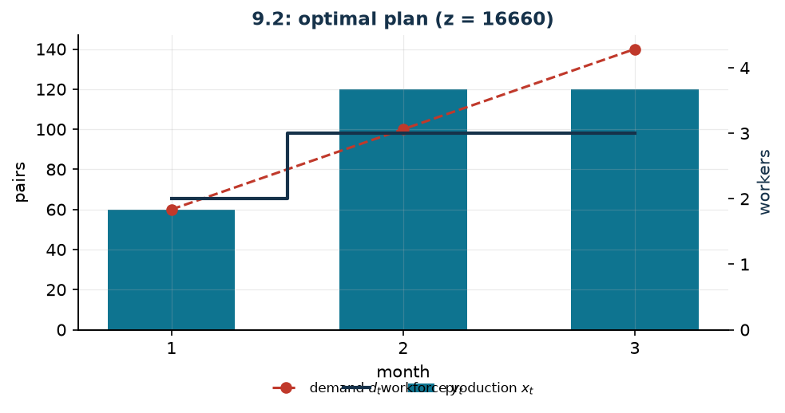

# Production and workforce: two equivalent formulations

**Class:** MILP · **Links:** integer counts, workforce balance · **Script:** `python/fam09_2_workforce.py`

[](https://colab.research.google.com/github/fabiofurini/mip-modelling/blob/main/notebooks/fam09_2_workforce.ipynb)

!!! abstract "Problem 9.2"
    A shoe factory must plan its production over $n \in \mathbb{Z}_{\ge 1}$
    months. For every month $t \in \{1, 2, \dots, n\}$, the value
    $d_t \in \mathbb{Z}_{\ge 0}$ is the demand in pairs and
    $p_t \in \mathbb{Q}_{>0}$ the cost of the raw materials for one pair. For
    every month $t \in \{1, 2, \dots, n-1\}$, the value
    $h_t \in \mathbb{Q}_{\ge 0}$ is the cost of keeping one pair in stock at the
    end of the month. At the start of the horizon the company has
    $m_0 \in \mathbb{Z}_{\ge 0}$ workers; every worker works
    $r \in \mathbb{Q}_{>0}$ hours a month and costs $w \in \mathbb{Q}_{>0}$ euros
    a month, and producing one pair requires $g \in \mathbb{Q}_{>0}$ labour hours.
    At the start of every month workers may be hired, at a cost of
    $u \in \mathbb{Q}_{\ge 0}$ euros each; nobody is laid off. The company wants
    to decide how much to produce and how many workers to employ in every month,
    at minimum total cost.

**The problem in words.** We *decide* how much to produce, how much to keep in
stock and how many workers to hire. *The objective*: minimum total cost (raw
materials, storage, wages and hirings). *The constraints*: the demand must be
met exactly; the production of a month cannot require more hours than the
workers on duty can do.

## Two formulations

The same decision can be written in two ways, and it is worth putting them side
by side: it is the first case in the course where two apparently different
models describe the same set of plans.

**Formulation A: the hirings.** The staffing variables are

$$
z_t = \text{workers hired at the start of month } t, \qquad \forall t \in \{1, \dots, n\},
$$

integer and non-negative. A worker hired in month $t$ stays until the end of the
horizon, so he or she costs $u$ once plus $w$ for each of the remaining
$n - t + 1$ months. The wages of the $m_0$ initial workers, $m_0\, w\, n$, are a
constant term: it is left out of the model and added to the final value.

**Formulation B: the headcount.** The staffing variables are

$$
y_t = \text{workers on duty in month } t, \qquad \forall t \in \{1, \dots, n\},
$$

integer and non-negative, with $y_t \ge y_{t-1}$ because nobody is laid off. The
cost is $w\, y_t$ every month, plus $u$ for every hiring, that is
$u\,(y_n - m_0)$ in total, because the hirings are the increments of the
headcount and the telescoping sum leaves only the endpoints.

## Model

**Variables.** $x_t \in \mathbb{Z}_{\ge 0}$ pairs produced in month $t$;
$s_t \in \mathbb{Z}_{\ge 0}$ stock at the end of month $t$ (for $t \le n-1$);
$y_t \in \mathbb{Z}_{\ge 0}$ workers on duty in month $t$;
$z_t \in \mathbb{Z}_{\ge 0}$ workers hired at the start of month $t$.

**Model 9.2A — with the hirings.**

$$
\begin{aligned}
\min ~~ & \sum_{t=1}^{n} p_t\, x_t + \sum_{t=1}^{n-1} h_t\, s_t
       + \sum_{t=1}^{n} \bigl(u + w\,(n - t + 1)\bigr) z_t\\
\text{s.t.} \quad & x_1 - s_1 = d_1,\\
& x_t + s_{t-1} - s_t = d_t, && \forall t \in \{2, \dots, n-1\},\\
& x_n + s_{n-1} = d_n,\\
& -g\, x_t + r \sum_{j=1}^{t} z_j \ge -r\, m_0, && \forall t \in \{1, \dots, n\},\\
& x_t \in \mathbb{Z}_{\ge 0},\quad s_t \in \mathbb{Z}_{\ge 0},\quad z_t \in \mathbb{Z}_{\ge 0}.
\end{aligned}
$$

**Model 9.2B — with the headcount.**

$$
\begin{aligned}
\min ~~ & \sum_{t=1}^{n} p_t\, x_t + \sum_{t=1}^{n-1} h_t\, s_t
       + \sum_{t=1}^{n} w\, y_t + u\,(y_n - m_0)\\
\text{s.t.} \quad & x_1 - s_1 = d_1,\\
& x_t + s_{t-1} - s_t = d_t, && \forall t \in \{2, \dots, n-1\},\\
& x_n + s_{n-1} = d_n,\\
& -g\, x_t + r\, y_t \ge 0, && \forall t \in \{1, \dots, n\},\\
& y_1 \ge m_0,\\
& -y_{t-1} + y_t \ge 0, && \forall t \in \{2, \dots, n\},\\
& x_t \in \mathbb{Z}_{\ge 0},\quad s_t \in \mathbb{Z}_{\ge 0},\quad y_t \in \mathbb{Z}_{\ge 0}.
\end{aligned}
$$

**Description.** The two formulations share the **stock balances**, one per
month: what is produced plus what is in stock covers the demand exactly. The
**hours** constraints, one per month, say that a month's production cannot
require more hours than the workers on duty can do. Formulation $B$ has in
addition the **initial headcount** constraint, which starts from the $m_0$
workers already employed, and the **monotonicity** constraints, one per month
from the second on, which forbid layoffs. In $A$ those same facts are hidden in
the domain of the $z_t$, which are non-negative.

!!! note "The two formulations describe the same problem"
    The correspondence is

    $$
    y_t = m_0 + \sum_{j=1}^{t} z_j, \qquad\text{that is}\qquad
    z_t = y_t - y_{t-1} \quad (\text{with } y_0 = m_0).
    $$

    *Feasibility.* With this substitution the hours constraint of $A$ becomes
    exactly that of $B$; the conditions $z_t \ge 0$ become $y_t \ge y_{t-1}$, and
    $y_1 \ge m_0$. The balances contain no staffing variables and stay
    identical: the correspondence is a bijection between the feasible plans of
    the two models.

    *Cost.* The staffing cost in $B$ equals

    $$
    \sum_{t=1}^{n} w\, y_t + u\,(y_n - m_0)
    = m_0\, w\, n + \sum_{t=1}^{n} \bigl(u + w\,(n - t + 1)\bigr) z_t ,
    $$

    because $z_j$ appears in every month from $j$ onwards, that is $n - j + 1$
    times. The two objective functions differ by the constant $m_0\, w\, n$
    alone, and the two models have the same optima.

!!! tip "Why keep both"
    Formulation $A$ has fewer constraints (no monotonicity) but cost
    coefficients that depend on the period; $B$ has uniform coefficients and
    extends better if layoffs are added (a second family $\ell_t \ge 0$ and the
    balance $y_t = y_{t-1} + z_t - \ell_t$ suffice). On the instance the
    *relaxations* coincide as well: $z(\mathit{LP}) = 15\,960$ for both. Two
    formulations equivalent over the integers are not always equivalent on the
    relaxation; here they are, and the check has to be made, not assumed.

## The model in gurobipy

```python
m = gp.Model("workforce_B")
x = m.addVars(n, vtype=GRB.INTEGER, name="x")
s = m.addVars(n - 1, vtype=GRB.INTEGER, name="s")
y = m.addVars(n, vtype=GRB.INTEGER, name="y")
m.setObjective(gp.quicksum(p[t] * x[t] for t in range(n))
               + gp.quicksum(h[t] * s[t] for t in range(n - 1))
               + gp.quicksum(w * y[t] for t in range(n)) + u * (y[n - 1] - m0), GRB.MINIMIZE)
m.addConstr(x[0] - s[0] == d[0], name="balance[0]")
m.addConstrs((x[t] + s[t - 1] - s[t] == d[t] for t in range(1, n - 1)), name="balance")
m.addConstr(x[n - 1] + s[n - 2] == d[n - 1], name=f"balance[{n - 1}]")
m.addConstrs((-g * x[t] + r * y[t] >= 0 for t in range(n)), name="hours")
m.addConstr(y[0] >= m0, name="initial_headcount")
m.addConstrs((-y[t - 1] + y[t] >= 0 for t in range(1, n)), name="no_layoffs")
```

## The instance

$n = 3$ months, $m_0 = 2$ workers, $w = 1500$, $u = 100$, $r = 160$ hours,
$g = 4$ hours per pair, $h_t = 3$.

| | $t=1$ | $t=2$ | $t=3$ |
|---|---:|---:|---:|
| $d_t$ | 60 | 100 | 140 |
| $p_t$ | 15 | 15 | 15 |

With two workers the initial capacity is $2 \cdot 160 / 4 = 80$ pairs a month:
enough for the first month, not for the other two.

## Constructive heuristic: the primal bound

Just-in-time production: every month one produces exactly the demand and hires
the minimum number of workers needed. It is a constructive heuristic: a single
solution is built, one element at a time, never backtracking.

- month 1: $\lceil 4 \cdot 60/160 \rceil = 2$ workers, no hiring;
- month 2: $\lceil 4 \cdot 100/160 \rceil = 3$ workers, one hiring;
- month 3: $\lceil 4 \cdot 140/160 \rceil = 4$ workers, another hiring.

The cost, including the constant term $m_0\, w\, n = 9000$, is
$z(\mathit{MILP}) \le \mathit{UB} = 18\,200$.

## LP relaxation and dual: the dual bound

On formulation $A$, with $\mu_t$ **free** on each balance and $\nu_t \ge 0$ on
each hours constraint:

$$
\begin{aligned}
\max ~~ & \sum_{t=1}^{n} d_t\, \mu_t - r\, m_0 \sum_{t=1}^{n} \nu_t\\
\text{s.t.} \quad & \mu_t - g\, \nu_t \le p_t, && \forall t \in \{1, \dots, n\},\\
& -\mu_t + \mu_{t+1} \le h_t, && \forall t \in \{1, \dots, n-1\},\\
& r \sum_{t=j}^{n} \nu_t \le u + w\,(n - j + 1), && \forall j \in \{1, \dots, n\},\\
& \mu_t \gtreqless 0, \quad \nu_t \ge 0.
\end{aligned}
$$

**Description.** $\mu_t$ is the value of one pair available in month $t$ and
$\nu_t$ the price of one working hour. The objective prices the demand at those
values and subtracts $r\, m_0 \sum_t \nu_t$, that is, the hours the two initial
workers supply for free. The first group of constraints are the columns of the
$x_t$: producing one pair is worth $\mu_t$ and consumes $g$ hours at price
$\nu_t$, and the balance cannot exceed the raw-material cost $p_t$. The second
are the columns of the $s_t$: holding one pair in stock earns
$\mu_{t+1} - \mu_t$, which cannot exceed $h_t$. The third are the columns of the
$z_j$: a worker hired in month $j$ supplies $r$ hours in each month from $j$
onwards, and their value cannot exceed what that hire costs.

**Recipe.** $\bar\nu_t = 0$: working hours are not priced, the hiring
constraints are satisfied because the right-hand side is positive, and
$\mu_t \le p_t$ and $\mu_{t+1} \le \mu_t + h_t$ remain. The largest feasible
value is built forwards,

$$\bar\mu_1 = p_1, \qquad \bar\mu_t = \min(\bar\mu_{t-1} + h_{t-1},\ p_t).$$

On the instance $\bar\mu = (15, 15, 15)$ and
$\sum_t d_t\, \bar\mu_t = 15 \cdot 300 = 4500$, to which the constant term
$9000$ must be added:

$$\mathit{LB} = 4500 + 9000 = 13\,500 .$$

It is the cost of the raw materials alone plus the wages of the workers already
on duty: the extra workforce is given away.

## Optimal solution

| | $t=1$ | $t=2$ | $t=3$ |
|---|---:|---:|---:|
| production $x_t$ | 60 | 120 | 120 |
| headcount $y_t$ | 2 | 3 | 3 |
| hirings $z_t$ | 0 | 1 | 0 |
| stock $s_t$ | 0 | 20 | — |

| $UB$ | $LB$ (dual) | $z(\mathit{LP})$ | $z(\mathit{LP}^+)$ | $z(\mathit{MILP})$ | gap |
|---:|---:|---:|---:|---:|---:|
| 18200 | 13500 | 15960 | 15960 | 16660 | $9.2\%$ |



The optimal plan hires **one** worker instead of two and moves twenty pairs from
the third month to the second: paying $3$ euros of storage for twenty pairs
costs $60$ euros against the $1600$ of a hiring in the third month.

## Additional considerations

- The monotonicity constraint is what makes the problem non-trivial: if one
  could lay off at no cost, formulation $B$ would split into $n$ independent
  problems, one per month.
- The variables $x_t$ and $s_t$ are declared integer because pairs of shoes do
  not split. Here they could be left continuous without changing the optimum
  (the data are integer and the balance matrix is totally unimodular), but the
  declaration that is correct from the modelling point of view is the integer
  one.
- The constant term $m_0\, w\, n$ must be remembered in every comparison:
  forgetting it makes formulation $A$ look far cheaper than $B$.

## Additional modelling questions

??? question "9.2.1 — Very expensive hirings"
    The hiring cost rises from $100$ to $3000$ euros (selection and training).
    How does the optimal plan change?

    !!! tip "Solution"
        The solution is in the solutions document, reserved for teachers.

??? question "9.2.2 — Overtime"
    Every worker may do up to $40$ hours of overtime a month, paid $25$ euros an
    hour. How does the model change? Is it worth using them?

    !!! tip "Solution"
        The solution is in the solutions document, reserved for teachers.

## Code

Complete script —
[`python/fam09_2_workforce.py`](https://github.com/fabiofurini/mip-modelling/blob/main/python/fam09_2_workforce.py)
(reproducible with `python3 python/fam09_2_workforce.py` from the `python/`
folder). Notebook —
[`notebooks/fam09_2_workforce.ipynb`](https://github.com/fabiofurini/mip-modelling/blob/main/notebooks/fam09_2_workforce.ipynb)
— which opens in Colab from the badge at the top of the page.

<!-- embedded-script: begin (regenerated by python/embed_code.py) -->

??? example "Show the complete script — `python/fam09_2_workforce.py` (213 lines)"

    ```python
    """Problem 9.2 -- Production and workforce: two equivalent formulations.

    The same decision written twice: with the *hirings* z_t (formulation A) or with
    the *workforce* y_t (formulation B). We prove that they have the same set of
    feasible plans and the same optimum, and we compare the relaxations. This is the
    theme of chapter 4: two formulations may be compared only after proving that they
    describe the same integer set.
    """
    import gurobipy as gp
    import pandas as pd
    from gurobipy import GRB

    from mip import (ammissibile, due_rilassamenti, frazione, nuovo_modello, registra_bound,
                     rilassamento, risolvi, valuta)
    from stile import ARANCIO, BLU, ROSSO, TEAL, intestazione, plt, salva_dati, salva_figura

    R = range

    # ---------- 1. MODEL AND INSTANCE ----------
    intestazione("9.2 Production and workforce: hirings (A) or workforce (B)")
    d2 = [60, 100, 140]        # demand of the three months (pairs)
    p2 = [15, 15, 15]          # production cost per pair
    h2 = [3, 3]                # storage cost at the end of the month
    w2, r2, g2, u2, m2, r0 = 1500, 160, 4, 100, 2, 0
    n2 = len(d2)
    salva_dati(pd.DataFrame({"month": R(1, n2 + 1), "demand": d2, "cost_pair": p2}), "prod2_dati")
    print(f"  {m2} workers at the start, {r2} h a month each, {g2} h per pair: the initial")
    print(f"  capacity is {m2 * r2 // g2} pairs a month. Wage {w2}, hiring {u2}.")


    def modello_A(d, p, h, w, r, g, u, m0, r0):
        """Formulation A: z_t = how many workers are hired at the start of month t."""
        n = len(d)
        mm = nuovo_modello("workforce_A")
        x = mm.addVars(n, vtype=GRB.INTEGER, name="x")
        s = mm.addVars(n - 1, vtype=GRB.INTEGER, name="s")
        z = mm.addVars(n, vtype=GRB.INTEGER, name="z")
        mm.setObjective(gp.quicksum(p[t] * x[t] for t in R(n))
                        + gp.quicksum(h[t] * s[t] for t in R(n - 1))
                        + gp.quicksum((u + w * (n - t)) * z[t] for t in R(n)), GRB.MINIMIZE)
        mm.addConstr(x[0] - s[0] == d[0] - r0, name="balance[0]")
        mm.addConstrs((x[t] + s[t - 1] - s[t] == d[t] for t in R(1, n - 1)), name="balance")
        mm.addConstr(x[n - 1] + s[n - 2] == d[n - 1], name=f"balance[{n - 1}]")
        mm.addConstrs((-g * x[t] + gp.quicksum(r * z[j] for j in R(t + 1)) >= -r * m0
                       for t in R(n)), name="hours")
        return mm, x, s, z


    def modello_B(d, p, h, w, r, g, u, m0, r0):
        """Formulation B: y_t = how many workers are employed in month t (workforce)."""
        n = len(d)
        mm = nuovo_modello("workforce_B")
        x = mm.addVars(n, vtype=GRB.INTEGER, name="x")
        s = mm.addVars(n - 1, vtype=GRB.INTEGER, name="s")
        y = mm.addVars(n, vtype=GRB.INTEGER, name="y")
        # the workforce pays the wage every month; the hirings are the increments y_t - y_{t-1}
        mm.setObjective(gp.quicksum(p[t] * x[t] for t in R(n))
                        + gp.quicksum(h[t] * s[t] for t in R(n - 1))
                        + gp.quicksum(w * y[t] for t in R(n))
                        + u * (y[n - 1] - m0), GRB.MINIMIZE)   # total hirings = y_n - m0
        mm.addConstr(x[0] - s[0] == d[0] - r0, name="balance[0]")
        mm.addConstrs((x[t] + s[t - 1] - s[t] == d[t] for t in R(1, n - 1)), name="balance")
        mm.addConstr(x[n - 1] + s[n - 2] == d[n - 1], name=f"balance[{n - 1}]")
        mm.addConstrs((-g * x[t] + r * y[t] >= 0 for t in R(n)), name="hours")
        mm.addConstr(y[0] >= m0, name="initial_workforce")
        mm.addConstrs((-y[t - 1] + y[t] >= 0 for t in R(1, n)), name="no_layoffs")
        return mm, x, s, y


    def duale_A(d, p, h, w, r, g, u, m0, r0):
        """max sum_t b_t mu_t - r m0 sum_t nu_t;  mu_t - g nu_t <= p_t;
        -mu_t + mu_{t+1} <= h_t;  r sum_{t >= j} nu_t <= u + w (n - j);  mu free, nu >= 0."""
        n = len(d)
        b = [d[0] - r0] + d[1:n - 1] + [d[n - 1]]
        dl = nuovo_modello("dual_workforce")
        mu = dl.addVars(n, lb=-GRB.INFINITY, name="mu")
        nu = dl.addVars(n, name="nu")
        dl.setObjective(gp.quicksum(b[t] * mu[t] for t in R(n))
                        - r * m0 * gp.quicksum(nu[t] for t in R(n)), GRB.MAXIMIZE)
        dl.addConstrs((mu[t] - g * nu[t] <= p[t] for t in R(n)), name="rc_x")
        dl.addConstrs((-mu[t] + mu[t + 1] <= h[t] for t in R(n - 1)), name="rc_s")
        dl.addConstrs((r * gp.quicksum(nu[t] for t in R(j, n)) <= u + w * (n - j) for j in R(n)),
                      name="rc_z")
        return dl


    mA, xA, sA, zA = modello_A(d2, p2, h2, w2, r2, g2, u2, m2, r0)
    mB, xB, sB, yB = modello_B(d2, p2, h2, w2, r2, g2, u2, m2, r0)
    costante_A = m2 * w2 * n2          # the wage of the initial workers, outside model A
    zA_val = risolvi(mA) + costante_A
    zB_val = risolvi(mB)
    print(f"  Formulation A (hirings):   z = {frazione(zA_val)} "
          f"(of which {costante_A} of wages of the initial workers, a constant term)")
    print(f"  Formulation B (workforce): z = {frazione(zB_val)}")
    assert abs(zA_val - zB_val) < 1e-6, (zA_val, zB_val)
    print("  The two optima coincide: the two formulations describe the same problem.")
    print("  Plan A: production " + ", ".join(frazione(xA[t].X) for t in R(n2))
          + "; hirings " + ", ".join(frazione(zA[t].X) for t in R(n2)))
    print("  Plan B: production " + ", ".join(frazione(xB[t].X) for t in R(n2))
          + "; workforce " + ", ".join(frazione(yB[t].X) for t in R(n2)))

    # ---------- 2. THE EQUIVALENCE, VERIFIED ----------
    intestazione("9.2 The equivalence between the two formulations, verified")
    print("  The correspondence is y_t = m0 + sum_{j <= t} z_j, that is z_t = y_t - y_{t-1}")
    print("  (with y_0 = m0). On the optimal plans:")
    yA = [m2 + sum(round(zA[j].X) for j in R(t + 1)) for t in R(n2)]
    print("    from A: implied workforce = " + ", ".join(str(v) for v in yA))
    print("    from B: workforce         = " + ", ".join(str(round(yB[t].X)) for t in R(n2)))
    zB_implicite = [round(yB[0].X) - m2] + [round(yB[t].X) - round(yB[t - 1].X) for t in R(1, n2)]
    print("    from B: implied hirings   = " + ", ".join(str(v) for v in zB_implicite))
    assert sum(v * (u2 + w2 * (n2 - t)) for t, v in enumerate(zB_implicite)) + costante_A \
        == sum(round(zA[t].X) * (u2 + w2 * (n2 - t)) for t in R(n2)) + costante_A
    print("  The staff cost is the same: A charges every hiring once for all the months that")
    print("  remain, B charges the workforce month by month. Same total, counted two ways.")

    # ---------- 3. CONSTRUCTIVE HEURISTIC (UPPER BOUND) ----------
    intestazione("9.2 Heuristic, dual and bounds")
    # constructive heuristic: produce the demand of the month, and hire only when the hours are not enough
    organico, assunzioni, prod = m2, [0] * n2, []
    for t in R(n2):
        prod.append(d2[t])
        servono = -(-g2 * d2[t] // r2)               # ceil
        if organico < servono:
            assunzioni[t] = servono - organico
            organico = servono
        print(f"  Month {t + 1}: {d2[t]} pairs are produced, "
              f"ceil({g2} * {d2[t]} / {r2}) = {servono} workers are needed; workforce "
              f"{organico - assunzioni[t]} -> {assunzioni[t]} are hired")
    ub2 = sum(p2[t] * prod[t] for t in R(n2)) \
        + sum(assunzioni[t] * (u2 + w2 * (n2 - t)) for t in R(n2)) + costante_A
    sol_eur = {f"x[{t}]": prod[t] for t in R(n2)} | {f"z[{t}]": assunzioni[t] for t in R(n2)} \
        | {f"s[{t}]": 0 for t in R(n2 - 1)}
    assert ammissibile(mA, sol_eur)
    print(f"  Cost of the heuristic: ub = {frazione(ub2)}")

    # ---------- 4. DUAL AND LOWER BOUND ----------
    dl2 = duale_A(d2, p2, h2, w2, r2, g2, u2, m2, r0)
    # recipe: nu = 0 (the hours are not charged) and mu_t = cheapest way to have a pair
    # available in month t
    mu = []
    for t in R(n2):
        mu.append(p2[t] if t == 0 else min(mu[t - 1] + h2[t - 1], p2[t]))
    mano = {f"mu[{t}]": mu[t] for t in R(n2)}
    lb2_var, viol = valuta(dl2, mano)
    assert viol <= 1e-9, viol
    lb2 = lb2_var + costante_A
    print("  Hand-built dual: nu = 0 (working hours are not charged) and")
    print("  mu_t = min(mu_{t-1} + h, p_t)")
    print(f"    mu = " + ", ".join(frazione(v) for v in mu)
          + f"  ->  lb = {frazione(lb2_var)} + {costante_A} = {frazione(lb2)}")
    zlp2, zlp2r, _ = due_rilassamenti(mA, dl2)
    zlp2, zlp2r = zlp2 + costante_A, zlp2r + costante_A
    riga = registra_bound("2 workforce", ub2, lb2, zlp2, zlp2r, zA_val)
    salva_dati(pd.DataFrame([riga]), "prod2_bound")
    assert lb2 <= zlp2 <= zA_val <= ub2 + 1e-9

    # ---------- 5. COMPARING THE RELAXATIONS OF THE TWO FORMULATIONS ----------
    zlpA, _, _ = rilassamento(mA, rafforzato=True)
    zlpB, _, _ = rilassamento(mB, rafforzato=True)
    print(f"  Relaxations: A -> {frazione(zlpA + costante_A)}   B -> {frazione(zlpB)}   "
          f"z(MILP) = {frazione(zA_val)}")
    salva_dati(pd.DataFrame([{"formulation": "A (hirings)", "z_lp": zlpA + costante_A,
                              "z_milp": zA_val},
                             {"formulation": "B (workforce)", "z_lp": zlpB, "z_milp": zB_val}]),
               "prod2_formulazioni")

    # ---------- 6. ADDITIONAL MODELLING QUESTIONS ----------
    varianti = {}


    def variante(nome, m, costante=0.0):
        z = risolvi(m) + costante
        print(f"  {nome:70s} z = {frazione(z)}")
        return z


    # 2a: hiring costs much more (3000 instead of 100)
    m, x, s, y = modello_B(d2, p2, h2, w2, r2, g2, 3000, m2, r0)
    varianti["2a"] = variante("2a. A hiring costs 3000 euros instead of 100", m)
    print("     workforce: " + ", ".join(str(round(y[t].X)) for t in R(n2))
          + ";  production: " + ", ".join(str(round(x[t].X)) for t in R(n2)))
    # 2b: overtime, up to 40 extra hours per worker a month, at 25 euros an hour
    m, x, s, y = modello_B(d2, p2, h2, w2, r2, g2, u2, m2, r0)
    o = m.addVars(n2, name="o")
    m.update()
    for t in R(n2):
        m.chgCoeff(m.getConstrByName(f"hours[{t}]"), o[t], 1.0)   # the available hours grow
    m.addConstrs((o[t] <= 40 * y[t] for t in R(n2)), name="max_overtime")
    m.setObjective(m.getObjective() + gp.quicksum(25 * o[t] for t in R(n2)), GRB.MINIMIZE)
    varianti["2b"] = variante("2b. Overtime: up to 40 h per worker, 25 euros an hour", m)
    print("     overtime used: " + ", ".join(frazione(o[t].X) for t in R(n2))
          + "  (none: producing early and storing costs less)")
    salva_dati(pd.DataFrame({"variant": list(varianti), "z": list(varianti.values())}),
               "prod2_varianti")

    # ---------- 7. FIGURE ----------
    fig, ax = plt.subplots(figsize=(7.0, 3.2))
    mesi = list(R(1, n2 + 1))
    ax.bar(mesi, [xB[t].X for t in R(n2)], color=TEAL, width=0.55, label="production $x_t$")
    ax.plot(mesi, d2, "o--", color=ROSSO, label="demand $d_t$")
    ax2 = ax.twinx()
    ax2.step(mesi, [yB[t].X for t in R(n2)], where="mid", color=BLU, lw=2, label="workforce $y_t$")
    ax2.set_ylabel("workers", color=BLU)
    ax2.set_ylim(0, max(yB[t].X for t in R(n2)) + 1.5)
    ax2.grid(False)
    ax.set_xticks(mesi)
    ax.set_xlabel("month")
    ax.set_ylabel("pairs")
    ax.set_title(f"9.2: optimal plan (z = {frazione(zB_val)})")
    ax.legend(fontsize=8, loc="upper left")
    ax2.legend(fontsize=8, loc="lower right")
    salva_figura(fig, "cap09_manodopera_ottimo")
    print("Done.")
    ```

<!-- embedded-script: end -->
