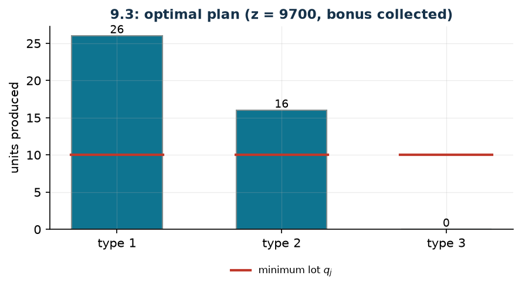

# Vehicles: minimum lot and a bonus for variety

**Class:** MILP · **Links:** minimum lot (semicontinuous), counting the types, if and only if · **Script:** `python/fam09_3_vehicles.py`

[](https://colab.research.google.com/github/fabiofurini/mip-modelling/blob/main/notebooks/fam09_3_vehicles.ipynb)

!!! abstract "Problem 9.3"
    A company produces $s \in \mathbb{Z}_{\ge 1}$ types of vehicle using
    $k \in \mathbb{Z}_{\ge 1}$ resources. For every resource
    $i \in \{1, \dots, k\}$ and every type $j \in \{1, \dots, s\}$, the value
    $a_{ij} \in \mathbb{Q}_{\ge 0}$ is the amount of resource $i$ needed for one
    unit of type $j$, and $b_i \in \mathbb{Q}_{>0}$ is the availability of
    resource $i$. For every type $j$, the value $\bar p_j \in \mathbb{Q}_{>0}$ is
    the profit of one unit and $\bar q_j \in \mathbb{Z}_{\ge 1}$ the minimum
    quantity to be produced if that type is chosen. If the production includes at
    least two different types, the company collects a bonus
    $\bar r \in \mathbb{Q}_{>0}$ (a grant for diversification). The company wants
    to maximise the total profit.

**The problem in words.** We *decide* how many units of each type to produce.
*The objective*: maximum profit, bonus included. *The constraints*: the
resources are not exceeded; and of a type one produces either zero units or at
least $\bar q_j$.

## Model

**Variables.** $x_j \in \mathbb{Z}_{\ge 0}$ units produced of type $j$;
$y_j \in \{0,1\}$ equals $1$ if type $j$ is produced; $z \in \{0,1\}$ equals $1$
if the bonus is collected. The datum
$M_j = \min_i \lfloor b_i / a_{ij} \rfloor$ is the maximum producible of type
$j$ alone.

$$
\begin{aligned}
\max ~~ & \sum_{j=1}^{s} \bar p_j\, x_j + \bar r\, z\\
\text{s.t.} \quad & \sum_{j=1}^{s} a_{ij}\, x_j \le b_i, && \forall i \in \{1, \dots, k\},\\
& x_j - \bar q_j\, y_j \ge 0, && \forall j \in \{1, \dots, s\},\\
& x_j - M_j\, y_j \le 0, && \forall j \in \{1, \dots, s\},\\
& -\sum_{j=1}^{s} y_j + 2\, z \le 0,\\
& x_j \in \mathbb{Z}_{\ge 0}, \quad y_j \in \{0,1\}, \quad z \in \{0,1\}.
\end{aligned}
$$

**Description.** The objective adds up the profits of the vehicles produced and
the bonus for variety. The **resource** constraints, one per resource, are the
availabilities. The **minimum lot** and **activation** constraints, one per type
each, make $x_j$ semicontinuous: either zero, or at least $\bar q_j$ and at most
$M_j$. The **bonus** constraint, a single one, says that the bonus is collected
only if at least two types are active.

!!! note "The link between the variables: semicontinuity"
    The two constraints together say

    $$\bar q_j\, y_j \;\le\; x_j \;\le\; M_j\, y_j .$$

    If $y_j = 0$ both give $x_j = 0$; if $y_j = 1$ one gets
    $\bar q_j \le x_j \le M_j$. Neither is enough on its own: without the
    activation a type could be produced with $y_j = 0$; without the minimum lot
    the threshold would be vacuous.

    | $y_j$ | what the two constraints impose | $x_j$ |
    |---|---|---|
    | $0$ | $0 \le x_j \le 0$ | $x_j = 0$ |
    | $1$ | $\bar q_j \le x_j \le M_j$ | lot allowed |

!!! note "The bonus is collected only with at least two types"
    The constraint reads $2 z \le \sum_{j=1}^{s} y_j$. If $z = 1$ then
    $\sum_j y_j \ge 2$: at least two types are activated and, by semicontinuity,
    actually produced. The converse — if two types are active then $z = 1$ — is
    imposed by no constraint, but follows from **optimality**: setting $z = 1$
    stays feasible and increases the objective by $\bar r > 0$. With
    $\bar r = 0$ the argument breaks down and $z$ stops being a faithful
    indicator (question 9.3.2).

## The model in gurobipy

```python
mm = gp.Model("vehicles")
x = mm.addVars(n, vtype=GRB.INTEGER, name="x")
y = mm.addVars(n, vtype=GRB.BINARY, name="y")
z = mm.addVar(vtype=GRB.BINARY, name="z")
mm.setObjective(gp.quicksum(p[j] * x[j] for j in range(n)) + r * z, GRB.MAXIMIZE)
mm.addConstrs((gp.quicksum(a[i][j] * x[j] for j in range(n)) <= b[i]
               for i in range(m)), name="resource")
mm.addConstrs((x[j] - q[j] * y[j] >= 0 for j in range(n)), name="minimum_lot")
mm.addConstrs((x[j] - M[j] * y[j] <= 0 for j in range(n)), name="activate")
mm.addConstr(-gp.quicksum(y[j] for j in range(n)) + 2 * z <= 0, name="bonus")
```

## The instance

$s = 3$ types, $k = 2$ resources (steel in tonnes and labour hours),
$\bar q_j = 10$ for every type, $\bar r = 500$.

| $a_{ij}$ | $j=1$ | $j=2$ | $j=3$ | | $b_i$ |
|---|---:|---:|---:|---|---:|
| $i=1$ (steel) | 2 | 3 | 5 | | 100 |
| $i=2$ (hours) | 30 | 25 | 40 | | 1200 |

| | $j=1$ | $j=2$ | $j=3$ |
|---|---:|---:|---:|
| $\bar p_j$ | 200 | 250 | 300 |
| $\bar q_j$ | 10 | 10 | 10 |
| $M_j$ | 40 | 33 | 20 |

The big-Ms are computed from the data:
$M_1 = \min(\lfloor 100/2 \rfloor, \lfloor 1200/30 \rfloor) = 40$, and likewise
$M_2 = 33$, $M_3 = 20$.

## Constructive heuristic: the primal bound

The problem is a maximisation, so the heuristic gives the **primal** bound,
which sits below the optimum. The types are sorted by profit relative to the
consumption of the tightest resource, the two best ones are activated at their
minimum lot (so the bonus is guaranteed) and then one fills up with the most
profitable among those activated.

On the instance types $2$ and $1$ are activated at their minimum lot, then one
fills up: the production is $(11, 26, 0)$, the steel runs out and $220$ hours
are left. The profit is $8700$ plus the bonus of $500$:

$$z(\mathrm{MILP}) \ge \mathit{LB} = 9200 .$$

## LP relaxation and dual: the dual bound

The primal is a maximisation with $\le$ and $\ge$ constraints: following the
conversion table, one associates $\pi_i \ge 0$ with the resources,
$\ell_j \ge 0$ with the minimum lot (written as $-\lambda_j$), $\beta_j \ge 0$
with the activation and $\gamma \ge 0$ with the bonus.

$$
\begin{aligned}
\min ~~ & \sum_{i=1}^{k} b_i\, \pi_i\\
\text{s.t.} \quad & \sum_{i=1}^{k} a_{ij}\, \pi_i - \ell_j + \beta_j \ge \bar p_j, && \forall j \in \{1, \dots, s\},\\
& \bar q_j\, \ell_j - M_j\, \beta_j - \gamma \ge 0, && \forall j \in \{1, \dots, s\},\\
& 2\, \gamma \ge \bar r,\\
& \pi_i \ge 0, \quad \ell_j \ge 0, \quad \beta_j \ge 0, \quad \gamma \ge 0.
\end{aligned}
$$

**Description.** $\pi_i$ is the price of one unit of resource $i$; $\ell_j$ and
$\beta_j$ are the prices of the two semicontinuity constraints of type $j$, and
$\gamma$ that of the bonus. The objective prices all the available resources.
The first group are the columns of the $x_j$: the resources one unit of type $j$
consumes, corrected by the two semicontinuity constraints, must cover the profit
$\bar p_j$. The second are the columns of the $y_j$: switching on type $j$
forces at least $\bar q_j$ units and allows at most $M_j$, and the balance must
cover the bonus $\gamma$. The last is the column of $z$: the bonus is collected
only with two active types, and indeed it has to be covered by $2\gamma$.

**Recipe, in three steps.**

1. The constraint on $z$ forces $\gamma \ge \bar r/2$: take the minimum,
   $\bar\gamma = 250$.
2. Set $\bar\beta_j = 0$ and read off the smallest feasible $\ell_j$,
   $\bar\ell_j = \bar\gamma / \bar q_j = 25$ for every $j$: every activated type
   "carries" its own share of the bonus.
3. What remains is $\sum_i a_{ij}\, \pi_i \ge \bar p_j + \bar\ell_j$. Price
   *one* resource only, at the price that covers all the types, and keep the one
   that gives the smaller bound.

$$
\bar\pi_1 = \max\Bigl(\tfrac{225}{2}, \tfrac{275}{3}, \tfrac{325}{5}\Bigr) = \tfrac{225}{2},
\qquad b_1\, \bar\pi_1 = 11\,250 ,
$$

$$
\bar\pi_2 = \max\Bigl(\tfrac{225}{30}, \tfrac{275}{25}, \tfrac{325}{40}\Bigr) = 11,
\qquad b_2\, \bar\pi_2 = 13\,200 .
$$

The better bound is the one from the steel:
$z(\mathrm{MILP}) \le \mathit{UB} = 11\,250$.

## Optimal solution

The optimal production is $(26, 16, 0)$: types $1$ and $2$ are activated, the
bonus is collected, all $100$ tonnes of steel and $1180$ of the $1200$ available
hours are used.

| $LB$ (heuristic) | $z(\mathrm{MILP})$ | $z(\mathrm{LP}^+)$ | $z(\mathrm{LP})$ | $UB$ (dual) | gap |
|---:|---:|---:|---:|---:|---:|
| 9200 | 9700 | 9750 | $20625/2$ | 11250 | $5.2\%$ |



!!! tip "Here the relaxation with the bounds beats the hand-built dual"
    This is the only problem in the chapter where $z(\mathrm{LP}^+) = 9750$ is
    *better* than the hand-built dual bound ($11\,250$), and barely worse than
    the optimum ($9700$). The reason is that the relaxation without the bounds
    lets $y_j$ and $z$ grow above $1$, and with them the bonus:
    $z(\mathrm{LP}) = 20625/2 \approx 10\,312$. Adding $y_j \le 1$ and $z \le 1$
    removes exactly that freedom. When a model contains rewarded indicators, the
    relaxation with the bounds is not a detail.

## Additional considerations

- The big-M $M_j$ is the maximum producible of type $j$ *alone*, not of the
  whole plan: it is already far tighter than an arbitrary constant.
- If for some type one had $\bar q_j > M_j$, that type would be impossible to
  produce and could be removed from the model by a check on the data.
- The bonus is modelled with *one* binary and *one* constraint. With a different
  threshold (at least $f$ types) it is enough to replace the coefficient $2$ by
  $f$; with several tiered bonuses one would need a variable per tier and a
  chain of constraints, as in the [piecewise functions](links-14.md).

## Additional modelling questions

??? question "9.3.1 — A more demanding bonus"
    The bonus is collected only if at least *three* different types are
    produced. How does the model change? What is the new optimum?

    !!! tip "Solution"
        The solution is in the solutions document, reserved for teachers.

??? question "9.3.2 — Zero bonus"
    The diversification grant is abolished, that is $\bar r = 0$. What happens to
    the variable $z$?

    !!! tip "Solution"
        The solution is in the solutions document, reserved for teachers.

## Code

Complete script —
[`python/fam09_3_vehicles.py`](https://github.com/fabiofurini/mip-modelling/blob/main/python/fam09_3_vehicles.py)
(reproducible with `python3 python/fam09_3_vehicles.py` from the `python/`
folder). Notebook —
[`notebooks/fam09_3_vehicles.ipynb`](https://github.com/fabiofurini/mip-modelling/blob/main/notebooks/fam09_3_vehicles.ipynb)
— which opens in Colab from the badge at the top of the page.

<!-- embedded-script: begin (regenerated by python/embed_code.py) -->

??? example "Show the complete script — `python/fam09_3_vehicles.py` (191 lines)"

    ```python
    """Problem 9.3 -- Vehicles: minimum lot and a bonus for variety.

    Three techniques together: the semicontinuous variable of the minimum lot (3.3),
    the count of the active types (3.11) and a bonus paid "if and only if" at least
    two types are produced (3.10). The bonus is collected only if the count reaches
    two: the missing direction follows from optimality, because the bonus is positive.
    """
    import gurobipy as gp
    import pandas as pd
    from gurobipy import GRB

    from mip import (ammissibile, due_rilassamenti, frazione, nuovo_modello, registra_bound,
                     risolvi, valuta)
    from stile import ARANCIO, BLU, ROSSO, TEAL, VERDE, intestazione, plt, salva_dati, salva_figura

    R = range

    # ---------- 1. MODEL AND INSTANCE ----------
    intestazione("9.3 Vehicles: minimum lot per type and a bonus for at least two types")
    a3 = [[2, 3, 5],        # steel (tons) per unit of the three types
          [30, 25, 40]]     # labour hours per unit
    b3 = [100, 1200]        # steel and hours available
    p3 = [200, 250, 300]    # profit per unit
    q3 = [10, 10, 10]       # minimum quantity if the type is produced
    r3 = 500                # bonus if at least two types are produced
    n3, m3 = 3, 2
    # the smallest valid big-M per type: how many units the resources allow at most
    M3 = [min(b3[i] // a3[i][j] for i in R(m3)) for j in R(n3)]
    salva_dati(pd.DataFrame({"type": R(1, n3 + 1), "steel": a3[0], "hours": a3[1],
                             "profit": p3, "minimum": q3, "M": M3}), "veic3_dati")
    print(f"  Resources: {b3[0]} t of steel, {b3[1]} hours. Big-M per type (from the data "
          f"alone): {M3}")


    def modello_3(a, b, p, q, r):
        n, m = len(p), len(b)
        M = [min(b[i] // a[i][j] for i in R(m)) for j in R(n)]
        mm = nuovo_modello("vehicles")
        x = mm.addVars(n, vtype=GRB.INTEGER, name="x")     # units produced
        y = mm.addVars(n, vtype=GRB.BINARY, name="y")      # type activated
        z = mm.addVar(vtype=GRB.BINARY, name="z")          # bonus for variety
        mm.setObjective(gp.quicksum(p[j] * x[j] for j in R(n)) + r * z, GRB.MAXIMIZE)
        mm.addConstrs((gp.quicksum(a[i][j] * x[j] for j in R(n)) <= b[i] for i in R(m)),
                      name="resource")
        mm.addConstrs((x[j] - q[j] * y[j] >= 0 for j in R(n)), name="minimum_lot")
        mm.addConstrs((x[j] - M[j] * y[j] <= 0 for j in R(n)), name="activate")
        mm.addConstr(-gp.quicksum(y[j] for j in R(n)) + 2 * z <= 0, name="bonus")
        return mm, x, y, z


    def duale_3(a, b, p, q, r):
        """min sum_i b_i pi_i;  sum_i a_ij pi_i - alpha_j + beta_j >= p_j;
        q_j alpha_j - M_j beta_j + gamma >= 0;  -2 gamma >= r;  pi, alpha, beta >= 0, gamma <= 0.
        (written with the signs of the conversion table for a maximisation primal)"""
        n, m = len(p), len(b)
        M = [min(b[i] // a[i][j] for i in R(m)) for j in R(n)]
        dl = nuovo_modello("dual_vehicles")
        pi = dl.addVars(m, name="pi")                                   # resources (<= in a max)
        alpha = dl.addVars(n, lb=-GRB.INFINITY, ub=0.0, name="alpha")   # minimum lot (>= in a max)
        beta = dl.addVars(n, name="beta")                               # activation (<=)
        gamma = dl.addVar(name="gamma")                                 # bonus (<=)
        dl.setObjective(gp.quicksum(b[i] * pi[i] for i in R(m)), GRB.MINIMIZE)
        dl.addConstrs((gp.quicksum(a[i][j] * pi[i] for i in R(m)) + alpha[j] + beta[j] >= p[j]
                       for j in R(n)), name="rc_x")
        dl.addConstrs((-q[j] * alpha[j] - M[j] * beta[j] - gamma >= 0 for j in R(n)), name="rc_y")
        dl.addConstr(2 * gamma >= r, name="rc_z")
        return dl


    m3m, x3, y3, z3 = modello_3(a3, b3, p3, q3, r3)

    # ---------- 2. CONSTRUCTIVE HEURISTIC (LOWER BOUND: IT IS A MAXIMISATION) ----------
    # constructive heuristic: two types are activated (to collect the bonus) starting from the highest
    # profit per unit of the scarcest resource, then one fills up with the best type
    def euristica(a, b, p, q, r):
        n, m = len(p), len(b)
        # profit / consumption ratio of the tightest resource
        ordine = sorted(R(n), key=lambda j: -p[j] / max(a[i][j] / b[i] for i in R(m)))
        x = [0] * n
        res = list(b)
        attivi = []
        for j in ordine:                       # first the minimum lot of the two best types
            if len(attivi) < 2 and all(res[i] >= a[i][j] * q[j] for i in R(m)):
                x[j] = q[j]
                for i in R(m):
                    res[i] -= a[i][j] * q[j]
                attivi.append(j)
        for j in ordine:                       # then fill up with the most profitable type
            if x[j] == 0:
                continue
            extra = min(res[i] // a[i][j] for i in R(m))
            x[j] += extra
            for i in R(m):
                res[i] -= a[i][j] * extra
        return x, attivi, res


    x_eur, attivi, res = euristica(a3, b3, p3, q3, r3)
    lb3 = sum(p3[j] * x_eur[j] for j in R(n3)) + (r3 if len(attivi) >= 2 else 0)
    sol_eur = {f"x[{j}]": x_eur[j] for j in R(n3)} \
        | {f"y[{j}]": 1 if x_eur[j] > 0 else 0 for j in R(n3)} | {"z": 1 if len(attivi) >= 2 else 0}
    assert ammissibile(m3m, sol_eur)
    print(f"  Heuristic: types {[j + 1 for j in attivi]} are activated at their minimum lot, then")
    print(f"  one fills up with the most profitable one; production {x_eur}, resources left {res}")
    print(f"  lb = {sum(p3[j] * x_eur[j] for j in R(n3))} + {r3} of bonus = {frazione(lb3)}")

    # ---------- 3. LP RELAXATION AND DUAL (UPPER BOUND) ----------
    dl3 = duale_3(a3, b3, p3, q3, r3)
    # recipe: gamma = r/2 (the smallest value allowed by 2 gamma >= r), beta = 0, and
    # lambda_j = gamma / q_j (every activated type "carries" its share of the bonus); then
    # a single resource is priced so that it covers all types, and the better bound is kept
    gamma = r3 / 2
    lam = [gamma / q3[j] for j in R(n3)]
    bound = {}
    for i in R(m3):
        prezzo = max((p3[j] + lam[j]) / a3[i][j] for j in R(n3))
        bound[i] = b3[i] * prezzo
    critica = min(bound, key=bound.get)
    prezzo = max((p3[j] + lam[j]) / a3[critica][j] for j in R(n3))
    mano = {"gamma": gamma} | {f"pi[{i}]": 0.0 for i in R(m3)} \
        | {f"alpha[{j}]": -lam[j] for j in R(n3)} | {f"beta[{j}]": 0.0 for j in R(n3)}
    mano[f"pi[{critica}]"] = prezzo
    ub3, viol = valuta(dl3, mano)
    assert viol <= 1e-9, (viol, mano)
    print(f"  Hand-built dual: gamma = r/2 = {frazione(gamma)} (the smallest value satisfying")
    print(f"  2 gamma >= r), beta = 0 and lambda_j = gamma / q_j = "
          + ", ".join(frazione(v) for v in lam))
    print("  so every activated type carries its share of the bonus. Then a single resource is")
    print("  priced at max_j (p_j + lambda_j) / a_ij, and the tighter bound is kept:")
    for i in R(m3):
        print(f"    resource {i + 1}: price "
              f"{frazione(max((p3[j] + lam[j]) / a3[i][j] for j in R(n3)))}"
              f"  ->  b_i * price = {frazione(bound[i])}")
    print(f"  The smallest is resource {critica + 1}:  ub = {frazione(ub3)}")
    zlp3, zlp3r, _ = due_rilassamenti(m3m, dl3)

    # ---------- 4. OPTIMUM OF THE MILP ----------
    z3v = risolvi(m3m)
    print("  Optimal solution: production " + ", ".join(str(round(x3[j].X)) for j in R(n3))
          + f"; active types {[j + 1 for j in R(n3) if y3[j].X > 0.5]}; bonus collected: "
          + ("yes" if z3.X > 0.5 else "no"))
    print("  Resources used: " + ", ".join(
        f"{frazione(sum(a3[i][j] * round(x3[j].X) for j in R(n3)))} out of {b3[i]}" for i in R(m3)))
    riga = registra_bound("3 vehicles", ub3, lb3, zlp3, zlp3r, z3v, senso="max")
    salva_dati(pd.DataFrame([riga]), "veic3_bound")
    assert lb3 <= z3v <= zlp3 + 1e-6 <= ub3 + 1e-6

    # ---------- 5. ADDITIONAL MODELLING QUESTIONS ----------
    varianti = {}


    def variante(nome, m):
        z = risolvi(m)
        print(f"  {nome:70s} z = {frazione(z)}")
        return z


    # 3a: the bonus requires at least three different types
    m, x, y, z = modello_3(a3, b3, p3, q3, r3)
    m.update()
    m.remove([c for c in m.getConstrs() if c.ConstrName == "bonus"])
    m.addConstr(-gp.quicksum(y[j] for j in R(n3)) + 3 * z <= 0, name="bonus3")
    varianti["3a"] = variante("3a. The bonus is paid only with at least three types", m)
    # 3b: the bonus is zero -- what happens to the "if and only if" link?
    m, x, y, z = modello_3(a3, b3, p3, q3, 0)
    zz = risolvi(m)
    print(f"  {'3b. The bonus is 0: z is no longer a faithful indicator':70s} z = {frazione(zz)}")
    print(f"      active types {[j + 1 for j in R(n3) if y[j].X > 0.5]}, but z = {round(z.X)}: with")
    print("      a zero bonus the optimum has no reason to raise z, and the constraint alone")
    print("      does not force it. Making it a faithful indicator needs the other direction too.")
    varianti["3b"] = zz
    salva_dati(pd.DataFrame({"variant": list(varianti), "z": list(varianti.values())}),
               "veic3_varianti")

    # ---------- 6. FIGURE ----------
    fig, ax = plt.subplots(figsize=(6.8, 3.0))
    tipi = list(R(1, n3 + 1))
    colori = [TEAL if y3[j].X > 0.5 else "#F4F6F7" for j in R(n3)]
    ax.bar(tipi, [x3[j].X for j in R(n3)], color=colori, edgecolor="#7F8C8D", width=0.55)
    for j in R(n3):
        ax.plot([j + 0.72, j + 1.28], [q3[j], q3[j]], color=ROSSO, lw=2)
    ax.plot([], [], color=ROSSO, lw=2, label="minimum lot $q_j$")
    for j in R(n3):
        ax.annotate(str(round(x3[j].X)), (j + 1, x3[j].X), ha="center", va="bottom", fontsize=9)
    ax.set_xticks(tipi)
    ax.set_xticklabels([f"type {j}" for j in tipi])
    ax.set_ylabel("units produced")
    ax.set_title(f"9.3: optimal plan (z = {frazione(z3v)}, bonus collected)")
    ax.legend(fontsize=8)
    salva_figura(fig, "cap09_veicoli_ottimo")
    print("Done.")
    ```

<!-- embedded-script: end -->
