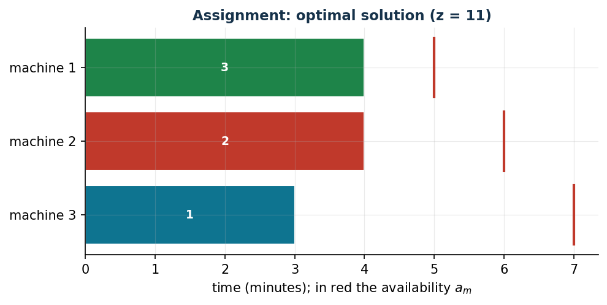

# Minimum-cost assignment with availability

**Class:** BIP · **Links:** none — a single family of variables · **Script:** `python/fam07_1_assignment.py`

[](https://colab.research.google.com/github/fabiofurini/mip-modelling/blob/main/notebooks/fam07_1_assignment.ipynb)

!!! abstract "Problem 7.1"
    A company has to process $n \in \mathbb{Z}_{\ge 1}$ jobs on $k \in \mathbb{Z}_{\ge 1}$
    machines. For each job $j \in \{1, 2, \dots, n\}$ and each machine
    $m \in \{1, 2, \dots, k\}$, the value $t_{jm} \in \mathbb{Q}_{>0}$ is the processing time
    in minutes and the value $c_{jm} \in \mathbb{Q}_{>0}$ is the cost in euros of
    processing job $j$ on machine $m$. For each machine
    $m \in \{1, 2, \dots, k\}$, the value $a_m \in \mathbb{Q}_{>0}$ is the available
    processing time in minutes. Each machine processes one job at a time.
    The company wants to assign all jobs to the machines at minimum cost.

**The problem in words.** *We decide* on which machine each job is processed.
*The objective*: minimum total cost. *The constraints*: every job is processed
by exactly one machine; the total time of the jobs assigned to a machine does
not exceed its availability. It is the **generalised assignment** problem: an
assignment with a knapsack constraint per machine.

## Model

**Data (input of the model).**

| Symbol | Type | Meaning |
|---|---|---|
| $n$ | $\in \mathbb{Z}_{\ge 1}$ | number of jobs, $j \in \{1, 2, \dots, n\}$ |
| $k$ | $\in \mathbb{Z}_{\ge 1}$ | number of machines, $m \in \{1, 2, \dots, k\}$ |
| $t_{jm}$ | $\in \mathbb{Q}_{>0}$ | processing time of job $j$ on machine $m$ |
| $c_{jm}$ | $\in \mathbb{Q}_{>0}$ | cost of processing job $j$ on machine $m$ |
| $a_m$ | $\in \mathbb{Q}_{>0}$ | availability of machine $m$ |

**Decision variables.** We introduce the following $n\,k$ binary variables:

$$
x_{jm} = \begin{cases} 1 & \text{if job } j \text{ is processed by machine } m,\\ 0 & \text{otherwise,}\end{cases}
\qquad \forall j \in \{1, 2, \dots, n\},\ \forall m \in \{1, 2, \dots, k\}.
$$

Using these variables, a BIP model for the problem reads as follows:

$$
\begin{aligned}
\min ~~ \sum_{j=1}^{n} \sum_{m=1}^{k} c_{jm}\, x_{jm} & & \\
\text{subject to} \quad \sum_{m=1}^{k} x_{jm} &= 1, & \forall j \in \{1, 2, \dots, n\}, \\
\sum_{j=1}^{n} t_{jm}\, x_{jm} &\le a_m, & \forall m \in \{1, 2, \dots, k\}, \\
x_{jm} &\in \{0, 1\}, & \forall j \in \{1, 2, \dots, n\},\ \forall m \in \{1, 2, \dots, k\}.
\end{aligned}
$$

Description of the objective function and constraints:

- the linear objective function minimises the total processing cost, the sum
  of the costs of the chosen assignments;
- the **assignment** constraints ensure that each job is assigned to exactly
  one machine, so that all jobs are processed ($n$ linear constraints);
- the **availability** constraints guarantee that the total processing time
  of the jobs assigned to each machine does not exceed its availability ($k$
  linear constraints);
- the domain constraints define the variables of the model.

The model has a single family of variables: there are no links to prove. The
availability constraints are of the "capacity/resource" kind: two quantities
of the same nature (minutes required and minutes available) compared, no
logical implication. The model can be solved to optimality, for example, by the
branch-and-bound algorithm.

## The model in gurobipy

Every family of constraints is one `addConstrs` named after its label.

```python
m = gp.Model("assignment");  m.Params.OutputFlag = 0
x = m.addVars(n, k, vtype=GRB.BINARY, name="x")
m.setObjective(gp.quicksum(c[j][mm] * x[j, mm] for j in range(n)
                           for mm in range(k)), GRB.MINIMIZE)
m.addConstrs((x.sum(j, "*") == 1 for j in range(n)), name="assign")
m.addConstrs((gp.quicksum(t[j][mm] * x[j, mm] for j in range(n)) <= a[mm]
              for mm in range(k)), name="availability")
m.optimize()
```

## The instance

$n = 3$ jobs, $k = 3$ machines:

| $t_{jm}$ | $m=1$ | $m=2$ | $m=3$ |
|---|---:|---:|---:|
| $j=1$ | 2 | 1 | 3 |
| $j=2$ | 3 | 4 | 2 |
| $j=3$ | 4 | 5 | 3 |

| $c_{jm}$ | $m=1$ | $m=2$ | $m=3$ |
|---|---:|---:|---:|
| $j=1$ | 5 | 10 | 2 |
| $j=2$ | 5 | 4 | 6 |
| $j=3$ | 5 | 4 | 6 |

| | $m=1$ | $m=2$ | $m=3$ |
|---|---:|---:|---:|
| $a_m$ | 5 | 6 | 7 |

The model for the instance:

$$
\begin{array}{r r@{\;}r@{\;}r@{\;}r@{\;}r@{\;}r@{\;}r@{\;}r@{\;}r c r}
\min & 5x_{11} & +10x_{12} & +2x_{13} & +5x_{21} & +4x_{22} & +6x_{23} & +5x_{31} & +4x_{32} & +6x_{33} & & \\
\text{subject to} & x_{11} & +x_{12} & +x_{13} & & & & & & & = & 1,\\
 & & & & x_{21} & +x_{22} & +x_{23} & & & & = & 1,\\
 & & & & & & & x_{31} & +x_{32} & +x_{33} & = & 1,\\
 & 2x_{11} & & & +3x_{21} & & & +4x_{31} & & & \le & 5,\\
 & & x_{12} & & & +4x_{22} & & & +5x_{32} & & \le & 6,\\
 & & & 3x_{13} & & & +2x_{23} & & & +3x_{33} & \le & 7,\\
 & x_{11}, & x_{12}, & x_{13}, & x_{21}, & x_{22}, & x_{23}, & x_{31}, & x_{32}, & x_{33} & \in & \{0,1\}.
\end{array}
$$

## Constructive heuristic: the primal bound

Three heuristics inspired by bin packing. **Next-fit**: one machine is loaded
at a time and the next one is opened when a job no longer fits. **First-fit**:
each job goes on the first machine with enough residual availability.
**Best-fit**: among the machines with enough availability, the one with
minimum cost is chosen.

```text
BestFit(n, k, t, c, a):
  x[j][m] <- 0 for every j, m;   ra[m] <- a[m] for every m      # residual availabilities
  for j = 1..n:
      sm <- 0;  mc <- +inf                                       # selected machine, minimum cost
      for m = 1..k:
          if t[j][m] <= ra[m] and c[j][m] < mc:  sm <- m;  mc <- c[j][m]
      if sm = 0:  return "no solution found"
      x[j][sm] <- 1;  ra[sm] <- ra[sm] - t[j][sm]
  return x
```

Run on the instance (output of the script):

- **Step 1.** Job 1: $ra = (5, 6, 7)$; every machine is enough; costs
  $5, 10, 2$: the minimum is machine 3, hence $x[1][3] = 1$ and $ra[3] = 7 - 3 = 4$.
- **Step 2.** Job 2: $ra = (5, 6, 4)$; costs $5, 4, 6$: the minimum is
  machine 2, hence $x[2][2] = 1$ and $ra[2] = 6 - 4 = 2$.
- **Step 3.** Job 3: $ra = (5, 2, 4)$; machine 2 is not enough ($5 > 2$);
  among the others, costs $5$ and $6$: the minimum is machine 1, hence
  $x[3][1] = 1$ and $ra[1] = 5 - 4 = 1$.

Solution $\bar x_{13} = \bar x_{22} = \bar x_{31} = 1$, value $2 + 4 + 5 = 11$:
$\mathit{UB} = 11$, i.e.\ $z(\mathit{MILP}) \le 11$. Next-fit and first-fit both
find $x_{11} = x_{21} = x_{32} = 1$, of value $14$.

## LP relaxation and dual: the dual bound

The LP relaxation replaces $x_{jm} \in \{0,1\}$ with $x_{jm} \ge 0$ (the
constraint $x_{jm} \le 1$ is implied by the assignment constraints). With a
free dual variable $\mu_j$ for each assignment constraint and a non-positive
$\pi_m$ for each availability constraint ($\le$ in a minimisation), the dual is:

$$
\begin{aligned}
\max ~~ \sum_{j=1}^{n} \mu_j + \sum_{m=1}^{k} a_m\, \pi_m & & \\
\text{subject to} \quad \mu_j + t_{jm}\, \pi_m &\le c_{jm}, & \forall j \in \{1, 2, \dots, n\},\ \forall m \in \{1, 2, \dots, k\}, \\
\mu_j &\gtreqless 0, & \forall j \in \{1, 2, \dots, n\}, \\
\pi_m &\le 0, & \forall m \in \{1, 2, \dots, k\}.
\end{aligned}
$$

**A hand-built dual solution.** With $\bar\pi_m = 0$, the constraints become
$\mu_j \le c_{jm}$ for every $m$: the largest feasible value is

$$
\bar\mu_1 = \min\{5, 10, 2\} = 2,\qquad \bar\mu_2 = \min\{5, 4, 6\} = 4,\qquad \bar\mu_3 = \min\{5, 4, 6\} = 4,
$$

with value $10$. By weak duality

$$
10 ~\le~ z(\mathit{LP}) ~\le~ z(\mathit{MILP}) ~\le~ 11.
$$

The recipe has a meaning: "every job costs at least its minimum cost" is a
lower bound anyone would write down; the dual formalises it and says how to
improve it, with $\pi_m < 0$ where the availability is tight.

**What the solver says.** $z(\mathit{LP}) = 53/5 = 10.6$ (equal to the optimum
of the dual: strong duality), with duals $\tilde\mu = (2,\ 4.8,\ 5)$ and
$\tilde\pi = (0,\ -0.2,\ 0)$: machine 2 is the tight resource. The integer
optimum is $z(\mathit{MILP}) = 11$ with $\tilde x_{13} = \tilde x_{22} = \tilde x_{31} = 1$:
the best-fit heuristic had found the optimum, but only the solver certifies it
— the dual bound stopped at $10$ (and since the costs are integer,
$\lceil 53/5 \rceil = 11$ closes the gap).

| $UB$ (best-fit) | $LB$ (hand dual) | $z(\mathit{LP})$ | $z(\mathit{MILP})$ | heuristic gap |
|---:|---:|---:|---:|---:|
| 11 | 10 | $53/5$ | 11 | $0.0\%$ |



## Additional considerations

- $x_{jm} \le 1$ ($n\,k$ inequalities) are valid but implied by the
  assignment constraints: they do not strengthen the relaxation (indeed
  $z(\mathit{LP}) = z(\mathit{LP}^+)$).
- If a job $j$ does not fit on a machine $m$ ($t_{jm} > a_m$), $x_{jm}$ can be
  fixed to zero before solving: the model is smaller and the relaxation does
  not get worse.

## Additional modelling questions

??? question "7.1.1 — Jobs 1 and 3 on the same machine"
    Jobs 1 and 3 use the same tool and must be processed by the same machine.
    How does the model change? What is the new optimum for the instance?

    !!! tip "Solution"
        The solution is in the solutions document, reserved for instructors.
??? question "7.1.2 — Fixed cost per used machine"
    Every machine that processes at least one job costs an extra $g_m = 3$
    euros to switch on. Model the fixed cost and find the new optimum. Which
    link comes into play?

    !!! tip "Solution"
        The solution is in the solutions document, reserved for instructors.
## Code

The complete script of the problem — data, model, heuristics, dual,
solution, variants and figures — is
[`python/fam07_1_assignment.py`](https://github.com/fabiofurini/mip-modelling/blob/main/python/fam07_1_assignment.py)
(reproducible with `python3 python/fam07_1_assignment.py` from the `python/`
folder). The same code is also available as a notebook —
[`notebooks/fam07_1_assignment.ipynb`](https://github.com/fabiofurini/mip-modelling/blob/main/notebooks/fam07_1_assignment.ipynb)
— which opens in Colab from the badge at the top of the page.

<!-- embedded-script: begin (regenerated by python/embed_code.py) -->

??? example "Show the complete script — `python/fam07_1_assignment.py` (141 lines)"

    ```python
    """Problem 7.1 -- Minimum-cost assignment with availability (GAP).

    A BIP model with a single family of variables: no link to prove, only an
    assignment constraint and a per-machine capacity constraint. Next/first/
    best-fit heuristics for the upper bound, dual of the LP relaxation with a
    hand-built solution for the lower bound.
    """
    import gurobipy as gp
    import numpy as np
    import pandas as pd
    from gurobipy import GRB

    from euristiche import best_fit, first_fit, matrice, next_fit
    from mip import (ammissibile, due_rilassamenti, frazione, nuovo_modello,
                     registra_bound, risolvi, stampa_soluzione, valuta)
    from stile import CICLO, ROSSO, intestazione, plt, salva_dati, salva_figura

    R = range

    # ---------- 1. MODEL AND INSTANCE ----------
    intestazione("1. Minimum-cost assignment: n jobs, k machines, availability a_m")
    t1 = [[2, 1, 3], [3, 4, 2], [4, 5, 3]]
    c1 = [[5, 10, 2], [5, 4, 6], [5, 4, 6]]
    a1 = [5, 6, 7]
    n, k = 3, 3
    salva_dati(pd.DataFrame([{"job": j + 1, "machine": m + 1, "t": t1[j][m], "c": c1[j][m]}
                             for j in R(n) for m in R(k)]), "sched1_lavori")
    salva_dati(pd.DataFrame({"machine": R(1, k + 1), "a": a1}), "sched1_macchine")


    def modello_1(t, c, a):
        n, k = len(t), len(a)
        m = nuovo_modello("assegnamento")
        x = m.addVars(n, k, vtype=GRB.BINARY, name="x")
        m.setObjective(gp.quicksum(c[j][mm] * x[j, mm] for j in R(n) for mm in R(k)), GRB.MINIMIZE)
        m.addConstrs((x.sum(j, "*") == 1 for j in R(n)), name="assegna")
        m.addConstrs((gp.quicksum(t[j][mm] * x[j, mm] for j in R(n)) <= a[mm] for mm in R(k)),
                     name="disponibilita")
        return m, x


    def duale_1(t, c, a):
        """Dual of the LP relaxation: max sum mu_j + sum a_m pi_m, mu_j + t_jm pi_m <= c_jm, pi <= 0."""
        n, k = len(t), len(a)
        d = nuovo_modello("duale_assegnamento")
        mu = d.addVars(n, lb=-GRB.INFINITY, name="mu")
        pi = d.addVars(k, lb=-GRB.INFINITY, ub=0.0, name="pi")
        d.setObjective(mu.sum() + gp.quicksum(a[mm] * pi[mm] for mm in R(k)), GRB.MAXIMIZE)
        d.addConstrs((mu[j] + t[j][mm] * pi[mm] <= c[j][mm] for j in R(n) for mm in R(k)), name="rc")
        return d


    def valore_1(e, c):
        return sum(c[j][mm] for (j, mm) in e.x)


    m1, x1 = modello_1(t1, c1, a1)

    # ---------- 2. CONSTRUCTIVE HEURISTIC (UPPER BOUND) ----------
    print("Constructive heuristics:")
    e_next = next_fit(t1, a1)
    e_first = first_fit(t1, a1)
    e_best = best_fit(t1, a1, lambda j, mm, ra: c1[j][mm], "cost")
    for nome, e in [("next-fit", e_next), ("first-fit", e_first), ("best-fit (minimum cost)", e_best)]:
        print(f"  {nome:26s} ub = {valore_1(e, c1)}   assignment "
              + ", ".join(f"x[{j + 1}][{mm + 1}]" for (j, mm) in sorted(e.x)))
    print("Step-by-step run of the best-fit:")
    e_best.traccia.stampa()
    ub1 = valore_1(e_best, c1)
    sol_eur = {f"x[{j},{mm}]": 1 for (j, mm) in e_best.x}
    assert ammissibile(m1, sol_eur)

    # ---------- 3. LP RELAXATION AND DUAL (LOWER BOUND) ----------
    d1 = duale_1(t1, c1, a1)
    mano = {f"mu[{j}]": min(c1[j]) for j in R(n)}
    lb1, viol = valuta(d1, mano)
    assert viol <= 1e-9, viol
    print(f"Hand-built dual solution: pi = 0, mu_j = min_m c_jm = "
          + ", ".join(frazione(mano[f"mu[{j}]"]) for j in R(n)) + f"  ->  lb = {frazione(lb1)}")
    zlp1, zlp1r, pi_lp = due_rilassamenti(m1, d1)
    print("Duals of the relaxation read from Gurobi:", {kk: round(v, 4) for kk, v in pi_lp.items()})

    # ---------- 4. OPTIMAL SOLUTION OF THE MILP ----------
    z1 = risolvi(m1)
    print("Optimal solution of the MILP:")
    stampa_soluzione(m1, solo_non_nulle=True)
    riga = registra_bound("1 assignment", ub1, lb1, zlp1, zlp1r, z1)
    salva_dati(pd.DataFrame([riga]), "sched1_bound")
    ott1 = {(j, mm) for j in R(n) for mm in R(k) if x1[j, mm].X > 0.5}

    # ---------- 5. ADDITIONAL MODELLING QUESTIONS ----------


    varianti = {}


    def variante(nome, m):
        z = risolvi(m)
        print(f"  {nome:70s} z = {frazione(z)}")
        return z

    # 1a: jobs 1 and 3 must be on the same machine
    m, x = modello_1(t1, c1, a1)
    m.addConstrs((x[0, mm] == x[2, mm] for mm in R(3)), name="together")
    varianti["1a"] = variante("1a. Jobs 1 and 3 on the same machine (x_1m = x_3m)", m)
    # 1b: fixed cost g_m per used machine (activation)
    g1 = [3, 3, 3]
    m, x = modello_1(t1, c1, a1)
    y = m.addVars(3, vtype=GRB.BINARY, name="y")
    m.addConstrs((x[j, mm] <= y[mm] for j in R(3) for mm in R(3)), name="activate")
    m.update()
    m.setObjective(m.getObjective() + gp.quicksum(g1[mm] * y[mm] for mm in R(3)), GRB.MINIMIZE)
    varianti["1b"] = variante("1b. Fixed cost g_m = 3 per used machine (x_jm <= y_m)", m)
    salva_dati(pd.DataFrame({"variant": list(varianti), "z": list(varianti.values())}), "sched1_varianti")

    # ---------- 6. FIGURES ----------


    def barre_macchine(assegn, t, a, titolo, nome):
        """Every machine: bar of the times of the assigned jobs and availability."""
        k = len(a)
        fig, ax = plt.subplots(figsize=(7.2, 3.2))
        for mm in R(k):
            inizio = 0
            for (j, m2) in sorted(assegn):
                if m2 == mm:
                    ax.barh(mm, t[j][mm], left=inizio, color=CICLO[j % len(CICLO)], edgecolor="white")
                    ax.text(inizio + t[j][mm] / 2, mm, f"{j + 1}", ha="center", va="center", color="white",
                            fontsize=9, fontweight="bold")
                    inizio += t[j][mm]
            ax.plot([a[mm], a[mm]], [mm - 0.4, mm + 0.4], color=ROSSO, lw=2)
        ax.set_yticks(R(k))
        ax.set_yticklabels([f"machine {mm + 1}" for mm in R(k)])
        ax.set_xlabel("time (minutes); in red the availability $a_m$")
        ax.set_title(titolo)
        ax.invert_yaxis()
        salva_figura(fig, nome)

    barre_macchine(e_best.x, t1, a1, "Assignment: best-fit solution (ub = 11)", "cap07_gap_euristica")
    barre_macchine(ott1, t1, a1, f"Assignment: optimal solution (z = {frazione(z1)})", "cap07_gap_ottimo")
    print("Done.")
    ```

<!-- embedded-script: end -->
