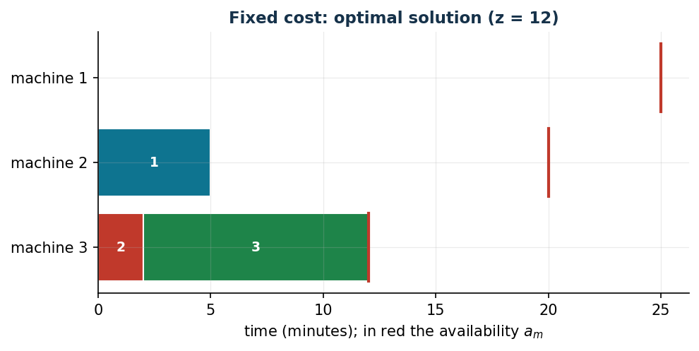

# Machines with a fixed usage cost

**Class:** BIP · **Links:** activation (aggregated) · **Script:** `python/fam07_2_fixedcost.py`

[](https://colab.research.google.com/github/fabiofurini/mip-modelling/blob/main/notebooks/fam07_2_fixedcost.ipynb)

!!! abstract "Problem 7.2"
    A company needs to process $n \in \mathbb{Z}_{\ge 1}$ jobs and has
    $k \in \mathbb{Z}_{\ge 1}$ machines. For each job $j \in \{1, 2, \dots, n\}$ and
    each machine $m \in \{1, 2, \dots, k\}$, the value $t_{jm} \in \mathbb{Q}_{>0}$ is
    the processing time in minutes. For each machine $m$, the value
    $a_m \in \mathbb{Q}_{>0}$ is the availability in minutes and the value
    $c_m \in \mathbb{Q}_{>0}$ is the cost in euros if the machine is used. Each
    machine processes one job at a time. The company wants to assign all jobs
    minimising the cost of the machines used.

**The problem in words.** *We decide* which machines to switch on and on which
machine each job is processed. *The objective*: total cost of the machines
switched on. *The constraints*: every job on exactly one machine; a machine
switched off processes no job; a machine switched on does not exceed its
availability. Compared with [problem 7.1](scheduling-1.md) the cost is no
longer on the assignments but on the machines: **activation** variables are
needed.

## Model

**Data (input of the model).**

| Symbol | Type | Meaning |
|---|---|---|
| $n$ | $\in \mathbb{Z}_{\ge 1}$ | number of jobs, $j \in \{1, 2, \dots, n\}$ |
| $k$ | $\in \mathbb{Z}_{\ge 1}$ | number of machines, $m \in \{1, 2, \dots, k\}$ |
| $t_{jm}$ | $\in \mathbb{Q}_{>0}$ | processing time of job $j$ on machine $m$ |
| $a_m$ | $\in \mathbb{Q}_{>0}$ | availability of machine $m$ |
| $c_m$ | $\in \mathbb{Q}_{>0}$ | fixed cost if machine $m$ is used |

**Decision variables.** We introduce the following $n\,k + k$ binary variables:

$$
\begin{cases}
x_{jm} = 1 \text{ if job } j \text{ is processed by machine } m,\ 0 \text{ otherwise},\\
y_m = 1 \text{ if machine } m \text{ is used},\ 0 \text{ otherwise},
\end{cases}
\qquad \forall j \in \{1, 2, \dots, n\},\ \forall m \in \{1, 2, \dots, k\}.
$$

$$
\begin{aligned}
\min ~~ \sum_{m=1}^{k} c_m\, y_m & & \\
\text{subject to} \quad \sum_{m=1}^{k} x_{jm} &= 1, & \forall j \in \{1, 2, \dots, n\}, \\
-\sum_{j=1}^{n} t_{jm}\, x_{jm} + a_m\, y_m &\ge 0, & \forall m \in \{1, 2, \dots, k\}, \\
x_{jm} &\in \{0, 1\}, & \forall j \in \{1, 2, \dots, n\},\ \forall m \in \{1, 2, \dots, k\}, \\
y_m &\in \{0, 1\}, & \forall m \in \{1, 2, \dots, k\}.
\end{aligned}
$$

- the objective minimises the total cost of the machines used;
- the **assignment** constraints ensure that each job is assigned to exactly
  one machine ($n$ linear constraints);
- the **link** constraints connect assignments and usage and impose the
  capacity restrictions: if at least one job is assigned to a machine then
  the machine is used, no job is assigned to an unused machine and, if the
  machine is used, the total processing time does not exceed its availability
  ($k$ linear constraints);
- the domain constraints define the variables.

!!! note "Link between the variables"
    **Imposed by the constraint.** For each machine $m$, if the total
    processing time of the jobs assigned to it is positive, the machine must
    be used:

    $$\sum_{j=1}^{n} t_{jm} x_{jm} > 0 ~\Longrightarrow~ y_m = 1,
    \qquad\text{contrapositive:}\qquad y_m = 0 ~\Longrightarrow~ \sum_{j=1}^{n} t_{jm} x_{jm} = 0.$$

    The link constraint gives $\sum_j t_{jm} x_{jm} \le a_m y_m$: if the
    left-hand side is positive then $a_m y_m > 0$, hence $y_m > 0$ and, being
    binary, $y_m = 1$. Conversely, if $y_m = 0$ then $\sum_j t_{jm} x_{jm} \le 0$
    and, with $t_{jm} > 0$ and $x_{jm} \ge 0$, all the $x_{jm}$ are zero.

    **Imposed by the optimum.** Conversely, if the total processing time is
    zero the machine is not used: $\sum_j t_{jm} x_{jm} = 0 \Longrightarrow y_m = 0$
    (contrapositive: $y_m = 1 \Longrightarrow$ at least one job assigned).
    This is *not* imposed by the constraints ($y_m = 1$ with no jobs is
    feasible), but it follows from the objective in every optimum: since
    $c_m > 0$, if $y_m = 1$ with no jobs, setting $y_m = 0$ keeps the
    constraints ($0 \ge 0$) and reduces the cost by $c_m$.

## The model in gurobipy

```python
m = gp.Model("fixed_cost");  m.Params.OutputFlag = 0
x = m.addVars(n, k, vtype=GRB.BINARY, name="x")
y = m.addVars(k, vtype=GRB.BINARY, name="y")
m.setObjective(gp.quicksum(c[mm] * y[mm] for mm in range(k)), GRB.MINIMIZE)
m.addConstrs((x.sum(j, "*") == 1 for j in range(n)), name="assign")
m.addConstrs((-gp.quicksum(t[j][mm] * x[j, mm] for j in range(n))
              + a[mm] * y[mm] >= 0 for mm in range(k)), name="link")
m.optimize()
```

## The instance

$n = 3$ jobs, $k = 3$ machines:

| $t_{jm}$ | $m=1$ | $m=2$ | $m=3$ |
|---|---:|---:|---:|
| $j=1$ | 6 | 5 | 3 |
| $j=2$ | 5 | 10 | 2 |
| $j=3$ | 20 | 13 | 10 |

| | $m=1$ | $m=2$ | $m=3$ |
|---|---:|---:|---:|
| $c_m$ | 8 | 7 | 5 |
| $a_m$ | 25 | 20 | 12 |

The model for the instance: objective $\min\ 8y_1 + 7y_2 + 5y_3$; three
assignment constraints; the three link constraints
$-6x_{11} - 5x_{21} - 20x_{31} + 25y_1 \ge 0$,
$-5x_{12} - 10x_{22} - 13x_{32} + 20y_2 \ge 0$,
$-3x_{13} - 2x_{23} - 10x_{33} + 12y_3 \ge 0$.

## Constructive heuristic: the primal bound

The best-fit criterion becomes the **minimum time** (there are no assignment
costs: it pays to consume little availability).

- **Step 1.** Job 1: $ra = (25, 20, 12)$; times $6, 5, 3$: minimum on
  machine 3, $x[1][3] = 1$, $ra[3] = 9$.
- **Step 2.** Job 2: times $5, 10, 2$: minimum on machine 3, $x[2][3] = 1$,
  $ra[3] = 7$.
- **Step 3.** Job 3: machine 3 is not enough ($10 > 7$); between $20$ and
  $13$ the minimum is machine 2, $x[3][2] = 1$, $ra[2] = 7$.

Machines used: 2 and 3: $\bar y = (0, 1, 1)$, value $12$, hence
$z(\mathit{MILP}) \le 12$. Next-fit, first-fit and the "opened machines first"
variants use machines 1 and 2 (value $15$).

## LP relaxation and dual: the dual bound

With $\mu_j$ free (assignment) and $\pi_m \ge 0$ (link, $\ge$ in a
minimisation):

$$
\begin{aligned}
\max ~~ \sum_{j=1}^{n} \mu_j & & \\
\text{subject to} \quad \mu_j - t_{jm}\, \pi_m &\le 0, & \forall j,\ \forall m, \\
a_m\, \pi_m &\le c_m, & \forall m \in \{1, 2, \dots, k\}, \\
\mu_j \gtreqless 0,\quad \pi_m &\ge 0. &
\end{aligned}
$$

**A hand-built dual solution.** $\bar\pi_m = c_m / a_m$ (the cost per minute
of each machine): $\tfrac{8}{25}, \tfrac{7}{20}, \tfrac{5}{12}$; then
$\bar\mu_j = \min_m t_{jm}\bar\pi_m$:
$\bar\mu_1 = \min\{\tfrac{48}{25}, \tfrac{7}{4}, \tfrac{5}{4}\} = \tfrac{5}{4}$,
$\bar\mu_2 = \min\{\tfrac{8}{5}, \tfrac{7}{2}, \tfrac{5}{6}\} = \tfrac{5}{6}$,
$\bar\mu_3 = \min\{\tfrac{32}{5}, \tfrac{91}{20}, \tfrac{25}{6}\} = \tfrac{25}{6}$.
Value $\tfrac{25}{4}$:

$$\tfrac{25}{4} ~\le~ z(\mathit{MILP}) ~\le~ 12.$$

A weak bound: the fixed cost of a machine is paid in full as soon as it is
used, but the relaxation spreads it over the minutes.

**What the solver says.** $z(\mathit{LP}) = 25/4$: the hand-built solution is
optimal for the dual. With $y_m \le 1$ and $x_{jm} \le 1$ the strengthened
relaxation is $z(\mathit{LP}^+) = 1273/200 = 6.365$; with the disaggregated
links $x_{jm} \le y_m$ it rises to $440/67 = 6.567$. Integer optimum $12$:
machines 2 and 3 on, $\tilde x_{12} = \tilde x_{23} = \tilde x_{33} = 1$.

| $UB$ | $LB$ (hand dual) | $z(\mathit{LP})$ | $z(\mathit{LP}^+)$ | $z(\mathit{MILP})$ | heuristic gap |
|---:|---:|---:|---:|---:|---:|
| 12 | $25/4$ | $25/4$ | $1273/200$ | 12 | $0.0\%$ |



## Additional considerations

- $y_m \le 1$ and $x_{jm} \le 1$ are valid; the former strengthen the
  relaxation ($6.25 \to 6.365$).
- "If at least one job is assigned to $m$ then $m$ is used" is
  $(x_{1m} \,\mathtt{OR}\, \dots \,\mathtt{OR}\, x_{nm}) \Rightarrow y_m$; De Morgan
  and distributivity give the CNF $(\mathtt{NOT}\,x_{1m} \,\mathtt{OR}\, y_m) \,\mathtt{AND}\, \dots$,
  i.e.\ the **disaggregated** constraints $x_{jm} \le y_m$: implied by the
  model, but not by the relaxation — added, they bring $z(\mathit{LP}^+)$ to
  $440/67$. Same set of integer solutions, tighter relaxation.
- The opposite direction, $\sum_j x_{jm} \ge y_m$, is not valid but can be
  added without losing the optimum.

## Additional modelling questions

??? question "7.2.1 — Minimum usage of a machine switched on"
    Every machine used must work at least $\ell = 8$ minutes. Model and find
    the new optimum.

    !!! tip "Solution"
        The solution is in the solutions document, reserved for instructors.
??? question "7.2.2 — Link between two activations"
    If machine 1 is used, machine 3 must be used too. Write the constraint
    and discuss what it imposes and what it does not.

    !!! tip "Solution"
        The solution is in the solutions document, reserved for instructors.
## Code

Full script: [`python/fam07_2_fixedcost.py`](https://github.com/fabiofurini/mip-modelling/blob/main/python/fam07_2_fixedcost.py);
notebook: [`notebooks/fam07_2_fixedcost.ipynb`](https://github.com/fabiofurini/mip-modelling/blob/main/notebooks/fam07_2_fixedcost.ipynb).

<!-- embedded-script: begin (regenerated by python/embed_code.py) -->

??? example "Show the complete script — `python/fam07_2_fixedcost.py` (147 lines)"

    ```python
    """Problem 7.2 -- Machines with a fixed usage cost.

    The activation variables y_m are born here: the link with the assignment
    variables x_jm is proved in both directions (one imposed by the constraint,
    the other by the optimum). Comparison between aggregated and disaggregated
    relaxation.
    """
    import gurobipy as gp
    import numpy as np
    import pandas as pd
    from gurobipy import GRB

    from euristiche import best_fit, first_fit, matrice, next_fit
    from mip import (ammissibile, due_rilassamenti, frazione, nuovo_modello,
                     registra_bound, rilassamento, risolvi, stampa_soluzione, valuta)
    from stile import CICLO, ROSSO, intestazione, plt, salva_dati, salva_figura

    R = range

    # ---------- 1. MODEL AND INSTANCE ----------
    intestazione("2. Fixed cost per used machine: activation variables y_m")
    t2 = [[6, 5, 3], [5, 10, 2], [20, 13, 10]]
    c2 = [8, 7, 5]
    a2 = [25, 20, 12]
    salva_dati(pd.DataFrame([{"job": j + 1, "machine": m + 1, "t": t2[j][m]}
                             for j in R(3) for m in R(3)]), "sched2_lavori")
    salva_dati(pd.DataFrame({"machine": R(1, 4), "c": c2, "a": a2}), "sched2_macchine")


    def modello_2(t, c, a):
        n, k = len(t), len(a)
        m = nuovo_modello("costo_fisso")
        x = m.addVars(n, k, vtype=GRB.BINARY, name="x")
        y = m.addVars(k, vtype=GRB.BINARY, name="y")
        m.setObjective(gp.quicksum(c[mm] * y[mm] for mm in R(k)), GRB.MINIMIZE)
        m.addConstrs((x.sum(j, "*") == 1 for j in R(n)), name="assegna")
        m.addConstrs((-gp.quicksum(t[j][mm] * x[j, mm] for j in R(n)) + a[mm] * y[mm] >= 0
                      for mm in R(k)), name="link")
        return m, x, y


    def duale_2(t, c, a):
        """max sum mu_j;  mu_j - t_jm pi_m <= 0;  a_m pi_m <= c_m;  pi >= 0, mu libere."""
        n, k = len(t), len(a)
        d = nuovo_modello("duale_costo_fisso")
        mu = d.addVars(n, lb=-GRB.INFINITY, name="mu")
        pi = d.addVars(k, name="pi")
        d.setObjective(mu.sum(), GRB.MAXIMIZE)
        d.addConstrs((mu[j] - t[j][mm] * pi[mm] <= 0 for j in R(n) for mm in R(k)), name="rc_x")
        d.addConstrs((a[mm] * pi[mm] <= c[mm] for mm in R(k)), name="rc_y")
        return d


    def valore_2(e, c):
        return sum(c[mm] * y for mm, y in enumerate(e.y))


    m2, x2, y2 = modello_2(t2, c2, a2)

    # ---------- 2. CONSTRUCTIVE HEURISTIC (UPPER BOUND) ----------
    print("Constructive heuristics:")
    eur2 = [("next-fit", next_fit(t2, a2)),
            ("first-fit", first_fit(t2, a2)),
            ("best-fit (minimum time)", best_fit(t2, a2, lambda j, mm, ra: t2[j][mm], "time")),
            ("first-fit on opened machines", first_fit(t2, a2, solo_aperte=True)),
            ("best-fit on opened (tightest fit)", best_fit(t2, a2, lambda j, mm, ra: ra[mm] - t2[j][mm],
                                                          "slack", solo_aperte=True))]
    for nome, e in eur2:
        print(f"  {nome:34s} ub = {valore_2(e, c2):3d}   machines used "
              + str([mm + 1 for mm, y in enumerate(e.y) if y]))
    print("Step-by-step run of the minimum-time best-fit:")
    eur2[2][1].traccia.stampa()
    ub2 = min(valore_2(e, c2) for _, e in eur2)

    # ---------- 3. LP RELAXATION AND DUAL (LOWER BOUND) ----------
    d2 = duale_2(t2, c2, a2)
    mano = {f"pi[{mm}]": c2[mm] / a2[mm] for mm in R(3)}
    mano.update({f"mu[{j}]": min(t2[j][mm] * c2[mm] / a2[mm] for mm in R(3)) for j in R(3)})
    lb2, viol = valuta(d2, mano)
    assert viol <= 1e-9
    print("Hand-built dual solution: pi_m = c_m/a_m = " + ", ".join(frazione(c2[mm] / a2[mm]) for mm in R(3))
          + ";  mu_j = min_m t_jm pi_m = " + ", ".join(frazione(mano[f"mu[{j}]"]) for j in R(3))
          + f"  ->  lb = {frazione(lb2)}")
    zlp2, zlp2r, _ = due_rilassamenti(m2, d2)

    # ---------- 4. OPTIMAL SOLUTION OF THE MILP ----------
    z2 = risolvi(m2)
    print("Optimal solution of the MILP:")
    stampa_soluzione(m2, solo_non_nulle=True)
    riga = registra_bound("2 fixed cost", ub2, lb2, zlp2, zlp2r, z2)
    salva_dati(pd.DataFrame([riga]), "sched2_bound")

    # ---------- 4bis. RELAXATION WITH THE DISAGGREGATED LINKS ----------
    # the same instance with the disaggregated link constraints x_jm <= y_m: stronger relaxation
    m2d, x2d, y2d = modello_2(t2, c2, a2)
    m2d.addConstrs((x2d[j, mm] <= y2d[mm] for j in R(3) for mm in R(3)), name="disaggregated")
    zlp2d, _, _ = rilassamento(m2d, rafforzato=True)
    print(f"Relaxation with the bounds with the disaggregated links x_jm <= y_m: z(LP+) = {frazione(zlp2d)} "
          f"(with the aggregated link only: {frazione(zlp2r)}) — the disaggregated formulation is stronger")

    # ---------- 5. ADDITIONAL MODELLING QUESTIONS ----------


    varianti = {}


    def variante(nome, m):
        z = risolvi(m)
        print(f"  {nome:70s} z = {frazione(z)}")
        return z

    # 2a: a used machine must work at least 8 minutes (link in the opposite direction)
    m, x, y = modello_2(t2, c2, a2)
    m.addConstrs((gp.quicksum(t2[j][mm] * x[j, mm] for j in R(3)) >= 8 * y[mm] for mm in R(3)), name="min_usage")
    varianti["2a"] = variante("2a. A used machine works at least 8 minutes (sum_j t_jm x_jm >= 8 y_m)", m)
    # 2b: if machine 1 is used then machine 3 is used too (link between activations)
    m, x, y = modello_2(t2, c2, a2)
    m.addConstr(y[0] <= y[2], name="1_implies_3")
    varianti["2b"] = variante("2b. If machine 1 is used so is machine 3 (y_1 <= y_3)", m)
    salva_dati(pd.DataFrame({"variant": list(varianti), "z": list(varianti.values())}), "sched2_varianti")

    # ---------- 6. FIGURES ----------


    def barre_macchine(assegn, t, a, titolo, nome):
        """Every machine: bar of the times of the assigned jobs and availability."""
        k = len(a)
        fig, ax = plt.subplots(figsize=(7.2, 3.2))
        for mm in R(k):
            inizio = 0
            for (j, m2) in sorted(assegn):
                if m2 == mm:
                    ax.barh(mm, t[j][mm], left=inizio, color=CICLO[j % len(CICLO)], edgecolor="white")
                    ax.text(inizio + t[j][mm] / 2, mm, f"{j + 1}", ha="center", va="center", color="white",
                            fontsize=9, fontweight="bold")
                    inizio += t[j][mm]
            ax.plot([a[mm], a[mm]], [mm - 0.4, mm + 0.4], color=ROSSO, lw=2)
        ax.set_yticks(R(k))
        ax.set_yticklabels([f"machine {mm + 1}" for mm in R(k)])
        ax.set_xlabel("time (minutes); in red the availability $a_m$")
        ax.set_title(titolo)
        ax.invert_yaxis()
        salva_figura(fig, nome)

    ott2 = {(j, mm) for j in R(3) for mm in R(3) if x2[j, mm].X > 0.5}
    barre_macchine(ott2, t2, a2, f"Fixed cost: optimal solution (z = {frazione(z2)})", "cap07_costo_fisso_ottimo")
    print("Done.")
    ```

<!-- embedded-script: end -->
