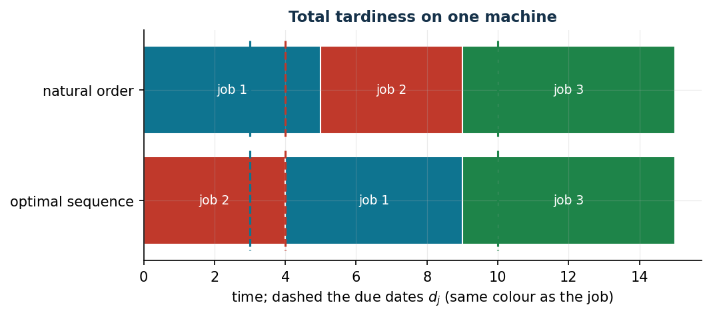

# Total tardiness on one machine: sequencing with big-M

**Class:** MILP · **Links:** big-M and disjunctions, maximum variable · **Script:** `python/fam07_7_tardiness.py`

[](https://colab.research.google.com/github/fabiofurini/mip-modelling/blob/main/notebooks/fam07_7_tardiness.ipynb)

!!! abstract "Problem 7.7"
    A company needs to execute $n$ jobs on a single machine. For each job
    $j$, $t_j$ is the processing time and $d_j$ the due date. The tardiness
    is $\tau_j = \max\{0, \kappa_j - d_j\}$, where $\kappa_j$ is the
    completion time. The machine processes one job at a time. Minimise the
    total tardiness.

**The problem in words.** *We decide* the order of the jobs. *The
objective*: sum of the tardiness values. *The constraints*: for every pair,
one precedes the other; whoever comes later finishes at least $t$ minutes
after the completion of whoever comes first. A **disjunction** ("either $j$
before $i$ or $i$ before $j$"): linearised with a binary variable and a
big-M.

## Model

**Variables.** $n(n-1)$ binary precedences $s_{ji}$ ($j$ precedes $i$) and
$2n$ continuous: completions $\kappa_j$ and tardiness $\tau_j$;
$M = \sum_j t_j$.

$$
\begin{aligned}
\min ~~ \sum_{j=1}^{n} \tau_j & & \\
\text{subject to} \quad s_{ji} + s_{ij} &= 1, & \forall j < i, \\
-M\, s_{ji} - \kappa_j + \kappa_i &\ge t_i - M, & \forall j \ne i, \\
-\kappa_j + \tau_j &\ge -d_j, & \forall j, \\
\kappa_j &\ge t_j, & \forall j, \\
s_{ji} \in \{0, 1\},\quad \kappa_j \ge 0,\quad \tau_j &\ge 0. &
\end{aligned}
$$

- the objective minimises the total tardiness;
- the **order** constraints: either $j$ precedes $i$ or vice versa
  ($n(n-1)/2$);
- the **precedence** constraints with the big-M: if $j$ precedes $i$, $i$
  finishes at least $t_i$ after $\kappa_j$ ($n(n-1)$); $M = \sum_j t_j$
  suffices because there exists an optimal sequence with no idle time;
- the **tardiness** constraints, with $\tau_j \ge 0$, define the tardiness
  ($n$);
- the **start** constraints: $\kappa_j \ge t_j$ ($n$);
- the domain constraints.

!!! note "Link between the variables"
    **Precedence (big-M).** $s_{ji} = 1 \Rightarrow \kappa_i \ge \kappa_j + t_i$,
    contrapositive $\kappa_i < \kappa_j + t_i \Rightarrow s_{ji} = 0$. The
    constraint $\kappa_i \ge \kappa_j + t_i - M(1 - s_{ji})$: with $s_{ji} = 1$
    imposes the precedence; with $s_{ji} = 0$ becomes
    $\kappa_i \ge \kappa_j + t_i - M$, always true because the right-hand side
    is $\le t_i \le \kappa_i$ when completions stay within $M$. The big-M
    "switches off" the constraint.

    **Tardiness (maximum).** $\tau_j \ge \max\{0, \kappa_j - d_j\}$ is imposed
    directly by the two constraints (no implication: the link *is* the
    inequality). The optimality implication
    $\kappa_j \le d_j \Rightarrow \tau_j = 0$ follows from the objective:
    lowering $\tau_j$ to $0$ stays feasible and reduces the objective.
    Synthesis: in every optimum $\tau_j = \max\{0, \kappa_j - d_j\}$.

## The model in gurobipy

```python
M = sum(t)
m = gp.Model("tardiness");  m.Params.OutputFlag = 0
s = m.addVars([(j, i) for j in range(n) for i in range(n) if j != i],
              vtype=GRB.BINARY, name="s")
kappa = m.addVars(n, name="kappa");  tau = m.addVars(n, name="tau")
m.setObjective(tau.sum(), GRB.MINIMIZE)
m.addConstrs((s[j, i] + s[i, j] == 1 for j in range(n) for i in range(j + 1, n)),
             name="order")
m.addConstrs((-M * s[j, i] - kappa[j] + kappa[i] >= t[i] - M
              for j in range(n) for i in range(n) if j != i), name="precedence")
m.addConstrs((-kappa[j] + tau[j] >= -d[j] for j in range(n)), name="tardiness")
m.addConstrs((kappa[j] >= t[j] for j in range(n)), name="start")
m.optimize()
```

## The instance

$n = 3$, $M = 15$.

| | $j=1$ | $j=2$ | $j=3$ |
|---|---:|---:|---:|
| $t_j$ | 5 | 4 | 6 |
| $d_j$ | 3 | 4 | 10 |

## Constructive heuristic: upper bound

Given order $1 \to 2 \to 3$:

- **Step 1.** $\kappa_1 = 5$, $\tau_1 = \max\{0, 5 - 3\} = 2$.
- **Step 2.** $\kappa_2 = 9$, $\tau_2 = 5$.
- **Step 3.** $\kappa_3 = 15$, $\tau_3 = 5$.

Value $12$: $z(\mathrm{MILP}) \le 12$.

## LP relaxation and dual: lower bound

With $\alpha_{ji}$ free (order), $\beta_{ji} \ge 0$ (precedence),
$\gamma_j \ge 0$ (tardiness), $\delta_j \ge 0$ (start):

$$
\begin{aligned}
\max ~~ \sum_{j<i} \alpha_{ji} + \sum_{j \ne i} (t_i - M)\, \beta_{ji} - \sum_j d_j\, \gamma_j + \sum_j t_j\, \delta_j & & \\
\text{subject to} \quad \alpha_{ji} - M\, \beta_{ji} \le 0,\quad \alpha_{ji} - M\, \beta_{ij} &\le 0, & \forall j < i, \\
-\sum_{i \ne j} \beta_{ji} + \sum_{i \ne j} \beta_{ij} - \gamma_j + \delta_j &\le 0, & \forall j, \\
\gamma_j &\le 1, & \forall j.
\end{aligned}
$$

**A hand-built dual solution.** The $\beta$ have negative coefficient: at
zero, then $\alpha = 0$; left are $\delta_j \le \gamma_j \le 1$ and every job
contributes at most $t_j - d_j$, positive only if late even processed first:
only job 1. $\bar\gamma_1 = \bar\delta_1 = 1$, value $-3 + 5 = 2$:
$2 \le z(\mathrm{MILP}) \le 12$.

**What the solver says.** $z(\mathrm{LP}) = 2$: the relaxation of a big-M
model is extremely weak ($s_{ji} = 1/2$ releases the precedences). Integer
optimum $11$, sequence $2 \to 1 \to 3$: $\tilde\kappa = (9, 4, 15)$,
$\tilde\tau = (6, 0, 5)$.

| $\mathrm{ub}$ | $\mathrm{lb}$ (hand dual) | $z(\mathrm{LP})$ | $z(\mathrm{MILP})$ | heuristic gap |
|---:|---:|---:|---:|---:|
| 12 | 2 | 2 | 11 | $9.1\%$ |



## Additional considerations

- **Transitivity**: $s_{ji} \,\mathtt{AND}\, s_{ik} \Rightarrow s_{jk}$, i.e.
  $s_{ji} + s_{ik} - s_{jk} \le 1$: valid inequalities (a precedence cycle is
  impossible) that cut the $1/2$ solutions of the relaxation.
- $M = \sum_j t_j$ is the smallest value that works in general; larger $M$
  leave the same integer set and a weaker relaxation.

## Additional modelling questions

??? question "7.7.1 — Release dates"
    Job 2 cannot start before time $\rho_2 = 2$.

    ??? success "Solution"
        $\kappa_j \ge \rho_j + t_j$ for every $j$; the big-M must be updated
        to $\max_j \rho_j + \sum_j t_j$ because the machine may idle.
        Optimum $12$: the order $1 \to 2 \to 3$ is optimal again.

??? question "7.7.2 — Minimising the maximum tardiness"
    Minimise the tardiness of the latest job.

    ??? success "Solution"
        $T \ge \tau_j$ for every $j$ and $\min\ T$ (min-max). The $\tau_j$
        leave the objective: "$\tau_j = \max\{0, \kappa_j - d_j\}$ in every
        optimum" falls, it remains true there exists an optimum with the
        $\tau_j$ at their minimum. Optimal maximum tardiness $5$.

## Code

Full script: [`python/fam07_7_tardiness.py`](https://github.com/fabiofurini/mip-modelling/blob/main/python/fam07_7_tardiness.py);
notebook: [`notebooks/fam07_7_tardiness.ipynb`](https://github.com/fabiofurini/mip-modelling/blob/main/notebooks/fam07_7_tardiness.ipynb).
