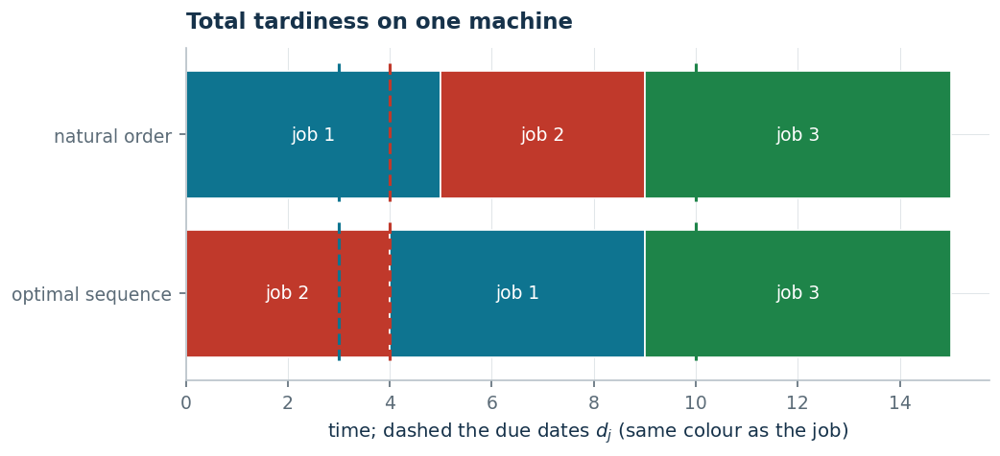

# Total tardiness on one machine: sequencing with big-M

**Class:** MILP · **Links:** big-M and disjunctions, maximum variable · **Script:** `python/fam07_7_tardiness.py`<br>
**Difficulty:** ★★★ · **Time:** 45–60 min
{ .scheda }

[](https://colab.research.google.com/github/fabiofurini/mip-modelling/blob/main/notebooks/fam07_7_tardiness.ipynb)

!!! abstract "Problem 7.7"
    A company needs to execute $n$ jobs on a single machine. For each job
    $j$, $t_j$ is the processing time and $d_j$ the due date. The tardiness
    is $\tau_j = \max\{0, \kappa_j - d_j\}$, where $\kappa_j$ is the
    completion time. The machine processes one job at a time. Minimise the
    total tardiness.

**The problem in words.** *We decide* the order of the jobs. *The
objective*: sum of the tardiness values. *The constraints*: for every pair,
one precedes the other; whoever comes later finishes at least $t$ minutes
after the completion of whoever comes first. A **disjunction** ("either $j$
before $i$ or $i$ before $j$"): linearised with a binary variable and a
big-M.

## Model

**Variables.** $n(n-1)$ binary precedences $s_{ji}$ ($j$ precedes $i$) and
$2n$ continuous: completions $\kappa_j$ and tardiness $\tau_j$;
$M = \sum_j t_j$.

<!-- model: 7.7 -->

$$
\begin{aligned}
\min ~~ \sum_{j=1}^{n} \tau_j & & \\
\text{subject to} \quad s_{ji} + s_{ij} &= 1, & \forall j, i \in \{1, 2, \dots, n\},\ j < i, \\
-M\, s_{ji} - \kappa_j + \kappa_i &\ge t_i - M, & \forall j, i \in \{1, 2, \dots, n\},\ j \ne i, \\
-\kappa_j + \tau_j &\ge -d_j, & \forall j \in \{1, 2, \dots, n\}, \\
\kappa_j &\ge t_j, & \forall j \in \{1, 2, \dots, n\}, \\
s_{ji} &\in \{0, 1\}, & \forall j, i \in \{1, 2, \dots, n\},\ j \ne i, \\
\kappa_j &\ge 0, & \forall j \in \{1, 2, \dots, n\}, \\
\tau_j &\ge 0, & \forall j \in \{1, 2, \dots, n\}.
\end{aligned}
$$

<!-- model: end -->

- the objective minimises the total tardiness;
- the **order** constraints: either $j$ precedes $i$ or vice versa
  ($n(n-1)/2$);
- the **precedence** constraints with the big-M: if $j$ precedes $i$, $i$
  finishes at least $t_i$ after $\kappa_j$ ($n(n-1)$); $M = \sum_j t_j$
  suffices because there exists an optimal sequence with no idle time;
- the **tardiness** constraints, with $\tau_j \ge 0$, define the tardiness
  ($n$);
- the **start** constraints: $\kappa_j \ge t_j$ ($n$);
- the domain constraints.

!!! note "Link between the variables"
    **Precedence (big-M).** $s_{ji} = 1 \Rightarrow \kappa_i \ge \kappa_j + t_i$,
    contrapositive $\kappa_i < \kappa_j + t_i \Rightarrow s_{ji} = 0$. The
    constraint $\kappa_i \ge \kappa_j + t_i - M(1 - s_{ji})$: with $s_{ji} = 1$
    imposes the precedence; with $s_{ji} = 0$ becomes
    $\kappa_i \ge \kappa_j + t_i - M$, always true because the right-hand side
    is $\le t_i \le \kappa_i$ when completions stay within $M$. The big-M
    "switches off" the constraint.

    **Tardiness (maximum).** $\tau_j \ge \max\{0, \kappa_j - d_j\}$ is imposed
    directly by the two constraints (no implication: the link *is* the
    inequality). The optimality implication
    $\kappa_j \le d_j \Rightarrow \tau_j = 0$ follows from the objective:
    lowering $\tau_j$ to $0$ stays feasible and reduces the objective.
    Synthesis: in every optimum $\tau_j = \max\{0, \kappa_j - d_j\}$.

## The model in gurobipy

```python
M = sum(t)
m = gp.Model("tardiness");  m.Params.OutputFlag = 0
s = m.addVars([(j, i) for j in range(n) for i in range(n) if j != i],
              vtype=GRB.BINARY, name="s")
kappa = m.addVars(n, name="kappa");  tau = m.addVars(n, name="tau")
m.setObjective(tau.sum(), GRB.MINIMIZE)
m.addConstrs((s[j, i] + s[i, j] == 1 for j in range(n) for i in range(j + 1, n)),
             name="order")
m.addConstrs((-M * s[j, i] - kappa[j] + kappa[i] >= t[i] - M
              for j in range(n) for i in range(n) if j != i), name="precedence")
m.addConstrs((-kappa[j] + tau[j] >= -d[j] for j in range(n)), name="tardiness")
m.addConstrs((kappa[j] >= t[j] for j in range(n)), name="start")
m.optimize()
```

## The instance

$n = 3$, $M = 15$.

| | $j=1$ | $j=2$ | $j=3$ |
|---|---:|---:|---:|
| $t_j$ | 5 | 4 | 6 |
| $d_j$ | 3 | 4 | 10 |

## Constructive heuristic: the primal bound

Given order $1 \to 2 \to 3$:

- **Step 1.** $\kappa_1 = 5$, $\tau_1 = \max\{0, 5 - 3\} = 2$.
- **Step 2.** $\kappa_2 = 9$, $\tau_2 = 5$.
- **Step 3.** $\kappa_3 = 15$, $\tau_3 = 5$.

Value $12$: $z(\mathit{MILP}) \le 12$.

## LP relaxation and dual: the dual bound

With $\alpha_{ji}$ free (order), $\beta_{ji} \ge 0$ (precedence),
$\gamma_j \ge 0$ (tardiness), $\delta_j \ge 0$ (start):

<!-- model: 7.7-dual -->

$$
\begin{aligned}
\max ~~ \sum_{j<i} \alpha_{ji} + \sum_{j \ne i} (t_i - M)\, \beta_{ji} & & \\
\qquad\qquad - \sum_{j=1}^{n} d_j\, \gamma_j + \sum_{j=1}^{n} t_j\, \delta_j & & \\
\text{subject to} \quad \alpha_{ji} - M\, \beta_{ji} &\le 0, & \forall i, j \in \{1, 2, \dots, n\},\ j < i, \\
\alpha_{ji} - M\, \beta_{ij} &\le 0, & \forall i, j \in \{1, 2, \dots, n\},\ j < i, \\
-\sum_{i \ne j} \beta_{ji} + \sum_{i \ne j} \beta_{ij} - \gamma_j + \delta_j &\le 0, & \forall j \in \{1, 2, \dots, n\}, \\
\gamma_j &\le 1, & \forall j \in \{1, 2, \dots, n\}, \\
\alpha_{ji} &\gtreqless 0, & \forall i, j \in \{1, 2, \dots, n\},\ j < i, \\
\beta_{ji} &\ge 0, & \forall i, j \in \{1, 2, \dots, n\},\ j \ne i, \\
\gamma_j &\ge 0, & \forall j \in \{1, 2, \dots, n\}, \\
\delta_j &\ge 0, & \forall j \in \{1, 2, \dots, n\}.
\end{aligned}
$$

<!-- model: end -->

**A hand-built dual solution.** The $\beta$ have negative coefficient: at
zero, then $\alpha = 0$; left are $\delta_j \le \gamma_j \le 1$ and every job
contributes at most $t_j - d_j$, positive only if late even processed first:
only job 1. $\bar\gamma_1 = \bar\delta_1 = 1$, value $-3 + 5 = 2$:
$2 \le z(\mathit{MILP}) \le 12$.

**What the solver says.** $z(\mathit{LP}) = 2$: the relaxation of a big-M
model is extremely weak ($s_{ji} = 1/2$ releases the precedences). Integer
optimum $11$, sequence $2 \to 1 \to 3$: $\tilde\kappa = (9, 4, 15)$,
$\tilde\tau = (6, 0, 5)$.

| $UB$ | $LB$ (hand dual) | $z(\mathit{LP})$ | $z(\mathit{MILP})$ | heuristic gap |
|---:|---:|---:|---:|---:|
| 12 | 2 | 2 | 11 | $9.1\%$ |



## Additional considerations

- **Transitivity**: $s_{ji} \,\mathtt{AND}\, s_{ik} \Rightarrow s_{jk}$, i.e.
  $s_{ji} + s_{ik} - s_{jk} \le 1$: valid inequalities (a precedence cycle is
  impossible) that cut the $1/2$ solutions of the relaxation.
- $M = \sum_j t_j$ is the smallest value that works in general; larger $M$
  leave the same integer set and a weaker relaxation.

## Additional modelling questions

??? question "7.7.1 — Release dates"
    Job 2 cannot start before time $\rho_2 = 2$.

??? question "7.7.2 — Minimising the maximum tardiness"
    Minimise the tardiness of the latest job.

## The sandwich on variant 7a

The release dates add $\varepsilon_j \ge 0$ with right-hand side $\rho_j + t_j$.
With $\gamma_j = 1$, the column of $\kappa_j$ imposes
$\delta_j + \varepsilon_j \le 1$: it pays to put all the weight on
$\varepsilon_j$, that is, the release replaces the processing time.

<!-- tabella-variante: fam07_7a_bound -->

|  | value | what it is |
|---|---:|---|
| $\mathit{UB}$ | $12$ | heuristic solution |
| $\mathit{LB}$ | $2$ | dual certificate built by hand |
| $z(\mathit{LP})$ | $4$ | relaxation without the bounds |
| $z(\mathit{LP}^+)$ | $4$ | relaxation with the bounds |
| $z(\mathit{MILP})$ | $12$ | optimum of the MILP |

<!-- tabella-variante: fine -->

## Code

Full script: [`python/fam07_7_tardiness.py`](https://github.com/fabiofurini/mip-modelling/blob/main/python/fam07_7_tardiness.py);
notebook: [`notebooks/fam07_7_tardiness.ipynb`](https://github.com/fabiofurini/mip-modelling/blob/main/notebooks/fam07_7_tardiness.ipynb).

<!-- embedded-script: begin (regenerated by python/embed_code.py) -->

??? example "Show the complete script — `python/fam07_7_tardiness.py` (235 lines)"

    ```python
    """Problem 7.7 -- Total tardiness on one machine: sequencing with big-M.

    The disjunction "either j before i or i before j" linearised with a binary
    variable and the smallest big-M justifiable from the data (M = sum of the
    times).
    """
    import gurobipy as gp
    import numpy as np
    import pandas as pd
    from gurobipy import GRB

    from euristiche import best_fit, first_fit, matrice, next_fit
    from mip import (ammissibile, dualita_forte, due_rilassamenti, frazione,
                     nuovo_modello, registra_bound, rilassamenti, risolvi,
                     stampa_soluzione, valuta)
    from stile import CICLO, ROSSO, intestazione, plt, salva_dati, salva_figura
    from esteso import salva_modello

    R = range

    # ---------- 1. MODEL AND INSTANCE ----------
    t7 = [5, 4, 6]
    d7 = [3, 4, 10]
    salva_dati(pd.DataFrame({"job": R(1, 4), "t": t7, "d": d7}), "fam07_7_lavori")


    def modello_7(t, d):
        n = len(t)
        M = sum(t)
        m = nuovo_modello("ritardo")
        s = m.addVars([(j, i) for j in R(n) for i in R(n) if j != i], vtype=GRB.BINARY, name="s")
        kappa = m.addVars(n, name="kappa")
        tau = m.addVars(n, name="tau")
        m.setObjective(tau.sum(), GRB.MINIMIZE)
        m.addConstrs((s[j, i] + s[i, j] == 1 for j in R(n) for i in R(j + 1, n)), name="ordine")
        m.addConstrs((-M * s[j, i] - kappa[j] + kappa[i] >= t[i] - M for j in R(n) for i in R(n) if j != i),
                     name="precedenza")
        m.addConstrs((-kappa[j] + tau[j] >= -d[j] for j in R(n)), name="ritardo")
        m.addConstrs((kappa[j] >= t[j] for j in R(n)), name="inizio")
        return m, s, kappa, tau, M


    def duale_7(t, d):
        """Dual with alpha (free), beta, gamma, delta >= 0 — see the lecture notes."""
        n = len(t)
        M = sum(t)
        D = nuovo_modello("duale_ritardo")
        alpha = D.addVars([(j, i) for j in R(n) for i in R(j + 1, n)], lb=-GRB.INFINITY, name="alpha")
        beta = D.addVars([(j, i) for j in R(n) for i in R(n) if j != i], name="beta")
        gamma = D.addVars(n, name="gamma")
        delta = D.addVars(n, name="delta")
        D.setObjective(alpha.sum() + gp.quicksum((t[i] - M) * beta[j, i] for (j, i) in beta)
                       - gp.quicksum(d[j] * gamma[j] for j in R(n)) + gp.quicksum(t[j] * delta[j] for j in R(n)),
                       GRB.MAXIMIZE)
        D.addConstrs((alpha[j, i] - M * beta[j, i] <= 0 for (j, i) in alpha), name="rc_s_ji")
        D.addConstrs((alpha[j, i] - M * beta[i, j] <= 0 for (j, i) in alpha), name="rc_s_ij")
        D.addConstrs((-gp.quicksum(beta[j, i] for i in R(n) if i != j) + gp.quicksum(beta[i, j] for i in R(n) if i != j)
                      - gamma[j] + delta[j] <= 0 for j in R(n)), name="rc_kappa")
        D.addConstrs((gamma[j] <= 1 for j in R(n)), name="rc_tau")
        return D


    def euristica_7(t, d, ordine=None):
        """Sequence in the given order (natural if absent): completions and tardiness."""
        n = len(t)
        ordine = list(R(n)) if ordine is None else ordine
        kappa, tau, fine, passi = [0] * n, [0] * n, 0, []
        for j in ordine:
            fine += t[j]
            kappa[j] = fine
            tau[j] = max(0, fine - d[j])
            passi.append(f"Job {j + 1}: kappa = {fine}, tau = max(0, {fine} - {d[j]}) = {tau[j]}.")
        return kappa, tau, passi


    m7, s7, k7, tau7, M7 = modello_7(t7, d7)
    salva_modello(m7, "fam07_7_primale")

    # ---------- 2. THE LP RELAXATION ----------
    zlp7, zlp7r, _ = rilassamenti(m7)

    # ---------- 3. THE DUAL OF THE RELAXATION (LOWER BOUND) ----------
    D7 = duale_7(t7, d7)
    salva_modello(D7, "fam07_7_duale")
    lb7, viol = valuta(D7, {"gamma[0]": 1, "delta[0]": 1})
    assert viol <= 1e-9
    print(f"Hand-built dual solution: gamma_1 = 1, delta_1 = 1, all the rest 0  ->  lb = {frazione(lb7)}")
    dualita_forte(D7, zlp7)

    # ---------- 4. CONSTRUCTIVE HEURISTIC (UPPER BOUND) ----------
    print(f"Big-M = sum of the times = {M7}")
    kappa_e, tau_e, passi = euristica_7(t7, d7)
    print("Heuristic: natural order 1 -> 2 -> 3")
    for i, s in enumerate(passi, 1):
        print(f"  Step {i}. {s}")
    ub7 = sum(tau_e)
    print(f"  ub = {ub7}")

    # ---------- 5. OPTIMAL SOLUTION OF THE MILP ----------
    z7 = risolvi(m7)
    print("Optimal solution of the MILP:")
    stampa_soluzione(m7, solo_non_nulle=True)
    riga = registra_bound("7 tardiness", ub7, lb7, zlp7, zlp7r, z7)
    salva_dati(pd.DataFrame([riga]), "fam07_7_bound")
    ordine_ott = sorted(R(3), key=lambda j: k7[j].X)
    riga = registra_bound("7 tardiness", ub7, lb7, zlp7, zlp7r, z7)
    salva_dati(pd.DataFrame([riga]), "fam07_7_bound")
    print("Optimal sequence:", " -> ".join(str(j + 1) for j in ordine_ott))

    # ---------- 6. ADDITIONAL MODELLING QUESTIONS ----------


    varianti = {}


    def variante(nome, m):
        z = risolvi(m)
        print(f"  {nome:70s} z = {frazione(z)}")
        return z

    # 7a: release dates
    rho7 = [0, 2, 0]
    m, s, kappa, tau, M = modello_7(t7, d7)
    m.addConstrs((kappa[j] >= rho7[j] + t7[j] for j in R(3)), name="release")
    varianti["7a"] = variante("7a. Job 2 available from time 2 (kappa_j >= rho_j + t_j)", m)
    # 7b: minimise the maximum tardiness
    m, s, kappa, tau, M = modello_7(t7, d7)
    T = m.addVar(name="T")
    m.addConstrs((T >= tau[j] for j in R(3)), name="max_tardiness")
    m.setObjective(T, GRB.MINIMIZE)
    varianti["7b"] = variante("7b. Minimise the maximum tardiness (min-max: T >= tau_j)", m)
    salva_dati(pd.DataFrame({"variant": list(varianti), "z": list(varianti.values())}), "fam07_7_varianti")

    # ---------- 7. THE SANDWICH ON THE VARIANT 7a ----------
    intestazione("7a. The sandwich on the variant: release dates")


    def modello_7a(t, d, rho):
        mm_, ss, kk, tt, MM = modello_7(t, d)
        mm_.addConstrs((kk[j] >= rho[j] + t[j] for j in R(len(t))), name="rilascio")
        return mm_, ss, kk, tt, MM


    def duale_7a(t, d, rho):
        """To the dual of 7.7 one adds eps_j >= 0 for every release constraint
        kappa_j >= rho_j + t_j: it enters the objective with its right-hand side
        and the column of kappa_j next to delta_j."""
        nn = len(t)
        MM = sum(t)
        D = nuovo_modello("duale_ritardo_7a")
        alpha = D.addVars([(j, i) for j in R(nn) for i in R(j + 1, nn)], lb=-GRB.INFINITY, name="alpha")
        beta = D.addVars([(j, i) for j in R(nn) for i in R(nn) if j != i], name="beta")
        gamma = D.addVars(nn, name="gamma")
        delta = D.addVars(nn, name="delta")
        eps = D.addVars(nn, name="eps")
        D.setObjective(alpha.sum() + gp.quicksum((t[i] - MM) * beta[j, i] for (j, i) in beta)
                       - gp.quicksum(d[j] * gamma[j] for j in R(nn))
                       + gp.quicksum(t[j] * delta[j] for j in R(nn))
                       + gp.quicksum((rho[j] + t[j]) * eps[j] for j in R(nn)), GRB.MAXIMIZE)
        D.addConstrs((alpha[j, i] - MM * beta[j, i] <= 0 for (j, i) in alpha), name="rc_s_ji")
        D.addConstrs((alpha[j, i] - MM * beta[i, j] <= 0 for (j, i) in alpha), name="rc_s_ij")
        D.addConstrs((-gp.quicksum(beta[j, i] for i in R(nn) if i != j)
                      + gp.quicksum(beta[i, j] for i in R(nn) if i != j)
                      - gamma[j] + delta[j] + eps[j] <= 0 for j in R(nn)), name="rc_kappa")
        D.addConstrs((gamma[j] <= 1 for j in R(nn)), name="rc_tau")
        return D


    m7a, s7a, k7a, tau7a, M7a = modello_7a(t7, d7, rho7)
    salva_modello(m7a, "fam07_7a_primale")

    # -- feasible heuristic: the same rule, with the release dates --
    print("Constructive heuristic: the jobs in order of due date (EDD), each started as soon as")
    print("the machine is free and the job has been released.")
    istante = 0
    ritardi = {}
    for j in sorted(R(3), key=lambda j: d7[j]):
        inizio = max(istante, rho7[j])
        fine = inizio + t7[j]
        ritardi[j] = max(0, fine - d7[j])
        print(f"  job {j + 1}: released at {rho7[j]}, starts at {inizio}, ends at {fine}, "
              f"due date {d7[j]}  ->  tardiness {ritardi[j]}")
        istante = fine
    ub7a = sum(ritardi.values())
    ordine = sorted(R(3), key=lambda j: d7[j])
    fine_cum, kappa_e7a = 0, {}
    for j in ordine:
        fine_cum = max(fine_cum, rho7[j]) + t7[j]
        kappa_e7a[j] = fine_cum
    sol_7a = ({f"kappa[{j}]": kappa_e7a[j] for j in R(3)}
              | {f"tau[{j}]": ritardi[j] for j in R(3)}
              | {f"s[{j},{i}]": (1 if ordine.index(j) < ordine.index(i) else 0)
                 for j in R(3) for i in R(3) if j != i})
    assert ammissibile(m7a, sol_7a), "the heuristic solution of the variant must be feasible"
    print(f"  ub = {frazione(ub7a)}")

    # -- dual certificate: the release replaces the processing time --
    D7a = duale_7a(t7, d7, rho7)
    salva_modello(D7a, "fam07_7a_duale")
    # one job at a time: gamma_j = 1 and all the weight on eps_j, which is worth rho_j + t_j
    # instead of t_j; the job giving the highest value is kept
    candidato = max(R(3), key=lambda j: rho7[j] + t7[j] - d7[j])
    mano_7a = {f"gamma[{candidato}]": 1, f"eps[{candidato}]": 1}
    lb7a, viol_7a = valuta(D7a, mano_7a)
    assert viol_7a <= 1e-9, viol_7a
    print("Dual solution by hand: a single job is priced. With gamma_j = 1, the constraint")
    print("  of the column of kappa_j gives delta_j + eps_j <= 1, and it pays to put all the")
    print("  weight on eps_j, which in the objective is worth rho_j + t_j instead of t_j. One picks")
    print(f"  the job with the largest rho_j + t_j - d_j: job {candidato + 1}, which gives")
    print(f"  {rho7[candidato]} + {t7[candidato]} - {d7[candidato]} = {frazione(lb7a)}.")
    zlp7a, zlp7ar, _ = due_rilassamenti(m7a, D7a)
    z7a = risolvi(m7a)
    riga_7a = registra_bound("7a release dates", ub7a, lb7a, zlp7a, zlp7ar, z7a)
    salva_dati(pd.DataFrame([riga_7a]), "fam07_7a_bound")
    assert lb7a <= zlp7a <= z7a <= ub7a + 1e-9

    # ---------- 8. FIGURES ----------
    # tardiness: Gantt of the natural and of the optimal sequence
    fig, ax = plt.subplots(figsize=(7.2, 3.0))
    for riga, (etichetta, ordine) in enumerate([("natural order (ub = 12)", list(R(3))),
                                                 (f"optimal sequence (z = {frazione(z7)})", ordine_ott)]):
        fine = 0
        for j in ordine:
            ax.barh(riga, t7[j], left=fine, color=CICLO[j], edgecolor="white")
            ax.text(fine + t7[j] / 2, riga, f"job {j + 1}", ha="center", va="center", color="white", fontsize=9)
            fine += t7[j]
            ax.plot([d7[j], d7[j]], [riga - 0.45, riga + 0.45], color=CICLO[j], lw=1.5, ls="--")
    ax.set_yticks([0, 1])
    ax.set_yticklabels(["natural order", "optimal sequence"])
    ax.set_xlabel("time; dashed the due dates $d_j$ (same colour as the job)")
    ax.set_title("Total tardiness on one machine")
    ax.invert_yaxis()
    salva_figura(fig, "cap07_ritardo_gantt")

    print("Done.")
    ```

<!-- embedded-script: end -->
