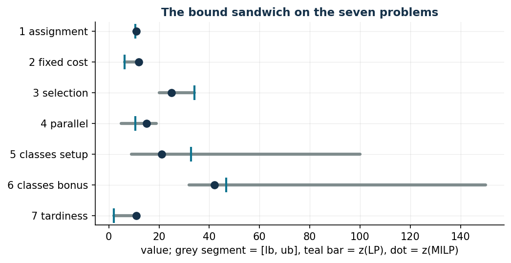

# Assignment and scheduling

**Class:** BIP / MILP · **Script:** `python/fam07_scheduling.py`

Seven problems with the same skeleton: some **jobs** must be assigned to some
**machines** with limited availability. What changes from problem to problem is
what is paid and what is decided: the cost of the assignment, the fixed cost of
every machine switched on, the revenue of the jobs one chooses to execute, the
processing time when jobs run in parallel, the setup of a class of jobs, a bonus
collected *if and only if* a class is complete, the tardiness with respect to the
due dates when the jobs follow one another on a single machine.

!!! note "The links between variables revisited here"
    **Activation** (7.2, 7.3, 7.5): the binary "machine used" or "class
    activated" that drives the assignments, with the aggregated constraint
    $\sum_j t_{jm} x_{jm} \le a_m y_m$ or the disaggregated one $x_j \le y_c$.
    **Maximum variable** (7.4): $y_m \ge t_{jm} x_{jm}$ for every job, which at
    the optimum equals exactly the maximum. **If and only if** (7.6): one
    direction is imposed by the constraint, the other by the objective. **Big-M
    and disjunctions** (7.7): "either $j$ before $i$ or $i$ before $j$", with $M$
    equal to the sum of the times.

## Notation of the family

| Symbol | Type | Meaning |
|---|---|---|
| $n$ | $\in \mathbb{Z}_{\ge 1}$ | number of jobs, $j \in \{1, 2, \dots, n\}$ |
| $k$ | $\in \mathbb{Z}_{\ge 1}$ | number of machines, $m \in \{1, 2, \dots, k\}$ |
| $t_{jm}$ | $\in \mathbb{Q}_{>0}$ | processing time (minutes) of job $j$ on machine $m$; $t_j$ if it does not depend on the machine |
| $c_{jm}$ | $\in \mathbb{Q}_{>0}$ | cost (euros) of executing job $j$ on machine $m$ |
| $c_m$ | $\in \mathbb{Q}_{>0}$ | fixed cost (euros) if machine $m$ is used |
| $a_m$ | $\in \mathbb{Q}_{>0}$ | availability (minutes) of machine $m$; $a$ if there is a single machine |
| $p_m$ | $\in \mathbb{Z}_{\ge 1}$ | maximum number of jobs machine $m$ can execute |
| $r_j$ | $\in \mathbb{Q}_{>0}$ | revenue (euros) if job $j$ is executed |
| $d_j$ | $\in \mathbb{Q}_{>0}$ | due date (minutes) of job $j$ |
| $q$ | $\in \mathbb{Z}_{\ge 2}$ | number of job classes, $c \in \{1, 2, \dots, q\}$ |
| $\mathscr{J}_c$ | $\subseteq \{1, 2, \dots, n\}$ | jobs of class $c$; the classes partition the jobs |
| $f_c,\ s_c$ | $\in \mathbb{Q}_{\ge 0}$ | setup cost (euros) and setup time (minutes) of class $c$ |
| $v_c$ | $\in \mathbb{Q}_{>0}$ | bonus (euros) if all the jobs of class $c$ are executed |
| $u$ | $\in \mathbb{Q}_{>0}$ | reduction (minutes) of the availability if jobs of at least two classes are executed |

## The seven problems

-   **7.1 Minimum-cost assignment**

    ---

    Every job on one machine, availability respected, minimum cost: the
    generalised assignment problem. A single family of variables.

    [:octicons-arrow-right-24: BIP](scheduling-1.md)

-   **7.2 Machines with fixed cost**

    ---

    The machine switched on is paid, not the assignment: activation variables
    are born, and the first link to prove.

    [:octicons-arrow-right-24: BIP · activation](scheduling-2.md)

-   **7.3 Job selection**

    ---

    Jobs have a revenue and are not compulsory: a maximisation problem, where
    heuristic and dual swap roles.

    [:octicons-arrow-right-24: BIP · activation](scheduling-3.md)

-   **7.4 Parallel jobs**

    ---

    The time of a machine is the maximum of the times of its jobs: the
    "maximum" variable and its three-step characterisation.

    [:octicons-arrow-right-24: MILP · maximum](scheduling-4.md)

-   **7.5 Classes with setup**

    ---

    A knapsack with fixed costs and times per group: the disaggregated
    activation, derived from the CNF of a Boolean implication.

    [:octicons-arrow-right-24: BIP · activation, CNF](scheduling-5.md)

-   **7.6 Classes with bonus**

    ---

    A bonus if the class is complete, a penalty if classes are mixed: two "if
    and only if"s, each imposed half by the constraints and half by the optimum.

    [:octicons-arrow-right-24: BIP · if and only if](scheduling-6.md)

-   **7.7 Total tardiness**

    ---

    A single machine, a sequence: binary precedences, completions, tardiness
    and the big-M that "switches off" a constraint.

    [:octicons-arrow-right-24: MILP · big-M](scheduling-7.md)

## The picture of the bounds

| Problem | heuristic | hand dual | $z(\mathrm{LP})$ | $z(\mathrm{LP}^+)$ | $z(\mathrm{MILP})$ |
|---|---:|---:|---:|---:|---:|
| 7.1 minimum-cost assignment | 11 | 10 | $53/5$ | $53/5$ | 11 |
| 7.2 machines with fixed cost | 12 | $25/4$ | $25/4$ | $1273/200$ | 12 |
| 7.3 job selection (max) | 20 | 34 | 34 | $680/21$ | 25 |
| 7.4 parallel jobs | 19 | 5 | $520/49$ | $520/49$ | 15 |
| 7.5 classes with setup (max) | 9 | 100 | $425/13$ | $329/13$ | 21 |
| 7.6 classes with bonus (max) | 32 | 150 | $5280/113$ | $5280/113$ | 42 |
| 7.7 total tardiness | 12 | 2 | 2 | 2 | 11 |

$z(\mathrm{LP})$ is the "pure" relaxation, where $x \in \{0,1\}$ becomes
$x \ge 0$: it is the one whose dual is written in the exercises, and its
optimum coincides with the optimum of the dual (strong duality).
$z(\mathrm{LP}^+)$ is the relaxation strengthened with $x \le 1$, the one the
solver solves at the root. In problems 7.2 and 7.3 the hand-built dual solution
is *optimal* for the pure relaxation; in problems 7.1 and 7.2 the heuristic
finds the optimum, but one knows it only after solving the MILP.

